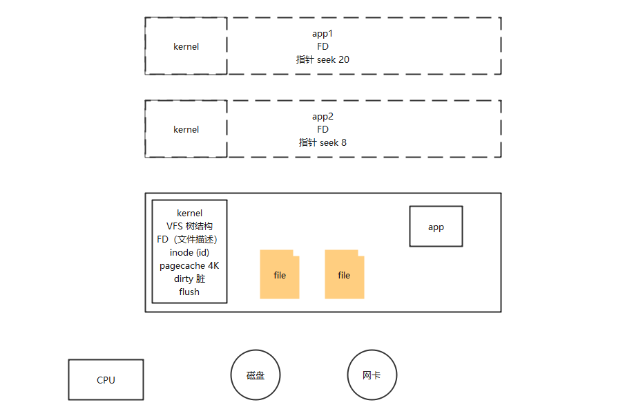

# 操作系统宏观介绍


**kernel：**内核
**VFS：**虚拟文件系统（Virtual File System，简称VFS）是Linux内核的子系统之一，它为用户程序提供文件和文件系统操作的统一接口，屏蔽不同文件系统的差异和操作细节。借助VFS可以直接使用`open()`、`read()`、`write()`这样的系统调用操作文件，而无须考虑具体的文件系统和实际的存储介质。
**FD：**文件描述符（file descriptor），文件描述符是交给程序用的。
**inode：**每个inode都有一个号码，操作系统用inode号码来识别不同的文件。
**pagecache：**缓存，默认是4K。将文件内容从磁盘读取到内存中，会缓存起来
**dirty：**脏。当多个app应用程序打开了同一个文件，他们是共享同一个内存缓存，如果其中一个应用修改了文件，则会将这个内存缓存标记为脏。（这个脏是kernel对内存的统一管理，不是针对某个文件的）
**flush：**刷新。当标记脏的时候，会有个flush刷新到磁盘的过程，将最新的数据刷新到磁盘。刷新是有两个阈值，一个是时间点阈值，一个是脏的阈值


# 冯诺依曼体系结构

- 计算器
- 控制器
- 主存储器
- 输入设备
- 输出设备

抽象<font color='red'>一切皆文件</font>，基于文件，有读写就有I/O

```shell
# 常用软件：
yum install -y strace lsof  pmap tcpdump 
```

```shell
# VFS:  虚拟文件系统 案例
# 我这个centos给的磁盘是80G，内存是2G

[root@192 ~]# df
文件系统                   1K-块    已用     可用 已用% 挂载点
devtmpfs                  993188       0   993188    0% /dev
tmpfs                    1005244       0  1005244    0% /dev/shm
tmpfs                    1005244    9848   995396    1% /run
tmpfs                    1005244       0  1005244    0% /sys/fs/cgroup
/dev/mapper/centos-root 52403200 1453312 50949888    3% /
/dev/sda1                1038336  153860   884476   15% /boot
/dev/mapper/centos-home 28158532   32992 28125540    1% /home
tmpfs                     201052       0   201052    0% /run/user/0


[root@192 ~]# df -h
文件系统                 容量  已用  可用 已用% 挂载点
devtmpfs                 970M     0  970M    0% /dev
tmpfs                    982M     0  982M    0% /dev/shm
tmpfs                    982M  9.7M  973M    1% /run
tmpfs                    982M     0  982M    0% /sys/fs/cgroup
/dev/mapper/centos-root   50G  1.4G   49G    3% /
/dev/sda1               1014M  151M  864M   15% /boot
/dev/mapper/centos-home   27G   33M   27G    1% /home
tmpfs                    197M     0  197M    0% /run/user/0

[root@192 /]# ll
总用量 16
lrwxrwxrwx.   1 root root    7 10月 14 23:54 bin -> usr/bin
dr-xr-xr-x.   5 root root 4096 10月 15 08:18 boot
drwxr-xr-x.  20 root root 3260 10月 15 08:17 dev
drwxr-xr-x.  75 root root 8192 10月 15 08:40 etc
drwxr-xr-x.   2 root root    6 4月  11 2018 home
lrwxrwxrwx.   1 root root    7 10月 14 23:54 lib -> usr/lib
lrwxrwxrwx.   1 root root    9 10月 14 23:54 lib64 -> usr/lib64
drwxr-xr-x.   2 root root    6 4月  11 2018 media
drwxr-xr-x.   2 root root    6 4月  11 2018 mnt
drwxr-xr-x.   2 root root    6 4月  11 2018 opt
dr-xr-xr-x. 134 root root    0 10月 15 08:17 proc
dr-xr-x---.   2 root root  114 10月 14 23:57 root
drwxr-xr-x.  26 root root  780 10月 15 08:40 run
lrwxrwxrwx.   1 root root    8 10月 14 23:54 sbin -> usr/sbin
drwxr-xr-x.   2 root root    6 4月  11 2018 srv
dr-xr-xr-x.  13 root root    0 10月 15 08:17 sys
drwxrwxrwt.  10 root root  279 10月 15 08:40 tmp
drwxr-xr-x.  13 root root  155 10月 14 23:54 usr
drwxr-xr-x.  19 root root  267 10月 15 00:03 var
```

通过上面发现

根目录 / 是挂载到  /dev/mapper/centos-root 上

/boot 是 挂载到   /dev/sda1 上

那么对于 /boot 目录，/dev/sda1的挂载就会覆盖 /dev/mapper/centos-root 的挂载

```shell
# 看下boot下的文件

[root@192 boot]# ll
总用量 112536
-rw-r--r--. 1 root root   153591 10月 20 2020 config-3.10.0-1160.el7.x86_64
...

# 卸载 /boot目录。卸载完之后 /boot 目录还在，但是里面没有内容了，内容在内存汇总，此时 /boot 是挂载在 /dev/mapper/centos-root 
[root@192 ~]# umount /boot
[root@192 ~]# ll /boot/
总用量 0

# 重新将 /boot 目录挂载到 /dev/sda1 上，/boot里面的内容就又回来了
[root@192 ~]# mount /dev/sda1 /boot
[root@192 ~]# ll  /boot
总用量 112536
-rw-r--r--. 1 root root   153591 10月 20 2020 config-3.10.0-1160.el7.x86_64
...
```

刚才操作的挂载和卸载，目录文件是没有改变的。

**目录树结构趋向于稳定，有一个映射的过程**

##  文件类型

1. -：普通文件（可执行，图片，文件）REG
2. d: 目录
3. l：连接
4. b：块设备
5. c: 字符设备  CHR
6. s：socket
7. p：pipeline
8. [eventpll]:
9. ...


字符设备可以看下 /dev目录下有


### l：连接

连接分为硬连接和软连接

<font color='red'>无论什么连接，修改一方的数据，另一方看到的也是最新数据</font>

硬连接

```shell
[root@192 ~]# vim liufei.txt
adasdas
[root@192 ~]# ln /root/liufei.txt /root/liufei_ln.txt
[root@192 ~]# ll
总用量 12
-rw-------. 1 root root 1204 10月 14 23:57 anaconda-ks.cfg
-rw-r--r--. 2 root root    8 10月 15 09:57 liufei_ln.txt
-rw-r--r--. 2 root root    8 10月 15 09:57 liufei.txt
```

可以看到 liufei_ln.txt 和 liufei.txt两个文件信息中 root 前面的数量是2

```shell
# 看下文件的元数据信息 stat

[root@192 ~]# stat liufei.txt
  文件："liufei.txt"
  大小：8               块：8          IO 块：4096   普通文件
设备：fd00h/64768d      Inode：100687562   硬链接：2
权限：(0644/-rw-r--r--)  Uid：(    0/    root)   Gid：(    0/    root)
环境：unconfined_u:object_r:admin_home_t:s0
最近访问：2022-10-15 09:59:13.196706210 +0800
最近更改：2022-10-15 09:57:41.703176437 +0800
最近改动：2022-10-15 09:58:22.614413325 +0800
创建时间：-
[root@192 ~]# stat liufei_ln.txt
  文件："liufei_ln.txt"
  大小：8               块：8          IO 块：4096   普通文件
设备：fd00h/64768d      Inode：100687562   硬链接：2
权限：(0644/-rw-r--r--)  Uid：(    0/    root)   Gid：(    0/    root)
环境：unconfined_u:object_r:admin_home_t:s0
最近访问：2022-10-15 09:59:13.196706210 +0800
最近更改：2022-10-15 09:57:41.703176437 +0800
最近改动：2022-10-15 09:58:22.614413325 +0800
创建时间：-
```

可以看到，是硬链接，并且Inode值是一样的，都是100687562

**可以理解为两个变量名，指向了同一个物理内存**

修改一方的数据，另一方查看也是最新的数据

```shell
# 删除一方的数据，另一方不会受影响，只是引用的数量变成1了
[root@192 ~]# rm -f liufei.txt
[root@192 ~]# ll
总用量 8
-rw-------. 1 root root 1204 10月 14 23:57 anaconda-ks.cfg
-rw-r--r--. 1 root root   15 10月 15 10:07 liufei_ln.txt
```


软连接

```shell
[root@192 ~]# ln -s /root/liufei.txt /root/liufei_soft.txt
[root@192 ~]# ll
总用量 12
-rw-------. 1 root root 1204 10月 14 23:57 anaconda-ks.cfg
-rw-r--r--. 1 root root   15 10月 15 10:07 liufei_ln.txt
lrwxrwxrwx. 1 root root   16 10月 15 10:25 liufei_soft.txt -> /root/liufei.txt
-rw-r--r--. 1 root root    9 10月 15 10:24 liufei.txt

# stat查看两个文件的信息。Inode信息是一样的。连接数还是1
[root@192 ~]# stat liufei.txt
  文件："liufei.txt"
  大小：9               块：8          IO 块：4096   普通文件
设备：fd00h/64768d      Inode：100687563   硬链接：1
权限：(0644/-rw-r--r--)  Uid：(    0/    root)   Gid：(    0/    root)
环境：unconfined_u:object_r:admin_home_t:s0
最近访问：2022-10-15 10:24:26.286406926 +0800
最近更改：2022-10-15 10:24:26.286406926 +0800
最近改动：2022-10-15 10:24:26.286406926 +0800
创建时间：-
[root@192 ~]# stat liufei_soft.txt
  文件："liufei_soft.txt" -> "/root/liufei.txt"
  大小：16              块：0          IO 块：4096   符号链接
设备：fd00h/64768d      Inode：100687561   硬链接：1
权限：(0777/lrwxrwxrwx)  Uid：(    0/    root)   Gid：(    0/    root)
环境：unconfined_u:object_r:admin_home_t:s0
最近访问：2022-10-15 10:25:12.583663367 +0800
最近更改：2022-10-15 10:25:07.334634283 +0800
最近改动：2022-10-15 10:25:07.334634283 +0800
创建时间：-
```

此时删除连接

```shell
[root@192 ~]# rm -f liufei_soft.txt
[root@192 ~]# ll -ls
总用量 12
4 -rw-------. 1 root root 1204 10月 14 23:57 anaconda-ks.cfg
4 -rw-r--r--. 1 root root    9 10月 15 10:24 liufei.txt
```

通过自己创建磁盘镜像文件，挂载到vfs目录中，进行目录文件操作：

```shell
[root@192 liufei]# pwd
/root/liufei

##  1048576 是 1MB,100个，就是100MB
[root@192 liufei]# dd if=/dev/zero of=mydisk.img bs=1048576 count=100
[root@192 liufei]# ll
总用量 102400
-rw-r--r--. 1 root root 104857600 10月 15 18:25 mydisk.img
[root@192 liufei]# ll -lh
总用量 100M
-rw-r--r--. 1 root root 100M 10月 15 18:25 mydisk.img
[root@192 liufei]# losetup /dev/loop0 mydisk.img
# 相当于格式化
[root@192 liufei]# mke2fs  /dev/loop0
[root@192 liufei]# mkdir /mnt/liufei
[root@192 liufei]# mount -t ext2 /dev/loop0 /mnt/liufei
[root@192 liufei]# cd /mnt/liufei
[root@192 liufei]# mkdir bin lib64
[root@192 liufei]# whereis bash
bash: /usr/bin/bash /usr/share/man/man1/bash.1.gz

[root@192 liufei]# cp /usr/bin/bash ./bin/
[root@192 liufei]# cd bin/
[root@192 bin]# ldd bash
        linux-vdso.so.1 =>  (0x00007ffcad122000)
        libtinfo.so.5 => /lib64/libtinfo.so.5 (0x00007fa52f1c8000)
        libdl.so.2 => /lib64/libdl.so.2 (0x00007fa52efc4000)
        libc.so.6 => /lib64/libc.so.6 (0x00007fa52ebf6000)
        /lib64/ld-linux-x86-64.so.2 (0x00007fa52f3f2000)
[root@192 bin]# cd ../
[root@192 liufei]# cp /lib64/{libtinfo.so.5,libdl.so.2,libc.so.6,ld-linux-x86-64.so.2} lib64

[root@192 lib64]# cd ../
[root@192 liufei]# chroot ./
bash-4.2# echo $$
1788
bash-4.2# echo "aaa" > /abc.txt
bash-4.2# exit
exit

[root@192 liufei]# cat abc.txt
aaa
[root@192 liufei]# ll
总用量 18
-rw-r--r--. 1 root root     4 10月 15 18:33 abc.txt
drwxr-xr-x. 2 root root  1024 10月 15 18:30 bin
drwxr-xr-x. 2 root root  1024 10月 15 18:32 lib64
drwx------. 2 root root 12288 10月 15 18:26 lost+found
```

可以发现 abc.txt是在 /mnt/liufei目录下，而不是在根目录 / 下

## 文件描述符（Inode）

```shell
[root@192 ~]# echo $$
1629
[root@192 ~]# lsof -op $$
COMMAND  PID USER   FD   TYPE DEVICE OFFSET      NODE NAME
bash    1629 root  cwd    DIR  253,0        100663361 /root
bash    1629 root  rtd    DIR  253,0               64 /
bash    1629 root  txt    REG  253,0             6042 /usr/bin/bash
bash    1629 root  mem    REG  253,0        100773302 /usr/lib/locale/locale-archive
bash    1629 root  mem    REG  253,0         33589824 /usr/lib64/libnss_files-2.17.so
bash    1629 root  mem    REG  253,0         33555310 /usr/lib64/libc-2.17.so
bash    1629 root  mem    REG  253,0         33555316 /usr/lib64/libdl-2.17.so
bash    1629 root  mem    REG  253,0         33589881 /usr/lib64/libtinfo.so.5.9
bash    1629 root  mem    REG  253,0         33555303 /usr/lib64/ld-2.17.so
bash    1629 root  mem    REG  253,0             6039 /usr/lib64/gconv/gconv-modules.cache
bash    1629 root    0u   CHR  136,0    0t0         3 /dev/pts/0
bash    1629 root    1u   CHR  136,0    0t0         3 /dev/pts/0
bash    1629 root    2u   CHR  136,0    0t0         3 /dev/pts/0
bash    1629 root  255u   CHR  136,0    0t0         3 /dev/pts/0

# 当钱目录下有个文件

[root@192 ~]# cat liufei.txt
aaaaaaaa
dasdsadas
lllldsa
89djsak

[root@192 ~]# exec 8< liufei.txt
[root@192 ~]# cd /proc/$$/fd
[root@192 fd]# ll
总用量 0
lrwx------. 1 root root 64 10月 15 18:17 0 -> /dev/pts/0
lrwx------. 1 root root 64 10月 15 18:17 1 -> /dev/pts/0
lrwx------. 1 root root 64 10月 15 18:17 2 -> /dev/pts/0
lrwx------. 1 root root 64 10月 15 18:47 255 -> /dev/pts/0
lr-x------. 1 root root 64 10月 15 18:52 8 -> /root/liufei.txt

[root@192 fd]# lsof -op $$
COMMAND  PID USER   FD   TYPE DEVICE OFFSET      NODE NAME
...
bash    1629 root    8r   REG  253,0    0t0 100687567 /root/liufei.txt
bash    1629 root  255u   CHR  136,0    0t0         3 /dev/pts/0

# read读取到换行符号，就不继续读了
[root@192 fd]# read a 0<& 8
[root@192 fd]# echo $a
aaaaaaaa

# 偏移量变成9了
[root@192 fd]# lsof -op $$
COMMAND  PID USER   FD   TYPE DEVICE OFFSET      NODE NAME
...
bash    1629 root    8r   REG  253,0    0t9 100687567 /root/liufei.txt
bash    1629 root  255u   CHR  136,0    0t0         3 /dev/pts/0
```

在开一个终端窗口，在这个终端里面也读取下文件

```shell
[root@192 ~]# cd /proc/$$/fd
[root@192 fd]# pwd
/proc/1661/fd
[root@192 fd]#
[root@192 fd]# exec 6<  /root/liufei.txt
[root@192 fd]# lsof -op $$
COMMAND  PID USER   FD   TYPE DEVICE OFFSET      NODE NAME
...
bash    1661 root    6r   REG  253,0    0t0 100687567 /root/liufei.txt
bash    1661 root  255u   CHR  136,1    0t0         4 /dev/pts/1

[root@192 fd]# read a <& 6
[root@192 fd]# echo $a
aaaaaaaa
[root@192 fd]# read a <& 6
[root@192 fd]# echo $a
dasdsadas

[root@192 fd]# lsof -op $$
COMMAND  PID USER   FD   TYPE DEVICE OFFSET      NODE NAME
...
bash    1661 root    6r   REG  253,0   0t19 100687567 /root/liufei.txt
bash    1661 root  255u   CHR  136,1    0t0         4 /dev/pts/1
```

两个程序可以同时打开一个文件，但是fd是各自维护自己的指针，且数据只有一份

有点像Java里面的迭代器
