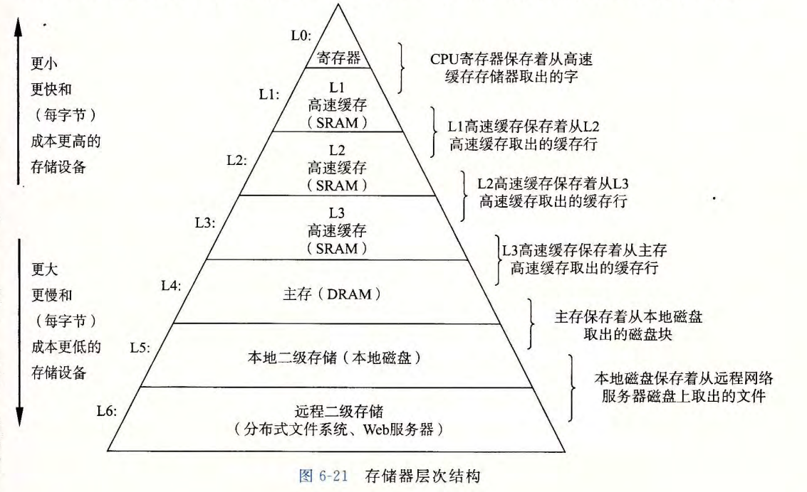
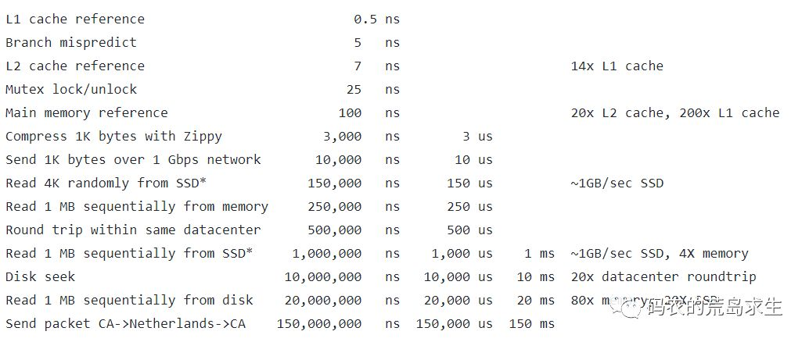
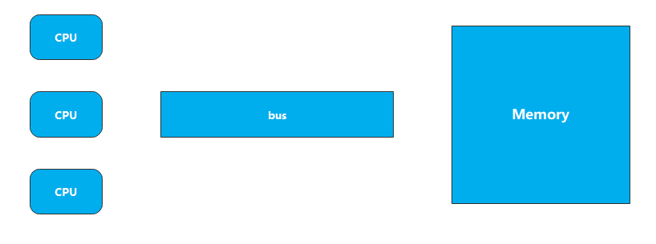

# 硬件层数据一致性


L0,L1,L2 在CPU内部
L3,L4,L5,L6 是CPU共享的

| 从CPU | 大约需要的CPU周期 | 大约需要的时间 |
| ------ | ------ | ------ |
| 主存 |    |  约60-80ns |
| QPI 总线传输（between socket, not drawn） | | 约20ns |
| L3 cache | 约40-45 cycles | 约15ns |
| L2 cache | 约10 cycles | 约3ns |
| L1 cache | 约3-4 cycles | 约1ns |
| 寄存器 | 1 cycle |  |

Google大神 Jeff Dean在之前的一次演讲中展示了这样一张表，非常有意思：


访问L2 cache的时延大概是访问L1 cache的10几倍左右，而访问一次内存的时延则高达访问L2 cache的20倍，是访问L1cache耗时的200倍。

## cache line 的概念 缓存行对齐 伪共享


**缓存行**：读取缓存以cache line为基本单位，目前64bytes。
**伪共享**：位于同一缓存行的两个不同数据，被两个不同CPU锁定，产生互相影响的伪共享问题。

测试伪共享问题
```java
public class CacheLinePadding01 {

    private static class Padding {
        public volatile long p1, p2, p3, p4, p5, p6, p7;
    }

    // 这里测试两种，T 和 T extends Padding
    private static class T {
        public volatile long x = 0L;
    }

    public static T[] arr = new T[2];

    static {
        arr[0] = new T();
        arr[1] = new T();
    }


    public static void main(String[] args) throws InterruptedException {
        Thread t1 = new Thread(() -> {
            for (long i = 0; i < 100_0000L; i++) {
                arr[0].x = i;
            }
        });

        Thread t2 = new Thread(() -> {
            for (long i = 0; i < 100_0000L; i++) {
                arr[1].x = i;
            }
        });

        final long start = System.nanoTime();
        t1.start();
        t2.start();
        t1.join();
        t2.join();
        System.out.println(System.nanoTime() - start);
    }
}
```

运行结果
```shell
36052300
```
修改代码，让T extends Padding，再次运行
> 这样T中就有8个long类型的变量，一个long是8个字节，8个变量就是64个字节。这样就会将这些读取到cache line中

运行结果
```shell
8560600
```
从结果中看，快了4倍左右

**总结: 使用缓存行的对齐能够提高效率, 但同时会浪费一些内存空间。**


高性能队列Disruptor中就有使用cache line 解决伪共享问题
看下Sequence的源码
```java
class LhsPadding {
	protected long p1, p2, p3, p4, p5, p6, p7;
}

class Value extends LhsPadding {
	protected volatile long value;
}

class RhsPadding extends Value {
	protected long p9, p10, p11, p12, p13, p14, p15;
}

public class Sequence extends RhsPadding {
}
```


如果两个CPU都从主内存中拿到x和y的值，并对其进行修改，那么怎么保证数据一致性？

## 数据一致性

### 多线程一致性的硬件支持


总线程会锁住总线，使得其它CPU甚至不能访问内存中的其它的地址，因为效率较低。


### MESI Cache 一致性协议
https://www.cnblogs.com/z00377750/p/9180644.html

**概念：**
MESI（Modified Exclusive Shared Or Invalid）(也称为伊利诺斯协议，是因为该协议由伊利诺斯州立大学提出）是一种广泛使用的支持写回策略的缓存一致性协议。该协议被应用在Intel奔腾系列的CPU中


**MESI协议中的状态：**
CPU中每个缓存行（caceh line)使用4种状态进行标记（使用额外的两位(bit)表示):

**M: 被修改（Modified)**

该缓存行只被缓存在该CPU的缓存中，并且是被修改过的（dirty),即与主存中的数据不一致，该缓存行中的内存需要在未来的某个时间点（允许其它CPU读取请主存中相应内存之前）写回（write back）主存。

当被写回主存之后，该缓存行的状态会变成独享（exclusive)状态。

**E: 独享的（Exclusive)**

该缓存行只被缓存在该CPU的缓存中，它是未被修改过的（clean)，与主存中数据一致。该状态可以在任何时刻当有其它CPU读取该内存时变成共享状态（shared)。

同样地，当CPU修改该缓存行中内容时，该状态可以变成Modified状态。

**S: 共享的（Shared)**

该状态意味着该缓存行可能被多个CPU缓存，并且各个缓存中的数据与主存数据一致（clean)，当有一个CPU修改该缓存行中，其它CPU中该缓存行可以被作废（变成无效状态（Invalid））。

**I: 无效的（Invalid）**

该缓存是无效的（可能有其它CPU修改了该缓存行）。


数据一致性实现方式有很多。如：MSI  MESI  MOSI Synapse FireFly DRagon。

现代CPU的数据一致性实现 = 缓存锁（MESI ...） + 总线锁

# 乱序问题
CPU为了提高指令执行效率，会在一条指令执行过程中（比如去内存读数据（慢100倍）），去同时执行另一条指令，前提是，两条指令没有依赖关系

cpu乱序执行的根源：https://www.cnblogs.com/liushaodong/p/4777308.html

## 合并写

写操作也可以进行合并：https://www.cnblogs.com/liushaodong/p/4777308.html

写合并测试
```java
public class WriteCombining {

    private static final int ITERATIONS = Integer.MAX_VALUE;
    private static final int ITEMS = 1 << 24;
    private static final int MASK = ITEMS - 1;

    private static final byte[] arrayA = new byte[ITEMS];
    private static final byte[] arrayB = new byte[ITEMS];
    private static final byte[] arrayC = new byte[ITEMS];
    private static final byte[] arrayD = new byte[ITEMS];
    private static final byte[] arrayE = new byte[ITEMS];
    private static final byte[] arrayF = new byte[ITEMS];

    public static void main(final String[] args) {

        for (int i = 1; i <= 3; i++) {
            System.out.println(i + " SingleLoop duration (ns) = " + runCaseOne());
            System.out.println(i + " SplitLoop  duration (ns) = " + runCaseTwo());
        }
    }

    public static long runCaseOne() {
        long start = System.nanoTime();
        int i = ITERATIONS;

        while (--i != 0) {
            int slot = i & MASK;
            byte b = (byte) i;
            arrayA[slot] = b;
            arrayB[slot] = b;
            arrayC[slot] = b;
            arrayD[slot] = b;
            arrayE[slot] = b;
            arrayF[slot] = b;
        }
        return System.nanoTime() - start;
    }

    public static long runCaseTwo() {
        long start = System.nanoTime();
        int i = ITERATIONS;
        while (--i != 0) {
            int slot = i & MASK;
            // 凑够4个字节。个数时依赖cpu模型的，intel的cpu在同一时刻只能拿到4个。
            byte b = (byte) i;
            arrayA[slot] = b;
            arrayB[slot] = b;
            arrayC[slot] = b;
        }
        i = ITERATIONS;
        while (--i != 0) {
            int slot = i & MASK;
            // 凑够4个字节。个数时依赖cpu模型的，intel的cpu在同一时刻只能拿到4个。
            byte b = (byte) i;
            arrayD[slot] = b;
            arrayE[slot] = b;
            arrayF[slot] = b;
        }
        return System.nanoTime() - start;
    }
}
```
运行结果：
```shell
1 SingleLoop duration (ns) = 4983037200
1 SplitLoop  duration (ns) = 3976912800
2 SingleLoop duration (ns) = 4951982200
2 SplitLoop  duration (ns) = 3972671900
3 SingleLoop duration (ns) = 4961941100
3 SplitLoop  duration (ns) = 4185428500
```

## 乱序证明
```java
// 原始参考：https://preshing.com/20120515/memory-reordering-caught-in-the-act/
public class DisOrder {

    private static int x = 0, y = 0;
    private static int a = 0, b = 0;

    public static void main(String[] args) throws InterruptedException {
        int i = 0;
        for (; ; ) {
            i++;
            x = 0;
            y = 0;
            a = 0;
            b = 0;
            Thread one = new Thread(new Runnable() {
                public void run() {
                    //由于线程one先启动，下面这句话让它等一等线程two. 读着可根据自己电脑的实际性能适当调整等待时间.
                    //shortWait(100000);
                    a = 1;
                    x = b;
                }
            });

            Thread other = new Thread(new Runnable() {
                public void run() {
                    b = 1;
                    y = a;
                }
            });
            one.start();
            other.start();
            one.join();
            other.join();
            String result = "第" + i + "次 (" + x + "," + y + "）";
            if (x == 0 && y == 0) {
                System.err.println(result);
                break;
            } else {
                //System.out.println(result);
            }
        }
    }


    public static void shortWait(long interval) {
        long start = System.nanoTime();
        long end;
        do {
            end = System.nanoTime();
        } while (start + interval >= end);
    }
}
```

分析程序，x 和 y的值，不可能为同时为0 ，如果发生指令重排就会出现x=0, y=0的情况。

## 如何保证特定情况下不乱序

### 硬件内存屏障 X86

>  sfence:  store| 在sfence指令前的写操作当必须在sfence指令后的写操作前完成。
> 
>  lfence：load | 在lfence指令前的读操作当必须在lfence指令后的读操作前完成。
> 
>  mfence：modify/mix | 在mfence指令前的读写操作当必须在mfence指令后的读写操作前完成。

> 原子指令，如x86上的”lock …” 指令是一个Full Barrier，执行时会锁住内存子系统来确保执行顺序，甚至跨多个CPU。Software Locks通常使用了内存屏障或原子指令来实现变量可见性和保持程序顺序

### JVM级别如何规范（JSR133）

**LoadLoad屏障：**
>  对于这样的语句Load1; LoadLoad; Load2， 
>
>  在Load2及后续读取操作要读取的数据被访问前，保证Load1要读取的数据被读取完毕。
>
**toreStore屏障：**
>
>  	对于这样的语句Store1; StoreStore; Store2，
>		
>  	在Store2及后续写入操作执行前，保证Store1的写入操作对其它处理器可见。
>
**LoadStore屏障：**
>
>  	对于这样的语句Load1; LoadStore; Store2，
>		
>  	在Store2及后续写入操作被刷出前，保证Load1要读取的数据被读取完毕。
>
**StoreLoad屏障：(全能屏障)**
> 	对于这样的语句Store1; StoreLoad; Load2，
>
> ​	 在Load2及后续所有读取操作执行前，保证Store1的写入对所有处理器可见。

### volatile的实现细节

1. 字节码层面
   > ACC_VOLATILE

2. JVM层面

   volatile内存区的读写 都加屏障
   >
   > StoreStoreBarrier
   >
   volatile 写操作
   >
   > StoreLoadBarrier

   > LoadLoadBarrier
   >
   volatile 读操作
   >
   > LoadStoreBarrier

1. OS和硬件层面
   https://blog.csdn.net/qq_26222859/article/details/52235930
   hsdis - HotSpot Dis Assembler
   windows lock 指令实现 | MESI实现

### synchronized实现细节

1. 字节码层面
   ACC_SYNCHRONIZED
   monitorenter monitorexit
2. JVM层面
   C C++ 调用了操作系统提供的同步机制
3. OS和硬件层面
   X86 : lock cmpxchg / xxx
   [https](https://blog.csdn.net/21aspnet/article/details/88571740)[://blog.csdn.net/21aspnet/article/details/](https://blog.csdn.net/21aspnet/article/details/88571740)[88571740](https://blog.csdn.net/21aspnet/article/details/88571740)
