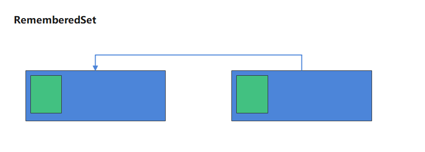

# G1介绍

[Garbage First Garbage Collector Tuning (oracle.com)](https://www.oracle.com/technical-resources/articles/java/g1gc.html)

The Garbage First Garbage Collector (G1 GC) is the lowpause, server-style generational garbage collector for Java  HotSpot VM. The G1 GC uses concurrent and parallel  phases to achieve its target pause time and to maintain  good throughput. When G1 GC determines that a garbage  collection is necessary, it collects the regions with the least  live data first (garbage first)

> G1是一种服务端应用使用的垃圾收集器，目标是用在多核、大内 存的机器上，它在大多数情况下可以实现指定的GC暂停时间，同 时还能保持较高的吞吐量

## 特点：

- 并发收集 
- 压缩空闲空间不会延长GC的暂停时间；
- 更易预测的GC暂停时间； 
- 适用不需要实现很高的吞吐量的场景

## G1的内存模型

G1 之前，内存上分为年轻代和老年代。当内存很大的时候，年轻代和老年代的各占的内存空间也很大，特别是老年代。这样垃圾在回收过程中，进行标记耗费的时间就很多的。因为空间大，你在一个大空间里面找东西，用的时间肯定不会少的。

所以G1，采用了region的思想，把内存空间分成一个个小的空间（1MB - 32MB）。这些小的空间我们可以给它们划分成Old区、Survivor区、Eden区、Humongous，所以G1实在物理上不分代，逻辑上是分代。

> region思想就是我们所说的分而治之，熟悉Hbase、kafka的都知道，当我们要存储大量数据的时候，就会把数据存储在不同的region（节点）上

注意：G1的每块空间不固定，可能一开始叫Old区，后面可能会叫Eden区或别的区。

总结：

> 每个分区都可能是年轻代也可能是老年代，但是在同一时 刻只能属于某个代。 
>
> 年轻代、幸存区、老年代这些概念还存在，成为逻辑上的 概念，这样方便复用之前分代框架的逻辑。在物理上不需 要连续，则带来了额外的好处——有的分区内垃圾对象特别 多，有的分区内垃圾对象很少，G1会优先回收垃圾对象特 别多的分区，这样可以花费较少的时间来回收这些分区的 垃圾，这也就是G1名字的由来，即首先收集垃圾最多的分 区。 
>
> 新生代其实并不是适用于这种算法的，依然是在新生代满 了的时候，对整个新生代进行回收——整个新生代中的对象， 要么被回收、要么晋升，至于新生代也采取分区机制的原 因，则是因为这样跟老年代的策略统一，方便调整代的大 小。 
>
> G1还是一种带压缩的收集器，在回收老年代的分区时，是 将存活的对象从一个分区拷贝到另一个可用分区，这个拷 贝的过程就实现了局部的压缩。每个分区的大小从1M到 32M不等，但是都是2的冥次方。

### G1的实现算法

三色标记。ZGC是颜色指针

### 软件架构的两大思想

- 分而治之
- 分层架构

## GC 算法的基础

### card table

> 如图，假设新生代有个root对象，指向老年代的对象5，对象5又指向新生代的对象2

由于做YGC时，需要扫描整个OLD区，效率非常低，所以JVM设计了CardTable， 如果一个OLD区CardTable中有对象指向Y区，就将它设为Dirty（脏），下次扫描时，只需要扫描Dirty Card 在结构上。

card Table用BitMap（位图，就是0101）来实现

card Table 只有一个，但是card会很有多，每个card里面有若干个对象

### CSet

CSet = Collection Set

一组可被回收的分区的集合。 在CSet中存活的数据会在GC过程中被移动到另一个可用分区， CSet中的分区可以来自Eden空间、survivor空间、或者老年代。 CSet会占用不到整个堆空间的1%大小

### Rset

RSet = RememberedSet

记录了其他Region中的对象到本Region的引用 RSet的价值在于 使得垃圾收集器不需要扫描整个堆找到谁引用了当前分区中的对象， 只需要扫描RSet即可。

相当于个Hash表，记录当前对象的一弄有哪些（会占用空间）

## 阿里的多租户JVM

- 每租户单空间
- session based GC

## G1的内存区域不是固定的E或者O

## 为什么用G1
- 追求吞吐量
  - 100 CPU
  - 99 app 1 GC 
  - 吞吐量 = 99%

- 追求响应时间
  - XX:MaxGCPauseMillis 200
  - 对STW进行控制

- 灵活
  - 分Region回收
  - 优先回收花费时间少、垃圾比例高的Region

## 每个Region有多大
- headpRegion.cpp
- 取值
  - 1 2 4 8 16 32 (2的倍数)
- 手工指定
  - XX:G1HeapRegionSize

## RSet 与 赋值的效率

- 由于RSet 的存在，那么每次给对象赋引用的时候，就得做一些额外的操作，
- 指的是在RSet中做一些额外的记录（在GC中被称为写屏障， **这个写屏障 不等于 内存屏障**）

## 新老年代比例

- 5% - 60%
  - 一般不用手工指定（G1会根据停顿时间动态调整）
  - 也不要手工指定，因为这是G1预测停顿时间的基准

## 对象何时进入老年代

- 超过 XX:MaxTenuringThreshold 指定次数（YGC）
  - Parallel Scavenge 15
  - CMS 6
  - G1 15
- 动态年龄
  - s1 - > s2超过50%
  - 把年龄最大的放入O

## humongous object

- 是指超过单个region的50% 或者跨越多个region的对象

## GC 何时触发

- YGC
  - Eden 区不足
  - 多线程并行执行
- FGC
  - Old空间不足
  - System.gc();

## G1中的MixedGC

- 相当于CMS（过程跟CMS一样）
- XX:InitiatingHeapOccupacyPercent 
  - 默认值45% 
  - 当O超过这个值时，启动MixedGC

## MixedGC的过程

- 初始标记 STW
- 并发标记
- 最终标记 STW （重新标记）
- 筛选回收 STW （并行）
  - 筛选回收实际上用到复制，会将存活的对象复制到了另外一个region里面

## G1的FullGC
java 10以前是串行FullGC，之后是并行FullGC

## 如果G1产生FGC，你应该做什么？

1. 扩内存
2. 提高CPU性能（回收的快，业务逻辑产生对象的速度固定，垃圾回收越快，内存空间越大）
3. 降低MixedGC触发的阈值，让MixedGC提早发生（默认是45%）

# 并发标记算法

## 三色标记（G1用的）

- 白色：未被标记的对象
- 灰色：自身被标记，成员变量未被标记
- 黑色：自身和成员变量均已标记完成

### 漏标

在remark过程中，黑色指向了白色， 如果不对黑色重新扫描，则会漏标 会把白色D对象当做没有新引用指向从而回收掉

并发标记过程中，Mutator删除了 所有从灰色到白色的引用，会产生 漏标 此时白色对象应该被回收

**漏标是指，本来是live object，但是由于没有遍历到，被当成garbage回收掉**

> 如图所示，初始标记之后，A对象是黑色（说明其自身或直接与其关联的对象引用（B）都已经标记），B对象是灰色（说明其自身对象已经标记，直接与其关联的对象引用还没有被标记（C）），C对象是白色说明没有被标记。
>
> 黑色的对象，在remark的时候，不会再被扫描，因为已经全部被标记了
>
> 由于是标记阶段是并发操作，对象的引入可能会发现改变，所以需要remark阶段
>
> 当remark的 时候，指向D对象的引入发生了改变（如图：此时B不在指向D，而是A指向了D），因为D是未被标记的，当A指向D的之后，按道理A应该变成灰色，需要对A对象重新扫描并标记。但是由于初始标记的时候，A是黑色，所以remark阶段为了效率并不会扫描黑色的对象。此时D就被漏标了，会被当做垃圾给清理掉

### 产生漏标的两个条件（两个需要同时满足）

1. 标记进行时增加了一个黑到白的引用，如果不重新对黑色进行处理，则会漏标
2. 标记进行时删除了灰对象到白对象的引用，那么这个白对象有可能被漏

### 漏标的解决办法

要想打破漏标，上面两个条件，打破其中之一就可以了

1. incremental update -- 增量更新，关注引用的增加， 把黑色重新标记为灰色，下次重新扫描属性（CMS使用，重新扫描标记，效率会变低）
2. STAB snapshot at the beginning - 关注引用的删除 当B->D消失时，要把这个引用推到GC的堆栈，保证D还能被GC扫描到（ G1使用）

### 为什么G1用SATB?

灰色 → 白色 引用消失时，如果没有黑色指向白色 引用会被push到堆栈 下次扫描时拿到这个引用，由于有RSet的存在，不需要 扫描整个堆去查找指向白色的引用，效率比较高 SATB 配合 RSet ，浑然天成
