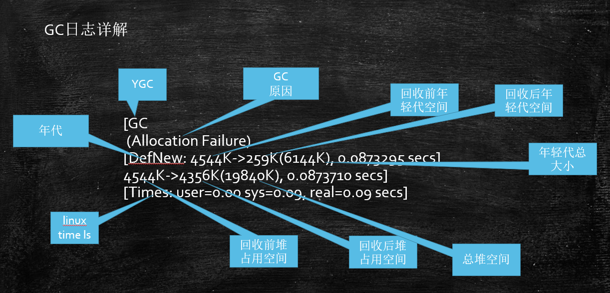
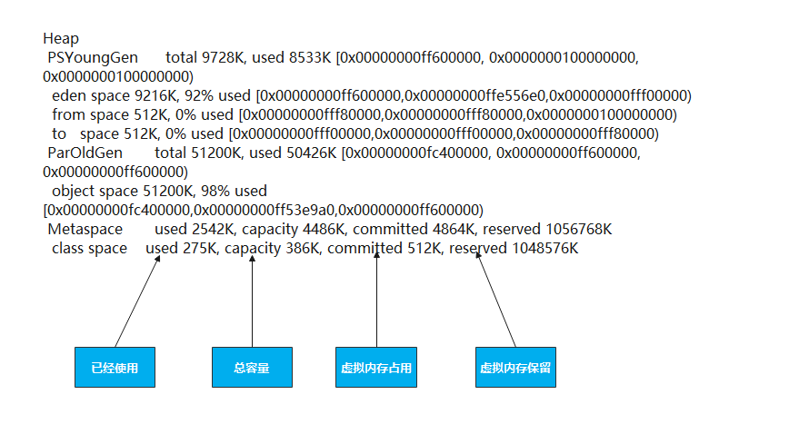

# JVM调优第一步，了解JVM常用命令行参数

- JVM的命令行参数参考：https://docs.oracle.com/javase/8/docs/technotes/tools/unix/java.html

- HotSpot参数分类
    >标准： - 开头，所有的HotSpot都支持
    >
    >非标准：-X 开头，特定版本HotSpot支持特定命令
    >
    >不稳定：-XX 开头，下个版本可能取消

    java -version

    java -X

    java -XX:+PrintFlagsFinal -version

试验用程序：

```java
import java.util.List;
import java.util.LinkedList;

public class HelloGC {
  public static void main(String[] args) {
    System.out.println("HelloGC!");
    List list = new LinkedList();
    for(;;) {
      byte[] b = new byte[1024*1024];
      list.add(b);
    }
  }
}
```

  1. 区分概念：内存泄漏memory leak，内存溢出out of memory
  2. java -XX:+PrintCommandLineFlags HelloGC
  3. java -Xmn10M -Xms40M -Xmx60M -XX:+PrintCommandLineFlags -XX:+PrintGC  HelloGC
        > PrintGC：粗略打印GC信息。
        >
        > PrintGCDetails：打印详细的GC信息。
        >
        > PrintGCTimeStamps：打印GC产生时系统的详细时间。
        >
        > PrintGCCause：打印GC产生的原因。
  4. java -XX:+UseConcMarkSweepGC -XX:+PrintCommandLineFlags HelloGC
  5. java -XX:+PrintFlagsInitial 默认参数值
  6. java -XX:+PrintFlagsFinal 最终参数值
  7. java -XX:+PrintFlagsFinal | grep xxx 找到对应的参数
  8. java -XX:+PrintFlagsFinal -version |grep GC


# PS GC日志详解
每种垃圾回收器的日志格式是不同的！

PS日志格式


heap dump部分：

```shell
eden space 5632K, 94% used [0x00000000ff980000,0x00000000ffeb3e28,0x00000000fff00000)
                            后面的内存地址指的是，起始地址，使用空间结束地址，整体空间结束地址
```




total = eden + 1个survivor

```shell

[root@localhost ~]# time ls
-                data        dokcer         HelloGC.java  root.crt  root.key    soft              test_for_stop.tar  webapp
anaconda-ks.cfg  Dockerfile  HelloGC.class  main.go       root.csr  server.key  test_for_run.tar  test.txt

real    0m0.018s
user    0m0.000s
sys     0m0.013s
```

> real：总共占用时间
> sys：内核态占用时间
> user：用户态占用时间


# 调优前的基础概念
1. **吞吐量：**用户代码时间 /（用户代码执行时间 + 垃圾回收时间）
2. **响应时间：**STW越短，响应时间越好

所谓调优，首先确定，追求啥？吞吐量优先，还是响应时间优先？还是在满足一定的响应时间的情况下，要求达到多大的吞吐量...

问题：

科学计算，吞吐量。数据挖掘，thrput。吞吐量优先的一般：（PS + PO）

响应时间：网站 GUI API （1.8 G1）

# 什么是调优？

1. 根据需求进行JVM规划和预调优
2. 优化运行JVM运行环境（慢，卡顿）
3. 解决JVM运行过程中出现的各种问题(OOM)

# 调优，从规划开始

- 调优，从业务场景开始，没有业务场景的调优都是耍流氓
- 无监控（压力测试，能看到结果），不调优
- 步骤：
  1. 熟悉业务场景（没有最好的垃圾回收器，只有最合适的垃圾回收器）
     1. 响应时间、停顿时间 [CMS G1 ZGC] （需要给用户作响应）
     2. 吞吐量 = 用户时间 /( 用户时间 + GC时间) [PS]
  2. 选择回收器组合
  3. 计算内存需求（经验值 1.5G 16G）
  4. 选定CPU（越高越好）
  5. 设定年代大小、升级年龄
  6. 设定日志参数
     1. -Xloggc:/opt/xxx/logs/xxx-xxx-gc-%t.log -XX:+UseGCLogFileRotation -XX:NumberOfGCLogFiles=5 -XX:GCLogFileSize=20M -XX:+PrintGCDetails -XX:+PrintGCDateStamps -XX:+PrintGCCause
     2. 或者每天产生一个日志文件
  7. 观察日志情况

## 案例1：垂直电商，最高每日百万订单，处理订单系统需要什么样的服务器配置？

> 这个问题比较业余，因为很多不同的服务器配置都能支撑(1.5G 16G)
>
> 1小时360000集中时间段， 100个订单/秒，（找一小时内的高峰期，1000订单/秒）
>
> 经验值，
>
> 非要计算：一个订单产生需要多少内存？512K * 1000 500M内存
>
> 专业一点儿问法：要求响应时间100ms
>
> 压测

## 案例2：12306遭遇春节大规模抢票应该如何支撑？

> 12306应该是中国并发量最大的秒杀网站：
>
> 号称并发量100W最高
>
> CDN -> LVS -> NGINX -> 业务系统 -> 每台机器1W并发（10K问题） 100台机器
>
> 普通电商订单 -> 下单 ->订单系统（IO）减库存 ->等待用户付款
>
> 12306的一种可能的模型： 下单 -> 减库存 和 订单(redis kafka) 同时异步进行 ->等付款
>
> 减库存最后还会把压力压到一台服务器
>
> 可以做分布式本地库存 + 单独服务器做库存均衡
>
> 大流量的处理方法：分而治之

怎么得到一个事务会消耗多少内存？

> 1. 弄台机器，看能承受多少TPS？是不是达到目标？扩容或调优，让它达到
> 2. 用压测来确定

## 怎么得到一个事务会消耗多少内存？
> 弄台机器，看能承受多少TPS？是不是达到目标？扩容或调优，让它达到
>
> 用压测来确定

# 优化环境

## 1. 扩大内存反而更卡顿

有一个50万PV的资料类网站（从磁盘提取文档到内存）原服务器32位，1.5G 的堆，用户反馈网站比较缓慢，因此公司决定升级，新的服务器为64位，16G 的堆内存，结果用户反馈卡顿十分严重，反而比以前效率更低了

> 1. 为什么原网站慢? 很多用户浏览数据，很多数据load到内存，内存不足，频繁GC，STW长，响应时间变慢
> 2. 为什么会更卡顿？ 内存越大，FGC时间越长
> 3. 咋办？ PS -> PN + CMS 或者 G1

## 2. 系统CPU经常100%，如何调优？(面试高频) CPU100%那么一定有线程在占用系统资源，

> 1. 找出哪个进程cpu高（top）
> 2. 该进程中的哪个线程cpu高（top -Hp）
> 3. 导出该线程的堆栈 (jstack)
> 4. 查找哪个方法（栈帧）消耗时间 (jstack)
> 5. 工作线程占比高 | 垃圾回收线程占比高

## 3. 系统内存飙高，如何查找问题？（面试高频）

> 1. 导出堆内存 (jmap)
> 2. 分析 (jhat jvisualvm mat jprofiler ... )

## 4. 如何监控JVM

> 1. jstat jvisualvm jprofiler arthas top...

# 解决JVM运行中的问题

一个案例理解常用工具

1. 测试代码：

```java
import java.math.BigDecimal;
import java.util.ArrayList;
import java.util.Date;
import java.util.List;
import java.util.concurrent.ScheduledThreadPoolExecutor;
import java.util.concurrent.ThreadPoolExecutor;
import java.util.concurrent.TimeUnit;

/**
 * @description 从数据库中读取信用数据，套用模型，并把结果进行记录和传输
 */
public class FullGC_Problem_Test {

    private static class CardInfo {
        BigDecimal price = new BigDecimal(0.0);
        String name = "张三";
        int age = 5;
        Date birthdate = new Date();

        public void m() {
        }
    }

    private static ScheduledThreadPoolExecutor executor = new ScheduledThreadPoolExecutor(50,
            new ThreadPoolExecutor.DiscardOldestPolicy());

    public static void main(String[] args) throws Exception {
        executor.setMaximumPoolSize(50);

        for (; ; ) {
            modelFit();
            Thread.sleep(100);
        }
    }

    private static void modelFit() {
        List<CardInfo> taskList = getAllCardInfo();
        taskList.forEach(info -> {
            // do something
            executor.scheduleWithFixedDelay(() -> {
                //do sth with info
                info.m();

            }, 2, 3, TimeUnit.SECONDS);
        });
    }

    private static List<CardInfo> getAllCardInfo() {
        List<CardInfo> taskList = new ArrayList<>();

        for (int i = 0; i < 100; i++) {
            CardInfo ci = new CardInfo();
            taskList.add(ci);
        }

        return taskList;
    }
}
```

2. java -Xms200M -Xmx200M -XX:+PrintGC FullGC_Problem_Test
3. 一般是运维团队首先受到报警信息（CPU Memory）
4. top命令观察到问题：内存不断增长 CPU占用率居高不下
5. top -Hp <pid> 观察进程中的线程，哪个线程CPU和内存占比高
6. jps定位具体java进程

   jstack 定位线程状况，重点关注：WAITING BLOCKED 

   eg. waiting on <0x0000000088ca3310> (a java.lang.Object) 

   假如有一个进程中100个线程，很多线程都在waiting on ，一定要找到是哪个线程持有这把锁 怎么找？

   搜索jstack dump的信息，找 ，看哪个线程持有这把锁RUNNABLE 

   作业：1：写一个死锁程序，用jstack观察 2 ：写一个程序，一个线程持有锁不释放，其他线程等待
7. 为什么阿里规范里规定，线程的名称（尤其是线程池）都要写有意义的名称 怎么样自定义线程池里的线程名称？（自定义ThreadFactory）

8. jinfo pid

9. jstat -gc 动态观察gc情况 / 阅读GC日志发现频繁GC / arthas观察 / jconsole/jvisualVM/ Jprofiler（最好用） jstat -gc 4655 500 : 每个500个毫秒打印GC的情况 

   如果面试官问你是怎么定位OOM问题的？如果你回答用图形界面（错误） 

   1：已经上线的系统不用图形界面用什么？（cmdline arthas） 

   2：图形界面到底用在什么地方？测试！测试的时候进行监控！（压测观察）

10. jmap -histo 4655 | head -20，查找有多少对象产生

11. jmap -dump:format=b,file=xxx pid

    线上系统，内存特别大，jmap执行期间会对进程产生很大影响，甚至卡顿（电商不适合） 

    1：设定了参数HeapDump，OOM的时候会自动产生堆转储文件 

    2：<font color='red'>很多服务器备份（高可用），停掉这台服务器对其他服务器不影响</font> 

    3：在线定位(一般小点儿公司用不到)

12. java -Xms20M -Xmx20M -XX:+UseParallelGC -XX:+HeapDumpOnOutOfMemoryError FullGC_Problem_Test

13. 使用MAT / jhat /jvisualvm 进行dump

    文件分析 https://www.cnblogs.com/baihuitestsoftware/articles/6406271.html 

    jhat -J-mx512M xxx.dump http://192.168.17.11:7000 

    拉到最后：找到对应链接 可以使用OQL查找特定问题对象

14. 找到代码的问题

## jconsole远程连接

1. 程序启动加入参数：
    > java -Djava.rmi.server.hostname=192.168.245.132 -Dcom.sun.management.jmxremote -Dcom.sun.management.jmxremote.port=11111 -Dcom.sun.management.jmxremote.authenticate=false -Dcom.sun.management.jmxremote.ssl=false -Xms200M -Xmx200M -XX:+PrintGC FullGC_Problem_Test
2. 如果遭遇 Local host name unknown：XXX的错误，修改/etc/hosts文件，把XXX加入进去
    > 192.168.17.11 basic localhost localhost.localdomain localhost4 localhost4.localdomain4
    ::1         localhost localhost.localdomain localhost6 localhost6.localdomain6
3. 关闭linux防火墙（实战中应该打开对应端口）
    > service iptables stop
    >
    > chkconfig iptables off #永久关闭
4. windows上打开 jconsole远程连接 192.168.245.132:11111

## jvisualvm远程连接

https://www.cnblogs.com/liugh/p/7620336.html （简单做法）

## jprofiler (收费)


## arthas在线排查工具

- 为什么需要在线排查？ 
    >在生产上我们经常会碰到一些不好排查的问题，例如线程安全问题，用最简单的threaddump或者heapdump不好查到问题原因。
    为了排查这些问题，有时我们会临时加一些日志，比如在一些关键的函数里打印出入参，然后重新打包发布，如果打了日志还是没找到问题，继续加日志，重新打包发布。对于上线流程复杂而且审核比较严的公司，从改代码到上线需要层层的流转，会大大影响问题排查的进度。
- jvm观察jvm信息
- thread定位线程问题
- dashboard 观察系统情况
- heapdump + jhat分析
- jad反编译 
  > 动态代理生成类的问题定位 第三方的类（观察代码） 版本问题（确定自己最新提交的版本是不是被使用）
  > redefine 热替换 目前有些限制条件：只能改方法实现（方法已经运行完成），不能改方法名， 不能改属性 m() -> mm()
- sc - search class
- watch - watch method、
- 没有包含的功能：jmap

# GC日志详情

## CMS日志

执行命令：

```shell
java -Xms20M -Xmx20M -XX:+PrintGCDetails -XX:+UseConcMarkSweepGC FullGC_Problem_Test
```

```java
[GC (Allocation Failure) [ParNew: 6144K->640K(6144K), 0.0265885 secs] 6585K->2770K(19840K), 0.0268035 secs] [Times: user=0.02 sys=0.00, real=0.02 secs]
// ParNew：年轻代收集器
// 6144->640：收集前后的对比
//（6144）：整个年轻代容量
// 6585 -> 2770：整个堆的情况
// （19840）：整个堆大小
[GC (CMS Initial Mark) [1 CMS-initial-mark: 8511K(13696K)] 9866K(19840K), 0.0040321 secs] [Times: user=0.01 sys=0.00, real=0.00 secs] 
	//8511 (13696) : 老年代使用（最大）
	//9866 (19840) : 整个堆使用（最大）
[CMS-concurrent-mark-start]
[CMS-concurrent-mark: 0.018/0.018 secs] [Times: user=0.01 sys=0.00, real=0.02 secs] 
	//这里的时间意义不大，因为是并发执行
[CMS-concurrent-preclean-start]
[CMS-concurrent-preclean: 0.000/0.000 secs] [Times: user=0.00 sys=0.00, real=0.00 secs] 
	//标记Card为Dirty，也称为Card Marking
[GC (CMS Final Remark) [YG occupancy: 1597 K (6144 K)][Rescan (parallel) , 0.0008396 secs][weak refs processing, 0.0000138 secs][class unloading, 0.0005404 secs][scrub symbol table, 0.0006169 secs][scrub string table, 0.0004903 secs][1 CMS-remark: 8511K(13696K)] 10108K(19840K), 0.0039567 secs] [Times: user=0.00 sys=0.00, real=0.00 secs] 
	//STW阶段，YG occupancy:年轻代占用及容量
	//[Rescan (parallel)：STW下的存活对象标记
	//weak refs processing: 弱引用处理
	//class unloading: 卸载用不到的class
	//scrub symbol(string) table: 
		//cleaning up symbol and string tables which hold class-level metadata and 
		//internalized string respectively
	//CMS-remark: 8511K(13696K): 阶段过后的老年代占用及容量
	//10108K(19840K): 阶段过后的堆占用及容量

[CMS-concurrent-sweep-start]
[CMS-concurrent-sweep: 0.005/0.005 secs] [Times: user=0.00 sys=0.00, real=0.01 secs] 
	//标记已经完成，进行并发清理
[CMS-concurrent-reset-start]
[CMS-concurrent-reset: 0.000/0.000 secs] [Times: user=0.00 sys=0.00, real=0.00 secs]
	//重置内部结构，为下次GC做准备
```

## G1日志详解

执行命令;

```shell
java -Xms20M -Xmx20M -XX:+PrintGCDetails -XX:+UseG1GC FullGC_Problem_Test
```

```java
[GC pause (G1 Evacuation Pause) (young), 0.0053982 secs]
//young -> 年轻代 Evacuation-> 复制存活对象 
//initial-mark 混合回收的阶段，这里是YGC混合老年代回收
   [Parallel Time: 2.9 ms, GC Workers: 8] // 8个GC线程
      [GC Worker Start (ms): Min: 6421.6, Avg: 6422.7, Max: 6423.8, Diff: 2.3]
      [Ext Root Scanning (ms): Min: 0.0, Avg: 0.4, Max: 1.7, Diff: 1.7, Sum: 3.3]
      [Update RS (ms): Min: 0.0, Avg: 0.0, Max: 0.0, Diff: 0.0, Sum: 0.0]
         [Processed Buffers: Min: 0, Avg: 0.0, Max: 0, Diff: 0, Sum: 0]
      [Scan RS (ms): Min: 0.0, Avg: 0.0, Max: 0.0, Diff: 0.0, Sum: 0.0]
      [Code Root Scanning (ms): Min: 0.0, Avg: 0.0, Max: 0.1, Diff: 0.1, Sum: 0.1]
      [Object Copy (ms): Min: 0.0, Avg: 0.6, Max: 1.6, Diff: 1.6, Sum: 4.7]
      [Termination (ms): Min: 0.0, Avg: 0.2, Max: 0.3, Diff: 0.3, Sum: 1.3]
         [Termination Attempts: Min: 1, Avg: 4.4, Max: 10, Diff: 9, Sum: 35]
      [GC Worker Other (ms): Min: 0.0, Avg: 0.0, Max: 0.0, Diff: 0.0, Sum: 0.1]
      [GC Worker Total (ms): Min: 0.0, Avg: 1.2, Max: 2.3, Diff: 2.3, Sum: 9.4]
      [GC Worker End (ms): Min: 6423.9, Avg: 6423.9, Max: 6424.0, Diff: 0.1]
   [Code Root Fixup: 0.0 ms]
   [Code Root Purge: 0.0 ms]
   [Clear CT: 0.8 ms]
   [Other: 1.6 ms]
      [Choose CSet: 0.0 ms]
      [Ref Proc: 0.8 ms]
      [Ref Enq: 0.0 ms]
      [Redirty Cards: 0.7 ms]
      [Humongous Register: 0.0 ms]
      [Humongous Reclaim: 0.0 ms]
      [Free CSet: 0.0 ms]
   [Eden: 12.0M(12.0M)->0.0B(10.0M) Survivors: 0.0B->2048.0K Heap: 12.0M(20.0M)->2000.1K(20.0M)]
 [Times: user=0.00 sys=0.01, real=0.01 secs]
//以下是混合回收其他阶段
[GC concurrent-root-region-scan-start]
[GC concurrent-root-region-scan-end, 0.0006423 secs]
[GC concurrent-mark-start]
[GC concurrent-mark-end, 0.0155101 secs]
...
//无法evacuation，进行FGC
[Full GC (Allocation Failure)  19M->15M(20M), 0.0289796 secs]
   [Eden: 0.0B(1024.0K)->0.0B(1024.0K) Survivors: 0.0B->0.0B Heap: 19.9M(20.0M)->15.7M(20.0M)], [Metaspace: 3856K->3856K(1056768K)]
 [Times: user=0.04 sys=0.00, real=0.03 secs]
```


# 案例汇总

OOM产生的原因多种多样，有些程序未必产生OOM，不断FGC(CPU飙高，但内存回收特别少) （上面案例）

1. 硬件升级系统反而卡顿的问题（见上）

2. 线程池不当运用产生OOM问题（见上） 不断的往List里加对象（实在太LOW）

3. smile jira问题 实际系统不断重启 解决问题 加内存 + 更换垃圾回收器 G1 真正问题在哪儿？不知道

4. tomcat http-header-size过大问题（Hector）

5. lambda表达式导致方法区溢出问题(MethodArea / Perm Metaspace) LambdaGC.java -XX:MaxMetaspaceSize=5M -XX:+PrintGCDetails

    ```java
    public class LambdaGC {
    
        public static void main(String[] args) {
            for (; ; ) {
                I i = C::n;
            }
        }
    
        public static interface I {
            void m();
        }
    
        public static class C {
            static void n() {
                System.out.println("hello");
            }
        }
    }
    ```
6. 直接内存溢出问题（少见） 
   > 《深入理解Java虚拟机》P59，使用Unsafe分配直接内存，或者使用NIO的问题

7. 栈溢出问题 
   > -Xss设定太小

8. 比较一下这两段程序的异同，分析哪一个是更优的写法：
   ```java
    // 这种更好些
    Object o = null;
    for(int i=0; i<100; i++) {
        o = new Object();
        //业务处理
    }
   ```
   ```java
    for(int i=0; i<100; i++) {
        Object o = new Object();
    }
   ```
9. 重写finalize引发频繁GC 
    > 小米云，HBase同步系统，系统通过nginx访问超时报警，最后排查，C++程序员重写finalize引发频繁GC问题
    > 
    > 为什么C++程序员会重写finalize？（new delete） 
    >
    > 为什么会引发频繁GC问题？finalize耗时比较长（里面耗时的操作，如耗时200ms）
10. 如果有一个系统，内存一直消耗不超过10%，但是观察GC日志，发现FGC总是频繁产生，会是什么引起的？ System.gc() (这个比较Low)

11. Distuptor有个可以设置链的长度，如果过大，然后对象大，消费完不主动释放，会溢出 (来自 死物风情)

12. 用jvm都会溢出，mycat用崩过，1.6.5某个临时版本解析sql子查询算法有问题，9个exists的联合sql就导致生成几百万的对象（来自 死物风情）

13. new 大量线程，会产生 native thread OOM，（low）应该用线程池， 解决方案：减少堆空间（太TMlow了）,预留更多内存产生native thread JVM内存占物理内存比例 50% - 80%


# GC常用参数

- -Xmn -Xms -Xmx -Xss 年轻代 最小堆 最大堆 栈空间
- -XX:+UseTLAB 使用TLAB，默认打开
- -XX:+PrintTLAB 打印TLAB的使用情况
- -XX:TLABSize 设置TLAB大小
- -XX:+DisableExplictGC System.gc()不管用 ，FGC
- -XX:+PrintGC
- -XX:+PrintGCDetails
- -XX:+PrintHeapAtGC
- -XX:+PrintGCTimeStamps
- -XX:+PrintGCApplicationConcurrentTime (低) 打印应用程序时间
- -XX:+PrintGCApplicationStoppedTime （低） 打印暂停时长
- -XX:+PrintReferenceGC （重要性低） 记录回收了多少种不同引用类型的引用
- -verbose:class 类加载详细过程
- -XX:+PrintVMOptions
- -XX:+PrintFlagsFinal -XX:+PrintFlagsInitial 必须会用
- -Xloggc:opt/log/gc.log
- -XX:MaxTenuringThreshold 升代年龄，最大值15
- 锁自旋次数 -XX:PreBlockSpin 热点代码检测参数-XX:CompileThreshold 逃逸分析 标量替换 ... 这些不建议设置

# Parallel常用参数

- -XX:SurvivorRatio
- -XX:PreTenureSizeThreshold 大对象到底多大
- -XX:MaxTenuringThreshold
- -XX:+ParallelGCThreads 并行收集器的线程数，同样适用于CMS，一般设为和CPU核数相同
- -XX:+UseAdaptiveSizePolicy 自动选择各区大小比例

# CMS常用参数

- -XX:+UseConcMarkSweepGC
- -XX:ParallelCMSThreads CMS线程数量
- -XX:CMSInitiatingOccupancyFraction 使用多少比例的老年代后开始CMS收集，默认是68%(近似值)，如果频繁发生SerialOld卡顿，应该调小，（频繁CMS回收）
- -XX:+UseCMSCompactAtFullCollection 在FGC时进行压缩
- -XX:CMSFullGCsBeforeCompaction 多少次FGC之后进行压缩
- -XX:+CMSClassUnloadingEnabled
- -XX:CMSInitiatingPermOccupancyFraction 达到什么比例时进行Perm回收
- GCTimeRatio 设置GC时间占用程序运行时间的百分比
- -XX:MaxGCPauseMillis 停顿时间，是一个建议时间，GC会尝试用各种手段达到这个时间，比如减小年轻代

# G1常用参数

- -XX:+UseG1GC
- -XX:MaxGCPauseMillis 建议值，G1会尝试调整Young区的块数来达到这个值
- -XX:GCPauseIntervalMillis ？GC的间隔时间
- -XX:+G1HeapRegionSize 分区大小，建议逐渐增大该值，1 2 4 8 16 32。 随着size增加，垃圾的存活时间更长，GC间隔更长，但每次GC的时间也会更长 ZGC做了改进（动态区块大小）
- G1NewSizePercent 新生代最小比例，默认为5%
- G1MaxNewSizePercent 新生代最大比例，默认为60%
- GCTimeRatio GC时间建议比例，G1会根据这个值调整堆空间
- ConcGCThreads 线程数量
- InitiatingHeapOccupancyPercent 启动G1的堆空间占用比例

# 作业

1. -XX:MaxTenuringThreshold控制的是什么？ 

   > A: 对象升入老年代的年龄 
   >
   > B: 老年代触发FGC时的内存垃圾比例

2. 生产环境中，倾向于将最大堆内存和最小堆内存设置为：（为什么？） 

   > A: 相同 B：不同

3. JDK1.8默认的垃圾回收器是： 

   > A: ParNew + CMS 
   >
   > B: G1 
   >
   > C: PS + ParallelOld 
   >
   > D: 以上都不是

4. 什么是响应时间优先？

5. 什么是吞吐量优先？

6. ParNew和PS的区别是什么？

7. ParNew和ParallelOld的区别是什么？（年代不同，算法不同）

8. 长时间计算的场景应该选择：

   > A：停顿时间 B: 吞吐量

9. 大规模电商网站应该选择：

   > A：停顿时间 B: 吞吐量

10. HotSpot的垃圾收集器最常用有哪些？

11. 常见的HotSpot垃圾收集器组合有哪些？

12. JDK1.7 1.8 1.9的默认垃圾回收器是什么？如何查看？

13. 所谓调优，到底是在调什么？

14. 如果采用PS + ParrallelOld组合，怎么做才能让系统基本不产生FGC

15. 如果采用ParNew + CMS组合，怎样做才能够让系统基本不产生FGC

    1.加大JVM内存

    2.加大Young的比例

    3.提高Y-O的年龄

    4.提高S区比例

    5.避免代码内存泄漏

16. G1是否分代？G1垃圾回收器会产生FGC吗？

17. 如果G1产生FGC，你应该做什么？

    1. 扩内存
    2. 提高CPU性能（回收的快，业务逻辑产生对象的速度固定，垃圾回收越快，内存空间越大）
    3. 降低MixedGC触发的阈值，让MixedGC提早发生（默认是45%）

18. 问：生产环境中能够随随便便的dump吗？ 小堆影响不大，大堆会有服务暂停或卡顿（加live可以缓解），dump前会有FGC

19. 问：常见的OOM问题有哪些？ 栈 堆 MethodArea 直接内存

# 参考资料

1. [https://blogs.oracle.com/](https://blogs.oracle.com/jonthecollector/our-collectors)[jonthecollector](https://blogs.oracle.com/jonthecollector/our-collectors)[/our-collectors](https://blogs.oracle.com/jonthecollector/our-collectors)

2. https://docs.oracle.com/javase/8/docs/technotes/tools/unix/java.html

3. http://java.sun.com/javase/technologies/hotspot/vmoptions.jsp

4. JVM调优参考文档：https://docs.oracle.com/en/java/javase/13/gctuning/introduction-garbage-collection-tuning.html#GUID-8A443184-7E07-4B71-9777-4F12947C8184

5. https://www.cnblogs.com/nxlhero/p/11660854.html 在线排查工具

6. https://www.jianshu.com/p/507f7e0cc3a3 arthas常用命令

7. Arthas手册：([简介 | arthas (aliyun.com)](https://arthas.aliyun.com/doc/))

   1. 启动arthas java -jar arthas-boot.jar
   2. 绑定java进程
   3. dashboard命令观察系统整体情况
   4. help 查看帮助
   5. help xx 查看具体命令帮助

8. jmap命令参考：

   https://www.jianshu.com/p/507f7e0cc3a3

   1. jmap -heap pid
   2. jmap -histo pid
   3. jmap -clstats pid
