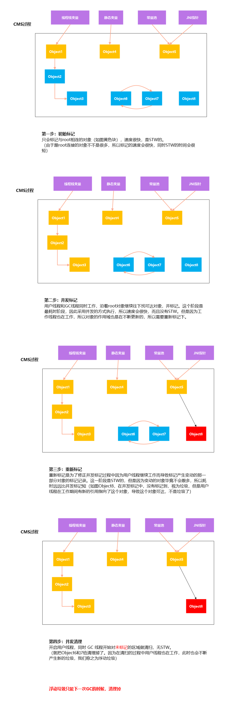

# 语法的发展历史
## c / c++
- 手工管理 malloc free / new delete
- 忘记释放 – memory leak – out of memory
- 释放多次 产生极其难易调试的bug，一个线程空间莫名其妙被另外一个释放了
- 开发效率很低

## java python go js kotlin scala
- 方便内存管理的语言
- GC - Garbage Collector - 应用程序只管分配，垃圾回收器负责回收
- 大大降低程序员门槛

## rust
- 运行效率超高（ asm c c++)
- 不同手工管理内存（没有GC）
- 学习曲线巨高（ownership）
- 你只要程序语法通过，就不会有bug

## java vs c++
- java
  - GC处理垃圾
  - 开发效率高，执行效率低
- C++
  - 手工处理垃圾
  - 忘记回收
    - 内存泄漏
  - 回收多次
    - 非法访问
  - 开发效率低，执行效率高


# GC 基础知识

## 1. 什么是垃圾？
没有任何引用指向的一个对象或者多个对象（循环引用）

## 2. 如何定位垃圾？
### 引用计数（RefenenceCount）
给对象中添加一个引用计数器：
- 每当有一个地方引用它，计数器就加 1；
- 当引用失效，计数器就减 1；
- 任何时候计数器为 0 的对象就是不可能再被使用的。

**这个方法实现简单，效率高，但是目前主流的虚拟机中并没有选择这个算法来管理内存，其最主要的原因是它很难解决对象之间相互循环引用的问题。**

所谓对象之间的相互引用问题，如下面代码所示：除了对象 objA 和 objB 相互引用着对方之外，这两个对象之间再无任何引用。但是他们因为互相引用对方，导致它们的引用计数器都不为 0，于是引用计数算法无法通知 GC 回收器回收他们。

```java
public class ReferenceCountTest {
    Object instance = null;
    public static void main(String[] args) {
        ReferenceCountTest objA = new ReferenceCountTest();
        ReferenceCountTest objB = new ReferenceCountTest();
        objA.instance = objB;
        objB.instance = objA;
        objA = null;
        objB = null;
    }
}
```

### 根可达算法(RootSearching)

这个算法的基本思想就是通过一系列的称为 “GC Roots” 的对象作为起点，从这些节点开始向下搜索，节点所走过的路径称为引用链，当一个对象到 GC Roots 没有任何引用链相连的话，则证明此对象是不可用的，需要被回收。


图中的 Object6 Object7 Object8 都是垃圾。

#### 哪些对象可以作为 GC Roots 呢？

- 线程栈中引用的对象 （JVM stack）
- 方法区中静态变量引用的对象 （static references in method area）
- 方法区中常量池引用的对象（ runtime constant pool）
- 本地方法栈中JNI指针，就是直接调用c/c++的方法，也就是native方法（native method stack）

有的说还有：所有被同步锁持有的对象

方法记忆，称之为两栈两方法

# 垃圾收集算法

## 标记清除算法（Mark-Sweep）

该算法分为“标记”和“清除”阶段：首先标记出所有**不需要回收**的对象，在标记完成后统一回收掉所有没有被标记的对象。

它是最基础的收集算法，后续的算法都是对其不足进行改进得到。这种垃圾收集算法会带来两个明显的问题：

**1. 效率问题（两次扫描，一次是标记，一次是情理）**

**2. 空间问题（标记清除后会产生大量不连续的碎片）**


## 标记-复制算法 （Copying）
为了解决效率问题，“标记-复制”收集算法出现了。它可以将内存分为大小相同的两块，每次使用其中的一块。当这一块的内存使用完后，就将还存活的对象复制到另一块去，然后再把使用的空间一次清理掉。这样就使每次的内存回收都是对内存区间的一半进行回收。


**缺点：**
浪费内存

复制算法要想使用，最起码对象的存活率要非常低才行，而且最重要的是，我们必须要克服50%内存的浪费。

## 标记-整理算法 （Mark-Compact）

根据老年代的特点提出的一种标记算法，标记过程仍然与“标记-清除”算法一样，但后续步骤不是直接对可回收对象回收，而是让所有存活的对象向一端移动，然后直接清理掉端边界以外的内存。


**没有碎片，效率偏低（两遍扫描，指针需要调整）**

## 分代收集算法

当前虚拟机的垃圾收集都采用分代收集算法，这种算法没有什么新的思想，只是根据对象存活周期的不同将内存分为几块。一般将 java 堆分为新生代和老年代，这样我们就可以根据各个年代的特点选择合适的垃圾收集算法。

**比如在新生代中，每次收集都会有大量对象死去，所以可以选择”标记-复制“算法，只需要付出少量对象的复制成本就可以完成每次垃圾收集。而老年代的对象存活几率是比较高的，而且没有额外的空间对它进行分配担保，所以我们必须选择“标记-清除”或“标记-整理”算法进行垃圾收集。**

延伸面试问题： HotSpot 为什么要分为新生代和老年代？

根据上面的对分代收集算法的介绍回答。

> 除Epsilon ZGC Shenandoah之外的GC都是使用逻辑分代模型
>
> G1是逻辑分代，物理不分代
>
> 除此之外不仅逻辑分代，而且物理分代

逻辑分代：就是在逻辑上区分新生代和老年代（可以称在叫法上）
物理分代：就是根据jvm定义的新生代和老年代来分

# JVM内存分代模型

## 新生代 + 老年代 + 永久代（1.7）Permanent Generation/ 元数据区(1.8) Metaspace

1. 永久代 元数据 - Class
2. 永久代必须指定大小限制 ，元数据可以设置，也可以不设置，无上限（受限于物理内存）
3. 字符串常量 1.7 - 永久代，1.8 - 堆
4. MethodArea逻辑概念 - 永久代、元数据

## 新生代 = Eden + 2个suvivor区

1. YGC回收之后，大多数的对象会被回收，活着的进入s0
2. 再次YGC，活着的对象eden + s0 -> s1
3. 再次YGC，eden + s1 -> s0
4. 年龄足够 -> 老年代 （15 CMS 6）
5. s区装不下 -> 老年代

## 老年代

1. 顽固分子
2. 老年代满了FGC（Full GC）

## GC Tuning (Generation)

1. 尽量减少FGC
2. MinorGC = YGC
3. MajorGC = FGC

# 常见的垃圾收集（回收）器


## Serial 收集器（单线程、复制算法）

Serial（串行）收集器是最基本、历史最悠久的垃圾收集器了。大家看名字就知道这个收集器是一个单线程收集器了。它的 “单线程” 的意义不仅仅意味着它只会使用一条垃圾收集线程去完成垃圾收集工作，更重要的是它在进行垃圾收集工作的时候必须暂停其他所有的工作线程（ "Stop The World" 或者称之为 STW ），直到它收集结束。

**新生代采用标记-复制算法，老年代采用标记-整理算法。**


> 对于Stop the world，他会在垃圾回收开始时停掉其他所有的线程，只供垃圾回收器回收使用，这样对于系统尤其是高并发系统来说就是一个噩梦；
> 从JDK1.3开始，从 Serial——>Paralle——>CMS——>G1 ，不断改进收集器回收策略，减少STW的停顿时间，但仍然无法完全消除；

| 优点 | 缺点 |
| ------ | ------ |
| 简单高效，对于限定单个CPU的环境来说，Serial垃圾收集器没有线程交互(交换)开销，可以获得最高的单线程手机效率 | 会发生SWT现象   |

## ParNew 收集器 （Serial + 多线程）

**ParNew 收集器其实就是 Serial 收集器的多线程版本，除了使用多线程进行垃圾收集外，其余行为（控制参数、收集算法、回收策略等等）和 Serial 收集器完全一样。多用于Server模式下，也可以与下文的CMS收集器配合使用**


**新生代采用标记-复制算法，老年代采用标记-整理算法。**


**并行和并发概念补充：**
- 并行（Parallel）：指多条垃圾收集线程并行工作，但此时用户线程仍然处于等待状态。
- 并发（Concurrent）：指用户线程与垃圾收集器线程同时执行（但不一定是并行，可能会交替执行），用户程序在继续运行，而垃圾收集器运行在另一个CPU上。

## Parallel Scavenge 收集器（多线程、复制算法）
ParallelScavange垃圾回收器是一个新生代的垃圾回收器，同样使用复制算法，也是一个多线程的垃圾回收器，他重点关注的是程序的吞吐量问题；
> 吞吐量 = CPU运行用户的代码时间 / CPU总的消耗时间 = 运行用户代码时间 / (运行用户代码时间+垃圾回收时间)


它的调优方式有：
```shell
# 控制最大垃圾回收时间，大于0ms；
-XX:MaxGCPauseMillis

# 设置垃圾回收时间占总时间的比率，0<n<100的整数；
-XX:GCTimeRatio

# 不用手动指定一些细节的调整(-Xmn 、-XX:SurvivorRation、-XX:PetenureSizeThreshold)，JVM会根据当前系统的运行情况收集监测性能，自动调节参数
-XX:+UseAdptiveSizePolicy
```

使用
```shell
# 使用 Parallel 收集器+ 老年代串行
-XX:+UseParallelGC

# 使用 Parallel 收集器+ 老年代并行
-XX:+UseParallelOldGC
```

**新生代采用标记-复制算法，老年代采用标记-整理算法。**


这是 `JDK1.8` 默认收集器

使用 java -XX:+PrintCommandLineFlags -version 命令查看
```shell
$ java -XX:+PrintCommandLineFlags -version
-XX:InitialHeapSize=533622528 -XX:MaxHeapSize=8537960448 -XX:+PrintCommandLineFlags -XX:+UseCompressedClassPointers -XX:+UseCompressedOops -XX:-UseLargePagesIndividualAllocation -XX:+UseParallelGC
java version "1.8.0_131"
Java(TM) SE Runtime Environment (build 1.8.0_131-b11)
Java HotSpot(TM) 64-Bit Server VM (build 25.131-b11, mixed mode)
```

JDK1.8 默认使用的是 Parallel Scavenge + Parallel Old，如果指定了-XX:+UseParallelGC 参数，则默认指定了-XX:+UseParallelOldGC，可以使用-XX:-UseParallelOldGC 来禁用该功能

## SerialOld （单线程标记整理算法）
Serial Old是Serial的老年代收集版本，他同样是个单线程收集器，使用标记-整理算法，这个垃圾收集器主要运行在客户端的JVM中默认的老年代垃圾回收器。当然也会发生STW（Stop The World）现象。

**它主要有两大用途：**
- 一种用途是在 JDK1.5 以及以前的版本中与 Parallel Scavenge 收集器搭配使用
- 另一种用途是作为 CMS 收集器的后备方案。

## Parallel Old 收集器（多线程标记整理算法）
**Parallel Scavenge 收集器的老年代版本。**使用多线程和“标记-整理”算法。在注重吞吐量以及 CPU 资源的场合，都可以优先考虑 Parallel Scavenge 收集器和 Parallel Old 收集器

## CMS收集器（多线程标记清除收集器）

**CMS（Concurrent Mark Sweep）收集器是一种以获取最短回收停顿时间（200ms）为目标的收集器。它非常符合在注重用户体验的应用上使用。**

**CMS（Concurrent Mark Sweep）收集器是 HotSpot 虚拟机第一款真正意义上的并发收集器，它第一次实现了让垃圾收集线程与用户线程（基本上）同时工作。**


从名字中的**Mark Sweep**这两个词可以看出，CMS 收集器是一种 “标记-清除”算法实现的，它的运作过程相比于前面几种垃圾收集器来说更加复杂一些。整个过程分为四个步骤：

- **初始标记：** 暂停所有的其他线程，并记录下直接与 root 相连的对象，速度很快 ；
- **并发标记：** 同时开启 GC 和用户线程，用一个闭包结构去记录可达对象。但在这个阶段结束，这个闭包结构并不能保证包含当前所有的可达对象。因为用户线程可能会不断的更新引用域，所以 GC 线程无法保证可达性分析的实时性。所以这个算法里会跟踪记录这些发生引用更新的地方。
- **重新标记：** 重新标记阶段就是为了修正并发标记期间因为用户程序继续运行而导致标记产生变动的那一部分对象的标记记录，这个阶段的停顿时间一般会比初始标记阶段的时间稍长，远远比并发标记阶段时间短
- **并发清除：** 开启用户线程，同时 GC 线程开始对未标记的区域做清扫。



CMS 线程工作图


从它的名字就可以看出它是一款优秀的垃圾收集器，主要优点：**并发收集、低停顿**。但是它有下面三个明显的缺点：

- **对 CPU 资源敏感；**
- **无法处理浮动垃圾；**
- **它使用的回收算法-“标记-清除”算法会导致收集结束时会有大量空间碎片产生。**

## G1 收集器（Garbage-First）

**G1 (Garbage-First) 是一款面向服务器的垃圾收集器,主要针对配备多颗处理器及大容量内存的机器. 以极高概率满足 GC 停顿时间(10ms)要求的同时,还具备高吞吐量性能特征。**

被视为 JDK1.7 中 HotSpot 虚拟机的一个重要进化特征。它具备以下特点：

- **并行与并发：**G1 能充分利用 CPU、多核环境下的硬件优势，使用多个 CPU（CPU 或者 CPU 核心）来缩短 Stop-The-World 停顿时间。部分其他收集器原本需要停顿 Java 线程执行的 GC 动作，G1 收集器仍然可以通过并发的方式让 java 程序继续执行。
- **分代收集：**虽然 G1 可以不需要其他收集器配合就能独立管理整个 GC 堆，但是还是保留了分代的概念。
- **空间整合：**与 CMS 的“标记-清理”算法不同，G1 从整体来看是基于“标记-整理”算法实现的收集器；从局部上来看是基于“标记-复制”算法实现的。
- **可预测的停顿：**这是 G1 相对于 CMS 的另一个大优势，降低停顿时间是 G1 和 CMS 共同的关注点，但 G1 除了追求低停顿外，还能建立可预测的停顿时间模型，能让使用者明确指定在一个长度为 M 毫秒的时间片段内。

G1 收集器的运作大致分为以下几个步骤：

- 初始标记
- 并发标记
- 最终标记
- 筛选回收

**G1 收集器在后台维护了一个优先列表，每次根据允许的收集时间，优先选择回收价值最大的 Region(这也就是它的名字 Garbage-First 的由来) 。**这种使用 Region 划分内存空间以及有优先级的区域回收方式，保证了 G1 收集器在有限时间内可以尽可能高的收集效率（把内存化整为零）。


## ZGC 收集器

与 CMS 中的 ParNew 和 G1 类似，ZGC 也采用标记-复制算法，不过 ZGC 对该算法做了重大改进。

在 ZGC 中出现 Stop The World (1ms) 的情况会更少！

详情可以看 ： [《新一代垃圾回收器 ZGC 的探索与实践》](https://tech.meituan.com/2020/08/06/new-zgc-practice-in-meituan.html)


## Shenandoah 收集器（物理上不分代）

JDK12新增的一个名为Shenandoah的GC算法，它的evacuation阶段工作能通过与正在运行中Java工作线程同时进行（即并发，concurrent），从而减少GC的停顿时间。

Shenandoah的停顿时间和堆的大小没有任何关系，这就意味着无论你的堆是200MB，2GB还是200GB，停顿时间是一样的。

详细可以看：[Shenandoah GC：一个来自JDK12的全新并发压缩垃圾回收器_51CTO博客_jdk1.8 gc](https://blog.51cto.com/u_14230003/2435438)


# 垃圾收集器跟内存大小的关系

1. Serial 几十兆
2. PS 上百兆 - 几个G
3. CMS - 20G
4. G1 - 上百G
5. ZGC - 4T - 16T（JDK13）


# 常见垃圾回收器组合参数设定：(1.8)

- -XX:+UseSerialGC = Serial New (DefNew) + Serial Old
  - 小型程序。默认情况下不会是这种选项，HotSpot会根据计算及配置和JDK版本自动选择收集器
- -XX:+UseParNewGC = ParNew + SerialOld
  - 这个组合已经很少用（在某些版本中已经废弃）
  - https://stackoverflow.com/questions/34962257/why-remove-support-for-parnewserialold-anddefnewcms-in-the-future
- -XX:+UseConc<font color=red>(urrent)</font>MarkSweepGC = ParNew + CMS + Serial Old
- -XX:+UseParallelGC = Parallel Scavenge + Parallel Old (1.8默认) 【PS + SerialOld】
- -XX:+UseParallelOldGC = Parallel Scavenge + Parallel Old
- -XX:+UseG1GC = G1
- Linux中没找到默认GC的查看方法，而windows中会打印UseParallelGC（这里是老师的笔记）
  - java +XX:+PrintCommandLineFlags -version
  - 通过GC的日志来分辨

​	我本地在centos7上测试了，是有的

```shell
[root@localhost ~]# java -XX:+PrintCommandLineFlags -version
-XX:InitialHeapSize=38065472 -XX:MaxHeapSize=609047552 -XX:+PrintCommandLineFlags -XX:+UseCompressedClassPointers -XX:+UseCompressedOops -XX:+UseParallelGC
java version "1.8.0_144"
Java(TM) SE Runtime Environment (build 1.8.0_144-b01)
Java HotSpot(TM) 64-Bit Server VM (build 25.144-b01, mixed mode)
```

- Linux下1.8版本默认的垃圾回收器到底是什么？

  - 1.8.0_181 默认（看不出来）Copy MarkCompact

  - 1.8.0_222 默认 PS + PO（我本地是144的版本，默认的也是PS + PO）


# 参考资料
https://javaguide.cn/java/jvm/jvm-garbage-collection.html#parallel-scavenge-%E6%94%B6%E9%9B%86%E5%99%A8
https://blog.csdn.net/weixin_43784989/article/details/101674169