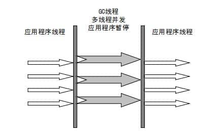

# 语法的发展历史
## c / c++
- 手工管理 malloc free / new delete
- 忘记释放 – memory leak – out of memory
- 释放多次 产生极其难易调试的bug，一个线程空间莫名其妙被另外一个释放了
- 开发效率很低

## java python go js kotlin scala
- 方便内存管理的语言
- GC - Garbage Collector - 应用程序只管分配，垃圾回收器负责回收
- 大大降低程序员门槛

## rust
- 运行效率超高（ asm c c++)
- 不同手工管理内存（没有GC）
- 学习曲线巨高（ownership）
- 你只要程序语法通过，就不会有bug

## java vs c++
- java
  - GC处理垃圾
  - 开发效率高，执行效率低
- C++
  - 手工处理垃圾
  - 忘记回收
    - 内存泄漏
  - 回收多次
    - 非法访问
  - 开发效率低，执行效率高


# GC 基础知识

## 1. 什么是垃圾？
没有任何引用指向的一个对象或者多个对象（循环引用）

## 2. 如何定位垃圾？
### 引用计数（RefenenceCount）
给对象中添加一个引用计数器：
- 每当有一个地方引用它，计数器就加 1；
- 当引用失效，计数器就减 1；
- 任何时候计数器为 0 的对象就是不可能再被使用的。

**这个方法实现简单，效率高，但是目前主流的虚拟机中并没有选择这个算法来管理内存，其最主要的原因是它很难解决对象之间相互循环引用的问题。**

所谓对象之间的相互引用问题，如下面代码所示：除了对象 objA 和 objB 相互引用着对方之外，这两个对象之间再无任何引用。但是他们因为互相引用对方，导致它们的引用计数器都不为 0，于是引用计数算法无法通知 GC 回收器回收他们。

```java
public class ReferenceCountTest {
    Object instance = null;
    public static void main(String[] args) {
        ReferenceCountTest objA = new ReferenceCountTest();
        ReferenceCountTest objB = new ReferenceCountTest();
        objA.instance = objB;
        objB.instance = objA;
        objA = null;
        objB = null;
    }
}
```

### 根可达算法(RootSearching)

这个算法的基本思想就是通过一系列的称为 “GC Roots” 的对象作为起点，从这些节点开始向下搜索，节点所走过的路径称为引用链，当一个对象到 GC Roots 没有任何引用链相连的话，则证明此对象是不可用的，需要被回收。


图中的 Object6 Object7 Object8 都是垃圾。

#### 哪些对象可以作为 GC Roots 呢？

- 线程栈中引用的对象 （JVM stack）
- 方法区中静态变量引用的对象 （static references in method area）
- 方法区中常量池引用的对象（ runtime constant pool）
- 本地方法栈中JNI指针，就是直接调用c/c++的方法，也就是native方法（native method stack）

有的说还有：所有被同步锁持有的对象

方法记忆，称之为两栈两方法

# 垃圾收集算法

## 标记清除算法（Mark-Sweep）

该算法分为“标记”和“清除”阶段：首先标记出所有**不需要回收**的对象，在标记完成后统一回收掉所有没有被标记的对象。

它是最基础的收集算法，后续的算法都是对其不足进行改进得到。这种垃圾收集算法会带来两个明显的问题：

**1. 效率问题（两次扫描，一次是标记，一次是情理）**

**2. 空间问题（标记清除后会产生大量不连续的碎片）**


## 标记-复制算法 （Copying）
为了解决效率问题，“标记-复制”收集算法出现了。它可以将内存分为大小相同的两块，每次使用其中的一块。当这一块的内存使用完后，就将还存活的对象复制到另一块去，然后再把使用的空间一次清理掉。这样就使每次的内存回收都是对内存区间的一半进行回收。


**缺点：**
浪费内存

复制算法要想使用，最起码对象的存活率要非常低才行，而且最重要的是，我们必须要克服50%内存的浪费。

## 标记-整理算法 （Mark-Compact）

根据老年代的特点提出的一种标记算法，标记过程仍然与“标记-清除”算法一样，但后续步骤不是直接对可回收对象回收，而是让所有存活的对象向一端移动，然后直接清理掉端边界以外的内存。


**没有碎片，效率偏低（两遍扫描，指针需要调整）**

## 分代收集算法

当前虚拟机的垃圾收集都采用分代收集算法，这种算法没有什么新的思想，只是根据对象存活周期的不同将内存分为几块。一般将 java 堆分为新生代和老年代，这样我们就可以根据各个年代的特点选择合适的垃圾收集算法。

**比如在新生代中，每次收集都会有大量对象死去，所以可以选择”标记-复制“算法，只需要付出少量对象的复制成本就可以完成每次垃圾收集。而老年代的对象存活几率是比较高的，而且没有额外的空间对它进行分配担保，所以我们必须选择“标记-清除”或“标记-整理”算法进行垃圾收集。**

延伸面试问题： HotSpot 为什么要分为新生代和老年代？

根据上面的对分代收集算法的介绍回答。

> 除Epsilon ZGC Shenandoah之外的GC都是使用逻辑分代模型
>
> G1是逻辑分代，物理不分代
>
> 除此之外不仅逻辑分代，而且物理分代

逻辑分代：就是在逻辑上区分新生代和老年代（可以称在叫法上）
物理分代：就是根据jvm定义的新生代和老年代来分


# 常见的垃圾收集（回收）器


## Serial 收集器（单线程、复制算法）

Serial（串行）收集器是最基本、历史最悠久的垃圾收集器了。大家看名字就知道这个收集器是一个单线程收集器了。它的 “单线程” 的意义不仅仅意味着它只会使用一条垃圾收集线程去完成垃圾收集工作，更重要的是它在进行垃圾收集工作的时候必须暂停其他所有的工作线程（ "Stop The World" 或者称之为 STW ），直到它收集结束。

**新生代采用标记-复制算法，老年代采用标记-整理算法。**


> 对于Stop the world，他会在垃圾回收开始时停掉其他所有的线程，只供垃圾回收器回收使用，这样对于系统尤其是高并发系统来说就是一个噩梦；
> 从JDK1.3开始，从 Serial——>Paralle——>CMS——>G1 ，不断改进收集器回收策略，减少STW的停顿时间，但仍然无法完全消除；

| 优点 | 缺点 |
| ------ | ------ |
| 简单高效，对于限定单个CPU的环境来说，Serial垃圾收集器没有线程交互(交换)开销，可以获得最高的单线程手机效率 | 会发生SWT现象   |

## ParNew 收集器 （Serial + 多线程）

**ParNew 收集器其实就是 Serial 收集器的多线程版本，除了使用多线程进行垃圾收集外，其余行为（控制参数、收集算法、回收策略等等）和 Serial 收集器完全一样。多用于Server模式下，也可以与下文的CMS收集器配合使用**


**新生代采用标记-复制算法，老年代采用标记-整理算法。**



**并行和并发概念补充：**
- 并行（Parallel）：指多条垃圾收集线程并行工作，但此时用户线程仍然处于等待状态。
- 并发（Concurrent）：指用户线程与垃圾收集器线程同时执行（但不一定是并行，可能会交替执行），用户程序在继续运行，而垃圾收集器运行在另一个CPU上。

## Parallel Scavenge 收集器（多线程、复制算法）
ParallelScavange垃圾回收器是一个新生代的垃圾回收器，同样使用复制算法，也是一个多线程的垃圾回收器，他重点关注的是程序的吞吐量问题；
> 吞吐量 = CPU运行用户的代码时间 / CPU总的消耗时间 = 运行用户代码时间 / (运行用户代码时间+垃圾回收时间)


它的调优方式有：
```shell
# 控制最大垃圾回收时间，大于0ms；
-XX:MaxGCPauseMillis

# 设置垃圾回收时间占总时间的比率，0<n<100的整数；
-XX:GCTimeRatio

# 不用手动指定一些细节的调整(-Xmn 、-XX:SurvivorRation、-XX:PetenureSizeThreshold)，JVM会根据当前系统的运行情况收集监测性能，自动调节参数
-XX:+UseAdptiveSizePolicy
```

使用
```shell
# 使用 Parallel 收集器+ 老年代串行
-XX:+UseParallelGC

# 使用 Parallel 收集器+ 老年代并行
-XX:+UseParallelOldGC
```

**新生代采用标记-复制算法，老年代采用标记-整理算法。**


这是 `JDK1.8` 默认收集器

使用 java -XX:+PrintCommandLineFlags -version 命令查看
```shell
$ java -XX:+PrintCommandLineFlags -version
-XX:InitialHeapSize=533622528 -XX:MaxHeapSize=8537960448 -XX:+PrintCommandLineFlags -XX:+UseCompressedClassPointers -XX:+UseCompressedOops -XX:-UseLargePagesIndividualAllocation -XX:+UseParallelGC
java version "1.8.0_131"
Java(TM) SE Runtime Environment (build 1.8.0_131-b11)
Java HotSpot(TM) 64-Bit Server VM (build 25.131-b11, mixed mode)
```

JDK1.8 默认使用的是 Parallel Scavenge + Parallel Old，如果指定了-XX:+UseParallelGC 参数，则默认指定了-XX:+UseParallelOldGC，可以使用-XX:-UseParallelOldGC 来禁用该功能


# 参考资料
https://javaguide.cn/java/jvm/jvm-garbage-collection.html#parallel-scavenge-%E6%94%B6%E9%9B%86%E5%99%A8

[(62条消息) Java中七大垃圾回收器_我还年轻我很平凡的博客-CSDN博客_java垃圾回收器](https://blog.csdn.net/weixin_43784989/article/details/101674169)
