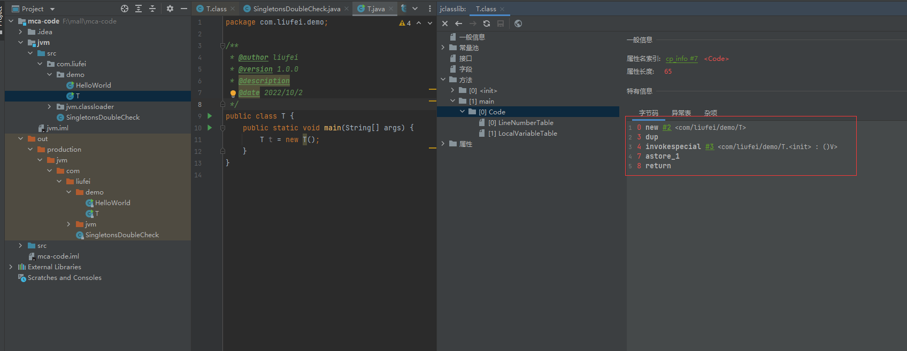

# 单例双重检查
```java
public class SingletonsDoubleCheck {

    // 这里要加上 volatile
    private static volatile SingletonsDoubleCheck INSTANCE = null;

    private SingletonsDoubleCheck(){}

    public static SingletonsDoubleCheck getInstance() {
        if (INSTANCE == null) {
            synchronized (SingletonsDoubleCheck.class) {
                // 双重检查
               if (INSTANCE == null) {
                   INSTANCE = new SingletonsDoubleCheck();
               }
            }
        }
        return INSTANCE;
    }
}
```

volatile 关键字的作用是防止指令重拍

```java
public class T {
    public static void main(String[] args) {
        T t = new T();
    }
}
```

这里我们用一个简单的new T() 来说明下。

在idea上装上jclasslib Bytecode Viewer 插件，看下T的class字节码




下面是main方法里面的指令
```java
0 new #2 <com/liufei/demo/T>
3 dup
4 invokespecial #3 <com/liufei/demo/T.<init> : ()V>
7 astore_1
8 return
```

指令4：当new对象之后，这里会调用初始化方法`<init>` ，完成对实例变量赋初始值。
指令7：是将引用类型或returnAddress类型值存入局部变量1。这个局部变量1就是t,就是将new好的对象内存地址指向t

如果不加volatile关键字，指令发生重拍，指令7在4之前执行，那么此时指令4还没有执行完毕（假设还没给实例变量赋初始值），你就拿到了INSTANCE，在获取INSTANCE里面的实例变量时，可能拿到的就是实例变量的默认值，这样就会导致数据不正确。