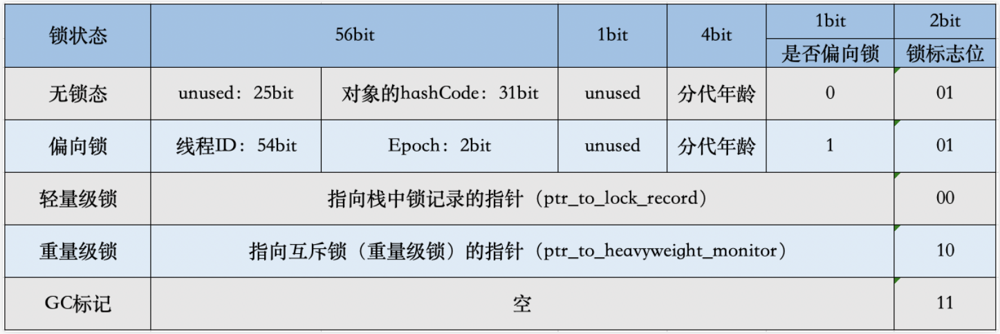
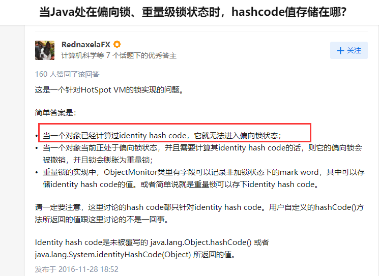

一线互联网企业面试题：
关于对象（下面测试都是在64为机器上测试的, jdk1.8）

# 观察虚拟机的配置
```shell
$ java -XX:+PrintCommandLineFlags -version
-XX:InitialHeapSize=533622528 -XX:MaxHeapSize=8537960448 -XX:+PrintCommandLineFlags -XX:+UseCompressedClassPointers -XX:+UseCompressedOops -XX:-UseLargePagesIndividualAllocation -XX:+UseParallelGC
java version "1.8.0_131"
Java(TM) SE Runtime Environment (build 1.8.0_131-b11)
Java HotSpot(TM) 64-Bit Server VM (build 25.131-b11, mixed mode)
```

# 一、请解释下对象的创建过程？
    1. class loading
    2. class linking (verfication preparation resolution)
       1. 验证（verfication）：验证是否符合JVM规定。
       2. 准备（preparation）：给静态成员变量赋默认值。
       3. 解析（resolution）：将符号引用替换成直接引用
    3. class initializing
       1. 初始化：调用类初始化代码 ，给静态成员变量赋初始值
    4. 申请对象内存
    5. 成员变量赋默认值
    6. 调用构造方法的<init>
       1. 成员变量按顺序赋初始值
       2. 执行构造方法语句

# 二、对象在内存中的存储布局？
## 普通对象
1. 对象头：markword 8
2. ClassPoint指针：-XX:+UseCompressedClassPointers 只开启压缩。开启后4个字节，不开就是8个字节
3. 实例数据
   1. 引入类型：-XX:+UseCompressedOops 为4个字节，不开压缩为8个字节。oop 是 Ordinary Object Pointers
4. Padding对齐：8的倍数

## 数组对象
1. 对象头：markword 8
2. ClassPoint指针：-XX:+UseCompressedClassPointers 只开启压缩。开启后4个字节，不开就是8个字节
3. 数组长度：4个字节
4. 数组数据
5. Padding对齐：8的倍数


**Padding对齐填充**

> 在Hotspot中，为了更加容易的管理内存，一般会使用8字节进行对齐。
> 
> 意思是每次分配的内存大小一定是8的倍数，如果对象头+实例数据的值不是8的倍数，那么会重新计算一个较大值，进行分配。

# 三、对象头具体包括什么？

**跟当前对象所处的状态有关，是处于偏向锁还是其它状态**

markdown的结构，定义在hotspot的src/share/vm/oops/markOop.hpp
hotspot下载：http://hg.openjdk.java.net/jdk8/jdk8/hotspot/

```hpp
 32 bits:
 --------
 hash:25 ------------>| age:4    biased_lock:1 lock:2 (normal object)
 JavaThread*:23 epoch:2 age:4    biased_lock:1 lock:2 (biased object)
 size:32 ------------------------------------------>| (CMS free block)
 PromotedObject*:29 ---------->| promo_bits:3 ----->| (CMS promoted object)

 64 bits:
 --------
 unused:25 hash:31 -->| unused:1   age:4    biased_lock:1 lock:2 (normal object)
 JavaThread*:54 epoch:2 unused:1   age:4    biased_lock:1 lock:2 (biased object)
 PromotedObject*:61 --------------------->| promo_bits:3 ----->| (CMS promoted object)
 size:64 ----------------------------------------------------->| (CMS free block)

 unused:25 hash:31 -->| cms_free:1 age:4    biased_lock:1 lock:2 (COOPs && normal object)
 JavaThread*:54 epoch:2 cms_free:1 age:4    biased_lock:1 lock:2 (COOPs && biased object)
 narrowOop:32 unused:24 cms_free:1 unused:4 promo_bits:3 ----->| (COOPs && CMS promoted object)
 unused:21 size:35 -->| cms_free:1 unused:7 ------------------>| (COOPs && CMS free block)

...

enum {  locked_value             = 0, // 0 00 轻量级锁
         unlocked_value           = 1,// 0 01 无锁
         monitor_value            = 2,// 0 10 重量级锁
         marked_value             = 3,// 0 11 gc标志
         biased_lock_pattern      = 5 // 1 01 偏向锁
  };

```

Mark Word 在32位 JVM 中：

1字节 = 4位(bit)


Mark Word 在64位 JVM 中：

1字节 = 8位(bit)




**此处，有几点要注意:**

- 如果对象没有重写hashcode方法，那么默认是调用os::random产生hashcode,可以通过System.identityHashCode获取；os::random产生hashcode的规则为:next_rand = (16807seed) mod (2*31-1),因此可以使用31位存储;另外一旦生成了hashcode,JVM会将其记录在markword中；
- GC年龄采用4位bit存储，最大为15，例如MaxTenuringThreshold参数默认值就是15（二进制4位，最大是1111，1111转换成10进制就是15。设置超过15会报错，通过-XX:MaxTenuringThreshold=n 来设置）；
- 当处于轻量级锁、重量级锁时，记录的对象指针，根据JVM的说明，此时认为指针仍然是64位，最低两位假定为0;当处于偏向锁时，记录的为获得偏向锁的线程指针，该指针也是64位；


参考：https://blog.csdn.net/weixin_52593321/article/details/119918202


## ideatityHashCode的问题


https://cloud.tencent.com/developer/article/1480590

https://cloud.tencent.com/developer/article/1484167

https://cloud.tencent.com/developer/article/1485795

https://cloud.tencent.com/developer/article/1482500

# 四、对象怎么定位？

[(62条消息) 访问对象两种方式--句柄和直接指针_稳重的二哈的博客-CSDN博客_句柄和直接指针](https://blog.csdn.net/clover_lily/article/details/80095580)

- 句柄池
- 直接指针

# 五、对象怎么分配？

对象首先会尝试在栈上分配，在栈上的对象有一个好处，进行垃圾回收的时候不需要垃圾回收器处理，直接就弹出去了


1. 优先在栈中分配，对象不大，而且对象不会逃逸（对象只会在当前方法中引用）。随着方法调用结束弹栈，对象也就释放了。不需要GC！！！
2. 不满足栈上分配，看这个对象够不够大，够大直接进Old区，由FGC清除对象
3. 这个对象不够直接进Old区，优先分配在TLAB上（其实也是Eden区，JVM为了避免多线程并发分配内存空间进行抢占，提前在Eden区给每个线程单独分配一块内存区域，默认是1%）
4. 如果在TLAB上分配失败了，就会在Eden区进行分配。
   

## 逃逸分析

###  1. 什么是逃逸（Escape）

通俗点讲，如果一个对象的指针被多个方法或者线程引用时，那么我们就称这个对象的指针（或对象）逃逸了（Escape）。

### 2. 什么是逃逸分析

逃逸分析，是一种可以有效减少Java 程序中同步负载和内存堆分配压力的跨函数全局数据流分析算法。通过逃逸分析，Java Hotspot编译器能够分析出一个新的对象的引用的使用范围从而决定是否要将这个对象分配到堆上。 逃逸分析（Escape Analysis）算是目前Java虚拟机中比较前沿的优化技术了。

### 3. 逃逸的方式？

- **方法逃逸：**在一个方法体内，定义一个局部变量，而它可能被外部方法引用，比如作为调用参数传递给方法，或作为对象直接返回。或者，可以理解成对象跳出了方法。

- **线程逃逸：**这个对象被其他线程访问到，比如赋值给了实例变量，并被其他线程访问到了。对象逃出了当前线程。

### 4. 逃逸例子

```java
/**
 * 无逃逸
 */
void test01() {
    String test1 = "test1";
}
String test2;
/**
  * 逃逸
  */
void test02() {
    test2 = "test2";
}
```

在方法内的变量不会逃逸，在方法外声明的对象会发生逃逸，脱离了方法的控制，方法结束时变量没有结束

### 5. 逃逸分析的好处？

   如果一个对象不会在方法体内，或线程内发生逃逸（或者说是通过逃逸分析后，使其未能发生逃逸）

- **栈上分配：**

   一般情况下，不会逃逸的对象所占空间比较大，如果能使用栈上的空间，那么大量的对象将随方法的结束而销毁，减轻了GC压力

- **同步消除：**

   如果你定义的类的方法上有同步锁，但在运行时，却只有一个线程在访问，此时逃逸分析后的机器码，会去掉同步锁运行。

- **标量替换：**

   Java虚拟机中的原始数据类型（int，long等数值类型以及reference类型等）都不能再进一步分解，它们可以称为标量。相对的，如果一个数据可以继续分解，那它称为聚合量，Java中最典型的聚合量是对象。如果逃逸分析证明一个对象不会被外部访问，并且这个对象是可分解的，那程序真正执行的时候将可能不创建这个对象，而改为直接创建它的若干个被这个方法使用到的成员变量来代替。拆散后的变量便可以被单独分析与优化，可以各自分别在栈帧或寄存器上分配空间，原本的对象就无需整体分配空间了。

### 6. 逃逸分析测试时

```java
//加上这段参数 关闭在栈上分配
//-XX:-DoEscapeAnalysis -XX:-EliminateAllocations -XX:-UseTLAB
public class EscapeTest {

    class User {
        int id;
        String name;

        public User(int id, String name) {
            this.id = id;
            this.name = name;
        }
    }


    void alloc(int i) {
        new User(i, "name" + i);
    }

    public static void main(String[] args) {
        EscapeTest escape = new EscapeTest();
        long startTime = System.currentTimeMillis();
        for (int i = 0; i < 1000_0000; i++) {
            escape.alloc(i);
        }
        long endTime = System.currentTimeMillis();
        System.out.println("完成时间：" + (endTime - startTime));
    }
}
```

关闭栈上分配后，运行结果

```
完成时间：425
```

调整参数（`-XX:+DoEscapeAnalysis -XX:+EliminateAllocations -XX:+UseTLAB`），打开栈上分配，运行结果：

```java
完成时间：248
```

可以发现在栈上分配快乐很多

**栈上分配默认是开启的**

# 六、Object o = new Object() 在内存中占用多少个字节？

是16

## 使用Agent验证
使用Agent技术

1. 新建项目ObjectSize （1.8）

2. 创建文件ObjectSizeAgent

   ```java
   package com.liufei.jvm.agent;
   import java.lang.instrument.Instrumentation;

   public class ObjectSizeAgent {

      private static Instrumentation inst;

      public static void premain(String agentArgs, Instrumentation _inst) {
         inst = _inst;
      }

      public static long sizeOf(Object o) {
         return inst.getObjectSize(o);
      }
   }
   ```

3. src 目录下创建META-INF/MANIFEST.MF
   ```java
   Manifest-Version: 1.0
   Premain-Class: com.liufei.jvm.agent.ObjectSizeAgent
   
   ```
   注意Premain-Class这行必须是新的一行（回车 + 换行），确认idea 不能有任何错误提示

4. 打成jar包
5. 在需要使用该Agent Jar的项目中引入该Jar包 project structure - project settings - library 添加该jar包
6. 运行时需要该Agent Jar的类，加入参数：
   ```java
   -javaagent:F:\mca-code\jvm\lib\ObjectSizeAgent.jar\ObjectSize.jar
   ```
7. 如何使用该类：
   ```java
   public class SizeOfAndObject {
   
    public static void main(String[] args) {
        System.out.println(ObjectSizeAgent.sizeOf(new Object()));
        System.out.println(ObjectSizeAgent.sizeOf(new int[]{}));
        System.out.println(ObjectSizeAgent.sizeOf(new P()));
    }
   
    //一个Object占多少个字节
    // -XX:+UseCompressedClassPointers -XX:+UseCompressedOops
    // Oops = ordinary object pointers
    private static class P {
        //8 _markword
        //4 _class pointer
        int id;         //4
        String name;    //4
        int age;        //4
   
        byte b1;        //1
        byte b2;        //1
   
        Object o;       //4
        byte b3;        //1
   
      }
   }
   ```
   运行结果
   ```shell
   16
   16
   32
   ```

   分析下：

   

# Hotspot 开启内存压缩的规则（64位）
1. 4G以下，直接砍掉高32位
2. 4G - 32G，默认开启内存压缩 ClassPointers Oops
3. 32G，压缩无效，使用64位 内存并不是越大越好（^-^）


# Synchronized 和 ReetrantLock的区别？（顺带补充）
1. Synchronized 是JVM层次的锁实现，ReentrantLock 是JDK层次的锁实现;
2. Synchronized 的锁状态是无法在代码中直接判断的，但是ReentrantLock可以通过`ReentrantLock#isLocked`判断;
3. Synchronized 是非公平锁，而ReentrantLock 可以是公平也可以是非公平的;
4. Synchronized 是不可以被中断的，而 `ReentrantLock#lockInterruptibly` 方法是可以被中断的;
5. 在发生异常的时Synchronized会自动释放锁（由javac编译时自动实现），而ReentrantLock 需要开发者在finally块中显示释放锁;
6. ReentrantLock 获取锁的形式由多种：如立即返回是否成功的tryLock()，以及等待指定时长的获取，更加灵活；