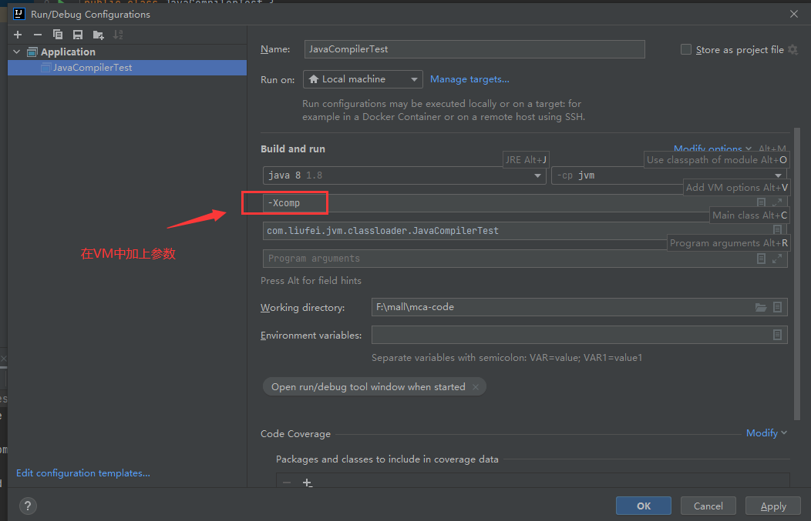

# 查看jdk的模式

```shell
$ java -version
java version "1.8.0_131"
Java(TM) SE Runtime Environment (build 1.8.0_131-b11)
Java HotSpot(TM) 64-Bit Server VM (build 25.131-b11, mixed mode)
```

mixed mode  -> 就是混合模式


# 混合模式
- 解释器
  - bytecode intepreter
- JIT
  - Just In-Time compiler
- 混合模式
  - 混合使用解释器 + 热点代码编译
  - 起始阶段采用解释执行
  - 热点代码检测
    - 多次被调用的方法（方法计数器：检测方法执行频率）
    - 多次被调用的循环（循环计数器：检测循环执行频率）
  - 修改JIT编译阈值：-XX:CompileThreshold=10000。一旦函数调用次数超过这个阈值，就会被认为是热点代码，接着就会对该热点代码进行即时编译。

# 指定模式
- -Xmixed 默认为混合模式。开始解释执行，启动速度较快，对热点代码实行检测和编译。
- -Xint 使用解释模式，启动很快，执行稍慢
- -Xcomp 使用编译模式，执行很快，启动很慢。


使用下面代码测试

```java
public class JavaCompilerTest {

    static int j = 0;

    public static void main(String[] args) {
        for (int i = 0; i < 10_0000; i++) {
            m();
        }
        long start = System.currentTimeMillis();
        for (int i = 0; i < 10_0000; i++) {
            m();
        }
        long end = System.currentTimeMillis();
        System.out.println(end - start);
    }

    private static void m() {
        for (int i = 0; i < 100_000; i++) {
            j++;
        }
    }
}
```

测试结果(单位ms)

```shell
# -Xmixed，混合模式
278
# -Xint，解释模式
111625
# -Xcomp，编译模式
278
```

编译模式跟混合模式速度差不多，但是编译模式，启动时明显感觉到有些慢

