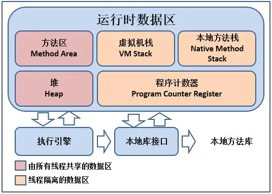

# 运行时数据区域


## 程序计数器【Program Counter Register】
```shell
存放指令位置
虚拟机的运行，类似于这样的循环：

while( not end ) {

​ 取PC中的位置，找到对应位置的指令；

​ 执行该指令；

​ PC ++;

}
```

### 作用
1. 字节码解释器通过改变程序计数器来依次读取指令，从而实现代码的流程控制。如：顺序执行、选择、循环、异常处理。
2. 在多线程的情况下，程序计数器用于记录当前线程执行的位置，从而当线程被切换回来的时候能够知道该线程上次运行到哪儿了。

### 特点
1. 是一块较小的存储空间；
2. 线程私有。每个线程都有一个程序计数器；
3. 是唯一一个不会出现OutOfMemoryError 的内存区域；
4. 生命周期：随着线程的创建而创建，随着线程的结束而死亡。


## 虚拟机栈（VM Stack）

与程序计数器一样，Java 虚拟机栈也是线程私有的，它的生命周期与线程相同。

虚拟机栈描述的是 Java 方法执行的线程内存模型：每个方法被执行的时候，JVM 都会同步创建一个栈帧(Stack Frame)用于存储局部变量表、操作数栈、动态连接、方法出口等信息。每一个方法被调用直至执行完毕的过程，就对应着一个栈帧在虚拟机栈中从入栈到出栈的过程。

### 栈帧(Stack Frame)
每个方法对应一个

内容：
1. 局部变量表
2. 操作数栈
3. 动态链接。https://blog.csdn.net/qq_41813060/article/details/88379473
4. 方法返回。方法a调用了方法b, b方法的返回值放在什么地方


演示一个面试题

```java
public class TestIPlus {
    public static void main(String[] args) {
        int i = 8;
        i = i++;
        // i = ++i;
        System.out.println(i);
    }

}
```
运行结果是 8 ，来分析下

看下对应的二进制码
```java
 0 bipush 8
 2 istore_1
 3 iload_1
 4 iinc 1 by 1
 7 istore_1
 8 getstatic #2 <java/lang/System.out : Ljava/io/PrintStream;>
11 iload_1
12 invokevirtual #3 <java/io/PrintStream.println : (I)V>
15 return
```

- 0 bioush 8  => push byte 字节的数到 操作数栈。直接字节以符号形式扩展到 int 值，该值被推送到操作数栈上。
- 2 istore_1 => i 指int类型，store 存储，_1 中的1是局部变量表的位置，这里指的是 i。就是将i 对象的值8 从操作数栈中取出 存储到局部变量表。（此时操作数栈为空， 局部变量表有个 i = 8）
- 3 iload_1 => i 指int类型，load 读取数据，_1 中的1是局部变量表的位置。从局部变量表取位置为1 的数据 8 放入到操作数栈中（此时操作数栈里面有个值8，局部变量表有个 i = 8）
- 4 iinc 1 by 1 => i 指int类型， inc 增加，1 by 1 ，第一个1是指局部变量表位置为1的数据，就是i，by 1是指 i 要加 1。将局部变量表中的i + 1（此时操作数栈里面有个值8，局部变量表有个 i = 9）
- istore_1 => 同2。将操作数栈中的i = 8 取出来存放到局部变量表中，局部变量中的 i = 9会被重新赋值为 8 （此时操作数栈为空， 局部变量表有个 i = 8）
- 11 iload_1 => 同3。


将 i = i++ 改成 i = ++i;

此时结果是 9

看下对应的二进制码
```java
 0 bipush 8
 2 istore_1
 3 iinc 1 by 1
 6 iload_1
 7 istore_1
 8 getstatic #2 <java/lang/System.out : Ljava/io/PrintStream;>
11 iload_1
12 invokevirtual #3 <java/io/PrintStream.println : (I)V>
15 return
```

可以看到与 i = i++的区别。


**Q：为什么i的位置是1**

A: 因为main方法还有一个args参数。args参数是在0位置上


再来看几个方法的二进制码：

```java
public class Test_1 {

    public static void main(String[] args) {
        Test_1 test_1 = new Test_1();
        test_1.m();
    }

    public void m() {
        int i = 200;
    }
}
```

=> 这里我们只看m() 方法对应的二进制码

```java
0 sipush 200
3 istore_1
4 return
```

- 这里变成了sipush，s是short类型。因为200超过的int的缓存池范围[-128, 127]，所以变成了sipush
- m()方法我们只有一个变量 i，但是i 的位置确实在 1位置上。那么0号位置是谁？，是this，这就是为什么我们可以在非静态方法里面使用this的原因。静态方法里面是没有this局部变量的


### invoke 指令
- invokeStatic
  
   Invoke a class (static) method （调用静态方法）

   官方资料：https://docs.oracle.com/javase/specs/jvms/se16/html/jvms-6.html#jvms-6.5.invokestatic
- invokeVirtual
  
    Invoke instance method; dispatch based on class （调用实例方法;基于类的调度）

    自带多态。大部分方法都是invokeVirtual


    官方资料：https://docs.oracle.com/javase/specs/jvms/se16/html/jvms-6.html#jvms-6.5.invokevirtual
- invokeInterface
  
    Invoke interface method (调用接口方法)

    ```java
    public class Test_InvokeInterface {
  
        public static void main(String[] args) {
            List<String> list = new ArrayList<>();
            list.add("hello");
  
            ArrayList<String> list2 = new ArrayList<>();
            list2.add("hello");
        }
    }
    ```

    对应的二进制码

    ```java
    0 new #2 <java/util/ArrayList>
    3 dup
    4 invokespecial #3 <java/util/ArrayList.<init> : ()V>
    7 astore_1
    8 aload_1
    9 ldc #4 <hello>
    11 invokeinterface #5 <java/util/List.add : (Ljava/lang/Object;)Z> count 2
    16 pop
    17 new #2 <java/util/ArrayList>
    20 dup
    21 invokespecial #3 <java/util/ArrayList.<init> : ()V>
    24 astore_2
    25 aload_2
    26 ldc #4 <hello>
    28 invokevirtual #6 <java/util/ArrayList.add : (Ljava/lang/Object;)Z>
    31 pop
    32 return
    ```

    官方资料：https://docs.oracle.com/javase/specs/jvms/se16/html/jvms-6.html#jvms-6.5.invokeinterface

- invokeSpecial

    Invoke instance method; direct invocation of instance initialization methods and methods of the current class and its supertypes （调用实例方法;直接调用实例初始化方法和当前类及其超类型的方法）

    可以直接调用，不需要多态。如 private方法和构造方法

    ```java
    public class Test_InvokeSpecial {

        public static void main(String[] args) {
            Test_InvokeSpecial t = new Test_InvokeSpecial();
            t.m();
            t.n();
        }

        public final void m() {
        }

        private void n() {
        }
    }
    ```

    对应的二进制码

    ```java
    0 new #2 <com/liufei/runtimeDataArea/Test_InvokeSpecial>
    3 dup
    4 invokespecial #3 <com/liufei/runtimeDataArea/Test_InvokeSpecial.<init> : ()V>
    7 astore_1
    8 aload_1
    9 invokevirtual #4 <com/liufei/runtimeDataArea/Test_InvokeSpecial.m : ()V>
    12 aload_1
    13 invokevirtual #5 <com/liufei/runtimeDataArea/Test_InvokeSpecial.n : ()V>
    16 return
    ```

    官方资料：https://docs.oracle.com/javase/specs/jvms/se16/html/jvms-6.html#jvms-6.5.invokespecial

- invokeDynamic

    Invoke a dynamically-computed call site （调用动态计算的调用站点）

    JVM最难得指令，jdk1.7之后增加的。

    如：lambda表达式或者反射或者其他动态语言scala kotlin，或者CGLib ASM，动态产生的class，会用到的指令

    ```java
    public class Test_InvokeDynamic {
        public static void main(String[] args) {
    
            I i = C::n;
            I i2 = C::n;
            I i3 = C::n;
            I i4 = () -> {
                C.n();
            };
            System.out.println(i.getClass());
            System.out.println(i2.getClass());
            System.out.println(i3.getClass());
    
            //for(;;) {I j = C::n;} //MethodArea <1.8 Perm Space (FGC不回收)
        }
    
        @FunctionalInterface
        public interface I {
            void m();
        }
    
        public static class C {
            static void n() {
                System.out.println("hello");
            }
        }
    }
    ```
    运行结果：

    ```java
    class com.liufei.runtimeDataArea.Test_InvokeDynamic$$Lambda$1/1967205423
    class com.liufei.runtimeDataArea.Test_InvokeDynamic$$Lambda$2/1690716179
    class com.liufei.runtimeDataArea.Test_InvokeDynamic$$Lambda$3/1053782781
    ```

    => 对应的二进制码：
    ```java
    0 invokedynamic #2 <m, BootstrapMethods #0>
    5 astore_1
    6 invokedynamic #2 <m, BootstrapMethods #0>
    11 astore_2
    12 invokedynamic #2 <m, BootstrapMethods #0>
    17 astore_3
    18 invokedynamic #3 <m, BootstrapMethods #1>
    23 astore 4
    25 getstatic #4 <java/lang/System.out : Ljava/io/PrintStream;>
    28 aload_1
    29 invokevirtual #5 <java/lang/Object.getClass : ()Ljava/lang/Class;>
    32 invokevirtual #6 <java/io/PrintStream.println : (Ljava/lang/Object;)V>
    35 getstatic #4 <java/lang/System.out : Ljava/io/PrintStream;>
    38 aload_2
    39 invokevirtual #5 <java/lang/Object.getClass : ()Ljava/lang/Class;>
    42 invokevirtual #6 <java/io/PrintStream.println : (Ljava/lang/Object;)V>
    45 getstatic #4 <java/lang/System.out : Ljava/io/PrintStream;>
    48 aload_3
    49 invokevirtual #5 <java/lang/Object.getClass : ()Ljava/lang/Class;>
    52 invokevirtual #6 <java/io/PrintStream.println : (Ljava/lang/Object;)V>
    55 getstatic #4 <java/lang/System.out : Ljava/io/PrintStream;>
    58 aload 4
    60 invokevirtual #5 <java/lang/Object.getClass : ()Ljava/lang/Class;>
    63 invokevirtual #6 <java/io/PrintStream.println : (Ljava/lang/Object;)V>
    66 return
    ```

   官方资料：https://docs.oracle.com/javase/specs/jvms/se16/html/jvms-6.html#jvms-6.5.invokedynamic

## 本地方法栈【Native Method Stacks】

## 方法区（Method Area）
Perm Space (<1.8) 字符串常量位于PermSpace FGC不会清理 大小启动的时候指定，不能变
Meta Space (>=1.8) 字符串常量位于堆 会触发FGC清理 不设定的话，最大就是物理内存

## 堆（Heap）

## 直接内存【Direct Memory】

## 参考资料
https://www.jianshu.com/p/169430095eec