# 第一章 设计模式概述
**课程大纲**  

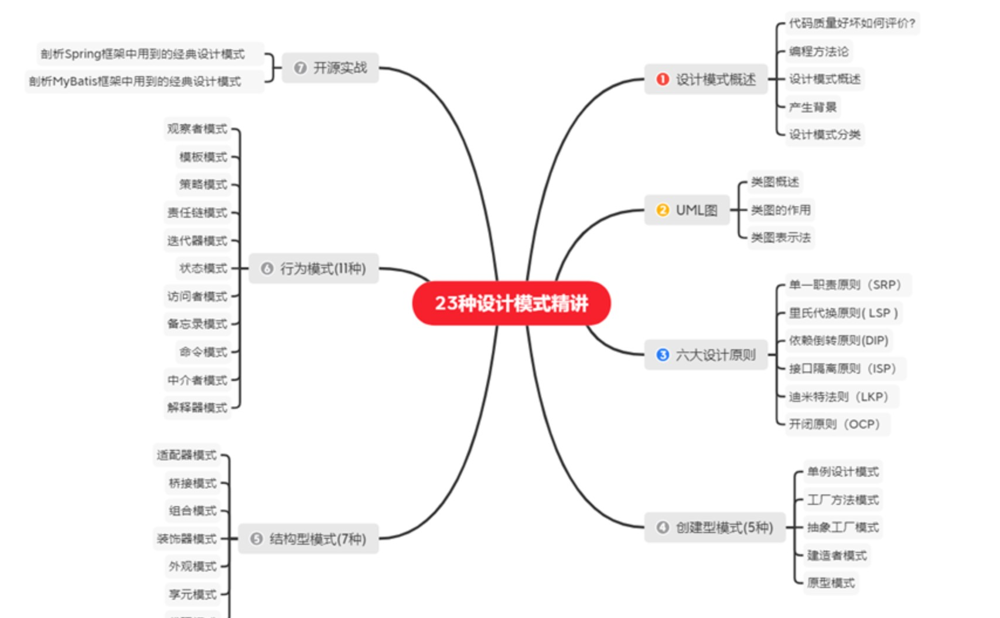

## 1.1 代码质量好坏如何评价?
要想学习设计模式呢 我们就必须搞清楚设计模式到底在我们的编程过程中起到了怎样的作用,在编程世界中它处在一个什么样的位置,它到底是一种抽象的设计思想,还是一套具体的落地方案. 

在学习设计模式之前呢 我们需要了解一下 代码质量的评价标准和编程的方法论

我们经常会听到有人对项目代码进行评价,一般就会说：“代码写得很烂”或者“代码写得很好”。
用“好”“烂”这样的词汇来描述代码质量，非常地笼统。

对于程序员来说，辨别代码写得“好”还是“烂”，是一个非常重要的能力。这也是我们写出好代码的前提。

代码质量的评价标准非常之多,我这里就给大家介绍一下最常用的几个标准

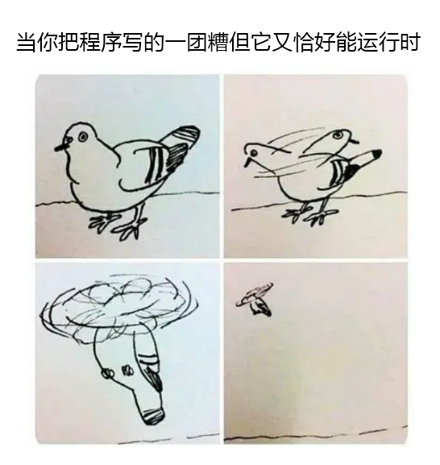

**评价代码的质量,有以下几个常用标准:** 

**1) 可维护性**

可维护性强的代码指的是:  在不去破坏原有的代码设计以及不引入新的BUG的前提下,能够快速的修改或者新增代码.

不易维护的代码指的是: 在添加或者修改一些功能逻辑的时候,存在极大的引入新的BUG的风险,并且需要花费的时间也很长.

> 代码可维护性的评判标准比较模糊, 因为是否易维护是针对维护的人员来说的,不同水平的人对于同一份代码的维护能力是不同的. 所谓 ''难者不会 会者不难''. 对于同样的系统,熟悉它的资深工程师会觉得代码可维护性还可以,而新人则会因为能力不足、了解不够深入等原因觉得代码的可维护性不是很好.

**2) 可读性**
软件开发教父，Martin Fowler曾经说过一句话: "任何傻瓜都能够编写计算机能理解的代码，而优秀的程序员能够编写人类能理解的代码。" 这句话的意思非常容易理解,就是要求我们写出的代码是易读的、易理解的,因为代码的可读性会在很大程度上影响代码的可维护行性.

> code review ( 代码审查,一种测试代码可读性的手段 )
>
> 1.检查代码风格和编程规范: 代码是否符合编码规范、命名是否达意、注释是否详尽、模块划分是否清晰等
>
> 2.检查常规的 bad smell 和代码 bug: 是否存在重复代码、过长函数、过大类、过于亲密的两个 classes等

**3) 可扩展性**
代码的可扩展性表示，我们在不修改或少量修改原有代码的情况下，通过扩展的方式添加新的功能代码。

> 可扩展性的背后其实就是: "对修改关闭,对扩展开放" 这条设计原则,后面我们会详细的讲解

**4) 灵活性**

"灵活" 是指在添加新代码的时候，已有代码能够不受影响，不产生冲突，不出现排斥，在保证自身不遭到破坏的前提下灵活地接纳新代码。

> 下面的几个场景,可以体现代码的灵活性
>
> 1.添加新的功能代码时,原有代码已经预留了扩展点,我们不需要修改 直接在扩展点上新增代码即可.
>
> 2.当我们想实现一个功能模块时,发现原有代码中,已经抽象出了很多底层可以复用的模块、类等代码,我们可以直接拿来使用
>
> 3.当我们使用某组接口时,这组接口可以应对各种使用场景,满足不同需求,这个接口设计的十分的灵活易用.

**5) 简洁性**

我们要遵从KISS ( Keep It Simple Stupid) 原则，代码要尽可能的简单；但是思从深而行从简，真正的高手能云淡风轻地用最简单的方法解决最复杂的问题。这也是一个编程老手跟编程新手的本质区别之一。

> 代码的写法应当使别人理解它所需的时间最小化.  

**6) 可复用性** 

代码的可复用性可以简单地理解为，尽量减少重复代码的编写，复用已有的代码.

> 可复用性也是一个非常重要的代码评价标准，是很多设计原则、思想、模式等所 要达到的最终效果
>
> 可复用性与DRY(Don't Repeat Yourself) 避免编写重复的代码逻辑. 原则关系紧密,后面我们会介绍有哪些编程方法可以提高代码复用性.

**7) 可测试性**

单元测试在一个完整的软件开发流程中是必不可少的、非常重要的一个环节。通常写单元测试并不难，但有的时候，有的代码和功能难以测试，导致写起测试来困难重重。所以写出的代码具有可测试性，具有很重要的作用。

> 代码可测试性的好坏，能从侧面上非常准确地反应代码质量的好坏

## 1.2 编程方法论

想要拥有编写高质量代码的能力,我们就要学习一些编程的方法论.其中就包含面向对象（我们可以把它看成一种设计思想）、设计原则、设计模式、编程规范、重构技巧等等

> 接下来我就给大家介绍一下这几个概念和他们之间的联系,介绍这些呢 有助于大家对于整个课程中包含的知识点, 有一个全局的了解,将我们学到的知识有序的组织在头脑中,方便大家记忆.


**代码重构的工具就是面向对象设计思想、设计原则、设计模式、编码规范。** 

**1) 面向对象**

面向对象是一种编程思想,也是一种编程范式. 现在比较流行的编程语言大部分都是面向对象编程语言.而大部分项目也都是基于面向对象编程风格进行开发的.

> 作为一名Java程序员,相信同学们对于面向对象的特点,以及面向对象思想在实际工作中的应用,都有一定深度的了解,这里边关于面向对象的一些相关知识点我们就不做赘述了.

**2) 设计原则 (本次课程重点讲解)**

设计原则是指导我们代码设计的一些经验总结。在软件开发中，为了提高软件系统的可维护性和可复用性，增加软件的可扩展性和灵活性，程序员要尽量根据设计原则来开发程序，从而提高软件开发效率、节约软件开发成本和维护成本。

常用的设计原则

- 单一职责原则
- 开闭原则
- 里氏代换原则
- 依赖倒转原则
- 接口隔离原则
- 迪米特法则

> 设计原则的特点就是比较的抽象,大家不需要死记硬背.每个人根据自己所积累的经验和所处的业务场景, 去灵活的运用这些原则即可

**3) 设计模式 (本次课程重点讲解)** 

设计模式是针对软件开发中经常遇到的一些设计问题，总结出来的一套解决方案或者设计思 路。大部分设计模式要解决的都是代码的可扩展性问题。

> 设计模式是遵循设计原则的, 设计模式相对于设计原则来说，没有那么抽象，而且大部分都不难理解，代码实现也并不复杂。这一块的学习难点是了解它们 都能解决哪些问题，掌握典型的应用场景，并且懂得不过度应用。

**4) 编程规范**
编程规范主要解决的是代码的可读性问题。编码规范相对于设计原则、设计模式，更加具 体、更加偏重代码细节。

> 对于编码规范，考虑到很多书籍已经讲得很好了（比如《编写可读性代码的艺术》《代码大全》《代码整洁之道》等）。而且，每条编码规范都非常简单、非常明确，比较偏向于记忆，你只要照着来做 可以。

**5) 重构**

维基百科:  在软件工程学里，**重构**代码一词通常是指在不改变代码的外部行为情况下而修改源代码，有时非正式地称为“清理干净”。在极限编程或其他敏捷方法学中，重构常常是软件开发循环的一部分：开发者轮流增加新的测试和功能，并重构代码来增进内部的清晰性和一致性。

> 在软件开发中，只要软件在不停地迭代，就没有一劳永逸的设计。随着需求的变化，代码的 不停堆砌，原有的设计必定会存在这样那样的问题。针对这些问题，我们就需要进行代码重构。重构是软件开发中非常重要的一个环节。持续重构是保持代码质量不下降的有效手段， 能有效避免代码腐化到无可救药的地步。

**6) 总结**

提高代码质量的方法论包含: 

- 面向对象思想 (基础)
- 设计原则 (指导方针) 
- 设计模式 (设计原则的具体实现) 
- 编程规范  (提高代码可读性) 
- 重构 (面向对象设计思想、设计原则、设计模式、编码规范的融合贯通)

> 设计原则是高手的内功，设计模式是少林，武当，峨眉派的武术套路，规范是招式 出拳还 是横扫，重构是组合拳 融汇贯通各种组合，而想练好这些武功还要有扎实的基本功 面向对 象,在这里呢 也提醒同学们一句,不要一味的去追求最新的技术(并不是说这样做不好,但是千万不要本末倒置),而忘记了一个程序员最重要的能力 是写出高质量的代码.

## 1.3 设计模式概述
- **设计模式（Design pattern）**是一套被反复使用、多数人知晓的、经过分类编目的、代码设计经验的总结

  > 在GOF编写的设计模式(可复用面向对象软件的基础)一书中说道:  本书涉及的设计模式**并不描述新的或未经证实的设计**，我们只**收录那些在不同系统中多次使用过的成功设计**。

- 大部分设计模式要解决的都是代码的可重用性、可扩展性问题
  
  > 如果说数据结构和算法是教你如何写出高效代码，那设计模式讲的是如何写出可扩展、可读、可维护的高质量代码，所以，它们跟平时的编码会有直接的关系，也会直接影响到你的开发能力。

学习设计模式的好处

- 能够从容应对面试中的设计模式相关问题

  > 我们学习技术从最功利的角度讲,就是为了拿到心仪的offer,得到想要的薪资.所以在面试时特别是面试一些BAT大厂时,如果被问到设计模式的问题, 因为我们学了本次课程, 就不会再惧怕这些问题,设计模式反而会成为你面试中的亮点.

- 不再编写 bullshit-code

  > 代码能力是一个程序员最基础的能力，是基本功，是展示一个程序员基础素养的最直接的衡量标准。你写的代码，实 际上就是你名片。我们通过学习设计模式,告别烂代码的编写,避免比如类设计不合理,代码结构混乱,分层不清晰 等等这样的代码问题. 让我们编写的代码成为团队中的标杆.

- 提高复杂代码的设计和开发能力

  > 不再只是根据业务需求翻译代码,填充代码. 而是能够通过所学习的设计模式的相关知识写出高质量的代码.即使面对复杂代码功能或者系统的设计开发也能得心应手.

- 有助于我们读懂源码,学习框架更加事半功倍

  > 对于一个有追求的程序员来说，对技术的积累，既要有广度，也要有深度。所以我们需要更多的去学习研究各种框架,中间件的底层原理,而这些优秀的框架 中间件的源码中会使用到很多设计思想 设计原则 设计模式 ,所以为了更好的独懂这些开源项目,我们必须好设计模式相关知识.


## 1.4 产生背景
**"设计模式"** 最初并不是出现在软件设计中，而是被用于建筑领域的设计中。

1977年美国著名建筑大师、加利福尼亚大学伯克利分校环境结构中心主任`克里斯托夫·亚历山大（Christopher Alexander）`在他的著作《建筑模式语言：城镇、建筑、构造》中描述了一些常见的建筑设计问题，并提出了 253 种关于对城镇、邻里、住宅、花园和房间等进行设计的基本模式。

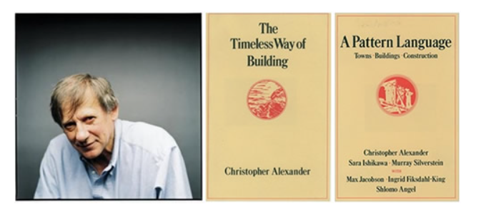

**四人帮（GOF）**

1990年软件工程界开始研讨设计模式的话题，后来召开了多次关于设计模式的研讨会。

> 在之前设计模式的**绝大部分以往并无文本记录**，它们或是来源于面向对象设计者圈子里的非正式交流，或是来源于某些成功的面向对象系统的某些部分，但对**设计新手**来说，这些东西是很难学得到的。尽管这些设计**不包括新的思路**，但我们**用一种新的、便于理解的方式将其展现给读者**，即：具有统一格式的、已分类编目的若干组设计模式。


1994 年，艾瑞克·伽马（ErichGamma）、理査德·海尔姆（Richard Helm）、拉尔夫·约翰森（Ralph Johnson）、约翰·威利斯迪斯（John Vlissides）等 4 位作者合作出版了《设计模式：可复用面向对象软件的基础》一书，在此书中收录了 23 个设计模式，这是设计模式领域里程碑的事件，导致了软件设计模式的突破。

备注：由于书名太长， 人们将其简称为 "四人组 （Gang of Four， GoF） 的书"， 并且很快进一步简化为 "GoF 的书"。


## 1.5 设计模式分类
> 按照不同的业务领域和场景的复杂程度，以及选择不同的设计模式，在整个系统建设落地中都会有不同的呈现形式。
>
> 就像出行可以选择不同的交通工具一样，如近距离骑自行车、中短程驾车、远程乘坐高铁或飞机等

GoF设计模式只有23个，但是它们各具特色 ，每个模式都为某一个可重复的设计问题提供了一套解决方案。

根据它们的用途，设计模式可分为 **创建型(Creational) **，**结构型(Structural)  **和**行为型(Behavioral)**

- **创建型模式(5种)：提供创建对象的机制，提升已有代码的灵活性和可复用性**
  
  常用的有：单例模式、工厂模式（工厂方法和抽象工厂）、建造者模式。 
  
  不常用的有：原型模式。
  
  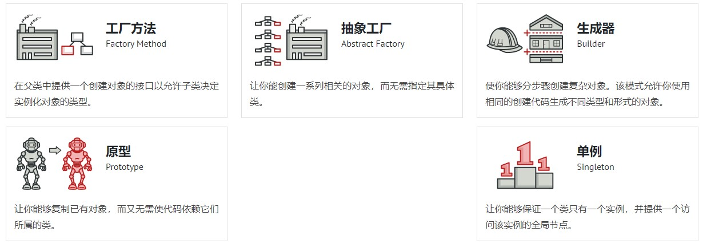

- **结构型模式(7种)：介绍如何将对象和类组装成较大的结构，并同时保持结构的灵活和高效**
  
  常用的有：代理模式、桥接模式、装饰者模式、适配器模式。 
  
  不常用的有：门面模式、组合模式、享元模式。
  
  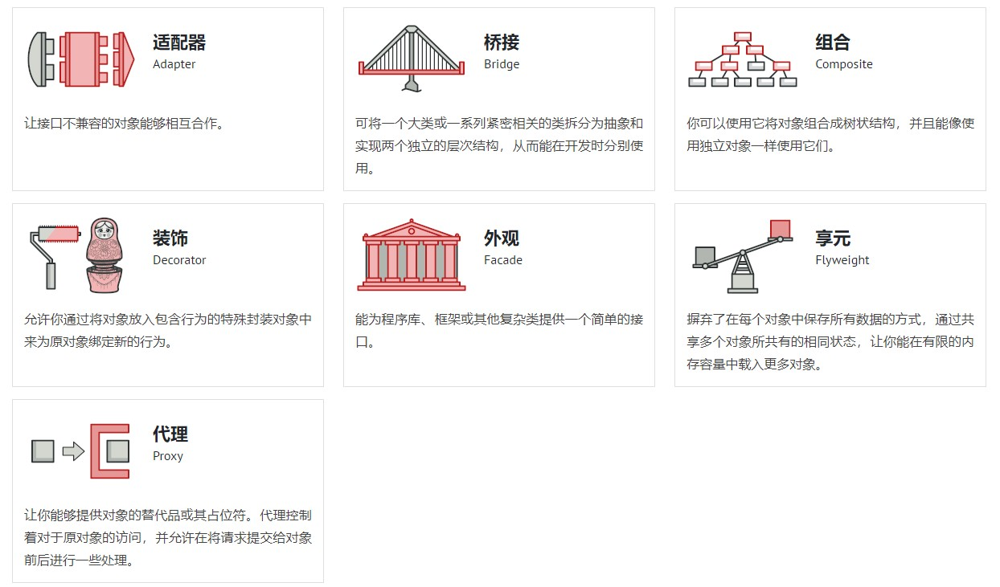

- **行为模式(11种)：负责对象间的高效沟通和职责传递委派**
  
  常用的有：观察者模式、模板模式、策略模式、职责链模式、迭代器模式、状态模式。
  
  不常用的有：访问者模式、备忘录模式、命令模式、解释器模式、中介模式。
  
  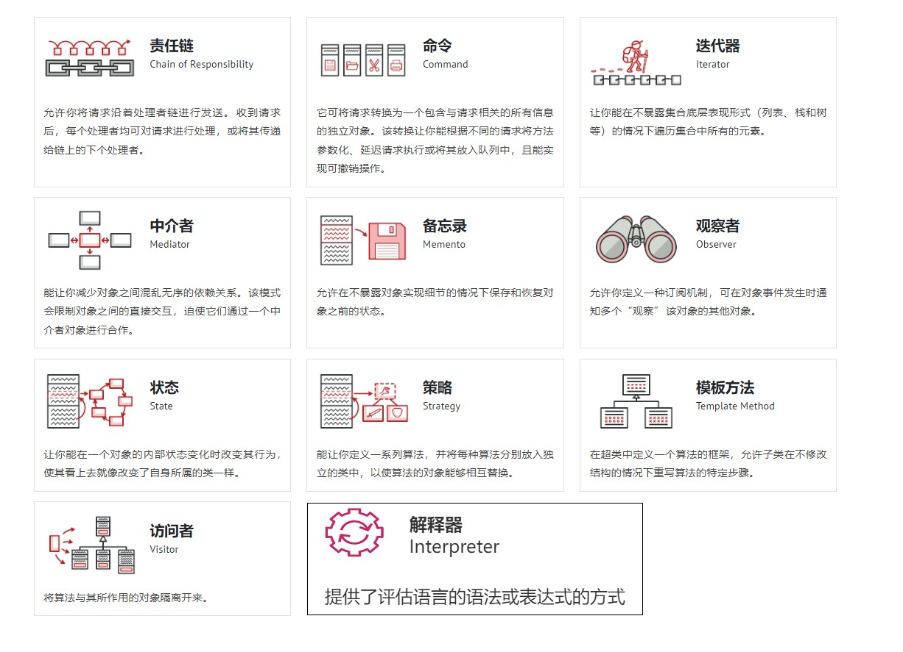

# 第二章 UML图
统一建模语言（Unified  Modeling Language，UML）是用来设计软件的可视化建模语言。它的特点是简单、统一、图形化、能表达软件设计中的动态与静态信息。

UML 从目标系统的不同角度出发，定义了用例图、类图、对象图、状态图、活动图、时序图、协作图、构件图、部署图等 9 种图。  

这里我们只介绍类图.

> 我们要去研究一个设计模式的时候,是需要借助UML类图更加准确的描述所使用的设计模式,和设计模式下类与类之间的关系

## 2.1 类图概述

类图(Class diagram)是显示了模型的静态结构，特别是模型中存在的类、类的内部结构以及它们与其他类的关系等。类图不显示暂时性的信息。类图是面向对象建模的主要组成部分。

## 2.2 类图的作用

* 在软件工程中，类图是一种静态的结构图，描述了系统的类的集合，类的属性和类之间的关系，可以简化了人们对系统的理解；
* 类图是系统分析和设计阶段的重要产物，是系统编码和测试的重要模型。

## 2.3 类图表示法
UML类图中具体类、抽象类、接口和包有不同的表示方法。

### 2.3.1 在UML类图中表示具体类
具体类在类图中用矩形框表示，矩形框分为三层：第一层是类名字。第二层是类的成员变量；第三层是类的方法。成员变量以及方法前的访问修饰符用符号来表示：

- “+” 表示 `public`；
- “-” 表示 `private`；
- “#” 表示 `protected`；
- 不带符号表示 `default`。

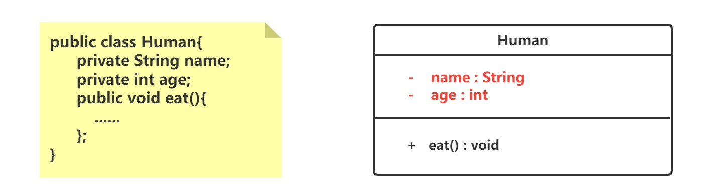

### 2.3.2 在UML类图中表示抽象类
抽象类在UML类图中同样用矩形框表示，但是抽象类的类名以及抽象方法的名字都用斜体字表示，如图所示。

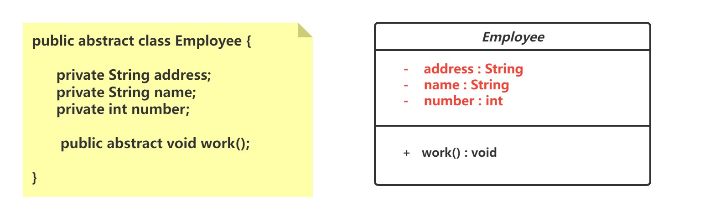

### 2.3.3 在UML类图中表示接口
接口在类图中也是用矩形框表示，但是与类的表示法不同的是，接口在类图中的第一层顶端用构造型 <<interface>>表示，下面是接口的名字，第二层是方法。

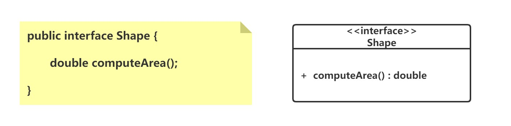

> 此外，接口还有另一种表示法，俗称棒棒糖表示法，就是类上面的一根棒棒糖（圆圈+实线）。圆圈旁为接口名称，接口方法在实现类中出现。

### 2.3.4 在类图中表示关系
类和类、类和接口、接口和接口之间存在一定关系，UML类图中一般会有连线指明它们之间的关系。

关系共有六种类型 ,如下图: 

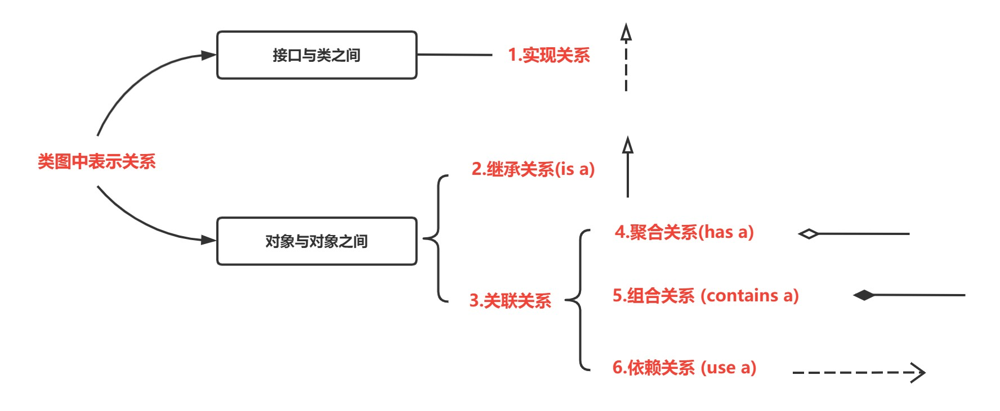

#### 3.3.4.1 实现关系
实现关系是接口与实现类之间的关系。在这种关系中，类实现了接口，类中的操作实现了接口中所声明的所有的抽象操作。

在 UML 类图中，实现关系使用带空心三角箭头的虚线来表示，箭头从实现类指向接口。

例如，汽车和船实现了交通工具，其类图:

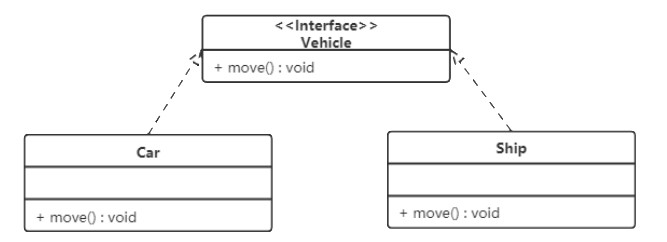

#### 2.3.4.2 泛化关系

泛化关系是对象之间耦合度最大的一种关系，表示一般与特殊的关系，是父类与子类之间的关系，是一种继承关系。

在 UML 类图中，泛化关系用带空心三角箭头的实线来表示，箭头从子类指向父类。在代码实现时，使用面向对象的继承机制来实现泛化关系。

例如，Student 类和 Teacher 类都是 Person 类的子类，其类图如下图所示：

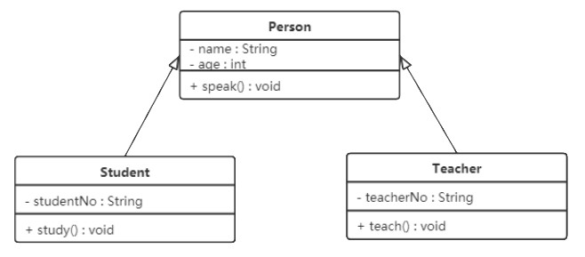

#### 2.3.4.3 关联关系

关联关系是对象之间的一种引用关系，用于表示一类对象与另一类对象之间的联系，如老师和学生、师傅和徒弟、丈夫和妻子等。关联关系是类与类之间最常用的一种关系，分为一般关联关系、聚合关系和组合关系。

我们先介绍一般关联关系, 一般关联关系又可以分为单向关联，双向关联，自关联。

**1) 单向关联**

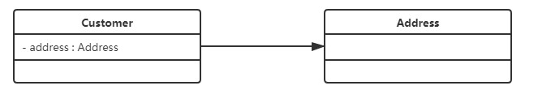

在UML类图中单向关联用一个带箭头的实线表示。上图表示每个顾客都有一个地址，这通过让Customer类持有一个类型为Address的成员变量类实现。

**2) 双向关联**

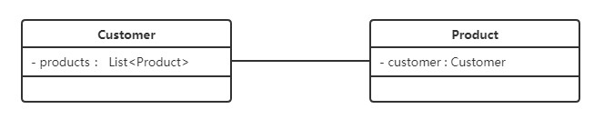

从上图中我们很容易看出，所谓的双向关联就是双方各自持有对方类型的成员变量。

在UML类图中，双向关联用一个不带箭头的直线表示。上图中在Customer类中维护一个List\<Product>，表示一个顾客可以购买多个商品；在Product类中维护一个Customer类型的成员变量表示这个产品被哪个顾客所购买。

**3) 自关联**

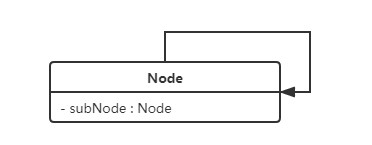

自关联在UML类图中用一个带有箭头且指向自身的线表示。上图的意思就是Node类包含类型为Node的成员变量，也就是“自己包含自己”。

#### 2.3.4.4 聚合关系

聚合关系是关联关系的一种，表示一种弱的‘拥有’关系，体现的是A对象可以包含B对象，但是B对象不是A对象的一部分

> 在代码中: 比如A 类对象包含 B 类对象，B 类对象的生命周期可以不依赖 A 类对象的生命周期，也就是说可以单独销毁 A 类对象而不影响 B 对象

```java
public class A{

	private B b;
	
	public A(B b){
		this.b = b;
	}
}
```

在 UML 类图中，聚合关系可以用带空心菱形的实线来表示，菱形指向整体。

下图所示是大学和教师的关系图：

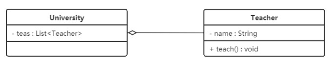

#### 2.3.4.5 组合关系

组合关系是一种强‘拥有’关系，体现了严格的部分和整体的关系，部分和整体的声明周期一样

> 在代码中: 比如A 类对象包含 B 类对象，B 类对象的生命周期依赖A 类对象的生命周期，B 类对象不可以单独存在

```java
public class A{
    
    private B b;
    
    public A(){
        this.b = new B();
    }
    
}
```

在 UML 类图中，组合关系用带实心菱形的实线来表示，菱形指向整体。

下图所示是头和嘴的关系图：

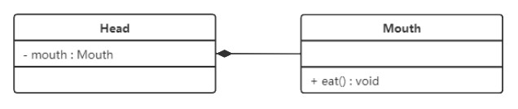

#### 2.3.4.6 依赖关系

依赖关系是一种使用关系，它是对象之间耦合度最弱的一种关联方式，是临时性的关联。

在代码中，某个类的方法通过局部变量、方法的参数或者对静态方法的调用来访问另一个类（被依赖类）中的某些方法来完成一些职责。

在 UML 类图中，依赖关系使用带箭头的虚线来表示，箭头从使用类指向被依赖的类。

下图所示是司机和汽车的关系图，司机驾驶汽车：

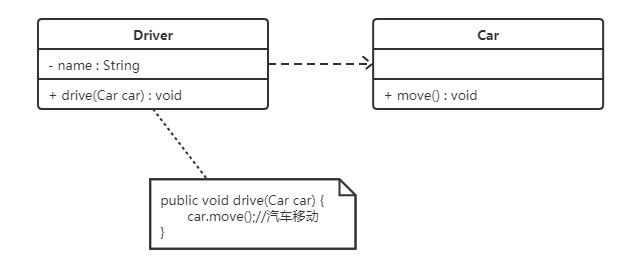


## 2.4 UML类图总结

之前我们一共学习了六种类关系的表示方式

- 实现关系
- 泛化关系
- 关联关系
- 聚合关系
- 组合关系
- 依赖关系

为了节省学习成本, 方便记忆,我们可以将类和类之间的关系重新调整一下,使其更加贴近编程的角度:

- 实现关系
- 泛化关系
- 依赖关系
- 组合关系 (组合关系+关联关系+聚合关系)

> 我们也没有必要去区分组合与聚合这两个概念,只需要记住一点就是: 多用组合少用继承 
>
> 也就是说只要 B 类对象是 A 类对象的成员变量，那我们就称，A 类跟 B 类是组合关系.

# 第三章 六大设计原则 (SOLID)

## 3.1 设计原则概述
> 古人云: 有道无术,术可求.有术无道,止于术. 
>
> 而设计模式通常需要遵循一些设计原则，在设计原则的基础之上衍生出了各种各样的设计模式。设计原则是设计要求，设计模式是设计方案，使用设计模式的代码则是具体的实现。

   

设计模式中主要有六大设计原则，简称为SOLID ，是由于各个原则的首字母简称合并的来(两个L算一个,solid 稳定的)，六大设计原则分别如下：

​	**1、单一职责原则（Single Responsibitity Principle）**

​	**2、开放封闭原则（Open Close Principle）**

​	**3、里氏替换原则（Liskov Substitution Principle）**

​	**4、接口分离原则（Interface Segregation Principle）**

​	**5、依赖倒置原则（Dependence Inversion Principle）**

​	**6、迪米特法则（Law Of Demter）**

软件开发中我们要基于这六个原则,设计建立稳定、灵活、健壮的程序.

## 3.2 单一职责原则

### 3.2.1 官方定义

**单一职责原则**，英文缩写SRP，全称 Single Responsibility Principle。

在<<架构整洁之道>>一书中 关于这个原则的英文描述是这样的：A class or module should have a single responsibility 。如果我们把它翻译成中文，那就是**：一个类或者模块只负责完成一个职责（或者功能）**。

### 3.2.2 通俗解释

单一职责原则的定义描述非常简单，也不难理解。**一个类只负责完成一个职责或者功能。**

也就是说在类的设计中 我们不要设计大而全的类,而是要设计粒度小、功能单一的类. 

> 比如 我们设计一个类里面既包含了用户的一些操作,又包含了支付的一些操作,那这个类的职责就不够单一,应该将该类进行拆分,拆分成多个功能更加单一的,粒度更细的类.

### 3.2.3 场景示例

那么该如何判断一个类的职责是否单一 ?

> 其实在软件设计中，要真正用好单一职责原则并不简单，因为遵循这一原则最关键的地方在于职责的划分，而职责的划分是根据需求定的，同一个类（接口）的设计，在不同的需求里面，可能职责的划分并不一样.

我们来看下面这个例子:

在一个社交媒体产品中,我们使用UserInfo去记录用户的信息,包括如下的属性.

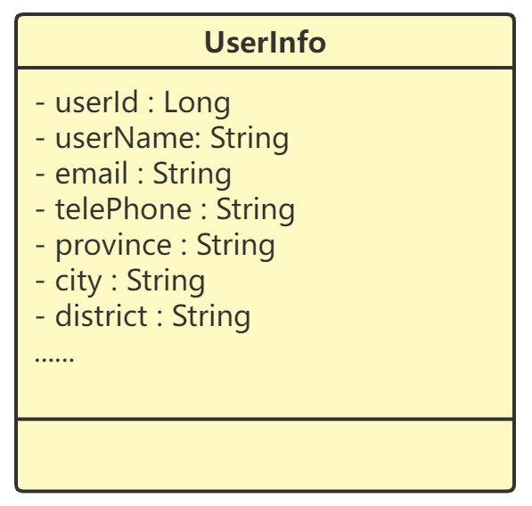

请问上面的UserInfo类是否满足单一职责原则呢 ?

- 观点1: 满足,因为记录的都是跟用户相关的信息
- 观点2: 不满足,因为地址信息应该被拆分出来,单独放到地址表中保存.

正确答案: 根据实际业务场景选择是否拆分

- 该社交产品的有用户信息只是用来展示的,那么这个类这样设计就没有问题
- 假设后面这个社交产品又添加了电商模块, 那就需要将地址信息提取出来,单独设计一个类

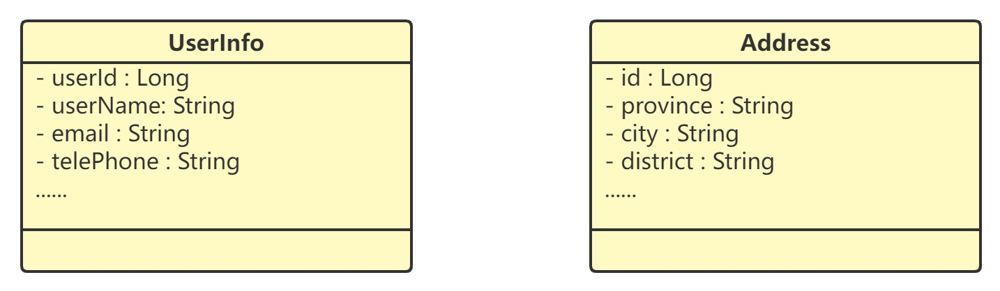

**总结: 不同的应用场景、不同阶段的需求背景下，对同一个类的职责是否单一的判定，可能都是不一样的,最好的方式就是:**

> 我们可以先写一个粗粒度的类，满足业务需求。随着业务的发展，如果粗粒度的类越来越庞大，代码越来越多，这个时候，我们就可以将这个粗粒度的类，拆分成几个更细粒度的类。这就是所谓的持续重构

**如何判断一个类的职责是否单一?**

这里没有一个具体的金科玉律，但从实际代码开发经验上，有一些可执行性的侧面判断指标，可供参考：

- 类中的代码行数、函数、或者属性过多；

- 类依赖的其他类过多

- 私有方法过多

- 类中大量的方法都是集中操作类中的几个属性

## 3.3 开闭原则

### 3.3.1 官方定义

一般认为最早提出开闭原则（Open-Close Principle，OCP）的是伯特兰·迈耶。他在1988 年发表的《面向对象软件构造》中给出的。在面向对象编程领域中，

开闭原则规定软件中的对象、类、模块和函数对扩展应该是开放的，但对于修改是封闭的。这意味着应该用抽象定义结构，用具体实现扩展细节，以此确保软件系统开发和维护过程的可靠性。

### 3.3.2 通俗解释

定义：**对扩展开放，对修改关闭**

> 对扩展开放和对修改关闭表示当一个类或一个方法有新需求或者需求发生改变时应该采用扩展的方式而不应该采用修改原有逻辑的方式来实现。因为扩展了新的逻辑如果有问题只会影响新的业务，不会影响老业务；而如果采用修改的方式，很有可能就会影响到老业务受影响。
>
> 开闭原则是所有设计模式的最核心目标，也是最难实现的目标，但是所有的软件设计模式都应该以开闭原则当作标准，才能使软件更加的稳定和健壮。

优点：

1. 新老逻辑解耦，需求发生改变不会影响老业务的逻辑

2. 改动成本最小，只需要追加新逻辑，不需要改的老逻辑

3. 提供代码的稳定性和可扩展性


### 3.3.3 场景示例

系统A与系统B之间进行数据传输使用的是427版本的协议，一年以后对427版本的协议进行了修正。

设计时应该考虑的数据传输协议的可变性，抽象出具有报文解译、编制、校验等所有版本协议使用的通用方法，调用方针对接口进行编程即可，如上述示例设计类图如下

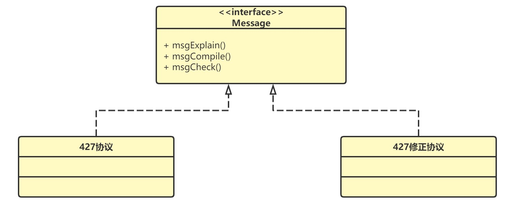

调用方依赖于报文接口，报文接口是稳定的，而不针对具体的427协议或427修正协议。利用接口多态技术，实现了开闭原则。

**顶层设计思维**

- 抽象意识
- 封装意识
- 扩展意识

> 在写代码的时候后，我们要多花点时间往前多思考一下，这段代码未来可能有哪些需求变 更、如何设计代码结构，事先留好扩展点，以便在未来需求变更的时候，不需要改动代码整 体结构、做到最小代码改动的情况下，新的代码能够很灵活地插入到扩展点上，做到“对扩 展开放、对修改关闭”。

## 3.4 里氏替换原则

### 3.4.1 官方定义

里氏替换原则（Liskov Substitution Principle，LSP）是由麻省理工学院计算机科学系教授芭芭拉·利斯科夫于 1987 年在“面向对象技术的高峰会议”（OOPSLA）上发表的一篇论文《数据抽象和层次》（Data Abstractionand Hierarchy）里提出的.

她在论文中提到：如果S是T的子类型，对于S类型的任意对象，如果将他们看作是T类型的对象，则对象的行为也理应与期望的行为一致。

> 子类对象能够替换程序中父类对象出现的任何地方，并且保证原来程序的逻辑行为不变及正确性不被破坏。

### 3.4.2 通俗解释

**如何理解里氏替换原则？**

要理解里氏替换原则，其实就是要理解两个问题：

- 什么是替换？
- 什么是与期望行为一致的替换（Robert Martin所说的“必须能够替换”）？

**1 ) 什么是替换 ?**

替换的前提是面向对象语言所支持的多态特性，同一个行为具有多个不同表现形式或形态的能力。

> 以JDK的集合框架为例，`List`接口的定义为有序集合，`List`接口有多个派生类，比如大家耳熟能详的`ArrayList`, `LinkedList`。那当某个方法参数或变量是`List`接口类型时，既可以是`ArrayList`的实现, 也可以是`LinkedList`的实现，这就是替换。

**2 ) 什么是与期望行为一致的替换？** 

在不了解派生类的情况下，仅通过接口或基类的方法，即可清楚的知道方法的行为，而不管哪种派生类的实现，都与接口或基类方法的期望行为一致。

> 不需要关心是哪个类对接口进行了实现,因为不管底层如何实现,最终的结果都会符合接口中关于方法的描述(也就是与接口中方法的期望行为一致).
>
> 或者说接口或基类的方法是一种契约，使用方按照这个契约来使用，派生类也按照这个契约来实现。这就是与期望行为一致的替换。

### 3.4.3 场景示例

里氏替换原则要求我们在编码时使用基类或接口去定义对象变量，使用时可以由具体实现对象进行赋值，实现变化的多样性，完成代码对修改的封闭，扩展的开放。

比如在一个商城项目中, 定义结算接口Istrategy，该接口有三个具体实现类，分别为 PromotionalStrategy （满减活动，两百以上百八折）、RebateStrategy （打折活动）、 ReduceStrategy（返现活动）

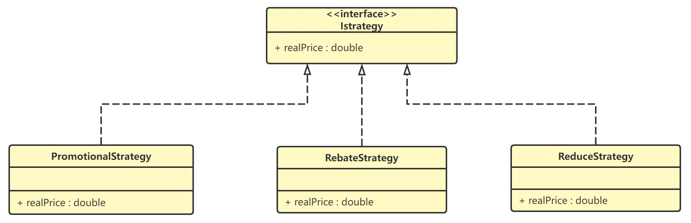

```java
public interface Istrategy {
    public double realPrice(double consumePrice);
}

public class PromotionalStrategy implements Istrategy {
    public double realPrice(double consumePrice) {
        if (consumePrice > 200) {
            return 200 + (consumePrice - 200) * 0.8;
        } else {
            return consumePrice;
        }
    }
}
public class RebateStrategy implements Istrategy {
    private final double rate;
    public RebateStrategy() {
        this.rate = 0.8;
    }
    public double realPrice(double consumePrice) {
        return consumePrice * this.rate;
    }
}
public class ReduceStrategy implements Istrategy {
    public double realPrice(double consumePrice) {
        if (consumePrice >= 1000) {
            return consumePrice - 200;
        } else {
            return consumePrice;
        }
    }
}
```
调用方为Context，在此类中使用接口定义了一个对象。

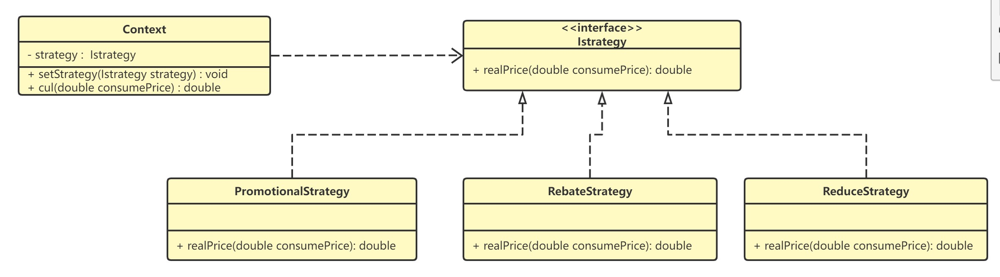

```java
public class Context {
    //使用基类定义对象变量
    private Istrategy strategy;
    // 注入当前活动使用的具体对象
    public void setStrategy(Istrategy strategy) {
        this.strategy = strategy;
    }
    // 计算并返回费用
    public double cul(double consumePrice) {
        // 使用具体商品促销策略获得实际消费金额
        double realPrice = this.strategy.realPrice(consumePrice);
        // 格式化保留小数点后1位，即：精确到角
        BigDecimal bd = new BigDecimal(realPrice);
        bd = bd.setScale(1, BigDecimal.ROUND_DOWN);
        return bd.doubleValue();
    }
}
```

Context 中代码使用接口定义对象变量，这个对象变量可以是实现了lStrategy接口的PromotionalStrategy、RebateStrategy 、 ReduceStrategy任意一个。

里氏代换原则与多态的区别 ?

> 虽然从定义描述和代码实现上 来看，多态和里式替换有点类似，但它们关注的角度是不一样的。多态是面向对象编程的一 大特性，也是面向对象编程语言的一种语法。它是一种代码实现的思路。而里式替换是一种 设计原则，用来指导继承关系中子类该如何设计，子类的设计要保证在替换父类的时候，不 改变原有程序的逻辑及不破坏原有程序的正确性。

里氏替换原则和依赖倒置原则，构成了面向接口编程的基础，正因为里氏替换原则，才使得程序呈现多样性。

## 3.5 接口隔离原则

### 3.5.1 官方定义

<<代码整洁之道>>作者**罗伯特 C·马丁** 为 “接口隔离原则” 的定义是：客户端不应该被迫依赖于它不使用的方法（Clients should not be forced to depend on methods they do not use）。

该原则还有另外一个定义：一**个类对另一个类的依赖应该建立在最小的接口上**

### 3.5.2 通俗解释

上面两个定义的含义用一句话概括就是：**要为各个类建立它们需要的专用接口，而不要试图去建立一个很庞大的接口供所有依赖它的类去调用。** 

**接口隔离原则与单一职责原则的区别**

接口隔离原则和单一职责都是为了提高类的内聚性、降低它们之间的耦合性，体现了封装的思想，但两者是不同的：

- 单一职责原则注重的是职责，而接口隔离原则注重的是对接口依赖的隔离。
- 单一职责原则主要是约束类，它针对的是程序中的实现和细节；接口隔离原则主要约束接口，主要针对抽象和程序整体框架的构建。

### 3.5.3 场景示例

微服务用户系统提供了一组跟用户相关的 API 给其他系统 使用，比如：注册、登录、获取用户信息等。

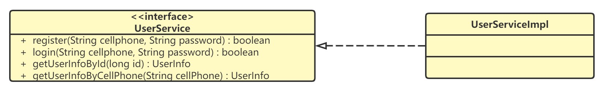

```java
public interface UserService {
    boolean register(String cellphone, String password);
    boolean login(String cellphone, String password);
    UserInfo getUserInfoById(long id);
    UserInfo getUserInfoByCellphone(String cellphone);
}

public class UserServiceImpl implements UserService {
		//...
}
```

需求: 后台管理系统要实现删除用户的功能，希望用户系统提供一个删除用户的接口,应该如何设计这个接口(假设这里我们不去考虑使用鉴权框架).

- 方案1: 直接在UserService接口中添加一个删除用户的接口

  > 这个方法可以解决问题，但是也隐藏了一些安全隐患。删除用户是一个非常慎重的操作，我们只希望通过后台管理系统来执行，所以这个接口只限于给后台管理系统使用。如果我们把它放到 UserService 中，那所有使用到 UserService 
  > 的系统，都可以调用这个接口。不加限制地被其他业务系统调用，就有可能导致误删用户。

- 方案2: 遵照接口隔离原则,为依赖接口的类定制服务。只提供调用者需要的方法，屏蔽不需要的方法。

​	  将删除接口单独放到另外 一个接口 RestrictedUserService 中, 然后将 RestrictedUserService 只打包提供给后台管理系统来	  使用。

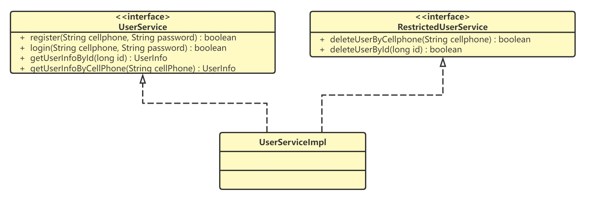

```java
public interface UserService {
    boolean register(String cellphone, String password);
    boolean login(String cellphone, String password);
    UserInfo getUserInfoById(long id);
    UserInfo getUserInfoByCellphone(String cellphone);
}

public interface RestrictedUserService {
 boolean deleteUserByCellphone(String cellphone);
 boolean deleteUserById(long id);
}

public class UserServiceImpl implements UserService, RestrictedUserService {
		//...
}
```

遵循接口隔离原则的优势

1. 将臃肿庞大的接口分解为多个粒度小的接口，可以预防外来变更的扩散，提高系统的灵活性和可维护性。
2. 使用多个专门的接口还能够体现对象的层次，因为可以通过接口的继承，实现对总接口的定义。
3. 能减少项目工程中的代码冗余。过大的大接口里面通常放置许多不用的方法，当实现这个接口的时候，被迫设计冗余的代码.

## 3.6 依赖倒置原则

### 3.6.1 官方定义

依赖倒置原则是Robert C.Martin于1996年在C++Report上发表的文章中提出的。

```
High level modules should not depend upon low level modules. Both should depend upon abstractions.
Abstractions should not depend upon details. Details should depend upon abstractions
```

依赖倒置原则（Dependence Inversion Principle，DIP）是指在设计代码架构时，高层模块不应该依赖于底层模块，二者都应该依赖于抽象。抽象不应该依赖于细节，细节应该依赖于抽象。

### 3.6.2 通俗解释

依赖倒置原则是实现开闭原则的重要途径之一，它降低了客户与实现模块之间的耦合。

> 1. 高层级的模块应该依赖的是低层级的模块的行为的抽象，取决于具体编程语言，可以是抽象类或者接口等技术；
> 2. 第2句话其实很简单，只有一个意思：只要依赖了实现，就是耦合了代码，所以我们需要始终依赖的是抽象，而不是实现。

- **传统的自定向下的设计**

  > 传统设计方式采用自顶向下的原则， 逐级依赖，中层模块和高层模块的耦合度很高，如果需要修改其中的一个模块，则可能会导致其它很多模块也需要修改，牵一发动全身，不易于维护。
  >
  > 不使用依赖反转的系统构架，控制流和依赖关系流的依赖箭头是一个方向的，由高层指向底层，也就是高层依赖底层

  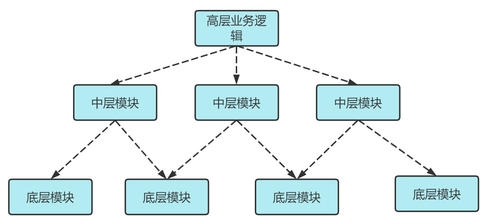
  
- 依赖倒置原则

  > 依赖倒置原则的好处:
  >
  > - 减少类间的耦合性，提高系统的稳定性 . (根据类与类之间的耦合度从弱到强排列：依赖关系、关联关系、聚合关系、组合关系、泛化关系和实现关系 )
  > - 降低并行开发引起的风险 (两个类之间有依赖关系，只要制定出两者之间的接口（或抽象类）就可以独立开发了)
  > - 提高代码的可读性和可维护性

  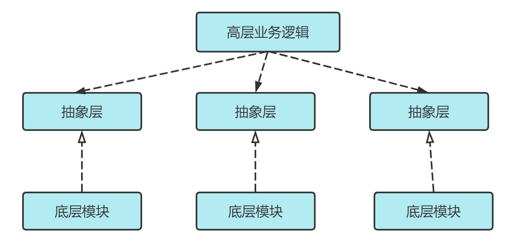

### 3.6.3 场景示例

假设我们现在要组装一台电脑,需要的配件有 cpu，硬盘，内存条。只有这些配置都有了，计算机才能正常的运行。选择cpu有很多选择，如Intel，AMD等，硬盘可以选择希捷，西数等，内存条可以选择金士顿，海盗船等。

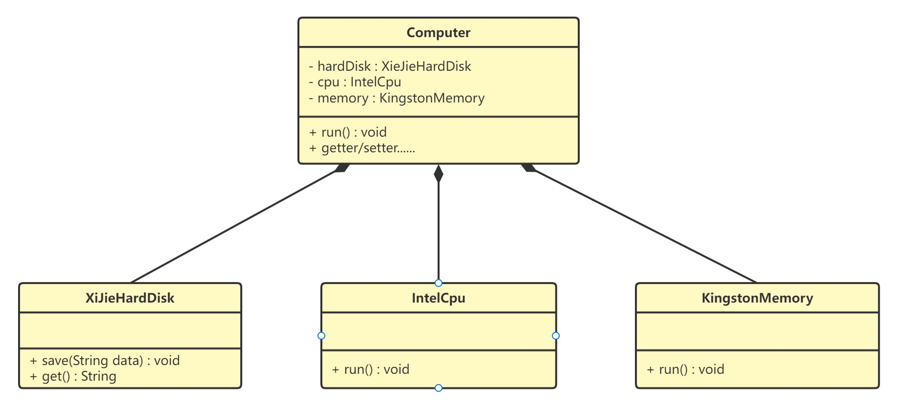

代码如下：

**希捷硬盘类（XiJieHardDisk）:**

```java
public class XiJieHardDisk implements HardDisk {

    public void save(String data) {
        System.out.println("使用希捷硬盘存储数据" + data);
    }

    public String get() {
        System.out.println("使用希捷希捷硬盘取数据");
        return "数据";
    }
}
```

**Intel处理器（IntelCpu）：**

```java
public class IntelCpu implements Cpu {

    public void run() {
        System.out.println("使用Intel处理器");
    }
}
```

**金士顿内存条（KingstonMemory）：**

```java
public class KingstonMemory implements Memory {

    public void save() {
        System.out.println("使用金士顿作为内存条");
    }
}
```

**电脑（Computer）：**

```java
public class Computer {

    private XiJieHardDisk hardDisk;
    private IntelCpu cpu;
    private KingstonMemory memory;

    public IntelCpu getCpu() {
        return cpu;
    }

    public void setCpu(IntelCpu cpu) {
        this.cpu = cpu;
    }

    public KingstonMemory getMemory() {
        return memory;
    }

    public void setMemory(KingstonMemory memory) {
        this.memory = memory;
    }

    public XiJieHardDisk getHardDisk() {
        return hardDisk;
    }

    public void setHardDisk(XiJieHardDisk hardDisk) {
        this.hardDisk = hardDisk;
    }

    public void run() {
        System.out.println("计算机工作");
        cpu.run();
        memory.save();
        String data = hardDisk.get();
        System.out.println("从硬盘中获取的数据为：" + data);
    }
}
```

**测试类（TestComputer）：**

测试类用来组装电脑。

```java
public class TestComputer {
    public static void main(String[] args) {
        Computer computer = new Computer();
        computer.setHardDisk(new XiJieHardDisk());
        computer.setCpu(new IntelCpu());
        computer.setMemory(new KingstonMemory());

        computer.run();
    }
}
```

上面代码可以看到已经组装了一台电脑，但是似乎组装的电脑的cpu只能是Intel的，内存条只能是金士顿的，硬盘只能是希捷的，这对用户肯定是不友好的，用户有了机箱肯定是想按照自己的喜好，选择自己喜欢的配件。

根据依赖倒转原则进行改进：

代码我们需要修改Computer类，让Computer类依赖抽象（各个配件的接口），而不是依赖于各个组件具体的实现类。

**类图如下：**

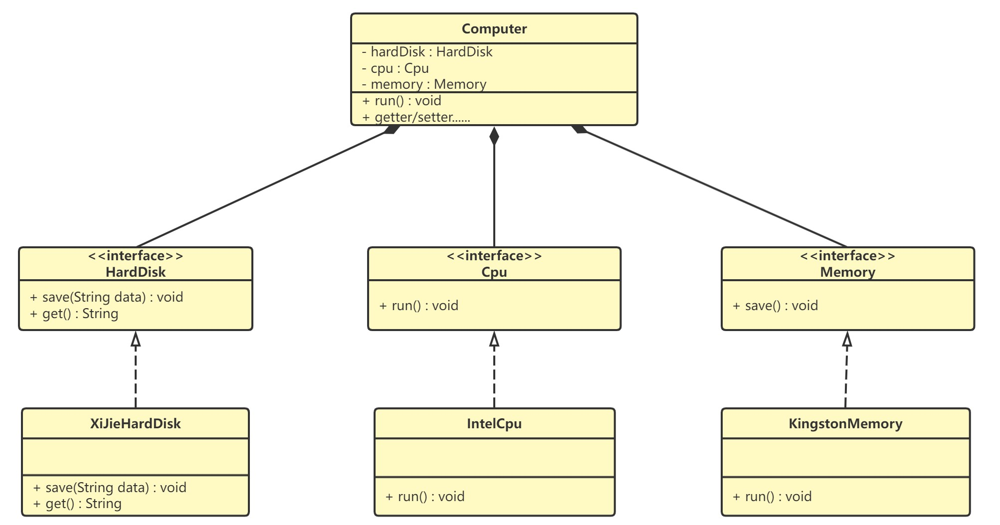

**电脑（Computer）：**

```java
public class Computer {

    private HardDisk hardDisk;
    private Cpu cpu;
    private Memory memory;
	
    //getter/setter......
    
    public void run() {
        System.out.println("计算机工作");
    }
}
```

**关于依赖倒置、依赖注入、控制反转这三者之间的区别与联系**   

1 )  依赖倒置原则

依赖倒置是一种通用的软件设计原则, 主要用来指导框架层面的设计。

> 高层模块不依赖低层模块，它们共同依赖同一个抽象。抽象不要依赖具体实现细节，具体实现细节依赖抽象。

2 ) 控制反转

控制反转与依赖倒置有一些相似, 它也是一种框架设计常用的模式,但并不是具体的方法。

> “控制”指的是对程序执行流程的控制，而“反转”指的是在没有使用框架之前，程序员自己控制整个程序的执行。在使用框架之后，整个程序的执行流程通过框架来控制。流程的控制权从程序员“反转”给了框架。
>
> Spring框架，核心模块IoC容器,就是通过控制反转这一种思想进行设计的

3 ) 依赖注入

依赖注入是实现控制反转的一个手段，它是一种具体的编码技巧。

> 我们不通过 new 的方式在类内部创建依赖的对象，而是将依赖的对象在外部创建好之后，通过构造函数等
> 方式传递（或注入）进来, 给类来使用。
>
> 依赖注入真正实现了面向接口编程的愿景，可以很方便地替换同一接口的不同实现，而不会影响到依赖这个接口的客户端。

## 3.7 迪米特法则

### 3.7.1 官方定义

1987年秋天，迪米特法则由美国Northeastern University的Ian Holland(伊恩 霍兰德)提出，被UML的创始者之一Booch(布奇)等人普及。后来，因为经典著作The PragmaticProgrammer <<程序员修炼之道>>而广为人知。

迪米特法则（LoD：Law of Demeter）又叫最少知识原则（LKP：Least Knowledge Principle ），指的是一个类/模块对其他的类/模块有越少的了解越好。简言之：talk only to your immediate friends（只跟你最亲密的朋友交谈），不跟陌生人说话。

### 3.7.2 通俗解释

大部分设计原则和思想都非常抽象，有各种各样的解读，要想灵活地应用到 实际的开发中，需要有实战经验的积累。迪米特法则也不例外。

简单来说迪米特法则想要表达的思想就是:  **不该有直接依赖关系的类之间，不要有依赖；有依赖关系的类之间，尽量只依赖必要的接口。**

> 如果两个软件实体无须直接通信，那么就不应当发生直接的相互调用，可以通过第三方转发该调用。其目的是降低类之间的耦合度，提高模块的相对独立性。

### 3.7.3 场景示例

我们一起来看下面这个例子: 

明星由于全身心投入艺术，所以许多日常事务由经纪人负责处理，如和粉丝的见面会，和媒体公司的业务洽淡等。这里的经纪人是明星的朋友，而粉丝和媒体公司是陌生人，所以适合使用迪米特法则。

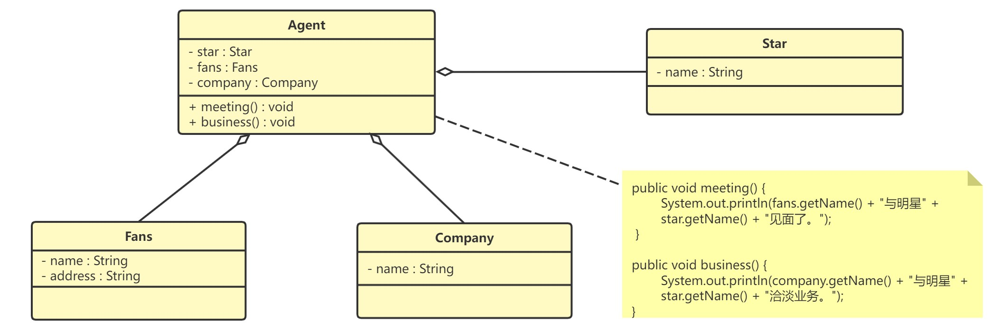

> 迪米特法则的独特之处在于它简洁而准确的定义，它允许在编写代码时直接应用，几乎自动地应用了适当的封装、高内聚和低耦合。
>
> 但是，过度使用迪米特法则会使系统产生大量的中介类，从而增加系统的复杂性，使模块之间的通信效率降低。所以，在釆用迪米特法则时需要反复权衡，确保高内聚和低耦合的同时，保证系统的结构清晰。

 

代码如下：

**明星类（Star）**

```java
public class Star {
    private String name;

    public Star(String name) {
        this.name=name;
    }

    public String getName() {
        return name;
    }
}
```

**粉丝类（Fans）**

```java
public class Fans {
    private String name;

    public Fans(String name) {
        this.name=name;
    }

    public String getName() {
        return name;
    }
}
```

**媒体公司类（Company）**

```java
public class Company {
    private String name;

    public Company(String name) {
        this.name=name;
    }

    public String getName() {
        return name;
    }
}
```

**经纪人类（Agent）**

```java
public class Agent {
    private Star star;
    private Fans fans;
    private Company company;

    public void setStar(Star star) {
        this.star = star;
    }

    public void setFans(Fans fans) {
        this.fans = fans;
    }

    public void setCompany(Company company) {
        this.company = company;
    }

    public void meeting() {
        System.out.println(fans.getName() + "与明星" + star.getName() + "见面了。");
    }

    public void business() {
        System.out.println(company.getName() + "与明星" + star.getName() + "洽淡业务。");
    }
}
```

## 3.8 设计原则总结

我们之前给的大家介绍了评判代码质量的标准,比如可读性、可复用性、可扩展性等等,这是从代码的整体质量的角度来评判.

而设计原则就是我们要使用到的更加具体的对于代码进行评判的标准,比如, 我们说这段代码的可扩展性比较差，主要原因是违背了开闭原则。

我们所学习的SOLID 原则它包含了：

1. 单一职责原则（SRP）
2. 开闭原则（OCP）
3. 里氏替换原则（LSP）
4. 接口隔离原则（ISP）
5. 依赖倒置原则（DIP）
6. 迪米特法则 (LKP)

这里我们只需要重点关注三个常用的原则即可:

**1 ) 单一职责原则**

单一职责原则是类职责划分的重要参考依据，是保证代码”高内聚“的有效手段，是我们在进行面向对象设计时的主要指导原则。

> 单一职责原则的难点在于，对代码职责是否足够单一的判定。这要根据具体的场景来具体分析。同一个类的设计，在不同的场景下，对职责是否单一的判定，可能是不同的。

**2 ) 开闭原则**

开闭原则是保证代码可扩展性的重要指导原则，是对代码扩展性的具体解读。很多设计模式诞生的初衷都是为了提高代码的扩展性，都是以满足开闭原则为设计目的的。

> 开闭原则是所有设计模式的最核心目标，也是最难实现的目标，但是所有的软件设计模式都应该以开闭原则当作标准，才能使软件更加的稳定和健壮。

**3 ) 依赖倒置原则**

依赖倒置原则主要用来指导框架层面的设计。高层模块不依赖低层模块，它们共同依赖同一个抽象。

> 依赖倒置原则其实也是实现开闭原则的重要途径之一，它降低了类之间的耦合，提高了系统的稳定性和可维护性，同时这样的代码一般更易读，且便于传承。
