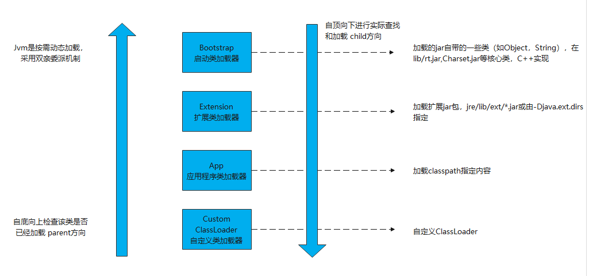

# 什么是类加载器？
负责加载class文件，class文件在文件开头有特定的文件标示，将class文件字节码内容加载到内存中，并将这些内容转换成方法区中的运行时数据结构并且ClassLoader值负载class文件的加载，至于它是否可以运行，则由Execution Engine决定。

# 类加载器总结
JVM 中内置了三个重要的 ClassLoader，除了 BootstrapClassLoader 其他类加载器均由 Java 实现且全部继承自java.lang.ClassLoader：



- **BootstrapClassLoader(启动类加载器)** ：最顶层的加载类，由 C++实现，负责加载 %JAVA_HOME%/lib目录下的 jar 包和类或者被 -Xbootclasspath参数指定的路径中的所有类。
- **ExtensionClassLoader(扩展类加载器)** ：主要负责加载 %JRE_HOME%/lib/ext 目录下的 jar 包和类，或被 java.ext.dirs 系统变量所指定的路径下的 jar 包。
- **AppClassLoader(应用程序类加载器)** ：面向我们用户的加载器，负责加载当前应用 classpath 下的所有 jar 包和类。

```java
public class ClassLoaderTest {

    public static void main(String[] args) {
        System.out.println(String.class.getClassLoader());
        System.out.println(sun.awt.HKSCS.class.getClassLoader());
        System.out.println(sun.net.spi.nameservice.dns.DNSNameService.class.getClassLoader());
        System.out.println(ClassLoaderTest.class.getClassLoader());
    }
}
```
运行结果
```shell
null
null
sun.misc.Launcher$ExtClassLoader@532760d8
sun.misc.Launcher$AppClassLoader@18b4aac2
```

> - Bootstrap加载器输出的是null，因为底层设计C++，java中并没有一个类与之对应，所以输出null
> - 这里说Bootstrap底层是C++，只限于HotSpot虚拟机。像MRP、Maxine这些虚拟机，整个虚拟机本身都是由Java编写的，自然Bootstrap ClassLoader也是由Java语言而不是C++实现的。


## 类加载器范围
上面说了Bootstrap加载器加载的是lib 目录下的jar，ExtensionClassLoader加载器加载的是lib/ext/目录下的jar。
从上面的运行结果中 sun.misc.Launcher$ExtClassLoader@532760d8 可以看到有个`sun.misc.Launcher`。看下Launcher 的代码：

```java
private static String bootClassPath = System.getProperty("sun.boot.class.path");
...
 public static ClassLoader getAppClassLoader(final ClassLoader var0) throws IOException {
    final String var1 = System.getProperty("java.class.path");
    final File[] var2 = var1 == null ? new File[0] : Launcher.getClassPath(var1);
    return (ClassLoader)AccessController.doPrivileged(new PrivilegedAction<Launcher.AppClassLoader>() {
        public Launcher.AppClassLoader run() {
            URL[] var1x = var1 == null ? new URL[0] : Launcher.pathToURLs(var2);
            return new Launcher.AppClassLoader(var1x, var0);
        }
    });
}
...
String var0 = System.getProperty("java.ext.dirs");
...
```

上面代码只贴出了一些关键代码，下面自己写个demo看下类加载器的范围

```java
public class ClassLoaderScopeTest {

    public static void main(String[] args) {

        String bootClassPath = System.getProperty("sun.boot.class.path");
        System.out.println(bootClassPath.replace(";", System.lineSeparator()));

        System.out.println("---------------");
        String extClassPath = System.getProperty("java.ext.dirs");
        System.out.println(extClassPath.replace(";", System.lineSeparator()));

        System.out.println("---------------");
        String classpath = System.getProperty("java.class.path");
        System.out.println(classpath.replace(";", System.lineSeparator()));

    }
}
```

运行结果

```java
C:\Program Files\Java\jdk1.8.0_131\jre\lib\resources.jar
C:\Program Files\Java\jdk1.8.0_131\jre\lib\rt.jar
C:\Program Files\Java\jdk1.8.0_131\jre\lib\sunrsasign.jar
C:\Program Files\Java\jdk1.8.0_131\jre\lib\jsse.jar
C:\Program Files\Java\jdk1.8.0_131\jre\lib\jce.jar
C:\Program Files\Java\jdk1.8.0_131\jre\lib\charsets.jar
C:\Program Files\Java\jdk1.8.0_131\jre\lib\jfr.jar
C:\Program Files\Java\jdk1.8.0_131\jre\classes
C:\Users\Administrator\AppData\Local\JetBrains\IntelliJIdea2021.3\captureAgent\debugger-agent.jar
---------------
C:\Program Files\Java\jdk1.8.0_131\jre\lib\ext
C:\Windows\Sun\Java\lib\ext
---------------
C:\Program Files\Java\jdk1.8.0_131\jre\lib\charsets.jar
C:\Program Files\Java\jdk1.8.0_131\jre\lib\deploy.jar
C:\Program Files\Java\jdk1.8.0_131\jre\lib\ext\access-bridge-64.jar
C:\Program Files\Java\jdk1.8.0_131\jre\lib\ext\cldrdata.jar
C:\Program Files\Java\jdk1.8.0_131\jre\lib\ext\dnsns.jar
.... // 省略一些
D:\Program Files\IntelliJ IDEA 2021.3.1\lib\idea_rt.jar
C:\Users\Administrator\AppData\Local\JetBrains\IntelliJIdea2021.3\captureAgent\debugger-agent.jar
```

# 类与加载器
对于任意一个类，都必须由加载它的类加载器和这个类本身一起共同确立其在Java虚拟机中的唯一性每一个类加载器，都拥有一个独立的类名称空间。
这句话可以表达得更通俗一些：比较两个类是否“相等”，只有在这两个类是由同一个类加载器加载的前提下才有意义，否则，即使这两个类来源于同一个Class文件，被同一个Java虚拟机加载，只要加载它们的类加载器不同，那这两个类就必定不相等。

```java
package com.liufei.mall.utils;

import java.io.IOException;
import java.io.InputStream;

public class ClassLoaderTest {

    public static void main(String[] args) throws Exception {
       ClassLoader myLoader = new ClassLoader() {
           @Override
           public Class<?> loadClass(String name) throws ClassNotFoundException {
               try {
                   String fileName = name.substring(name.lastIndexOf(".") + 1)+".class";
                   InputStream is = getClass().getResourceAsStream(fileName);
                   if (is == null) {
                       return super.loadClass(name);
                   }
                   byte[] b = new byte[is.available()];
                   is.read(b);
                   return defineClass(name, b, 0, b.length);
               } catch (IOException e) {
                   throw new ClassNotFoundException(name);
               }
           }
       };

        Object obj = myLoader.loadClass("com.liufei.mall.utils.ClassLoaderTest").newInstance();
        System.out.println(obj.getClass());
        System.out.println(obj instanceof com.liufei.mall.utils.ClassLoaderTest);

        // 两个类的ClasLoader不一样
        System.out.println(obj.getClass().getClassLoader());
        System.out.println(ClassLoaderTest.class.getClassLoader());
    }
}
```

运行结果;
```java
class com.liufei.mall.utils.ClassLoaderTest
false
com.liufei.mall.utils.ClassLoaderTest$1@12bb4df8
sun.misc.Launcher$AppClassLoader@18b4aac2
```

两行输出结果中，从第一行可以看到这个对象确实是类com.liufei.mall.utils.ClassLoaderTest实例化出来的，但在第二行的输出中却发现这个对象与类com.liufei.mall.utils.ClassLoaderTest做所属类型检查的时候返回了false。这是因为Java虚拟机中同时存在了两个ClassLoaderTest类，一个是由虚拟机的应用程序类加载器所加载的，另外一个是由我们自定义的类加载器加载的，虽然它们都来自同一个Class文件，但在Java虚拟机中仍然是两个互相独立的类，做对象所属类型检查时的结果自然为false。

# 双亲委派模型
如果一个类加载器收到了类加载的请求，它首先不会自己去尝试加载这个类，而是把这个请求委派给父类加载器去完成，每一个层次的类加载器都是如此，因此所有的加载请求最终都应该传送到最顶层的启动类加载器中，只有当父加载器反馈自己无法完成这个加载请求（它的搜索范围中没有找到所需的类）时，子加载器才会尝试自己去完成加载。

```java
public class ClassLoaderTest {

    public static void main(String[] args) {
        System.out.println(ClassLoaderTest.class.getClassLoader().getParent());
        System.out.println(ClassLoaderTest.class.getClassLoader().getParent().getParent());
        // System.out.println(String.class.getClassLoader().getParent());  // 会报空指针
    }
}
```
运行结果
```shell
sun.misc.Launcher$ExtClassLoader@532760d8
null
```

其实这个双亲翻译的容易让别人误解，我们一般理解的双亲都是父母，这里的双亲更多地表达的是“父母这一辈”的人而已，并不是说真的有一个 Mother ClassLoader 和一个 Father ClassLoader 。另外，类加载器之间的“父子”关系也不是通过继承来体现的，是由“优先级”来决定。官方 API 文档对这部分的描述如下:
> The Java platform uses a delegation model for loading classes. The basic idea is that every class loader has a "parent" class loader. When loading a class, a class loader first "delegates" the search for the class to its parent class loader before attempting to find the class itself.

谷歌翻译：
> Java 平台使用委派模型来装入类。基本思想是每个类装入器都有一个“父”类装入器。装入类时，类装入器首先将对类的搜索“委托”给其父类装入器，然后再尝试查找类本身。

## 双亲委派模型源码
双亲委派模型对于保证Java程序的稳定运作极为重要，但它的实现却异常简单，用以实现双亲委派的代码只有短短十余行，全部集中在java.lang.ClassLoader的loadClass()方法之中：
```java
protected Class<?> loadClass(String name, boolean resolve)
        throws ClassNotFoundException
    {
        // 加了同步锁
        synchronized (getClassLoadingLock(name)) {
            // 首先检查类是否已经被加载
            Class<?> c = findLoadedClass(name);
            if (c == null) {
                long t0 = System.nanoTime();
                try {
                    // 父加载器不为空，调用父加载器loadClass()方法处理
                    if (parent != null) {
                        c = parent.loadClass(name, false);
                    } else {
                        // 父加载器为空，使用启动类加载器 BootstrapClassLoader 加载
                        c = findBootstrapClassOrNull(name);
                    }
                } catch (ClassNotFoundException e) {
                    // 抛出异常说明父类加载器无法完成加载请求
                }

                if (c == null) {
                    // If still not found, then invoke findClass in order
                    // to find the class.
                    long t1 = System.nanoTime();
                    // 自己尝试加载
                    c = findClass(name);

                    // this is the defining class loader; record the stats
                    sun.misc.PerfCounter.getParentDelegationTime().addTime(t1 - t0);
                    sun.misc.PerfCounter.getFindClassTime().addElapsedTimeFrom(t1);
                    sun.misc.PerfCounter.getFindClasses().increment();
                }
            }
            if (resolve) {
                resolveClass(c);
            }
            return c;
        }
    }
```

这段代码的逻辑清晰易懂：先检查请求加载的类型是否已经被加载过，若没有则调用父加载器的
loadClass()方法，若父加载器为空则默认使用启动类加载器作为父加载器。假如父类加载器加载失败，抛出ClassNotFoundException异常的话，才调用自己的findClass()方法尝试进行加载。


## 双亲委派的好处？
**主要出于安全来考虑**
采用双亲委派的好处是比如加载一个位于rt.jar包中的类java.lang.Object，不管是哪个加载器加载加载这个类，最终都是委托给顶层的启动类加载器进行加载，这样就保证了使用的类加载器最终得到的都是同一个Object对象。

## 打破双亲委派

**1. 如果我们不想用双亲委派模型怎么办？**

自定义加载器的话，需要继承 ClassLoader 。如果我们不想打破双亲委派模型，就重写 ClassLoader 类中的 findClass() 方法即可，无法被父类加载器加载的类最终会通过这个方法被加载。但是，如果想打破双亲委派模型则需要重写 loadClass() 方法

**2. 何时打破过？**
1. JDK1.2之前，自定义ClassLoader都必须重写loadClass()
2. ThreadContextClassLoader可以实现基础类调用实现类代码，通过thread.setContextClassLoader指定
3. 热启动，热部署
   - osgi tomcat 都有自己的模块指定classloader（可以加载同一类库的不同版本）

这里简单模拟下tomcat下的重新加载
```java
public class ReloadClassDemo {

    public static void main(String[] args) throws Exception {
        // UserDefineClassLoader是自定义的classLoader，代码在下一栏
        UserDefineClassLoader userDefineClassLoader = new UserDefineClassLoader();
        Class<?> clazz1 = userDefineClassLoader.loadClass("com.liufei.demo.HelloWorld");

        userDefineClassLoader = new UserDefineClassLoader();
        Class<?> clazz2 = userDefineClassLoader.loadClass("com.liufei.demo.HelloWorld");

        System.out.println(clazz2 == clazz1); // true
    }
}
```
从LoaderClass的源码的loadClass()方法中，我们知道，加载一个类，不是上来就加载，而是先去找这个类有没有被加载，如果被加载了，直接返回。所以这里我们加载两次，两次返回的Class对象都是同一个。

```java
import java.io.File;
import java.io.FileInputStream;
import java.io.IOException;
import java.io.InputStream;

public class ReloadClassDemo {

    private static final String classPath = "d:/opt/test/";

    private static class MyLoader extends ClassLoader {
        @Override
        public Class<?> loadClass(String name) throws ClassNotFoundException {
            // 直接加载
            File file = new File(classPath, name.replace(".", "/").concat(".class"));
            if (!file.exists()) {
                return super.loadClass(name);
            }
            try {
                InputStream is = new FileInputStream(file);
                byte[] b = new byte[is.available()];
                is.read(b);
                return defineClass(name, b, 0, b.length);
            } catch (IOException e) {
                e.printStackTrace();
            }
            return super.loadClass(name);
        }
    }

    public static void main(String[] args) throws Exception {

        MyLoader myLoader = new MyLoader();
        Class<?> clazz1 = myLoader.loadClass("com.liufei.demo.HelloWorld");

        myLoader = new MyLoader();
        Class<?> clazz2 = myLoader.loadClass("com.liufei.demo.HelloWorld");

        System.out.println(clazz2 == clazz1); // false
    }
}
```


# 自定义类加载器

集成ClassLoader 方法，重新findClass()方法

```java
package com.liufei.jvm.classloader;

import java.io.ByteArrayOutputStream;
import java.io.File;
import java.io.FileInputStream;
import java.lang.reflect.Method;

public class UserDefineClassLoader extends ClassLoader {

    private static final String classPath = "F:/opt/test/";

    // 自定义classLoader 重写 findClass方法即可
    protected Class<?> findClass(String name) throws ClassNotFoundException {
        File file = new File(classPath, name.replace(".", "/").concat(".class"));
        try (FileInputStream fis = new FileInputStream(file);
             ByteArrayOutputStream baos = new ByteArrayOutputStream()) {
            int b = 0;
            while ((b = fis.read()) != 0) {
                baos.write(b);
            }
            baos.flush();
            byte[] bytes = baos.toByteArray();
            return defineClass(name, bytes, 0, bytes.length);
        } catch (Exception e) {
            e.printStackTrace();
        }
        return super.findClass(name);
    }


    public static void main(String[] args) throws Exception {
        UserDefineClassLoader userDefineClassLoader = new UserDefineClassLoader();
        Class<?> aClass = userDefineClassLoader.loadClass("com.liufei.demo.HelloWorld");
        // 执行main 方法
        Method method = aClass.getMethod("main", String[].class);
        // 注意，这里一定要强转Object类型
        method.invoke(null, (Object) new String[]{});
    }
}
```
运行结果
```shell
hello liufei
sun.misc.Launcher$AppClassLoader@18b4aac2
sun.misc.Launcher$AppClassLoader@18b4aac2
```

## 加密class文件

```java
package com.liufei.jvm.classloader;

import java.io.ByteArrayOutputStream;
import java.io.File;
import java.io.FileInputStream;
import java.io.FileOutputStream;
import java.lang.reflect.Method;

public class UserDefineClassLoader_encrypt extends ClassLoader {

    public static int seed = 0B10110110;

    private static final String classPath = "d:/opt/test/";

    // 自定义classLoader 重写 findClass方法即可
    protected Class<?> findClass(String name) throws ClassNotFoundException {
        File file = new File(classPath, name.replace(".", "/").concat(".encrclass"));
        try (FileInputStream fis = new FileInputStream(file);
             ByteArrayOutputStream baos = new ByteArrayOutputStream()) {
            int b = 0;
            while ((b = fis.read()) != 0) {
                baos.write(b);
            }
            baos.flush();
            byte[] bytes = baos.toByteArray();
            return defineClass(name, bytes, 0, bytes.length);
        } catch (Exception e) {
            e.printStackTrace();
        }
        return super.findClass(name);
    }

    private static void encFile(String name) throws Exception {
        File f = new File(classPath, name.replace('.', '/').concat(".class"));
        FileInputStream fis = new FileInputStream(f);
        FileOutputStream fos = new FileOutputStream(new File(classPath, name.replace(".", "/").concat(".encrclass")));
        int b = 0;

        while ((b = fis.read()) != -1) {
            fos.write(b ^ seed);
        }

        fis.close();
        fos.close();
    }

    public static void main(String[] args) throws Exception {
        encFile("com.liufei.demo.HelloWorld");

        UserDefineClassLoader userDefineClassLoader = new UserDefineClassLoader();
        Class<?> aClass = userDefineClassLoader.loadClass("com.liufei.demo.HelloWorld");
        // 执行main 方法
        Method method = aClass.getMethod("main", String[].class);
        // 注意，这里一定要强转Object类型
        method.invoke(null, (Object) new String[]{});

        System.out.println(userDefineClassLoader.getClass().getClassLoader());
        System.out.println(userDefineClassLoader.getParent());
    }
}
```