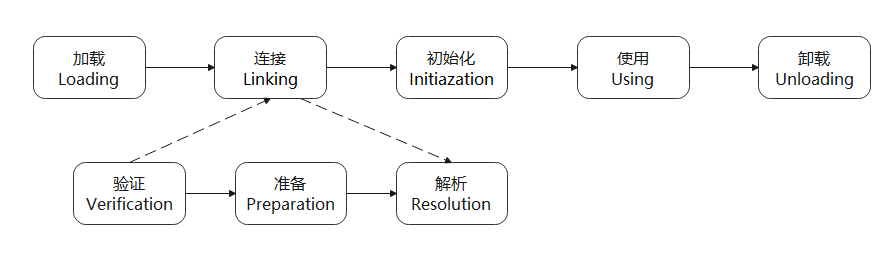
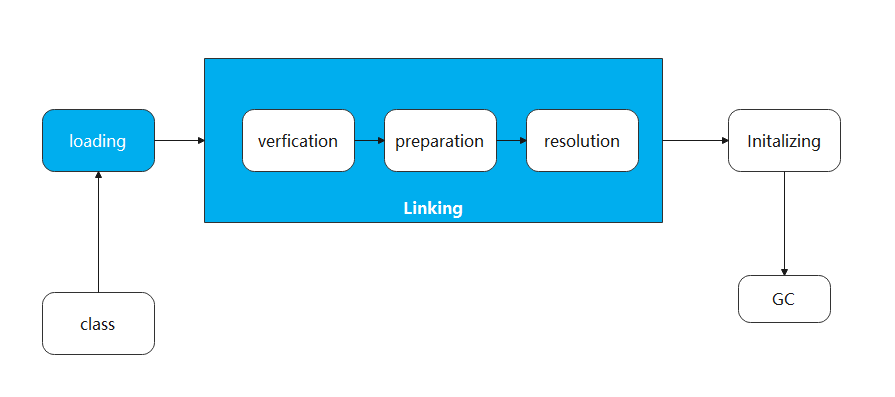

# 类的生命周期
一个类的完整生命周期如下：


# 类加载过程
Class 文件需要加载到虚拟机中之后才能运行和使用，那么虚拟机是如何加载这些 Class 文件呢？

系统加载 Class 类型的文件主要三步：加载->连接->初始化。连接过程又可分为三步：验证->准备->解析。



详见：https://docs.oracle.com/javase/specs/jvms/se8/html/jvms-5.html#jvms-5.4、

## 加载
“加载”（Loading）阶段是整个“类加载”（Class Loading）过程中的一个阶段，Java虚拟机需要完成以下三件事情：
1. 通过一个类的全限定名来获取定义此类的二进制字节流。
2. 将这个字节流所代表的静态存储结构转化为方法区的运行时数据结构。
3. 在内存中生成一个代表这个类的java.lang.Class对象，作为方法区这个类的各种数据的访问入口。

《Java虚拟机规范》对这三点要求并不是特别具体留给虚拟机实现与Java应用的灵活度都是
相当大的。例如“通过一个类的全限定名来获取定义此类的二进制字节流”这条规则，它并没有指明二
进制字节流必须得从某个Class文件中获取，确切地说是根本没有指明要从哪里获取、如何获取。仅仅
这一点空隙，Java虚拟机的使用者们就可以在加载阶段搭构建出一个相当开放广阔的舞台，Java发展历
程中，充满创造力的开发人员则在这个舞台上玩出了各种花样，许多举足轻重的Java技术都建立在这
一基础之上，例如：

- 从ZIP压缩包中读取，这很常见，最终成为日后JAR、EAR、WAR格式的基础。
- 从网络中获取，这种场景最典型的应用就是Web Applet。
- 运行时计算生成，这种场景使用得最多的就是动态代理技术，在java.lang.reflect.Proxy中，就是用了ProxyGenerator.generateProxyClass()来为特定接口生成形式为“*$Proxy”的代理类的二进制字节流。
- 由其他文件生成，典型场景是JSP应用，由JSP文件生成对应的Class文件。
- 从数据库中读取，这种场景相对少见些，例如有些中间件服务器（如SAP Netweaver）可以选择把程序安装到数据库中来完成程序代码在集群间的分发。
- 可以从加密文件中获取，这是典型的防Class文件被反编译的保护措施，通过加载时解密Class文件来保障程序运行逻辑不被窥探。
- ......

**相对于类加载过程的其他阶段，非数组类型的加载阶段（准确地说，是加载阶段中获取类的二进制字节流的动作）是开发人员可控性最强的阶段。加载阶段既可以使用Java虚拟机里内置的引导类加载器来完成，也可以由用户自定义的类加载器去完成，开发人员通过定义自己的类加载器去控制字节流的获取方式（重写一个类加载器的findClass()或loadClass()方法），实现根据自己的想法来赋予应用程序获取运行代码的动态性。**

**数组类型不通过类加载器创建，它是由Java虚拟机直接在内存中动态构造出来的。**

## 验证
**验证是连接阶段的第一步，这一阶段的目的是确保Class文件的字节流中包含的信息符合《Java虚拟机规范》的全部约束要求，保证这些信息被当作代码运行后不会危害虚拟机自身的安全。**

### 1. 文件格式验证
- 是否以魔数0xCAFEBABE开头。
- 主、次版本号是否在当前Java虚拟机接受范围之内。
- 常量池的常量中是否有不被支持的常量类型（检查常量tag标志）。
- 指向常量的各种索引值中是否有指向不存在的常量或不符合类型的常量。
- CONSTANT_Utf8_info型的常量中是否有不符合UTF-8编码的数据。
- Class文件中各个部分及文件本身是否有被删除的或附加的其他信息。
- ......

### 2. 元数据验证
第二阶段是对字节码描述的信息进行语义分析，以保证其描述的信息符合《Java语言规范》的要求，这个阶段可能包括的验证点如下：
- 这个类是否有父类（除了java.lang.Object之外，所有的类都应当有父类）。
- 这个类的父类是否继承了不允许被继承的类（被final修饰的类）。
- 如果这个类不是抽象类，是否实现了其父类或接口之中要求实现的所有方法。
- 类中的字段、方法是否与父类产生矛盾（例如覆盖了父类的final字段，或者出现不符合规则的方法重载，例如方法参数都一致，但返回值类型却不同等）。
- ......

### 3. 字节码验证
最复杂的一个阶段，主要目的是通过数据流分析和控制流分析，确定程序语义是合法的、符合逻辑的。
- 保证任意时刻操作数栈的数据类型与指令代码序列都能配合工作，例如不会出现类似于“在操作栈放置了一个int类型的数据，使用时却按long类型来加载入本地变量表中”这样的情况。
- 保证任何跳转指令都不会跳转到方法体以外的字节码指令上。
- ......

### 4. 符号引用验证
**符号引用验证的主要目的是确保解析行为能正常执行**，如果无法通过符号引用验证，Java虚拟机将会抛出一个java.lang.IncompatibleClassChangeError的子类异常，典型的如：
java.lang.IllegalAccessError、java.lang.NoSuchFieldError、java.lang.NoSuchMethodError等。
如：
- 符号引用中通过字符串描述的全限定名是否能找到对应的类。
- 在指定类中是否存在符合方法的字段描述符及简单名称所描述的方法和字段。
- 符号引用中的类、字段、方法的可访问性（private、protected、public、`<package>`）是否可被当前类访问。

**总结：验证文件是否符合JVM规定。**

## 准备
准备阶段是正式为类中定义的变量（即静态变量，被static修饰的变量）分配内存并设置类变量初始值的阶段。

假设一个类变量的定义为：
```java
public static int value = 123;
```
那变量value在准备阶段过后的初始值为0而不是123，因为这时尚未开始执行任何Java方法，而把value赋值为123的putstatic指令是程序被编译后，存放于类构造器`<clinit>`()方法之中，所以把value赋值为123的动作要到类的初始化阶段才会被执行。

基本类型的零值：
| 数据类型 | 零 值 | 数据类型 | 零 值 |
| ------ | ------ | ------ | ------ |
| int | 0   |  boolean | false |
| long | 0L | float | 0.0f |
| short | (short)0 | double | 0.0d |
| char | '\u0000' | reference | null |
| byte | (byte)0 |

**总结：给静态成员变量赋默认值。**

## 解析
**解析阶段是Java虚拟机将常量池内的符号引用替换为直接引用的过程解析动作主要针对类或接口、字段、类方法、接口方法、方法类型、方法句柄和调用点限定符这7类符号引用进行**

**符号引用（Symbolic References）**：符号引用以一组符号来描述所引用的目标，符号可以是任何形式的字面量，只要使用时能无歧义地定位到目标即可。

**直接引用（Direct References）**：直接引用是可以直接指向目标的指针、相对偏移量或者是一个能间接定位到目标的句柄。如果有了直接引用，那引用的目标必定已经在虚拟机的内存中存在。

## 初始化
类的初始化阶段是类加载过程的最后一个步骤，直到初始化阶段，Java虚拟机才真正开始执行类中编写的Java程序代码，将主导权移交给应用程序。

进行准备阶段时，变量已经赋过一次系统要求的初始零值，而在初始化阶段，则会根据程序员通过程序编码制定的主观计划去初始化类变量和其他资源。初始化阶段就是执行类构造器`<clinit>`()方法的过程。`<clinit>`()并不是程序员在Java代码中直接编写的方法，它是Javac编译器的自动生成物。

- `<clinit>`()方法是由编译器自动收集类中的所有类变量的赋值动作和静态语句块（static{}块）中的语句合并产生的，编译器收集的顺序是由**语句在源文件中出现的顺序决定的**，静态语句块中只能访问到定义在静态语句块之前的变量，定义在它之后的变量，在前面的静态语句块可以赋值，但是不能访问，如下代码：
```java
public class Test {

    static {
        i = 0; // 给变量复制可以正常编译通过
        System.out.print(i); // 这句编译器会提示“非法向前引用”
    }

    static int i = 1;
}
```

- `<clinit>`()方法与类的构造函数（即在虚拟机视角中的实例构造器`<init>`()方法）不同，它不需要显式地调用父类构造器，Java虚拟机会保证在子类的`<clinit>`()方法执行前，父类的`<clinit>`()方法已经执行完毕。因此在Java虚拟机中第一个被执行的`<clinit>`()方法的类型肯定是java.lang.Object。

- 由于父类的`<clinit>`()方法先执行，也就意味着父类中定义的静态语句块要优先于子类的变量赋值操作，如下代码中，字段B的值将会是2而不是1。
```java
public class Parent {
    public static int A = 1;
    static {
        A = 2;
    }

    public static void main(String[] args) {
        System.out.println(Sub.B); // 输出 2
    }
}


class Sub extends Parent {
    public static int B = A;
}
```

- `<clinit>`()方法对于类或接口来说并不是必需的，如果一个类中没有静态语句块，也没有对变量的赋值操作，那么编译器可以不为这个类生成`<clinit>`()方法。
- 接口中不能使用静态语句块，但仍然有变量初始化的赋值操作，因此接口与类一样都会生成`<clinit>`()方法。但接口与类不同的是，执行接口的`<clinit>`()方法不需要先执行父接口的`<clinit>`()方法，因为只有当父接口中定义的变量被使用时，父接口才会被初始化。此外，接口的实现类在初始化时也一样不会执行接口的`<clinit>`()方法。
- Java虚拟机必须保证一个类的`<clinit>`()方法在多线程环境中被正确地加锁同步，如果多个线程同时去初始化一个类，那么只会有其中一个线程去执行这个类的`<clinit>`()方法，其他线程都需要阻塞等待，直到活动线程执行完毕`<clinit>`()方法。如果在一个类的`<clinit>`()方法中有耗时很长的操作，那就可能造成多个进程阻塞，在实际应用中这种阻塞往往是很隐蔽的。
> 需要注意，其他线程虽然会被阻塞，但如果执行＜clinit＞()方法的那条线程退出＜clinit＞()方法后，其他线程唤醒后则不会再次进入＜clinit＞()方法。同一个类加载器下，一个类型只会被初始化一次
如下代码：
```java
public class DeadLoopClass {
    static {
        // // 如果不加上这个if语句，编译器将提示“Initializer does not complete normally并拒绝编译
        if (true) {
            System.out.println(Thread.currentThread() + "init DeadLoopClass");
            while (true) {
            }
        }
    }

    public static void main(String[] args) {
        Runnable script = () -> {
            System.out.println(Thread.currentThread() + "start");
            DeadLoopClass dlc = new DeadLoopClass();
            System.out.println(Thread.currentThread() + " run over");
        };
        Thread thread1 = new Thread(script);
        Thread thread2 = new Thread(script);
        thread1.start();
        thread2.start();
    }
}
```

对于初始化阶段，虚拟机严格规范了有且只有 5 种情况下，必须对类进行初始化(只有主动去使用类才会初始化类)：
1. 当遇到 new 、 getstatic、putstatic 或 invokestatic 这 4 条直接码指令时，比如 new 一个类，读取一个静态字段(未被 final 修饰)、或调用一个类的静态方法时。
  - 当 jvm 执行 new 指令时会初始化类。即当程序创建一个类的实例对象。
  - 当 jvm 执行 getstatic 指令时会初始化类。即程序访问类的静态变量(不是静态常量，常量会被加载到运行时常量池)。
  - 当 jvm 执行 putstatic 指令时会初始化类。即程序给类的静态变量赋值。
  - 当 jvm 执行 invokestatic 指令时会初始化类。即程序调用类的静态方法。
2. 使用 java.lang.reflect 包的方法对类进行反射调用时如 Class.forname("..."), newInstance() 等等。如果类没初始化，需要触发其初始化。
3. 初始化一个类，如果其父类还未初始化，则先触发该父类的初始化。
4. 当虚拟机启动时，用户需要定义一个要执行的主类 (包含 main 方法的那个类)，虚拟机会先初始化这个类。
5. MethodHandle 和 VarHandle 可以看作是轻量级的反射调用机制，而要想使用这 2 个调用， 就必须先使用 findStaticVarHandle 来初始化要调用的类。
6. 当一个接口中定义了 JDK8 新加入的默认方法（被 default 关键字修饰的接口方法）时，如果有这个接口的实现类发生了初始化，那该接口要在其之前被初始化。

**总结：调用类初始化代码 ，给静态成员变量赋初始值**

## 卸载
卸载类即该类的 Class 对象被 GC。

卸载类需要满足 3 个要求:

- 该类的所有的实例对象都已被 GC，也就是说堆不存在该类的实例对象。
- 该类没有在其他任何地方被引用
- 该类的类加载器的实例已被 GC

所以，在 JVM 生命周期内，由 jvm 自带的类加载器加载的类是不会被卸载的。但是由我们自定义的类加载器加载的类是可能被卸载的。

# 是不是所有的Class文件在启动的时候全部加载呢？
不是（按需加载）
JVM是懒加载，在启动的时候先要保证程序运行的基础类加载进来

```java
public class LazyLoader {

    static {
        System.out.println("LazyLoader的静态代码快加载进来了");
    }


    public static void main(String[] args) {
        new Demo1();
        System.out.println("----------------");
        Demo2 demo2 = null;
    }

    static class Demo1 {
        static {
            System.out.println("Demo1的静态代码快加载进来了");
        }

        public Demo1() {
            System.out.println("Demo1的构造方法加载进来了");
        }
    }


    static class Demo2 {
        static {
            System.out.println("Demo2的静态代码快加载进来了");
        }

        public Demo2() {
            System.out.println("Demo2的构造方法加载进来了");
        }
    }
}
```

运行结果
```shell
LazyLoader的静态代码快加载进来了
Demo1的静态代码快加载进来了
Demo1的构造方法加载进来了
----------------
```


**参考**
- 《深入理解 Java 虚拟机》
- 《实战 Java 虚拟机》
- javaGuide