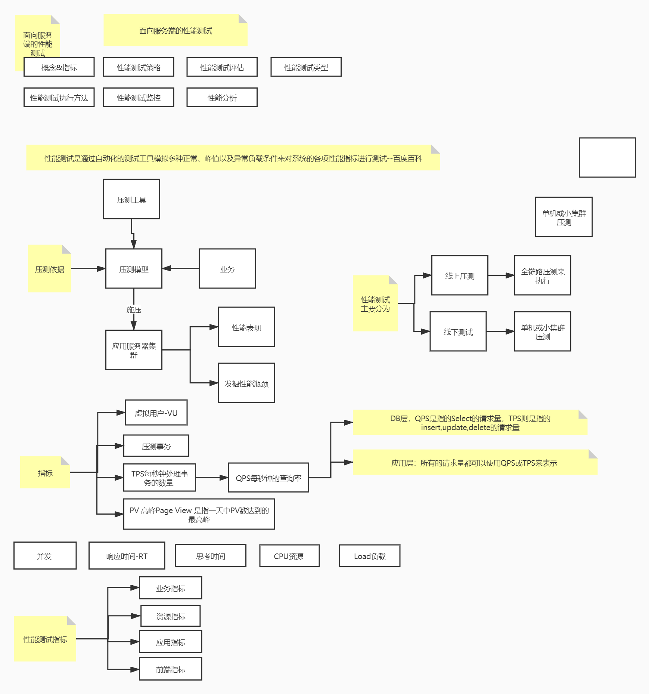

## 什么是性能测试？
性能测试是通过自动化的测试工具模拟多种正常、峰值以及异常负载条件来对系统的各项性能指标进行测试。负载测试和压力测试都属于性能测试 -- 百度百科

## 性能测试策略

## 性能测试评估

## 性能测试类型和执行方法

## 性能监控和分析工具

## 性能分析

补充

### QPS，每秒查询
QPS：Queries Per Second是衡量信息检索系统（例如搜索引擎或数据库）在一秒钟内接收到的搜索流量的一种常见度量。该术语在任何请求-响应系统中都得到更广泛的使用，更正确地称为每秒请求数（RPS：Request Per Second）。

### TPS，每秒事务

TPS：是Transactions Per Second的缩写，也就是事务数/秒。它是软件测试结果的测量单位。一个事务是指一个客户端向服务器发送请求然后服务器做出响应的过程。客户端在发送请求时开始计时，收到服务器响应后结束计时，以此来计算使用的时间和完成的事务个数。

QPS vs TPS：QPS基本类似于TPS，但是不同的是，对于一个页面的一次访问，形成一个TPS；但一次页面请求，可能产生多次对服务器的请求，服务器对这些请求，就可计入“QPS”之中。如，访问一个页面会请求服务器2次，一次访问，产生一个“T”，产生2个“Q”。

### RT，相应时间
RT（Response-time）响应时间：执行一个请求从开始到最后收到响应数据所花费的总体时间，即从客户端发起请求到收到服务器响应结果的时间。该请求可以是任何东西，从内存获取，磁盘IO，复杂的数据库查询或加载完整的网页。

暂时忽略传输时间，响应时间是处理时间和等待时间的总和。处理时间是完成请求要求的工作所需的时间，等待时间是请求在被处理之前必须在队列中等待的时间。

响应时间是一个系统最重要的指标之一，它的数值大小直接反应了系统的快慢。

参考资料：https://zhuanlan.zhihu.com/p/337708438

## 总结
