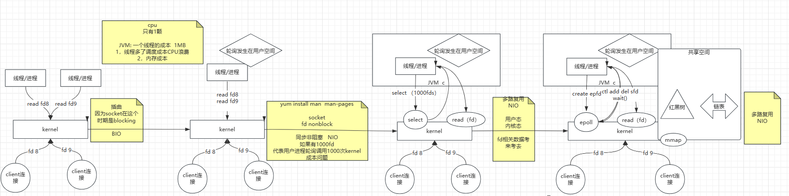
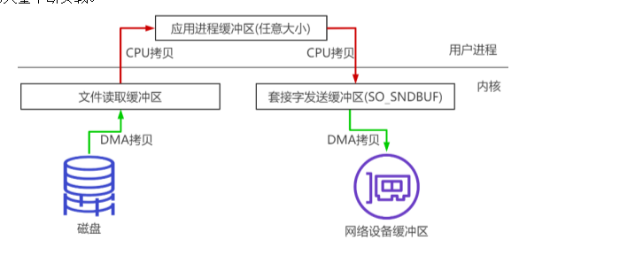

# redis介绍及NIO原理介绍

## 常识

磁盘：

1. 寻址：ms
2. 带宽：G/M

内存：

1.  寻址：ns
2. 带宽：很大

秒 > 毫秒 > 微秒 > 纳秒   

**磁盘比内存在寻址上慢了10万倍** 

I/O buffer：成本问题

磁盘与磁道，扇区，一扇区512Byte带来一个成本变大：索引

4K **操作系统，无论你读多少，都是最少4K从磁盘拿**

## 数据量大时如何快速查询数据库


https://db-engines.com/en/

点击System可以看出每个数据库的详细信息


# redis介绍

https://redis.io/

http://www.redis.cn/

Redis 是一个开源（BSD许可）的，内存中的数据结构存储系统，它可以用作数据库、缓存和消息中间件. 它支持多种类型的数据结构，如 字符串（strings）， 散列（hashes）， 列表（lists）， 集合（sets）， 有序集合（sorted sets） 与范围查询， bitmaps， hyperloglogs 和 地理空间（geospatial） 索引半径查询. Redis 内置了 复制（replication）， LUA脚本（Lua scripting）， LRU驱动事件（LRU eviction）， 事务（transactions） 和不同级别的 磁盘持久化（persistence）， 并通过 Redis哨兵（Sentinel） 和自动 分区（Cluster）提供高可用性（high availability）. 


http://www.redis.cn/documentation.html


# redis安装

https://download.redis.io/releases/redis-5.0.5.tar.gz

全部版本：https://download.redis.io/releases/

redis是C语言写的

```shell
# 安装步骤如下
yum install wget
cd ~
mkdir soft
cd soft
wget https://download.redis.io/releases/redis-5.0.5.tar.gz
tar xf redis-5.0.5.tar.gz  # 这里不加V，就不显示解压过程，减少IO写入
cd redis-5.0.5
看READNE.md  # 注意：这里面是相关操作说明
make  # 需要当前目录下有makefile文件，make是编译，默认就是已制定makefile文件去执行
# 如果报错，说缺少gcc，需要先安装。因为redis是C写的。需要c相关的依赖
yum install gcc
make distclean # 清理下编译残留的文件
cd src  # 这个下面就是一些可执行的脚本
cd ../
make install PREFIX=/opt/liufei/redis5
vi /etc/profile
-- export REDIS_HOME=/opt/liufei/redis5
-- export PATH=$PATH:$REDIS_HOME/bin
source /etc/profile
cd utils
./install_server.sh  （可执行一次或多次）
  a) 一个物理机种可以有多个redis实例，通过port区分
  b) 可执行程序就一份在目录，但是内存种未来的多个实例需要各自的配置文件，之久话目录等资源
  c) service redis_6379 start/stop/status  > 在linux的 /etc/init.d/***
  d) 脚本还会帮你自动启动
ps -ef | grep redis
```


# epoll

java 种一切皆对象，linux种一切皆文件

## kernel的发展



**技术的发展是为了解决问题，不是为了炫酷**


sendfile是0拷贝

```shell
# 安装man查看相关介绍
yum install man man-pages

# 如查看epool介绍
man epoll
```

# redis的运行原理


redis单线程是指：处理redis相关命令请求是单个线程去处理的。并不是说redis内只有一个线程

每个redis连接内的命令都是顺序的

# redis启动与库进去和帮助

```shell
# 直接连，默认进去的是6379的0号库
[root@manager-node vagrant]# redis-cli
127.0.0.1:6379>

# 查看帮助
[root@manager-node vagrant]# redis-cli -h
-h 指定server hostname
-p 指定port
-n 指定db库
...

127.0.0.1:6379> set k380:1 hello
OK
127.0.0.1:6379> get k380:1
"hello"
127.0.0.1:6379> select 8
OK
127.0.0.1:6379[8]> get k380:1   # 前面多了8，指的是当前是8号库
(nil)
127.0.0.1:6379[8]>

# 进来之后有个help帮助命令
127.0.0.1:6379> help
redis-cli 5.0.5
To get help about Redis commands type:
      "help @<group>" to get a list of commands in <group>
      "help <command>" for help on <command>
      "help <tab>" to get a list of possible help topics
      "quit" to exit

To set redis-cli preferences:
      ":set hints" enable online hints
      ":set nohints" disable online hints
Set your preferences in ~/.redisclirc

# 查看 generic 组下面的内容
127.0.0.1:6379> help @generic

  DEL key [key ...]
  summary: Delete a key
  since: 1.0.0

  DUMP key
  summary: Return a serialized version of the value stored at the specified key.
  since: 2.6.0

  EXISTS key [key ...]
  summary: Determine if a key exists
  since: 1.0.0

  EXPIRE key seconds
   .....

```

# redis的数据类型

## string类型

```shell
# 看string的帮助
127.0.0.1:6379> help @string


127.0.0.1:6379> set k1 hello
OK
127.0.0.1:6379> append k1 " world"
(integer) 11
127.0.0.1:6379> get k1
"hello world"
127.0.0.1:6379> GETRANGE k1 6 -1
"world"

# string 有个 type 可以看类型
127.0.0.1:6379> type k1   
string
127.0.0.1:6379> set k2 99   # 也是string，命令是哪个分组的，value也就是那个类型的
OK
127.0.0.1:6379> type k2
string

# 有个OBJECT命令
127.0.0.1:6379> OBJECT help
1) OBJECT <subcommand> arg arg ... arg. Subcommands are:
2) ENCODING <key> -- Return the kind of internal representation used in order to store the value associated with a key.
3) FREQ <key> -- Return the access frequency index of the key. The returned integer is proportional to the logarithm of the recent access frequency of the key.
4) IDLETIME <key> -- Return the idle time of the key, that is the approximated number of seconds elapsed since the last access to the key.
5) REFCOUNT <key> -- Return the number of references of the value associated with the specified key.

127.0.0.1:6379> set k3 hello
OK
127.0.0.1:6379>
127.0.0.1:6379> OBJECT encoding k2  # k2=99，编码是int，但是type是string
"int"
127.0.0.1:6379> OBJECT encoding k3  # embstr是只读的 只要一经修改 就会变为raw类型
"embstr" 
127.0.0.1:6379> INCR k2  # 对其进行++操作
(integer) 100
127.0.0.1:6379> get k2
"100" 
127.0.0.1:6379> STRLEN k2  # 长度就是3
(integer) 3

# 一个数值型，append之后编码变成raw，在incr之后，编码又变成了int
# 这里为什么会有个encoding，因为如果一个字符是encoding是int，那么可以直接对其进行数值相关的操作，如++或者--
# 如果一个字符是string类型，会先判断其是否可以转换成数值类型，如果可以，然后对其进行++操作，然后把encoding改成int，如果不能就报错
# 增加encoding，就可以少一步检查
127.0.0.1:6379> APPEND k2 0
(integer) 4
127.0.0.1:6379> get k2
"1000"
127.0.0.1:6379> OBJECT encoding k2
"raw"
127.0.0.1:6379> INCR k2
(integer) 1001
127.0.0.1:6379> OBJECT encoding k2
"int"
```

二进制安全

只取字节流，不取字符流，如果取字符流，会涉及到编解码的统一

```shell
127.0.0.1:6379> set k1 中
OK
127.0.0.1:6379> STRLEN k1  # 长度是3，因为当前终端工具设置的输入编码是utf-8，如果改成GBK，那么长度就是2
(integer) 3
127.0.0.1:6379> get k1
"\xe4\xb8\xad"

# 下面是将xshell终端编码改成GBK之后，一个中，就占用了两个字符
127.0.0.1:6379> set k3 中
OK
127.0.0.1:6379> get k3
"\xd6\xd0"
127.0.0.1:6379> get k1
"\xe4\xb8\xad"

# --raw 会出发编码的格式化，k1之前在utf-8下是中子，在GBK下就变成 涓 了
[root@manager-node vagrant]# redis-cli --raw
127.0.0.1:6379> get k1
涓
127.0.0.1:6379> get k3
中

# 长度是不会变的。这个跟你上层客户端使用的编码无关
127.0.0.1:6379> STRLEN k1 
3
127.0.0.1:6379> STRLEN k3
2


# getset。设置新的值，返回老的值
# 我不能先get，在set吗？为啥还要getset这个命令？当然可以，但是先get后set有两次IO操作，getset只有一次
127.0.0.1:6379> set k1 hello
OK
127.0.0.1:6379> GETSET k1 liufei
hello

```


正反向索引


>比如有个 k1 = "hello world"
>
>127.0.0.1:6379> GETRANGE k1 6 -1    # 最后可以直接写-1
>"world"

### bitmap


```shell
127.0.0.1:6379> help setbit

  SETBIT key offset value
  summary: Sets or clears the bit at offset in the string value stored at key
  since: 2.2.0
  group: string

# 设置第1个位置为1.即 0100 0000
127.0.0.1:6379> setbit k1 1 1
(integer) 0
127.0.0.1:6379> STRLEN k1  # 因为是1个字节，所以长度是1
(integer) 1
127.0.0.1:6379> get k1   # 0100 0000 对应的ascii是@
"@"
127.0.0.1:6379> setbit k1 7 1  # 设置第8位是1，变成 0100 0001
(integer) 0
127.0.0.1:6379> STRLEN k1  # 此时长度还是 1
(integer) 1
127.0.0.1:6379> get k1
"A"
127.0.0.1:6379> setbit k1 9 1  # 设置第9位是1，则二进制是 01000001 01000000
(integer) 0
127.0.0.1:6379> STRLEN k1   # 这时是两个字节，长度就是2
(integer) 2
127.0.0.1:6379> get k1  
"A@"
```

```shell
127.0.0.1:6379> help bitpos

  BITPOS key bit [start] [end]
  summary: Find first bit set or clear in a string
  since: 2.8.7
  group: string

# k1的二进制码是 01000001 01000000
127.0.0.1:6379> bitpos k1 1 0 0  # 返回在 第0个字节中是1 的索引位
(integer) 1
127.0.0.1:6379> bitpos k1 1 0 1  # 返回在 第0个和第1个字节中是1 的索引位，苏果有多个，返回第1个
(integer) 1
127.0.0.1:6379> bitpos k1 1 1 1  # 返回在 第1个字节中是1 的索引位 是9
(integer) 9
```

```shell
127.0.0.1:6379> help bitcount

  BITCOUNT key [start end]
  summary: Count set bits in a string
  since: 2.6.0
  group: string

# k1的二进制码是 01000001 01000000
# BITCOUNT 计算1的数量
127.0.0.1:6379> BITCOUNT k1 0 1
(integer) 3
127.0.0.1:6379> BITCOUNT k1 0 0
(integer) 2
127.0.0.1:6379> BITCOUNT k1 1 1
(integer) 1
```

```shell
# 面向二进制的与或非计算
127.0.0.1:6379> help bitop

  BITOP operation destkey key [key ...]
  summary: Perform bitwise operations between strings
  since: 2.6.0
  group: string

127.0.0.1:6379> setbit k1 1 1
(integer) 0
127.0.0.1:6379> setbit k1 7 1
(integer) 0
127.0.0.1:6379> get k1
"A"
127.0.0.1:6379> setbit k2 1 1
(integer) 0
127.0.0.1:6379> setbit k2 6 1
(integer) 0
127.0.0.1:6379> get k2
"B"

# 此时 A 是 01000001
# B是 01000010

127.0.0.1:6379> bitop and andkey k1 k2  # & 操作，都是1才会1, 所以 A & B = @ (01000000)
(integer) 1
127.0.0.1:6379> get andkey
"@"

127.0.0.1:6379> bitop or orkey k1 k2  # | 操作，都是0才会0, 所以 A | B = C (01000011)
(integer) 1
127.0.0.1:6379> get orkey
"C"

```

### 应用

**1，有个用户系统，统计用户登录的天数，且窗口随机**

如果是使用mysql，可以用一个用户登录表，用户哪一天登录，就是登录表中保存一下

如果用户太多查询速度会很慢

```shell
# 使用redis的bitmap

# 有两个固定的值， 一年有366天  一周7天

127.0.0.1:6379> setbit zhangsan 1 1  # 第2天登录
(integer) 0 
127.0.0.1:6379> setbit zhangsan 7 1   # 第8天登录了
(integer) 0
127.0.0.1:6379> setbit zhangsan 364 1  # 第365天登录了
(integer) 0
127.0.0.1:6379> STRLEN zhangsan  # 长度是46，这样一个用户数据的大小就是46B 
(integer) 46
127.0.0.1:6379> BITCOUNT zhangsan -2 -1  # 查询用户最后两周有没有登录
(integer) 1
```

**2，京东就是你们的，618做活动：送礼物**

大库备货多少礼物

假设京东有2E用户

僵尸用户

冷热用户/忠诚用户

活跃用户统计！随即窗口

比如说 1号~3号 连续登录要   去重

```shell
# 设置20230401，每个位置对应一个用户，如果某个位置的值是1，说明这个用户在这一天登录过
# 加入说索引 1 位置对应的是zhangsan
# 索引7 位置对应的是 lisi 
127.0.0.1:6379> setbit 20230401 1 1   # zhangsan在 20230401这一天登录过
(integer) 0
127.0.0.1:6379> setbit 20230402 1 1   # zhangsan在 20230402 这一天登录过
(integer) 0
127.0.0.1:6379> setbit 20230402 7 1   # lisi 在 20230402 这一天登录过
(integer) 0
127.0.0.1:6379> bitop or destkey 20230401 20230402
(integer) 1
127.0.0.1:6379> BITCOUNT destkey 0 -1
(integer) 2
```

### 总结


## list类型


```shell
# 查看帮助
127.0.0.1:6379> help @list


# lpush 一直往最左边的插入数据
127.0.0.1:6379> LRANGE list 0 -1
(empty list or set)
127.0.0.1:6379> LRANGE k1 0 -1
1) "g"
2) "f"
3) "r"
4) "d"
5) "c"
6) "b"
7) "a"
# rpush 一直往最右边的插入数据
127.0.0.1:6379> LRANGE k2 0 -1
1) "a"
2) "b"
3) "c"
4) "d"
5) "e"
6) "f"
7) "g"

# LPOP 左边弹出
127.0.0.1:6379> LPOP k1
"g"
# RPOP 右边弹出
127.0.0.1:6379> RPOP k1
"a"

# 使用索引。相当于数组
127.0.0.1:6379> LRANGE k2 0 -1
1) "a"
2) "b"
3) "c"
4) "d"
5) "e"
6) "f"
7) "g"
127.0.0.1:6379> LINDEX k2 -1
"g"

# LREMOVE key count value
# count是数量，可以是正数，也可以是负数
127.0.0.1:6379> LPUSH k3 1 a 2 b 3 a 4 c 5 a 6 d
(integer) 12
127.0.0.1:6379> LRANGE k3 0 -1
 1) "d"
 2) "6"
 3) "a"
 4) "5"
 5) "c"
 6) "4"
 7) "a"
 8) "3"
 9) "b"
10) "2"
11) "a"
12) "1"

# BLPOP 阻塞队列

# 新打开一个终端1
127.0.0.1:6379> blpop oxx 0


# 再新打开一个终端2
127.0.0.1:6379> blpop oxx 0

# 再新打开一个终端3，往oxx中push一个数据
127.0.0.1:6379> LPUSH oxx hello

# 此时终端1，阻塞会结束，终端2不会
# 这里会将key的名称oxx也返回出来
127.0.0.1:6379> blpop oxx 0
1) "oxx"
2) "hello"
(128.98s)

# 在终端3，往oxx中再push一个数据
127.0.0.1:6379> LPUSH oxx world

# 此时终端2，阻塞也会结束
# 这里会将key的名称oxx也返回出来
127.0.0.1:6379> blpop oxx 0
1) "oxx"
2) "world"
(286.90s)

```

## Hash类型

value是个hash。相当于java中的 Map<String, Map<String, Object>>

```shell
127.0.0.1:6379> help @hash
127.0.0.1:6379> hset zhangsan name zs
(integer) 1
127.0.0.1:6379> hmset zhangsan age 18 address hangzhou
OK
127.0.0.1:6379> hget zhangsan name
"zs"
127.0.0.1:6379> hget zhangsan age
"18"
127.0.0.1:6379> mget zhangsan name age
1) (nil)
2) (nil)
3) (nil)
127.0.0.1:6379> hmget zhangsan name age
1) "zs"
2) "18"
127.0.0.1:6379> hkeys zhangsan
1) "name"
2) "age"
3) "address"
127.0.0.1:6379> hvals zhangsan
1) "zs"
2) "18"
3) "hangzhou"
127.0.0.1:6379> hgetall zhangsan
1) "name"
2) "zs"
3) "age"
4) "18"
5) "address"
6) "hangzhou"

# 还支持数值计算
# 这里实现年龄的增加
127.0.0.1:6379> HINCRBYFLOAT zhangsan age 0.5  # 只有HINCRBYFLOAT，没有HDECRBYFLOAT
"18.5"
127.0.0.1:6379> HINCRBYFLOAT zhangsan age -1
"17.5"
```

## Set类型


```shell
127.0.0.1:6379> help @set

# SADD 添加
127.0.0.1:6379> sadd k1 tom sean peter tom oxx
(integer) 4
127.0.0.1:6379> SMEMBERS k1
1) "oxx"
2) "sean"
3) "peter"
4) "tom"

# SREM 移除
127.0.0.1:6379> SREM k1 oxx
(integer) 1
127.0.0.1:6379> SMEMBERS k1
1) "sean"
2) "peter"
3) "tom"

# SINTER 取两个set集合的交集，直接返回
127.0.0.1:6379> sadd k2 1 2 3 4 5
(integer) 5
127.0.0.1:6379> sadd k3 4 5 6 7 8
(integer) 5
127.0.0.1:6379> SINTER k2 k3
1) "4"
2) "5"

# SINTERSTORE 取两个set集合的交集，直接返回
127.0.0.1:6379> SINTERSTORE dest k2 k3
(integer) 2
127.0.0.1:6379> SMEMBERS dest
1) "4"
2) "5"

# 取并集
127.0.0.1:6379> SUNION k2 k3
1) "1"
2) "2"
3) "3"
4) "4"
5) "5"
6) "6"
7) "7"
8) "8"

# 取差集，分为左差和右差。需要调整元素的顺序
127.0.0.1:6379> SDIFF k2 k3
1) "1"
2) "2"
3) "3"
127.0.0.1:6379> SDIFF k3 k2
1) "6"
2) "7"
3) "8"

# 随机事件  SRANDMEMBER key count
# count可以为正数和负数。为正数不会重复随机，为负数会重复随机
127.0.0.1:6379> sadd k1 tom ooxx xxoo xoxo zhangsan xxoo lisi wangwu
(integer) 7
127.0.0.1:6379> SRANDMEMBER k1 2
1) "ooxx"
2) "zhangsan"
127.0.0.1:6379> SRANDMEMBER k1 -3  # 负数取的结果可能会重复
1) "ooxx"
2) "lisi"
3) "ooxx"
```

**随机事件可以解决什么问题？**

抽奖

如果有10个奖品

用户数量

- 大于10
- 小于等于10

规则：

- 能重复中奖
- 不能重复中奖

```shell
# 人小于礼物数，count使用负数，让一个人多中几个，但是这是公平的。可能有的人一次也中不到
```

## sortedSet类型

有序集


```shell
127.0.0.1:6379> help @sorted_set

# 物理内存左小右大
# 按照score分数的值来排序
127.0.0.1:6379> zadd k1 9 apple 2 banana 3 orange
(integer) 3
127.0.0.1:6379> ZRANGE k1 0 -1
1) "banana"
2) "orange"
3) "apple"
127.0.0.1:6379> ZRANGE k1 0 -1 withscores
1) "banana"
2) "2"
3) "orange"
4) "3"
5) "apple"
6) "9"

# 按照分值来取
127.0.0.1:6379> ZRANGEBYSCORE k1 3 8
1) "orange"

# 取出前两个 ZRANGE
127.0.0.1:6379> ZRANGE k1 0 1
1) "banana"
2) "orange"

# 从高到地低除前两个：ZREVRANGE
127.0.0.1:6379> ZREVRANGE k1 0 1
1) "apple"
2) "orange"
127.0.0.1:6379> ZRANGE k1 -2 -1  # 这个不是，这个是取最后两个，顺序跟上面不同
1) "orange"
2) "apple"

# 取分值
127.0.0.1:6379> ZSCORE k1 apple
"9"

# 取出排名
127.0.0.1:6379> ZRANK k1 apple
(integer) 2

# 支持对score的计算
127.0.0.1:6379> ZINCRBY k1 2.6 banana
"4.5999999999999996"
127.0.0.1:6379> ZRANGE k1 0 -1 withscores  # 随着score的变化，顺序会自动变化
1) "orange"
2) "3"
3) "banana"
4) "4.5999999999999996"
5) "apple

--------------

# 集合的操作，合并，差集

# ZUNIONSTORE合并，相同key的score值会相加
127.0.0.1:6379> zadd k2 80 tom 60 sean 70 baby
(integer) 3
127.0.0.1:6379> zadd k3 60 tom 100 sean  40 zhangsan
(integer) 3
127.0.0.1:6379> ZUNIONSTORE unkey 2 k2 k3
(integer) 4
127.0.0.1:6379> ZRANGE unkey 0 -1 withscores
1) "zhangsan"
2) "40"
3) "baby"
4) "70"
5) "tom"
6) "140"
7) "sean"
8) "160"

127.0.0.1:6379> ZUNIONSTORE unkey1 2 k2 k3 weights 1 0.5 # 带上权重值，这个表示 k2对应的值 * 1, k3对应的值 * 0.5
(integer) 4
127.0.0.1:6379> ZRANGE unkey1 0 -1 withscores
1) "zhangsan"
2) "20"
3) "baby"
4) "70"
5) "sean"
6) "110"
7) "tom"
8) "110"


# 聚合操作，去除最大值的索引位置
127.0.0.1:6379> ZUNIONSTORE unkey1 2 k2 k3 aggregate max
(integer) 4
```

**Q：排序是怎么是实现的增删改查的速度？**

A：skip list 跳跃表


> 修改：就是先将节点删掉，然后在插入

https://blog.csdn.net/wangxuelei036/article/details/106272680

# 传统与零拷贝

伪码实现如下：

buffer = File.read()

Socket.send(buffer)

1、第一次：将磁盘文件，读取到操作系统内核缓冲区；

2、第二次：将内核缓冲区的数据，copy到应用程序的buffer；

3、第三步：将application应用程序buffer中的数据，copy到socket网络发送缓冲区(属于操作系统内核的缓冲区)；

4、第四次：将socket buffer的数据，copy到网卡，由网卡进行网络传输。

比如：读取文件，再用socket发送出去，实际经过四次copy。

DMA(Direct Memory Access，直接内存存取) 是所有现代电脑的重要特色，它允许不同速度的硬件装置来沟通，而不需要依赖于CPU 的大量中断负载。



## RocketMQ——mmap内存映射

硬盘上文件的位置和应用程序缓冲区(application buffers)进行映射（建立一种一一对应关系），由于mmap()将文件直接映射到用户空间，所以实际文件读取时根据这个映射关系，直接将文件从硬盘拷贝到用户空间，只进行了一次数据拷贝，不再有文件内容从硬盘拷贝到内核空间的一个缓冲区。

mmap内存映射将会经历：3次拷贝: 1次cpu copy，2次DMA copy；


## Kafka——sendfile

linux 2.1支持的sendfile

当调用sendfile()时，DMA将磁盘数据复制到kernel buffer，然后将内核中的kernel buffer直接拷贝到socket buffer。在硬件支持的情况下，甚至数据都并不需要被真正复制到socket关联的缓冲区内。取而代之的是，只有记录数据位置和长度的描述符被加入到socket缓冲区中，DMA模块将数据直接从内核缓冲区传递给协议引擎，从而消除了遗留的最后一次复制。

一旦数据全都拷贝到socket buffer，sendfile()系统调用将会return、代表数据转化的完成。socket buffer里的数据就能在网络传输了。

sendfile会经历：3次拷贝，1次CPU copy ，2次DMA copy；硬件支持的情况下，则是2次拷贝，0次CPU copy， 2次DMA copy。

以及2次上下文切换


**splice**

Linux 从2.6.17 支持splice

数据从磁盘读取到OS内核缓冲区后，在内核缓冲区直接可将其转成内核空间其他数据buffer，而不需要拷贝到用户空间。

如下图所示，从磁盘读取到内核buffer后，在内核空间直接与socket buffer建立pipe管道。

和sendfile()不同的是，splice()不需要硬件支持。

注意splice和sendfile的不同，sendfile是将磁盘数据加载到kernel buffer后，需要一次CPU copy，拷贝到socket buffer。而splice是更进一步，连这个CPU copy也不需要了，直接将两个内核空间的buffer进行pipe。

splice会经历 2次拷贝: 0次cpu copy 2次DMA copy；

以及2次上下文切换


## 总结Linux中零拷贝

最早的零拷贝定义，来源于

Linux 2.4内核新增 sendfile 系统调用，提供了零拷贝。磁盘数据通过 DMA 拷贝到内核态 Buffer 后，直接通过 DMA 拷贝到 NIO Buffer(socket buffer)，无需 CPU 拷贝。这也是零拷贝这一说法的来源。这是真正操作系统 意义上的零拷贝(也就是狭义零拷贝)。

但是我们知道，由OS内核提供的 操作系统意义上的零拷贝，发展到目前也并没有很多种，也就是这样的零拷贝并不是很多；

随着发展，零拷贝的概念得到了延伸，就是目前的减少不必要的数据拷贝都算作零拷贝的范畴。

## Java生态圈中的零拷贝

Linux提供的零拷贝技术 Java并不是全支持，支持2种(内存映射mmap、sendfile)；

### NIO提供的内存映射 MappedByteBuffer

NIO中的FileChannel.map()方法其实就是采用了操作系统中的内存映射方式，底层就是调用Linux mmap()实现的。

将内核缓冲区的内存和用户缓冲区的内存做了一个地址映射。这种方式适合读取大文件，同时也能对文件内容进行更改，但是如果其后要通过SocketChannel发送，还是需要CPU进行数据的拷贝。

### NIO提供的sendfile

Java NIO 中提供的 FileChannel 拥有 transferTo 和 transferFrom 两个方法，可直接把 FileChannel 中的数据拷贝到另外一个 Channel，或者直接把另外一个 Channel 中的数据拷贝到 FileChannel。该接口常被用于高效的网络 / 文件的数据传输和大文件拷贝。在操作系统支持的情况下，通过该方法传输数据并不需要将源数据从内核态拷贝到用户态，再从用户态拷贝到目标通道的内核态，同时也避免了两次用户态和内核态间的上下文切换，也即使用了“零拷贝”，所以其性能一般高于 Java IO 中提供的方法。

### Kafka中的零拷贝

Kafka两个重要过程都使用了零拷贝技术，且都是操作系统层面的狭义零拷贝，一是Producer生产的数据存到broker，二是 Consumer从broker读取数据。

Producer生产的数据持久化到broker，采用mmap文件映射，实现顺序的快速写入；

Customer从broker读取数据，采用sendfile，将磁盘文件读到OS内核缓冲区后，直接转到socket buffer进行网络发送。

### Netty的零拷贝实现

Netty 的零拷贝主要包含三个方面：

在网络通信上，Netty 的接收和发送 ByteBuffer 采用 DIRECT BUFFERS，使用堆外直接内存进行 Socket 读写，不需要进行字节缓冲区的二次拷贝。如果使用传统的堆内存（HEAP BUFFERS）进行 Socket 读写，JVM 会将堆内存 Buffer 拷贝一份到直接内存中，然后才写入 Socket 中。相比于堆外直接内存，消息在发送过程中多了一次缓冲区的内存拷贝。

在缓存操作上，Netty提供了CompositeByteBuf类，它可以将多个ByteBuf合并为一个逻辑上的ByteBuf，避免了各个ByteBuf之间的拷贝。

通过wrap操作，我们可以将byte[]数组、ByteBuf、 ByteBuffer 等包装成一个 Netty ByteBuf对象，进而避免了拷贝操作。

ByteBuf支持slice 操作，因此可以将ByteBuf分解为多个共享同一个存储区域的ByteBuf，避免了内存的拷贝。

在文件传输上，Netty 的通过FileRegion包装的FileChannel.tranferTo实现文件传输，它可以直接将文件缓冲区的数据发送到目标 Channel，避免了传统通过循环 write 方式导致的内存拷贝问题。
