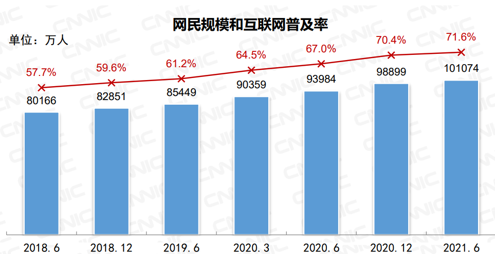

# 为什么要学计算机网络基础

## 1. 第48次中国互联网络发展状况统计报告

- 下载地址：https://cit.buct.edu.cn/2021/0925/c7951a157922/page.htm

* 下载地址：[http://www.cnnic.net.cn/hlwfzyj/hlwxzbg/hlwtjbg/202109/P020210915523670981527.pdf]()
* 总体网民规模
  * 截至 2021 年 6 月，我国网民规模为 10.11 亿，较 2020 年 12 月新增网民 2175 万，互联
    网普及率达 71.6%，较 2020 年 12 月提升 1.2 个百分点。
* 网民年龄结构
  * 截至 2021 年 6 月，我国 30-39 岁网民占比为 20.3%，在所有年龄段群体中占比最高；
    40-49 岁、20-29 岁网民占比分别为 18.7%和 17.4%，在所有年龄段群体中占比位列二、三
    位。
* 上网时长
  * 截至 2021 年 6 月，我国网民的人均每周上网时长11为 26.9 个小时，较 2020 年 12 月提
    升 0.7 个小时。
  * 
* APP数量及分类
  * 截至 2021 年 6 月，我国国内市场上监测到的 APP 数量为 302 万款，较 2020 年 12 月
    减少 43 万款，下降 12.5%。
  * 截至 2021 年 6 月，移动应用规模居前四位的 APP 分类占比达 58.2%。其中，游戏类
    APP 数量继续领先，达 72.9 万款，占全部 APP 比重为 24.1%。日常工具类、电子商务类和
    社交通讯类 APP 数量分别达 46.5 万、29.5 万和 27.1 万款，分列移动应用规模第二至四位，
    占全部 APP 比重分别为 15.4%、9.8%和 9.0%。
* 互联网应用用户规模及网民使用率
  * 不同年龄段在应用使用上呈现出不同的特点。20-29 岁年龄段网民对网络音乐、网络视
    频、网络直播等应用的使用率在各年龄段中最高，分别达 84.1%、97.0%和 73.5%。30-39 岁
    年龄段网民对网络新闻类应用的使用率最高，达 83.4%。10-19 岁年龄段网民对在线教育类
    应用的使用率最高，达 48.5%。

## 2 学习计算机网络的意义

1、了解计算机网络常识

2、软件开发：掌握计算机网络理论基础、掌握网络调试软件及方法对于开发网络应用程序具有非常重要的指导意义

3、网络安全、运维：具有非常扎实的计算机网络基础，对于常用的网络设备、软件的使用及配置要非常熟练，熟练掌握网络体系结构中各层中常用协议的实现原理。