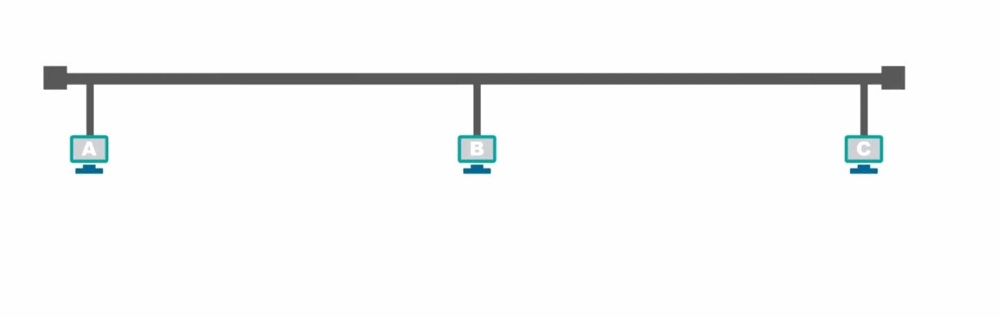

# 1. 常用的计算机网络体系结构

## 1.1 OSI体系结构

1、为了使不同体系结构的计算机网络都能够互联，国际标准化组织于1977年成立了专门机构研究该问题，不久他们就提出了一个试图使各种计算机在世界范围内都能够互连成网的标准框架，也就是著名的“**开放系统互连参考模型**”，**简称为OSI，OSI体系结构有时候我们也称之为OSI模型。**

2、OSI是一个**七层协议**的体系结构：从下往上依次是**物理层、数据链路层、网络层、运输层、会话层、表示层、应用层。**

3、OSI试图达到一种理想境界，即全球计算机网络都遵循这个统一标准，因而全球的计算机将能够很方便地进行互连和交换数据。在20世纪80年代，许多大公司甚至一些国家的政府机构纷纷表示支持OSI。当时看来似乎在不久的将来全世界一定会按照OSI制定的标准来构造自己的计算机网络。

4、然而到了20世纪90年代初期，虽然整套的OSI国际标准都已经制定出来了，但由于基于TCP/IP 的互联网已抢先在全球相当大的范围成功地运行了，而与此同时却几乎找不到有什么厂家生产出符合OSI标准的商用产品。因此人们得出这样的结论：**OSI 只获得了一些理论研究的成果，但在市场化方面则事与愿违地失败了。**

**现今规模最大的、覆盖全球的、基于TCP/IP的互联网并未使用OSI标准。**

5、OSI失败的原因可归纳为:

- **OSI的专家们缺乏实际经验，他们在完成OSI标准时缺乏商业驱动力;**
- **OSI的协议实现起来过分复杂，而且运行效率很低;**
- **OSI标准的制定周期太长，因而使得按OSI标准生产的设备无法及时进入市场;**
- **OSI的层次划分不太合理，有些功能在多个层次中重复出现。**

6、**OSI体系结构是法律上的国际标准， TCP/IP体系结构是事实上的国际标准**

## 1.2 具有五层协议的体系结构

1、TCP/IP是一个**四层**的体系结构，它包含**应用层、运输层、网际层和网络接口层**（用网际层这个名字是强调这一层是为了解决不同网络的互连问题)。

2、OSI的七层协议体系结构概念清楚，理论也比较完整，但是太过于复杂不实用。TCP/IP体系结构不同，但是现在却得到了非常广泛的应用。

3、在学习计算机网络的原理时往往采取折中的办法，即综合OSI和TCP/IP 的优点，**采用一种只有五层协议的体系结构**，这样既简洁又能将概念阐述清楚。有时为了方便，也可把最底下两层称为**网络接口层**。

4、下面我们结合互联网的情况，自上而下地，非常简要的介绍一下各层的主要功能。

- 应用层（application layer）
  - 应用层是体系结构中的最高层。应用层的任务是通过应用进程间的交互来完成特定网络应用。应用层协议定义的是应用进程间通信和交互的规则。这里的进程就是指主机中正在运行的程序。对于**不同的网络应用需要有不同的应用层协议**。在互联网中的应用层协议很多，如**域名系统DNS，支持万维网应用的 HTTP 协议，支持电子邮件的SMTP协议**，等等。**我们把应用层交互的数据单元称为报文(message)。**
- 运输层（transport layer）
  - 运输层的任务就是负责**向两台主机中进程之间的通信提供通用的数据传输服务**。
  - 运输层主要使用以下两种协议:
    - **传输控制协议TCP (Transmission Control Protocol)**：提供面向连接的、可靠的数据传输服务
    - **用户数据报协议UDP (User Datagram Protocol）**：提供无连接的、尽最大努力(best-effort)的数据传输服务（不保证数据传输的可靠性)
  - TCP和UDP协议都有固定的格式，数据在经过运输层时会根据所选择的运输协议在应用层传递过来的数据基础上加上对应协议的头部。

- 网络层（network layer）

  - 主要作用是实现**两个网络系统之间的数据透明传送**，具体包括**路由选择，拥塞控制和网际互连**等。
  - 在发送数据时，网络层把运输层产生的报文段或用户数据报封装成分组或包进行传送。在TCP/IP体系中，由于网络层使用IP协议，因此分组也叫做**IP数据报**，简称为**数据报**。
  - 数据在经过网络层时会加上IP协议的头部

- 数据链路层（data link layer）

  - 数据链路层常简称为链路层。我们知道，两台主机之间的数据传输，总是在一段一段的链路上传送的，这就需要使用专门的链路层的协议。在两个相邻结点之间传送数据时，数据链路层将网络层交下来的IP数据报**组装成帧(framing)**，在两个相邻结点间的链路上**传送帧(frame)**。每一帧包括数据和必要的**控制信息（如同步信息、地址信息、差错控制等）。**

- 物理层（physical layer）

  - 利用传输介质为数据链路层提供物理连接，实现比特流的透明传输。
  - **物理层上所传输数据的单位是比特。**

  

[一文看懂网络七层协议/OSI七层模型 - 知乎 (zhihu.com)](https://zhuanlan.zhihu.com/p/296670054)

> 总结：
>
> 应用层  —— 人做好信息，往下发
> 表示层 —— 翻译一下
> 会话层 —— 打包
> 传输层 —— 把包发给下层
> 网络层 —— 报文：给包贴个ip地址的标签
> 数据链路层 —— 帧：查表ip转mac，然后转成电信号
>
> 物理层 —— 定义好各种信号的意思，线路和插口的格式，发送吧

# 2. 物理层

## 2.1 物理层的基本概念

1、物理层主要解决在各种传输媒体上传输比特0和1的问题，进而给数据链路层提供透明传输比特流的服务

2、由于传输媒体的种类太多（例如**同轴电缆**、**光纤**、**无线电波**等），物理连接方式也有很多例如**点对点连接**、**广播连接**等，因此物理层协议种类也比较多。但是物理层为了解决在各种传输媒体上传输比特0和1的问题，无论是那种物理层协议都需要满足主以下四个任务：

## 2.2 传输媒体

1、导引型传输媒体：电磁波被导引沿着固体媒体传播

- **同轴电缆**

  

  > - 可以从上图看出同轴电缆的各层都是共圆心的，也就是同轴心的
  > - 同轴电缆有两种：
  >   - **基带同轴电缆**：数字传输，过去用于局域网
  >   - **宽带同轴电缆**：模拟传输，目前主要用于有线电视
  > - 同轴电缆价格较贵且布线不够灵活和方便，随着集线器的出现，在局域网领域基本上都是采用双绞线作为传输媒体

- **双绞线**

  - **双绞线是最常用的传输媒体**，把两根互相绝缘的铜导线放在一起，然后按照一定规则绞合起来就构成了双绞线。

  - 常用的双绞线包含

    八根铜导线，每两根绞合成一条双绞线，绞合组合如下：

    - 蓝色线和蓝白双色线绞合
    - 橙色线和橙白双色线绞合
    - 绿色线和绿白双色线绞合
    - 棕色先和棕白双色线绞合

  - 绞合的作用：
    - 抵御部分来自外界的电磁干扰
    - 减少相邻导线的电磁干扰

  - 根据有无屏蔽层，双绞线分为：**无屏蔽双绞线**和**屏蔽双绞线**

    - 无屏蔽

    

    - 屏蔽双绞线：在双绞线与外层绝缘封套之间有一个**金属屏蔽层**

      

  - 常用的绞合线类别、带宽及典型应用

    

- 光纤

  

  > 光纤的优点
  >
  > - 通信容量大(25000~30000GHz的带宽)
  > - 传输损耗小，远距离传输时更加经济。
  > - 抗雷电和电磁干扰性能好。这在大电流脉冲干扰的环境下尤为重要。
  > - 无串音干扰，保密性好，不易被窃听。
  > - 体积小，重量轻。

2、非导引型传输媒体：非导引型传输媒体是指自由空间

- **无线电波**
- **微波**
- **红外线**
- **可见光**

# 3 数据链路层

## 3.1 数据链路层概述

**1、数据链路层在网络体系结构中所处的地位**

如下图所示：主机H1给主机H2发送数据，中间要经过三个路由器、电话网、局域网、广域网等多种网络。

从五层协议原理体系结构的角度来看，主机应该具有体系结构中的各个层次，而路由器只需要具有体系结构中的网络层、数据链路层、物理层。网络中的各个设备通过传输媒体进行互连，主机H1将需要发送的数据**逐层封装**后通过物理层将构成数据包的各个比特转换为电信号发送到传输媒体，数据包进入到路由器后，**从下往上逐层解封到网络层**，路由器根据数据包的**目的网络地址**和**自身的转发表**确定数据包的转发端口，然后从网络层向下逐层封装数据包，最后通过物理层将数据包发送到传输媒体，最后到达主机H2，主机H2在接收到数据包后再逐层解封。

当我们研究数据链路层时，我们可以只关心数据链路层，而不考虑其他各层。我们可以想象，数据只在数据链路层从左至右沿水平方向传送。从数据链路层来看，主机H1到主机H2 的通信可以看作是在4段不同的链路上的通信所组成的。

所谓的**链路(Link)**就是从一个结点到相邻结点的一段物理线路，而中间没有任何其他的交换结点。要在链路上传输数据，仅有链路还不够，还需要一些通信协议来控制这些数据的传输，如果把实现这些协议的硬件和软件加到链路上就构成了**数据链路**（Data Link）

在数据链路上传输的数据包，又称为**帧**。（数据链路层是以帧作为单位传输和处理的）

> **注意：结点就是网络中的一台主机。**

数据链路层的协议有很多种，但是有三个基本问题是共同的。这三个基本问题就是：**封装成帧、透明传输和差错检测。**

## 3.2 封装成帧

封装成帧是指数据链路层给上层交付的协议数据单元添加**帧头**和**帧尾**使之成为帧。

- **帧头和帧尾中包含有重要的控制信息**

  

- 帧头和帧尾的作用之一就是**帧定界**

  - 例如：PPP帧的第一个字节和最后一个字节就是帧定界，通过这两个字节就能够从物理层交付的比特流中提取出一个一个的帧。

    

- **并不是每种数据链路层协议的帧都包含有帧定界标志**，例如MAC帧在帧头和帧尾中是没有包含帧定界的标志的， 那么接收方是如何从物理层交付的比特流中提取出一个个的以太网帧的呢？

  - 第一步：数据链路层封装好MAC帧，将其交付给物理层

  - 第二步：物理层在MAC帧的前面添加8字节的**前导码**，前导码的**前7个字节**为**前同步码**，其作用是使接收方的时钟同步，之后的1个字节为帧开始定界符，表明其后紧跟着的就是MAC帧。

    

## 3.3 透明传输

1、透明传输是指数据链路层对上层交付的传输数据没有任何限制，就好像数据链路层不存在一样。

- 当数据帧中的数据是帧定界标志时，发送端的数据链路层该如何处理呢？

  - **当物理链路提供的是面向字符的传输服务时（物理链路以字符为单位传输数据）**：

    

    数据链路层在交付数据给物理层时，对帧进行扫描，首先扫描到SOH，然后每扫描到一个SOH或者EOT就在前面加**转义字符ESC**，直至扫描到最后一个EOT，这种方式称之为：**字节填充(byte stuffing)**或**字符填充(character stuffing)**

    

    接收端的数据链路层在将数据送往网络层之前删除插入的转义字符

    在数据发送前采用**零比特填充法**：对数据进行扫描，每5个连续的比特1后面就插入1个比特0

    

    考研真题：

    

    选A

2、为了提高帧的传输效率，应当使帧的数据部分的长度尽可能大些。

3、考虑到差错控制等多种因素，每一种数据链路层协议都规定了帧的数据部分的长度上限，即最大传送单元**MTU(Maximum Transfer Unit)**。

> 路由器的MTU一般默认是1500，路由器是工作在网络层

## 3.4 差错校验（检测）

1、实际的通信链路都不是理想的，比特流在传输过程中由于受到各种干扰可能会产生差错: 1可能会变成0,而0也可能变成1。这称为**比特差错**，或者称为**误码**。

2、一段时间内，传输错误的比特占所传输比特总数的比率称为**误码率（Bit Error Rate）**

3、接收方是如何知道数据在传输的过程中出现差错了呢？使用**差错检测码**来检测数据在传输过程中是否产生了比特差错，是数据链路层所要解决的重要问题之一。

4、在封装好的帧中利用若干个字节表示帧校验序列FCS字段。*FCS* :Frame Check Sequence(帧校验序列)。FCS字段由一些差错校验算法计算得出，常用的校验算法为：**循环冗余校验CRC(Cyclic Redundancy Check)。**

5、接收方在接收到数据后计算出一个FCS，然后将计算得出的FCS与接收到的数据帧中的FCS进行比较。

由于判断FCS是否正确只能检测出帧在传输过程中出现了差错，但并不能定位错误，因此**无法纠正错误**。接收方可以通过**检错重传**方式来纠正传输中的差错,或者仅仅是**丢弃检测到差错的帧**，这取决于数据链路层向其上层提供的是**可靠传输服务**还是**不可靠传输服务**。

## 3.5 以太网

1、**以太网概念**

- **以太网是一种计算机局域网技术**。**IEEE**（电气与电子工程师协会：Institute of Electrical and Electronics Engineers）组织的**IEEE 802.3**标准制定了以太网的技术标准，它规定了包括**物理层的连线、电子信号和介质访问层协议**的内容。**以太网是应用最普遍的局域网技术**，取代了其他局域网技术如令牌环、FDDI和ARCNET。

- 以太网是一种有线系统，最初使用**同轴电缆**进行数据传输，后来发展到使用双绞线和光纤并延续至今。

  

  

2、**以太网的两个标准**

- 1980年9月，**DEC公司**、**英特尔(Intel)公司**和**施乐公司**联合提出了10 Mbit/s 以太网规约的第一个版本**DIX V1**(DIX是这三个公司名称的缩写)。

- 1982年又修改为第二版规约（实际上也就是最后的版本)，即**DIX Ethernet V2**，成为世界上第一个局域网产品的规约。

- 1983年，**IEEE 802**委员会的**802.3工作组**制定了第一个IEEE的以太网标准**IEEE 802.3**[W-IEEE802.3]，数据率为**10 Mbit/s**。以太网的两个标准 DIX Ethernet V2与IEEE的802.3标准只有很小的差别，因此很多人也常把802.3局域网简称为"以太网"。

- IEEE 802委员会的介绍（引用自《计算机网络-谢希仁》）

  

- IEEE 802.3 定义了以太网的**物理层**和**数据链路层**的介质访问控制部分，其中物理层由两个组件组成：**线缆**和**设备**，数据链路层可以分为两部分：**逻辑链路控制（LLC）**、**介质访问控制（MAC)**。

  

- 物理层

  - 线缆：以太网的通信线缆由最先的同轴电缆发展到今天的双绞线和光纤。

    - 双绞线两端配有**RJ45**八针连接器，这种八针连接器用于在半双工和全双工模式下进行数据的发送和接收。

      

      - 半双工模式：数据一次沿一个方向传输

        

      - 全双工模式：数据沿两个方向传输，以太网的全双工模式可以通过使用一对双绞线实现

        

    - 光纤线缆：光纤线缆使用**玻璃光纤**或**塑料光纤**作为光脉冲的传输通道来传输数据

      

    - 光纤电缆可以根据实际需求使用不同类型的连接器：**SFP连接器、SC连接器**

      

  - 设备：以太网设备由计算机、打印机等具有网络接口卡的设备所组成，常用的以太网设备有**路由 器、交换机、网桥**，而工作在数据链路层上的设备为交换机、网桥，路由器工作在五层体系结构中的网络层。

- 数据链路层

  - 逻辑链路控制LLC：为网络层提供统一的接口以便数据在设备间传输。很多厂商生产的适配器上就仅装有 MAC 协议而没有 LLC 协议。

  - 介质访问控制MAC：使用分配给网络接口卡的硬件地址来标识特定的计算机或设备接口，通过这种方法来表示数据传输的源地址和目的地址。

## 3.6 以太网的MAC层

**1、MAC层的硬件地址**

- MAC地址（**英语：Media Access Control Address）** ，直译为**媒体存取控制位址** ，也称为**局域网地址** （LAN Address），**MAC位址** ，**以太网地址** （Ethernet Address）或**物理地址** （Physical Address），它是一个用来确认网络设备位置的位址。
- IEEE 802标准为局域网规定了一种**48位（6字节）**的全球地址（一般简称为“地址”），这个地址会固化在**适配器**的**ROM**中。

- IEEE 的**注册管理机构 RA** 负责向厂家分配地址字段的**前三个字节(即高位 24 位)**。地址字段中的后三个字节(即低位 24 位)由**厂家自行指派**，称为**扩展标识符**，必须保证生产出的适配器没有重复地址。世界上凡要生产局域网适配器的厂家都必须向IEEE购买由这三个字节构成的这个号（即地址块)，这个号的正式名称是组织唯一标识符。

  > 例如，3Com公司生产的适配器的MAC地址的前三个字节是 02-60-8C。地址字段中的后三个字节（即低位24位）则由厂家自行指派，只要保证生产出的适配器没有重复地址即可

- 一个地址块可以生成**2^24**个（二百八十多万亿个）不同的地址。这种 48 位地址称为**MAC-48**，它的通用名称是**EUI-48**。
- 一般情况下，用户主机会包含两个网络适配器：**有线局域网适配器（有线网卡）**和**无线局域网适配器（无线网卡)**。每个网络适配器都有一个全球唯一的MAC地址。而**交换机和路由器往往拥有更多的网络接口，所以会拥有更多的MAC地址**。综上所述，严格来说，MAC地址是对网络上各接口的唯一标识，而不是对网络上各设备的唯一标识。

- 我们可以在**DOS窗口**输入命令：**ipconfig /all** ， 查看本机网卡的MAC地址。

  

**2、MAC地址的格式**

- **MAC地址的表示方法**

  

- **MAC地址的含义**

  

**3、MAC 帧的格式**

数据链路层在网络层交付的IP数据包前面加上“**目的地址**”、“**源地址**”、“**类型**”字段，并且在最后加入4字节的**FCS**字段，组成一个**以太网MAC帧**，然后再交付给物理层

- 目的地址：接收主机的MAC地址

- 源地址：发送主机的MAC地址

- 类型：类型字段标志上一层使用的是什么**协议**，以便把收到的 MAC 帧的数据上交给上一层的这个协议。

  

  > 注意：当数据字段的长度小于 46 字节时，应在数据字段的后面加入整数字节的填充字段，以保证以太网的 MAC 帧长不小于 64 字节。

**4、MAC地址的识别**

当多个主机连接到同一个广播信道上，要实现两个主机之间的通信，每个主机发送的帧中包含了目的地址和源地址，广播信道上的每一台主机都能够收到该帧，接收到帧的主机将帧中的目的地址与保存在网络适配器的电可擦除可编程只读存储器**EEPROOM**中的MAC地址进行比较，如果匹配则接受该帧，否则就丢弃该帧。

根据MAC地址为单播MAC地址还是广播MAC地址还是多播MAC地址，在计算机网络中“**发往本站（本主机）的帧**”分为三种：**单播(unicast)帧（一对一）、广播(broadcast)帧（一对全体）、多播(multicast)帧（一对多）。**

- **单播MAC地址**

  

- **广播MAC地址**

  

- **多播MAC地址**

  

- **随机MAC地址**：据斯诺登介绍，美国国家安全局有一套系统通过监视电子设备的MAC地址来跟踪城市中每个人的行动，因此苹果率先在**ios**系列设备扫描网络时采用随机MAC地址技术，随后**Windows10**，**安卓6.0**以及**内核版本3.18的Linux**系统也提供随机MAC地址功能。 目前大多数移动设备都采用了随机MAC地址技术。

