# 1. 计算机网络在信息时代中的作用

21世纪的一些重要特征就是数字化、网络化和信息化，它是一个以网络为核心的信息时代。

思考：大家每天最离不开的一件物品是什么？

如果没有了网络，没有了互联网，没有了互联网上丰富多彩的信息和应用，人们还会对手机痴迷吗？

那我们平时所说的网络到底是什么呢？

- 网络（Network）由若干结点（Node）和连接这些结点的链路（Link）所组成。 网络中的结点可以是计算机、集线器、交换机或者路由器等。

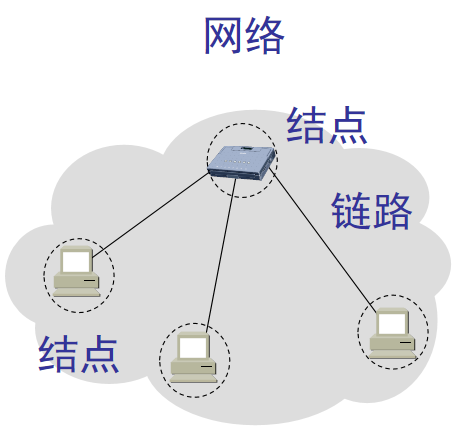

​																													图1-1

- 多个网络还可以通过**路由器**互连起来,这样就构成了一个覆盖范围更大的计算机网络。这样的网络称为**互连网(internetwork 或 internet)**

  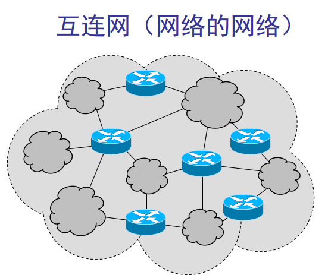

  ​																											图1-2

- 当我们使用一朵云来表示网络时，可能会有两种不同的情况。一种情况如图1-1所示，用云表示的网络已经包含了和网络相连的计算机。但有时为了讨论问题的方便(例如，要讨论几个计算机之间如何进行通信)，也可以把有关的计算机画在云的外面，如图1-3 所示。习惯上，与网络相连的计算机常称为**主机(host)**。这样，用云表示的互连网里面就只剩下许多路由器和连接这些路由器的链路了。

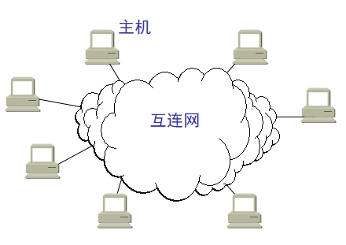

​																												图1-3

- **因特网(Internet)** 是世界上最大的互连网络(用户数以亿计，互连的网络数以百万计)

  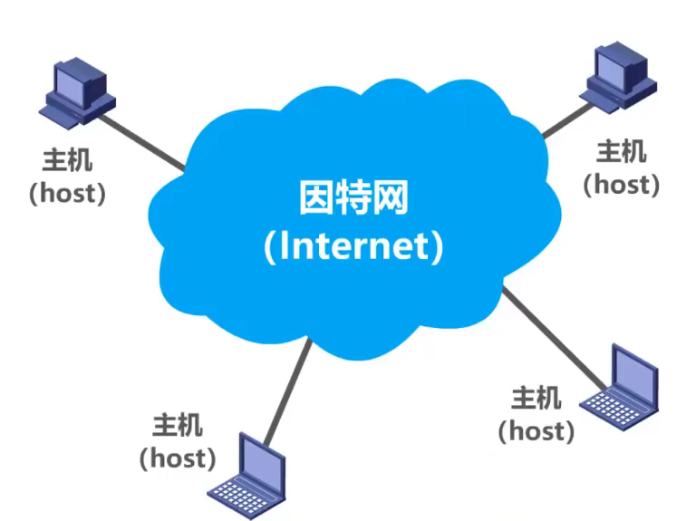

​																													图1-4

- internet 和 Internet的区别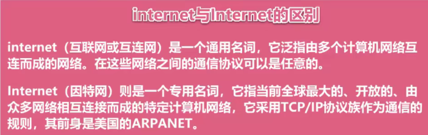

  

# 2. 因特网发展的三个阶段

因特网的基础结构大致经历了如下三个阶段的演进：

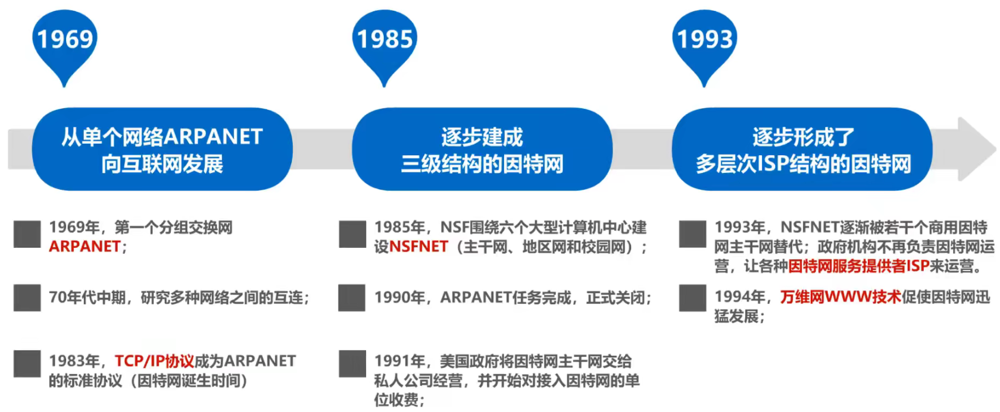

## 第一阶段：1969年出现了美国军用计算机网ARPANET(“阿帕网”)

**第一阶段：1969年出现了美国军用计算机网ARPANET(“阿帕网”)**，也就是今天互联网的雏形。**数据集中式处理，数据处理和通信处理都是通过主机完成**。

当时的阿帕网仅连接四个结点，**传输速率低**，因为当时的计算机图形界面没有发展起来，信息的只能通过文字终端进行展示，**没应用场景**。

1969年四个节点的分布位置。分别是：

- 加州大学洛杉矶分校 --- UCLA
- 加州大学圣巴巴拉分校 --- UCSB
- 斯坦福研究所 ---SRI
- 犹他大学 --- Utah

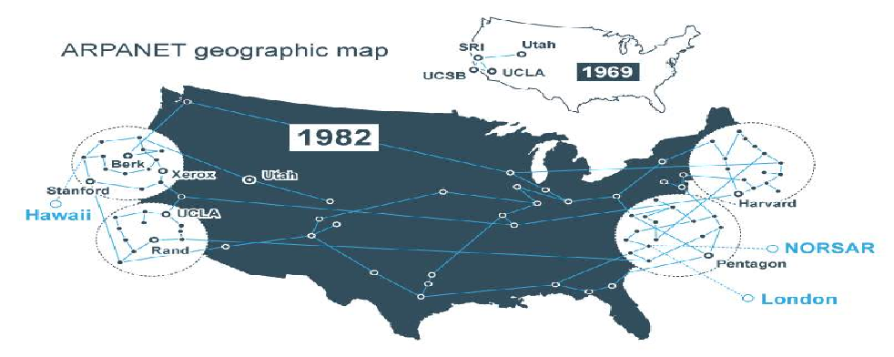

**1983年**，**TCP/IP协议**成为ARPANET的标准协议，因此人们将1983年认为是Internet的诞生时间。

## 第二阶段：建成了三级结构的互联网

从1985 年起，美国国家科学基金会NSF(National Science Foundation)就围绕六个大型计算机中心建设计算机网络，即国家科学基金网NSFNET，它是一个三级计算机网络，分为**主干网、地区网和校园网(或企业网)**。这种三级计算机网络覆盖了全美国主要的大学和研究所，并且成为互联网中的主要组成部分。1991年，NSF和美国的其他政府机构开始认识到，互联网必将扩大其使用范围，不应仅限于大学和研究机构。世界上的许多公司纷纷接入到互联网，网络上的通信量急剧增大，使互联网的容量已满足不了需要。于是美国政府决定将互联网的主干网转交给私人公司来经营,并开始对接入互联网的单位收费。1992 年互联网上的主机超过100 万台。1993 年互联网主干网的速率提高到45 Mbit/s (T3 速率)。

## 第三阶段：逐渐形成了多层次ISP结构的互联网

从1993 年开始，由美国政府资助的NSFNET逐渐被若千个商用的互联网主干网替代，而政府机构不再负责互联网的运营。这样就出现了-一个新的名词：**互联网服务提供者ISP (Internet Service Provider)**。在许多情况下，ISP 就是一个进行商业活动的公司，因此ISP又常译为互联网服务提供商。

例如，中国电信、中国联通和中国移动等公司都是我国最有名的ISP。

- 互联网服务提供者ISP (Internet Service Provider)

  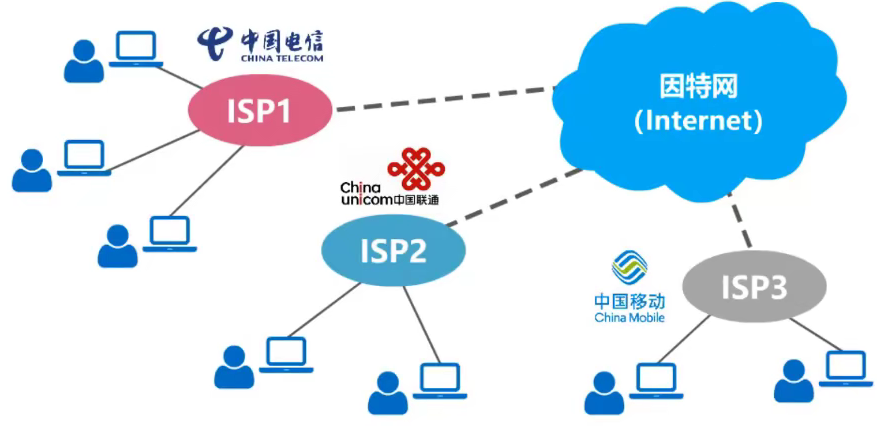

根据提供服务的覆盖面积大小以及所拥有的IP地址数目的不同，ISP也分为不同层次 的ISP：**主干ISP、地区ISP和本地ISP（从层次关系上我们也称为第一层ISP、第二层ISP、本地ISP）**。

- 主干ISP由几个专门的公司创建和维持，服务面积最大(一般都能够覆盖国家范围),并且还拥有高速主干网(例如10 Gbit/s 或更高)。有一些地区ISP网络也可直接与主干ISP相连。
- 地区ISP是一些较小的ISP。这些地区ISP通过-一个或多个主干ISP连接起来。它们位于等级中的第二层，数据率也低一些。
- 本地ISP 给用户提供直接的服务(这些用户有时也称为端用户，强调是末端的用户)。本地ISP可以连接到地区ISP，也可直接连接到主干ISP。 绝大多数的用户都是连接到本地ISP的。本地ISP可以是一个仅仅提供互联网服务的公司，也可以是一个拥有网络并向自己的雇员提供服务的企业，或者是一个运行自己的网络的非营利机构(如学院或大学)。本地ISP可以与地区ISP或主干ISP连接。

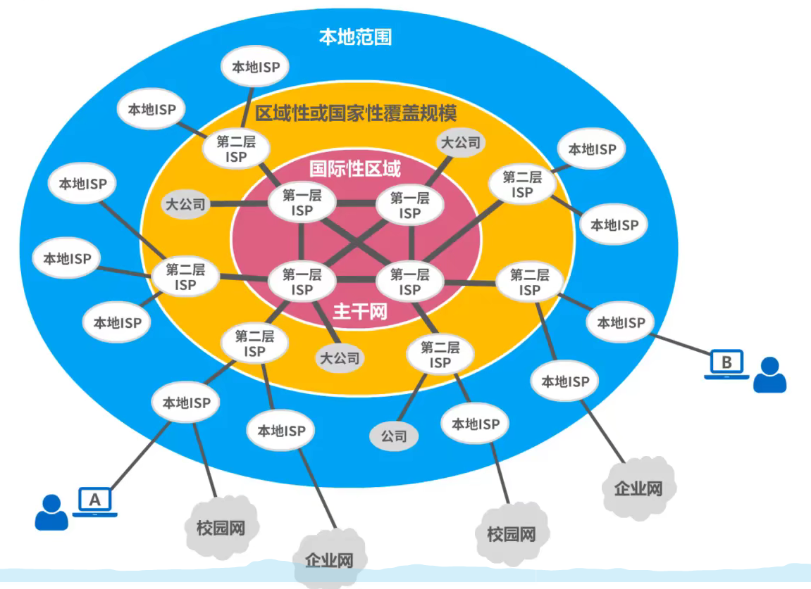

> 说明：因特网发展到今天因为规模太大，已经很难对整个网络的结构给出细致的描述，上图所示的只是一个简单的示意图。

# 3. 因特网的标准化工作

因特网的标准化工作

- 因特网的标准化工作对因特网的发展起到了非常重要的作用。

- 因特网在制定其标准上的一个很大的特点是面向公众。

  - 因特网所有的RFC(Request For Comments)技术文档都可从因特网上免费下载;[http://www.ietf.org/rfc.html]()
  - 任何人都可以随时用电子邮件发表对某个文档的意见或建议。

- 因特网协会ISOC是一个国际性组织，它负责对因特网进行全面管理，以及在世界范围内促进其发展和使用

  - 因特网体系结构委员会IAB,负责管理因特网有关协议的开发;
  - 因特网工程部IETF,负责研究中短期工程问题，主要针对协议的开发和标准化;
  - 因特网研究部IRTF,从事理论方面的研究和开发一些需要长期考虑的问题。

  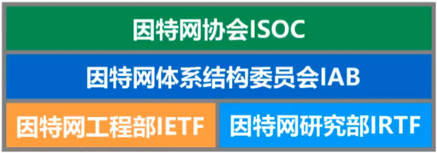

# 4. 因特网的组成

 ## 4.1 功能划分

因特网的拓扑结构虽然非常复杂，并且在地理上覆盖了全球，但从功能上看。可以划分为以下两部分。

* **边缘部分**：由所有连接在互联网上的**主机**组成。这部分是用户**直接使用**的，用来进行**通信**(传送数据、音频或视频)和**资源共享**。
  * 边缘部分中的主机，可以是台或电脑或大型服务器，也可以是笔记本、平板电脑
  * 可以是智能手机、智能手表
  * 物联网智能硬件：智能摄像头等
* **核心部分**：由大量网络和连接这些网络的**路由器**组成。这部分是为边缘部分提供服务的(提供连通性和交换)。

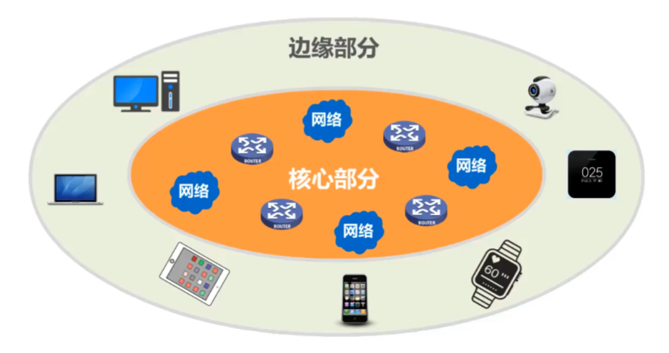

## 4.2 边缘部分

1、处在因特网边缘的部分就是连接在因特网上的所有的主机。这些主机又称为**端系统(end system)**。

2、“主机 A 和主机 B 进行通信”，实际上是指：“运行在主机 A 上的某个程序和运行在主机 B 上的另一个程序进行通信”。

3、即“主机 A 的某个进程和主机 B 上的另一个进程进行通信”。或简称为“计算机之间通信”

4、在网络边缘的端系统中运行的程序之间的通信方式通常可划分为两大类：

### 客户服务器方式（C/S 方式）

即Client/Server方式

- 客户(client)和服务器(server)都是指通信中所涉及的两个**应用进程**
- 客户服务器方式所描述的是进程之间**服务和被服务**的关系。
- 客户是**服务的请求方**，服务器是**服务的提供方**。
- 客户程序必须知道服务器程序的IP地址，不需要特殊的硬件和很复杂的操作系统。
- 服务器程序不需要知道客户程序的IP地址，但是系统需要不断的运行着，并且需要有强大的硬件和高级的操作系统支持。

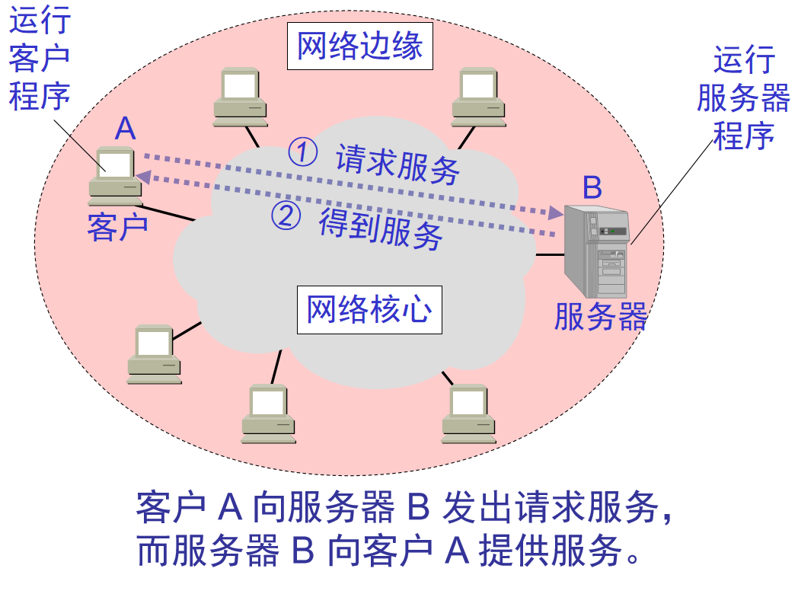

### 对等方式（P2P 方式）

即 Peer-to-Peer方式

- 对等连接(peer-to-peer，简写为 P2P)是指两个主机在通信时并不区分哪一个是服务请求方还是服务提供方。

- 只要两个主机都运行了对等连接软件（P2P 软件），它们就可以进行平等的、对等连接通信。

- 双方都可以下载对方已经存储在硬盘中的共享文档。

- 对等连接方式从本质上看仍然是使用客户服务器方式，只是对等连接中的每一个主机既是客户又同时是服务器。

- 例如主机 C 请求 D 的服务时，C 是客户，D 是服务器。但如果 C 又同时向 F提供服务，那么 C 又同时起着服务器的作用。

- P2P网络技术的特点体现在以下几个方面：

  - 非中心化：网络中的资源和服务分散在所有节点上，信息的传输和服务的实现都直接在节点之间进行，可以无需中间环节和服务器的介入，避免了可能的瓶颈
  - 健壮性：P2P架构天生具有耐攻击、高容错的优点。由于服务是分散在各个节点之间进行的，部分节点或网络遭到破坏对其它部分的影响很小。
  - 高性价比：性能优势是P2P被广泛关注的一个重要原因。采用P2P架构可以有效地利用互联网中散布的大量普通结点，将计算任务或存储资料分布到所有节点上。利用其中闲置的计算能力或存储空间，达到高性能计算和海量存储的目的。
  - 隐私保护：在P2P网络中，由于信息的传输分散在各节点之间进行而无需经过某个集中环节，用户的隐私信息被窃听和泄漏的可能性大大缩小。

  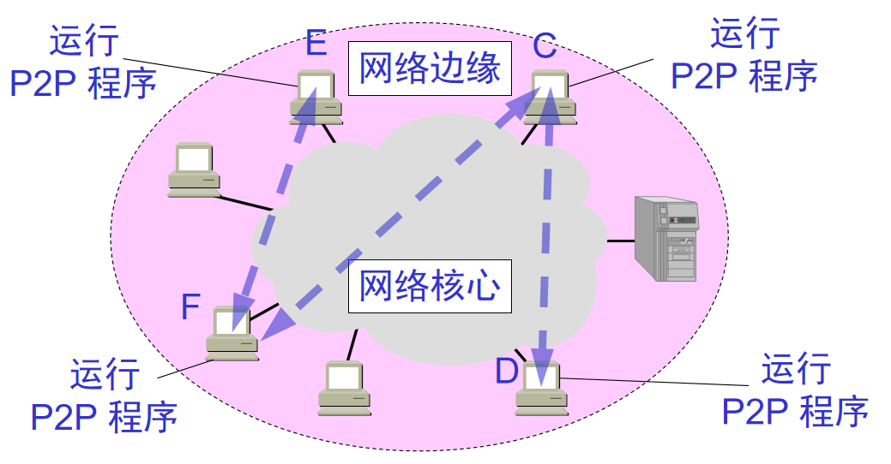

## 4.3 核心部分

1、在网络核心部分起特殊作用的是**路由器(router)**。

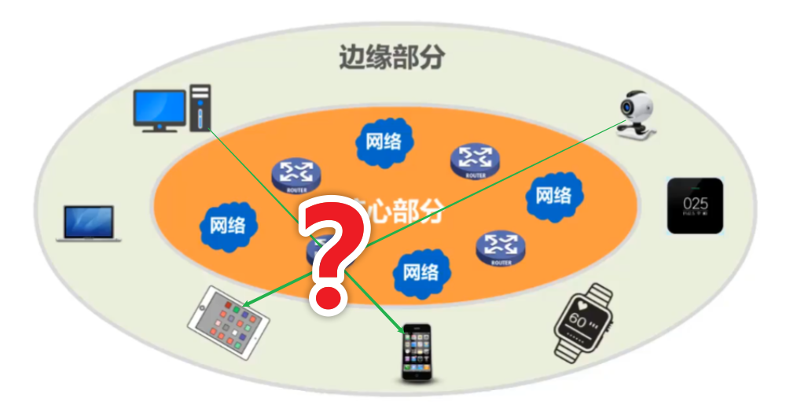

2、三种交换方式

- 电路交换(Circuit Switching)：**电话交换机接通电话线的方式称为电路交换;**

  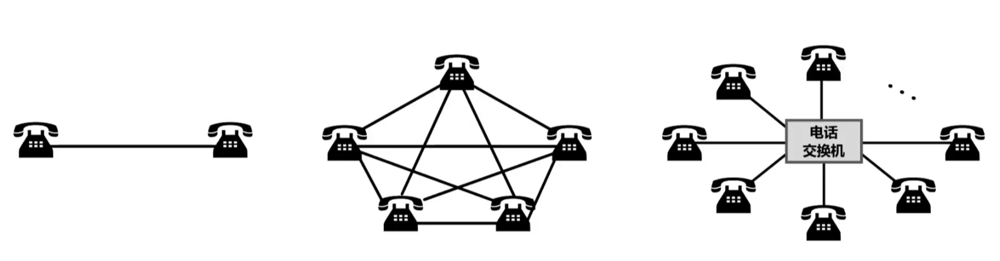

电话交换机：可以把电话交换机简单地看成是一个有多个开关的开关器，可以将需要通信的任意两部电话的电话线路按需接通，从而大大减少了连接的电话线数量

从通信资源的分配角度来看，交换(Switching)就是按照某种方式动态地分配传输线路的资源;

电路交换的三个步骤:

- **建立连接**（分配通信资源)
- **通话**（一直占用通信资源)
- **释放连接**（归还通信资源)

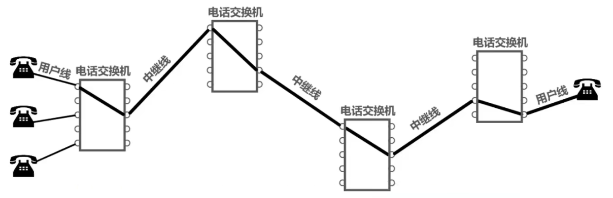

**电路交换的缺点**：当用户正在输入和编辑一份待传输的文件时，用户所与用的通信资源暂时未被利用，该通信资源也不能被其他用户利用，宝贵的线路资源就被白白浪费掉了，因此**电路交换的传输效率非常低，不适用于计算机和计算机之间的通信。**

- 分组交换(Packet Switching)：**路由器**是实现分组交换(packet switching)的关键构件，其任务是**转发收到的分组**，这是网络核心部分最重要的功能

  - 分组交换则采用**存储转发**技术。如下图所示，**把一个报文划分为几个分组后再进行传送**。通常我们把要发送的整块数据称为一个**报文(message)**。在发送报文之前，先把较长的报文划分成为一个个更小的等长数据段，例如，每个数据段为1024**bit（比特）**。在每一个数据段前面，加上一些由必要的控制信息组成的**首部(header)**后，就构成了一个**分组(packet)**。分组又称为“**包**”，而分组的首部也可称为“**包头**”。分组是在互联网中传送的数据单元。分组中的“首部”是非常重要的，正是由于分组的首部包含了诸如目的地址和源地址等重要控制信息，每一个分组才能在互联网中独立地选择传输路径，并被正确地交付到分组传输的终点。

  - 分组交换过程

    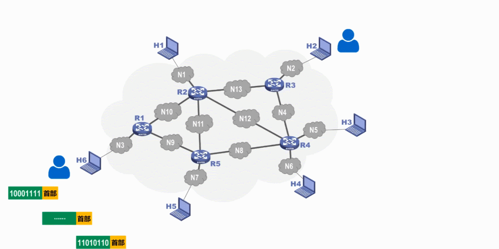

  - 分组交换的特点：构成原始报文的一个个分组在各结点路由器上进行存储转发，并且可以进行差错校验，保证报文的完整性和准确性。

    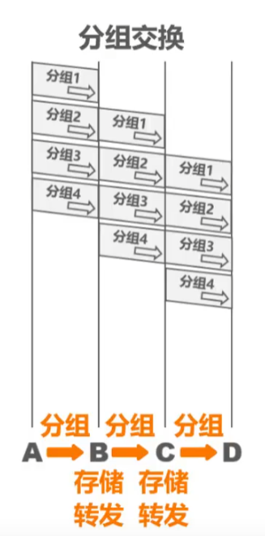

    

  - **说明：分组交换过程中可能会出现分组丢失、重复等问题在后面的章节会详细介绍**

- **报文交换(Message Switching)**

  - 整个报文先传送到相邻结点，全部存储下来后查找转发表，转发到下一个节点

  - 对报文的大小不做限制，因此对接收报文的设备缓存空间有要求

    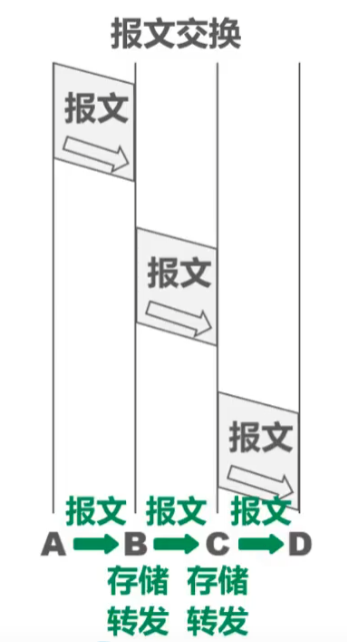

- 三种交换方式的对比

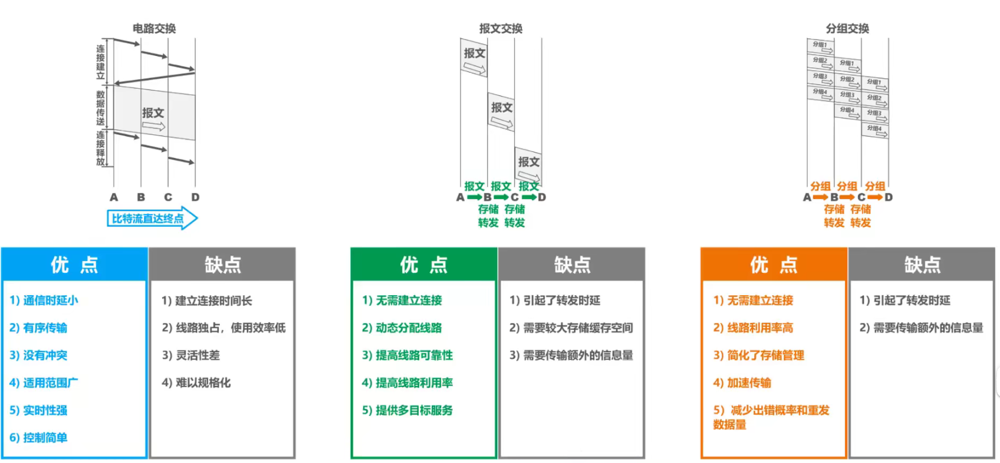

# 5 计算机网络的分类

## 5.1 按照网络的作用范围进行分类

### 1、**广域网WAN（Wide Area Network）**

广域网的作用范围通常为几十到几千公里，因而有时也称为远程网(long haul network)。

**广域网是互联网的核心部分，其任务是通过长距离（例如，跨越不同的国家）运送主机所发送的数据**。连接广域网各结点交换机的链路一般都是高速链路，具有较大的通信容量。

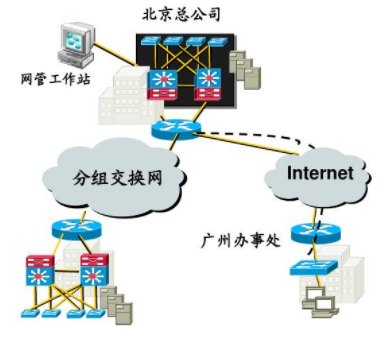

### 2、城域网MAN（Metropolitan Area Network）

城域网的作用范围一般是一个城市，可跨越几个街区甚至整个城市，其作用距离约为5 ~50 km。城域网可以为一个或几个单位所拥有，但也可以是一种公用设施，用来将多个局域网进行互连。目前很多城域网采用的是以太网技术，因此有时也常并入局域网的范围进行讨论。

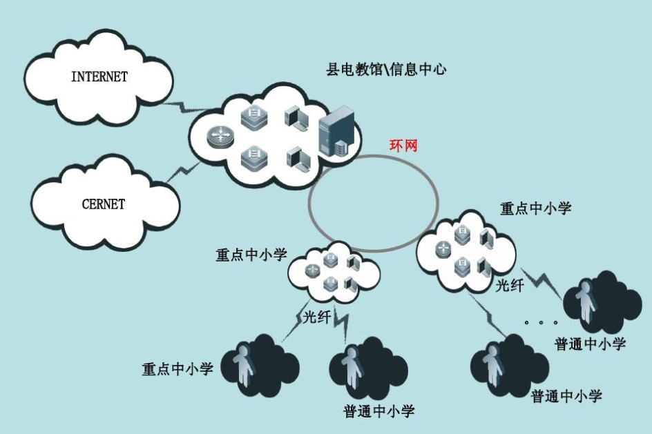

### 3.**局域网LAN（Local Area Network**）

局域网一般用微型计算机或工作站通过高速通信线路相连（速率通常在10 Mbit/s 以上)，但地加士A个局城网，但现在局域网已非常右)。在局域网发展的初期，一个学校或工厂往往只拥有一个局域网，但现在局域网已非常广泛地使用，学校或企业大都拥有许多个互连的局域网（这样的网络常称为校园网或企业网)。

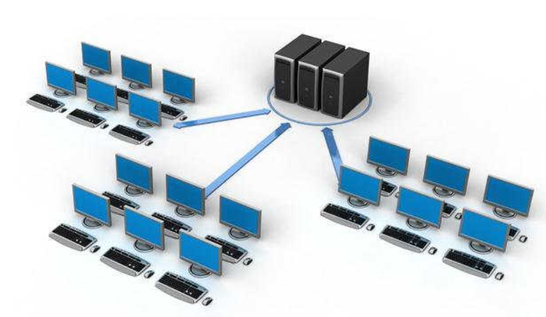

### 4.个人区域网PAN（Personal Area Network）

个人区域网就是在个人工作的地方把属于个人使用的电子设备（如便携式电脑等）用无线技木连接起来，其范围很小，大约在10 m左右。

