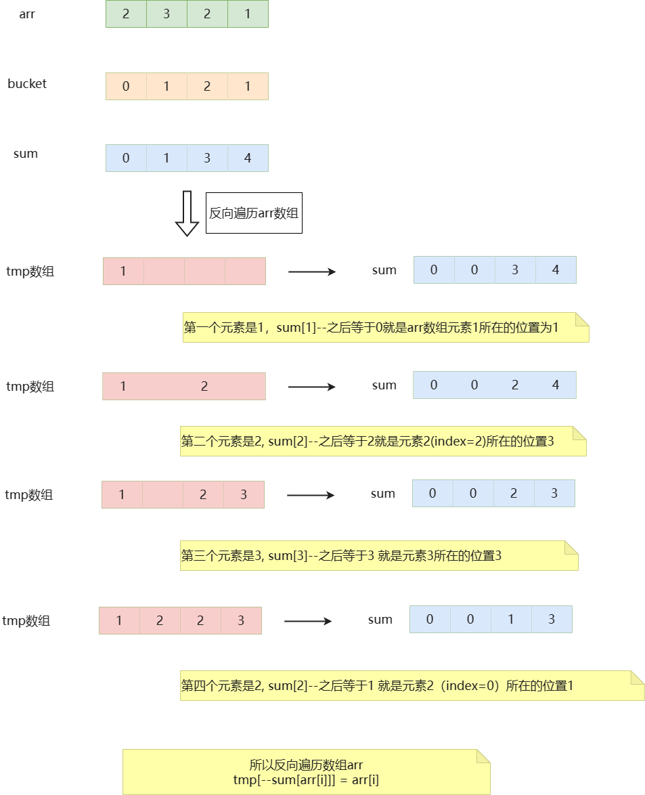

# 常见的排序算法
- 冒泡排序
- 选择排序
- 插入排序
- 希尔排序
- 归并排序
- 快速排序
- 堆排序
- 计数排序
- 桶排序
- 基数排序

\


**名词解释：**
- n：数据规模
- k："桶"的个数
- In-place：占用常数内存，不占用额外内存
- Out-place：占用额外内存
- 稳定性：<font color='red'>**排序后 2 个相等键值的顺序和排序之前它们的顺序相同**</font>


## 排序算法宋词记忆法
选泡插
快归堆希统计基
恩方恩老恩一三
对恩加K恩乘K
不稳稳稳不稳稳
不稳不稳稳稳稳


# 如何写算法程序

- 由简单到复杂
  - 验证一步走一步
  - 多打印中间结果
- 先局部后整理
  - 没思路时先细分
- 先粗糙后精细
  - 变量更名
  - 语句合并
  - 便捷处理

# 十大排序算法

## 选择排序

选择排序是一种简单直观的排序算法，无论什么数据进去都是 O(n²) 的时间复杂度。所以用到它的时候，数据规模越小越好。唯一的好处可能就是不占用额外的内存空间了吧。

最简单但是最没用的排序算法，也有优化空间

### 定义

在无序区里找一个最小的元素跟在有序区的后面。

### 步骤
- 首先在未排序中找到最小（大）元素，存放在排序序列的起始位置（通过交换）。
- 再从剩余未排序元素中继续寻找最小（大）元素，然后放到已排序序列的末尾。
- 重复第二步，直到所有元素均排序完毕。 

### 动画演示


### 代码实现

先拆分

**第一步：先写交换**
```java
private static void swap(int[] arr, int i, int j) {
    int tmp = arr[j];
    arr[j] = arr[i];
    arr[i] = tmp;
}
```

**第二步：查找最小元素**
我们跟数组的第一个元素比较，从第二个元素起，查找比第一个元素小的元素，记录其下表位置
```java
int minPos = 0;
for (int i = 0; i < arr.length;i++>) {
    if (arr[i] < arr[minPos]>) {
        minPos = i;
    }
}
```

当跟第一个元素比较完之后，需要跟第二个元素比较，需要跟每个元素比较，所以再来一个for循环

```java
public void selectSort(int[] arr) {
    for (int i = 0; i < arr.length; i++) {
        int minPos = i;

        for (int j = i + 1; j < arr.length; j++) {
            if (arr[j] < arr[minPos]) {
                minPos = j;
            }
        }
        // 交换
        swap(arr, i, minPos);

        print(arr);
    }
}

public void swap(int[] arr, int i, int j) {
    int tmp = arr[j];
    arr[j] = arr[i];
    arr[i] = tmp;
}

void print(int[] arr) {
    System.out.println(Arrays.toString(arr));
}
```

先不考虑边界问题，验证没问题之后，我们在考虑边界问题。
我们之后，内层循环查找最小元素，是从外层循环的下一个元素开始的，所以，外层循环 i 的条件可以改为
`i < arr.length - 1`

**最终代码：**
```java
public void selectSort(int[] arr) {
    // 总共要经过 n -1 轮比较
    for (int i = 0; i < arr.length - 1; i++) {
        int minPos = i; // 记录最小数的索引
        // 每轮需要比较的次数 n - i
        for (int j = i + 1; j < arr.length; j++) {
            if (arr[j] < arr[minPos]) {
                minPos = j;
            }
        }
        // 交换
        swap(arr, i, minPos);
    }
}

public void swap(int[] arr, int i, int j) {
    int tmp = arr[j];
    arr[j] = arr[i];
    arr[i] = tmp;
}
```

### 验证算法 - 对数器
- 肉眼观察
- 产生足够多随机样本
- 用确定正确的算法计算样本结果
- 对比被验证算法的结果

肉眼观察是基础，肉眼观察都不通过，说明程序肯定不正确。肉眼观察正确，程序也可能会有BUG，所以需要进一步进行测试验算


```java
import java.util.Arrays;
import java.util.Random;

public class DataCheck {

    static int[] generateRandomArray() {
        Random r = new Random();
        int[] arr = new int[10000];

        for (int i = 0; i < arr.length; i++) {
            arr[i] = r.nextInt(10000);
        }
        return arr;
    }


    static void check() {
        int[] arr = generateRandomArray();
        // 复制一份，跟原始数据区分开，修改arr2不影响arr元素
        int[] arr2 = arr.clone();

        // 用系统自带正确的算法
        Arrays.sort(arr);
        // 调用自己写的程序
        SelectSort.selectSort(arr2);

        // 结果检查

        for (int i = 0; i < arr.length; i++) {
            if (arr[i] != arr2[i]) {
                System.out.println("第 " + i + "个数不一样，正确的是：" + arr[i] + ", 实际是: " + arr2[i]);
                break;
            }
        }
    }


    public static void main(String[] args) {
        // 加个循环，多验证几次
        for (int i = 0; i < 1000; i++) {
            check();
        }
    }
}
```


### 算法优化
我们每次是找出最小元素的索引位置，然后进行交换。
改成每次找出最大元素和最小元素两个索引位置，然后进行交换

分析：

**1. 交换方法不变**
> 交换方法不变，但是这里是两次交换，第一交换可能会影响第二次交换。如
```java
int minPos = left, maxPos = arr.length - 1;
...
swap(arr, left, minPos);
swap(arr, right, maxPos == left ? minPos : maxPos);
```
两次交换，第二次交换要加个判断。如 arr = {8, 3, 6, 5, 2, 7, 4, 1}。

我们遍历一次得 minPos = 7, maxPos = 0

刚好第一个元素是最大值，最后一个元素是最小值，第一次交换，把第一个元素改成最小值了，此时最大值就跑到最后一个了，最大值的索引发生了变化

**2. 遍历数组，查找最大值和最小值**
```java
for (int j = left; j <= right; j++) {
    if (arr[j] < arr[minPos]) {
        minPos = j;
    }

    if (arr[j] > arr[maxPos]) {
        maxPos = j;
    }
}
```
遍历一定要包括left 和 right。我们知道只查找最小值，我们是从 i + 1开始，但是这里不能从left + 1开始，如果从left + 1开始，那么查找最大值时就没有和起始值`arr[left]` 比较

同理如果不包括right，那么查找最小值的时候，就没有和起始`arr[right]`比较

所以，综上所述，最终代码：

```java
public void selectSort(int[] arr) {
    int n = arr.length;

    int left = 0, right = n - 1;

    while (left <right) {
        int minPos = left, maxPos = right;
        for (int j = left; j <= right; j++) {
            if (arr[j] < arr[minPos]) {
                minPos = j;
            }

            if (arr[j] > arr[maxPos]) {
                maxPos = j;
            }
        }

        // 交换tmp
        swap(arr, left, minPos);
        swap(arr, right, maxPos == left ? minPos : maxPos);

        left++;
        right--;
    }
}
```

写完记得用上面的DataCheck验证下

## 冒泡排序

冒泡排序（Bubble Sort）也是一种简单直观的排序算法。它重复地走访过要排序的数列，一次比较两个元素，如果他们的顺序错误就把他们交换过来。走访数列的工作是重复地进行直到没有再需要交换，也就是说该数列已经排序完成。这个算法的名字由来是因为越小的元素会经由交换慢慢"浮"到数列的顶端。

作为最简单的排序算法之一，冒泡排序给我的感觉就像 Abandon 在单词书里出现的感觉一样，每次都在第一页第一位，所以最熟悉。

**冒泡排序还有一种优化算法，就是立一个 flag，当在一趟序列遍历中元素没有发生交换，则证明该序列已经有序。**但这种改进对于提升性能来说并没有什么太大作用。

### 1. 算法步骤

比较相邻的元素。如果第一个比第二个大，就交换他们两个。

对每一对相邻元素作同样的工作，从开始第一对到结尾的最后一对。这步做完后，最后的元素会是最大的数。

针对所有的元素重复以上的步骤，除了最后一个。

持续每次对越来越少的元素重复上面的步骤，直到没有任何一对数字需要比较。


### 2. 动图演示


### 3. 代码实现

第一步，先写两两比较移动元素到后面

```java
int[] arr = {5, 3, 6, 8, 1, 7, 9, 4, 2};
// 注意边界，我们下面使用的是 j + 1，所以这里要len - 1
for (int j = 0; j < 9 - 1; j++) {
    if (arr[j] > arr[j + 1]) {
        swap(arr, j, j + 1);
    }
}
```

分析，这是第一次，j < 8，按照我们分析的图，第二次，j < 7，因为最后一个已经是最大的，不需要在进行比较。

所以 最外层循环 i 应该递减， i 从 arr.length - 1 开始

内层循环 j < i

```java
for (int i = arr.length - 1; i > 0; i--) {
    for (int j = 0; j < i; j++) {
        if (arr[j] > arr[j + 1]) {
            swap(arr, j, j + 1);
        }
    }
}
```

完成代码：

```java
public static void sort(int[] arr) {
    for (int i = arr.length - 1; i > 0; i--) {
        for (int j = 0; j < i; j++) {
            if (arr[j] > arr[j + 1]) {
                swap(arr, j, j + 1);
            }
        }
    }
}
```

### 代码优化

冒泡排序最快的情况是 O(n²)，最好的情况是O(n)

按照我们上面的写法，怎么也不可能达到O(n)

那怎么优化，使其在最好的情况下是O(n)？

> 如果一开始就是排好序的，没有交换一次，那么我们直接提前退出，这样就只循环了一次

```java
public static void sort2(int[] arr) {
    // 优化，使其最好的情况下可以达到O(n)
    for (int i = arr.length - 1; i > 0; i--) {
        boolean flag = true;
        for (int j = 0; j < i; j++) {
            if (arr[j] > arr[j + 1]) {
                flag = false;
                swap(arr, j, j + 1);
            }
        }
        if (flag) {
            break;
        }
    }
}
```

## 插入排序

插入排序的代码实现虽然没有冒泡排序和选择排序那么简单粗暴，但它的原理应该是最容易理解的了，因为只要打过扑克牌的人都应该能够秒懂。插入排序是一种最简单直观的排序算法，它的工作原理是通过构建有序序列，对于未排序数据，在已排序序列中从后向前扫描，找到相应位置并插入。

插入排序和冒泡排序一样，也有一种优化算法，叫做拆半插入。


### 1. 算法步骤
将第一待排序序列第一个元素看做一个有序序列，把第二个元素到最后一个元素当成是未排序序列。

从头到尾依次扫描未排序序列，将扫描到的每个元素插入有序序列的适当位置。（如果待插入的元素与有序序列中的某个元素相等，则将待插入元素插入到相等元素的后面。）

### 2. 动图演示


### 代码实现

**第一步：先实现插入的部分**

`int[] arr = {3, 5, 6, 8, 1, 7, 9, 4, 2};`

我们选择第5个元素 1，1 前面的元素已经是有序的，我们现在需要 1 跟它前面的元素比较，找到合适的位置，插入进去，就像打牌一样，插排。

但是数组不能直接插入，数据是连续的内存空间，我们需要移动数组中的元素，这里我们使用交换位置。

```java
for (int j = 4; j > 0; j--) {
    if (arr[j] < arr[j - 1]) {
        swap(arr, j, j - 1);
    }
}
```

**第二步：循环选择要插入的牌**

第一步我们选择的是第5个元素。现在我们需要在外层加个循环，一次选择 [1, arr.length] 个元素进行操作

```java
 // 外层循环，选择一个数，从第二个数开始
for (int i = 1; i < arr.length; i++) {
    // 内层循环，跟i前面的数比较，找到合适的位置，然后插入
    for (int j = i; j > 0; j--) {
        if (arr[j] < arr[j - 1]) {
            swap(arr, j, j - 1);
        }
    }
}
```


**最终代码：**

```java
public static void sort(int[] arr) {
    // 外层循环，选择一个数，从第二个数开始
    for (int i = 1; i < arr.length; i++) {
        // 内层循环，跟i前面的数比较，找到合适的位置，然后插入
        for (int j = i; j > 0; j--) {
            if (arr[j] < arr[j - 1]) {
                swap(arr, j, j - 1);
            }
        }
    }
}
```


上面我们插入的方式是选择交换位置，一次跟要插入的牌比较，然后交换位置。

**修改算法，用临时变量记录标记相，去掉swap**


```java
public static void sort2(int[] arr) {
    // 内层循环，跟i前面的数比较，找到合适的位置，然后插入
    for (int i = 1; i < arr.length; i++) {
        // 记录要插入的数据
        int tmp = arr[i];
        int j = i;
        while (j > 0 && tmp < arr[j - 1]) {
            arr[j] = arr[j - 1];
            j--;
        }

        if (j != i) {
            // 说明前面存在比 arr[i] 还小的数
            arr[j] = tmp;
        }
    }
}
```

**补充说明：**

插入排序最好的情况下时间负载度是O(n)

按照我们第一种情况，交换位置的方式是不可能，第二种方式是可以的。

当数组本身就是有顺序的，内层循环只需要循环一次就可以了，完成循环是 n - 1 次，所以总体循环就是 n - 1次。即时间复杂度是 O(n)


## 简单算法总结

- 冒泡：
  - 基本不用，太慢（最坏的情况下是O(n²)）
- 选择：
  - 基本不用，不稳定
- 插入：
  - 样本小且基本有序的时候效率比较高


## 希尔排序

希尔排序，也称递减增量排序算法，是插入排序的一种更高效的改进版本。但希尔排序是**非稳定**排序算法。

希尔排序是基于插入排序的以下两点性质而提出改进方法的：

插入排序在对几乎已经排好序的数据操作时，效率高，即可以达到线性排序的效率；
但插入排序一般来说是低效的，因为插入排序每次只能将数据移动一位；
希尔排序的基本思想是：先将整个待排序的记录序列分割成为若干子序列分别进行直接插入排序，待整个序列中的记录"基本有序"时，再对全体记录进行依次直接插入排序。

通俗点就是选择一个间隔数gap，将数组中经过间隔数的元素按照插入排序排一下。


我们选定一个gap之后，按照插入排序排好序之后。在缩小间隔gap的值，在按照插入排序排好序，最后要保证我们选择了间隔gap=1的进行插入排序

**那么这种算法怎么比插入排序快？**

分析一下，插入排序可以理解为是间隔为1的希尔排序。但是插入排序，需要每个元素的进行交换或移动位置，而希尔排序只是间隔点上的元素进行交换，**减少了交换次数**

插入排序，只有当本身有序的时候，时间复杂度是O(n)，也就是0次交换。希尔排序，经过很多次间隔排序了之后，在进行间隔为1的插入排序的时候，**要移动的距离比较短**。

<font color='red'>总结：间隔大时，移动次数比较少。间隔比较小的，移动距离比较短。</font>

> 

### 1. 算法步骤
选择一个增量序列 t1，t2，……，tk，其中 ti > tj, tk = 1；

按增量序列个数 k，对序列进行 k 趟排序；

每趟排序，根据对应的增量 ti，将待排序列分割成若干长度为 m 的子序列，分别对各子表进行直接插入排序。仅增量因子为 1 时，整个序列作为一个表来处理，表长度即为整个序列的长度。

### 2. 动图演示


### 3. 代码实现

我们知道插入排序实际上就是间隔为1的希尔排序

我们先写间隔为4的代码实现

```java
// 插入排序，是间隔为1
public static void sort(int[] arr) {
    int gap = 4;
    for (int i = 1; i < arr.length; i++) {
        for (int j = i; j > 0; j--) {
            if (arr[j] < arr[j - 1]) {
                swap(arr, j, j - 1);
            }
        }
    }
}

/**  改造插入排序   */

public static void sort(int[] arr) {
    int gap = 4;
    for (int i = gap; i < arr.length; i++) {
        for (int j = i; j > gap - 1; j-=gap) {
            if (arr[j] < arr[j - gap]) {
                swap(arr, j, j - gap);
            }
        }
    }
}
```

然后缩短 gap的值，知道最后为1

```java
public static void sort(int[] arr) {
    int gap = 4;
    // k 每次间隔 / 2
    for (int k = gap; k > 0; k /= 2) {
        for (int i = k; i < arr.length; i++) {
            for (int j = i; j > k - 1; j -= k) {
                if (arr[j] < arr[j - k]) {
                    swap(arr, j, j - k);
                }
            }
        }
    }
}
```

**那么问题来了，我这个间隔初始值，设置多少合适呢？**

我们，很容易想到的就是二分法。假设arr的长度为8，
第一次 -> gap = 8
第二次 -> gap = 8 / 2 = 4
第三次 -> gap = 4 / 2 = 2
第四次 -> gap = 2 / 2 = 1

于是就有了下面代码

```java
public static void sort(int[] arr) {
    for (int gap = arr.length; gap > 0; gap /= 2) {
        for (int i = gap; i < arr.length; i++) {
            for (int j = i; j > gap - 1; j -= gap) {
                if (arr[j] < arr[j - gap]) {
                    swap(arr, j, j - gap);
                }
            }
        }
    }
}
```

那么这个效率一定是最高的，答案并不是

### Knuth序列

Donald Knuth 计算机科学家提出的

- h = 1
- h = 3 * h + 1


当间隔h满足 3 * h + 1的时候效率最高。为O(n^1.3)

代码实现

```java
public static void sort(int[] arr) {
    // 计算最大的 h，knuth序列中 h = 3 * h + 1  => h <= arr.length / 3
    int h = 1;
    while (h <= arr.length / 3) {
        h = h * 3 + 1;
    }
    // 由 h = 3 * h + 1 => h = (h - 1) / 3
    for (int gap = h; gap > 0; gap = (gap - 1) / 3) {
        for (int i = gap; i < arr.length; i++) {
            for (int j = i; j > gap - 1; j -= gap) {
                if (arr[j] < arr[j - gap]) {
                    swap(arr, j, j - gap);
                }
            }
        }
    }
}
```

## 归并排序

归并排序（Merge sort）是建立在归并操作上的一种有效的排序算法。该算法是采用分治法（Divide and Conquer）的一个非常典型的应用。

作为一种典型的分而治之思想的算法应用，归并排序的实现由两种方法：

- 自上而下的递归（所有递归的方法都可以用迭代重写，所以就有了第 2 种方法）；
- 自下而上的迭代；

**和选择排序一样，归并排序的性能不受输入数据的影响，但表现比选择排序好的多，因为始终都是 O(nlogn) 的时间复杂度。代价是需要额外的内存空间。**

归并排序主要的连个点一个是递归，一个是合并，递归就不多说，下面看看两个数组合并的过程

首先要确保两个数组都是已经有序


### 1. 算法步骤

- 申请空间，使其大小为两个已经排序序列之和，该空间用来存放合并后的序列；

- 设定两个指针，最初位置分别为两个已经排序序列的起始位置；

- 比较两个指针所指向的元素，选择相对小的元素放入到合并空间，并移动指针到下一位置；

- 重复步骤 3 直到某一指针达到序列尾；

- 将另一序列剩下的所有元素直接复制到合并序列尾。

### 2. 动图演示


### 3. 代码实现

我们先写两个已经有序的数组合并

**第一种写法：直接传个arr**

```java
// 如：int[] arr = {1, 4, 7, 8, 3, 6, 9};
public static int[] merge(int[] arr) {
    int mid = arr.length / 2;

    int i = 0;
    int j = mid + 1;
    int k = 0;

    int[] tmp = new int[arr.length];

    while (i <= mid && j < arr.length) {
        // 注意，这里要用=，这样排序出来的才是稳定的，因为归并排序是稳定的。所以我们这里使用 <=
        if (arr[i] <= arr[j]) {
            tmp[k] = arr[i];
            i++;
        } else {
            tmp[k] = arr[j];
            j++;
        }
        // 不管怎么样，k都要++
        k++;
    }

    // 当排序完之后，看下两边是否有剩余的，如果有，直接加到后面。
    while (i <= mid) {
        tmp[k++] = arr[i++];
    }

    while (j < arr.length) {
        tmp[k++] = arr[j++];
    }

    return tmp;
}
```

**第二种写法：传两个数组 left 和 right**

```java
// 如：int[] left = {1, 4, 7, 8};
//     int[] right = {3, 6, 9};
public static int[] merge(int[] left, int[] right) {
    int[] tmp = new int[left.length + right.length];
    int i = 0;
    int j = 0;
    int k = 0;
    while (i < left.length && j < right.length) {
        if (left[i] <= right[j]) {
            tmp[k++] = left[i++];
        } else {
            tmp[k++] = right[j++];
        }
    }

    while (i < left.length) {
        tmp[k++] = left[i++];
    }

    while (j < right.length) {
        tmp[k++] = right[j++];
    }

    return tmp;
}
```


下面继续实现，讲一个数组继续二分，一直二分，直到只有一个元素，只有一个元素，肯定是有序的。

```java
public static void sort(int[] arr, int left, int right) {
    if (left == right) {
        return;
    }
    // 分成两半
    // 因为left 和 right都是int类型。直接这样写 (right + left) / 2可能会溢出，这里这样写就是为了防止溢出
    int mid = left + (right - left) / 2;

    sort(arr, left, mid);
    sort(arr, mid + 1, right);

    merge(arr, left, mid + 1, right);
}

/**
    * 因为最指针指的就是左边界，右指针指的是中间，所以需要一个边界
    * @param arr 数组
    * @param left 左指针（左边界）
    * @param right 右指针
    * @param rightBound  右边界
    * @return
    */
public static void merge(int[] arr, int left, int right, int rightBound) {

    int mid = right - 1;

    int[] tmp = new int[rightBound - left + 1];

    int i = left;
    int j = right;
    int k = 0;

    while (i <= mid && j <= rightBound) {
        // 注意，这里要用=，这样排序出来的才是稳定的，因为归并排序是稳定的。所以我们这里使用 <=
        if (arr[i] <= arr[j]) {
            tmp[k] = arr[i];
            i++;
        } else {
            tmp[k] = arr[j];
            j++;
        }
        // 不管怎么样，k都要++
        k++;
    }

    // 当排序完之后，看下两边是否有剩余的，如果有，直接加到后面。
    while (i <= mid) {
        tmp[k++] = arr[i++];
    }

    while (j <= rightBound) {
        tmp[k++] = arr[j++];
    }

    // 将排好序的数组，赋值给arr
    System.arraycopy(tmp, 0, arr, left, tmp.length);
}
```

或者

```java
 public static int[] sort(int[] arr) {
    // 退出条件
    if (arr.length < 2) {
        return arr;
    }
    int mid = (int) Math.floor(arr.length / 2);
//        int[] left = new int[mid];
//        int[] right = new int[arr.length - mid];
//
//        System.arraycopy(arr, 0, left, 0, left.length);
//        System.arraycopy(arr, mid, right, 0, right.length);
    // 或者

    int[] left = Arrays.copyOfRange(arr, 0, mid);
    int[] right = Arrays.copyOfRange(arr, mid, arr.length);

    return merge(sort(left), sort(right));
}


public static int[] merge(int[] left, int[] right) {
    int[] tmp = new int[left.length + right.length];
    int i = 0;
    int j = 0;
    int k = 0;
    while (i < left.length && j < right.length) {
        if (left[i] <= right[j]) {
            tmp[k++] = left[i++];
        } else {
            tmp[k++] = right[j++];
        }
    }

    while (i < left.length) {
        tmp[k++] = left[i++];
    }

    while (j < right.length) {
        tmp[k++] = right[j++];
    }

    return tmp;
}
```

**注意：写完一定要用DataCheck类检测下**


**时间复杂度**

整个数组一直二分，总共分类 log₂ⁿ，每一次比较交换大约n次。所以时间复杂度就是O(nlog₂ⁿ)，通常写成 O(nlogⁿ)

### 4. java中对象的比较

**对象比较需要稳定，使用的是归并排序，归并排序就是稳定的**

看下Arrays.sort()的源码

如果只是排数组，使用的是快排

```java
public static void sort(int[] a) {
    // 双轴快排
    DualPivotQuicksort.sort(a, 0, a.length - 1, null, 0, 0);
}
```

那么Dual-Pivot快排到底是怎么样的一个排序算法呢？其实从它的名字里面可以看出一些端倪：在经典快排里面有一个pivot的概念，它是用来分隔大数和小数的 -- 这个pivot把一个数组分成两份。那么所谓的Dual-Pivot其实就是用两个Pivot, 把整个数组分成三份。


参考链接：https://www.jianshu.com/p/2c6f79e8ce6e

再看对象排序的源码

```java
public static <T> void sort(T[] a, Comparator<? super T> c) {
    if (c == null) {
        sort(a);
    } else {
        if (LegacyMergeSort.userRequested)
           // 遗留的归并排序。兼容1.6之前旧版本，采用的是插入排序和归并排序
            legacyMergeSort(a, c);
        else
            TimSort.sort(a, 0, a.length, c, null, 0, 0);
    }
}

```

看下 legacyMergeSort 的源码

```java
private static <T> void legacyMergeSort(T[] a, Comparator<? super T> c) {
    T[] aux = a.clone();
    if (c==null)
        mergeSort(aux, a, 0, a.length, 0);
    else
        mergeSort(aux, a, 0, a.length, 0, c);
}

private static void mergeSort(Object[] src,
                                Object[] dest,
                                int low, int high, int off,
                                Comparator c) {
    int length = high - low;

    // Insertion sort on smallest arrays
    // 长度小于7，使用插入排序
    if (length < INSERTIONSORT_THRESHOLD) {
        for (int i=low; i<high; i++)
            for (int j=i; j>low && c.compare(dest[j-1], dest[j])>0; j--)
                swap(dest, j, j-1);
        return;
    }

    // Recursively sort halves of dest into src
    // 利用分治思想，进行拆分，递归调用插入排序
    int destLow  = low;
    int destHigh = high;
    low  += off;
    high += off;
    int mid = (low + high) >>> 1;
    mergeSort(dest, src, low, mid, -off, c);
    mergeSort(dest, src, mid, high, -off, c);

    // If list is already sorted, just copy from src to dest.  This is an
    // optimization that results in faster sorts for nearly ordered lists.
    // 合并相邻两个已排好的部分，若左边最大的  小于  右边最小的，
    // 说明数组已经排好顺序，直接拷贝
    if (c.compare(src[mid-1], src[mid]) <= 0) {
        System.arraycopy(src, low, dest, destLow, length);
        return;
    }

    // Merge sorted halves (now in src) into dest
    // 进行归并排序，
    for(int i = destLow, p = low, q = mid; i < destHigh; i++) {
        if (q >= high || p < mid && c.compare(src[p], src[q]) <= 0)
            dest[i] = src[p++];
        else
            dest[i] = src[q++];
    }
}
```

`TimSort.sort()` 是改进的归并排序

我们这些的是将一个数组分成两半，而TimSort是一上来就将数组分成N 半，然后这N半，两两合并。

```java
/**
    * Sorts the given range, using the given workspace array slice
    * for temp storage when possible. This method is designed to be
    * invoked from public methods (in class Arrays) after performing
    * any necessary array bounds checks and expanding parameters into
    * the required forms.
    *
    * @param a the array to be sorted
    * @param lo the index of the first element, inclusive, to be sorted
    * @param hi the index of the last element, exclusive, to be sorted
    * @param c the comparator to use
    * @param work a workspace array (slice)
    * @param workBase origin of usable space in work array
    * @param workLen usable size of work array
    * @since 1.8
    */
static <T> void sort(T[] a, int lo, int hi, Comparator<? super T> c,
                        T[] work, int workBase, int workLen) {
    assert c != null && a != null && lo >= 0 && lo <= hi && hi <= a.length;

    int nRemaining  = hi - lo;
    if (nRemaining < 2)
        return;  // Arrays of size 0 and 1 are always sorted

    // If array is small, do a "mini-TimSort" with no merges
    // 这个 MIN_MERGE = 32
    if (nRemaining < MIN_MERGE) {
        int initRunLen = countRunAndMakeAscending(a, lo, hi, c);
        // 这里是二分插入，我们知道插入排序，选择一个牌是跟之前的数组一个一个区找，这里优化了一下使用二分查找
        binarySort(a, lo, hi, lo + initRunLen, c);
        return;
    }

    /**
        * March over the array once, left to right, finding natural runs,
        * extending short natural runs to minRun elements, and merging runs
        * to maintain stack invariant.
        */
    TimSort<T> ts = new TimSort<>(a, c, work, workBase, workLen);
    int minRun = minRunLength(nRemaining);
    do {
        // Identify next run
        int runLen = countRunAndMakeAscending(a, lo, hi, c);

        // If run is short, extend to min(minRun, nRemaining)
        if (runLen < minRun) {
            int force = nRemaining <= minRun ? nRemaining : minRun;
            binarySort(a, lo, lo + force, lo + runLen, c);
            runLen = force;
        }

        // Push run onto pending-run stack, and maybe merge
        ts.pushRun(lo, runLen);
        ts.mergeCollapse();

        // Advance to find next run
        lo += runLen;
        nRemaining -= runLen;
    } while (nRemaining != 0);

    // Merge all remaining runs to complete sort
    assert lo == hi;
    ts.mergeForceCollapse();
    assert ts.stackSize == 1;
}
```

## 快速排序

快速排序是由东尼·霍尔所发展的一种排序算法。在平均状况下，排序 n 个项目要 Ο(nlogn) 次比较。在最坏状况下则需要 Ο(n2) 次比较，但这种状况并不常见。事实上，快速排序通常明显比其他 Ο(nlogn) 算法更快，因为它的内部循环（inner loop）可以在大部分的架构上很有效率地被实现出来。

快速排序使用分治法（Divide and conquer）策略来把一个串行（list）分为两个子串行（sub-lists）。

快速排序又是一种分而治之思想在排序算法上的典型应用。本质上来看，快速排序应该算是在冒泡排序基础上的递归分治法。

快速排序的名字起的是简单粗暴，因为一听到这个名字你就知道它存在的意义，就是快，而且效率高！它是处理大数据最快的排序算法之一了。虽然 Worst Case 的时间复杂度达到了 O(n²)，但是人家就是优秀，在大多数情况下都比平均时间复杂度为 O(n logn) 的排序算法表现要更好，可是这是为什么呢，我也不知道。好在我的强迫症又犯了，查了 N 多资料终于在《算法艺术与信息学竞赛》上找到了满意的答案：

> 快速排序的最坏运行情况是 O(n²)，比如说顺序数列的快排。但它的平摊期望时间是 O(nlogn)，且 O(nlogn) 记号中隐含的常数因子很小，比复杂度稳定等于 O(nlogn) 的归并排序要小很多。所以，对绝大多数顺序性较弱的随机数列而言，快速排序总是优于归并排序。
>


### 1. 算法步骤

1. 从数列中挑出一个元素，称为 "基准"（pivot）;

2. 重新排序数列，所有元素比基准值小的摆放在基准前面，所有元素比基准值大的摆在基准的后面（相同的数可以到任一边）。在这个分区退出之后，该基准就处于数列的中间位置。这个称为分区（partition）操作；

3. 递归地（recursive）把小于基准值元素的子数列和大于基准值元素的子数列排序；


### 2. 动画演示


### 3. 代码实现

**第一步：先写根据基础值，从左右两边找元素，跟基准值比较，将左边比基础值大的元素和右边比基础值小的元素进行交换。最大达成左边都是小于等于基础值的，右边都是大于基准值得**

**注意：左边是小于等于基准值，右边是大于基准值**


这里先不考虑临界点


```java
/**
    * 分区方法
    * @param arr  数组
    * @param leftBound  左边界
    * @param rightBound 有边界
    */
public static void partition(int[] arr, int leftBound, int rightBound) {
    // 使用有边界作为基准值
    int pivot = arr[rightBound];
    int left = leftBound;
    int right = rightBound - 1;

    while (left < right) {
        // 先把=号带上
        while (arr[left] <= pivot) {
            left++;
        }

        // 先把=号带上
        while (arr[right] >= pivot) {
            right--;
        }

        if (left < right) {
            swap(arr, left, right);
        }
    }
    swap(arr, left, rightBound);
}
```

使用 `int[] arr = {7, 3, 2, 10, 8, 1, 9, 5, 4, 6};` 数组测试，此时没有问题

难道这就完成了，NO  NO NO ... 

再使用 `int[] arr = {7, 3, 2, 10, 8, 1, 9, 5, 4, 6, 0};` 数组测试，此时报错了，数组下表越界（index=-1） ？？？

分析下，index哪里会等于-1，肯定是right--的这个地方，为什么会等于-1，因为0之前数都大于0，所以right一直减减，所以这里要加上判断，left < right

再使用 `int[] arr = {7, 3, 2, 10, 8, 1, 9, 5, 4, 6, 11};` 数组测试，此时报错了，数组下表越界（index=11） ？？？

分析下，index哪里会等于11，肯定是left++的这个地方，为什么会等于11，因为11之前数都小于11，所以left一直加加，所以这里要加上判断，left < right


```java
// 修复下
public static void partition(int[] arr, int leftBound, int rightBound) {
    // 使用有边界作为基准值
    int pivot = arr[rightBound];
    int left = leftBound;
    int right = rightBound - 1;

    while (left < right) {
        // 先把=号带上
        while (left < right && arr[left] <= pivot) {
            left++;
        }

        // 先把=号带上
        while (left < righ && arr[right] >= pivot) {
            right--;
        }

        if (left < right) {
            swap(arr, left, right);
        }
    }
    swap(arr, left, rightBound);
}
```

此时是不会越界错误了，但是当测试数据是 `int[] arr = {7, 3, 2, 10, 8, 1, 9, 5, 4, 6, 11};`，结果却是 `[7, 3, 2, 10, 8, 1, 9, 5, 4, 11, 6]` ，这个显示不对，6怎么跑到11的右边了

继续分析？？？出现这种情况，显然是11 和 6 交换了位置，我们测试的数组元素太多了，我们将数组缩短为 `int[] arr = {4, 6, 11};`

按照我们的写法，此时 left = 0, right = 1, 此时满足 `left < right && arr[left] <= pivot` , 则 left++， left = 1，那么久不满足 left < right。最后 `swap(arr, left, rightBound);` 这条执行，就相当于 6 和 11 交换了。所以问题出在 `left < right`，应该改为 `left <= right`


再来测试有相同元素的情况，给定测试数组`int[] arr = {7, 3, 2, 10, 8, 1, 9, 5, 4, 7, 7};`, 结果为 `[7, 3, 2, 4, 5, 1, 7, 8, 10, 7, 9]`。这个显示不对，通过数据可以猜测，基准值是索引为6的值7，这个7后面还有跟其相等的元素。

我们要求是：**左边是小于等于基准值，右边是大于基准值**

所以问题肯定出在 `arr[right] >= pivot`，相等的时候，我们直接跳过，不交换了。这里改成 `arr[right] > pivot`

```java
// 再次修复下
public static void partition(int[] arr, int leftBound, int rightBound) {
    // 使用有边界作为基准值
    int pivot = arr[rightBound];
    int left = leftBound;
    int right = rightBound - 1;

    while (left < right) {
        // 先把=号带上
        while (left < right && arr[left] <= pivot) {
            left++;
        }

        // 先把=号带上
        while (left < righ && arr[right] > pivot) {
            right--;
        }

        if (left < right) {
            swap(arr, left, right);
        }
    }
    swap(arr, left, rightBound);
}
```

看代码，当测试数组为`int[] arr = {4, 7};`，结果为 `{7, 4};`，为什么会这样呢？

分析下，当只有两个元素的时候，left = 0, right = 0，此时while里面的循环就不会走了，直接执行最后的swap方法，交换了left和rightBound，所以就出现了这种情况，那么怎么改呢？

两种改法：

1. 将 `while(left < rigt)` 改为 `while(left <= rigt)`
2. 最后交换的时候加上判断，当`arr[left] > pivot` 时才交换

两种都可以。


递归的情况就很简单了，就不单独写了

完整代码：
```java
public static void sort(int[] arr, int leftBound, int rightBound) {
    if (leftBound >= rightBound) return;
    int mid = partition(arr, leftBound, rightBound);
    // 注意基准值确定之后就不变了。所以左边从 mid - 1作为右边界，右边从mid + 1作为左边界
    sort(arr, leftBound, mid - 1);
    sort(arr, mid + 1, rightBound);
}

/**
    * 分区方法
    *
    * @param arr        数组
    * @param leftBound  左边界
    * @param rightBound 有边界
    */
public static int partition(int[] arr, int leftBound, int rightBound) {
    // 使用有边界作为基准值
    int pivot = arr[rightBound];
    int left = leftBound;
    int right = rightBound - 1;

    while (left <= right) {
        while (left <= right && arr[left] <= pivot) {
            left++;
        }

        while (left <= right && arr[right] > pivot) {
            right--;
        }

        if (left < right) {
            swap(arr, left, right);
        }
    }

    swap(arr, left, rightBound);

    return left;
}
```

### 4. 分析时间复杂度

快速排序是**不稳定**的，平均时间复杂度是O(nlogn)，最快的情况下是O(n²)。

那么什么时候会是O(n²)  ? 

**当数组本身就有序的时候，时间复杂度就是O(n²)**

按照我们上面的程序，以右边界作为基准值(pivot)，当我们想从小到大排序时，但是数组是从大到小的顺序。如原始数组为 `int[] arr = {5, 4, 3, 2, 1}`。每次都要right都要减减，一直减到-1，每次都相当于把边界左边的元素都比较了一遍

**那么怎么避免呢？**

- 随机取元素中的一个值，跟基准值交换，然后再使用快排
- 或者使用快排之前先判断下数组是否有序，如果有序，就不进行快排了

## 计数排序

是一种非比较排序，桶思想的一种

计数排序的核心在于将输入的数据值转化为键存储在额外开辟的数组空间中。作为一种线性时间复杂度的排序，计数排序要求输入的数据必须是有确定范围的整数。

计数排序适用于：**量大但是范围小的**
- 某大型企业数万名员工年龄的排序（我们知道年龄是有限的，如[0, 150]）
- 如何快速得治高考名次（腾讯面试），分数也是有范围的一般是[0, 750]

### 1. 算法步骤
1. 找出待排序的数组中最大元素
2. 统计数组中每个值为i的元素出现的次数，存入数组bucket的第i项
3. 然后创建一个新数组tmp，遍历bucket往里面填充值

### 2. 代码实现

**第一步：先写找出数组中的最大值**

```java
public static int findMax(int[] arr) {
    int max = arr[0];
    for (int i = 1; i < arr.length; i++) {
        max = Math.max(max, arr[i]);
    }
    return max;
}
```

**第二步：创建一个bucket数组，统计每个数出现的次数**


```java
int[] bucket = new int[max + 1];
for (int i = 0; i < arr.length; i++) {
    bucket[arr[i]]++;
}
```

**第三步：创建一个临时数组tmp，往数组里面添加元素**

```java
// 创建临时数组
int[] tmp = new int[arr.length];
int sortIndex = 0;
for (int i = 0; i < bucket.length; i++) {
    while (bucket[i] > 0) {
        tmp[sortIndex] = i;
        bucket[i]--;
        sortIndex++;
    }
}
```

思考下，这里是可以优化的，我们可以不用开辟一个新数组tmp，可以直接修改原始数组arr（实际怎么用，看要求）

```java
// 创建临时数组
int sortIndex = 0;
for (int i = 0; i < bucket.length; i++) {
    // 这里直接一步写了，如果自己不明白 ，可以按照上面分成两步
    while (bucket[i]-- > 0) {
        arr[sortIndex++] = i;
    }
}
```

**思考下：这样排序之后的数组时稳定的吗？**

肯定不是？那怎么变成稳定，使用累加数组 + 反向填充数组


### 3. 累加数组

累加数组就是把i位置数组元素之前的数组元素（包括当前元素）加起来，放到一个新的数组的i位置上

如：数组 bucket[] = [0, 1, 2, 2, 1, 1, 1, 1, 1, 1]

我们创建一个 `int[] sum = new int[bucket.length]`, 则

sum[0] = bucket[0]
sum[1] = sum[0] + bucket[1]
sum[2] = sum[1] + bucket[2]
...
sum[i - 1] = sum[i - 2] + bucket[i -1]
sum[i] = sum[i - 1] + bucket[i]

代码实现：

```java
int[] sum = new int[bucket.length];
sum[0] = bucket[0];
for (int i = 1; i < bucket.length; i++) {
    sum[i] = sum[i - 1] + bucket[i];
}
```

### 4. 反向填充数组




完整代码：

```java
public static int[] sort(int[] arr) {
    int max = findMax(arr);
    int n = arr.length;
    int[] bucket = new int[max + 1];
    for (int i = 0; i < n; i++) {
        bucket[arr[i]]++;
    }

    int[] sum = new int[bucket.length];
    sum[0] = bucket[0];
    for (int i = 1; i < bucket.length; i++) {
        sum[i] = sum[i - 1] + bucket[i];
    }

    int[] tmp = new int[arr.length];

    for (int i = n - 1; i >= 0; i--) {
        tmp[--sum[arr[i]]] = arr[i];
    }

    return tmp;
}
```

优化下代码，bucket和sum可以使用同一个数组，我们定义为count，然后规范下变量名

```java
public static int[] sort(int[] arr) {
    int max = findMax(arr);
    int n = arr.length;
    int[] count = new int[max + 1];
    for (int i = 0; i < n; i++) {
        count[arr[i]]++;
    }

    for (int i = 1; i < count.length; i++) {
        count[i] = count[i - 1] + count[i];
    }

    int[] result = new int[arr.length];

    for (int i = n - 1; i >= 0; i--) {
        result[--count[arr[i]]] = arr[i];
    }

    return result;
}
```


我们上面的例子都是假设元素从0开始，如果元素不是从0开始，那么改怎么办？


### 5、数组元素不是从0开始？

我们上面排序只查询出了数组中的最大元素，其实可以一并把数组中的最小元素查询出来

假设有这样一个数组 `int[] arr = {15, 10, 34, 89, 100, 67, 38}`

那么其bucket长度应该定义为多少？还是 max + 1吗？，当然不是，那样我们就浪费了10个空间

可以看出arr数组的min=10,max=100

那么我们可以bucket的数组长度就是 len = max + 1 - min = 100 + 1 - 10 = 91;

但是我们存储的时候，依然要从数组0的元素开始存储

所以可以这样，拿 `arr[i] - 10`当做bucket的索引位置，那么最小值10的出现次数就存储在bucket的第一个元素位置上

```java
int[] bucket = new int[max + 1 - min];
for (int i = 0; i < n; i++) {
    bucket[arr[i] - 10]++;
}
```

### 对于负数的处理？

因为计数是非比较的，如果是负数，上面的写法肯定不行，那么怎么改造呢？

### 7. 动画演示


### 8. 总结

计数排序，非比较排序

使用与数量大但是取值范围小的

稳定的排序

时间复杂度是O(n + K)，这个K就是我们保存元素出现次数数组的长度

空间复杂度O(n + k) 或者 O(k)


## 基数排序

基数排序是一种**非比较型**整数排序算法，其原理是将整数按位数切割成不同的数字，然后按每个位数分别比较。

由于整数也可以表达字符串（比如名字或日期）和特定格式的浮点数，所以基数排序也**不是只能使用于整数**。


如果位数不够，补0

多关键字排序，可以把每一位当做一个关键字

低位优先（LSD）和高位优先（MSD），上面的分析图就是LSD

### 1. LSD基数排序动画演示


### 2. 代码演示

**第一步：获取数组中的最高位**

先获取最大值，然后对这个最大值一直 除 10

```java
/**
    * 获取最高位数
    *
    * @param arr
    */
public static int getHighestBit(int[] arr) {
    int max = arr[0];
    for (int i = 1; i < arr.length; i++) {
        max = Math.max(max, arr[i]);
    }
    int highestBit = 0;
    while (max > 0) {
        max = max / 10;
        highestBit++;
    }
    return highestBit;
}
```

**第二步：获取每一位上的数**

如 536

获取个位数上的 6  =>  536 / 1 % 10
获取十位数上的 3  =>  536 / 10 % 10
获取百位数上的 5  =>  536 / 100 % 10

**完整代码：**

```java
public static void sort(int[] arr) {
    int[] result = new int[arr.length];
    int[] count = new int[10];

    int highestBit = getHighestBit(arr);

    for (int i = 0; i < highestBit; i++) {
        int division = (int) Math.pow(10, i);
        for (int j = 0; j < arr.length; j++) {
            count[arr[j] / division % 10]++;
        }

        for (int j = 1; j < count.length; j++) {
            count[j] = count[j - 1] + count[j];
        }

        for (int j = arr.length - 1; j >= 0; j--) {
            int num = arr[j] / division % 10;
            result[--count[num]] = arr[j];
        }

        System.arraycopy(result, 0, arr, 0, arr.length);

        Arrays.fill(count, 0);
    }
}
```

如果有负数该怎么办？上面代吗显示不适合，那么该怎么改造？

### 3. 对于负数的处理？


## 桶排序

桶排序是计数排序的升级版。它利用了函数的映射关系，高效与否的关键就在于这个映射函数的确定。为了使桶排序更加高效，我们需要做到这两点：

1. 在额外空间充足的情况下，尽量增大桶的数量
2. 使用的映射函数能够将输入的 N 个数据均匀的分配到 K 个桶中


同时，对于桶中元素的排序，选择何种比较排序算法对于性能的影响至关重要。

**如果桶排序是稳定的，那么对每一个桶内元素排序，需要选择稳定的排序比较算法**

### 1. 什么时候最快？

当输入的数据可以均匀的分配到每一个桶中。

### 2. 什么时候最慢？

当输入的数据被分配到了同一个桶中。

### 3. 排序分析


### 4. 相关代码

**第一步：确定桶的个数**

- 可以直接给个桶的数量
- 通过计算，我们给出预期每个桶的平均数量，然后通过最大值和最小值计算桶的个数
  - 如，min=1, max = 9，我们给bucketSize = 5，那么 `bucketCount = (int) Math.floor((max - min) / bucketSize) + 1`;

**第二步：数组copy**

实际每个桶中装多少数据，是未知的，我们都初始化为0，然后采用数组扩容的方式

```java
public static int[] arrAppend(int[] arr, int value) {
    arr = Arrays.copyOf(arr, arr.length + 1);
    arr[arr.length - 1] = value;
    return arr;
}
```

**第三步：将原数组，根据索引范围，依次放入到每个桶中**

```java
int bucketCount = (int) Math.floor((max - min) / bucketSize) + 1;
// 初始化为0
int[][] buckets = new int[bucketCount][0];

for (int i = 0; i < arr.length; i++) {
    // 计算index。如 元素 5，(int) Math.floor((5 - 1) / 5) = 0，在第一个桶中
    int index = (int) Math.floor((arr[i] - min) / bucketSize);
    // 数组扩容
    buckets[index] = arrAppend(buckets[index], arr[i]);
}
```

**完整代码：**

```java
public static void sort(int[] arr, int bucketSize) {
    if (arr.length == 0) {
        return;
    }

    int max = arr[0];
    int min = arr[0];

    for (int i = 1; i < arr.length; i++) {
        max = Math.max(max, arr[i]);
        min = Math.min(min, arr[i]);
    }

    int bucketCount = (int) Math.floor((max - min) / bucketSize) + 1;
    int[][] buckets = new int[bucketCount][0];

    // 将数据分配到每个桶里去, 由于事先并不知道每个桶需要多长的数据，所以需要进行数组的copy
    for (int i = 0; i < arr.length; i++) {
        int index = (int) Math.floor((arr[i] - min) / bucketSize);
        buckets[index] = arrAppend(buckets[index], arr[i]);
    }

    int arrIndex = 0;
    for (int[] bucket : buckets) {
        if (bucket.length == 0) {
            continue;
        }

        // 对每个桶内的元素进行排序（自己选择相关的稳定排序算法），这里选择之前写的插入排序
        InsertSort.sort(bucket);

        for (int value : bucket) {
            arr[arrIndex++] = value;
        }
    }
}
```

### 5. 大O分析

#### 1. 时间

1. 求最大值和最小值
2. 桶遍历化K
3. 遍历装桶n
4. 桶内排序（可以选择稳定的归并排序，时间复杂度低的）
5. 结果输出n
6. 3n + k + n/k * log(n/k) * k = 3n + k + n * log(n/k) 约等于 n + k
7. 最坏是n²，都在一个桶内
8. 最好为N（N个桶，每值排列均匀）

#### 2. 空间

1. n + k
2. 但实际上空间做到最好的话，只能用链表，但同时时间就做不到最好


### 6. 总结

用的很少，一般使用基于其桶排序思想的计数排序和基数排序，其中计数排序使用的最多。

稳定。

时间复杂度最坏O(n²)，都在一个桶；最好是O(n)，分布在N个桶，每个桶最多只有一个元素，相当于每个桶都是有序的

## 基数排序 vs 计数排序 vs 桶排序

这三种排序算法都利用了桶的概念，但对桶的使用方法上有明显差异：

- **基数排序**：根据键值的每位数字来分配桶；（多个键值）
- **计数排序**：每个桶只存储单一键值；
- **桶排序**：每个桶存储一定范围的数值；

## 堆排序（需要二叉树基础）

待更新...