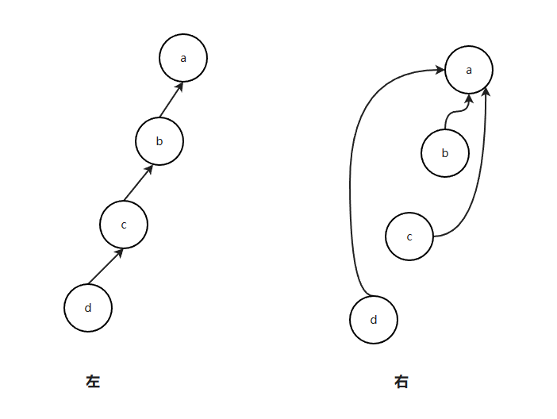
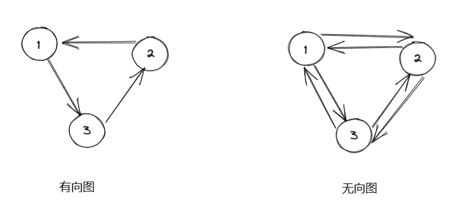
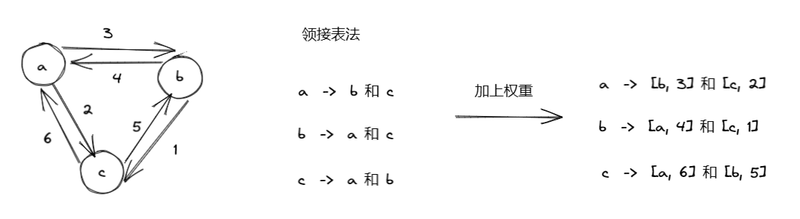
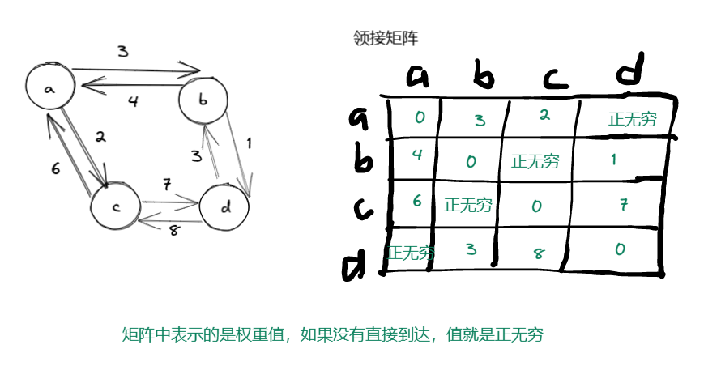
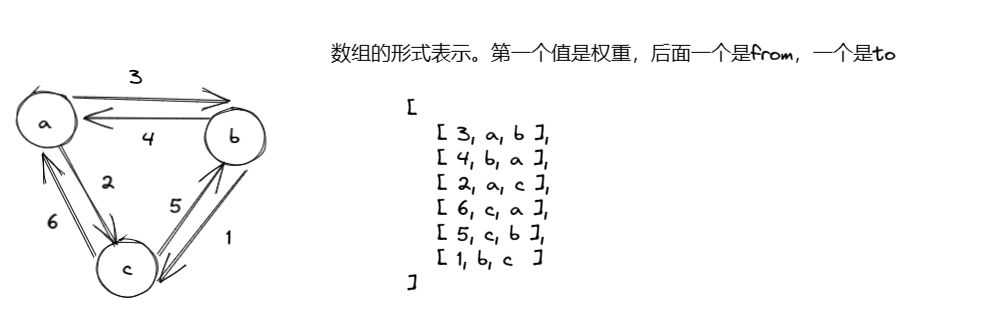
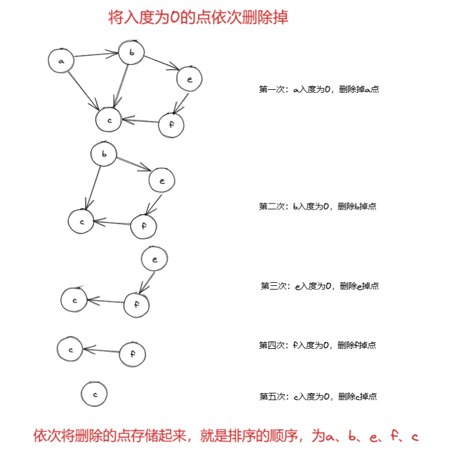
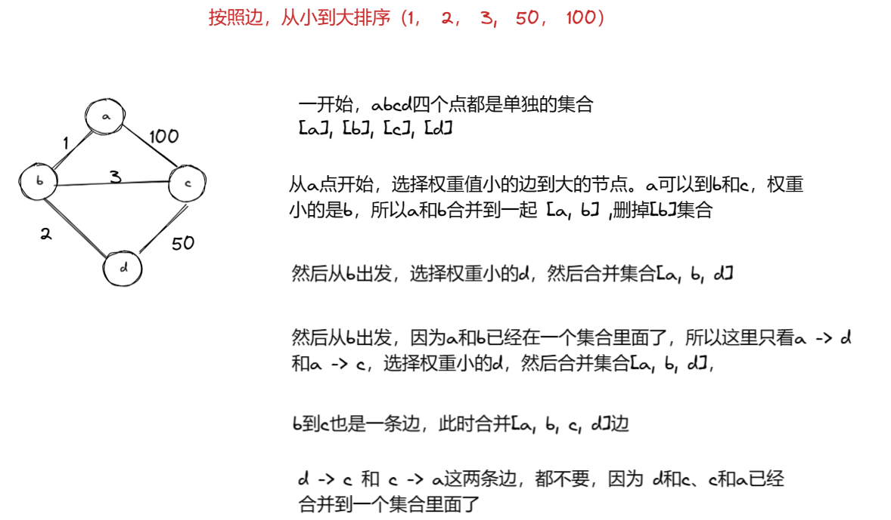
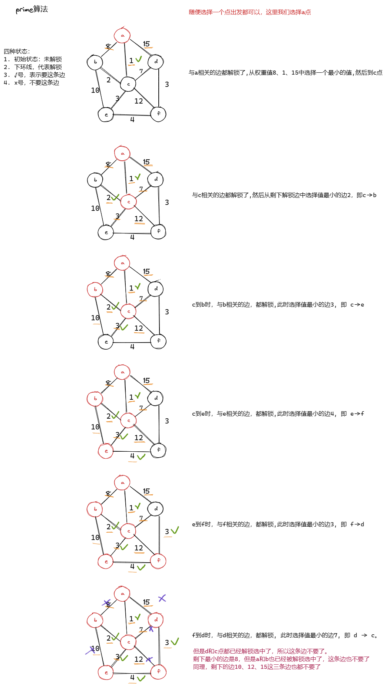
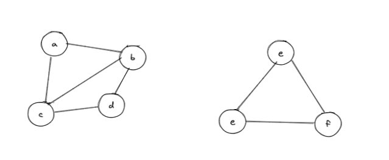
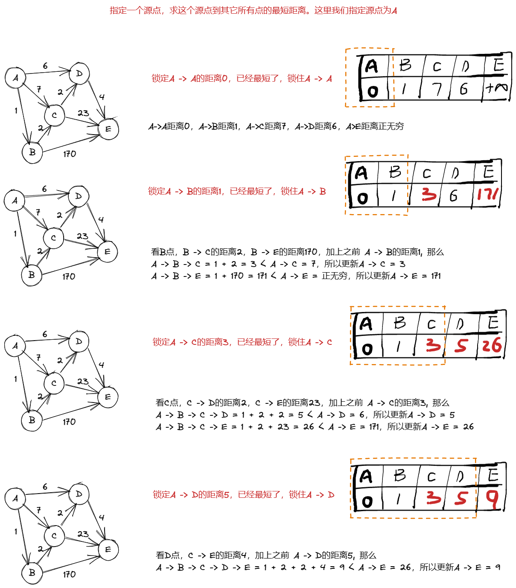

# 并查集

[算法学习笔记(1) : 并查集 - 知乎 (zhihu.com)](https://zhuanlan.zhihu.com/p/93647900)

1） 有若干个样本a、b、c、d…类型假设是V

2）在并查集中一开始认为每个样本都在单独的集合里

3）用户可以在任何时候调用如下两个方法：       

​	boolean isSameSet(V x, V y) : 查询样本x和样本y是否属于一个集合       

​	void union(V x, V y) : 把x和y各自所在集合的所有样本合并成一个集合

4） isSameSet和union方法的代价越低越好

```java
public static class Node<V> {
    V value;

    public Node(V value) {
        this.value = value;
    }
}


public static class UnionSet<V> {
    public HashMap<V, Node<V>> nodes;
    public HashMap<Node<V>, Node<V>> parent;
    public HashMap<Node<V>, Integer> sizeMap;

    public UnionSet(List<V> values) {
        nodes = new HashMap<>();
        parent = new HashMap<>();
        sizeMap = new HashMap<>();
        for (V value : values) {
            Node<V> node = new Node<>(value);
            nodes.put(value, node);
            parent.put(node, node);
            sizeMap.put(node, 1);
        }
    }

    public Node<V> findFather(Node<V> cur) {
        Stack<Node<V>> stack = new Stack<>();
        while (cur != parent.get(cur)) {
            stack.push(cur);
            cur = parent.get(cur);
        }
        // 扁平化处理
        while (!stack.isEmpty()) {
            parent.put(stack.pop(), cur);
        }
        return cur;
    }

    public boolean isSameSet(V a, V b) {
        if (!nodes.containsKey(a) || !nodes.containsKey(b)) {
            return false;
        }
        return findFather(nodes.get(a)) == findFather(nodes.get(b));
    }

    public void union(V a, V b) {
        if (!nodes.containsKey(a) || !nodes.containsKey(b)) {
            return;
        }
        Node<V> aHead = findFather(nodes.get(a));
        Node<V> bHead = findFather(nodes.get(b));
        if (aHead != bHead) {
            int aSetSize = sizeMap.get(aHead);
            int bSetSize = sizeMap.get(bHead);
            // 小 挂 大
            if (aSetSize >= bSetSize) {
                parent.put(bHead, aHead);
                sizeMap.put(aHead, aSetSize + bSetSize);
                sizeMap.remove(bHead);
            } else {
                parent.put(aHead, bHead);
                sizeMap.put(bHead, aSetSize + bSetSize);
                sizeMap.remove(aHead);
            }
        }
    }
}
```

## 并查集的优化点

1. findFather的时候，进行扁平化处理
2. 挂节点的时候，小挂大
3. 如果方法调用很频繁，那么单次调用的代价为O(1)，两个方法都如此



一开始是左边的方法，findFather方法需要一直往上找，找到a，扁平化之后，d、c、b直接指向头结点a，这样查询的复杂度就是O(1)了

## 小试牛刀

先有一些用户，每个用户有三个属性a、b、c，只要三个属性中，有一对是一样的，就说这两个用户是同一个用户，问最终有多少用户

> 如 userA = { a = "1", b = "2",  c = "3"}
>
> userB = { a = "4", b = "2",  c = "5"}
>
> userC = { a = "2", b = "6",  c = "3"}
>
> 这三个用户其实就是一个用户。因为userA和userB的b属性值一样，userA和userC的c属性值一样

```java
public class Code02_UnionUser {


    public static class Node<V> {
        V value;

        public Node(V value) {
            this.value = value;
        }
    }


    public static class UnionSet<V> {
        public HashMap<V, Node<V>> nodes;
        public HashMap<Node<V>, Node<V>> parent;
        public HashMap<Node<V>, Integer> sizeMap;

        public UnionSet(List<V> values) {
            nodes = new HashMap<>();
            parent = new HashMap<>();
            sizeMap = new HashMap<>();
            for (V value : values) {
                Node<V> node = new Node<>(value);
                nodes.put(value, node);
                parent.put(node, node);
                sizeMap.put(node, 1);
            }
        }

        public Node<V> findFather(Node<V> cur) {
            Stack<Node<V>> stack = new Stack<>();
            while (cur != parent.get(cur)) {
                stack.push(cur);
                cur = parent.get(cur);
            }
            // 扁平化处理
            while (!stack.isEmpty()) {
                parent.put(stack.pop(), cur);
            }
            return cur;
        }

        public boolean isSameSet(V a, V b) {
            if (!nodes.containsKey(a) || !nodes.containsKey(b)) {
                return false;
            }
            return findFather(nodes.get(a)) == findFather(nodes.get(b));
        }

        public void union(V a, V b) {
            if (!nodes.containsKey(a) || !nodes.containsKey(b)) {
                return;
            }
            Node<V> aHead = findFather(nodes.get(a));
            Node<V> bHead = findFather(nodes.get(b));
            if (aHead != bHead) {
                int aSetSize = sizeMap.get(aHead);
                int bSetSize = sizeMap.get(bHead);
                // 小 挂 大
                if (aSetSize >= bSetSize) {
                    parent.put(bHead, aHead);
                    sizeMap.put(aHead, aSetSize + bSetSize);
                    sizeMap.remove(bHead);
                } else {
                    parent.put(aHead, bHead);
                    sizeMap.put(bHead, aSetSize + bSetSize);
                    sizeMap.remove(aHead);
                }
            }
        }

        public int getSetNum() {
            return sizeMap.size();
        }

    }

    public static class User {
        public String a;
        public String b;
        public String c;

        public User(String a, String b, String c) {
            this.a = a;
            this.b = b;
            this.c = c;
        }
    }

    // 如果两个User中，a字段一样、或者b一样、或者c字段一样，就认为是一个人
    public static int mergerUser(List<User> users) {
        UnionSet<User> unionSet = new UnionSet<>(users);
        Map<String, User> mapA = new HashMap<>();
        Map<String, User> mapB = new HashMap<>();
        Map<String, User> mapC = new HashMap<>();

        for (User user : users) {
            if (mapA.containsKey(user.a)) {
                unionSet.union(user, mapA.get(user.a));
            } else {
                mapA.put(user.a, user);
            }
            if (mapB.containsKey(user.b)) {
                unionSet.union(user, mapB.get(user.b));
            } else {
                mapB.put(user.b, user);
            }
            if (mapC.containsKey(user.c)) {
                unionSet.union(user, mapC.get(user.c));
            } else {
                mapC.put(user.c, user);
            }
        }
        // 想并查集查询，合并之后，还有多少个集合
        return unionSet.getSetNum();
    }

    public static void main(String[] args) {
        List<User> users = new ArrayList<>();
        User userA = new User("1", "2", "3");
        User userB = new User("4", "2", "5");
        User userC = new User("2", "6", "3");
        User userD = new User("3", "61", "31");
        users.add(userA);
        users.add(userB);
        users.add(userC);
        users.add(userD);

        System.out.println(mergerUser(users));
    }
}
```

## 并查集的应用

- 解决两大块区域的合并问题

- 常用在图等领域中

# 图

1）由点的集合和边的集合构成

2）虽然存在有向图和无向图的概念，但实际上都可以用有向图来表达

3）边上可能带权重值



> 有向图有一个方向
>
> 无向图有两个方向

## 图的表示方式

### 1. 领接表法

> 从 x节点出发能直接到的直接邻居



### 2. 邻接矩阵法



### 3. 数组的形式



Q：其中图的表示形式很多，就看怎么定义，图的形式那么多，那我们该怎么做呢？

A：不管图的表示形式是什么，我们都可以把它转换成自己熟悉的形式

##  表示图的代码

**定义点的代码**

```java
// 点结构的描述
public class Node {

    // 标志点的唯一性，可以是string类型的，也可以是什么id
    public int value;

    // in 表示箭头指向 x 节点的数量
    public int in;

    // out 表示箭头从 x 节点指出去的数量
    public int out;

    // nexts 表示箭头从 x 节点指向的那些Node
    public ArrayList<Node> nexts;

    // edges 表示从 x 节点出发，执行别的点的边
    public ArrayList<Edge> edges;

    public Node(int value) {
        this.value = value;
        in = 0;
        out = 0;
        nexts = new ArrayList<>();
        edges = new ArrayList<>();
    }
}
```

**定义边的代码**

```java
// 边结构的描述
public class Edge {

    // 权重
    public int weight;

    public Node from;

    public Node to;

    public Edge(int weight, Node from, Node to) {
        this.weight = weight;
        this.from = from;
        this.to = to;
    }
}
```

**定义图的代码**

```java
// 图结构的描述。图是由点和线组成的
public class Graph {

    public HashMap<Integer, Node> nodes;

    public HashSet<Edge> edges;

    public Graph() {
        nodes = new HashMap<>();
        edges = new HashSet<>();
    }
}
```

根据数组的形式，生成一个图（Graph）

```java
// matrix 所有边
// N * 3 的矩阵
// [weight, from ,to]
public static Graph createGraph(int[][] matrix) {
    Graph graph = new Graph();
    for (int i = 0; i < matrix.length; i++) {
        int weight = matrix[i][0];
        Integer from = matrix[i][1];
        Integer to = matrix[i][2];

        if (!graph.nodes.containsKey(from)) {
            graph.nodes.put(from, new Node(from));
        }

        if (!graph.nodes.containsKey(to)) {
            graph.nodes.put(to, new Node(to));
        }

        Node fromNode = graph.nodes.get(from);
        Node toNode = graph.nodes.get(to);

        // 创建一个新的边
        Edge edge = new Edge(weight, fromNode, toNode);
        fromNode.nexts.add(toNode);
        fromNode.edges.add(edge);

        fromNode.out++;
        toNode.in++;

        graph.edges.add(edge);
    }
    return graph;
}
```

## 图的深度和宽度优先遍历

### 宽度优先遍历（BFS）

> 1，利用队列实现
>
> 2，从源节点开始依次按照宽度进队列，然后弹出
>
> 3，每弹出一个点，把该节点所有没有进过队列的邻接点放入队列
>
> 4，直到队列变空

```java
// 从Node出发进行宽度优先遍历
public static void bfs(Node root) {
    if (root == null) {
        return;
    }
    Queue<Node> queue = new LinkedList<>();
    // 因为图是个有环的。记录下有没有走过
    HashSet<Node> set = new HashSet<>();
    queue.offer(root);
    set.add(root);
    while (!queue.isEmpty()) {
        Node node = queue.poll();
        System.out.println(node.value);
        for (Node next : node.nexts) {
            if (!set.contains(next)) {
                queue.offer(next);
                set.add(next);
            }
        }
    }
}
```

### 深度优先遍历（DFS）

> 1，利用栈实现
>
> 2，从源节点开始把节点按照深度放入栈，然后弹出
>
> 3，每弹出一个点，把该节点下一个没有进过栈的邻接点放入栈，在放入下一个点之前，先把弹出的点，压入栈
>
> 4，直到栈变空 

一条路走到没有路就返回

stack记录的是走的路径

```java
// 从Node出发进行深度优先遍历
public static void dfs(Node root) {
    if (root == null) {
        return;
    }
    Stack<Node> stack = new Stack<>();
    // 因为图是个有环的。记录下有没有走过
    HashSet<Node> set = new HashSet<>();
    stack.push(root);
    set.add(root);
    System.out.println(root.value);
    while (!stack.isEmpty()) {
        Node node = stack.pop();
        for (Node next : node.nexts) {
            if (!set.contains(next)) {
                // 把之前弹出去的再压进去
                stack.push(node);
                stack.push(next);
                set.add(next);
                System.out.println(node.value);
                // 只压一个next，就返回，一条道走到不能再走
                break;
            }
        }
    }
}
```

## 无环图排序算法

就是有向无环图排序



```java
// directed graph and no loop
public static List<Node> sortedTopology(Graph graph) {
    // key 某个节点   value 剩余的入度
    HashMap<Node, Integer> inMap = new HashMap<>();
    // 只有剩余入度为0的点，才进入这个队列
    Queue<Node> zeroInQueue = new LinkedList<>();
    for (Node node : graph.nodes.values()) {
        inMap.put(node, node.in);
        if (node.in == 0) {
            zeroInQueue.offer(node);
        }
    }
    List<Node> result = new ArrayList<>();
    while (!zeroInQueue.isEmpty()) {
        Node cur = zeroInQueue.poll();
        result.add(cur);
        for (Node next : cur.nexts) {
            inMap.put(next, inMap.get(next) - 1);
            if (inMap.get(next) == 0) {
                zeroInQueue.offer(next);
            }
        }
    }
    return result;
}
```

**要求：有向图且其中没有环**

**应用：事件安排、编译顺序**

## 最小生成树算法

通常是有两种，一种是kruskai (**克鲁斯卡算法**)，另外一种是prim(**普里姆算法**)

### kruskai (**克鲁斯卡算法**)

1）总是从权值最小的边开始考虑，依次考察权值依次变大的边

2）当前的边要么进入最小生成树的集合，要么丢弃

3）如果当前的边进入最小生成树的集合中不会形成环，就要当前边

4）如果当前的边进入最小生成树的集合中会形成环，就不要当前边

5）考察完所有边之后，最小生成树的集合也得到了



使用并查集合并两个Node节点

定义并查集结构

```java
public static class UnionFind {

    private HashMap<Node, Node> fatherMap;

    private HashMap<Node, Integer> sizeMap;


    public UnionFind() {
        fatherMap = new HashMap<>();
        sizeMap = new HashMap<>();
    }


    public void makeSets(Collection<Node> nodes) {
        fatherMap.clear();
        sizeMap.clear();
        for (Node node : nodes) {
            fatherMap.put(node, node);
            sizeMap.put(node, 1);
        }
    }

    public Node findFather(Node node) {
        Stack<Node> stack = new Stack<>();
        while (node != fatherMap.get(node)) {
            stack.push(node);
            node = fatherMap.get(node);
        }
        while (!stack.isEmpty()) {
            Node cur = stack.pop();
            fatherMap.put(cur, node);
        }
        return node;
    }

    public boolean isSameSet(Node a, Node b) {
        return findFather(a) == findFather(b);
    }

    public void union(Node a, Node b) {
        if (a == null || b == null) {
            return;
        }
        Node aFather = findFather(a);
        Node bFather = findFather(b);
        if (aFather != bFather) {
            int aSetSize = sizeMap.get(aFather);
            int bSetSize = sizeMap.get(bFather);
            // 小挂大
            if (aSetSize <= bSetSize) {
                fatherMap.put(aFather, bFather);
                sizeMap.put(bFather, aSetSize + bSetSize);
                sizeMap.remove(aFather);
            } else {
                fatherMap.put(bFather, aFather);
                sizeMap.put(aFather, aSetSize + bSetSize);
                sizeMap.remove(bFather);
            }
        }
    }
}
```

Kruskal算法

```java
public static Set<Edge> kruskalMST(Graph graph) {
    UnionFind unionFind = new UnionFind();
    unionFind.makeSets(graph.nodes.values());
    // 从小到大的边
    PriorityQueue<Edge> priorityQueue = new PriorityQueue<>(new Comparator<Edge>() {
        @Override
        public int compare(Edge o1, Edge o2) {
            return o1.weight - o2.weight;
        }
    });

    // 将所有的边加入到队列中
    for (Edge edge : graph.edges) {
        priorityQueue.offer(edge);
    }

    Set<Edge> result = new HashSet<>();
    while (!priorityQueue.isEmpty()) {
        Edge edge = priorityQueue.poll();
        // 如果from和to对应的点不在一个集合中，那就加入到集合中
        if (!unionFind.isSameSet(edge.from, edge.to)) {
            result.add(edge);
            unionFind.union(edge.from, edge.to);
        }
    }
    return result;
}
```

main方法测试

```java
public static void main(String[] args) {
    // 定义点，
    Node nodeA = new Node("a");
    Node nodeB = new Node("b");
    Node nodeC = new Node("c");
    Node nodeD = new Node("d");
    // 定义边
    Edge edgeAB = new Edge(1, nodeA, nodeB);
    Edge edgeAC = new Edge(100, nodeA, nodeC);
    Edge edgeBC = new Edge(3, nodeB, nodeC);
    Edge edgeBD = new Edge(2, nodeB, nodeD);
    Edge edgeDC = new Edge(50, nodeD, nodeC);

    Graph graph = new Graph();
    HashSet<Edge> edges = new HashSet<>();
    edges.add(edgeAB);
    edges.add(edgeAC);
    edges.add(edgeBC);
    edges.add(edgeBD);
    edges.add(edgeDC);

    HashMap<String, Node> nodes = new HashMap<>();
    nodes.put(nodeA.value, nodeA);
    nodes.put(nodeB.value, nodeB);
    nodes.put(nodeC.value, nodeC);
    nodes.put(nodeD.value, nodeD);

    graph.nodes.putAll(nodes);
    graph.edges.addAll(edges);

    Set<Edge> result = kruskalMST(graph);
    for (Edge edge : result) {
        System.out.println(edge.weight);
    }
}
```

### prim(**普里姆算法**)

1）可以从任意节点出发来寻找最小生成树

2）某个点加入到被选取的点中后，解锁这个点出发的所有新的边

3）在所有解锁的边中选最小的边，然后看看这个边会不会形成环

4）如果会，不要当前边，继续考察剩下解锁的边中最小的边，重复3）

5）如果不会，要当前边，将该边的指向点加入到被选取的点中，重复2）

6）当所有点都被选取，最小生成树就得到了



```java
// 返回值用set或list都可以
public static List<Edge> primMST(Graph graph) {
    // 解锁的边进入小根堆
    PriorityQueue<Edge> priorityQueue = new PriorityQueue<>(new Comparator<Edge>() {
        @Override
        public int compare(Edge o1, Edge o2) {
            return o1.weight - o2.weight;
        }
    });
    // 保存解锁出来的边
    HashSet<Node> nodeSet = new HashSet<>();
    List<Edge> result = new ArrayList<>(); // 依次挑选的的边在result里

    // 随便挑了一个点
    for (Node node : graph.nodes.values()) {
        // node 是开始点
        if (!nodeSet.contains(node)) {
            nodeSet.add(node);
            // 由一个点，解锁所有相连的边
            for (Edge edge : node.edges) {
                priorityQueue.offer(edge);
            }
            while (!priorityQueue.isEmpty()) {
                // 取权重值最小的边
                Edge edge = priorityQueue.poll();
                Node toNode = edge.to;  // 可能的一个新的点
                if (!nodeSet.contains(toNode)) {
                    nodeSet.add(toNode);
                    result.add(edge);
                    for (Edge nextEdge : toNode.edges) {
                        priorityQueue.add(nextEdge);
                    }
                }
            }
        }
    }
    return result;
}
```

Q：为什么要使用for循环？

S：其实没有必要，是为了防森林



> 如上图，出现了多块区域，如果是一个区域就不需要for循环了

Q：还能优化吗？

S：假设点来到c，因为c到a是1已经选中了，所以就不能再被选择了，进而选择了c到d的2，但是代码中还是把c对应的所有边都放到小根堆队列中了，这里可以优化下。在使用一个Set集合，保存已经本选中的边

```java
// 返回值用set或list都可以
public static List<Edge> primMST(Graph graph) {
    // 解锁的边进入小根堆
    PriorityQueue<Edge> priorityQueue = new PriorityQueue<>(new Comparator<Edge>() {
        @Override
        public int compare(Edge o1, Edge o2) {
            return o1.weight - o2.weight;
        }
    });
    // 保存解锁出来的边
    HashSet<Node> nodeSet = new HashSet<>();
    // 保存已经被选中的边，无需重复加入到队列中。加不加这个集合堆最终结果没啥影响，加了，效率会高些
    HashSet<Edge> edgeSet = new HashSet<>();
    List<Edge> result = new ArrayList<>(); // 依次挑选的的边在result里

    // 随便挑了一个点
    for (Node node : graph.nodes.values()) {
        // node 是开始点
        if (!nodeSet.contains(node)) {
            nodeSet.add(node);
            // 由一个点，解锁所有相连的边
            for (Edge edge : node.edges) {
                if (!edgeSet.contains(edge)) {
                    priorityQueue.offer(edge);
                    edgeSet.add(edge);
                }
            }
            while (!priorityQueue.isEmpty()) {
                // 取权重值最小的边
                Edge edge = priorityQueue.poll();
                Node toNode = edge.to;  // 可能的一个新的点
                if (!nodeSet.contains(toNode)) {
                    nodeSet.add(toNode);
                    result.add(edge);
                    for (Edge nextEdge : toNode.edges) {
                        if (!edgeSet.contains(nextEdge)) {
                            priorityQueue.offer(nextEdge);
                            edgeSet.add(edge);
                        }
                    }
                }
            }
        }
    }
    return result;
}
```

## Dijkstra（迪克斯特拉）算法

[Dijkstra算法详解 通俗易懂 - 知乎 (zhihu.com)](https://zhuanlan.zhihu.com/p/338414118)

Dijkstra 算法是一个基于「贪心」、「广度优先搜索」、「动态规划」求一个图中一个点到其他所有点的最短路径的算法，时间复杂度 O(n2)

> 1）Dijkstra算法必须指定一个源点
>
> 2）生成一个源点到各个点的最小距离表，一开始只有一条记录，即原点到自己的最小距离为0，源点到其他所有点的最小距离都为正无穷大
>
> 3）从距离表中拿出没拿过记录里的最小记录，通过这个点发出的边，更新源点到各个点的最小距离表，不断重复这一步
>
> 4）源点到所有的点记录如果都被拿过一遍，过程停止，最小距离表得到了

**注意：边的权重值不能为负数**



```java
public static HashMap<Node, Integer> dijkstra1(Node from) {
    HashMap<Node, Integer> distanceMap = new HashMap<>();
    distanceMap.put(from, 0);
    // 已经选择过的点
    HashSet<Node> selectedNodes = new HashSet<>();
    Node minNode = getMinDistanceAndUnselectedNode(distanceMap, selectedNodes);
    while (minNode != null) {
        //  原始点  ->  minNode(跳转点)   最小距离distance
        int distance = distanceMap.get(minNode);
        // 获取能到达的所有边
        for (Edge edge : minNode.edges) {
            Node toNode = edge.to;
            if (!distanceMap.containsKey(toNode)) {
                distanceMap.put(toNode, distance + edge.weight);
            } else {
                // 更新
                distanceMap.put(toNode, Math.min(distance + edge.weight, distanceMap.get(toNode)));
            }
        }
        selectedNodes.add(minNode);
        minNode = getMinDistanceAndUnselectedNode(distanceMap, selectedNodes);
    }
    return distanceMap;
}

/**
 * 从所有的点钟获取距离最短的，已经选择的不在进行选择
 *
 * @param distanceMap
 * @param selectedNodes 相当于黑名单
 * @return
 */
private static Node getMinDistanceAndUnselectedNode(HashMap<Node, Integer> distanceMap, HashSet<Node> selectedNodes) {
    Node minNode = null;
    int minDistance = Integer.MAX_VALUE;
    for (Map.Entry<Node, Integer> entry : distanceMap.entrySet()) {
        Node node = entry.getKey();
        int distance = entry.getValue();
        if (!selectedNodes.contains(node) && distance < minDistance) {
            minDistance = distance;
            minNode = node;
        }
    }
    return minNode;
}
```

main方法测试

```java
public static void main(String[] args) {
    Node nodeA = new Node("A");
    Node nodeB = new Node("B");
    Node nodeC = new Node("C");
    Node nodeD = new Node("D");
    Node nodeE = new Node("E");

    Edge edgeAB = new Edge(1, nodeA, nodeB);
    Edge edgeAC = new Edge(7, nodeA, nodeC);
    Edge edgeAD = new Edge(6, nodeA, nodeD);
    Edge edgeBC = new Edge(2, nodeB, nodeC);
    Edge edgeBE = new Edge(170, nodeB, nodeE);
    Edge edgeCE = new Edge(23, nodeC, nodeE);
    Edge edgeCD = new Edge(2, nodeC, nodeD);
    Edge edgeDE = new Edge(4, nodeD, nodeE);

    nodeA.edges.add(edgeAB);
    nodeA.edges.add(edgeAC);
    nodeA.edges.add(edgeAD);

    nodeB.edges.add(edgeBC);
    nodeB.edges.add(edgeBE);

    nodeC.edges.add(edgeCD);
    nodeC.edges.add(edgeCE);

    nodeD.edges.add(edgeDE);

    HashMap<Node, Integer> result = dijkstra1(nodeA);
    for (Map.Entry<Node, Integer> entry : result.entrySet()) {
        System.out.println("A -> " + entry.getKey().value + "的最小距离是：" + entry.getValue());
    }
}
```

### 优化

`getMinDistanceAndUnselectedNode`这个方法可以优化。每次选择最小值需要遍历所有的点，时间复杂度是O(n)

我们可以使用一个小根堆，每次只取第一个最小的元素

默认的小根堆是不能实现我们想要的结果的。因为我们需要改动距离值，我们希望改动之后，这个小根堆自动帮助我们排好序

很不幸，默认的小根堆是不支持的

**所以我们需要自己实现一个可以自动平衡改变的小根堆**

可以参考堆那一节

自定义一个堆的代码

```java
public static class NodeRecord {
    public Node node;
    public int distance;

    public NodeRecord(Node node, int distance) {
        this.node = node;
        this.distance = distance;
    }
}


public static class NodeHeap {

    private Node[] nodes; // 实际的堆结构
    // key 某一个node， value 上面堆中的位置。如果索引位置是-1，说明曾经添加过
    private HashMap<Node, Integer> heapIndexMap;
    // key 某一个节点， value 从源节点出发到该节点的目前最小距离
    private HashMap<Node, Integer> distanceMap;
    private int size; // 堆上有多少个点

    public NodeHeap(int size) {
        nodes = new Node[size];
        heapIndexMap = new HashMap<>();
        distanceMap = new HashMap<>();
        size = 0;
    }

    public boolean isEmpty() {
        return size == 0;
    }

    public void addOrUpdateOrIgnore(Node node, int distance) {
        // 当前节点在堆中，说明可能需要修改堆中的值
        if (inHeap(node)) {
            // 修改堆中的距离值
            distanceMap.put(node, Math.min(distanceMap.get(node), distance));
            // 修改完之后，调整在小根堆的位置
            insertHeapify(heapIndexMap.get(node));
        }
        // 当前节点从来没进过堆，说明是个新的节点，直接添加
        if (!isEntered(node)) {
            nodes[size] = node;
            heapIndexMap.put(node, size);
            distanceMap.put(node, distance);
            // 调整在堆中的位置
            insertHeapify(size++);
        }
    }

    public NodeRecord pop() {
        NodeRecord record = new NodeRecord(nodes[0], distanceMap.get(nodes[0]));
        swap(0, size - 1);
        // 索引设置为-1
        heapIndexMap.put(nodes[size - 1], -1);
        distanceMap.remove(nodes[size - 1]);
        nodes[size - 1] = null;
        heapify(0, --size);
        return record;
    }


    private void insertHeapify(int index) {
        while (distanceMap.get(nodes[index]) < distanceMap.get(nodes[(index - 1) / 2])) {
            swap(index, (index - 1) / 2);
            index = (index - 1) / 2;
        }
    }

    private void heapify(int index, int size) {
        int left = index * 2 + 1;
        while (left < size) {
            int smallest = left + 1 < size && distanceMap.get(nodes[left + 1]) < distanceMap.get(nodes[left])
                    ? left + 1
                    : left;
            smallest = distanceMap.get(nodes[smallest]) < distanceMap.get(nodes[index]) ? smallest : index;
            if (smallest == index) {
                break;
            }
            swap(smallest, index);
            index = smallest;
            left = index * 2 + 1;
        }
    }

    /**
     * 是否进过堆中
     * @param node
     * @return
     */
    private boolean isEntered(Node node) {
        return heapIndexMap.containsKey(node);
    }

    /**
     * 是否在堆中
     * @param node
     * @return
     */
    private boolean inHeap(Node node) {
        return isEntered(node) && heapIndexMap.get(node) != -1;
    }

    private void swap(int index1, int index2) {
        heapIndexMap.put(nodes[index1], index2);
        heapIndexMap.put(nodes[index2], index1);
        Node tmp = nodes[index1];
        nodes[index1] = nodes[index2];
        nodes[index2] = tmp;
    }
}
```

```java
// 优化之后的dijkstra算法
public static HashMap<Node, Integer> dijkstra2(Node from) {
    // 这里可以遍历下所有节点，求下size
    int size = 5;
    NodeHeap nodeHeap = new NodeHeap(size);
    // 从from -> from距离是0
    nodeHeap.addOrUpdateOrIgnore(from, 0);
    HashMap<Node, Integer> result = new HashMap<>();
    while (!nodeHeap.isEmpty()) {
        NodeRecord record = nodeHeap.pop();
        Node cur = record.node;
        int distance = record.distance;
        for (Edge edge : cur.edges) {
            nodeHeap.addOrUpdateOrIgnore(edge.to, distance + edge.weight);
        }
        result.put(cur, distance);
    }
    return result;
}
```