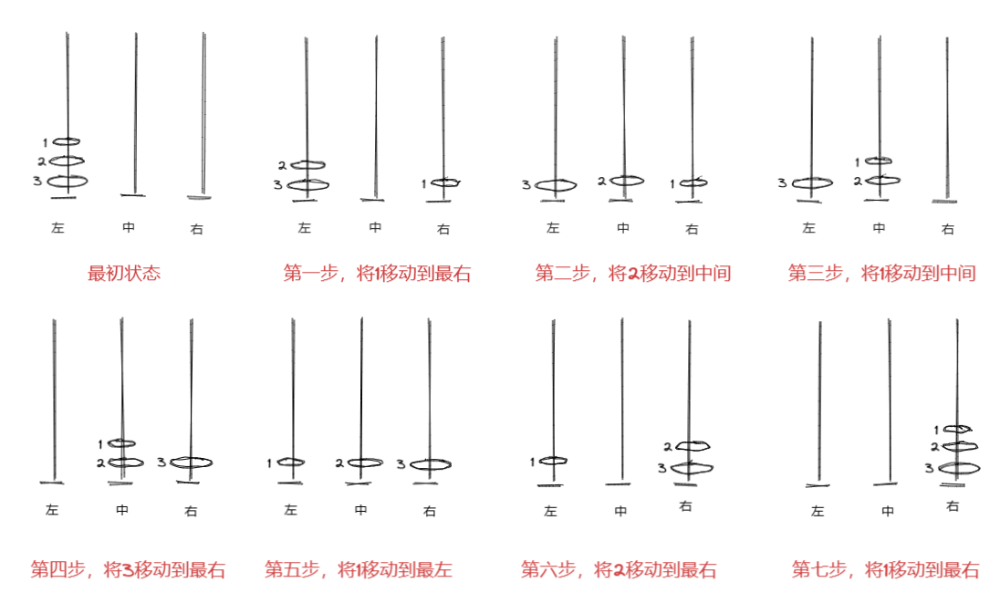
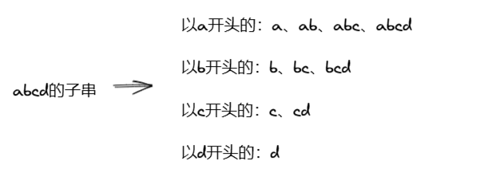
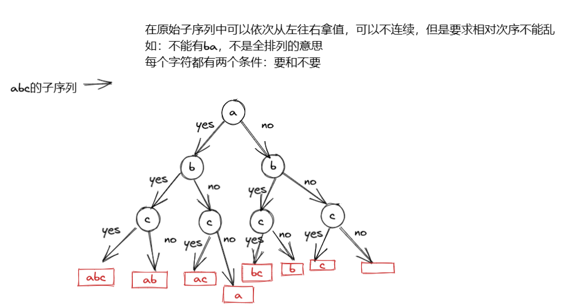
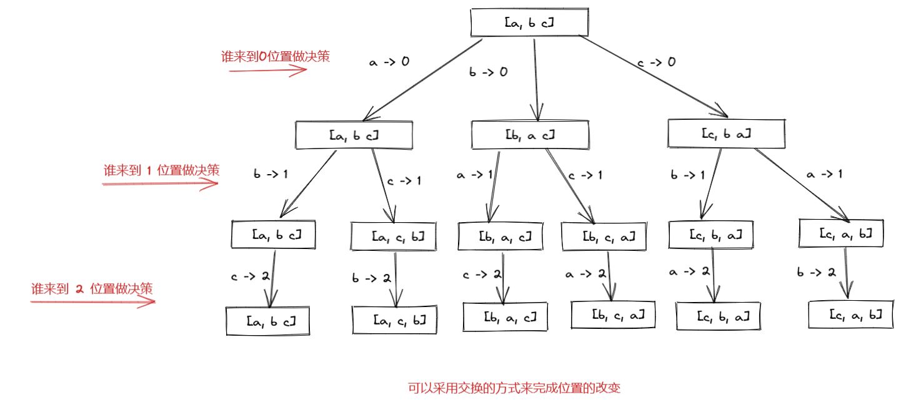
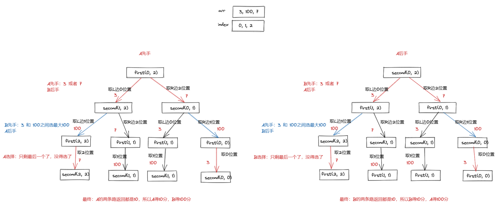
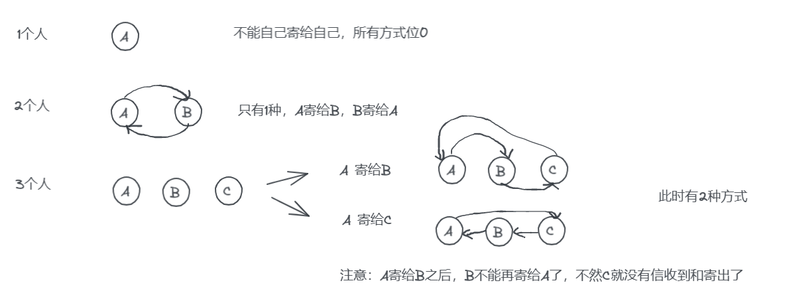
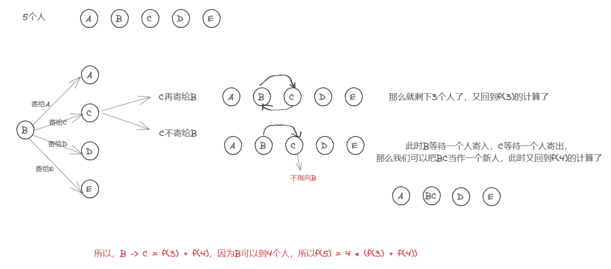

# 暴力递归

暴力递归就是尝试 

1，把问题转化为规模缩小了的同类问题的子问题

2，有明确的不需要继续进行递归的条件(base case)

3，有当得到了子问题的结果之后的决策过程

4，不记录每一个子问题的解

# 汉诺塔问题

打印n层汉诺塔从最左边移动到最右边的全部过程（注意，圆盘只能小压大。如可以将2放到3上，但是不能将2放到1上）



>如果是1-N个圆盘怎么将，圆盘全部移动到最右边
>
>第一步：将1 ~ N-1个圆盘 从左  -> 中 （如上图的第三步，腾出路来给N）
>
>第二步：N层圆盘，从左 -> 右
>
>第三步：1 ~  N-1 个圆盘从中 -> 右

## 1. 暴力解法

```java
// 请把1~N层圆盘 从左 -> 右
public static void hanoi1(int n) {
    leftToRight(n);
}

// 请把1~N层圆盘 从左 -> 右
public static void leftToRight(int n) {
    if (n == 1) {
        System.out.println("Move 1 from left to right");
        return;
    }
    leftToMid(n - 1);
    System.out.println("Move " + n + " from left to right");
    midToRight(n - 1);
}

// 请把1~N层圆盘 从中 -> 右
private static void midToRight(int n) {
    if (n == 1) {
        System.out.println("Move 1 mid left to right");
        return;
    }
    midToLeft(n - 1);
    System.out.println("Move " + n + " from mid to right");
    leftToRight(n - 1);
}

// 请把1~N层圆盘 从中 -> 左
private static void midToLeft(int n) {
    if (n == 1) {
        System.out.println("Move 1 mid mid to left");
        return;
    }
    midToRight(n - 1);
    System.out.println("Move " + n + " from mid to left");
    rightToLeft(n - 1);
}

// 请把1~N层圆盘 从右 -> 左
private static void rightToLeft(int n) {
    if (n == 1) {
        System.out.println("Move 1 mid right to left");
        return;
    }
    rightToMid(n - 1);
    System.out.println("Move " + n + " right mid to left");
    midToLeft(n - 1);
}

// 请把1~N层圆盘 从左 -> 中
public static void leftToMid(int n) {
    if (n == 1) {
        System.out.println("Move 1 from left to mid");
        return;
    }
    // 先移动到最右边
    leftToRight(n - 1);
    System.out.println("Move " + n + " from left to mid");
    rightToMid(n - 1);
}

// 请把1~N层圆盘 从右 -> 中
public static void rightToMid(int n) {
    if (n == 1) {
        System.out.println("Move 1 from right to mid");
        return;
    }
    rightToLeft(n - 1);
    System.out.println("Move " + n + " from right to mid");
    leftToMid(n - 1);
}
```

## 2. 递归

优化下，不区分左中右了，只用from、to、other代替

> 如果是1-N个圆盘怎么将，圆盘全部从from 移动 到 to
>
> 第一步：将1 ~ N-1个圆盘 从from  -> other
>
> 第二步：N层圆盘，从from -> to
>
> 第三步：1 ~  N-1 个圆盘从 other -> to

```java
// 请把1~N层圆盘 从左 -> 右
public static void hanoi2(int n) {
    func(n, "left", "right", "mid");
}

private static void func(int n, String from, String to, String other) {
    if (n == 1) {
        System.out.println("Move 1 from " + from + " to " + to);
        return;
    }
    func(n - 1, from, other, to);
    System.out.println("Move " + n + " from " + from + " to " + to);
    func(n - 1, other, to, from);
}
```

[面试题 08.06. 汉诺塔问题 - 力扣（LeetCode）](https://leetcode.cn/problems/hanota-lcci/)

**总结：汉诺塔问题最少操作步数是2的n次方-1**

# 栈的逆序

给你一个栈，请你逆序这个栈，不能申请额外的数据结构，只能使用递归函数。 如何实现? 

> 首先我们可以构造一个函数f(x)
>
> 调用f(x)的时候，返回弹出栈底元素
>
> 如：一个栈里面有元素 1, 2, 3 ，返回栈底元素3，并且当前栈内元素只剩下1，2

```java
public static int f(Stack<Integer> stack) {
    int result = stack.pop();
    if (stack.isEmpty()) {
        return result;
    } else {
        int last = f(stack);
        stack.push(result);
        return last;
    }
}
```

.png)

```java
public static void reverse(Stack<Integer> stack) {
    if (stack.isEmpty()) {
        return;
    }
    int result = f(stack);
    reverse(stack);
    stack.push(result);
}
```

# 打印一个字符串的全部子序列

子串和子序列的区别？

> 子串必须是连续的
>
> 子序列不需要连续





```java
public static List<String> subs(String s) {
    char[] chars = s.toCharArray();
    List<String> ans = new ArrayList<>();
    process(chars, 0, ans, "");
    return ans;
}

/**
 * 处理过程
 *
 * @param chars
 * @param index 此时字符串的索引位置  要 or 不要
 * @param ans   如果index来到了 chars 的终止位置，把沿途所形成的答案放入到ans
 * @param path  之前作出的选择，就是path
 */
private static void process(char[] chars, int index, List<String> ans, String path) {
    if (index == chars.length) {
        ans.add(path);
        return;
    }
    // 不要当前index位置的字符
    process(chars, index + 1, ans, path);
    // 要当前index位置的字符
    process(chars, index + 1, ans, path + chars[index]);
}
```

# 打印一个字符串的全部子序列（去掉重复）

打印一个字符串的全部子序列，要求不要出现重复字面值的子序列

> 如字符串abc，abc中没有重复的字符，所以它的结果字面值天然就是不重复
>
> 如字符串aaa，那么如果按照上面的写，其结果就会有重复的子序列

把上面的List<String> ans换成Set集合就行，set集合是去重的

```java
public static List<String> subs1(String s) {
    char[] chars = s.toCharArray();
    Set<String> ans = new HashSet<>();
    process1(chars, 0, ans, "");
    return new ArrayList<>(ans);
}

/**
 * 处理过程
 *
 * @param chars
 * @param index 此时字符串的索引位置  要 or 不要
 * @param ans   如果index来到了 chars 的终止位置，把沿途所形成的答案放入到ans
 * @param path  之前作出的选择，就是path
 */
private static void process1(char[] chars, int index, Set<String> ans, String path) {
    if (index == chars.length) {
        ans.add(path);
        return;
    }
    // 不要当前index位置的字符
    process1(chars, index + 1, ans, path);
    // 要当前index位置的字符
    process1(chars, index + 1, ans, path + chars[index]);
}
```

# 打印一个字符串的全部排列



```java
public static List<String> permutation(String s) {
    char[] chars = s.toCharArray();
    List<String> ans = new ArrayList<>();
    process(chars, 0, ans);
    return ans;
}


private static void process(char[] chars, int i, List<String> ans) {
    if (i == chars.length) {
        ans.add(String.valueOf(chars));
        return;
    }
    for (int j = i; j < chars.length; j++) {
        swap(chars, i, j);
        process(chars, i + 1, ans);
        // 再交换回来
        swap(chars, i, j);
    }
}

private static void swap(char[] chars, int i, int j) {
    char tmp = chars[i];
    chars[i] = chars[j];
    chars[j] = tmp;
}
```

# 打印一个字符串的全部排列，要求不要出现重复的排列

可以把List换成Set的形式（过滤的方式）

但是还有一种方法，叫分支限界。在到达某个分支的时候过滤，比上面的方式快多了

```java
public static List<String> permutation2(String s) {
    char[] chars = s.toCharArray();
    List<String> ans = new ArrayList<>();
    process2(chars, 0, ans);
    return ans;
}


private static void process2(char[] chars, int index, List<String> ans) {
    if (index == chars.length) {
        ans.add(String.valueOf(chars));
        return;
    }
    boolean[] visited = new boolean[26]; // 如果不仅仅是26个字母，可使用hashSet
    for (int i = index; i < chars.length; i++) {
        if (!visited[chars[i] - 'a']) {
            visited[chars[i] - 'a'] = true;
            swap(chars, index, i);
            process2(chars, index + 1, ans);
            // 再交换回来
            swap(chars, index, i);
        }
    }
}
```

或者可以使用一个visited数组

# 从左到右的尝试模型1

> 规定1和A对应、2和B对应、3和C对应...那么一个数字字符串比如"111”就可以转化为: "AAA"、"KA"和"AK"给定一个只有数字字符组成的字符串str，返回有多少种转化结果

## 递归方式

```java
// str只含有数字字符0~9
// 返回多少种转化方案
public static int number(String str) {
    if (str == null || str.length() == 0) {
        return 0;
    }
    return process(str.toCharArray(), 0);
}


private static int process(char[] str, int i) {
    if (i == str.length) {
        return 1;
    }
    // i没到最后，说明有字符，遇到0，直接退出，之前的决定有问题
    if (str[i] == '0') {
        return 0;
    }

    if (str[i] == '1') {
        int res = process(str, i + 1); // i自己作为单独的部分，后序有多少种方法
        if (i + 1 < str.length) {
            res += process(str, i + 2); // i 和 i + 1 作为单独的部分，后序右多少种可能
        }
        return res;
    }

    if (str[i] == '2') {
        int res = process(str, i + 1); // i自己作为单独的部分，后序有多少种方法
        // 字母公共26个，操作这个数，后面都视为无效
        if (i + 1 < str.length && str[i + 1] >= '0' && str[i + 1] <= '6') {
            res += process(str, i + 2); // i 和 i + 1 作为单独的部分，后序右多少种可能
        }
        return res;
    }

    // str[i] == '3' ~ '9'
    return process(str, i + 1);
}
```

# 从左到右的尝试模型2

背包问题

> 给定两个长度都为N的数组weights和values，weights[i]和values[i]分别代表 i号物品的重量和价值。给定一个正数bag，表示一个载重bag的袋子，你装的物品不能超过这个重量。返回你能装下最多的价值是多少? 

## 递归尝试

```java
// 所有的货，重量和价值，都在w和v数组里
// 为了方便，其中没有负数
// bag背包容量，不能超过这个载重
// 返回：不超重的情况下，能够得到的最大价值
public static int maxValue(int[] w, int[] v, int bag) {
    if (w == null || v == null || w.length != v.length || w.length == 0) {
        return 0;
    }
    // 尝试函数
    return process(w, v, 0, bag);
}


private static int process(int[] w, int[] v, int index, int reset) {
    // 无效
    if (reset < 0) {
        return -1;
    }
    if (index == w.length) {
        return 0;
    }
    // 只有两种情况，要么要，要么不要
    // 当前index位置不要，reset不变
    int p1 = process(w, v, index + 1, reset);
    int p2 = 0;
    int p2Next = process(w, v, index + 1, reset - w[index]);
    if (p2Next != -1) { // 说明有效，这里选择要
        p2 = v[index] + p2Next;
    }
    return Math.max(p1, p2);
}
```

# 范围上尝试模型

> 给定一个整型数组arr，代表数值不同的纸牌排成一条线，玩家A和玩家B依次拿走每张纸牌，规定玩家A先拿，玩家B后拿，但是每个玩家每次只能拿走最左或最右的纸牌，玩家A和玩家B都绝顶聪明。请返回最后获胜者的分数。




## 递归方式

```java
// 根据规则，返回获胜者的分数
public static int win(int[] arr) {
    if (arr == null || arr.length == 0) {
        return 0;
    }
    // 先手
    int first = first(arr, 0, arr.length - 1);
    // 后手
    int second = second(arr, 0, arr.length - 1);
    return Math.max(first, second);
}

// arr[L, R] 先手获得的最好分数返回
private static int first(int[] arr, int L, int R) {
    if (L == R) {
        return arr[L];
    }
    // 先手，拿左边，或者拿后边
    // 1. 先手拿左边之后，对方可以从[L + 1, R]上拿
    int score1 = arr[L] + second(arr, L + 1, R);
    // 2. 先手拿右边之后，对方可以从[L, R - 1]上拿
    int score2 = arr[R] + second(arr, L, R - 1);
    return Math.max(score1, score2);
}

// arr[L, R] 后手获得的最好分数返回
private static int second(int[] arr, int L, int R) {
    // 自己后手，那么后面就没得拿了
    if (L == R) {
        return 0;
    }
    // 后手，拿左边，或者拿后边
    // 1. 后手拿左边之后，对方可以从[L + 1, R]上拿
    int score1 = first(arr, L + 1, R);  // 对手拿走了L位置的数
    // 2. 后手拿右边之后，对方可以从[L, R - 1]上拿
    int score2 = first(arr, L, R - 1);  // 对手拿走了R位置的数
    // 这里是对手扔给你的两个值，对手肯定希望扔给你的值时最小的
    return Math.min(score1, score2);
}

public static void main(String[] args) {
    int[] arr = {3, 100, 7};
    System.out.println(win(arr));
    System.out.println(first(arr, 0, arr.length - 1));
    System.out.println(second(arr, 0, arr.length - 1));
}
```

# 寄信问题

一个村子里面，有一些人

- 每个人只能寄出一封信（不能寄给自己）

- 每个人也只能收一封信



假设有个函数f(x)，x表示有多少人，那么?

> f(1) = 0
>
> f(2) = 1
>
> f(3) = 2
>
> f(4) = ?
>
> f(5) = ?
>
> ...
>
> f(n) = ?



依次类推

> f(n) = (n - 1) * (f(n - 1) + f(n - 2))  (n >= 4)
>
> f(1) = 0
>
> f(2) = 1
>
> f(3) = 2
