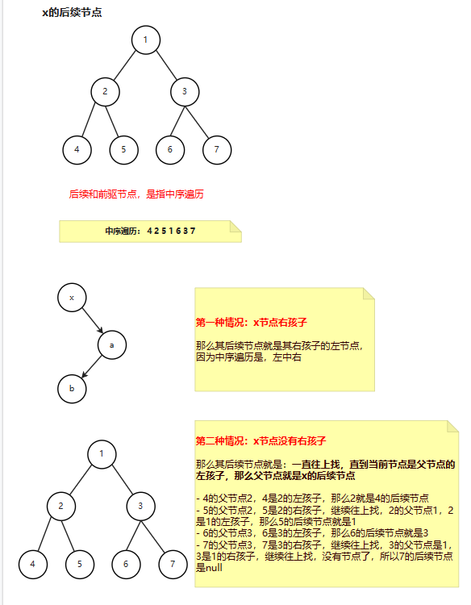
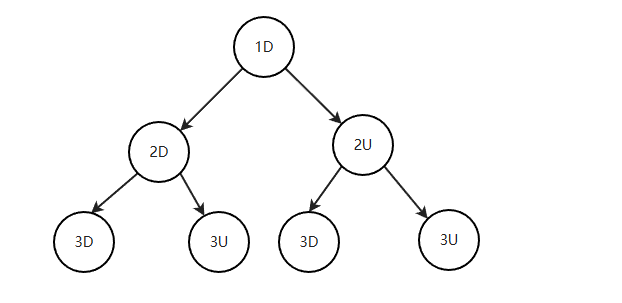
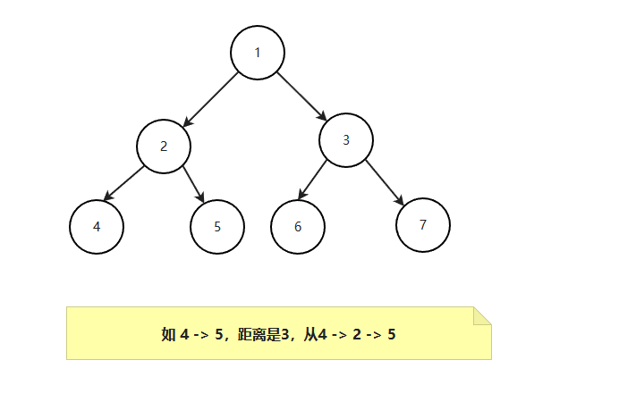
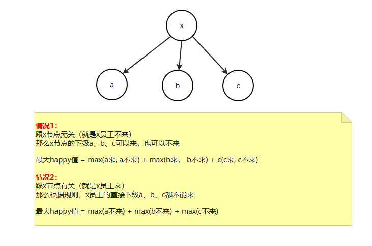
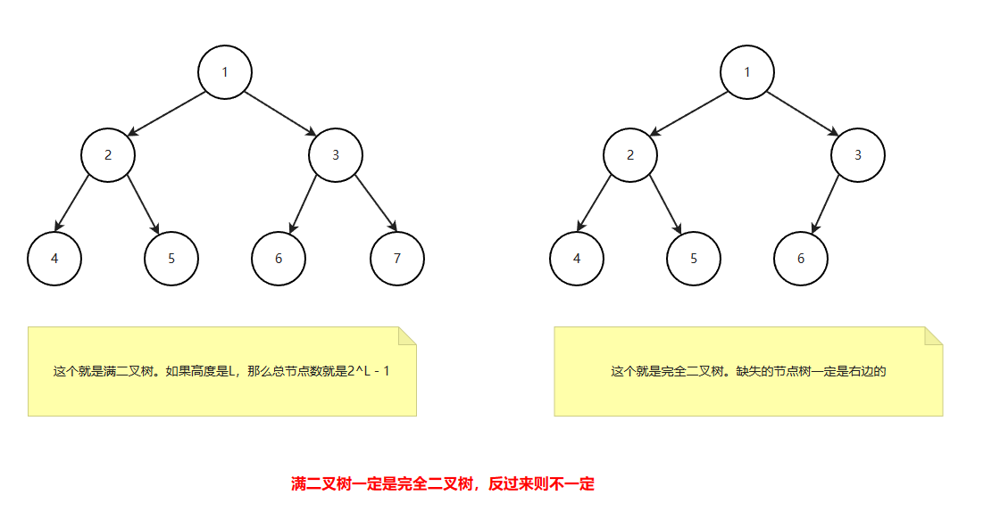
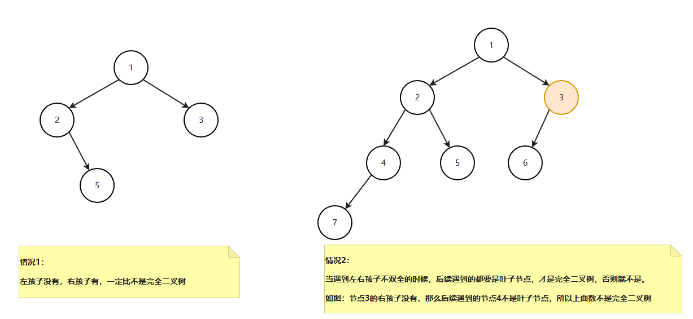
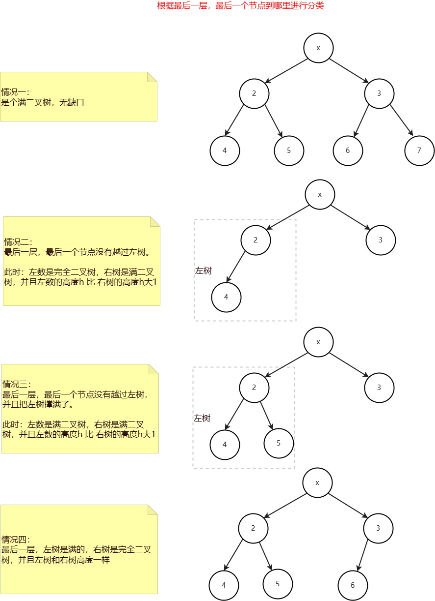

# 如何设计打印一个二叉树

```java
public class Code04_PrintBinaryTree {

    public static class Node {
        public int value;
        public Node left;
        public Node right;

        public Node(int data) {
            this.value = data;
        }
    }

    public static void printTree(Node head) {
        System.out.println("Binary Tree:");
        printInOrder(head, 0, "H", 17);
        System.out.println();
    }

    public static void printInOrder(Node head, int height, String to, int len) {
        if (head == null) {
            return;
        }
        printInOrder(head.right, height + 1, "v", len);
        String val = to + head.value + to;
        int lenM = val.length();
        int lenL = (len - lenM) / 2;
        int lenR = len - lenM - lenL;
        val = getSpace(lenL) + val + getSpace(lenR);
        System.out.println(getSpace(height * len) + val);
        printInOrder(head.left, height + 1, "^", len);
    }

    public static String getSpace(int num) {
        String space = " ";
        StringBuilder buf = new StringBuilder();
        for (int i = 0; i < num; i++) {
            buf.append(space);
        }
        return buf.toString();
    }

    public static void main(String[] args) {
        Node head = new Node(1);
        head.left = new Node(-222222222);
        head.right = new Node(3);
        head.left.left = new Node(Integer.MIN_VALUE);
        head.right.left = new Node(55555555);
        head.right.right = new Node(66);
        head.left.left.right = new Node(777);
        printTree(head);
    }
}
```

```shell
Binary Tree:
                                        v66v       
                        v3v       
                                     ^55555555^    
       H1H       
                   ^-222222222^   
                                                         v777v      
                                    ^-2147483648^  
```

# 查找二叉树的后续节点




```java
/**
 * @author liufei
 * @version 1.0.0
 * @description
 * @date 2023/2/9
 */
public class Code06_SuccessorNode {

    public static class Node {
        public int value;
        public Node left;
        public Node right;
        public Node parent;

        public Node(int data) {
            this.value = data;
        }
    }


    public static Node getSuccessorNode(Node node) {
        if (node == null) {
            return node;
        }
        if (node.right != null) {
            // 是其右节点的左孩子
            return getLeftMost(node);
        } else { // 无右孩子
            Node parent = node.parent;
            while (parent != null && parent.right == node) { // 当前节点是其父亲节点右孩子
                node = parent;
                parent = node.parent;
            }
            return parent;
        }
    }

    public static Node getLeftMost(Node node) {
        if (node == null) {
            return node;
        }
        while (node.left != null) {
            node = node.left;
        }
        return node;
    }


    public static void main(String[] args) {
        Node node1 = new Node(1);
        Node node2 = new Node(2);
        Node node3 = new Node(3);
        Node node4 = new Node(4);
        Node node5 = new Node(5);
        Node node6 = new Node(6);
        Node node7 = new Node(7);

        node1.left = node2;
        node1.right = node3;

        node2.left = node4;
        node2.right = node5;
        node2.parent = node1;

        node3.left = node6;
        node3.right = node7;
        node3.parent = node1;

        node4.parent = node2;
        node5.parent = node2;

        node6.parent = node3;
        node7.parent = node3;


        System.out.println(getSuccessorNode(node4).value); // 2
        System.out.println(getSuccessorNode(node5).value); // 1
        System.out.println(getSuccessorNode(node6).value); // 3
        System.out.println(getSuccessorNode(node7)); // null
    }
}
```

这样其时间复杂度就是o(k)，k是当前节点到后续节点走的路


当然也可以二叉树按照中序遍历输出下，然后再找x节点的后续节点，这样时间夫再度就是o(n)

# 纸条对折

```shell
请把一段纸条竖着放在桌子上，然后从纸条的下边向上方对折1次，压出折痕后展开。此时折痕是凹下去的，即折痕突起的方向指向纸条的背面。 如果从纸条的下边向上方连续对折2次，压出折痕后展开，此时有三条折痕，从上到下依次是下折痕、下折痕和上折痕。 
给定一个输入参数N，代表纸条都从下边向上方连续对折N次。 请从上到下打印所有折痕的方向。 

例如:
N=1时，打印: down 
N=2时，打印: down down up 
```

自己动手折折看，每个折痕上面都是down，下面都是up



```java
public class Code08_PaperFolding {

    public static void printAllFolds(int N) {
        printProcess(1, N, true);
    }

    /**
     * 递归打印
     * @param i 节点层数
     * @param N 总层数
     * @param down 是否是down
     */
    public static void printProcess(int i, int N, boolean down) {
        if (i > N) {
            return;
        }
        printProcess(i + 1, N, true);
        System.out.println(down ? "down" : "up");
        printProcess(i + 1, N, false);
    }

    public static void main(String[] args) {
        int N = 3;
        printAllFolds(N);
    }
}
```

# 二叉树的递归套路

1）假设以X节点为头，假设可以向X左树和X右树要任何信息

2）在上一步的假设下，讨论以X为头节点的树，得到答案的可能性（最重要）

3）列出所有可能性后，确定到底需要向左树和右树要什么样的信息

4）把左树信息和右树信息求全集，就是任何一棵子树都需要返回的信息S

5）递归函数都返回S，每一棵子树都这么要求

6）写代码，在代码中考虑如何把左树的信息和右树信息整合出整棵树的信息

# 判断平衡二叉树

给定一棵二叉树的头节点head，返回这颗二叉树是不是平衡二叉树

Q：什么是平衡树？

S：左树整体是平衡，右树整体也是平衡，左树 和 右树的高度差不能超过1

> 如果当前节点为null，那么高度是0，是平衡的
>
> 我们需要左树整体是平衡，右数整体也是平衡，并且左树的高度和右树的高度差不超过1

```java
public static class TreeNode {
    int val;
    TreeNode left;
    TreeNode right;

    TreeNode(int x) {
        val = x;
    }

    TreeNode(int x, TreeNode left, TreeNode right) {
        val = x;
        this.left = left;
        this.right = right;
    }
}

public static class TreeInfo {
    public boolean isBalance;
    public int height;

    public TreeInfo() {
    }

    public TreeInfo(int height, boolean isBalance) {
        this.height = height;
        this.isBalance = isBalance;
    }
}


public static boolean isBalanced(TreeNode root) {
    return dfsTree(root).isBalance;
}


public static TreeInfo dfsTree(TreeNode root) {
    if (root == null) {
        return new TreeInfo(0, true);
    }
    TreeInfo leftInfo = dfsTree(root.left);
    TreeInfo rightInfo = dfsTree(root.right);
    int height = Math.max(leftInfo.height, rightInfo.height) + 1;
    if (leftInfo.isBalance && 
        rightInfo.isBalance && 
        Math.abs(leftInfo.height - rightInfo.height) <= 1) {
        return new TreeInfo(height, true);
    }
    return new TreeInfo(height, false);
}


public static void main(String[] args) {
    TreeNode root = new TreeNode(1, null, new TreeNode(2, null, new TreeNode(3)));
    System.out.println(isBalanced(root));
}
```

或者

```java
 public boolean isBalanced(TreeNode root) {
     if (root == null) {
         return true;
     } else {
         return Math.abs(height(root.left) - height(root.right)) <= 1 && 
             isBalanced(root.left) && 
             isBalanced(root.right);
     }
 }

public int height(TreeNode root) {
    if (root == null) {
        return 0;
    } else {
        return Math.max(height(root.left), height(root.right)) + 1;
    }
}
```

# 求整棵二叉树的最大距离

给定一棵二叉树的头节点head，任何两个节点之间都存在距离，返回整棵二叉树的最大距离



> **分情况讨论：**
>
> （1）跟head节点无关（就是不经过head节点），那么最大距离，就是左树的最大距离 和 右数最大距离中的最大值
>
> （2）跟head节点有关（就是经过head节点），那么最大距离就是左数的最底层的节点 到 右树最底层节点再加上head节点，即 leftHeight + rightHeight + 1（左树的高度 + 右数的高度 + 1）
>
> 
>
> **套用上面递归的方法**
>
> 我们需要问左（右）数要两个信息，一个是高度(height)，一个是maxDistance（最大距离）

```java
public class Code09_MaxDistance {


    public static class TreeNode {
        int val;
        TreeNode left;
        TreeNode right;

        TreeNode(int x) {
            val = x;
        }

        TreeNode(int x, TreeNode left, TreeNode right) {
            val = x;
            this.left = left;
            this.right = right;
        }
    }

    public static class TreeInfo {
        public int maxDistance;
        public int height;

        public TreeInfo() {
        }

        public TreeInfo(int height, int maxDistance) {
            this.height = height;
            this.maxDistance = maxDistance;
        }
    }


    public static int maxDistance(TreeNode root) {
        return dfsTree(root).maxDistance;
    }


    public static TreeInfo dfsTree(TreeNode root) {
        if (root == null) {
            // 节点为空，高度和距离都是0
            return new TreeInfo(0, 0);
        }
        TreeInfo leftInfo = dfsTree(root.left);
        TreeInfo rightInfo = dfsTree(root.right);
        int height = Math.max(leftInfo.height, rightInfo.height) + 1;
        // 跟head节点无关的最大值
        int maxDistance1 = Math.max(leftInfo.maxDistance, rightInfo.maxDistance);
        // 跟head节点有关的最大值
        int maxDistance2 = leftInfo.height + rightInfo.height + 1;
        int maxDistance = Math.max(maxDistance1, maxDistance2);
        return new TreeInfo(height, maxDistance);
    }


    public static void main(String[] args) {
        TreeNode root = new TreeNode(1, null, new TreeNode(2, null, new TreeNode(3)));
        System.out.println(maxDistance(root));
    }
}
```

# 返回最大的二叉搜索子树的字节数

Q：什么是二叉搜索树

S：对于每个节点树，左节点值比头节点小，右节点值比头节点大


如上图，就是一个搜索二叉树。必须所有节点都满足条件，只要有一个不满足，就不是搜索二叉树

**分析：**

> 1. 跟头节点X无关，那么就是左孩子的字节数和右孩子的节点树取最大值，前提是左孩子和右孩子都是搜索二叉树
> 2. 跟头节点有关，那么就是左孩子的字节数和右孩子的节点树取最大值 + 头节点，前提是左孩子和右孩子都是搜索二叉树，并且左孩子的最大值 < x.value and 右孩子的最小值 > x.value（保证以头节点X开始，是搜索二叉树）

套递归套路

> **我们需要向左孩子要什么信息：**
>
> 1.  是不是搜索二叉树 (isAllBST) 
> 2.  最大节点数(maxSubBSTSize)
> 3. 最大值 max
>
> **我们需要向右孩子要什么信息：**
>
> 1.  是不是搜索二叉树 (isAllBST) 
> 2.  最大节点数(maxSubBSTSize)
> 3. 最小值 min

我们定义一个TreeInfo对象来保存信息，我们需要把最大值和最小值属性都带上，这样左子树和右子树才能共用一个TreeInfo对象

```java
public static class TreeInfo {
    public boolean isAllBST;
    public int maxSubBSTSize;
    public int min;
    public int max;

    public TreeInfo(boolean isAllBST, int maxSubBSTSize, int min, int max) {
        this.isAllBST = isAllBST;
        this.maxSubBSTSize = maxSubBSTSize;
        this.min = min;
        this.max = max;
    }
}
```

```java
public static TreeInfo getMaxSubBSTSize(TreeNode root) {
    if (root == null) {
        // 空节点是搜索二叉树。但是最大值和最小值不好设置，所以这里返回null，后面使用的时候，需要判null
        return null;
    }

    TreeInfo leftInfo = getMaxSubBSTSize(root.left);
    TreeInfo rightInfo = getMaxSubBSTSize(root.right);

    int min = root.val;
    int max = root.val;
    int maxSubBSTSize = 0;

    if (leftInfo != null) {
        min = Math.min(leftInfo.min, min);
        max = Math.max(leftInfo.max, max);
        maxSubBSTSize = leftInfo.maxSubBSTSize;
    }

    if (rightInfo != null) {
        min = Math.min(rightInfo.min, min);
        max = Math.max(rightInfo.max, max);
        maxSubBSTSize = Math.max(maxSubBSTSize, rightInfo.maxSubBSTSize);
    }

    boolean isAllBST = false;
    // 这个条件是：
    // 1) 左子树是二叉搜索树
    // 2) 右子树是二叉总所树
    // 3) 并且以当前头节点的二叉树是二叉搜索树 (leftTree.max < x.val && rightTree.min > x.val)
    if (
            (leftInfo == null || leftInfo.isAllBST) &&    // 左子树是二叉搜搜树
                    (rightInfo == null || rightInfo.isAllBST) &&    // 右子树是二叉搜搜树
                    (leftInfo == null || leftInfo.max < root.val) && (rightInfo == null || rightInfo.min > root.val) // 当前头节点的二叉树是二叉搜索树
    ) {

        maxSubBSTSize = (leftInfo == null ? 0 : leftInfo.maxSubBSTSize) + (rightInfo == null ? 0 : rightInfo.maxSubBSTSize) + 1;
        isAllBST = true;

    }
    return new TreeInfo(isAllBST, max, min, max);
}
```

练习下这题：[1373. 二叉搜索子树的最大键值和 - 力扣（LeetCode）](https://leetcode.cn/problems/maximum-sum-bst-in-binary-tree/)

# 二叉树中最大的二叉搜索子树的头节点

定义Info信息

```java
 public static class Info {
     public TreeNode maxSubBSTHead; // 最大二叉搜索子树的头节点
     public int maxSubBSTSize; // 最大二叉搜索子树的节点数
     public int min;  // 最大值
     public int max;  // 最小值
     // public boolean isAllBST;  // 是否是二叉搜索子树，这个属性可以不要

     public Info(TreeNode maxSubBSTHead, int maxSubBSTSize, int min, int max) {
         this.maxSubBSTHead = maxSubBSTHead;
         this.maxSubBSTSize = maxSubBSTSize;
         this.min = min;
         this.max = max;
     }
 }
```

完整代码：

```java
public static TreeNode maxSubBSTHead(TreeNode root) {
    if (root == null) {
        return null;
    }
    Info info = process(root);
    return info.maxSubBSTHead;
}

public static Info process(TreeNode root) {
    if (root == null) {
        return null;
    }
    Info leftInfo = process(root.left);
    Info rightInfo = process(root.right);
    int min = root.val;
    int max = root.val;
    TreeNode maxSubBSTHead = null;
    int maxSubBSTSize = 0;
    if (leftInfo != null) {
        min = Math.min(leftInfo.min, min);
        max = Math.max(leftInfo.max, max);
        maxSubBSTSize = leftInfo.maxSubBSTSize;
        maxSubBSTHead = leftInfo.maxSubBSTHead;
    }
    if (rightInfo != null) {
        min = Math.min(rightInfo.min, min);
        max = Math.max(rightInfo.max, max);
        // 说明右节点的数目多
        if (rightInfo.maxSubBSTSize > maxSubBSTSize) {
            maxSubBSTSize = rightInfo.maxSubBSTSize;
            maxSubBSTHead = rightInfo.maxSubBSTHead;
        }
    }

    if (
        // 最大子树的头节点等于当前节点，说明整个数都是搜索二叉树
        (leftInfo == null || leftInfo.maxSubBSTHead == root.left) &&
        (rightInfo == null || rightInfo.maxSubBSTHead == root.right) &&
        (leftInfo == null || leftInfo.max < root.val) &&
        (rightInfo == null || rightInfo.min > root.val)

    ) {
        maxSubBSTHead = root;

        maxSubBSTSize = (leftInfo == null ? 0 : leftInfo.maxSubBSTSize) + (rightInfo == null ? 0 : rightInfo.maxSubBSTSize) + 1;
    }
    return new Info(maxSubBSTHead, maxSubBSTSize, min, max);
}
```


# 派对的最大快乐值

> **题目内容：**
>
> 公司的每个员工都符合 Employee 类的描述。整个公司的人员结构可以看作是一棵标准的、 没有环的多叉树。树的头节点是公司唯一的老板。除老板之外的每个员工都有唯一的直接上级。 叶节点是没有任何下属的基层员工(subordinates列表为空)，除基层员工外，每个员工都有一个或多个直接下级。
>
> 这个公司现在要办party，你可以决定哪些员工来，哪些员工不来，
>
> 规则：
>
> 1.如果某个员工来了，那么这个员工的所有直接下级都不能来
>
> 2.派对的整体快乐值是所有到场员工快乐值的累加
>
> 3.你的目标是让派对的整体快乐值尽量大给定一棵多叉树的头节点boss，请返回派对的最大快乐值。



我们需要子节点要两个信息，一个是来的最大happy值，一个是不来的最大happy值

定义info信息

```java
public static class Info {
    public int comeMaxHappy;
    public int notComeMaxHappy;

    public Info() {
    }

    public Info(int comeMaxHappy, int notComeMaxHappy) {
        this.comeMaxHappy = comeMaxHappy;
        this.notComeMaxHappy = notComeMaxHappy;
    }
}
```

完整代码：

```java
static class Employee {
    public int happy; // 这名员工可以带来的快乐值
    List<Employee> subordinates; // 这名员工有哪些直接下级

    public Employee() {
    }

    public Employee(int happy) {
        this.happy = happy;
    }
}


public static class Info {
    public int comeMaxHappy;
    public int notComeMaxHappy;

    public Info() {
    }

    public Info(int comeMaxHappy, int notComeMaxHappy) {
        this.comeMaxHappy = comeMaxHappy;
        this.notComeMaxHappy = notComeMaxHappy;
    }
}


public static int maxHappy(Employee employee) {
    Info info = process(employee);
    return Math.max(info.comeMaxHappy, info.notComeMaxHappy);
}


public static Info process(Employee employee) {
    if (employee.subordinates == null || employee.subordinates.isEmpty()) {
        return new Info(employee.happy, 0);
    }
    int comeMaxHappy = employee.happy;
    int notComeMaxHappy = 0;

    for (Employee subEmployee : employee.subordinates) {
        Info info = process(subEmployee);
        comeMaxHappy += info.notComeMaxHappy;
        notComeMaxHappy += Math.max(info.comeMaxHappy, info.notComeMaxHappy);
    }
    return new Info(comeMaxHappy, notComeMaxHappy);
}


public static void main(String[] args) {
    Employee employee = new Employee(10);
    List<Employee> employees = new ArrayList<>();
    Employee employee1 = new Employee(100);
    Employee employee2 = new Employee(200);
    Employee employee3 = new Employee(300);
    employees.add(employee1);
    employees.add(employee2);
    employees.add(employee3);
    employee.subordinates = employees;

    System.out.println(maxHappy(employee));
}
```

# 判断是不是满二叉树

需要知道什么是满二叉树



> 思路：
>
> 我们可以求出整个数的高度和节点数目。如果其等于 2^L - 1 == nodes，那么就是满二叉树
>
> 我们需要知道左（右）孩子的高度height 和 子树数量nodes

定义Info信息

```java
 public static class Info {
     public int height;
     public int nodes;

     public Info(int height, int nodes) {
         this.height = height;
         this.nodes = nodes;
     }
 }
```

```java
public static class TreeNode {
    int val;
    TreeNode left;
    TreeNode right;

    TreeNode(int x) {
        val = x;
    }

    TreeNode(int x, TreeNode left, TreeNode right) {
        val = x;
        this.left = left;
        this.right = right;
    }
}

public static boolean isFull(TreeNode root) {
    if (root == null) {
        return true;
    }
    Info info = process(root);
    return (1 << info.height) - 1 == info.nodes;
}

public static Info process(TreeNode root) {
    if (root == null) {
        return new Info(0, 0);
    }
    Info leftInfo = process(root.left);
    Info rightInfo = process(root.right);
    int height = Math.max(leftInfo.height, rightInfo.height) + 1;
    int nodes = leftInfo.nodes + rightInfo.nodes + 1;
    return new Info(height, nodes);
}

public static void main(String[] args) {
    //TreeNode root = new TreeNode(1, new TreeNode(2), new TreeNode(3));
    TreeNode root = new TreeNode(1, new TreeNode(2), null);
    System.out.println(isFull(root));
}
```

# 判断是不是完全二叉树

##  方法一：宽度优先便遍历

>**分析：**
>
>1. 如果左孩子没有，右孩子有，那么直接return false。
>2. 遇到左右孩子不双全的时候，后序遇到的都要是叶子节点（左右孩子都没有），否则return false



```java
/**
 * 使用宽度优先遍历
 *
 * @param root
 * @return
 */
public boolean isCompleteTree(TreeNode root) {
    if (root == null) {
        return true;
    }
    Queue<TreeNode> queue = new LinkedList<>();
    queue.add(root);
    boolean leaf = false;
    while (!queue.isEmpty()) {
        TreeNode node = queue.poll();
        // 1. 左孩子没有，右孩子右
        if (node.right != null && node.left == null) {
            return false;
        }

        // 2. 情况2，遇到左右孩子不双全，那么后序遇到的都要保证是叶子节点（左右孩子都没有）

        if (leaf && (node.left != null || node.right != null)) {
            return false;
        }

        if (node.left != null) {
            queue.add(node.left);
        }

        if (node.right != null) {
            queue.add(node.right);
        }

        if (node.left == null || node.right == null) {
            leaf = true;
        }
    }
    return true;
}
```

## 方法二：深度优先遍历（使用递归）



**上面四种情况只要有一个成立，就是完全二叉树**

 **按照递归套路我们分析下需要问左孩子和右孩子要什么信息？**

> 对于情况一：我们需要问左孩子要否是满二叉树(isFullTree) 和 高度 height，需要问右孩子要否是满二叉树(isFullTree) 和 高度 height
>
> 对于情况二：我们需要问左孩子要是否是完全二叉树(isCompleteTree) 和 高度 height，需要问右孩子要否是满二叉树(isFullTree) 和 高度 height
>
> 对于情况三：我们需要问左孩子要是否是满二叉树(isFullTree) 和 高度 height，需要问右孩子要否是满二叉树(isFullTree) 和 高度 height
>
> 对于情况四：我们需要问左孩子要是否是满二叉树(isFullTree) 和 高度 height，需要问右孩子要否是完全二叉树(isCompleteTree) 和 高度 height

所以我们定义Info信息如下：

```java
public static class Info {
    public boolean isComplete;
    public boolean isFull;
    public int height;

    public Info(boolean isComplete, boolean isFull, int height) {
        this.isComplete = isComplete;
        this.isFull = isFull;
        this.height = height;
    }
}
```

全部代码

```java
public static class Info {
    public boolean isComplete;
    public boolean isFull;
    public int height;

    public Info(boolean isComplete, boolean isFull, int height) {
        this.isComplete = isComplete;
        this.isFull = isFull;
        this.height = height;
    }
}

public boolean isCompleteTree(TreeNode root) {
    if (root == null) {
        return true;
    }
    return process(root).isComplete;
}

public Info process(TreeNode root) {
    if (root == null) {
        return new Info(true, true, 0);
    }
    Info leftInfo = process(root.left);
    Info rightInfo = process(root.right);
    int height = Math.max(leftInfo.height, rightInfo.height) + 1;
    boolean isFull = leftInfo.isFull && rightInfo.isFull && leftInfo.height == rightInfo.height;
    boolean isComplete = false;
    if (isFull) {
        // 满足情况一：左树满，右数满，并且左树和右数高度相等，那么就是满二叉树，是满二叉树一定是完全二叉树
        isComplete = true;
    } else if (leftInfo.isComplete && rightInfo.isComplete) {  // 左右两个数都是完全二叉树才讨论
        // 满足情况二：左树是完全二叉树，右树是满二叉树，左树高度比右树高度大1
        if (leftInfo.isComplete && rightInfo.isFull && leftInfo.height == rightInfo.height + 1) {
            isComplete = true;
        }
        // 满足情况三：左树是满二叉树，右树是满二叉树，左树高度比右树高度大1
        if (leftInfo.isFull && rightInfo.isFull && leftInfo.height == rightInfo.height + 1) {
            isComplete = true;
        }

        // 满足情况四：左树是满二叉树，右树是完全二叉树，左树高度 等于 右树高度
        if (leftInfo.isFull && rightInfo.isComplete && leftInfo.height == rightInfo.height) {
            isComplete = true;
        }
    }
    return new Info(isComplete, isFull, height);
}
```

力扣相关题目：[958. 二叉树的完全性检验 - 力扣（LeetCode）](https://leetcode.cn/problems/check-completeness-of-a-binary-tree/)

# 最低公共祖先

## 方法一：使用HashMap

我们使用HashMap保存所有节点对应的父节点信息

```java
public TreeNode lowestCommonAncestor(TreeNode root, TreeNode p, TreeNode q) {
    if (root == null) {
        return null;
    }
    // key是当前节点，value是当前节点的父节点
    Map<TreeNode, TreeNode> parentMap = new HashMap<>();
    // 头节点的父节点是null
    parentMap.put(root, null);
    fillParentMap(root, parentMap);

    Set<TreeNode> set = new HashSet<>();
    // 遍历节点
    TreeNode cur = p;
    set.add(cur);
    while (parentMap.get(cur) != null) {
        cur = parentMap.get(cur);
        set.add(cur);
    }
    cur = q;
    while (!set.contains(cur)) {
        cur = parentMap.get(cur);
    }
    return cur;
}

public void fillParentMap(TreeNode root, Map<TreeNode, TreeNode> parentMap) {
    if (root.left != null) {
        parentMap.put(root.left, root);
        fillParentMap(root.left, parentMap);
    }

    if (root.right != null) {
        parentMap.put(root.right, root);
        fillParentMap(root.right, parentMap);
    }
}
```

## 方法二：递归遍历

**分析：**

**讨论跟头节点x的关系**

> 1. p 和 q节点都不在x节点上
> 2. p 和 q 节点有一个在x节点上
> 3. p 和 q 节点都在x节点上
>    1. 左右各一个
>    2. 都在左树上
>    3. 都在右树上
>    4. 有一个在x节点上
>    5. 两个都在x节点上（都不在左右树上）

定心Info信息

```java
public static class Info {
    public TreeNode ans; // 结果，最低公共祖先，如果没有，就是null
    public boolean findP; // 发现P 节点
    public boolean findQ; // 发现Q 节点

    public Info(TreeNode ans, boolean findP, boolean findQ) {
        this.ans = ans;
        this.findP = findP;
        this.findQ = findQ;
    }
}
```

完整代码

```java
public static class Info {
    public TreeNode ans; // 结果，最低公共祖先，如果没有，就是null
    public boolean findP; // 发现P 节点
    public boolean findQ; // 发现Q节点

    public Info(TreeNode ans, boolean findP, boolean findQ) {
        this.ans = ans;
        this.findP = findP;
        this.findQ = findQ;
    }
}

public TreeNode lowestCommonAncestor(TreeNode root, TreeNode p, TreeNode q) {
    if (root == null) {
        return null;
    }
    return process(root, p, q).ans;
}

public Info process(TreeNode root, TreeNode p, TreeNode q) {
    if (root == null) {
        return new Info(null, false, false);
    }
    Info leftInfo = process(root.left, p, q);
    Info rightInfo = process(root.right, p, q);

    boolean findP = root == p || leftInfo.findP || rightInfo.findP;
    boolean findQ = root == q || leftInfo.findQ || rightInfo.findQ;

    TreeNode ans = null;
    // 1. 在左树上发现汇交点
    if (leftInfo.ans != null) {
        ans = leftInfo.ans;
    }
    // 2. 在右树上发现汇交点（左树和右树不可能同时发现汇交点）
    if (rightInfo.ans != null) {
        ans = rightInfo.ans;
    }
    // 3. 左树和右树都没有发现
    if (ans == null) {
        // 但是此时发现了p 和 q，那么汇交点就是root
        if (findP && findQ) {
            ans = root;
        }
    }
    return new Info(ans, findP, findQ);
}
```

力扣相关题：[235. 二叉搜索树的最近公共祖先 - 力扣（LeetCode）](https://leetcode.cn/problems/lowest-common-ancestor-of-a-binary-search-tree/)
