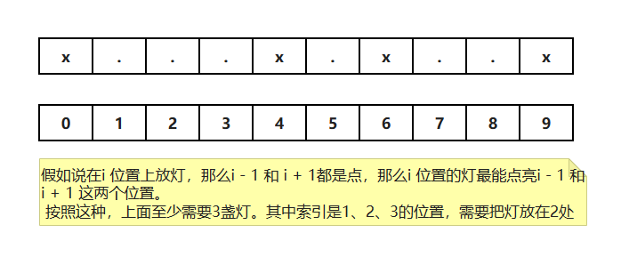

# 贪心算法

1）最自然智慧的算法

2）用一种局部最功利的标准，总是做出在当前看来是最好的选择

3）难点在于证明局部最功利的标准可以得到全局最优解

4）对于贪心算法的学习主要以增加阅历和经验为主

> 每一步只做当前最优解

# 例题：拼接字符串，返回字典序最小的结果

> 给定一个由字符串组成的数组strs，必须把所有的字符串拼接起来，返回所有可能的拼接结果中，字典序最小的结果
>
> 如，String[] strs = { "ac", "bk", "sc", "ket" }  => acbkketsc

Q：什么是字典序？

S：如 abc < abk ,  ac < b，在java中字符串的compareTo()方法就是字典序的比较

## 贪心策略一：先按照每个单词字典序排序（错误的）

我们就产生了贪心的想法，将每个单词按照字典序排序，然后再将整个字符串按照字典序排序，那么就得到了字典序最小的结果？？

这种想法大多数都是对的，但是特殊情况

如：String[] strs = { "ba", "b" } 

按照上面的要求，最小字典序结果是 bba，但是实际最小的是bab

所以刚才的贪心策略无效

## 贪心策略二：X + Y 比 Y + X

如果 X + Y <= Y + X，那么就认为 X 字符串的字典序 比 Y字符串小

Q：那么怎么证明？

S：我们知道数字的比较时具有传递性的。如 3 < 5  , 5 < 7  那么 3 < 7成立

同样我们也需要 证明本地中的字符串排序也具有传递性

如果有传递性，那么对于任意的 

String[] strs = [ 前......后 ]

**前字符串 + 后字符串 <= 后字符串 + 前字符串**

如果有条件：

a + b <= b + a   (a在前)

b + c <= c + b   (b在前)

=> a + c <= c + a  推导出 a相比c，a在前？？证明

```shell
# 证明??

# 什么是字符串的拼接？？

如 str1 = "ks"   str2 = "te"

拼接得到 "kste"

拼接可以这么理解：字符串是k进制的正数

如果字符串 str1 和 str2 拼接得到的 "kste" 可以理解为 "ks" 占据了高位，"te"占据了低位

所以拼接又可以这么写："ks" * 26^2 + "te"，相当于 "ks00"，"te"把00占了

把拼接这个变成数字运算

那么（使用K进制）

a + b
= a * k ^ (b的长度) + b

简化，将 K ^ (x的长度) = m(x)

a + b <= b + a   => a * m(b) + b <= b * m(a) + a      (1)
b + c <= c + b   => b * m(c) + c <= c * m(b) + b      (2)

将公式(1)两边同时 -b 然后再乘以正数c 得  a * m(b) * c <= b * m(a) * c + a * c - b * c    (3)
将公式(2)两边同时 -b 然后再乘以正数a 得  b * m(c) * a + c * a - b * a <= c * m(b) * a    (4)
注意：上面不等式两边乘以的都是正数，所以不会改变不等式的方向

将公式(3) 和 公式 (4) 简化下

b * m(c) * a + c * a - b * a <= c * m(b) * a <= b * m(a) * c + a * c - b * c

所以

b * m(c) * a + c * a - b * a <= b * m(a) * c + a * c - b * c
= b * m(c) * a  - b * a <= b * m(a) * c - b * c   (两边去掉 a * c)
= m(c) * a  - a <= m(a) * c - c   (两边除以 b)
= m(c) * a + c <= m(a) * c + a
=> a + c <= c + a
```

## 方法一：暴力

暴力列举出字符串中所有的组合

然后进行排序

```java
public static String lowestString1(String[] strs) {
    if (strs == null || strs.length == 0) {
        return "";
    }
    TreeSet<String> ans = process(strs);
    return ans.size() == 0 ? "" : ans.first();
}

// strs中所有字符串全排列，返回所有可能的结果
public static TreeSet<String> process(String[] strs) {
    TreeSet<String> ans = new TreeSet<>();
    if (strs.length == 0) {
        ans.add("");
        return ans;
    }
    for (int i = 0; i < strs.length; i++) {
        String first = strs[i];
        String[] nexts = removeIndexString(strs, i);
        TreeSet<String> next = process(nexts);
        for (String cur : next) {
            ans.add(first + cur);
        }
    }
    return ans;
}

private static String[] removeIndexString(String[] arr, int index) {
    int N = arr.length;
    String[] ans = new String[N - 1];
    int ansIndex = 0;
    for (int i = 0; i < arr.length; i++) {
        if (i != index) {
            ans[ansIndex++] = arr[i];
        }
    }
    return ans;
}
```

## 方法二：按照贪心策略二

```java
public static String lowestString2(String[] strs) {
    if (strs == null || strs.length == 0) {
        return "";
    }
    Arrays.sort(strs, new Comparator<String>() {
        @Override
        public int compare(String a, String b) {
            return (a + b).compareTo(b + a);
        }
    });
    StringBuilder res = new StringBuilder();
    for (int i = 0; i < strs.length; i++) {
        res.append(strs[i]);
    }
    return res.toString();
}
```

# 贪心算法求解的标准过程

1，分析业务

2，根据业务逻辑找到不同的贪心策略

3，对于能举出反例的策略直接跳过，不能举出反例的策略要证明有效性

**这往往是特别困难的，要求数学能力很高且不具有统一的技巧性**

# 贪心算法的解题套路

1，实现一个不依靠贪心策略的解法X，可以用最暴力的尝试

2，脑补出贪心策略A、贪心策略B、贪心策略C...

3，用解法X和对数器，用实验的方式得知哪个贪心策略正确 

4，不要去纠结贪心策略的证明 

# 贪心算法的解题套路实战

## 题目一：会议室安排

> 一些项目要占用一个会议室宣讲，会议室不能同时容纳两个项目的宣讲。
>
> 给你每一个项目开始的时间和结束的时间你来安排宣讲的日程，要求会议室进行的宣讲的场次最多。
>
> 返回最多的宣讲场次。 

定义日程类

```java
public static class Program {
    public int start;
    public int end;

    public Program(int start, int end) {
        this.start = start;
        this.end = end;
    }
}
```

### 方法一：暴力

```java
// 暴力！所有情况都尝试！
public static int bestArrange1(Program[] programs) {
    if (programs == null || programs.length == 0) {
        return 0;
    }
    return process(programs, 0, 0);
}


/**
 * 返回能安排的最多会议数量
 *
 * @param programs 剩下的会议programs
 * @param done     之前已经安排了多少会议的数量
 * @param timeLine 目前来到的时间点是什么
 * @return
 */
public static int process(Program[] programs, int done, int timeLine) {
    if (programs.length == 0) {
        // 返回之前安排会议的数量
        return done;
    }
    int max = done;
    for (int i = 0; i < programs.length; i++) {
        if (programs[i].start >= timeLine) {
            Program[] next = copyButExcept(programs, i);
            max = Math.max(max, process(next, done + 1, programs[i].end));
        }
    }
    return max;
}

private static Program[] copyButExcept(Program[] programs, int k) {
    Program[] ans = new Program[programs.length - 1];
    int index = 0;
    for (int i = 0; i < programs.length; i++) {
        if (k != i) {
            ans[index++] = programs[i];
        }
    }
    return ans;
}
```

### 方法二：贪心算法

贪心算法应该怎么个贪心策略了呢？

可以试试相想贪心策略：

1. 按照start时间最早来安排
2. 按照end时间排序进行贪心
3. 按照持续时间最短来安排

对于第一种，举出反例，如果时间是 [6, 23]，那么就只能安排一场，这个肯定不是最有解

对于第三种，按照持续时间最短来安排，如果有时间 [6, 12], [11, 13], [12, 23] 这三个时间段，按照持续时间最短来安排，那么只能安排[11, 13] 的，只有一场，实际最多可以安排2场，[6, 12], [12, 23]

如果按照end时间排序进行贪心，那么就会选出2场，时间是 [6, 12], [12, 23] 的这两场

```java
// 贪心算法
public static int bestArrange2(Program[] programs) {
    if (programs == null || programs.length == 0) {
        return 0;
    }
    Arrays.sort(programs, new Comparator<Program>() {
        @Override
        public int compare(Program o1, Program o2) {
            // 按照结束时间来排序
            return o1.end - o2.end;
        }
    });
    int result = 0;
    int timeLine = 0;
    for (int i = 0; i < programs.length; i++) {
        if (timeLine <= programs[i].start) {
            result++;
            timeLine = programs[i].end;
        }
    }
    return result;
}
```

### 对数器验证

使用对数器随机生成一些时间段，用贪心策略和暴力两种办法解答进行对比。如果没问题，那么就说明当前贪心选的策略就是符合结果的

```java
// for test
public static Program[] generatePrograms(int programSize, int timeMax) {
    Program[] ans = new Program[(int) (Math.random() * (programSize + 1))];
    for (int i = 0; i < ans.length; i++) {
        int r1 = (int) (Math.random() * (timeMax + 1));
        int r2 = (int) (Math.random() * (timeMax + 1));
        if (r1 == r2) {
            ans[i] = new Program(r1, r1 + 1);
        } else {
            ans[i] = new Program(Math.min(r1, r2), Math.max(r1, r2));
        }
    }
    return ans;
}

public static void main(String[] args) {
    int programSize = 12;
    int timeMax = 20;
    int timeTimes = 1000000;
    for (int i = 0; i < timeTimes; i++) {
        Program[] programs = generatePrograms(programSize, timeMax);
        if (bestArrange1(programs) != bestArrange2(programs)) {
            System.out.println("Oops!");
        }
    }
    System.out.println("finish!");
}
```

## 题目二：点亮至少需要几盏灯

> 给定一个字符串str，只由‘X’和‘.’两种字符构成。
>
> ‘X’ 表示墙，不能放灯，也不需要点亮，‘.’表示居民点，可以放灯，需要点亮如果灯放在i位置，
>
> 可以让i-1，i和i+1三个位置被点亮返回如果点亮str中所有需要点亮的位置，至少需要几盏灯



### 方法一：暴力

```java
public static int minLight1(String road) {
    if (road == null || road.length() == 0) {
        return 0;
    }
    return process(road.toCharArray(), 0, new HashSet<Integer>());
}


public static int process(char[] chars, int index, HashSet<Integer> lights) {
    if (index == chars.length) { // 结束的时候
        // 结束的时候，需要判断下是否满足，所有的位置已经被照亮了
        for (int i = 0; i < chars.length; i++) {
            if (chars[i] == 'X') {
                continue;
            }
            // 当前位置是点的话。那么 i - 1, i, i + 1三个点，至少需要有一个是点灯的。
            // 如果都没有点灯，那么就是无效的，不满足所有的点都被照亮
            // 直接返回Integer的最大值
            if (!lights.contains(i - 1) && !lights.contains(i + 1) && !lights.contains(i)) {
                return Integer.MAX_VALUE;
            }
        }
        return lights.size();
    } else {
        // 没有结束的
        // 此时 i 可能是 X 或 .
        // 1. 当前位置不安灯的情况，求个结果
        int no = process(chars, index + 1, lights);
        // 2. 当前位置安灯的情况, 求个结果
        int yes = Integer.MAX_VALUE;
        if (chars[index] == '.') {
            lights.add(index);
            yes = process(chars, index + 1, lights);
            lights.remove(index);
        }
        return Math.min(no, yes);
    }
}
```

### 方法二：贪心


> 分析下当前index的情况
>
> 1. 如果index位置是X，那么当前位置不放灯，下一个需要抉择的点是index+1  
> 2. 如果index位置是点，那么需要看index+1的位置
>    1. 如果index+1是X，那么index位置需要放灯，下一个抉择点是index+2      【点X的情况，在第一个点放灯】
>    2. 如果index+1是点，那么需要看index+2的位置
>       1. 如果index+2是X，那么需要在Index+1处放灯，下一个抉择点是index+3     【点点X的情况，在第二个点放灯】
>       2. 如果index+2是点，那么需要在index+1处放灯，下一个抉择点也是index+3   【点点点的情况，在第二个位置放灯】
>
> 情况一（index是X）不需要放灯
>
> 情况二（index是点）需要放灯

```java
public static int minLight2(String road) {
    if (road == null || road.length() == 0) {
        return 0;
    }
    int light = 0;
    int index = 0;
    while (index < road.length()) {
        if (road.charAt(index) == 'X') {
            index++;
        } else {
            // 肯定需要放灯
            light++;
            // 然后看下一个抉择点的位置
            if (index + 1 == road.length()) {
                break;
            }
            if (road.charAt(index + 1) == 'X') {
                index += 2;
            } else {
                index += 3;
            }
        }
    }
    return light;
```

### 对数器验证

```java
// for test
public static String randomString(int len) {
    char[] res = new char[(int) (Math.random() * len) + 1];
    for (int i = 0; i < res.length; i++) {
        res[i] = Math.random() < 0.5 ? 'X' : '.';
    }
    return String.valueOf(res);
}

public static void main(String[] args) {
    int len = 20;
    int testTime = 100000;
    for (int i = 0; i < testTime; i++) {
        String test = randomString(len);
        int ans1 = minLight1(test);
        int ans2 = minLight2(test);
        if (ans1 != ans2) {
            System.out.println("oops!");
        }
    }
    System.out.println("finish!");
}
```

## 题目三：分金条

```txt
一块金条切成两半，是需要花费和长度数值一样的铜板的。
比如长度为20的金条，不管怎么切，都要花费20个铜板。 一群人想整分整块金条，怎么分最省铜板? 

例如,给定数组{10,20,30}，代表一共三个人，整块金条长度为60，金条要分成10，20，30三个部分。

如果先把长度60的金条分成10和50，花费60; 
再把长度50的金条分成20和30，花费50;
一共花费110铜板。

但如果先把长度60的金条分成30和30，花费60;
再把长度30金条分成10和20， 花费30;
一共花费90铜板。

输入一个数组，返回分割的最小代价。 
```

### 方法一：暴力递归

数组中的元素，两两组合，然后算最小值

```java
// 纯暴力！
public static int lessMoney1(int[] arr) {
    if (arr == null || arr.length == 0) {
        return 0;
    }
    if (arr.length == 1) {
        return arr[0];
    }
    return process(arr, 0);
}

// 等待合并的数都在arr里，pre之前的合并行为产生了多少总代价
// arr中只剩一个数字的时候，停止合并，返回最小的总代价
public static int process(int[] arr, int pre) {
    if (arr.length == 1) {
        return pre;
    }
    int ans = Integer.MAX_VALUE;
    for (int i = 0; i < arr.length; i++) {
        for (int j = i + 1; j < arr.length; j++) {
            ans = Math.min(ans, process(copyAndMergeTwo(arr, i, j), pre + arr[i] + arr[j]));
        }
    }
    return ans;
}

public static int[] copyAndMergeTwo(int[] arr, int i, int j) {
    int[] ans = new int[arr.length - 1];
    int ansi = 0;
    for (int i1 = 0; i1 < arr.length; i1++) {
        if (i1 != i && i1 != j) {
            ans[ansi++] = arr[i1];
        }
    }
    ans[ansi] = arr[i] + arr[j];
    return ans;
}
```

### 方法二：使用小根堆

>假设arr = {10, 20, 30}, 放到小堆中
>
>先弹出 10和20，需要花费30个铜板
>
>再将 10 + 20 = 30 放入小堆中
>
>再弹出 30 和 30，需要花费60个铜板，结束
>
>总共需要90个铜板，花费最小

```java
public static int lessMoney2(int[] arr) {
    if (arr == null || arr.length == 0) {
        return 0;
    }
    PriorityQueue<Integer> queue = new PriorityQueue<>();
    for (int i : arr) {
        queue.add(i);
    }
    int ans = 0;
    while (queue.size() > 1) {
        int sum = queue.poll() + queue.poll();
        ans += sum;
        queue.add(sum);
    }
    return ans;
}
```

**总结：贪心算法通常会使用大堆或者小堆或者排序来解决**

扩展知识：[数据结构——哈夫曼树（Huffman Tree） - 知乎 (zhihu.com)](https://zhuanlan.zhihu.com/p/415467000)

### 对数器验证

```java
// for test
public static int[] generateRandomArray(int maxSize, int maxValue) {
    int[] arr = new int[(int) ((maxSize + 1) * Math.random())];
    for (int i = 0; i < arr.length; i++) {
        arr[i] = (int) (Math.random() * (maxValue + 1));
    }
    return arr;
}


public static void main(String[] args) {
    int testTime = 100000;
    int maxSize = 6;
    int maxValue = 1000;
    for (int i = 0; i < testTime; i++) {
        int[] arr = generateRandomArray(maxSize, maxValue);
        if (lessMoney1(arr) != lessMoney2(arr)) {
            System.out.println("Oops!");
        }
    }
    System.out.println("finish!");
}
```

## 题目四：做项目

```txt
输入: 正数数组costs、正数数组profits、正数K、正数M
costs[i]表示i号项目的花费
profits[i]表示i号项目在扣除花费之后还能挣到的钱(利润)
K表示你只能串行的最多做k个项目
M表示你初始的资金
说明: 每做完一个项目，马上获得的收益，可以支持你去做下一个项目。不能并行的做项目。
输出：你最后获得的最大钱数。
```

https://leetcode.cn/problems/ipo/

Q：怎么贪心？

S：1) 按照收益率 2） 按照收益额

**如果按照收益率**：假如第一个项目cost = 1, profit = 100万，第二个项目 cost = 200万，profit = 1000万，初始资金w = 200万，k = 1, 如果按照收益率，应该选择第一个项目，但是实际上选择第二个项目最后获取的前最大

**如果按照收益额**：再力所能及的情况下选择收益额最大的。就是初始资金够，花费少，收益大。这个就像我们打怪升级，一开始我花费钱买装备，怎么选择装备，选择能买得起并且最便宜的，但是收益高的装备


使用两个堆，一个是小根堆（按照花费额放入），一个是大根堆（按照收益额放入）


代码

```java
public static class Program {
    public int profit;
    public int cost;

    public Program(int profit, int cost) {
        this.profit = profit;
        this.cost = cost;
    }
}

public static int findMaximizedCapital(int K, int W, int[] profits, int[] capital) {
    PriorityQueue<Program> minCostQ = new PriorityQueue<>(new MinCostComparator());
    PriorityQueue<Program> maxProfitQ = new PriorityQueue<>(new MaxProfitComparator());
    for (int i = 0; i < profits.length; i++) {
        minCostQ.add(new Program(profits[i], capital[i]));
    }
    // 最多做K个项目
    for (int i = 0; i < K; i++) {
        while (!minCostQ.isEmpty() && minCostQ.peek().cost <= W) {
            maxProfitQ.add(minCostQ.poll());
        }
        // 如果没有拿到i项目，直接返回
        if (maxProfitQ.isEmpty()) {
            return W;
        }
        // 拿一个项目做
        W += maxProfitQ.poll().profit;
    }
    return W;
}


public static class MinCostComparator implements Comparator<Program> {

    @Override
    public int compare(Program o1, Program o2) {
        return o1.cost - o2.cost;
    }

}

public static class MaxProfitComparator implements Comparator<Program> {

    @Override
    public int compare(Program o1, Program o2) {
        return o2.profit - o1.profit;
    }

}
```

相关题目：[502. IPO - 力扣（LeetCode）](https://leetcode.cn/problems/ipo/)
