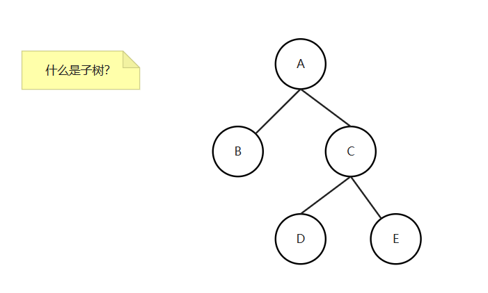
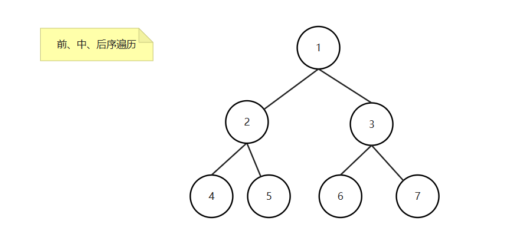
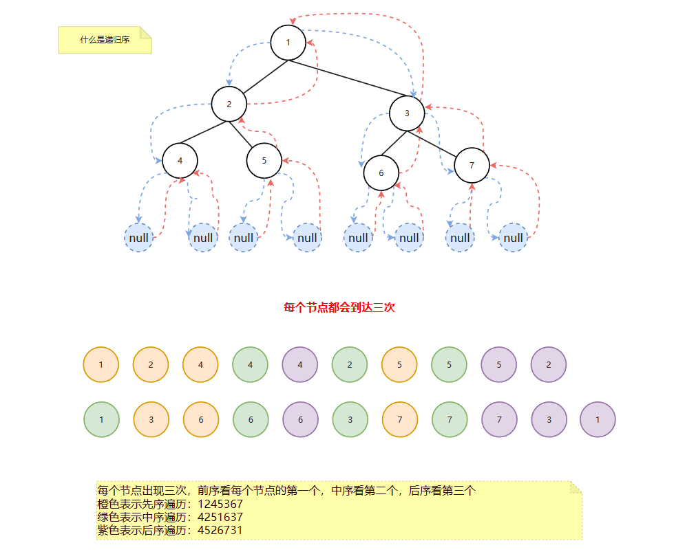
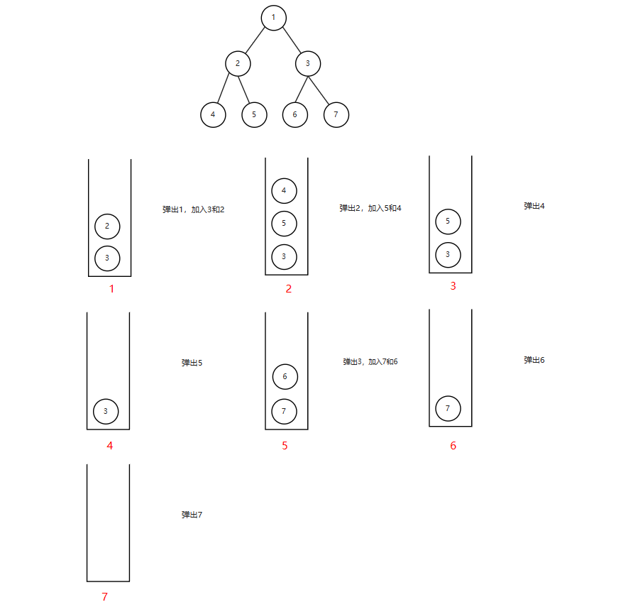
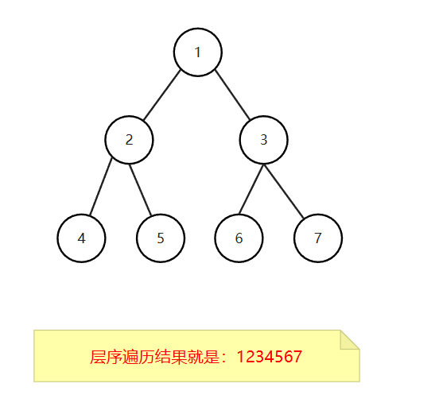

# 1. 二叉树的定义

结构描述：

```java
public class TreeNode<V> {
    V value;
    TreeNode<V> left;
    TreeNode<V> right;
}
```

# 2. 二叉树的前、中、后序

先（前）序：任何**子树**的处理顺序都是，先头节点、再左子树、然后右子树

中序：任何**子树**的处理顺序都是，先左子树、再头节点、然后右子树

后序：任何**子树**的处理顺序都是，先左子树、再右子树、然后头节点

**注意：这里说的前、中、后序，是指头节点的位置**

## 2.1 什么是子树？

是指从某个头节点出发，下面的**所有节点**都要



> 如图所示：C -> E 是子树吗？ 不是
> B 是子树
> C -> D -> E 是子树 

## 2.2 前、中、后续遍历



如上图树所示

前序（先头，在左，最后右）是：1 245 367

中序（先左，在头，最后右）是：425 1 637

后序（先左，在右，最后头）是：452 673 1

## 2.3 代码实现（递归）

```java
public class TreeNode {
    public int value;
    public TreeNode left;
    public TreeNode right;
}

// 前序遍历
public static void preOrder(TreeNode head) {
    if (head == null) {
        return;
    }
    System.out.println(head.value);
    preOrder(head.left);
    preOrder(head.right);
}

// 中序遍历
public static void middleOrder(TreeNode head) {
    if (head == null) {
        return;
    }
    preOrder(head.left);
    System.out.println(head.value);
    preOrder(head.right);
}

// 后序遍历
public static void posOrder(TreeNode head) {
    if (head == null) {
        return;
    }
    preOrder(head.left);
    preOrder(head.right);
    System.out.println(head.value);
}
```

上面三种遍历，就是打印顺序不一样，其他都是一样，其实就是递归序的改变


## 2.4 什么是递归序

```java
public static void f(TreeNode head) {
    if (head == null) {
        return;
    }
    // 1. 打印放在这 -> 先序
    preOrder(head.left);
    // 2. 打印放在这 -> 中序
    preOrder(head.right);
    // 3. 打印放在这 -> 后序
}
```



# 3. 非递归方式实现遍历

1）任何递归函数都可以改成非递归

2）自己设计压栈的来实现

## 3.1 先序遍历

利用栈，先序的顺序是：头、左、右

**步骤：**

1. 弹出就打印
2. 如果有右节点，就加入到栈
3. 如果有左节点，就加入到栈

**注意：后面两个必须先加入右节点，在加入左节点，这样弹出的时候，才是先左，后右**



```java
public static void preOrder(TreeNode head) {
    if (head == null) {
        return;
    }
    Stack<TreeNode> stack = new Stack<>();
    stack.push(head);
    while (!stack.isEmpty()) {
        TreeNode node = stack.pop();
        System.out.println(node.value);
        if (node.right != null) {
            stack.push(node.right);
        }
        if (node.left != null) {
            stack.push(node.left);
        }
    }
}
```

## 3.2 中序遍历

**步骤：**

1. 整条左边界依次入栈
2. 弹出节点，就打印
3. 然后来到弹出节点的右树上

```java
 public void middleOrder(TreeNode head) {
    if (head == null) {
        return;
    }
    Stack<TreeNode> stack = new Stack<>();
    while (!stack.isEmpty() || head != null) {
        if (head != null) {
            stack.push(head);
            head = head.left;
        } else {
            head = stack.pop();
            System.out.println(head.value);
            head = head.right;
        }
    }
}
```

## 3.3 后序遍历

利用栈，后序的顺序是：左、右、头


### 3.3.1 使用额外空间

后序的顺序是：左、右、头。

我们使用一个栈，按照 头、右、左节点的顺序加入到栈，那么弹出的时候，再打印，就是后序遍历


**步骤：**
1. 弹出的加入到ans栈中
2. 如果有左，加入左。
3. 如果有右，加入右。（这样加入到ans的顺序就是 右、左）
4. 依次弹出ans栈中的节点，弹出一个打印一下值

```java
public static void posOrder(TreeNode head) {
    if (head == null) {
        return;
    }
    Stack<TreeNode> ans = new Stack<>();
    Stack<TreeNode> stack = new Stack<>();
    stack.push(head);
    while (!stack.isEmpty()) {
        TreeNode node = stack.pop();
        ans.add(node);
        if (node.left != null) {
            stack.push(node.left);
        }

        if (node.right != null) {
            stack.push(node.right);
        }
    }
    while (!ans.isEmpty()) {
        System.out.println(ans.pop().value);
    }
}
```

### 3.3.2 不使用额外空间

```java
public static void posOrder(TreeNode head) {
    // head 跟踪的是上次打印的节点
    if (head == null) {
        return;
    }
    Stack<TreeNode> stack = new Stack<>();
    stack.push(head);
    TreeNode cur = null;
    while (!stack.isEmpty()) {
        cur = stack.peek();
        // 如果上次打印的节点不是左节点和右节点，那就说明是个新节点，直接压入到栈
        if (cur.left != null && head != cur.left && head != cur.right) {
            stack.push(cur.left);
        } else if (cur.right != null && head != cur.right) {
            // 如果上次打印的节点不是右节点，直接压入右节点
            stack.push(cur.right);
        } else {
            // 如果左右节点都打印，那么弹出当前节点
            TreeNode node = stack.pop();
            System.out.println(node.value);
            head = cur;
        }
    }
}
```

# 4. 二叉树的层序遍历

层序遍历，使用队列



一弹出就打印，先左节点，再右节点

```java
 public static void level(TreeNode head) {
    if (head == null) {
        return;
    }
    Queue<TreeNode> queue = new LinkedList<>();
    queue.add(head);
    while (!queue.isEmpty()) {
        int size = queue.size();
        for (int i = 0; i < size; i++) {
            TreeNode node = queue.poll();
            System.out.println(node.value);
            if (node.left != null) {
                queue.add(node.left);
            }
            if (node.right != null) {
                queue.add(node.right);
            }
        }
    }
}

public static void level2(TreeNode head) {
    if (head == null) {
        return;
    }
    Queue<TreeNode> queue = new LinkedList<>();
    queue.add(head);
    while (!queue.isEmpty()) {
        TreeNode node = queue.poll();
        System.out.println(node.value);
        if (node.left != null) {
            queue.add(node.left);
        }
        if (node.right != null) {
            queue.add(node.right);
        }
    }
}
```

# 5. 统计二叉树的最大宽度

我们只需要记住每一层的开始节点或结束节点


## 5.1 最简答的方法

```java
// 最简单的做法
public static int maxWidth(TreeNode head) {
    if (head == null) {
        return 0;
    }
    Queue<TreeNode> queue = new LinkedList<>();
    queue.add(head);
    int max = 0;
    while (!queue.isEmpty()) {
        int size = queue.size();
        max = Math.max(size, max);
        for (int i = 0; i < size; i++) {
            TreeNode node = queue.poll();
            if (node.left != null) {
                queue.add(node.left);
            }
            if (node.right != null) {
                queue.add(node.right);
            }
        }
    }
    return max;
}
```

## 5.2 使用Map

```java
public static int maxWidth(TreeNode head) {
    if (head == null) {
        return 0;
    }
    // key是节点，value表示当前节点所在的层数
    Map<TreeNode, Integer> mapLevel = new HashMap<>();
    Queue<TreeNode> queue = new LinkedList<>();
    queue.add(head);
    mapLevel.put(head, 1);
    int curLevel = 1; // 当前所在层，从1开始
    int curLevelNodes = 0;  // 当前层，节点的数量。我们从0开始，因为到下层的时候，才会开始计算上一层的节点数
    int max = 0;
    while (!queue.isEmpty()) {
        TreeNode node = queue.poll();
        int curNodeLevel = mapLevel.get(node);
        if (node.left != null) {
            mapLevel.put(node.left, curNodeLevel + 1);
            queue.add(node.left);
        }
        if (node.right != null) {
            mapLevel.put(node.right, curNodeLevel + 1);
            queue.add(node.right);
        }

        if (curLevel == curNodeLevel) {
            // 如果相当，说明当前层还没有处理完，当前层数量++
            curLevelNodes++;
        } else {
            // 说明到下一层，开始计算max
            max = Math.max(curLevelNodes, max);
            curLevel++;
            // 这里从1开始
            curLevelNodes = 1;
        }
    }
    // 因为到下层的时候，才会开始计算上一层的节点数，最后一层没有下一层，所以最后再计算下
    max = Math.max(max, curLevelNodes);
    return max;
}
```

## 5.2 不使用Map

```java
public static int maxWidth3(TreeNode head) {
    if (head == null) {
        return 0;
    }
    Queue<TreeNode> queue = new LinkedList<>();
    queue.add(head);
    TreeNode curEnd = head;
    TreeNode nextEnd = null;
    int curLevelNode = 0;  // 当前层节点数量
    int max = 0;
    while (!queue.isEmpty()) {
        TreeNode node = queue.poll();
        if (node.left != null) {
            queue.add(node.left);
            nextEnd = node.left;
        }
        if (node.right != null) {
            queue.add(node.right);
            nextEnd = node.right;
        }
        curLevelNode++;
        if (node == curEnd) {
            // 开始计算
            max = Math.max(max, curLevelNode);
            curEnd = nextEnd;
            curLevelNode = 0;
        }
    }
    return max;
}
```

# 6. 二叉树的序列化和反序列化

1）可以用先序、后序或者按层遍历，来实现二叉树的序列化

2）用了什么方式序列化，就用什么样的方式反序列化

**注意：把null节点带上**

## 6.1 不能使用中序遍历

为什么不能使用中序遍历序列化和反序列？

因为不同的两棵树，可能得到同样的中序序列，即便补了空位置也可能一样。


## 6.2 使用前序遍历

序列化

```java
/**
 * 前序遍历序列化树
 *
 * @param head
 * @return
 */
public static Queue<String> preSerial(Node head) {
    Queue<String> ans = new LinkedList<>();
    pres(head, ans);
    return ans;
}

private static void pres(Node head, Queue<String> ans) {
    if (head == null) {
        ans.add(null);
    } else {
        ans.add(String.valueOf(head.value));
        pres(head.left, ans);
        pres(head.right, ans);
    }
}
```

反序列化

```java
/**
 * 前序遍历反序列化
 *
 * @param prelist
 * @return
 */
public static Node preReverseSerial(Queue<String> prelist) {
    String value = prelist.poll();
    if (value == null) {
        return null;
    }
    Node head = new Node(Integer.parseInt(value));
    head.left = preReverseSerial(prelist);
    head.right = preReverseSerial(prelist);
    return head;
}
```

## 6.3 使用后序遍历

**后序遍历是：左右头。我们使用栈存储，取数据就是头右左**

```java
/**
 * 后序遍历序列化树
 *
 * @param head
 * @return
 */
public static Stack<String> posSerial(Node head) {
    Stack<String> ans = new Stack<>();
    pos(head, ans);
    return ans;
}

private static void pos(Node head, Stack<String> ans) {
    if (head == null) {
        ans.add(null);
    } else {
        pos(head.left, ans);
        pos(head.right, ans);
        ans.add(String.valueOf(head.value));
    }
}

/**
 * 后序遍历反序列化
 *
 * @param posList
 * @return
 */
public static Node posReverseSerial(Stack<String> posList) {
    String value = posList.pop();
    if (value == null) {
        return null;
    }
    Node head = new Node(Integer.parseInt(value));
    head.right = posReverseSerial(posList);
    head.left = posReverseSerial(posList);
    return head;
}
```

## 6.4 层序遍历

```java
/**
 * 层序遍历
 * @param head
 * @return
 */
public static Queue<String> levelSerial(Node head) {
    Queue<String> ans = new LinkedList<>();
    if (head == null) {
        ans.add(null);
    } else {
        ans.add(String.valueOf(head.value));
        Queue<Node> queue = new LinkedList<>();
        queue.add(head);
        while (!queue.isEmpty()) {
            Node node = queue.poll();
            // 如果不等于 null，即加队列，也加节点，如果等于null，只加节点值
            if (node.left != null) {
                ans.add(String.valueOf(node.left.value));
                queue.add(node.left);
            } else {
                ans.add(null);
            }

            if (node.right != null) {
                ans.add(String.valueOf(node.right.value));
                queue.add(node.right);
            } else {
                ans.add(null);
            }
        }
    }
    return ans;
}

/**
 * 层序遍历反序列化
 * @param levelList
 * @return
 */
public static Node buildByLevelQueue(Queue<String> levelList) {
    if (levelList == null || levelList.isEmpty()) {
        return null;
    }
    Node head = generateNode(levelList.poll());
    Queue<Node> queue = new LinkedList<>();
    if (head != null) {
        queue.add(head);
    }
    while (!queue.isEmpty()) {
        Node node = queue.poll();
        node.left = generateNode(levelList.poll());
        node.right = generateNode(levelList.poll());

        if (node.left != null) {
            queue.add(node.left);
        }

        if (node.right != null) {
            queue.add(node.right);
        }
    }
    return head;
}

private static Node generateNode(String val) {
    if (val == null) {
        return null;
    }
    return new Node(Integer.parseInt(val));
}
```