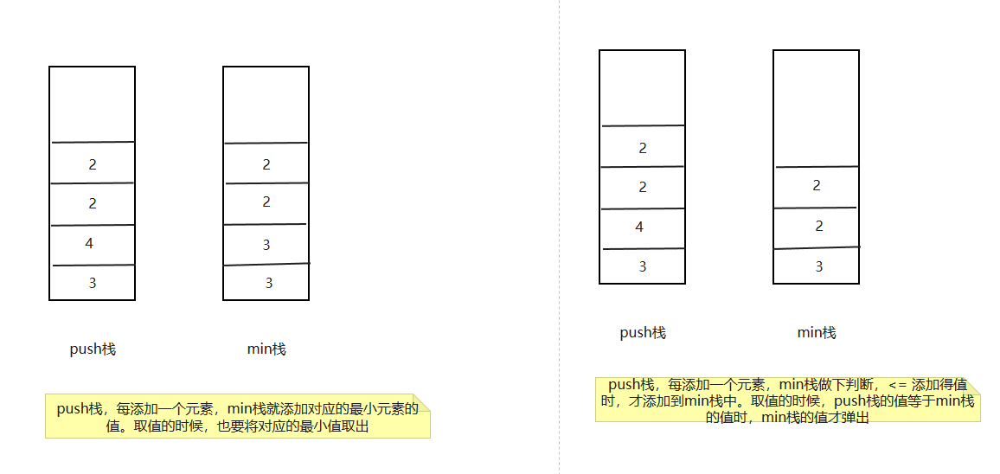
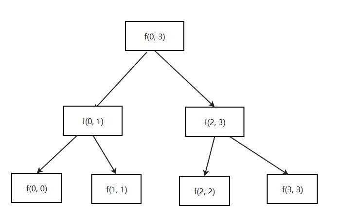

# 1. 链表

链表分为单链表、双链表、循环单链表。这里主要将单链表和双链表

## 1.1 定义链表代码

```java
public class Node {

    public int value;

    public Node next;

    public Node(int value) {
        this.value = value;
    }

    public Node(int value, Node next) {
        this.value = value;
        this.next = next;
    }
}
```

单向链表和双向链表最简单的练习

链表相关的问题几乎都是coding问题

- 单链表和双链表如何反转

- 把给定值都删除

这里就是熟悉结构。链表还有哪些常见面试题，后续有专门一节来系统学习。


```java
public class DoubleNode {

    public int value;

    public DoubleNode left;

    public DoubleNode right;

    public DoubleNode(int data) {
        value = data;
    }
}
```

## 1.2 单链表和双链表的反转

```java
// 单链表反转
public static Node reverse(Node head) {
    Node pre = null;
    Node next = null;
    while (head != null) {
        next = head.next;

        head.next = pre;
        pre = head;

        head = next;
    }
    return pre;
}
```

```java
// 双链表反转
public static DoubleNode reverse(DoubleNode head) {
    DoubleNode pre = null;
    DoubleNode next = null;
    while (head != null) {
        next = head.next;

        head.next = pre;
        head.pre = next;
        pre = head;

        head = next;
    }
    return pre;
}
```

## 1.3 给定值并删除
```java
 public static Node removeValue(Node head, int num) {
    // 找到第一个不是num的头部
    while (head != null) {
        if (head.value != num) {
            break;
        }
        head = head.next;
    }
    // head来到第一个不要删除的元素
    Node pre  = head;
    Node cur  = head;
    while (cur != null) {
        if (cur.value == num) {
            pre.next = cur.next;
        } else {
            pre = cur;
        }
        cur = cur.next;
    }
    return head;
}
```

# 2. 栈和队列

逻辑概念

栈：数据先进后出，犹如弹匣

队列：数据先进先出，好似排队

## 2.1 通过双向链表实现

**第一步：通过双向链表实现一个双端队列（头尾都可以添加，头尾都可以弹出）**

```java
/**
    * 双端队列
    * @param <T>
    */
public static class DoubleEndsQueue<T> {

    Node<T> head;

    Node<T> tail;

    public void addFromHead(T value) {
        Node<T> cur = new Node<T>(value);
        if (head == null) {
            head = cur;
            tail = cur;
        } else {
            cur.next = head;
            head.last = cur;
            head = cur;
        }
    }

    public void addFromTail(T value) {
        Node<T> cur = new Node<T>(value);
        if (head == null) {
            head = cur;
            tail = cur;
        } else {
            cur.last = tail;
            tail.next = cur;
            tail = cur;
        }
    }

    public T popFromHead() {
        if (head == null) {
            return null;
        }
        Node<T> cur = head;
        if (head == tail) {
            head = null;
            tail = null;
        } else {
            head = head.next;
            head.last = null;
            cur.next = null;
        }
        return cur.value;
    }

    public T popFromTail() {
        if (head == null) {
            return null;
        }
        Node<T> cur = tail;
        if (head == tail) {
            head = null;
            tail = null;
        } else {
            tail = tail.last;
            tail.next = null;
            cur.last = null;
        }
        return cur.value;
    }

    public boolean isEmpty() {
        return head == null;
    }
}
```

**第二步：使用双端队列实现栈和队列**

> 我们知道栈，就是后进先出。**就是从头结点添加，从头结点弹出（或者是从尾结点添加，从尾结点弹出）**

实现栈的相关代码

```java
public static class MyStack<T> {
    private DoubleEndsQueue<T> queue;

    public MyStack() {
        queue = new DoubleEndsQueue<T>();
    }

    public void push(T value) {
        queue.addFromTail(value);
    }

    public T pop() {
        return queue.popFromTail();
    }

    public boolean isEmpty() {
        return queue.isEmpty();
    }
}


// 或者

public static class MyStack<T> {
    private DoubleEndsQueue<T> queue;

    public MyStack() {
        queue = new DoubleEndsQueue<T>();
    }

    public void push(T value) {
        queue.addFromHead(value);
    }

    public T pop() {
        return queue.popFromHead();
    }

    public boolean isEmpty() {
        return queue.isEmpty();
    }
}
```

> 我们知道队列，就是先进先出。**就是从头结点添加，从尾结点弹出（或者是从尾结点添加，从头结点弹出）**


```java
// 头结点添加，尾结点弹出
public static class MyQueue<T> {
    private DoubleEndsQueue<T> queue;

    public MyQueue() {
        queue = new DoubleEndsQueue<T>();
    }

    public void push(T value) {
        queue.addFromHead(value);
    }

    public T poll() {
        return queue.popFromTail();
    }

    public boolean isEmpty() {
        return queue.isEmpty();
    }
}

// 或者，尾结点添加，头结点弹出

public static class MyQueue<T> {
    private DoubleEndsQueue<T> queue;

    public MyQueue() {
        queue = new DoubleEndsQueue<T>();
    }

    public void push(T value) {
        queue.addFromTail(value);
    }

    public T poll() {
        return queue.popFromHead();
    }

    public boolean isEmpty() {
        return queue.isEmpty();
    }
}
```

## 2.2 通过数组来实现固定长度的队列

```java
public class Code04_RingArray {

    public static class MyQueue {
        private int[] arr;
        private int pushi;
        private int polli;
        private int size;
        private final int limit;

        public MyQueue(int limit) {
            arr = new int[limit];
            pushi = 0;
            polli = 0;
            size = 0;
            this.limit = limit;
        }

        public void push(int value) {
            if (size == limit) {
                throw new RuntimeException("栈满了，不能再加了");
            }
            size++;
            arr[pushi] = value;
            pushi = nextIndex(pushi);
        }


        public int pop() {
            if (size == 0) {
                throw new RuntimeException("栈空了，不能再拿了");
            }
            size--;
            int ans = arr[polli];
            polli = nextIndex(polli);
            return ans;
        }

        public boolean isEmpty() {
            return size == 0;
        }

        public int nextIndex(int i) {
            return i < limit - 1 ? i + 1 : 0;
        }
    }
}
```

增加一个size


> **既然语言都有这些结构和api，为什么还需要手撸练习？**
>
> 1）算法问题无关语言
>
> 2）语言提供的api是有限的，当有新的功能是api不提供的，就需要改写
>
> 3）任何软件工具的底层都是最基本的算法和数据结构，这是绕不过去的

## 2.3 实现一个特殊的栈，并返回栈中最小的元素

实现一个特殊的栈，在基本功能的基础上，再实现返回栈中最小元素的功能  

1）pop、push、getMin操作的时间复杂度都是 O(1)。 

2）设计的栈类型可以使用现成的栈结构。 




```java
public class Code05_GetMinStack {

    public static class MyStack {
        private Stack<Integer> stackData;
        private Stack<Integer> stackMin;

        public MyStack() {
            stackData = new Stack<Integer>();
            stackMin = new Stack<Integer>();
        }

        public void push(int value) {
           stackData.push(value);
           if (this.stackMin.isEmpty()) {
               stackMin.push(value);
           } else if (value <= stackMin.peek()) {
               stackMin.push(value);
           } else {
               stackMin.push(stackMin.peek());
           }
        }

        public void pop() {
            stackData.pop();
            stackMin.pop();
        }

        public int getMin() {
            if (this.stackMin.isEmpty()) {
                throw new RuntimeException("Your stack is empty.");
            }
            return this.stackMin.peek();
        }
    }


    public static void main(String[] args) {
        MyStack myStack = new MyStack();
        myStack.push(3);
        myStack.push(4);
        myStack.push(2);
        myStack.push(2);

        myStack.pop();
        myStack.pop();
        myStack.pop();
        System.out.println(myStack.getMin());
    }
}
```

## 2.4 如何使用栈结构实现队列结构？

```java
import java.util.Stack;

public class Code06_QueueByStack<T> {

    /**
     * 导一下，将push栈的元素，导入到pop栈
     * <p>
     * 什么时候可以到？
     * 1. 必须pop栈为空的时候呀
     * 2. 必须将push栈的元素导完
     */

    private Stack<T> pushStack;

    private Stack<T> popStack;

    public Code06_QueueByStack() {
        pushStack = new Stack<T>();
        popStack = new Stack<T>();
    }


    private void pushToPop() {
        if (popStack.isEmpty()) {
            while (!pushStack.isEmpty()) {
                popStack.push(pushStack.pop());
            }
        }
    }

    public void add(T value) {
        pushStack.push(value);
        pushToPop();
    }

    public T poll() {
        if (popStack.isEmpty() && pushStack.isEmpty()) {
            throw new RuntimeException("Queue is empty!");
        }
        pushToPop();
        return popStack.pop();
    }

    public T peek() {
        if (popStack.isEmpty() && pushStack.isEmpty()) {
            throw new RuntimeException("Queue is empty!");
        }
        pushToPop();
        return popStack.peek();
    }

    public boolean isEmpty() {
        return popStack.isEmpty() && pushStack.isEmpty();
    }

    public static void main(String[] args) {
        Code06_QueueByStack queue = new Code06_QueueByStack();
//        Queue<Integer> queue = new ArrayDeque<Integer>();
        queue.add(1);
        queue.add(2);
        queue.add(3);
        System.out.println(queue.peek());
        System.out.println(queue.poll());
        queue.add(4);
        System.out.println(queue.poll());
        System.out.println(queue.poll());
    }
}
```

## 2.5 如何用队列结构实现栈结构

用一个辅助队列help。假设data队列有1、2、3、4，四个元素，然后将1、2、3，放到辅助队列中，此时data队列只剩下4了，出栈的时候，直接将data队列的4弹出即可。然后再将help队列中的元素方法哦data队列中。

```java
import java.util.ArrayDeque;
import java.util.Queue;

public class Code07_StackUseQueue<T> {


    private Queue<T> dataQueue;

    private Queue<T> helpQueue;

    public Code07_StackUseQueue() {
        dataQueue = new ArrayDeque<T>();
        helpQueue = new ArrayDeque<T>();
    }

    public void push(T value) {
        dataQueue.add(value);
    }

    public T pop() {
        if (dataQueue.isEmpty() && helpQueue.isEmpty()) {
            throw new RuntimeException("stack is empty!");
        }
        while (dataQueue.size() > 1) {
            helpQueue.add(dataQueue.poll());
        }

        T poll = dataQueue.poll();

        // 再将help的元素，放回data中
        while (!helpQueue.isEmpty()) {
            dataQueue.add(helpQueue.poll());
        }

        return poll;
    }

    public T peek() {
        if (dataQueue.isEmpty() && helpQueue.isEmpty()) {
            throw new RuntimeException("stack is empty!");
        }
        while (dataQueue.size() > 1) {
            helpQueue.add(dataQueue.poll());
        }

        T poll = dataQueue.poll();

        helpQueue.add(poll);

        // 再将help的元素，放回data中
        while (!helpQueue.isEmpty()) {
            dataQueue.add(helpQueue.poll());
        }

        return poll;
    }

    public boolean isEmpty() {
        return helpQueue.isEmpty() && dataQueue.isEmpty();
    }

    public static void main(String[] args) {
        Code07_StackUseQueue stack = new Code07_StackUseQueue();
        stack.push(1);
        stack.push(2);
        stack.push(3);
        System.out.println(stack.pop());
        System.out.println(stack.pop());
        System.out.println(stack.peek());
        System.out.println(stack.pop());
        System.out.println(stack.isEmpty());
    }
}
```

## 2.6 递归？

这东西是什么啊？

- 怎么从思想上理解递归

- 怎么从实际实现的角度出发理解递归

### 2.6.1 数组arr[L..R]中的最大值

```java
public class Code08_ArrayMax {

    public static int getMax(int[] nums) {
        return process(nums, 0, nums.length - 1);
    }

    public static int process(int[] nums, int L, int R) {
        if (L == R) {
            return nums[L];
        }
        int mid = L + ((R - L) >> 1);
        int leftMax = process(nums, L, mid);
        int rightMax = process(nums, mid + 1, R);
        return Math.max(leftMax, rightMax);
    }


    public static void main(String[] args) {
        int[] nums = {2, 7, 5, 4};

        int max = getMax(nums);
        System.out.println(max);
    }
}
```

递归的脑图和实际实现


对于新手来说，把调用的过程画出结构图是必须的，这有利于分析递归

递归并不是玄学，递归底层是利用系统栈来实现的

任何递归函数都一定可以改成非递归




### 2.6.2 Master公式

形如
T(N) = a * T(N/b) + O(N^d)(其中的a、b、d都是常数)的递归函数，可以直接通过Master公式来确定时间复杂度

如果 log(b,a) < d，复杂度为O(N^d)

如果 log(b,a) > d，复杂度为O(N^log(b,a))

如果 log(b,a) == d，复杂度为O(N^d  * logN)

> O(N^d) 这点就是代码中去掉递归调用的复杂度

# 3. 哈希表

1) 哈希表在使用层面上可以理解为一种集合结构
2) 如果只有key，没有伴随数据value，可以使用HashSet结构
3) 如果既有key，又有伴随数据value，可以使用HashMap结构
4) 有无伴随数据，是HashMap和HashSet唯一的区别，实际结构是一回事 
5) 使用哈希表增(put)、删(remove)、改(put)和查(get)的操作，可以认为时间复杂度为 O(1)，但是常数时间比较大 
6) 放入哈希表的东西，如果是基础类型，内部按值传递，内存占用是这个东西的大小 
7) 放入哈希表的东西，如果不是基础类型，内部按引用传递，内存占用是8字节

## 3.1 有序表


1) 有序表在使用层面上可以理解为一种集合结构
2) 如果只有key，没有伴随数据value，可以使用TreeSet结构
3) 如果既有key，又有伴随数据value，可以使用TreeMap结构
4) 有无伴随数据，是TreeSet和TreeMap唯一的区别，底层的实际结构是一回事
5) 有序表把key按照顺序组织起来，而哈希表完全不组织
6) 红黑树、AVL树、size-balance-tree和跳表等都属于有序表结构，只是底层具体实现不同
7) 放入如果是基础类型，内部按值传递，内存占用就是这个东西的大小
8) 放入如果不是基础类型，内部按引用传递，内存占用是8字节
9) 不管是什么底层具体实现，只要是有序表，都有以下固定的基本功能和固定的时间复杂度 

```java
public class TreeMapTest {


    public static void main(String[] args) {
        TreeMap<Integer, String> treeMap = new TreeMap<Integer, String>();

        treeMap.put(4, "我是4");
        treeMap.put(1, "我是1");
        treeMap.put(2, "我是2");
        treeMap.put(7, "我是7");
        treeMap.put(5, "我是5");


        System.out.println(treeMap.firstKey());
        System.out.println(treeMap.lastKey());
        // <= 3的，最近的一个key
        System.out.println(treeMap.floorKey(3));
        // >= 3的，最近的一个key
        System.out.println(treeMap.ceilingKey(3));
    }
}
```

1) void put(K key, V value)
> 将一个(key，value)记录加入到表中，或者将key的记录 更新成value。
2) V get(K key)
> 根据给定的key，查询value并返回。
3) void remove(K key)
> 移除key的记录。 
4) boolean containsKey(K key)
> 询问是否有关于key的记录。
5) K firstKey()
> 返回所有键值的排序结果中，最小的那个。
6) K lastKey()
> 返回所有键值的排序结果中，最大的那个。
7) K floorKey(K key)
> 返回<= key 离key最近的那个
8) K ceilingKey(K key）
> 返回>= key 离key最近的那个

哈希表和有序表的原理

以后讲！现在的你可能会听不懂，只需要记住：

**哈希表在使用时，增删改查时间复杂度都是O(1)**

**有序表在使用时，比哈希表功能多，时间复杂度都是O(logN)**
