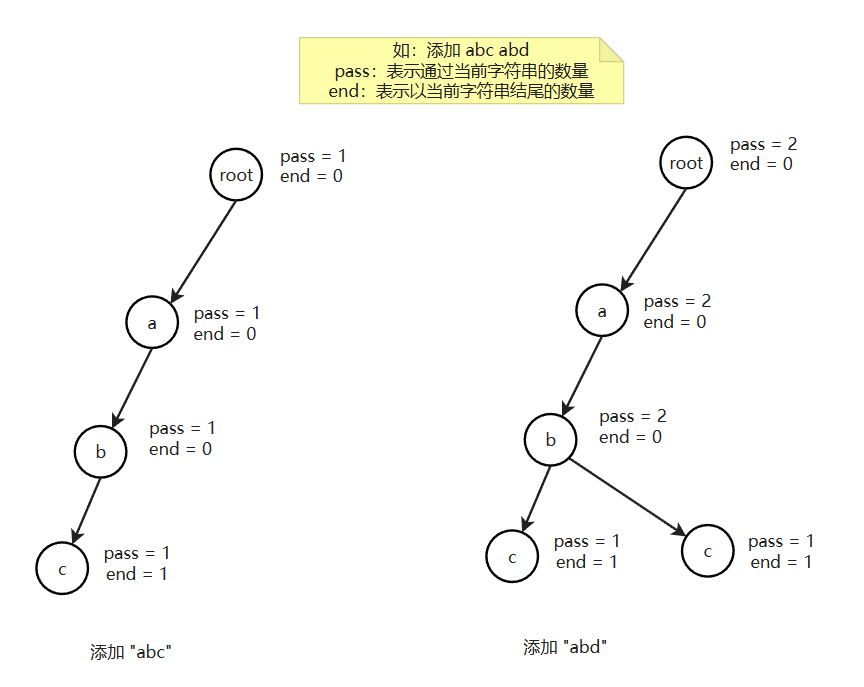

# 1. 前缀树 （字典树）
1）单个字符串中，字符从前到后的加到一棵多叉树上

2）字符放在路上，节点上有专属的数据项（常见的是pass和end值）

3）所有样本都这样添加，如果没有路就新建，如有路就复用

4）沿途节点的pass值增加1，每个字符串结束时来到的节点end值增加1

可以完成前缀相关的查询




## 1.1 设计一个前缀树

设计一种结构。用户可以：

1）void insert(String str)            添加某个字符串，可以重复添加，每次算1个

2）int search(String str)             查询某个字符串在结构中还有几个

3）void delete(String str)           删掉某个字符串，可以重复删除，每次算1个

4）int prefixNumber(String str)  查询有多少个字符串，是以str做前缀的

### 固定数组实现

这种情况可以直接 `new int[26]`

```java
public class Code01_TrieTree {

    public static class Node {
        int pass;
        int end;
        Node[] nexts;

        public Node() {
            pass = 0;
            end = 0;
            // 0    a
            // 1    b
            // 2    c
            // ..   ..
            // 25   z
            // nexts[i] == null   i方向的路不存在
            // nexts[i] != null   i方向的路存在
            nexts = new Node[26];
        }
    }

    public static class Trie {
        Node root;

        public Trie() {
            root = new Node();
        }

        /**
         * 添加某个字符串，构建前缀树
         *
         * @param word 字符串
         */
        public void insert(String word) {
            if (word == null) {
                return;
            }
            char[] chars = word.toCharArray();
            Node node = root;
            node.pass++;
            int index = 0;
            for (int i = 0; i < chars.length; i++) {
                index = chars[i] - 'a';
                if (node.nexts[index] == null) {
                    node.nexts[index] = new Node();
                }
                node = node.nexts[index];
                node.pass++;
            }
            node.end++;
        }

        /**
         * 查询字符串出现的次数
         *
         * @param word 要查询的字符串
         * @return 出现次数
         */
        public int search(String word) {
            if (word == null) {
                return 0;
            }
            char[] chars = word.toCharArray();
            Node node = root;
            int index = 0;
            for (int i = 0; i < chars.length; i++) {
                index = chars[i] - 'a';
                if (node.nexts[index] == null) {
                    return 0;
                }
                node = node.nexts[index];
            }
            return node.end;
        }

        /**
         * 删除某个字符串
         *
         * @param word 要删除的字符串
         */
        public void delete(String word) {
            // 先查询存不存在，只有存在才可以进行删除
            if (search(word) == 0) {
                return;
            }
            char[] chars = word.toCharArray();
            Node node = root;
            node.pass--;
            int index = 0;
            for (int i = 0; i < chars.length; i++) {
                index = chars[i] - 'a';
                node.nexts[index].pass--;
                if (node.nexts[index].pass == 0) {
                    // 如果等于0，说明后面的结点都是无效的了。直接设置为null，并退出
                    node.nexts[index] = null;
                    return;
                }
                node = node.nexts[index];
            }
            node.end--;
        }

        /**
         * 查询以 preWord 为前缀的字符串数量
         *
         * @param preWord 字符串前缀
         * @return 出现的次数
         */
        public int prefixNumber(String preWord) {
            if (preWord == null) {
                return 0;
            }
            char[] chars = preWord.toCharArray();
            Node node = root;
            int index = 0;
            for (int i = 0; i < chars.length; i++) {
                index = chars[i] - 'a';
                if (node.nexts[index] == null) {
                    return 0;
                }
                node = node.nexts[index];
            }
            return node.pass;
        }
    }

    // 前缀树节点类型
    public static class Node1 {
        public int pass;
        public int end;
        public Node1[] nexts;

        public Node1() {
            pass = 0;
            end = 0;
            nexts = new Node1[26];
        }
    }

    public static void main(String[] args) {
        String[] words = {"abc", "abc", "abd", "ab", "kst", "a", "abdef"};
        Trie trie = new Trie();
        for (String word : words) {
            trie.insert(word);
        }

        trie.insert("abdef");

//        System.out.println(trie.search("ab"));
//        System.out.println(trie.search("abc"));
//        System.out.println(trie.search("abdef"));
//        System.out.println(trie.prefixNumber("ab"));
        trie.delete("abdef");
        System.out.println(trie.prefixNumber("abdef"));
    }

}
```

### 哈希表实现

如果字符串中的字符个数不确定，我们可以使用HashMap

```java
import java.util.HashMap;
import java.util.Map;

public class Code02_TrieTree {

    public static class Node {
        int pass;
        int end;
        Map<Integer, Node> nexts;

        public Node() {
            pass = 0;
            end = 0;
            // 当字符串的范围不确定的时候，可以使用HashMap
            nexts = new HashMap<>();
        }
    }

    public static class Trie {
        Node root;

        public Trie() {
            root = new Node();
        }

        /**
         * 添加某个字符串，构建前缀树
         *
         * @param word 字符串
         */
        public void insert(String word) {
            if (word == null) {
                return;
            }
            char[] chars = word.toCharArray();
            Node node = root;
            node.pass++;
            int index = 0;
            for (int i = 0; i < chars.length; i++) {
                index = chars[i];
                if (!node.nexts.containsKey(index)) {
                    node.nexts.put(index, new Node());
                }
                node = node.nexts.get(index);
                node.pass++;
            }
            node.end++;
        }

        /**
         * 查询字符串出现的次数
         *
         * @param word 要查询的字符串
         * @return 出现次数
         */
        public int search(String word) {
            if (word == null) {
                return 0;
            }
            char[] chars = word.toCharArray();
            Node node = root;
            int index = 0;
            for (int i = 0; i < chars.length; i++) {
                index = chars[i];
                if (!node.nexts.containsKey(index)) {
                    return 0;
                }
                node = node.nexts.get(index);
            }
            return node.end;
        }

        /**
         * 删除某个字符串
         *
         * @param word 要删除的字符串
         */
        public void delete(String word) {
            // 先查询存不存在，只有存在才可以进行删除
            if (search(word) == 0) {
                return;
            }
            char[] chars = word.toCharArray();
            Node node = root;
            node.pass--;
            int index = 0;
            for (int i = 0; i < chars.length; i++) {
                index = chars[i];
                node.nexts.get(index).pass--;
                if (node.nexts.get(index).pass == 0) {
                    // 如果等于0，说明后面的结点都是无效的了。直接设置为null，并退出
                    node.nexts.remove(index);
                    return;
                }
                node = node.nexts.get(index);
            }
            node.end--;
        }

        /**
         * 查询以 preWord 为前缀的字符串数量
         *
         * @param preWord 字符串前缀
         * @return 出现的次数
         */
        public int prefixNumber(String preWord) {
            if (preWord == null) {
                return 0;
            }
            char[] chars = preWord.toCharArray();
            Node node = root;
            int index = 0;
            for (int i = 0; i < chars.length; i++) {
                index = chars[i];
                if (node.nexts.get(index) == null) {
                    return 0;
                }
                node = node.nexts.get(index);
            }
            return node.pass;
        }
    }


    public static void main(String[] args) {
        String[] words = {"abc", "abc", "abd", "ab", "kst", "a", "abdef"};
        Trie trie = new Trie();
        for (String word : words) {
            trie.insert(word);
        }

        trie.insert("baadebdddfdaba");

        System.out.println(trie.search("ab"));
        System.out.println(trie.search("abc"));
        System.out.println(trie.search("abdef"));
        System.out.println(trie.prefixNumber("ab"));
        trie.delete("abdef");
        System.out.println(trie.prefixNumber("abdef"));
    }

}
```

### 直接暴力

```java
public class Code03_TrieTree {

    private HashMap<String, Integer> box;

    public Code03_TrieTree() {
        box = new HashMap<>();
    }

    public void insert(String word) {
        if (!box.containsKey(word)) {
            box.put(word, 1);
        } else {
            box.put(word, box.get(word) + 1);
        }
    }

    public void delete(String word) {
        if (box.containsKey(word)) {
            if (box.get(word) == 1) {
                box.remove(word);
            } else {
                box.put(word, box.get(word) - 1);
            }
        }
    }

    public int search(String word) {
        if (!box.containsKey(word)) {
            return 0;
        } else {
            return box.get(word);
        }
    }

    public int prefixNumber(String pre) {
        int count = 0;
        for (String cur : box.keySet()) {
            if (cur.startsWith(pre)) {
                count += box.get(cur);
            }
        }
        return count;
    }
}
```

### 4. 校验正确性

我们写一个校验程序

```java
public class TrieTreeCheck {

    public static String generateRandomString(int strLen) {
        char[] ans = new char[(int) (Math.random() * strLen) + 1];
        for (int i = 0; i < ans.length; i++) {
            int value = (int) (Math.random() * 6);
            ans[i] = (char) (97 + value);
        }
        return String.valueOf(ans);
    }

    // for test
    public static String[] generateRandomStringArray(int arrLen, int strLen) {
        String[] ans = new String[(int) (Math.random() * arrLen) + 1];
        for (int i = 0; i < ans.length; i++) {
            ans[i] = generateRandomString(strLen);
        }
        return ans;
    }


    public static void main(String[] args) {
        int arrLen = 100;
        int strLen = 20;
        int testTimes = 100000;
        for (int i = 0; i < testTimes; i++) {
            String[] arr = generateRandomStringArray(arrLen, strLen);
            Code01_TrieTree.Trie trie1 = new Code01_TrieTree.Trie();
            Code02_TrieTree.Trie trie2 = new Code02_TrieTree.Trie();
            // 暴力解法
            Code03_TrieTree right = new Code03_TrieTree();
            for (int j = 0; j < arr.length; j++) {
                double decide = Math.random();
                if (decide < 0.25) {
                    trie1.insert(arr[j]);
                    trie2.insert(arr[j]);
                    right.insert(arr[j]);
                } else if (decide < 0.5) {
                    trie1.delete(arr[j]);
                    trie2.delete(arr[j]);
                    right.delete(arr[j]);
                } else if (decide < 0.75) {
                    int ans1 = trie1.search(arr[j]);
                    int ans2 = trie2.search(arr[j]);
                    int ans3 = right.search(arr[j]);
                    if (ans1 != ans2 || ans2 != ans3) {
                        System.out.println("Oops!");
                    }
                } else {
                    int ans1 = trie1.prefixNumber(arr[j]);
                    int ans2 = trie2.prefixNumber(arr[j]);
                    int ans3 = right.prefixNumber(arr[j]);
                    if (ans1 != ans2 || ans2 != ans3) {
                        System.out.println("Oops!");
                    }
                }
            }
        }
        System.out.println("finish!");
    }
}
```

# 2. 桶排序