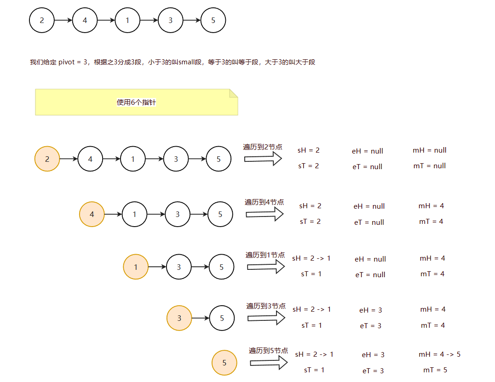

# 链表问题

面试时链表解题的方法论 

1. 对于笔试，不用太在乎空间复杂度，一切为了时间复杂度

2. 对于面试，时间复杂度依然放在第一位，但是一定要找到空间最省的方法

# 链表面试题常用数据结构和技巧

1. 使用容器(哈希表、数组等)

2. 快慢指针 

# 快慢指针

## 输入链表头节点，奇数长度返回中点，偶数长度返回上中点

就是：
- 如果链表是 1 -> 2 -> 3 -> 4 -> 5，奇数长度，中点就是3
- 如果链表是 1 -> 2 -> 3 -> 4，偶数长度，中点就是2（中点是2和3，返回上中点就是2）

链表代码：

```java
public class Node {

    public int value;
    public Node next;

    public Node(int value) {
        this.value = value;
    }
 
```

**写法一**


```java
public Node midOrUpMidNode(Node head) {
    if (head == null) {
        return null;
    }
    Node slow = head;
    Node fast = head;
    while (fast.next != null && fast.next.next != null) {
        slow = slow.next;
        fast = fast.next.next;
    }
    return slow;
}
```

**写法二**


```java
public Node midOrUpMidNode(Node head) {
    // node没有元素，有一个或者有两个，都返回head
    if (head == null || head.next == null || head.next.next == null) {
        return head;
    }
    Node slow = head.next;
    Node fast = head.next.next;
    while (fast.next != null && fast.next.next != null) {
        slow = slow.next;
        fast = fast.next.next;
    }
    return slow;
}
```


**空间负载度是O(n)的写法**

```java
public static Node right1(Node head) {
    if (head == null) {
        return null;
    }
    Node cur = head;
    ArrayList<Node> arr = new ArrayList<>();
    while (cur != null) {
        arr.add(cur);
        cur = cur.next;
    }
    return arr.get((arr.size() - 1) / 2);
}
```

## 输入链表头节点，奇数长度返回中点，偶数长度返回下中点

就是：
- 如果链表是 1 -> 2 -> 3 -> 4 -> 5，奇数长度，中点就是3
- 如果链表是 1 -> 2 -> 3 -> 4，偶数长度，中点就是3（中点是2和3，返回下中点就是3）


```java
public Node midOrDownMidNode(Node head) {
    if (head == null || head.next == null) {
        return head;
    }
    Node slow = head.next;
    Node fast = head.next;
    while (fast.next != null && fast.next.next != null) {
        slow = slow.next;
        fast = fast.next.next;
    }
    return slow;
}
```

**空间负载度是O(n)的写法**

```java
public static Node right2(Node head) {
    if (head == null) {
        return null;
    }
    Node cur = head;
    ArrayList<Node> arr = new ArrayList<>();
    while (cur != null) {
        arr.add(cur);
        cur = cur.next;
    }
    return arr.get(arr.size() / 2);
}
```

## 输入链表头节点，奇数长度返回中点前一个，偶数长度返回上中点前一个

就是：
- 如果链表是 1 -> 2 -> 3 -> 4 -> 5，奇数长度，中点前一个就是2
- 如果链表是 1 -> 2 -> 3 -> 4，偶数长度，上中点的前一个就是1（上中点是2，返回前一个就是1）


```java
public Node midOrUpMidPreNode(Node head) {
    if (head == null || head.next == null || head.next.next == null) {
        return null;
    }
    Node slow = head;
    Node fast = head.next.next;
    while (fast.next != null && fast.next.next != null) {
        slow = slow.next;
        fast = fast.next.next;
    }
    return slow;
}
```

**空间负载度是O(n)的写法**

```java
public static Node right3(Node head) {
    if (head == null) {
        return null;
    }
    Node cur = head;
    ArrayList<Node> arr = new ArrayList<>();
    while (cur != null) {
        arr.add(cur);
        cur = cur.next;
    }
    return arr.get((arr.length() - 3) / 2);
}
```

## 输入链表头节点，奇数长度返回中点前一个，偶数长度返回下中点前一个

就是：
- 如果链表是 1 -> 2 -> 3 -> 4 -> 5，奇数长度，中点前一个就是2
- 如果链表是 1 -> 2 -> 3 -> 4，偶数长度，下中点的前一个就是上中点2

```java
public Node midOrDownMidPreNode(Node head) {
    if (head == null || head.next == null) {
        return null;
    }
    Node slow = head;
    Node fast = head.next;
    while (fast.next != null && fast.next.next != null) {
        slow = slow.next;
        fast = fast.next.next;
    }
    return slow;
}
```

**空间负载度是O(n)的写法**

```java
public static Node right4(Node head) {
    if (head == null) {
        return null;
    }
    Node cur = head;
    ArrayList<Node> arr = new ArrayList<>();
    while (cur != null) {
        arr.add(cur);
        cur = cur.next;
    }
    return arr.get((arr.length() - 2) / 2);
}
```


# 给定一个单链表的头节点head，请判断该链表是否为回文结构。 

回文就是正着读和反着读都是一样。

如 1 -> 2 -> 3 -> 2 -> 1 和 1 -> 2 -> 2 -> 1 就是回文链表


##  1. 使用栈

(1) 先将数据放入栈里面

(2) 遍历的时候，从栈里面取出每个元素进行比较，不相等则直接返回false

```java
public boolean isPalindrome(Node head) {
    if (head == null || head.next == null) {
        return true;
    }
    Stack<Integer> stack = new Stack<>();
    Node cur = head;
    while (cur != null) {
        stack.push(cur.value);
        cur = cur.next;
    }

    cur = head;
    while (cur != null) {
        if (stack.pop() != cur.value) {
            return false;
        }
        cur = cur.next;
    }
    return true;
}
```

这种时间复杂度和空间复杂度都是O(n)

##  2. 使用栈(存放一半的元素)

上面是将所有元素都放入到栈里面。

我们可以稍微优化下：

(1) 先找到链表的中点（偶数上中点），然后将中点之后的元素放入到栈里面

(2) 然后遍历链表跟栈里面的元素比较，知道栈为空，期间有不一样的值直接返回false。

```java
public boolean isPalindrome(Node head) {
    if (head == null || head.next == null) {
        return true;
    }
    Node slow = head;
    Node fast = head;
    while (fast.next != null && fast.next.next != null) {
        slow = slow.next;
        fast = fast.next.next;
    }
    Stack<Integer> stack = new Stack<>();
    Node cur = slow.next;
    while (cur != null) {
        stack.push(cur.value);
        cur = cur.next;
    }

    cur = head;
    while (!stack.isEmpty()) {
        if (stack.pop() != cur.value) {
            return false;
        }
        cur = cur.next;
    }
    return true;
}
```

这种做法相对比方法一需要使用 N / 2的额外空间

那么能不能补使用额外空间做到呢？当然可以


##  3. 使用集合

```java
public boolean isPalindrome5(ListNode head) {
    List<Integer> list = new ArrayList<>();
    ListNode cur = head;
    while (cur != null) {
        list.add(cur.val);
        cur = cur.next;
    }
    int left = 0, right = list.size() - 1;
    while (left <= right) {
        if (list.get(left) != list.get(right)) {
            return false;
        }
        left++;
        right--;
    }
    return true;
}
```

力扣测试结果集合比使用栈速度快

##  4. 使用O(1)的空间复杂度

.png)

```java
// 额外空间 O(1)
public static boolean isPalindrome6(ListNode head) {
    if (head == null || head.next == null) {
        return true;
    }
    ListNode slow = head;
    ListNode fast = head;
    while (fast.next != null && fast.next.next != null) {
        slow = slow.next;
        fast = fast.next.next;
    }
    ListNode reverse = reverse2(slow.next);
    ListNode leftNode = head;
    ListNode rightNode = reverse;
    boolean res = true;
    while (leftNode != null && rightNode != null) {
        if (leftNode.val != rightNode.val) {
            res = false;
            break;
        }
        leftNode = leftNode.next;
        rightNode = rightNode.next;
    }
    // 再反转过来
    rightNode = reverse2(reverse);
    slow.next = rightNode;
    return res;
}


public static ListNode reverse2(ListNode head) {
    ListNode pre = null;
    ListNode cur = head;
    while (cur != null) {
        ListNode next = cur.next;
        cur.next = pre;
        pre = cur;
        cur = next;
    }
    return pre;
}
```

# 将单向链表按某值划分成左边小、中间相等、右边大的形式

## 1. 把链表放入数组里，在数组上做partition（笔试用）

```java
 public static ListNode listPartition1(ListNode head, int pivot) {
    if (head == null) {
        return head;
    }
    int i = 0;
    ListNode cur = head;
    while (cur != null) {
        i++;
        cur = cur.next;
    }
    ListNode[] nodeArr = new ListNode[i];
    cur = head;
    for(i = 0; i < nodeArr.length;i++) {
        nodeArr[i] = cur;
        cur = cur.next;
    }
    arrPartition(nodeArr, pivot);

    // 然后再将分段好的连起来
    for (i = 1; i < nodeArr.length; i++) {
        nodeArr[i - 1].next = nodeArr[i];
    }
    nodeArr[i - 1].next = null;
    return nodeArr[0];
}


public static void arrPartition(ListNode[] nodeArr, int pivot) {
    int smallIndex = 0;
    int bigIndex = nodeArr.length - 1;
    int index = 0;
    while (index <= bigIndex) {
        if (nodeArr[index].val < pivot) {
            swap(nodeArr, smallIndex++, index++);
        } else if (nodeArr[index].val == pivot) {
            index++;
        } else {
            swap(nodeArr, bigIndex--, index);
        }
    }
}
public static void swap(ListNode[] nodeArr, int a, int b) {
    ListNode tmp = nodeArr[a];
    nodeArr[a] = nodeArr[b];
    nodeArr[b] = tmp;
}
```

> 上面的分段之后，不能保证每个分段钟元素的相对顺序，是不稳定的

## 2. 分成小、中、大三部分，再把各个部分之间串起来（面试用）



```java
// 使用0(1) 的空间负载度
public static ListNode listPartition2(ListNode head, int pivot) {
    // 用6个指针
    ListNode sH = null;  // small head
    ListNode sT= null;   // small tail
    ListNode eH = null;  // equal head
    ListNode eT = null;  // equal tail
    ListNode mH = null;  // more head
    ListNode mT = null;  // more tail

    ListNode next = null;

    while (head != null) {
        next = head.next;
        head.next = null;

        int val = head.val;

        if (val < pivot) {
            if (sH == null) {
                sH = head;
                sT = head;
            } else {
                sT.next = head;
                sT = head;
            }
        } else if (val == pivot) {
            if (eH == null) {
                eH = head;
                eT = head;
            } else {
                eT.next = head;
                eT = head;
            }
        } else {
            if (mH == null) {
                mH = head;
                mT = head;
            } else {
                mT.next = head;
                mT = head;
            }
        }
        head = next;
    }

    // 连接小于，等于，大于区域

    // 小于区域的尾巴，连等于区域的头，等于区域的尾巴连大于区域的头
    if (sT != null) {
        sT.next = eH;
        eT = eT == null ? sT : eT; // 下一步，谁去连大于区域的头，谁就变成eT
    }

    if (eT != null) {
        eT.next = mH;
    }

    return sH != null ? sH : (eH != null ? eH : mH);
}
```

# 带random指针的链表复制

https://leetcode.cn/problems/copy-list-with-random-pointer/

一种特殊的单链表节点类描述如下

```java
public static class Node {
    public int val;
    public Node next;
    public Node random;

    public Node(int data) {
        this.val = data;
    }
}
```

random 指针是单链表节点结构中新增的指针，random 可能指向链表中的任意一个节点，也可能指向null。
给定一个由Node节点类型组成的无环单链表的头节点 head，请实现一个函数完成这个链表的复制，并返回复制的新链表的头节点。 

【要求】时间复杂度O(N)，额外空间复杂度O(1) 


## 1. 使用hash表

```java
public Node copyRandomList(Node head) {
    // key 老节点。value 新节点
    Map<Node, Node> map = new HashMap<>();
    Node cur = head;
    while (cur != null) {
        map.put(cur, new Node(cur.val));
        cur = cur.next;
    }

    cur = head;
    while (cur != null) {
        // cur 老节点
        // map.get(cur) 新
        // 新.next -> cur.next 克隆节点找到
        map.get(cur).next = map.get(cur.next);
        map.get(cur).random = map.get(cur.random);
        cur = cur.next;
    }
    return map.get(head);
}
```

## 2. 不适用hash表

```java
// 不适用哈希表， O(1) 的空间负载度
public Node copyRandomList(Node head) {
    if (head == null) {
        return null;
    }
    // 1 -> 2 -> 3 -> null  变成 1 -> 1' -> 2 -> 2' -> 3 -> 3' -> null
    Node cur = head;
    while (cur != null) {
        Node next = cur.next;
        // 复制一个节点，连接到当前节点后面
        cur.next = new Node(cur.val);
        cur.next.next = next;
        cur = next;
    }
    // 设置random节点，一对一对的遍历
    // 第一次拿出 1 和 1' 假设 1 的 random是3，那么 1‘ 的 random 就是 3’
    // 通过 1 找到 3，通过3 可以找到3'，然后将 1' 连到 3' 上
    cur = head;
    while (cur != null) {
        Node next = cur.next.next;
        cur.next.random = cur.random == null ? null : cur.random.next;
        cur = next;
    }

    // 分离。现在不用管random指针了，已经全部设置好了
    // 现在需要将 1 -> 1' -> 2 -> 2' -> 3 -> 3' -> null 分离出来对应的 1' -> 2' -> 3' -> null

    Node res = head.next;
    cur = head;
    while (cur != null) {
        Node next = cur.next.next;
        Node copy = cur.next;
        // 1 -> 2
        cur.next = next;
        // 1' -> 2'
        copy.next = next != null ? next.next : null;
        cur = next;
    }
    return res;
}
```

# 判断单链表是否有环，如果有环，返回第一个相交的节点

## 判断单链表是否有环，要注意两点

1. 链表只有一个next节点，所以有些你脑补的相交场景是不对的
2. 链表是否有环（相交）跟链表的值无关，跟内存地址有关。切入拿值是否相当判断单链表是否有环


> 如上图，左边是正确的单链表相交图，右边就不是，有表相交的节点，是有两个next

## 1. 快慢指针做法

**思路：**
1. 使用两个指针，一个慢指针(slow)，一个快指针(fast)，慢指针每次走一步，快指针每次走两步。**如果相遇，则表示有环**
2. 如果相遇，slow和faast指针此时都指向一个节点。我们将slow回到head节点，然后slow和fast节点继续往下走，每次都走一步，slow=fast的时候，指针停留的节点就是其第一个相交的节点

**我们这里就不证明，有兴趣可以去网上找下**

**只要记住这个结论：**

> 先slow走一步，fast指针走两步，判断有没有相交的节点。
> 
> 再将slow指针回到head节点，slow和fast同时走一步，slow=fast的时候，指向的节点就是第一次相交的节点


```java
public static ListNode getLoopNode(ListNode head) {
    // 有些题目两个节点，也是一个环。这里两个节点先不认为是一个环
    if (head == null || head.next == null || head.next.next == null) {
        return null;
    }
    ListNode slow = head.next;
    ListNode fast = head.next.next;
    // 因为判断条件是slow != fast。所以slow和fast都没有从head开始，当然你也可以从head节点开始
    while (slow != fast) {
        // 不相交
        if (slow.next == null || fast.next.next == null) {
            return null;
        }
        slow = slow.next;
        fast = fast.next.next;
    }
    // 然后fast节点指向头结点
    fast = head;
    while (fast != slow) {
        // 两个每次都走一步
        slow = slow.next;
        fast = fast.next;
    }
    return slow;
}
```

## 2. 哈希表的做法

```java
public static ListNode getLoopNode(ListNode head) {
    // 有些题目两个节点，也是一个环。这里两个节点先不认为是一个环
    if (head == null || head.next == null || head.next.next == null) {
        return null;
    }
    Set<ListNode> set = new HashSet<>();
    ListNode cur = head;
    while (cur != null) {
        if (!set.contains(cur)) {
            set.add(cur);
        } else  {
            // 说明相交了，直接返回当前节点
            return cur;
        }
        cur = cur.next;
    }
    return null;
}
```

# 两个无环链表是否相交，如果相交返回第一个相交点，如果不想交返回null

两个无环是否相交，如果相交，那么两个链表的相交部分一定是相等的


> 如果所示，左边才是正确的两个链表相交图，右边不是，右边违背了链表的next节点只能指向一个节点的逻辑
>
> 所以如果两个链表相交，那么相交的部分一定是相等的


## 1. 双指针做法

### 思路

1. 判断两个链表的最后一个节点是否相等，如果不相等，那么一定不想交
2. 如果相交，计算两个链表的长度差n，先后长度长的链表想走，走n步
3. 此时两个链表所在的位置后面的节点数都是一样的，那么两个链表一起走，如果相等，直接返回（就是第一个相交的节点）


### 代码

```java
public static ListNode noLoop(ListNode headA, ListNode headB) {
    if (headA == null || headB == null) {
        return null;
    }
    // 记录两个链表长度的差值
    int n = 0;
    ListNode curA = headA; // 保存当前节点的最后一个节点。如果两个节点的最后一个节点相当，那么一定是有相交的
    while (curA.next != null) {
        n++;
        curA = curA.next;
    }
    ListNode curB = headB;
    while (curB.next != null) {
        n--;
        curB = curB.next;
    }

    // 说明不想交，直接返回
    if (curA != curB) {
        return null;
    }
    // 如果相交，找到一个相交点
    // 重新赋值，保证curA的长度 >= curB的长度
    curA = n > 0 ? headA : headB;
    curB = curA == headA ? headB : headA;
    // 长的节点，先走掉两个节点的差值
    n = Math.abs(n);
    while (n > 0) {
        n--;
        curA = curA.next;
    }
    // 两个节点一起走，因为此时两个一定有相交点，如果判断条件是curA != curB
    while (curA != curB) {
        curA = curA.next;
        curB = curB.next;
    }
    return curA;
}

// 或者
public static ListNode noLoop(ListNode headA, ListNode headB) {
    if (headA == null || headB == null) {
        return null;
    }
    ListNode pA = headA, pB = headB;
    while (pA != pB) {
        pA = pA == null ? headB : pA.next;
        pB = pB == null ? headA : pB.next;
    }
    return pA;
}
```

时间复杂度：O(m+n)

空间复杂度：O(1)

## 2. 哈希表做法

```java
public static ListNode noLoop(ListNode headA, ListNode headB) {
    if (headA == null || headB == null) {
        return null;
    }
    Set<ListNode> set = new HashSet<>();
    ListNode cur = headA;
    while (cur != null) {
        set.add(cur);
        cur = cur.next;
    }
    cur = headB;
    while (cur != null) {
        if (set.contains(cur)) {
            return cur;
        }
        cur = cur.next;
    }
    return null;
}
```

时间复杂度：O(m+n)

空间复杂度：O(m)

# 两个有环链表是否相交，如果相交返回第一个相交点，如果不想交返回null

两个有环的链表分三种情况
1) 不想交
2) 相交，相交点一样
3) 相交，相交点不一样


```java
/**
    * 判断两个有环链表是否相交，如果相交，返回第一个相交点
    * @param headA 链表A
    * @param headB 链表B
    * @param loopNodeA 链表A的第一个相交点
    * @param loopNodeB 链表B的第一个相交点
    * @return
    */
public static ListNode bothLoop(ListNode headA, ListNode headB, ListNode loopNodeA, ListNode loopNodeB) {
    if (loopNodeA == loopNodeB) {
        // 如果两个有环链表的相交节点一样，那么我们就将相交节点当做两个链表的最后一个节点，那么就又回到了，判断两个无环节点是否相交了
        int n = 0;
        ListNode curA = headA;
        while (curA.next != loopNodeA) {
            n++;
            curA = curA.next;
        }
        ListNode curB = headB;
        while (curB.next != loopNodeB) {
            n--;
            curB = curB.next;
        }

        // 保证curA的长度 > curB
        curA = n > 0 ? headA : headB;
        curB = curA == headA ? headB : headA;

        n = Math.abs(n);

        while (n > 0) {
            n--;
            curA = curA.next;
        }

        while (curA != curB) {
            curA = curA.next;
            curB = curB.next;
        }

        return curA;
    } else {
        // loopNodeA 不等于 loopNodeB
        // 如果是第三种情况，两个有环链表相交，共用一个环，那么从其中一个环往下走，期间如果等于另一个相交节点，那么就说明两个有环链表相交
        // 此时返回 loopNodeA 或者 loopNodeB都可以
        ListNode cur = loopNodeA.next;
        while (cur != loopNodeA) {
            if (cur == loopNodeB) {
                // 相交，并且相交点不一样
                return loopNodeA;
            }
            cur = cur.next;
        }
        return null;
    }
}
```

#  给定两个可能有环也可能无环的单链表，判断其是否相交？

给定两个可能有环也可能无环的单链表，头节点head1和head2。请实现一个函数，如果两个链表相交，请返回相交的 第一个节点。如果不相交，返回null 

【要求】

如果两个链表长度之和为N，时间复杂度请达到O(N)，额外空间复杂度 请达到O(1)。


## 步骤

1) 首先判断两个链表是否有环。
> 假设headA和headB，可以得到链表A的第一个相交点loopNodeA，可以得到链表B的第一个相交点loopNodeB
2) 判断loopNodeA和loopNodeB
   1) 如果 loopNodeA == null && loopNodeB == null  => 转换成，判断两个无环链表是否相交
   2) 如果 loopNodeA 和 loopNodeB 其中一个无环，那么就不可能相交
   3) 如果 loopNodeA != null && loopNodeB != null  => 转换成，判断两个有环链表是否相交、


## 代码

```java
public static ListNode getIntersectionNode(ListNode headA, ListNode headB) {
    if (headA == null || headB == null) {
        return null;
    }
    // 获取两个链表的第一个相交点
    ListNode loopA = getLoopNode(headA);
    ListNode loopB = getLoopNode(headA);
    // 1. 转换成求两个无环链表是否相交
    if (loopA == null && loopB == null) {
        // 调用上面的方法
        return noLoop(headA, headB);
    }
    // 2. 转换成求两个有环链表是否相交
    if (loopA != null && loopB != null) {
        // 调用上面的方法
        return bothLoop(headA, headB, loopA, loopB);
    }
    // 3. 一个链表有环，有个链表无环，那么这两个链表一定不会相交。否则违反链表next只能指向一个节点的规则
    return null;
}
```

# 能不能不给单链表的头节点，只给想要删除的节点，就能做到在链表上把这个点删掉？

先说答案，是不能的


抖机灵的做法有神秘弊端？

1. 我们将要删除的下一个节点的覆盖要删除节点的值，刷题的时候可能没啥问题，但是实际上要删除节点的内存地址还是在的，这种再实际场景中可能会存在问题。
2. 无法删除最后一个节点（要删除最后一个节点，我们需要知道当前节点的前一个节点，然后将前一个节点的next执行null）

**所以：对于链表，如果想删除某个节点，必须知道其前一个节点**