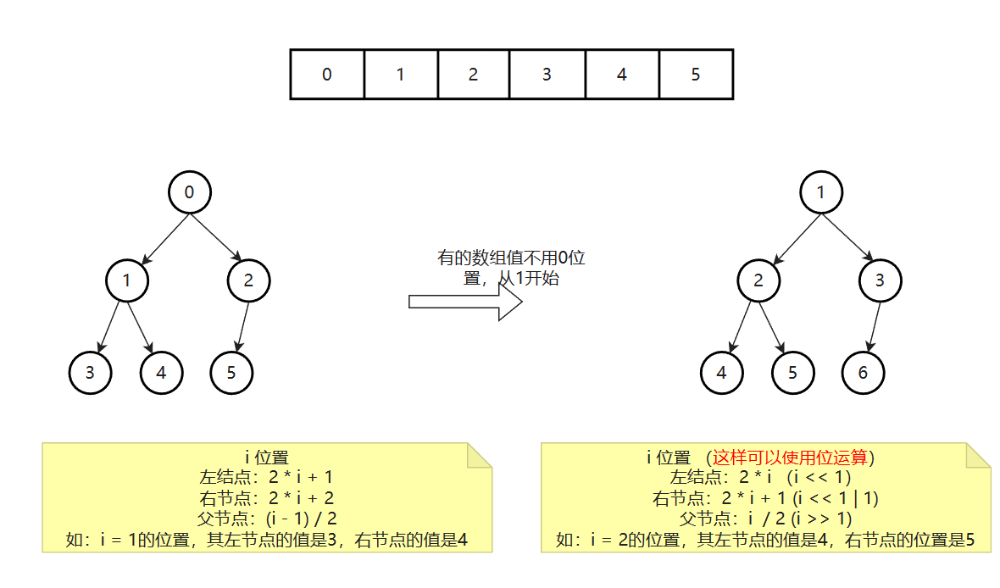
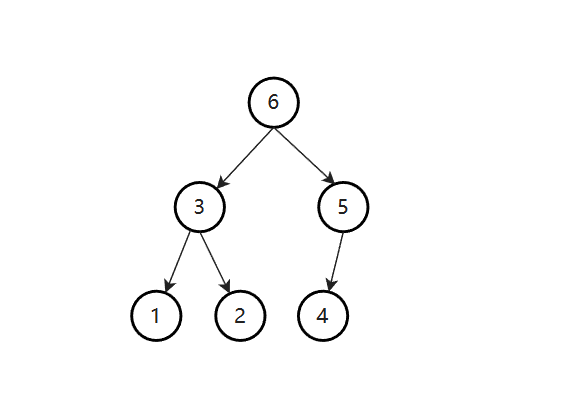
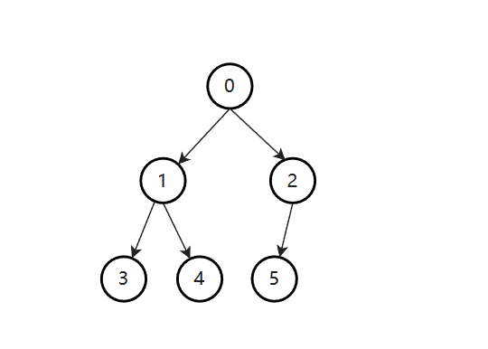

# 1. 堆结构

1）堆结构就是用数组实现的完全二叉树结构

2）完全二叉树中如果每棵子树的最大值都在顶部就是大根堆

3）完全二叉树中如果每棵子树的最小值都在顶部就是小根堆

4）堆结构的heapInsert与heapify操作

5）堆结构的增大和减少 

6）优先级队列结构，就是堆结构 

**堆结构只有大根堆和小根堆，如果都不是，那就不是堆结构**



## 1.1 大根堆

顶部的结点值比左右节点的值都大，那么它就是大根堆。



## 1.2 小根堆

顶部的结点值比左右节点的值都小，那么它就是小根堆。



## 1.3 小根堆

大根堆的添加的相关代码

```java
public static class MyMaxHeap {
        private int[] heap;
        private final int limit;
        private int heapSize;

        public MyMaxHeap(int limit) {
            heap = new int[limit];
            this.limit = limit;
            heapSize = 0;
        }

        public boolean isEmpty() {
            return heapSize == 0;
        }

        public boolean isFull() {
            return heapSize == limit;
        }

        public void push(int value) {
            if (isFull()) {
                throw new RuntimeException("heap is full");
            }
            heap[heapSize] = value;
            heapInsert(heap, heapSize++);
        }

        // 关键函数
        private void heapInsert(int[] arr, int index) {
            while (arr[index] > arr[(index - 1) / 2]) {
                swap(heap, index, (index - 1) / 2);
                index = (index - 1) / 2;
            }
        }

        private void swap(int[] arr, int i, int j) {
            int tmp = arr[i];
            arr[i] = arr[j];
            arr[j] = tmp;
        }
    }
```

弹出元素，当元素弹出的时候，我们也要保证其是个大根堆

```java
// 用户此时，让你返回最大值，并且在大根堆中，把最大值删掉
public int pop() {
    int ans = heap[0];
    swap(heap, 0, --heapSize);
    heapify(heap, 0, heapSize);
    return ans;
}

// 从index位置，往下看，不断的下沉
// 停：我的孩子都不再比我大：已经没孩子了
private void heapify(int[] arr, int index, int heapSize) {
    // 左孩子下标
    int left = 2 * index + 1;
    // 左孩子不越界，右孩子一定不越界
    while (left < heapSize) {
        // 左右两个孩子谁大，谁复制给largest
        // 右孩子大的条件  1) 有右孩子 && 2) 右孩子比做孩子值大
        // 否则就是左孩子
        int largest = left + 1 < heapSize && arr[left + 1] > arr[left] ? left + 1 : left;
        // largest 跟当前的 index 比
        largest = arr[largest] > arr[index] ? largest : left;
        if (largest == index) {
            break;
        }
        swap(arr, largest, index);
        index = largest;
        left = 2 * index + 1;
    }
}
```

下沉的复杂度，还是O(logn)

## 1.4 堆排序

1，先让整个数组都变成大根堆结构，建立堆的过程: 

    1) 从上到下的方法，时间复杂度为O(N*logN) 
    2) 从下到上的方法，时间复杂度为O(N) 
   
2，把堆的最大值和堆末尾的值交换，然后减少堆的大小之后，再去调整堆，一直周而复始，时间复杂度为O(N*logN) 

3，堆的大小减小成0之后，排序完成 


```java
// 额外空间复杂度O(1)
public static void heapSort(int[] arr) {
    if (arr == null || arr.length < 2) {
        return;
    }

    // N * O(logN)
    for (int i = 0; i < arr.length; i++) {
        heapInsert(arr, i); // O(logN)
    }

    // O(N)
//        for (int i = arr.length - 1; i >= 0; i--) {
//            heapify(arr, i, arr.length);
//        }
//
    int heapSize = arr.length;
    swap(arr, 0, --heapSize);
    while (heapSize > 0) {
        heapify(arr, 0, heapSize);
        swap(arr, 0, --heapSize);
    }
}

public static void heapInsert(int[] arr, int index) {
    while (arr[index] > arr[(index - 1) / 2]) {
        swap(arr, index, (index - 1) / 2);
        index = (index - 1) / 2;
    }
}

public static void heapify(int[] arr, int index, int heapSize) {
    int left = 2 * index + 1;
    while (left < heapSize) {
        int largest = left + 1 < heapSize && arr[left + 1] > arr[left] ? left + 1 : left;
        largest = arr[largest] > arr[index] ? largest : index;
        if (largest == index) {
            break;
        }
        swap(arr, largest, index);
        index = largest;
        left = 2 * index + 1;
    }
}

private static void swap(int[] arr, int i, int j) {
    int tmp = arr[i];
    arr[i] = arr[j];
    arr[j] = tmp;
}
```

## 1.5 系统实现的堆 `PriorityQueue`

```java
public class PriorityQueueTest {

    public static void main(String[] args) {
        // 默认是小根堆
        PriorityQueue<Integer> heap = new PriorityQueue<Integer>();
        heap.add(5);
        heap.add(7);
        heap.add(3);
        heap.add(0);
        heap.add(2);
        heap.add(5);

        while (!heap.isEmpty()) {
            System.out.println(heap.poll());
        }
    }
}
```

## 1.6 与堆有关的题目

已知一个几乎有序的数组。几乎有序是指，如果把数组排好顺序的话，每个元素移动的距离一定不超过k，并且k相对于数组长度来说是比较小的。

请选择一个合适的排序策略，对这个数组进行排序。 

```java
public static void sortedArrDistanceLessK(int[] arr, int k) {
    if (k == 0) {
        return;
    }
    // 默认小根堆
    PriorityQueue<Integer> heap = new PriorityQueue<>();
    int index = 0;
    // 0...K-1。先将放入小根堆中
    for (; index <= Math.min(arr.length - 1, k - 1); index++) {
        heap.add(arr[index]);
    }

    int i = 0;
    for (; index < arr.length; i++, index++) {
        heap.add(arr[index]);
        arr[i] = heap.poll();
    }
    while (!heap.isEmpty()) {
        arr[i++] = heap.poll();
    }
}
```

# 2. 比较器

1) 比较器的实质就是重载比较运算符 

2) 比较器可以很好的应用在特殊标准的排序上 

3) 比较器可以很好的应用在根据特殊标准排序的结构上

4) 写代码变得异常容易，还用于范型编程 

```java
public class Code01_Comparator {

    public static class Student {
        public String name;
        public int id;
        public int age;

        public Student(String name, int id, int age) {
            this.name = name;
            this.id = id;
            this.age = age;
        }
    }


    public static class IdAscendingComparator implements Comparator<Student> {

        // 返回负数的时候，第一个参数排在前面
        // 返回正数的时候，第二个参数排在前面
        // 返回0的时候，谁在前面无所谓
        @Override
        public int compare(Student o1, Student o2) {
            return o1.id - o2.id;
        }

    }

    public static void main(String[] args) {

        Student student1 = new Student("A", 4, 40);
        Student student2 = new Student("B", 4, 21);
        Student student3 = new Student("C", 3, 12);
        Student student4 = new Student("D", 3, 62);
        Student student5 = new Student("E", 3, 42);
        // D E C A B

        Student[] students = new Student[]{student1, student2, student3, student4, student5};
        System.out.println("第一条打印");

        Arrays.sort(students, new IdAscendingComparator());
        for (int i = 0; i < students.length; i++) {
            Student s = students[i];
            System.out.println(s.name + "," + s.id + "," + s.age);
        }
    }
}
```

## 2.1 改值之后，怎么还保证有序？

```java
import java.util.ArrayList;
import java.util.Comparator;
import java.util.HashMap;

public class Code03_HeapResign {

    public static class MyHeap<T> {
        private ArrayList<T> heap;
        private HashMap<T, Integer> indexMap;
        private int heapSize;
        private Comparator<T> comparator;

        public MyHeap(Comparator<T> comparator) {
            heap = new ArrayList<>();
            indexMap = new HashMap<>();
            heapSize = 0;
            this.comparator = comparator;
        }

        public boolean isEmpty() {
            return heapSize == 0;
        }

        public int size() {
            return heapSize;
        }

        public boolean contains(T key) {
            return indexMap.containsKey(key);
        }

        public void push(T value) {
            heap.add(value);
            indexMap.put(value, heapSize);
            heapInsert(heapSize++);
        }

        public T pop() {
            T ans = heap.get(0);
            int end = heapSize - 1;
            swap(0, end);
            heap.remove(end);
            indexMap.remove(ans);
            heapify(0, --heapSize);
            return ans;
        }

        public void resign(T value) {
            int index = indexMap.get(value);
            heapInsert(index);
            heapify(index, heapSize);
        }

        private void heapify(int index, int heapSize) {
            int left = 2 * index + 1;
            while (left < heapSize) {
                int largest = left + 1 < heapSize && comparator.compare(heap.get(left + 1), heap.get(left)) < 0 ? left + 1 : left;
                largest = comparator.compare(heap.get(largest), heap.get(index)) < 0 ? largest : index;
                if (largest == index) {
                    break;
                }
                swap(largest, index);
                index = largest;
                left = 2 * index + 1;
            }
        }

        private void heapInsert(int index) {
            while (comparator.compare(heap.get(index), heap.get((index - 1) / 2)) < 0) {
                swap(index, (index - 1) / 2);
                index = (index - 1) / 2;
            }
        }

        private void swap(int i, int j) {
            T t1 = heap.get(i);
            T t2 = heap.get(j);
            heap.set(i, t2);
            heap.set(j, t1);
            indexMap.put(t1, j);
            indexMap.put(t2, i);
        }
    }

    public static void main(String[] args) {
        // 哪找年龄，从小到大排序
        Comparator<Student> comparator = new Comparator<Student>() {
            @Override
            public int compare(Student o1, Student o2) {
                return o1.age - o2.age;
            }
        };

        MyHeap myHeap = new MyHeap(comparator);

        Student student1 = new Student("zs1", 1, 27);
        Student student2 = new Student("zs2", 5, 25);
        Student student3 = new Student("zs3", 3, 20);
        Student student4 = new Student("zs4", 2, 30);
        myHeap.push(student1);
        myHeap.push(student2);
        myHeap.push(student3);
        myHeap.push(student4);

        // 修改年龄
        student1.age = 32;
        // 重置，修改排序
        myHeap.resign(student1);
        student4.age = 21;
        // 重置，修改排序
        myHeap.resign(student4);

        while (!myHeap.isEmpty()) {
            System.out.println(myHeap.pop());
        }
    }

    public static class Student {
        public String name;
        public int id;
        public int age;

        public Student(String name, int id, int age) {
            this.name = name;
            this.id = id;
            this.age = age;
        }

        @Override
        public String toString() {
            return "Student{" +
                    "name='" + name + '\'' +
                    ", id=" + id +
                    ", age=" + age +
                    '}';
        }
    }
}
```