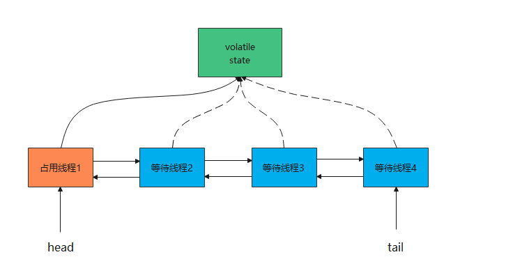

# 先看几个面试题

1. 何为AQS？AQS原理了解吗？
2. `CountDownLatch` 和 `CyclicBarrier` 了解吗？两者的区别是什么？
3. 用过 `Semaphore` 吗？应用场景了解吗？

# AQS简单介绍

AQS 的全称是为 AbstractQueuedSynchronizer，翻译过来的意思就是抽象队列同步器。这个类在 `java.util.concurrent.locks` 包下面。

AQS 就是一个抽象类，主要用来构建锁和同步器。

```java
public abstract class AbstractQueuedSynchronizer extends AbstractOwnableSynchronizer implements java.io.Serializable {}
```

AQS 为构建锁和同步器提供了一些通用功能的是实现，因此，使用 AQS 能简单且高效地构造出应用广泛的大量的同步器，比如我们提到的 `ReentrantLock`，`Semaphore`，其他的诸如 `ReentrantReadWriteLock`，`SynchronousQueue`，`FutureTask`(jdk1.7) 等等皆是基于 AQS 的。

# AQS的原理

> 在面试中被问到并发知识的时候，大多都会被问到“请你说一下自己对于 AQS 原理的理解”。下面给大家一个示例供大家参考，面试不是背题，大家一定要加入自己的思想，即使加入不了自己的思想也要保证自己能够通俗的讲出来而不是背出来。

## AQS 原理概览

AQS 核心思想是，如果被请求的共享资源空闲，则将当前请求资源的线程设置为有效的工作线程，并且将共享资源设置为锁定状态。如果被请求的共享资源被占用，那么就需要一套线程阻塞等待以及被唤醒时锁分配的机制，这个机制 AQS 是用 CLH 队列锁实现的，即将暂时获取不到锁的线程加入到队列中。

> CLH(Craig,Landin,and Hagersten)队列是一个虚拟的双向队列（虚拟的双向队列即不存在队列实例，仅存在结点之间的关联关系）。AQS 是将每条请求共享资源的线程封装成一个 CLH 锁队列的一个结点（Node）来实现锁的分配。

看个 AQS(`AbstractQueuedSynchronizer`)原理图：



AQS 使用一个 int 成员变量来表示同步状态，通过内置的 FIFO 队列来完成获取资源线程的排队工作。AQS 使用 CAS 对该同步状态进行原子操作实现对其值的修改。

```java
private volatile int state;//共享变量，使用volatile修饰保证线程可见性
```

状态信息通过 `protected` 类型的`getState()`，`setState()`，`compareAndSetState()` 进行操作

```java
//返回同步状态的当前值
protected final int getState() {
    return state;
}
 // 设置同步状态的值
protected final void setState(int newState) {
    state = newState;
}
//原子地（CAS操作）将同步状态值设置为给定值update如果当前同步状态的值等于expect（期望值）
protected final boolean compareAndSetState(int expect, int update) {
    return unsafe.compareAndSwapInt(this, stateOffset, expect, update);
}
```

AQS内部维护一个线程的队列。队列由内部的节点组成。

队列的节点为`Node`,节点分为`SHARED`和`EXCLUSIVE`分别时共享模式的节点和独占模式的节点。

```java
static final class Node {
    /** 指示节点正在共享模式下等待的标记 */
    static final Node SHARED = new Node();
    /** 指示节点正在独占模式下等待的标记 */
    static final Node EXCLUSIVE = null;

    /** waitStatus value to indicate thread has cancelled */
    static final int CANCELLED =  1;
    /** waitStatus value to indicate successor's thread needs unparking */
    static final int SIGNAL    = -1;
    /** waitStatus value to indicate thread is waiting on condition */
    static final int CONDITION = -2;
    /**
     * waitStatus value to indicate the next acquireShared should
     * unconditionally propagate
     */
    static final int PROPAGATE = -3;

    /**
     * Status field, taking on only the values:
     *   SIGNAL:     The successor of this node is (or will soon be)
     *               blocked (via park), so the current node must
     *               unpark its successor when it releases or
     *               cancels. To avoid races, acquire methods must
     *               first indicate they need a signal,
     *               then retry the atomic acquire, and then,
     *               on failure, block.
     *   CANCELLED:  This node is cancelled due to timeout or interrupt.
     *               Nodes never leave this state. In particular,
     *               a thread with cancelled node never again blocks.
     *   CONDITION:  This node is currently on a condition queue.
     *               It will not be used as a sync queue node
     *               until transferred, at which time the status
     *               will be set to 0. (Use of this value here has
     *               nothing to do with the other uses of the
     *               field, but simplifies mechanics.)
     *   PROPAGATE:  A releaseShared should be propagated to other
     *               nodes. This is set (for head node only) in
     *               doReleaseShared to ensure propagation
     *               continues, even if other operations have
     *               since intervened.
     *   0:          None of the above
     *
     * The values are arranged numerically to simplify use.
     * Non-negative values mean that a node doesn't need to
     * signal. So, most code doesn't need to check for particular
     * values, just for sign.
     *
     * The field is initialized to 0 for normal sync nodes, and
     * CONDITION for condition nodes.  It is modified using CAS
     * (or when possible, unconditional volatile writes).
     */
    volatile int waitStatus;

    volatile Node prev;

    volatile Node next;

    volatile Thread thread;

    Node nextWaiter;

    /**
     * Returns true if node is waiting in shared mode.
     */
    final boolean isShared() {
        return nextWaiter == SHARED;
    }

  
    final Node predecessor() throws NullPointerException {
        Node p = prev;
        if (p == null)
            throw new NullPointerException();
        else
            return p;
    }

    Node() {    // Used to establish initial head or SHARED marker
    }

    Node(Thread thread, Node mode) {     // Used by addWaiter
        this.nextWaiter = mode;
        this.thread = thread;
    }

    Node(Thread thread, int waitStatus) { // Used by Condition
        this.waitStatus = waitStatus;
        this.thread = thread;
    }
}
```

节点的等待状态为`waitStatus`

- CANCELLED（1）：取消状态，当线程不再希望获取锁时，设置为取消状态
- SIGNAL（-1）：当前节点的后继者处于等待状态，当前节点的线程如果释放或取消了同步状态，通知后继节点
- CONDITION（-2）：等待队列的等待状态，当调用signal()时，进入同步队列
- PROPAGATE（-3）：共享模式，同步状态的获取的可传播状态
- 0：初始状态

同样需要使用CAS的方式进行设置。

## AQS 对资源的共享方式

AQS 定义两种资源共享方式

### 1.**Exclusive（独占）**

 只有一个线程能执行，如 `ReentrantLock`。又可分为公平锁和非公平锁，`ReentrantLock` 同时支持两种锁，下面以 `ReentrantLock` 对这两种锁的定义做介绍：

- **公平锁** ：按照线程在队列中的排队顺序，先到者先拿到锁
- **非公平锁** ：当线程要获取锁时，先通过两次 CAS 操作去抢锁，如果没抢到，当前线程再加入到队列中等待唤醒。

> 说明：下面这部分关于 `ReentrantLock` 源代码内容节选自：https://www.javadoop.com/post/AbstractQueuedSynchronizer-2 ，这是一篇很不错文章，推荐阅读。

`ReentrantLock` 默认采用非公平锁，因为考虑获得更好的性能，通过 `boolean` 来决定是否用公平锁（传入 true 用公平锁）。

```java
/** Synchronizer providing all implementation mechanics */
private final Sync sync;
public ReentrantLock() {
    // 默认非公平锁
    sync = new NonfairSync();
}
public ReentrantLock(boolean fair) {
    sync = fair ? new FairSync() : new NonfairSync();
}
```

`ReentrantLock` 中公平锁的 `lock` 方法

```java
static final class FairSync extends Sync {
    final void lock() {
        acquire(1);
    }
    // AbstractQueuedSynchronizer.acquire(int arg)
    public final void acquire(int arg) {
        if (!tryAcquire(arg) &&
            acquireQueued(addWaiter(Node.EXCLUSIVE), arg))
            selfInterrupt();
    }
    protected final boolean tryAcquire(int acquires) {
        final Thread current = Thread.currentThread();
        int c = getState();
        if (c == 0) {
            // 1. 和非公平锁相比，这里多了一个判断：是否有线程在等待
            if (!hasQueuedPredecessors() &&
                compareAndSetState(0, acquires)) {
                setExclusiveOwnerThread(current);
                return true;
            }
        }
        else if (current == getExclusiveOwnerThread()) {
            int nextc = c + acquires;
            if (nextc < 0)
                throw new Error("Maximum lock count exceeded");
            setState(nextc);
            return true;
        }
        return false;
    }
}
```

非公平锁的 `lock` 方法：

```java
static final class NonfairSync extends Sync {
    final void lock() {
        // 2. 和公平锁相比，这里会直接先进行一次CAS，成功就返回了
        if (compareAndSetState(0, 1))
            setExclusiveOwnerThread(Thread.currentThread());
        else
            acquire(1);
    }
    // AbstractQueuedSynchronizer.acquire(int arg)
    public final void acquire(int arg) {
        if (!tryAcquire(arg) &&
            acquireQueued(addWaiter(Node.EXCLUSIVE), arg))
            selfInterrupt();
    }
    protected final boolean tryAcquire(int acquires) {
        return nonfairTryAcquire(acquires);
    }
}
/**
 * Performs non-fair tryLock.  tryAcquire is implemented in
 * subclasses, but both need nonfair try for trylock method.
 */
final boolean nonfairTryAcquire(int acquires) {
    final Thread current = Thread.currentThread();
    int c = getState();
    if (c == 0) {
        // 这里没有对阻塞队列进行判断
        if (compareAndSetState(0, acquires)) {
            setExclusiveOwnerThread(current);
            return true;
        }
    }
    else if (current == getExclusiveOwnerThread()) {
        int nextc = c + acquires;
        if (nextc < 0) // overflow
            throw new Error("Maximum lock count exceeded");
        setState(nextc);
        return true;
    }
    return false;
}
```

**总结：公平锁和非公平锁只有两处不同：**

1. 非公平锁在调用 lock 后，首先就会调用 CAS 进行一次抢锁，如果这个时候恰巧锁没有被占用，那么直接就获取到锁返回了。
2. 非公平锁在 CAS 失败后，和公平锁一样都会进入到 `tryAcquire` 方法，在 `tryAcquire` 方法中，如果发现锁这个时候被释放了（state == 0），非公平锁会直接 CAS 抢锁，但是公平锁会判断等待队列是否有线程处于等待状态，如果有则不去抢锁，乖乖排到后面。

公平锁和非公平锁就这两点区别，如果这两次 CAS 都不成功，那么后面非公平锁和公平锁是一样的，都要进入到阻塞队列等待唤醒。

相对来说，非公平锁会有更好的性能，因为它的吞吐量比较大。当然，非公平锁让获取锁的时间变得更加不确定，可能会导致在阻塞队列中的线程长期处于饥饿状态。

### 2. Share（共享）

多个线程可同时执行，如 `Semaphore/CountDownLatch`。`Semaphore`、`CountDownLatch`、 `CyclicBarrier`、`ReadWriteLock` 我们都会在后面讲到。

`ReentrantReadWriteLock` 可以看成是组合式，因为 `ReentrantReadWriteLock` 也就是读写锁允许多个线程同时对某一资源进行读。

不同的自定义同步器争用共享资源的方式也不同。自定义同步器在实现时只需要实现共享资源 state 的获取与释放方式即可，至于具体线程等待队列的维护（如获取资源失败入队/唤醒出队等），AQS 已经在上层已经帮我们实现好了。

## AQS 底层使用了模板方法模式

同步器的设计是基于模板方法模式的，如果需要自定义同步器一般的方式是这样（模板方法模式很经典的一个应用）：

1. 使用者继承 `AbstractQueuedSynchronizer` 并重写指定的方法。（这些重写方法很简单，无非是对于共享资源 state 的获取和释放）
2. 将 AQS 组合在自定义同步组件的实现中，并调用其模板方法，而这些模板方法会调用使用者重写的方法。

这和我们以往通过实现接口的方式有很大区别，这是模板方法模式很经典的一个运用。

**AQS 使用了模板方法模式，自定义同步器时需要重写下面几个 AQS 提供的钩子方法：**

```java
//独占方式。尝试获取资源，成功则返回true，失败则返回false。
protected boolean tryAcquire(int arg) {
    throw new UnsupportedOperationException();
}
//独占方式。尝试释放资源，成功则返回true，失败则返回false。
protected boolean tryRelease(int arg) {
    throw new UnsupportedOperationException();
}
//共享方式。尝试获取资源。负数表示失败；0表示成功，但没有剩余可用资源；正数表示成功，且有剩余资源。
protected int tryAcquireShared(int arg) {
    throw new UnsupportedOperationException();
}
//共享方式。尝试释放资源，成功则返回true，失败则返回false。
protected boolean tryReleaseShared(int arg) {
    throw new UnsupportedOperationException();
}
//该线程是否正在独占资源。只有用到condition才需要去实现它。
protected boolean isHeldExclusively() {
    throw new UnsupportedOperationException();
}
```

上面这些方法都是模板方法，父类中不定义实现，需要子类自己去实现。父类直接排除UnsupportedOperationException异常。

**什么是钩子方法呢？** 钩子方法是一种被声明在抽象类中的方法，一般使用 `protected` 关键字修饰，它可以是空方法（由子类实现），也可以是默认实现的方法。模板设计模式通过钩子方法控制固定步骤的实现。

篇幅问题，这里就不详细介绍模板方法模式了，不太了解的小伙伴可以看看这篇文章：[用Java8 改造后的模板方法模式真的是 yyds!open in new window](https://mp.weixin.qq.com/s/zpScSCktFpnSWHWIQem2jg)。

除了上面提到的钩子方法之外，AQS 类中的其他方法都是 `final` ，所以无法被其他类重写。

除了上面提到的钩子方法之外，AQS 类中的其他方法都是 `final` ，所以无法被其他类重写。

以 `ReentrantLock` 为例，state 初始化为 0，表示未锁定状态。A 线程 `lock()` 时，会调用 `tryAcquire()` 独占该锁并将 `state+1` 。此后，其他线程再 `tryAcquire()` 时就会失败，直到 A 线程 `unlock()` 到 `state=`0（即释放锁）为止，其它线程才有机会获取该锁。当然，释放锁之前，A 线程自己是可以重复获取此锁的（state 会累加），这就是可重入的概念。但要注意，获取多少次就要释放多少次，这样才能保证 state 是能回到零态的。

再以 `CountDownLatch` 以例，任务分为 N 个子线程去执行，state 也初始化为 N（注意 N 要与线程个数一致）。这 N 个子线程是并行执行的，每个子线程执行完后` countDown()` 一次，state 会 CAS(Compare and Swap) 减 1。等到所有子线程都执行完后(即 `state=0` )，会 `unpark()` 主调用线程，然后主调用线程就会从 `await()` 函数返回，继续后余动作。

一般来说，自定义同步器要么是独占方法，要么是共享方式，他们也只需实现`tryAcquire-tryRelease`、`tryAcquireShared-tryReleaseShared`中的一种即可。但 AQS 也支持自定义同步器同时实现独占和共享两种方式，如`ReentrantReadWriteLock`。

推荐两篇 AQS 原理和相关源码分析的文章：

- [Java并发之AQS详解](https://www.cnblogs.com/waterystone/p/4920797.html)
- [Java并发包基石-AQS详解](https://www.cnblogs.com/chengxiao/p/7141160.html)
