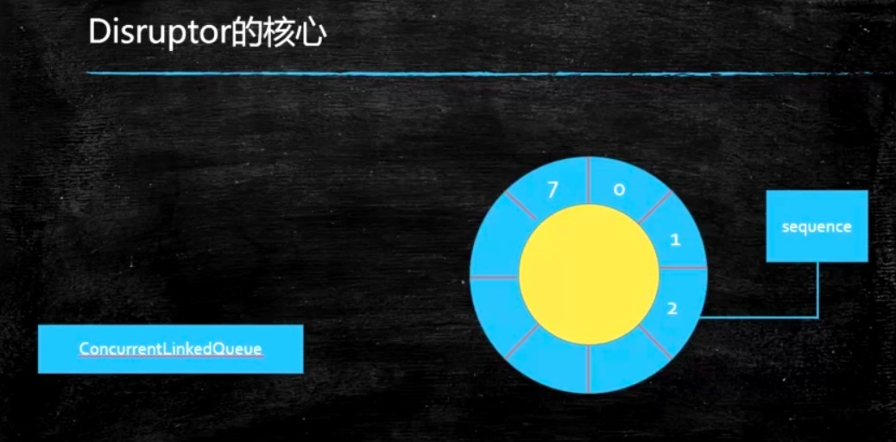

按照英文翻译的话，Disruptor应该是分裂、瓦解。这个Disruptor是一个做金融的、做股票的这样一个公司交易所来开发的，为自己来开发的这么一个底层的框架，开发出来之后受到了很多的认可，开源之后，2011年获得Duke将。如果你想把它用作MQ的话，单机最快的MQ。性能非常的高，主要是它里面用的全都是cas，另外把各种各样的性能开发到了极致，所以他单机支持很高的一个并发。

Disruptor不是平时我们学的这个redis、不是平时我们所学的kafka，他可以跟他们一样有类似的用途，但他是单机，redis、kafka也可以用于集群。redis他有这种序列化的机制，就是你可以把它存储到硬盘上或数据库当中是可以的，kafka当然也有，Disruptor没有，Disruptor就是在内存里，Disruptor简单理解就是内存里用于存放元素的一个高效率的队列。

## 1. 介绍

关于Disruptor的一些资料，给大家列在这里。

主页：http://imax-exchange.github.io/disruptor/

源码：https://github.com/LMAX-Exchange/disruptor

GettingStarted:https://github.com/LMAX-Exchange/disruptor/wiki/Getting-Started

api:http://imax-exchange.github.io/disruptor/docs/index.html

maven:https://mvnrepository.com/artifact/com.imax/disruptor


Disruptor叫无锁、高并发、环形Buffer，直接覆盖（不用清除）旧的数据，降低GC频率，用于生产者消费者模式（如果说按照设计者角度来讲他就是观察者模式）。什么叫观察者模式，想象一下，我们在前面学各种各样的队列的时候，队列就是个容器，好多生产者往里头扔东西，好多消费者从里头往外拿东西。所谓的生产者消费者就是这个意思，为什么我们可以叫他观察者呢，因为这些消费者正在观察着里面有没有新东西，如果有的话我马上拿过来消费，所以他也是一种观察者模式。Disruptor实现的就是这个容器

## 2. Disruptor核心与特点

Disruptor也是一个队列，和其他队列不一样的是他是一个环形队列，环形的Buffer。一般情况下我们的容器是一个队列，不管你是用链表实现还是用数组实现的，它会是一个队列，那么这个队列生产者这边使劲往里塞，消费者这边使劲往外拿，但Disruptor的核心是一个环形的buffer。



- 对比ConcurrentLinkedQueue：链表实现

  这种环形的buffer速度就是更快，同学们可以去查一下JDK自带的容器，你会发现效率比较高的有各种各样的队列，如果不想阻塞就可以用Concurrent相关的，ConcurrentLinkedQueue是并发的用链表实现的队列，它里面大量的使用了cas，因此它的效率相对比较高，可是对于遍历来讲链表的效率一定会比数组低。

- JDK中没有ConcurrentArrayQueue

  因为数组的大小的固定的，如果想扩展的话就要把原来的数组拷贝到新数组里，每次加都要拷贝这个效率相当底，所以他并没有给大家加这个叫ConcurrentArrayQueue，但是Disruptor就非常牛X，想到了这样一个办法，就是把数组的头尾相连。

- Disruptor是用数组实现的

  这样的一个队列，你可以认为Disruptor就是用数组实现的ConcurrentArrayQueue，另外这个Queue是首尾相连的

那Disruptor用数组实现的环形的就比上面两个都牛吗，牛在哪？为啥呢？如果我们用ConcurrentLinkedQueue这里面就是一个一个链表，这个链表遍历起来肯定没有数组快，这个是一点。还有第二点就是这个链表要维护一个头指针和一个尾指针，我往头部加的时候要加锁，往尾部拿的时候也要加锁。另外链表本身效率就偏低，还要维护两个指针。关于环形的呢，环形本身就维护一个位置，这个位置称之为sequence序列，这个序列代表的是我下一个有效的元素指在什么位置上，就相当于他只有一个指针来回转。加在某个位置上怎么计算：直接用那个数除以我们整个的容量求余就可以了。

- RingBuffer是一个环形队列

- RingBuffer的序号，指向下一个可用的元素

- 采用数组实现，没有首尾指针

- 对比ConcurrentLinkedQueue，用数组实现的速度更快

  假如长度为8，当添加到第12个元素的时候在哪个序号上呢？用12%8决定

  当Buffer被填满的时候到底是覆盖还是等待，由Produce决定

  长度设为2的n次幂，利于二进制计算，例如：12%8=12&（8-1）

如果大家对于位运算有疑问的，在咱们网站上有一个菜鸟预习，里面有一部分是二进制，大家去翻看一下。

由于它会采用覆盖的方式，所以他没有必要记头指针，没有必要记尾指针。我只要记一个指针放在这就可以了。在这点上依然要比ConcurrentLinkedQueue要快。

那我生产者线程生产的特别多，消费者没来得及消费那我在往后覆盖的话怎么办？不会那么轻易的让你覆盖的，我们是有策略的，我生产者生产满了，要在生产一个的话就马上覆盖这个位置上的数了。这时候是不能覆盖的，指定了一个策略叫等待策略，这里面有8中等待策略，分情况自己去用。最常见的是BlockingWait，满了我就在这等着，什么时候你空了消费者来唤醒一下就继续。

## 3. Disruptor开发步骤

开发步骤是比较固定的一个开发步骤。

1：定义Event-队列中需要处理的元素。

​	在Disruptor他是每一个消息都认为是一个事件，在他这个概念里就是一个事件，所以在这个环形队列里面存的是一个一个的Event。

2：定义Event工厂，用于填充队列

​	那这个Event怎么产生，就需要指定Event的工厂。

3：定义EventHandler(消费者)，处理容器中的元素

​	那这个Event怎么消费呢，就需要指定Event的消费者EventHandler。

下面我们直接看程序，先看来自官网的几个辅助程序：LongEvent这个事件里面或者说消息里面装的什么值，我只装了一个long值，但这里面可以装任何值，任何类型的都可以往里装，这个long类型的值我们可以指定他set，官网上没有toString方法，我给大家加了一段主要是为了打印消息让大家看的更清楚。

```java
package com.mashibing.disruptor;
public class LongEvent
{
  	private long value;
  
  	public void set(long value)
    {
      	this.value = value;
    }
  
  	@Override
  	public String toString(){
      	return "LongEvent{" +
          			"value=" + value +
          			"}";
    }
}
```

然后呢，我需要一个EventFactory就是怎么产生这些个事件，这个Factory非常简单，LongEventFactory去实现EventFactiry的接口，去重写它的newInstance方法直接new  LongEvent。构建这个环的时候为什么要指定一个产生事件的工厂，我直接new这个事件不可以吗？但是有的事件里面的构造方法不让你new呢，产生事件工厂的话你可以灵活的指定一些 ，这里面也是牵扯到效率的。底层比较深，我给大家解释一下：

这里牵扯效率问题，因为Disruptor初始化的时候会调用Event工厂，对ringBuffer进行内存的提前分配，GC频率会降低。

```java
package com.mashibing.disruptor;

import com.lmax.disruptor.EventFactory;
public class LongEventFactory implements EventFactiry<LongEvent>{
  	
  	@Override
  	public LongEvent newInstance(){
      	return new LongEvent();
    }
}
```

在看第三个叫LongEventHandler，Handler就是我拿到这个事件之后该怎么样进行处理，所以这里是消息的消费者，怎么处理呢，很简单，我处理完这个消息之后呢就记一个数，总共记下来我一共处理了多少消息了，处理消息的时候默认调用的是onEvent方法，这个方法里面有三个参数，第一个是你要处理的那个消息，第二个是你处理的是哪个位置上的消息，第三个是整体的消息结束没结束，是不是处理完了。你可以判断他如果是true的话消费者就可以退出了，如果是false的话说明后面还有继续消费。

```java
package com.mashibing.disruptor;

import com.lmax.disruptor.EventHandler;

public class LongEventHandler implements EventHandler<LongEvent>{
  	/**
  	*
  	*@param event
  	*@param sequence RingBuffer的序号
  	*@param endOfBatch 是否为最后一个元素
  	*@throws Exception
  	**/
  	
  	public static long count = 0;
  	
  	@Override
  	public void onEvent(LongEvent event,long sequence,boolean endOfBatch) throws Exception{
	      count++;	
      	System.out.println("["+Thread.currentThread().getName()+"]"+event+"序号："+sequence);
    }
}

```

所以我们定义了这三个类，关于这三个类在给大家解释一下，我们现在有一个环，然后这个环上每一个位置装LongEvent，怎么产生这个LongEvent通过这个LongEventFactory的newInstance方法来产生，当我拿到这个Event之后通过LongEventHandler进行处理。

到现在我们把这三个辅助类都已经定义好了，定义好的情况下我们怎么才能比较有机的结合在一起，让他在Disruptor进行处理呢，看第一个小例子程序，首先把EvenFactory给他初始化了new LongEventFactory，我们这个环应该是2的N次方1024，然后new一个Disruptor出来，需要指定这么几个参数：factory产生消息的工厂；bufferSize是指定这个环大小到底是多少；defaultThreadFactory线程工厂，指的是当他要产生消费者的时候，当要调用这个消费者的时候他是在一个特定的线程里执行的，这个线程就是通过defaultThreadFactory来产生；

继续往下看，当我们拿到这个消息之后怎么进行处理啊，我们就用这个LongEventHandler来处理。然后start，当start之后一个环起来了，每个环上指向的这个LongEvent也得初始化好，内存分配好了，整个就安安静静的等待着生产者的到来。

看生产者的代码，long sequence = ringBuffer.next()，通过next找到下一个可用的位置，最开始这个环是空的，下一个可用的位置是0这个位置，拿到这个位置之后直接去ringBuffer里面get(0)这个位置上的event。如果说你要是追求效率的极致，你应该是一次性全部初始化好，你get的时候就不用再去判断，如果你想做一个延迟，很不幸的是你每次都要做判断是不是初始化了。get的时候就是拿到一个event，这个是我们new出来的默认的，但是我们可以改里面的event.set( 值...)，填好数据之后ringBuffer.publish发布生产。

```java
package com.mashibing.disruptor;

import java.util.concurrent.Executor;
import java.util.concurrent.Executors;

import com.lmax.disruptor.dsl.Disruptor;
import com.lmax.disruptor.RingBuffer;
import com.lmax.disruptor.util.DaemonThreadFactory;
import java.nio.ByteBuffer;

public class Main01
{
  	public static void main(String[] args) thrwos Exception
    {
      	//the factory for the event
      	LongEvenFactory factory = new LongEventFactory();
      	
      	//Specify the of the ring buffer,must be power of 2.
      	int bufferSize = 1024;
      
      	//Construct the Disruptor
      	Disruptor<LongEvent> disruptor = new Disruptor<>(factory,bufferSize, Executors.defaultThreadFactory());
      
      	//Connect the handler
      	disruptor.handleEventsWith(new LongEventHandler());
      
      	//Start the Disruptor,start all threads running
      	disruptor.start();
      
      	//Get the ring buffer form the Disruptor to be used for publishing.
      	RingBuffer<LongEvent> ringBuffer = disruptor.getRingBuffer();
      
      	//官方例程
      	long sequence = ringBuffer.next();//Grab the next sequence
      	try
        {
          	LongEvent event=ringBuffer.get(sequence);//Get the entry in the Disruptor
          	//for the sequence
          	event.set(8888L);//Fill with data
        }
      	finally
        {
          	ringBuffer.publish(sequence);
        }
    }
}

```

disruptor在后面提供了一些Lambda表达式的写法，为了支持这种写法对整个消息的构建过程做了改进，读下面02小程序使用translator，就是怎么样构建这个消息，原来我们都是用消息的factory，但是下面这次我们用translator对他进行构建，就是把某一些数据翻译成消息。前面产生event工厂还是一样，然后bufferSize，后面再扔的是DaemonThreadFactory就是后台线程了，new LongEventHandler然后start拿到他的ringBuffer，前面都一样。只有一个地方叫EventTranslator不一样，我们在main01里面的代码是要写try  catch然后把里面的值给设好，相当于把这个值转换成event对象。相对简单的写法，它会把某些值转成一个LongEvent，通过EventTranslator。new出来后实现了translateTo方法，EventTranslator他本身是一个接口，所以你要new的时候你又要实现它里面没有实现的方法，translateTo的意思是你给我一个Event，我会把这个Event给你填好。ringBuffer.publishEvent(translator1) 你只要把translator1交个ringBuffer就可以了。这个translator就是为了迎合Lambda表达式的写法（为java8的写法做准备）

另外translator有很多种用法：

EventTranslatorOneArg只有带一个参数的EventTranslator。我带有一个参数，这个参数会通过我的translateTo方法转换成一个LongEvent；

既然有EventTranslatorOneArg就有EventTranslatorTwoArg、EventTranslatorThreeArg，还有EventTranslatorVararg多了去了Vararg就是有好多个值，我把里面的值全都给你加起来最后把结果set到event里面。

```java
package com.mashibing.disruptor;

import java.util.concurrent.Executor;
import java.util.concurrent.Executors;

import com.lmax.disruptor.dsl.Disruptor;
import com.lmax.disruptor.RingBuffer;
import com.lmax.disruptor.util.DaemonThreadFactory;
import java.nio.ByteBuffer;

public class Main02
{
  	public static void main(String[] args) thrwos Exception
    {
      	//the factory for the event
      	LongEvenFactory factory = new LongEventFactory();
      	
      	//Specify the of the ring buffer,must be power of 2.
      	int bufferSize = 1024;
      
      	//Construct the Disruptor
      	Disruptor<LongEvent> disruptor = new Disruptor<>(factory,bufferSize, DaemonThreadFactory.INSTANCE);
      
      	//Connect the handler
      	disruptor.handleEventsWith(new LongEventHandler());
      
      	//Start the Disruptor,start all threads running
      	disruptor.start();
      
      	//Get the ring buffer form the Disruptor to be used for publishing.
      	RingBuffer<LongEvent> ringBuffer = disruptor.getRingBuffer();
      
      	//========================================================================
      	EventTranslator<LongEvent> translator1 = new EventTranslator<LongEvent>(){
          	@Override
          	public void translateTo(LongEvent event,long sequence){ event.set(8888L); }
        };
      	ringBuffer.publishEvent(translator1);
	      //========================================================================
      	EventTranslatorOneArg<LongEvent,Long> translator2 = new EventTranslatorOneArg<LongEvent,Long>(){
          @Override
          public void translateTo(LongEvent event,long sequence,Long l){ event.set(l); }
        };
      	ringBuffer.publishEvent(translator2,7777L);
      //========================================================================
      	EventTranslatorTwoArg<LongEvent,Long,Long> translator3 = new EventTranslatorTwoArg<LongEvent,Long,Long>(){
          @Override
          public void translateTo(LongEvent event,long sequence,Long l1,Long l2){ event.set(l); }
        };
      	ringBuffer.publishEvent(translator3,10000L,10000L);
       //========================================================================
      	EventTranslatorThreeArg<LongEvent,Long,Long,Long> translator4 = new EventTranslatorThreeArg<LongEvent,Long,Long,Long>(){
          @Override
          public void translateTo(LongEvent event,long sequence,Long l1,Long l2,Long l3){ event.set(l1+ l2+ l3); }
        };
      	ringBuffer.publishEvent(translator4,10000L,10000L,10000L);
      //========================================================================
      	EventTranslatorVararg<LongEvent> translator5 = new EventTranslatorThreeArg<LongEvent>(){
          @Override
          public void translateTo(LongEvent event,long sequence,Object... objects){
          		long result = 0;
            	for(Object o : objects){
                	long l =(Long)o;
                	result +=l;
              }
          }
        };
      	ringBuffer.publishEvent(translator5,10000L,10000L,10000L,10000L);
    }
}
```

有了上面Translator之后呢，下面看Lambda表达式怎么写，这个是比较简洁的写法，连factory都省了，直接指定一个Lambda表达式LongEvent::new。继续handleEventsWith把三个参数传进来后面写好Lambda表达式直接打印，然后start， 接着RingBuffer，publishEvent原来我们还有写try...catch，现在简单了直接ringBuffer.publishEvent（第一个是lambda表达式，表达式后是你指定的几个参数），所以现在的这种写法就不定义各种各样的EventTranslator了。

```java
package com.mashibing.disruptor;

import java.util.concurrent.Executor;
import java.util.concurrent.Executors;

import com.lmax.disruptor.dsl.Disruptor;
import com.lmax.disruptor.RingBuffer;
import com.lmax.disruptor.util.DaemonThreadFactory;
import java.nio.ByteBuffer;

public class Main03
{
  	public static void main(String[] args) thrwos Exception
    {
      	//the factory for the event
      	LongEvenFactory factory = new LongEventFactory();
      	
      	//Specify the of the ring buffer,must be power of 2.
      	int bufferSize = 1024;
      
      	//Construct the Disruptor
      	Disruptor<LongEvent> disruptor = new Disruptor<>(LongEvent::new, bufferSize,DaemonThreadFactory.INSTANCE);
      
      	//Connect the handler
      	disruptor.handleEventsWith((event,sequence,endOfBatch)->System.out.println("Event:"+event));
      
      	//Start the Disruptor,start all threads running
      	disruptor.start();
      
      	//Get the ring buffer form the Disruptor to be used for publishing.
      	RingBuffer<LongEvent> ringBuffer = disruptor.getRingBuffer();
      
      
      	ringBuffer.publishEvent((event, sequence)-> event.set(10000L)); 
			
      	System.in.read();

    }
}
```

下面我们叫一些细节，这些个细节也不难，讲给大家。第一个细节是我们生产者的时候默认会有好多种生产方式，默认的是多线程生产者，但是假如你确定你整个程序里头只有一个生产者的话那你还能提高效率，就是在你指定Disruptor生产者的线程的方式是SINGLE，生产者的类型ProducerType。

## 4. ProducerType生产者线程模式

- ProducerType有两种模式ProducerMULTI和Producer.SINGLE
- 默认是MULTI，表示在多线程模式下产生sequence
- 如果确认是单线程生产者，那么可以指定SINGLE，效率会提升
- 如果是多个生产者（多线程），但模式指定为SINGLE，会出什么问题？

假如你的程序里头只有一个生产者还用ProducerMULTI的话，我们对序列来进行多线程访问的时候肯定是要加锁的，所以MULTI里面默认是有锁定处理的，但是假如你只有一个线程这个时候应该吧生产者指定为SINGLE，他的效率更高，因为它里面不加锁。

下面这个小程序，我这里指定的是Producer.SINGLE，但是我生产的时候用的是一堆线程，当我制定了Producer.SINGLE之后相当于内部对于序列的访问就没有锁了，它会把性能发挥到极致，它不会报错，它会把你的消息静悄悄的覆盖了，因此你要小心一点。我这里这个写法是我有50 个线程然后每个线程生产100个数，最后结果正常的话应该是有5000个消费产生。

```java
package com.mashibing.disruptor;

import java.util.concurrent.Executor;
import java.util.concurrent.Executors;

import com.lmax.disruptor.dsl.Disruptor;
import com.lmax.disruptor.RingBuffer;
import com.lmax.disruptor.util.DaemonThreadFactory;
import java.nio.ByteBuffer;

public class Main04_ProducerType{
  	public static void main(String[] args) thrwos Exception{
      //the factory for the event
      	LongEvenFactory factory = new LongEventFactory();
      	
      	//Specify the of the ring buffer,must be power of 2.
      	int bufferSize = 1024;
      
      	//Construct the Disruptor
      	//Disruptor<LongEvent> disruptor = new Disruptor<>(factory,bufferSize, Executors.defaultThreadFactory());
      	
  			Disruptor<LongEvent> disruptor = new Disruptor<>(factory,bufferSize, Executors.defaultThreadFactory(),ProducerType.SINGLE,new BlockingWaitStrategy());
      
      	//Connect the handler
      	disruptor.handleEventsWith(new LongEventHandler());
      
      	//Start the Disruptor,start all threads running
      	disruptor.start();
      
      	//Get the ring buffer form the Disruptor to be used for publishing.
      	RingBuffer<LongEvent> ringBuffer = disruptor.getRingBuffer();
  			
  			//========================================================================
  			final int threadCount = 50;
  			CycliBarrier barrier=new CycliBarrier(threadCount);
  			ExecutorService service = Executors.newCachedThreadPool();
  			for(long i=0; i<threadCount; i++){
          	final long threadNum = i; 
          	service.submit(()->{
              	System.out.printf("Thread %s ready to start!\n",threadNum);
              	try{
                   barrier.await();
                }catch(InterruptedException e){
                   e.printStackTrace();
                }catch(BrokenBarrierException e){
                   e.printStackTrace();
                }
              
              	for(int j=0; j<100;j++){
                  	ringBuffer.publishEvent((event,sequence)->{
                      	event.set(threadNum);
                      	System.out.println("生产了"+threadNum);
                    });
                }
            });
        }
  			
  			service.shutdown();
  			//disruptor.shutdown();
  			TimeUnit.SECONDS.sleep(3);
  			System.out.println(LongEventHandler.count);
    }
}
```


我们再来聊一下等待策略WaitStrategy，有好多种方法，看下面

## 5. 等待策略

- （常用）BlockingWaitStrategy:通过线程堵塞的方式，等待生产者唤醒，被唤醒后，再循环检查依赖的sequence是否已经消费。
- BusySpinWaitStrategy：线程一直自旋等待，可能比较耗cpu
- LiteBlockingWaitStrategy：线程阻塞等待生产者唤醒，与BlockingWaitStrategy相比，区别在signalNeeded.getAndSet，如果两个线程同时访问一个访问waitfor，一个访问signalAll时，可以减少lock加锁次数
- LiteTimeoutBlockingWaitStrategy：与LiteBlockingWaitStrategy相比，设置了阻塞时间，超过时间后抛出异常
- PhasedBackoffWaitStrategy：根据时间参数和传入的等待策略来决定使用那种等待策略
- TimeoutBlockingWaitStrategy：相对于BlockingWaitStrategy来说，设置了等待时间，超过后抛出异常
- （常用）YieldingWaitStrategy：尝试100次，然后Thread.yield()让出cpu
- （常用）SleepingWaitStrategy：sleep

我们常用的BlockingWaitStrategy满了就等着；SleepingWaitStrategy满了就睡一觉，睡醒了看看能不能继续执行了；YieldingWaitStrategy让出cpu，让你消费者赶紧消费，消费完了之后我又回来看看我是不是又能生产了；一般YieldingWaitStrategy效率是最高的，但也要看实际情况适用不适用。

```java
package com.mashibing.disruptor;

import java.util.concurrent.Executor;
import java.util.concurrent.Executors;

import com.lmax.disruptor.dsl.Disruptor;
import com.lmax.disruptor.RingBuffer;
import com.lmax.disruptor.util.DaemonThreadFactory;
import java.nio.ByteBuffer;

public class Main05_WaitStrategy{
    	public static void main(String[] args) thrwos Exception{
					
          //the factory for the event
          LongEvenFactory factory = new LongEventFactory();

          //Specify the of the ring buffer,must be power of 2.
          int bufferSize = 1024;

          //Construct the Disruptor
          Disruptor<LongEvent> disruptor = new Disruptor<>(factory,bufferSize, Executors.defaultThreadFactory(),ProducerType.MULTI,new SleepingWaitStrategy());

          //Connect the handler
          disruptor.handleEventsWith(new LongEventHandler());

          //Start the Disruptor,start all threads running
          disruptor.start();

          //Get the ring buffer form the Disruptor to be used for publishing.
          RingBuffer<LongEvent> ringBuffer = disruptor.getRingBuffer();

          //========================================================================
          final int threadCount = 50;
          CycliBarrier barrier=new CycliBarrier(threadCount);
          ExecutorService service = Executors.newCachedThreadPool();
          for(long i=0; i<threadCount; i++){
              final long threadNum = i; 
              service.submit(()->{
                  System.out.printf("Thread %s ready to start!\n",threadNum);
                  try{
                     barrier.await();
                  }catch(InterruptedException e){
                     e.printStackTrace();
                  }catch(BrokenBarrierException e){
                     e.printStackTrace();
                  }

                  for(int j=0; j<100;j++){
                      ringBuffer.publishEvent((event,sequence)->{
                          event.set(threadNum);
                          System.out.println("生产了"+threadNum);
                      });
                  }
              });
          }

          service.shutdown();
          //disruptor.shutdown();
          TimeUnit.SECONDS.sleep(3);
          System.out.println(LongEventHandler.count);
      }
}
```

我们来看多个消费者怎么指定，默认的情况下只有一个消费者，你想要有多个消费者的时候也非常简单，看下面代码我定义了两个消费者h1、h2，disruptor.handleEventsWith(h1,h2)这里面是一个可变参数，所以你要想有多个消费者的时候就往里装，多个消费者是位于多个线程里面的。

```Java
package com.mashibing.disruptor;

import java.util.concurrent.Executor;
import java.util.concurrent.Executors;

import com.lmax.disruptor.dsl.Disruptor;
import com.lmax.disruptor.RingBuffer;
import com.lmax.disruptor.util.DaemonThreadFactory;
import java.nio.ByteBuffer;

public class Main06_MultiConsumer{
    	public static void main(String[] args) thrwos Exception{
					
          //the factory for the event
          LongEvenFactory factory = new LongEventFactory();

          //Specify the of the ring buffer,must be power of 2.
          int bufferSize = 1024;

          //Construct the Disruptor
          Disruptor<LongEvent> disruptor = new Disruptor<>(factory,bufferSize, Executors.defaultThreadFactory(),ProducerType.MULTI,new SleepingWaitStrategy());

          //Connect the handlers
          LongEventHandler h1 = new LongEventHandler();
          LongEventHandler h2 = new LongEventHandler();
					 disruptor.handleEventsWith(h1,h2);
        
          //Start the Disruptor,start all threads running
          disruptor.start();

          //Get the ring buffer form the Disruptor to be used for publishing.
          RingBuffer<LongEvent> ringBuffer = disruptor.getRingBuffer();

          //========================================================================
          final int threadCount = 10;
          CycliBarrier barrier=new CycliBarrier(threadCount);
          ExecutorService service = Executors.newCachedThreadPool();
          for(long i=0; i<threadCount; i++){
              final long threadNum = i; 
              service.submit(()->{
                  System.out.printf("Thread %s ready to start!\n",threadNum);
                  try{
                     barrier.await();
                  }catch(InterruptedException e){
                     e.printStackTrace();
                  }catch(BrokenBarrierException e){
                     e.printStackTrace();
                  }

                  for(int j=0; j<10;j++){
                      ringBuffer.publishEvent((event,sequence)->{
                          event.set(threadNum);
                          System.out.println("生产了"+threadNum);
                      });
                  }
              });
          }

          service.shutdown();
          //disruptor.shutdown();
          TimeUnit.SECONDS.sleep(3);
          System.out.println(LongEventHandler.count);
      }
}
```


还有disruptor最后一个问题，出了异常怎么处理

## 6. 消费者异常处理

默认：disruptor.setDefaultExceptionHandler()

覆盖：disruptor.handleExceptionFor().with()

看下面代码，这这里方法里写了一个EventHandler是我们的消费者，在消费者里打印了event之后马上抛出了异常，当我们消费者出现异常之后你不能让整个线程停下来，有一个消费者出了异常那其他的消费者就不干活了，肯定不行。handleExceptionsFor为消费者指定Exception处理器 (h1).with后面是我们的ExceptionHandler出了异常之后该怎么办进行处理，重写三个方法，第一个是当产生异常的时候在这很简单直接打印出来了；第二个是handleOnStart如果启动的时候出异常；第三个handleOnShutdown你该怎么处理。

```java
package com.mashibing.disruptor;

import java.util.concurrent.Executor;
import java.util.concurrent.Executors;

import com.lmax.disruptor.dsl.Disruptor;
import com.lmax.disruptor.RingBuffer;
import com.lmax.disruptor.util.DaemonThreadFactory;
import java.nio.ByteBuffer;

public class Main07_ExceptionHandler{
    	public static void main(String[] args) thrwos Exception{
					
          //the factory for the event
          LongEvenFactory factory = new LongEventFactory();

          //Specify the of the ring buffer,must be power of 2.
          int bufferSize = 1024;

          //Construct the Disruptor
          Disruptor<LongEvent> disruptor = new Disruptor<>(factory,bufferSize, Executors.defaultThreadFactory(),ProducerType.MULTI,new SleepingWaitStrategy());

          //Connect the handlers
          EventHandler h1 = (event,sequence,end)->{
            	System.out.println("消费者出异常")；
          };
					 disruptor.handleEventsWith(h1);
        	
        	disruptor.handleExceptionsFor(h1).with(new ExceptionHandler<LongEvent>(){
            	@Override
            	public void handleEventException(Throwable throwable,long l,LongEvent longEvent){
                	throwable.printStackTrace();
              }
            
            	@Override
            	public void handleOnStartException(Throwable throwable){
                	System.out.println("Exception Start to Handle!");
              }
            
            	@Override
            	public void handleOnShutdownException(Throwable throwable){
                	System.out.println("Exception End to Handle!");
              }
          });
          
          //Start the Disruptor,start all threads running
          disruptor.start();

          //Get the ring buffer form the Disruptor to be used for publishing.
          RingBuffer<LongEvent> ringBuffer = disruptor.getRingBuffer();

          //========================================================================
          final int threadCount = 1;
          CycliBarrier barrier=new CycliBarrier(threadCount);
          ExecutorService service = Executors.newCachedThreadPool();
          for(long i=0; i<threadCount; i++){
              final long threadNum = i; 
              service.submit(()->{
                  System.out.printf("Thread %s ready to start!\n",threadNum);
                  try{
                     barrier.await();
                  }catch(InterruptedException e){
                     e.printStackTrace();
                  }catch(BrokenBarrierException e){
                     e.printStackTrace();
                  }

                  for(int j=0; j<10;j++){
                      ringBuffer.publishEvent((event,sequence)->{
                          event.set(threadNum);
                          System.out.println("生产了"+threadNum);
                      });
                  }
              });
          }

          service.shutdown();
          //disruptor.shutdown();
          TimeUnit.SECONDS.sleep(3);
          System.out.println(LongEventHandler.count);
      }
}
```

disruptor是一个环，然后这个环有多个生产者可以往里头生产，由于它是环形的设计效率会非常的高，我们写程序的时候是这样写的，首先你自己定义好Event消息的格式，然后定义消息工厂，消息工厂是用来初始化整个环的时候相应的一些位置上各种各样不同的消息先把它new出来，new出来之后先占好空间，我们在生产的时候只需要把这个位置上这个默认的这块空间拿出来往里头填值，填好值之后消费者就可以往里头消费了，消费完了生产者就可以继续往里头生产了，如果说你生产者消费的比较快，消费着消费的比较慢，满了怎么办，就是用各种各样的等待策略，消费者出了问题之后可以用ExceptionHandler来进行处理。