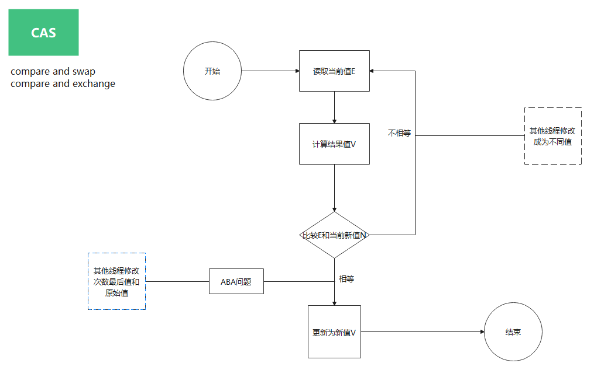
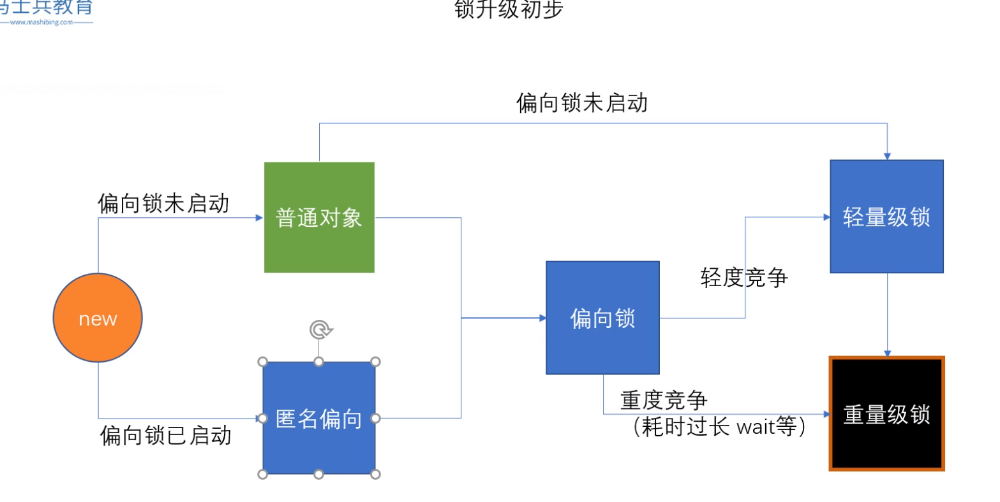
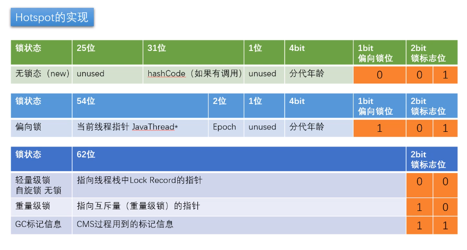

# 大厂真题

面试官非常喜欢抛出一个问题，让你自由发挥，看你能将多深

>- 请描述synchrnozied和reentrantLock的底层实现及重入的底层原理 - 百度 阿里
>- 请描述锁的四种状态和升级过程 - 百度 阿里
>- CAS的ABA问题如何解决 - 百度
>- 请谈一下AQS，为什么AQS的此等是CAS + volatile - 百度
>- 请谈一下你对volatitle 的理解 - 美团 阿里
>- volatile 的可见性和禁止指令重排是如何实现的 - 美团
>- CAS是什么 - 美团
>- 请描述一下对象的创建过程 - 美团 顺丰
>- 对象在内存中的内存布局 - 美团 顺丰
>- DCL单例为什么要加volatitle - 美团
>- 解释一下锁的四种状态 - 顺丰
>- Object o = new Object() 在内存中占多少字节？ - 顺丰
>- 请描述synchronized 和 ReentrantLock的异同 - 顺丰
>- 聊聊你对as-if-serial 和 happens-before 语义的理解 - 顺丰
>- 你了解ThreadLocal 吗？你知道ThreadLocal 中如何解决内存泄漏问题吗？ - 京东 阿里
>- 请描述一下锁的分类以及JDK中的应用 - 阿里
>- 问：自旋锁一定比重量级锁效率高吗？ - 阿里
>- 打开偏向锁是否效率一定会提升？为什么？

#  1. 用户态与内核态

**用户态：**只能访问用户可以访问的指令
**内核态：**可以访问内核空间的指令

JVM是运行在用户态的，早期的jdk中synchronized加锁会通过OS申请加锁，在内核态是重量级锁。偏向锁和轻量级锁在用户态。


著名的80中断

# 2. CAS



Compare And Swap（Compare And Exchange）/ 自旋/ 自旋锁/无锁（无重量级锁）

因为经常配合循环操作，知道完成为止，所以泛指一类操作

cas(v, a, b), 变量V, 期待值a，修改值b

ABA问题，你私藏的100块钱，被别人用了，但是后来别人又还了100，放在原处，此时你发现你私藏的100块钱还在，虽然钱没少，但是钱已经不是你当初的钱了

自旋就是你空转等待，一直等到她接纳你为止

解决ABA问题（加版本号，AtomicStampedReference），基础类型简单值不需要版本号

# 3.UnSafe


# 4. markword

# 5.工具：JOL=Java Object Layout

```xml
<dependency>
    <groupId>org.openjdk.jol</groupId>
    <artifactId>jol-core</artifactId>
    <version>0.9</version>
</dependency>
```

jdk8:markOop.hpp

```c++
32 bits:
 --------
 hash:25 ------------>| age:4    biased_lock:1 lock:2 (normal object)
 JavaThread*:23 epoch:2 age:4    biased_lock:1 lock:2 (biased object)
 size:32 ------------------------------------------>| (CMS free block)
 PromotedObject*:29 ---------->| promo_bits:3 ----->| (CMS promoted object)

 64 bits:
 --------
 unused:25 hash:31 -->| unused:1   age:4    biased_lock:1 lock:2 (normal object)
 JavaThread*:54 epoch:2 unused:1   age:4    biased_lock:1 lock:2 (biased object)
 PromotedObject*:61 --------------------->| promo_bits:3 ----->| (CMS promoted object)
 size:64 ----------------------------------------------------->| (CMS free block)

 unused:25 hash:31 -->| cms_free:1 age:4    biased_lock:1 lock:2 (COOPs && normal object)
 JavaThread*:54 epoch:2 cms_free:1 age:4    biased_lock:1 lock:2 (COOPs && biased object)
 narrowOop:32 unused:24 cms_free:1 unused:4 promo_bits:3 ----->| (COOPs && CMS promoted object)
 unused:21 size:35 -->| cms_free:1 unused:7 ------------------>| (COOPs && CMS free block)

...

enum {  locked_value             = 0, // 0 00 轻量级锁
         unlocked_value           = 1,// 0 01 无锁
         monitor_value            = 2,// 0 10 重量级锁
         marked_value             = 3,// 0 11 gc标志
         biased_lock_pattern      = 5 // 1 01 偏向锁
  };
```

# 6.synchronized的横切面详解

1. synchronized原理

2. 升级过程

3. 汇编实现

4. vs reentrantLock的区别？

## 6.1 Java远吗层级

synchronized(o)

## 6.2 字节码层级

monitorenter monitorexit

## 6.3 JVM底层(Hotspot)

```java
package com.liufei.sync;
import org.openjdk.jol.info.ClassLayout;

public class HelloJOL {

    public static void main(String[] args) {
        Object o = new Object();
        System.out.println(ClassLayout.parseInstance(o).toPrintable());
    }
}

```


interperterRuntime.cpp （位置：src/share/vm/interpreter/interperterRuntime.cpp）

```c++
//%note monitor_1
IRT_ENTRY_NO_ASYNC(void, InterpreterRuntime::monitorenter(JavaThread* thread, BasicObjectLock* elem))
#ifdef ASSERT
  thread->last_frame().interpreter_frame_verify_monitor(elem);
#endif
  if (PrintBiasedLockingStatistics) {
    Atomic::inc(BiasedLocking::slow_path_entry_count_addr());
  }
  Handle h_obj(thread, elem->obj());
  assert(Universe::heap()->is_in_reserved_or_null(h_obj()),
         "must be NULL or an object");
  if (UseBiasedLocking) { // 如果使用偏向锁
    // Retry fast entry if bias is revoked to avoid unnecessary inflation
    ObjectSynchronizer::fast_enter(h_obj, elem->lock(), true, CHECK);
  } else {
    ObjectSynchronizer::slow_enter(h_obj, elem->lock(), CHECK);
  }
  assert(Universe::heap()->is_in_reserved_or_null(elem->obj()),
         "must be NULL or an object");
#ifdef ASSERT
  thread->last_frame().interpreter_frame_verify_monitor(elem);
#endif
IRT_END
```

synchronizer.cpp（位置：src/share/vm/runtime/synchronizer.cpp）

revoke_add_rebias

```c++
void ObjectSynchronizer::fast_enter(Handle obj, BasicLock* lock, bool attempt_rebias, TRAPS) {
 // 如果使用偏向锁。revoke_and_rebias 撤销并指向偏向锁
 if (UseBiasedLocking) {
    if (!SafepointSynchronize::is_at_safepoint()) {
      BiasedLocking::Condition cond = BiasedLocking::revoke_and_rebias(obj, attempt_rebias, THREAD);
      if (cond == BiasedLocking::BIAS_REVOKED_AND_REBIASED) {
        return;
      }
    } else {
      assert(!attempt_rebias, "can not rebias toward VM thread");
      BiasedLocking::revoke_at_safepoint(obj);
    }
    assert(!obj->mark()->has_bias_pattern(), "biases should be revoked by now");
 }
 // 调用slow_enter
 slow_enter (obj, lock, THREAD) ;
}
```

```c++
// -----------------------------------------------------------------------------
// Interpreter/Compiler Slow Case
// This routine is used to handle interpreter/compiler slow case
// We don't need to use fast path here, because it must have been
// failed in the interpreter/compiler code.
void ObjectSynchronizer::slow_enter(Handle obj, BasicLock* lock, TRAPS) {
  markOop mark = obj->mark();
  assert(!mark->has_bias_pattern(), "should not see bias pattern here");

  if (mark->is_neutral()) {
    // Anticipate successful CAS -- the ST of the displaced mark must
    // be visible <= the ST performed by the CAS. 进入自旋
    lock->set_displaced_header(mark);
    if (mark == (markOop) Atomic::cmpxchg_ptr(lock, obj()->mark_addr(), mark)) {
      TEVENT (slow_enter: release stacklock) ;
      return ;
    }
    // Fall through to inflate() ...
  } else
  if (mark->has_locker() && THREAD->is_lock_owned((address)mark->locker())) {
    assert(lock != mark->locker(), "must not re-lock the same lock");
    assert(lock != (BasicLock*)obj->mark(), "don't relock with same BasicLock");
    lock->set_displaced_header(NULL);
    return;
  }

#if 0
  // The following optimization isn't particularly useful.
  if (mark->has_monitor() && mark->monitor()->is_entered(THREAD)) {
    lock->set_displaced_header (NULL) ;
    return ;
  }
#endif

  // The object header will never be displaced to this lock,
  // so it does not matter what the value is, except that it
  // must be non-zero to avoid looking like a re-entrant lock,
  // and must not look locked either.
  lock->set_displaced_header(markOopDesc::unused_mark());
  ObjectSynchronizer::inflate(THREAD, obj())->enter(THREAD);
}
```

inflate方法：膨胀为重量级锁

# 7. 锁升级过程

## 7.1 JDK8 markword实现表





**自旋锁什么时候升级为重量级锁？**

> 看7竞争加剧

**为什么有自旋锁还需要重量级锁？**

> 自旋需要消耗CPU资源的，如果锁的时间长，或者自旋线程多，CPU会被大量消耗
>
> 重要级锁有等待队列，所有拿不到锁的进入到WaitSet队列中，不需要消耗CPU资源

**偏向锁是否一定比自旋锁效率高？**

> 不一定。在明确知道会有多线程竞争的情况下，偏向锁肯定会涉及到锁的撤销，这时直接使用自旋锁。
>
> JVM启动过程，会有很多线程竞争（明确知道），所以默认情况下启动时不打开偏向锁，过一段时间再打开


new - 偏向锁 - 轻量级锁（无锁，自旋锁，自适应自旋）- 重量级锁

synchronized 优化的过程和markword息息相关

用markword中最低的三位代表锁状态，其中1位是偏向锁位 两位是普通锁位

1. Object o = new Object()

   锁 = 0 01 无状态

   注意：如果打开偏向锁，默认是匿名偏向

2. o.hashcode()

   001 + hashcode

   ```
   
   ```

3. 默认 sychronized(o) 

   00 -> 轻量级锁

   默认情况  偏向锁有个时延，默认4秒

   Why？因为JVM虚拟机自己有一些默认启动的线程，里面有好多sync代码，这些sync代码启动时就知道肯定会有竞争，如果使用偏向锁，就会造成偏向所不断的进行锁撤销和锁升级的操作，效率低。

   ```
   -XX:BiasedLockingStartupDelay=0
   ```

4. 如果设定上述参数
   new Object()  -> 101 偏向锁 -> 线程ID为0 -> Anonymous BiasedLock
   打开偏向锁，new 出来的对象，默认就是一个可偏向匿名对象的101

5. 如果有线程上锁
   上偏向锁，指的就是，把markword的线程ID改为自己线程ID的过程
   偏向锁不可重偏向 批量偏向 批量撤销

6. 如果有线程竞争
   撤销偏向锁，升级轻量级锁
   线程在自己的线程栈生成LockRecord，用CAS操作将markword设置为指向自己这个线程的LR的指针，设置成功者得到锁

7. 如果竞争加剧
   竞争加剧：有线程超过10次自旋，-XX:PreBlockSpin，或者自旋线程数超过CPU核数的一半，1.6之后，加入自适应自旋Adapative Self Spinong，JVM自己控制
   升级重量级锁：向操作系统申请资源， linux mutex，CPU从3级-0级系统调用，线程挂起，进入等待队列，等待操作系统的调用，然后再映射回用户空间

**（以上实验环境是JDK11，打开就是偏向锁，而JDK8默认对象有是无锁）**

偏向锁默认是打开的，但是有一个时延，如果要观察到偏向锁，应该设置参数

**如果计算过对象的hashcode，则对象无法进入偏向状态！**

> 轻量级锁重量级锁的hashcode存在什么地方？
>
> 答案：线程栈中，轻量级锁的LR中，或是代表重量级锁的ObjectMonitor的成员中

关于epoch：（不重要）

> **批量重偏向与批量撤销**渊源：


没错，我就是厕所所长

加锁，指的是锁定对象

锁升级过程

JDK较早的版本OS的资源   互斥量  用户态 -> 内核态的转换  重量级  效率低

现代版本进行优化

无锁 -> 偏向锁 -> 轻量级锁（自旋锁） -> 重量级锁


偏向锁 - markword 上记录当前线程指针，下次同一个线程加锁的时候，不需要争用，只需要判断当前线程指针是否是用一个，所以，偏向锁，偏向加锁的第一个线程。hashcode备份在线程栈上，线程销毁，锁降级为无锁

有争用 - 锁升级为轻量级锁，每一个线程有自己的LockRecord在自己线程栈上，用CAS去争用markword的LR的指针，指针指向哪个线程的LR，哪个线程就拥有锁

自旋超过10次，升级为重量级锁 - 如果太多线程自旋，CPU消耗过大，不如直接升级为重量级锁，进入队列中等待（队列中等待的线程不消耗CPU）-XX:PreBlockSpin


自旋锁在JDK1.4.2中引入，使用-XX:+UseSpinning 来开启。JDK6 中变为默认开启，并且引入了自适应的自旋锁（适应性自旋锁）

自适应自旋锁意味着自旋的时间（次数）不固定，而是由前一次在用一个锁上的自旋时间及锁的拥有者的状态来决定。如果在同一个对象上，自旋等待刚刚成功获得过锁，并且持有锁的线程正在运行中，那么虚拟机就会认为这次自旋也是很有可能再次成功，进而它将允许自旋等待持续相对更长的时间。如果对于某个锁，自旋很少成功获得过，那在以后尝试过去这个锁时将可能省略掉自旋过程，直接阻塞线程，避免浪费处理器资源。


**偏向锁由于有锁撤销的过程revoke，会消耗系统资源，所以，在锁争用特别激烈的时候，用偏向锁未必效率高，不如直接使用轻量级锁。**


## 7.2 锁升级过程


### 用户空间空间锁 VS 重量级锁

- 偏向锁 自旋锁 都是用户空间锁
- 重量级锁是需要像内核申请

**偏向锁：**

大多数情况下，锁不存在多线程竞争，总是由同一个线程多次获取，因此为了消除数据在无竞争情况下锁重入（CAS操作）的开销而引用偏向锁

即在无竞争时，之前获得锁的线程再次获得锁时，会判断是否偏向锁指向我，那么该线程将不用再次获得锁，直接就可以进入同步块。

> 我们都知道StringBuffer 是线程安全的，因为其方法都是synchronized。如果我们在单线程中使用StringBuffer，因为只有一个线程获取锁，没有必要向OS申请锁，哪个线程先来，我就偏向它，这种情况没有必要设计竞争机制。
>
> 举个栗子
>
> 如洗手间的坑位A每次都是张三使用，张三使用的时候每次都要上锁，觉得很麻烦，因为只有他自己用，没有必要上锁，所以直接在坑位A的门上贴上张三专享，这样张三每次去坑位A，就不要去获取锁了，别人也不跟张三争坑位A
>
> 门上贴的是当前线程指针（线程ID），记录在markword中

JVM默认启用偏向锁 -XX:+UseBiasedLocking 

在竞争激烈的场合，偏向锁会增加系统负担（每次都要加一次是否偏向的判断） 

**自旋锁：**

> 李四来了，李四说你这不行，坑位A上贴上你张三的名字就说是你张三的了？我也想用坑位A，那怎么办？
>
> 首先会将张三持有的偏向锁，给撤销了。就是把门上贴的张三的标签去掉 — 这种就称之为**偏向锁撤销**

偏向锁撤销之后，张三和李四开始竞争，怎么竞争的呢？

自旋竞争

每个人在自己线程栈里面生成一个LR（lock record），用自旋的方式，想法设法将自己的LR贴到坑位A上，哪个线程贴上了，就说明哪个线程获取到了锁。另外一个线程继续自旋，等待其使用完之后，自己就可以使用坑位A了

**线程自旋会消耗cpu，若自旋太久，则会让cpu做太多无用功，因此要设置自旋等待最大时间。**

**重量级锁：**

是内核态，需要向操作系统申请锁

## 7.3 锁重入

synchronized 是可重入锁

重入次数必须记录，因为要解锁几次必须得对应几次

偏向锁 自旋锁 -> 线程栈 -> LR + 1

重量级锁 -> ？ObjectMonitor 字段上


