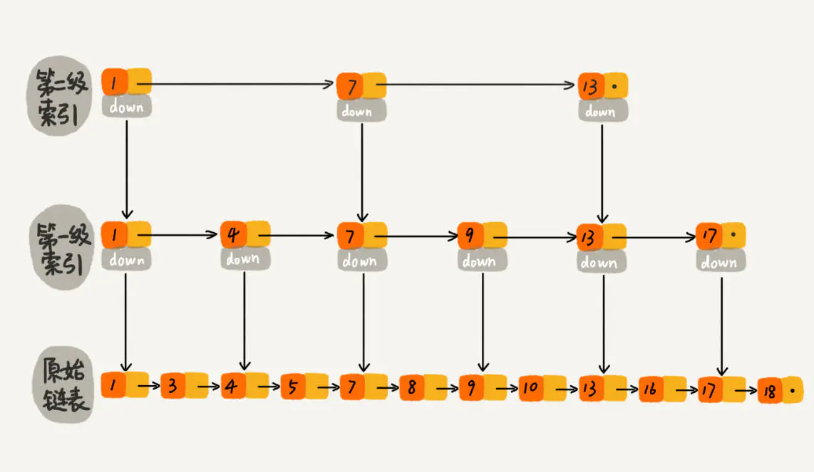

面试高频

容器牵扯到数据结构、算法、高并发，**为后面的线程池做准备**

**物理上的存储结构就两种：连续（数组）和不连续（链表）**

逻辑结构上就很多了

## ConcurrentHashMap的发展

从Hashtable  ->  HashMap  -> Collections.synchronizedMap(new HashMap())  -> ConcurrentHashMap

Hashtable在每个方法上加上了synchronized。锁的粒度时方法级的

HashMap 每个方法都不加锁

Collections的synchronizedMap

```java
public static <K,V> Map<K,V> synchronizedMap(Map<K,V> m) {
	return new SynchronizedMap<>(m);
}
```

synchronizedMap是个静态内部类

```java
final Object      mutex;        // Object on which to synchronize
public int size() {
	synchronized (mutex) {return m.size();}
}
public V get(Object key) {
	synchronized (mutex) {return m.get(key);}
}
public V put(K key, V value) {
	synchronized (mutex) {return m.put(key, value);}
}
```

锁的粒度相对于Hashtable来说小了些。

### 测试性能

**性能好坏不要想当然，要写程序来测试**

测试代码

```java
import java.util.Hashtable;
import java.util.Map;
import java.util.UUID;

public class TestMap {

    static Map<UUID, UUID> map = new Hashtable<>();

    static int count = 100_0000;
    static UUID[] keys = new UUID[count];
    static UUID[] values = new UUID[count];
    static int threadCount = 100;

    static {
        for (int i = 0; i < count; i++) {
            keys[i] = UUID.randomUUID();
            values[i] = UUID.randomUUID();
        }
    }


    static class MyThread extends Thread {

        int start;
        int gap = count / threadCount;

        public MyThread(int start) {
            this.start = start;
        }

        @Override
        public void run() {
            for (int i = 0; i < start + gap; i++) {
                map.put(keys[i], values[i]);
            }
        }
    }

    public static void main(String[] args) {
        long start = System.currentTimeMillis();

        Thread[] threads = new Thread[threadCount];

        for (int i = 0; i < threads.length; i++) {
            threads[i] = new MyThread(i * (count / threadCount));
        }

        for (Thread thread : threads) {
            thread.start();
        }

        // 等待所有线程结束
        for(Thread t : threads) {
            try {
                t.join();
            } catch (InterruptedException e) {
                e.printStackTrace();
            }
        }

        long end = System.currentTimeMillis();

        System.out.println(end - start);

        System.out.println(map.size());
    }
}
```

测试结果

| 测试类型  | 写耗时 | 读耗时 |
| --------- | ---- | ---- |
| Hashtable | 约 6306 ms |   约 31575 ms   |
| Collections.synchronizedMap(new Hashtable<>()) | 约 4862 ms | 约 42408 ms |
| ConcurrentHashMap | 约 2317 ms | 约750 ms |

这个跟马老师课程上测试的内容不一样。

Hashtable 和 Collections.synchronizedMap 这两个差不多

实际情况用ConcurrentHashMap 就行了

ConcurrentHashMap 强就强再读上面，时采用CAS无锁实现的

ConcurrentHashMap 写的时候加入了分段锁

## Vetor和Queue的发展

看个卖票的例子

```shell
有N张火车票，每张票都有一个编号
同时有10个窗口对外售票
请写一个模拟程序

分析下面的程序可能会产生哪些问题？
重复销售？超量销售？
```

### 1. 使用ArrayList

```java
import java.util.ArrayList;
import java.util.List;

public class TicketSeller1 {
	static List<String> tickets = new ArrayList<>();
	
	static {
		for(int i=0; i<1000; i++) tickets.add("票编号：" + i);
	}
	
	public static void main(String[] args) {
		for(int i=0; i<10; i++) {
			new Thread(()->{
				synchronized (tickets) {
					while(tickets.size() > 0) {
						System.out.println("销售了--" + tickets.remove(0));
					}
				}
			}).start();
		}
	}
}
```

ArrayList 是线程不安全的，需要加锁。

### 2. 使用Vector

```java
import java.util.Vector;
import java.util.concurrent.TimeUnit;

public class TicketSeller2 {
    static Vector<String> tickets = new Vector<>();


    static {
        for (int i = 0; i < 1000; i++) tickets.add("票 编号：" + i);
    }

    public static void main(String[] args) {

        for (int i = 0; i < 10; i++) {
            new Thread(() -> {
                while (tickets.size() > 0) {
                    try {
                        TimeUnit.MILLISECONDS.sleep(10);
                    } catch (InterruptedException e) {
                        e.printStackTrace();
                    }
                    System.out.println("销售了--" + tickets.remove(0));
                }
            }).start();
        }
    }
}
```

注意：虽然Vector是线程安全的。其size方法和remove也都加锁了。但是这两个操作，并不是原子的，会有被打断的可能。因此上面的也需要开锁

```java
synchronized (tickets) {
    while (tickets.size() > 0) {
        try {
        	TimeUnit.MILLISECONDS.sleep(10);
        } catch (InterruptedException e) {
       		e.printStackTrace();
        }
        System.out.println("销售了--" + tickets.remove(0));
    }
}
```

加上sychronized锁

### 3. 使用LinkedList

```java
import java.util.LinkedList;
import java.util.List;
import java.util.concurrent.TimeUnit;

public class TicketSeller3 {
    static List<String> tickets = new LinkedList<>();

    static {
        for (int i = 0; i < 1000; i++) tickets.add("票 编号：" + i);
    }

    public static void main(String[] args) {

        for (int i = 0; i < 10; i++) {
            new Thread(() -> {
                while (true) {
                    synchronized (tickets) {
                        if (tickets.size() <= 0) break;

                        try {
                            TimeUnit.MILLISECONDS.sleep(10);
                        } catch (InterruptedException e) {
                            e.printStackTrace();
                        }

                        System.out.println("销售了--" + tickets.remove(0));
                    }
                }
            }).start();
        }
    }
}
```

LinkedList 又不是线程安全的，也需要加锁

### 4. ConcurrentLinkedQueue

```java
import java.util.Queue;
import java.util.concurrent.ConcurrentLinkedQueue;

public class TicketSeller4 {
    static Queue<String> tickets = new ConcurrentLinkedQueue<>();

    static {
        for (int i = 0; i < 1000; i++) tickets.add("票 编号：" + i);
    }

    public static void main(String[] args) {

        for (int i = 0; i < 10; i++) {
            new Thread(() -> {
                while (true) {
                    String s = tickets.poll();
                    if (s == null) break;
                    else System.out.println("销售了--" + s);
                }
            }).start();
        }
    }
}
```

poll() 是无锁化实现线程安全的。这个效率会高些。

**总结：在高并发场景相爱，能用队列不用List或Set**

## 多线程场景下使用的容器

### ConcurrentHashMap 和 ConcurrentSkipListMap

传统（不加锁）的Map，一般有两种，HashMap和TreeMap

HashMap是无序的

TreeMap是有序的，默认是从小到大

那么多线程场景下有

ConcurrentHashMap  -> 无序

ConcurrentSkipListMap  -> 有序（跳表结构）



[Skip List--跳表（全网最详细的跳表文章没有之一） - 简书 (jianshu.com)](https://www.jianshu.com/p/9d8296562806)

### CopyOnWriteArrayList

写时复制

在添加数据的时候，会将之前的数组copy一份，然后将添加的数据放到数组尾部

写的时候会加锁。读的时候不会加锁，因为每次读都是从新数组中读取信息

**适用于读多写少的场景**

这个是对比Vetor。Vetor是写和读都加锁。CopyOnWriteArrayList 只是写的时候加锁，读的时候不加锁。但是写的效率会低，因为有个数组复制

```java
    /**
     * Appends the specified element to the end of this list.
     *
     * @param e element to be appended to this list
     * @return {@code true} (as specified by {@link Collection#add})
     */
    public boolean add(E e) {
        final ReentrantLock lock = this.lock;
        lock.lock();
        try {
            Object[] elements = getArray();
            int len = elements.length;
            Object[] newElements = Arrays.copyOf(elements, len + 1);
            newElements[len] = e;
            setArray(newElements);
            return true;
        } finally {
            lock.unlock();
        }
    }

    // Positional Access Operations

    @SuppressWarnings("unchecked")
    private E get(Object[] a, int index) {
        return (E) a[index];
    }

    /**
     * {@inheritDoc}
     *
     * @throws IndexOutOfBoundsException {@inheritDoc}
     */
    public E get(int index) {
        return get(getArray(), index);
    }
```

### synchronizedList

`Collections.synchronizedList(strs)`

```java
// 静态内部类
final Object mutex; 

static class SynchronizedList<E> extends SynchronizedCollection<E>
        implements List<E>  {
    public E get(int index) {
    	synchronized (mutex) {return list.get(index);}
    }
    public E set(int index, E element) {
        synchronized (mutex) {return list.set(index, element);}
    }
}
```

### ConcurrentLinkedQueue

```java
import java.util.Queue;
import java.util.concurrent.ConcurrentLinkedQueue;

public class T04_ConcurrentQueue {
    public static void main(String[] args) {
        Queue<String> strs = new ConcurrentLinkedQueue<>();

        for (int i = 0; i < 10; i++) {
            strs.offer("a" + i);  //add
        }

        System.out.println(strs); // [a0, a1, a2, a3, a4, a5, a6, a7, a8, a9]

        System.out.println(strs.size()); // 10

        // 取队列头
        System.out.println(strs.poll()); // a0
        System.out.println(strs.size()); // 9

        // 偷看队列头，但是不会取出
        System.out.println(strs.peek());  // a1
        System.out.println(strs.size());  // 9
        //双端队列Deque
    }
}
```

### LinkedBlockingQueue

无界队列

```java
//队列容量大小，默认为Integer.MAX_VALUE
private final int capacity;

//队列中元素个数：(与ArrayBlockingQueue的不同)
//出队和入队是两把锁
private final AtomicInteger count = new AtomicInteger(0);

//队列--头结点
private transient Node<E> head;

//队列--尾结点
private transient Node<E> last;

/** Lock held by take, poll, etc */
private final ReentrantLock takeLock = new ReentrantLock();

/** Wait queue for waiting takes */
private final Condition notEmpty = takeLock.newCondition();

/** Lock held by put, offer, etc */
private final ReentrantLock putLock = new ReentrantLock();

/** Wait queue for waiting puts */
private final Condition notFull = putLock.newCondition();


// 默认是个无界，大小是int的最大值，也可以指定大小
public LinkedBlockingQueue() {
	this(Integer.MAX_VALUE);
}
public LinkedBlockingQueue(int capacity) {
    if (capacity <= 0) throw new IllegalArgumentException();
    this.capacity = capacity;
    last = head = new Node<E>(null);
}
```

> 有两把锁，写锁和读锁。有两把锁，说明写的时候，也可以去读

**取数据**

```java
import java.util.concurrent.BlockingQueue;
import java.util.concurrent.LinkedBlockingQueue;

public class T05_LinkedBlockQueue {

    public static void main(String[] args) {

        BlockingQueue<Object> blockingQueue = new LinkedBlockingQueue<>(10);

//        try {
//            blockingQueue.take();
//        } catch (InterruptedException e) {
//            e.printStackTrace();
//        }

        // blockingQueue.poll();
        
        // 可以设置超时时间
        blockingQueue.poll(5, TimeUnit.SECONDS);
    }
}
```

LinkedBlockingQueue 在原有queue的基础上增加了一个take() 方法，这个方法是阻塞的方法，当队列为空的之后，会阻塞住

poll() 方法不会阻塞，队列为空的时候，返回null。可以设置超时时间


相关源码

```Java
private final Condition notEmpty = lock.newCondition();

public E take() throws InterruptedException {
    return takeFirst();
}

public E takeFirst() throws InterruptedException {
    final ReentrantLock lock = this.lock;
    lock.lock();
    try {
        E x;
        // 当队列为空的时候，会阻塞住
        while ( (x = unlinkFirst()) == null)
            notEmpty.await();
        return x;
    } finally {
        lock.unlock();
    }
}
```

**存数据**

queue接口只提供了两个存数据的接口

- add()
- offer()

add方法不能添加null元素，否则会抛出异常。当队列满的时候，也会抛出异常

offer() 方法也不能添加null元素，否则也会抛出异常。当队列满的时候，会返回false

相关源码

```java
    public boolean add(E e) {
        addLast(e);
        return true;
    }	   

	/**
     * @throws IllegalStateException if this deque is full
     * @throws NullPointerException  {@inheritDoc}
     */
    public void addLast(E e) {
        if (!offerLast(e))
            // 抛出 非法状态异常 
            throw new IllegalStateException("Deque full");
    }


    /**
     * @throws NullPointerException {@inheritDoc}
     */
    public boolean offerLast(E e) {
        if (e == null) throw new NullPointerException();
        Node<E> node = new Node<E>(e);
        final ReentrantLock lock = this.lock;
        lock.lock();
        try {
            return linkLast(node);
        } finally {
            lock.unlock();
        }
    }

    /**
     * @throws NullPointerException if the specified element is null
     */
    public boolean offer(E e) {
        return offerLast(e);
    }
```

LinkedBlockQueue队列提供了一个新的方法`put`，当队列满的时候，会阻塞，等待其它元素被取走

用这个队列可以模拟生产者和消费者的过程。

生产者生产数据，当队列满的时候，生产者阻塞

消费者消费数据，当队列为空的时候，消费者阻塞

```java
import java.util.Random;
import java.util.concurrent.BlockingQueue;
import java.util.concurrent.LinkedBlockingQueue;
import java.util.concurrent.TimeUnit;

public class T05_LinkedBlockingQueue {

    static BlockingQueue<String> strs = new LinkedBlockingQueue<>();

    static Random r = new Random();

    public static void main(String[] args) {
        new Thread(() -> {
            for (int i = 0; i < 100; i++) {
                try {
                    strs.put("a" + i); //如果满了，就会等待
                    TimeUnit.MILLISECONDS.sleep(r.nextInt(1000));
                } catch (InterruptedException e) {
                    e.printStackTrace();
                }
            }
        }, "p1").start();

        for (int i = 0; i < 5; i++) {
            new Thread(() -> {
                for (; ; ) {
                    try {
                        System.out.println(Thread.currentThread().getName() + " take -" + strs.take()); //如果空了，就会等待
                    } catch (InterruptedException e) {
                        e.printStackTrace();
                    }
                }
            }, "c" + i).start();
        }
    }
}
```

### ArrayBlockingQueue

有界队列

必须指定出事容量`capacity`

```java
/** Main lock guarding all access */
final ReentrantLock lock;

/** Condition for waiting takes */
private final Condition notEmpty;

/** Condition for waiting puts */
private final Condition notFull;

/**
* Creates an {@code ArrayBlockingQueue} with the given (fixed)
* capacity and default access policy.
*
* @param capacity the capacity of this queue
* @throws IllegalArgumentException if {@code capacity < 1}
*/
public ArrayBlockingQueue(int capacity) {
	this(capacity, false);
}

public ArrayBlockingQueue(int capacity, boolean fair) {
    if (capacity <= 0)
        throw new IllegalArgumentException();
    this.items = new Object[capacity];
    lock = new ReentrantLock(fair);
    notEmpty = lock.newCondition();
    notFull =  lock.newCondition();
}
```

只有一把锁

```java
    /**
     * Inserts the specified element at the tail of this queue, waiting
     * for space to become available if the queue is full.
     *
     * @throws InterruptedException {@inheritDoc}
     * @throws NullPointerException {@inheritDoc}
     */
    public void put(E e) throws InterruptedException {
        checkNotNull(e);
        final ReentrantLock lock = this.lock;
        lock.lockInterruptibly();
        try {
            while (count == items.length)
                notFull.await();
            enqueue(e);
        } finally {
            lock.unlock();
        }
    }
```

其put、offer、add、take的特性与LinkedBlockingQueue队列是一样的

### **ArrayBlockingQueue与LinkedBlockingQueue对比**

- ArrayBlockingQueue底层基于数组实现，需要使用者指定队列长度，是一个不折不扣的有界队列。

- LinkedBlockingQueue底层基于链表实现，无需使用者指定队列长度（可自定义)，当使用默认大小时候，是一个无界队列。

- ArrayBlockingQueue由于默认必须设置队列长度，所以在使用时会能更好的预测系统性能；而LinkedBlockingQueue默认无参构造，无需指定队列长度，所以在使用时一定要多加注意，当队列中元素短时间内暴增时，可能会对系统产生灾难性影响。

- 但是，LinkedBlockingQueue的一大优点也是ArrayBlockingQueue所不具备的，那么就是在多个CPU的情况下，LinkedBlockingQueue可以做到同一时刻既消费、又生产。故LinkedBlockingQueue的性能也要优于ArrayBlockingQueue。

### PriorityQueue

优先队列

默认是按照从小到大顺序排的

```java
import java.util.PriorityQueue;
import java.util.Comparator;

public class T07_01_PriorityQueque {
    public static void main(String[] args) {
        PriorityQueue<String> q = new PriorityQueue<>();
		
        // 降序。从大到小
//        PriorityQueue<String> q = new PriorityQueue<>(new Comparator<String>() {
//            @Override
//            public int compare(String o1, String o2) {
//                return o2.compareTo(o1);
//            }
//        });
        
        q.add("c");
        q.add("e");
        q.add("a");
        q.add("d");
        q.add("z");

        for (int i = 0; i < 5; i++) {
            System.out.println(q.poll());
        }
    }
}
```

运行结果

```shell
a
c
d
e
z
```

源码

```java
/**
 * Creates a {@code PriorityQueue} with the specified initial
 * capacity that orders its elements according to their
 * {@linkplain Comparable natural ordering}.
 *
 * @param initialCapacity the initial capacity for this priority queue
 * @throws IllegalArgumentException if {@code initialCapacity} is less
 *         than 1
 */
public PriorityQueue(int initialCapacity) {
    this(initialCapacity, null);
}

public PriorityQueue(int initialCapacity,
                     Comparator<? super E> comparator) {
    // Note: This restriction of at least one is not actually needed,
    // but continues for 1.5 compatibility
    if (initialCapacity < 1)
        throw new IllegalArgumentException();
    this.queue = new Object[initialCapacity];
    this.comparator = comparator;
}
```

### DelayQueue

延迟队列（**阻塞队列**）

```java
import java.util.concurrent.BlockingQueue;
import java.util.concurrent.DelayQueue;
import java.util.concurrent.Delayed;
import java.util.concurrent.TimeUnit;

public class T07_DelayQueue {

    static BlockingQueue<MyTask> tasks = new DelayQueue<>();

    static class MyTask implements Delayed {
        String name;
        long runningTime;

        MyTask(String name, long rt) {
            this.name = name;
            this.runningTime = rt;
        }

        @Override
        public int compareTo(Delayed o) {
            if (this.getDelay(TimeUnit.MILLISECONDS) < o.getDelay(TimeUnit.MILLISECONDS))
                return -1;
            else if (this.getDelay(TimeUnit.MILLISECONDS) > o.getDelay(TimeUnit.MILLISECONDS))
                return 1;
            else
                return 0;
        }

        @Override
        public long getDelay(TimeUnit unit) {

            return unit.convert(runningTime - System.currentTimeMillis(), TimeUnit.MILLISECONDS);
        }


        @Override
        public String toString() {
            return name + " " + runningTime;
        }
    }

    public static void main(String[] args) throws InterruptedException {
        long now = System.currentTimeMillis();
        MyTask t1 = new MyTask("t1", now + 1000);
        MyTask t2 = new MyTask("t2", now + 2000);
        MyTask t3 = new MyTask("t3", now + 1500);
        MyTask t4 = new MyTask("t4", now + 2500);
        MyTask t5 = new MyTask("t5", now + 500);

        tasks.put(t1);
        tasks.put(t2);
        tasks.put(t3);
        tasks.put(t4);
        tasks.put(t5);

        System.out.println(tasks);

        for (int i = 0; i < 5; i++) {
            System.out.println(tasks.take());
        }
    }
}
```

**其本质上就是一个PriorityQueue**

相关源码

```java
public class DelayQueue<E extends Delayed> extends AbstractQueue<E>
    implements BlockingQueue<E> {

    private final transient ReentrantLock lock = new ReentrantLock();
    // 有个优先队列的成员变量
    private final PriorityQueue<E> q = new PriorityQueue<E>();

    /**
     * Inserts the specified element into this delay queue.
     *
     * @param e the element to add
     * @return {@code true}
     * @throws NullPointerException if the specified element is null
     */
    public boolean offer(E e) {
        final ReentrantLock lock = this.lock;
        lock.lock();
        try {
            q.offer(e);
            if (q.peek() == e) {
                leader = null;
                available.signal();
            }
            return true;
        } finally {
            lock.unlock();
        }
    }
    
    
        /**
     * Retrieves and removes the head of this queue, waiting if necessary
     * until an element with an expired delay is available on this queue.
     *
     * @return the head of this queue
     * @throws InterruptedException {@inheritDoc}
     */
    public E take() throws InterruptedException {
        final ReentrantLock lock = this.lock;
        lock.lockInterruptibly();
        try {
            for (;;) {
                E first = q.peek();
                if (first == null)
                    available.await();
                else {
                    long delay = first.getDelay(NANOSECONDS);
                    if (delay <= 0)
                        return q.poll();
                    first = null; // don't retain ref while waiting
                    if (leader != null)
                        available.await();
                    else {
                        Thread thisThread = Thread.currentThread();
                        leader = thisThread;
                        try {
                            available.awaitNanos(delay);
                        } finally {
                            if (leader == thisThread)
                                leader = null;
                        }
                    }
                }
            }
        } finally {
            if (leader == null && q.peek() != null)
                available.signal();
            lock.unlock();
        }
    }
}
```

### SynchronousQueue

同步队列，容量为0。

```java
import java.util.concurrent.BlockingQueue;
import java.util.concurrent.SynchronousQueue;

public class T08_SynchronusQueue { //容量为0
   public static void main(String[] args) throws InterruptedException {
      BlockingQueue<String> strs = new SynchronousQueue<>();
      
      new Thread(()->{
         try {
            System.out.println(strs.take());
         } catch (InterruptedException e) {
            e.printStackTrace();
         }
      }).start();

      strs.put("aaa"); //阻塞等待消费者消费
      //strs.put("bbb");
      //strs.add("aaa");
      System.out.println(strs.size());
   }
}
```

运行结果

```shell
0
aaa
```

不能调用add() 方法，否则会报queue full的错误，调用offer() 方法也没用，不会往队列中添加数据，只能调用put() 方法，阻塞。相当于把东西递到另外一个人手中，中间的 队列是不存在的，所以队列的容量为0，相当与交换，对比Exchange

### TransferQueue

相对于别的queue，增加一个transfer方法。

相比于put方法，put方法是队列满了之后才会阻塞，**这个transfer只要加一条数据就会阻塞，直到有人取走，才会返回**。

```java
import java.util.concurrent.LinkedTransferQueue;

public class T09_TransferQueue {
    public static void main(String[] args) throws InterruptedException {
        LinkedTransferQueue<String> strs = new LinkedTransferQueue<>();

        new Thread(() -> {
            try {
                System.out.println(strs.take());
            } catch (InterruptedException e) {
                e.printStackTrace();
            }
        }).start();

        strs.transfer("aaa");

//
//        strs.put("aaa");

    }
}
```

## 面试题

要求用线程顺序打印A1B2C3....Z26

### 使用LockSupport

```java
import java.util.concurrent.locks.LockSupport;

public class T02_LockSupport {

    static Thread t1, t2;

    public static void main(String[] args) {
        char[] aI = "1234567".toCharArray();
        char[] aC = "ABCDEFG".toCharArray();

        t1 = new Thread(() -> {
            for (char c : aI) {
                LockSupport.park(); // t1阻塞
                System.out.print(c);
                LockSupport.unpark(t2); // 叫醒t2
            }
        }, "t1");

        t2 = new Thread(() -> {
            for (char c : aC) {
                System.out.print(c);
                LockSupport.unpark(t1); // 叫醒t1
                LockSupport.park(); // t2阻塞
            }
        }, "t2");

        t1.start();
        t2.start();
    }
}
```

### 使用CAS

```java
public class T03_CAS {

    enum ReadyToRun {T1, T2}

    static volatile ReadyToRun r = ReadyToRun.T1; //思考为什么必须volatile

    public static void main(String[] args) {
        char[] aI = "1234567".toCharArray();
        char[] aC = "ABCDEFG".toCharArray();


        new Thread(() -> {
            for (char c : aI) {
                while (r != ReadyToRun.T1) {
                }
                System.out.print(c);
                r = ReadyToRun.T2;
            }
        }, "t1").start();


        new Thread(() -> {
            for (char c : aC) {
                while (r != ReadyToRun.T2) {
                }
                System.out.print(c);
                r = ReadyToRun.T1;
            }
        }, "t2").start();
    }
}
```

### 使用BlockingQueue

```java
import java.util.concurrent.ArrayBlockingQueue;
import java.util.concurrent.BlockingQueue;

/**
 * @author liufei
 * @version 1.0.0
 * @description
 * @date 2022/11/6
 */
public class T04_BlockingQueue {

    static BlockingQueue<String> q1 = new ArrayBlockingQueue(1);
    static BlockingQueue<String> q2 = new ArrayBlockingQueue(1);

    public static void main(String[] args) {

        char[] aC = "ABCDEFG".toCharArray();
        char[] aI = "1234567".toCharArray();

        new Thread(() -> {
            for (char c : aC) {
                System.out.print(c);
                try {
                    q1.put("ok"); // 阻塞
                    q2.take();
                } catch (InterruptedException e) {
                    e.printStackTrace();
                }
            }
        }, "t1").start();


        new Thread(() -> {
            for (char c : aI) {
                try {
                    q1.take();
                } catch (InterruptedException e) {
                    e.printStackTrace();
                }
                System.out.print(c);
                try {
                    q2.put("ok"); // 阻塞
                } catch (InterruptedException e) {
                    e.printStackTrace();
                }
            }
        }, "t2").start();
    }
}
```

### 使用AtomicInteger

```java
import java.util.concurrent.atomic.AtomicInteger;

public class T05_AtomicInteger {

    static AtomicInteger atomicInteger = new AtomicInteger(1);

    public static void main(String[] args) {

        char[] aC = "ABCDEFG".toCharArray();
        char[] aI = "1234567".toCharArray();

        new Thread(() -> {
            for (char c : aC) {
                while (atomicInteger.get() != 1) {
                }
                System.out.print(c);
                atomicInteger.set(2);
            }
        }, "t1").start();


        new Thread(() -> {
            for (char c : aI) {
                while (atomicInteger.get() != 2) {
                }
                System.out.print(c);
                atomicInteger.set(1);
            }
        }, "t2").start();
    }
}
```

### 使用wait和notify

```java
public class T06_Sync_Wait_Notify {

    static final Object lock = new Object();

    public static void main(String[] args) {

        char[] aC = "ABCDEFG".toCharArray();
        char[] aI = "1234567".toCharArray();

        new Thread(() -> {
            synchronized (lock) {
                for (char c : aC) {
                    System.out.print(c);
                    lock.notify(); // 唤醒t2
                    try {
                        lock.wait(); // 阻塞，交出锁
                    } catch (InterruptedException e) {
                        e.printStackTrace();
                    }
                }
                lock.notify(); //必须，否则无法停止程序
            }
        }, "t1").start();


        new Thread(() -> {
            synchronized (lock) {
                for (char c : aI) {
                    System.out.print(c);
                    lock.notify(); // 唤醒t1
                    try {
                        lock.wait(); // 阻塞
                    } catch (InterruptedException e) {
                        e.printStackTrace();
                    }
                }
                lock.notify(); //必须，否则无法停止程序
            }
        }, "t2").start();
    }
}
```

### 使用Lock和Condition

使用一个Condition

```java
import java.util.concurrent.locks.Condition;
import java.util.concurrent.locks.Lock;
import java.util.concurrent.locks.ReentrantLock;

public class T08_00_lock_condition {

    public static void main(String[] args) {

        char[] aI = "1234567".toCharArray();
        char[] aC = "ABCDEFG".toCharArray();

        Lock lock = new ReentrantLock();
        Condition condition = lock.newCondition();

        new Thread(() -> {
            try {
                lock.lock();

                for (char c : aI) {
                    System.out.print(c);
                    condition.signal();
                    condition.await();
                }

                condition.signal();

            } catch (Exception e) {
                e.printStackTrace();
            } finally {
                lock.unlock();
            }

        }, "t1").start();

        new Thread(() -> {
            try {
                lock.lock();

                for (char c : aC) {
                    System.out.print(c);
                    condition.signal();
                    condition.await();
                }

                condition.signal();

            } catch (Exception e) {
                e.printStackTrace();
            } finally {
                lock.unlock();
            }

        }, "t2").start();
    }
}
```

使用两个Condition

```java
import java.util.concurrent.locks.Condition;
import java.util.concurrent.locks.Lock;
import java.util.concurrent.locks.ReentrantLock;

public class T09_00_lock_condition {

    public static void main(String[] args) {

        char[] aI = "1234567".toCharArray();
        char[] aC = "ABCDEFG".toCharArray();

        Lock lock = new ReentrantLock();
        Condition conditionT1 = lock.newCondition();
        Condition conditionT2 = lock.newCondition();

        new Thread(() -> {
            try {
                lock.lock();

                for (char c : aI) {
                    System.out.print(c);
                    conditionT2.signal();
                    conditionT1.await();
                }

                conditionT2.signal();

            } catch (Exception e) {
                e.printStackTrace();
            } finally {
                lock.unlock();
            }

        }, "t1").start();

        new Thread(() -> {
            try {
                lock.lock();

                for (char c : aC) {
                    System.out.print(c);
                    conditionT1.signal();
                    conditionT2.await();
                }

                conditionT1.signal();

            } catch (Exception e) {
                e.printStackTrace();
            } finally {
                lock.unlock();
            }

        }, "t2").start();
    }
}
```

### 使用TransferQueue

```java
import java.util.concurrent.LinkedTransferQueue;
import java.util.concurrent.TransferQueue;

public class T13_TransferQueue {
    public static void main(String[] args) {
        char[] aI = "1234567".toCharArray();
        char[] aC = "ABCDEFG".toCharArray();

        TransferQueue<Character> queue = new LinkedTransferQueue<Character>();
        new Thread(()->{
            try {
                for (char c : aI) {
                    System.out.print(queue.take());
                    queue.transfer(c);
                }

            } catch (InterruptedException e) {
                e.printStackTrace();
            }
        }, "t1").start();

        new Thread(()->{
            try {
                for (char c : aC) {
                    queue.transfer(c);
                    System.out.print(queue.take());
                }

            } catch (InterruptedException e) {
                e.printStackTrace();
            }
        }, "t2").start();
    }
}
```