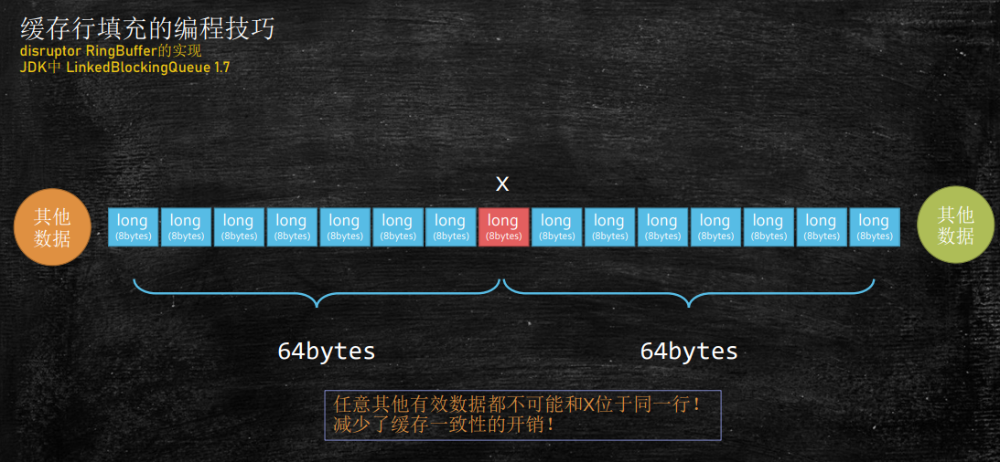
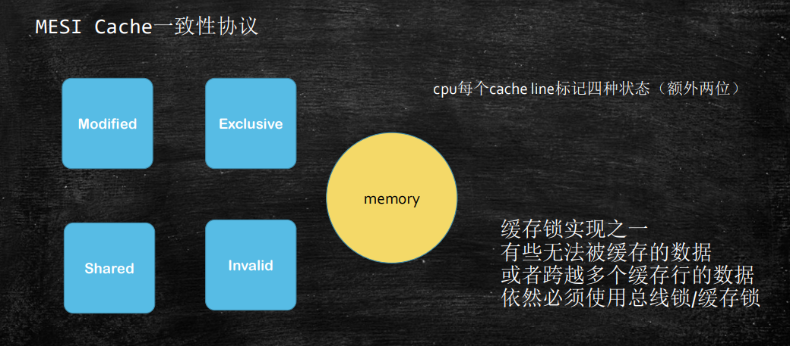
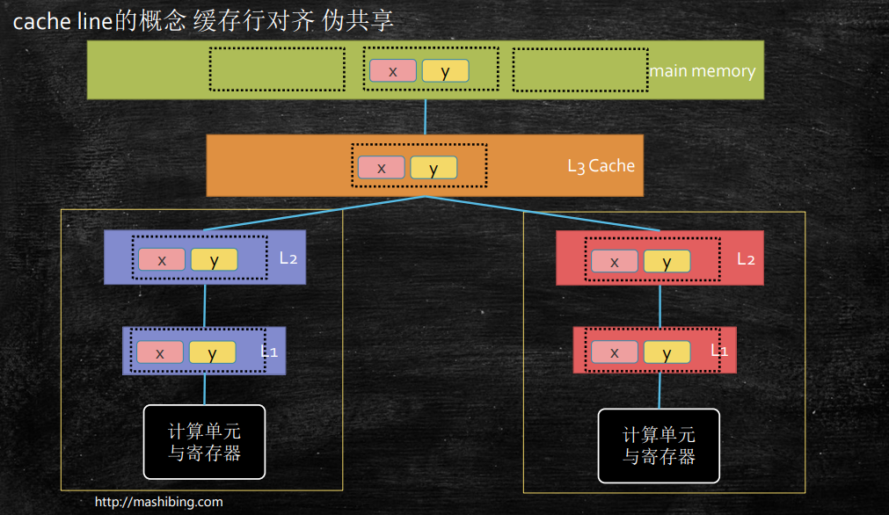
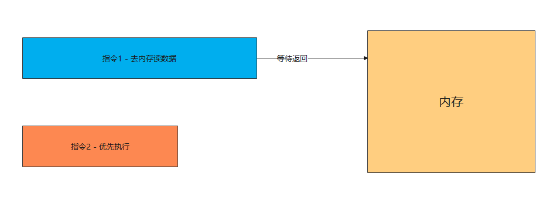
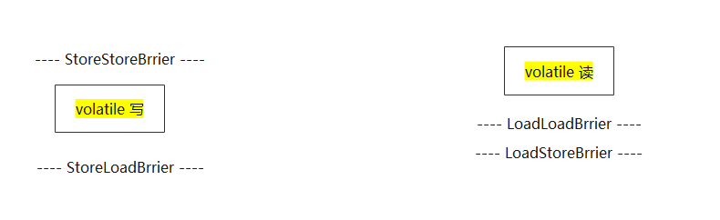
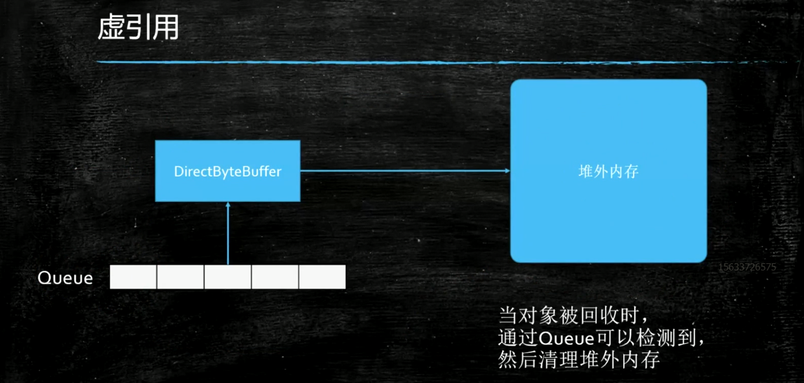

# 并发编程三大特性

- 可见性（visibility）
- 有序性（ordering）
- 原子性（atomicity）

## 可见行
线程的底层知识（可见性 有序性 原子性）
 - 线程的执行
线程的调度（Context Switch）
 - 一个核同一时刻，只能运行一个线程

### 线程间的可见性

**MESI**

多线程提高效率，本地缓存数据，造成数据修改不可见，

要想保证可见，要么触发同步指令，要么加上volatile，被修饰的内存，只要有修改，马上同步涉及到的每个线程

```java
/**
 * volatile 关键字，使一个变量在多个线程间可见
 * A B线程都用到一个变量，java默认是A线程中保留一份copy，这样如果B线程修改了该变量，则A线程未必知道
 * 使用volatile关键字，会让所有线程都会读到变量的修改值
 * <p>
 * 在下面的代码中，running是存在于堆内存的t对象中
 * 当线程t1开始运行的时候，会把running值从内存中读到t1线程的工作区，在运行过程中直接使用这个copy，并不会每次都去
 * 读取堆内存，这样，当主线程修改running的值之后，t1线程感知不到，所以不会停止运行
 * <p>
 * 使用volatile，将会强制所有线程都去堆内存中读取running的值
 * <p>
 * volatile并不能保证多个线程共同修改running变量时所带来的不一致问题，也就是说volatile不能替代synchronized
 */
public class HelloVolatile {

    private static volatile boolean running = true;

    private static void m() {
        System.out.println("m start");
        while (running) {
            // 如果不加 volatile，里面加上println()语句，过一段时间，也会停止。因为println()方法里面用到了 synchronized，会导致缓存值刷新
            //System.out.println("hello"); 
        }
        System.out.println("m end!");
    }

    public static void main(String[] args) {

        new Thread(HelloVolatile::m, "t1").start();

        try {
            TimeUnit.SECONDS.sleep(1);
        } catch (InterruptedException e) {
            e.printStackTrace();
        }
        running = false;
    }
}
```

### 缓存行对齐

- 缓存行对齐 缓存行64个字节是CPU同步的基本单位，缓存行隔离会比伪共享效率要高 Disruptor
- 认识缓存行对齐的编程技巧

```java
import java.util.concurrent.CountDownLatch;

/**
 * @author liufei
 * @version 1.0.0
 * @description
 * @date 2022/10/18
 */
public class CacheLinePadding {
    public static long COUNT = 10_0000_0000L;

    private static class T {
        private long p1, p2, p3, p4, p5, p6, p7;
        public long x = 0L;
        private long p9, p10, p11, p12, p13, p14, p15;
    }

    public static T[] arr = new T[2];

    static {
        arr[0] = new T();
        arr[1] = new T();
    }

    public static void main(String[] args) throws Exception {
        CountDownLatch latch = new CountDownLatch(2);

        Thread t1 = new Thread(() -> {
            for (long i = 0; i < COUNT; i++) {
                arr[0].x = i;
            }

            latch.countDown();
        });

        Thread t2 = new Thread(() -> {
            for (long i = 0; i < COUNT; i++) {
                arr[1].x = i;
            }

            latch.countDown();
        });

        final long start = System.nanoTime();
        t1.start();
        t2.start();
        latch.await();
        System.out.println((System.nanoTime() - start) / 100_0000);
    }
}
```

**需要注意，JDK8引入了@sun.misc.Contended注解，来保证缓存行隔离效果** 要使用此注解，必须去掉限制参数：-XX:-RestrictContended

```java
import sun.misc.Contended;
import java.util.concurrent.CountDownLatch;

//注意：运行这个小程序的时候，需要加参数：-XX:-RestrictContended
public class CacheLinePadding {
    public static long COUNT = 10_0000_0000L;

    private static class T {
        //private long p1, p2, p3, p4, p5, p6, p7;
        @Contended  //只有1.8起作用 , 保证x位于单独一行中
        public long x = 0L;
        //private long p9, p10, p11, p12, p13, p14, p15;
    }

    public static T[] arr = new T[2];

    static {
        arr[0] = new T();
        arr[1] = new T();
    }

    public static void main(String[] args) throws Exception {
        CountDownLatch latch = new CountDownLatch(2);

        Thread t1 = new Thread(() -> {
            for (long i = 0; i < COUNT; i++) {
                arr[0].x = i;
            }

            latch.countDown();
        });

        Thread t2 = new Thread(() -> {
            for (long i = 0; i < COUNT; i++) {
                arr[1].x = i;
            }

            latch.countDown();
        });

        final long start = System.nanoTime();
        t1.start();
        t2.start();
        latch.await();
        System.out.println((System.nanoTime() - start) / 100_0000);
    }
}
```


**缓存一致性协议和volatile无关**

> 缓存行：
>
> 缓存行越大，局部性空间效率越高，但读取时间慢
>
> 缓存行越小，局部性空间效率越低，但读取时间快
>
> 取一个折中值，目前多用：
>
> 64字节



### 伪共享



## 有序性

### CPU的乱序执行

Disorder这个程序，证明乱序执行的确存在

为什么会乱序？

主要是为了提高效率



> 寄存器的速度是内存速度的100倍，为了速度，不需要等到指令1执行完成之后才会执行指令2。如果指令2先执行，这样指令就发生了重排。

### 线程的as-if-serial

单个线程，两条语句，未必是按顺序执行

单线程的重排序，必须保证最终一致性

as-if-serial：看上去像是序列化（单线程）

### 会产生的后果

多线程会产生不希望看到的结果

### 哪些指令可以互换顺序

hanppens-before原则（JVM规定重排序必须遵守的规则）

JLS17.4.5 （不需要记住）

- 程序次序规则：同一个线程内，按照代码出现的顺序，前面的代码先行于后面的代码，准确的说是控制流顺序，因为要考虑到分支和循环结构。

- 管程锁定规则：一个unlock操作先行发生于后面（时间上）对同一个锁的lock操作。

- **volatile变量规则：对一个volatile变量的写操作先行发生于后面（时间上）对这个变量的读操作。**

- 线程启动规则：Thread的start( )方法先行发生于这个线程的每一个操作。

- 线程终止规则：线程的所有操作都先行于此线程的终止检测。可以通过Thread.join( )方法结束、Thread.isAlive( )的返回值等手段检测线程的终止。

- 线程中断规则：对线程interrupt( )方法的调用先行发生于被中断线程的代码检测到中断事件的发生，可以通过Thread.interrupt( )方法检测线程是否中断

- 对象终结规则：一个对象的初始化完成先行于发生它的finalize()方法的开始。

- 传递性：如果操作A先行于操作B，操作B先行于操作C，那么操作A先行于操作C

### 使用内存屏障阻止乱序执行

内存屏障是特殊指令：看到这种指令，前面的必须执行完，后面的才能执行

intel : lfence sfence mfence(CPU特有指令)

### JVM中的内存屏障

所有实现JVM规范的虚拟机，必须实现四个屏障

LoadLoadBarrier 

> 对于这样的语句Load1; LoadLoad; Load2， 在Load2及后续读取操作要读取的数据被访问前，保证Load1要读取的数据被读取完毕。

LoadStore 

> 对于这样的语句Load1; LoadStore; Store2， 在Store2及后续写入操作被刷出前，保证Load1要读取的数据被读取完毕。

StoreLoad 

> 对于这样的语句Store1; StoreLoad; Load2， 在Load2及后续所有读取操作执行前，保证Store1的写入对所有处理器可见。

StoreStore

> 对于这样的语句Store1; StoreStore; Store2， 在Store2及后续写入操作执行前，保证Store1的写入操作对其它处理器可见。

### volatile的底层实现

volatile修饰的内存，不可以重排序，对volatile修饰变量的读写访问，都不可以换顺序

1: volatile i

2: ACC_VOLATILE

3: JVM的内存屏障

 屏障两边的指令不可以重排！保障有序！

 

 happends-before

 as-if-serial

4：hotspot实现

bytecodeinterpreter.cpp

```c++
int field_offset = cache->f2_as_index();
          if (cache->is_volatile()) {
            if (support_IRIW_for_not_multiple_copy_atomic_cpu) {
              OrderAccess::fence();
            }
```

orderaccess_linux_x86.inline.hpp

```c++
inline void OrderAccess::fence() {
  if (os::is_MP()) {
    // always use locked addl since mfence is sometimes expensive
#ifdef AMD64
    __asm__ volatile ("lock; addl $0,0(%%rsp)" : : : "cc", "memory");
#else
    __asm__ volatile ("lock; addl $0,0(%%esp)" : : : "cc", "memory");
#endif
  }
}
```

> **LOCK 用于在多处理器中执行指令时对共享内存的独占使用。
> 它的作用是能够将当前处理器对应缓存的内容刷新到内存，并使其他处理器对应的缓存失效。**
> **另外还提供了有序的指令无法越过这个内存屏障的作用。**

### 面试题

DCL单例要不要加volatile？

> 需要。因为new 对象的过程分为好几个指令，这些执行有可能发生重排，如果重排，对象的引入先返回，那么对象里面的变量可能还没有赋值，这样别的程序获取这个对象，访问里面的属性拿到的可能就是默认值，而不是实际值。这样就会导致程序数据异常问题。

## 原子性

### 线程的原子性

从一个简单的小程序谈起：

```java
package com.liufei.atomic;
import java.util.concurrent.CountDownLatch;

public class NumberPlus {

    private static long n = 0L;

    public static void main(String[] args) throws InterruptedException {
        Thread[] threads = new Thread[100];
        CountDownLatch count = new CountDownLatch(threads.length);

        for (int i = 0; i < threads.length; i++) {
            threads[i] = new Thread(() -> {
                for (int j = 0; j < 10000; j++) {
                    //synchronized (NumberPlus.class) {
                        n++;
                    //}
                }
                count.countDown();
            });
        }

        for (Thread thread : threads) {
            thread.start();
        }
        count.await();

        System.out.println(n);
    }
}
```

**一些基本概念**

race condition => 竞争条件 ， 指的是多个线程访问共享数据的时候产生竞争

数据的不一致（unconsistency)，并发访问之下产生的不期望出现的结果

如何保障数据一致呢？--> 线程同步（线程执行的顺序安排好），

monitor （管程） ---> 锁

critical section -> 临界区（就是synchronized代码块里面的内容）

如果临界区执行时间长，语句多，叫做 锁的粒度比较粗，反之，就是锁的粒度比较细

**具体： 保障操作的原子性（Atomicity)**

1. 悲观的认为这个操作会被别的线程打断（悲观锁）synchronized（上一个小程序）
2. 乐观的认为这个做不会被别的线程打断（乐观锁 自旋锁 无锁）cas操作 CAS = Compare And Set/Swap/Exchange

```java
package com.liufei.atomic;

import java.util.concurrent.CountDownLatch;
import java.util.concurrent.atomic.AtomicInteger;

public class T01_AtomicInteger {

    // static volatile int n = 0;    // volatile 并不能保证原子性

    static AtomicInteger atomicInteger = new AtomicInteger(0);

    public static void main(String[] args) throws InterruptedException {
        Thread[] threads = new Thread[100];
        CountDownLatch count = new CountDownLatch(threads.length);

        for (int i = 0; i < threads.length; i++) {
            threads[i] = new Thread(() -> {
                for (int j = 0; j < 10000; j++) {
                    //synchronized (NumberPlus.class) {
                    //n++;
                    atomicInteger.incrementAndGet();
                    //}
                }
                count.countDown();
            });
        }

        for (Thread thread : threads) {
            thread.start();
        }
        count.await();

        System.out.println(atomicInteger.get());
    }

}
```

我们平时所说的"上锁"，一般指的是悲观锁

### 上锁的本质

上锁的本质是把并发编程序列化

```java
package com.liufei.atomic;

public class T00_01_WhatIsLock {

    private static Object o = new Object();

    public static void main(String[] args) {
        Runnable r = () -> {
            //synchronized (o) { //打开注释试试看，对比结果
            System.out.println(Thread.currentThread().getName() + " start!");
            try {
                Thread.sleep(1000);
            } catch (InterruptedException e) {
                e.printStackTrace();
            }
            System.out.println(Thread.currentThread().getName() + " end!");
            // }
        };

        for (int i = 0; i < 3; i++) {
            new Thread(r).start();
        }
    }
}

```

同时保障可见性

注意序列化并非其他程序一直没机会执行，而是有可能会被调度，但是抢不到锁，又回到Blocked或者Waiting状态（sync锁升级）

一定是锁定同一把锁（抢一个坑位）

```java
package com.liufei.atomic;

import java.util.concurrent.TimeUnit;

public class T00_02_SingleLockVSMultiLock {
    private static Object o1 = new Object();
    private static Object o2 = new Object();
    private static Object o3 = new Object();

    public static void main(String[] args) {
        Runnable r1 = () -> {
            synchronized (o1) {
                System.out.println(Thread.currentThread().getName() + " start!");
                sleepSeconds(2);
                System.out.println(Thread.currentThread().getName() + " end!");
            }
        };

        Runnable r2 = () -> {
            synchronized (o2) {
                System.out.println(Thread.currentThread().getName() + " start!");
                sleepSeconds(2);
                System.out.println(Thread.currentThread().getName() + " end!");
            }
        };

        Runnable r3 = () -> {
            synchronized (o3) {
                System.out.println(Thread.currentThread().getName() + " start!");
                sleepSeconds(2);
                System.out.println(Thread.currentThread().getName() + " end!");
            }
        };

        new Thread(r1).start();
        new Thread(r2).start();
        new Thread(r3).start();
    }

    private static void sleepSeconds(long sec) {
        try {
            TimeUnit.SECONDS.sleep(sec);
        } catch (InterruptedException e) {
            e.printStackTrace();
        }
    }
}
```

> 像上面这种，每个线程一把锁，不能保证操作同一个数据的原子性

### 什么样的语句（指令）具备原子性？

CPU级别汇编，需要查询汇编手册！

Java中的8大原子操作：（了解即可，无需背过）

1. lock：主内存，标识变量为线程独占
2. unlock：主内存，解锁线程独占变量
3. read：主内存，读取内存到线程缓存（工作内存）
4. load：工作内存，read后的值放入线程本地变量副本
5. use：工作内存，传值给执行引擎
6. assign：工作内存，执行引擎结果赋值给线程本地变量
7. store：工作内存，存值到主内存给write备用
8. write：主内存，写变量值

### JVM中的两种锁

重量级锁（经过操作系统的调度）synchronized早期都是这种锁（目前的实现中升级到最后也是这种锁）

轻量级锁（CAS的实现，不经过OS调度）(无锁 - 自旋锁 - 乐观锁)

### CAS的深度剖析

Compare And Set/Swap（比较并设置

> cas(V, Expected, NewValue)
>
> if V == E
>
> ​	V = New
>
> else 
>
> ​	try again or fail
>
> 注意：在if比较和设置新值这两个指令并不是原子性的，有可能被打断。所以hostspot在实现的时候加了lock锁，保证这两个指令是原子性的

CAS的ABA问题解决方案 - Version

> Java中自带的有解决版本号的累，如：AtomicStampedReference

CAS操作本身的原子性保障

>  下面看的都是jdk8的源码

AtomicInteger:

```java
//  AtomicInteger类里面
public final int incrementAndGet() {
        return unsafe.getAndAddInt(this, valueOffset, 1) + 1;
 }
```

Unsafe：

```java
public final int getAndAddInt(Object var1, long var2, int var4) {
        int var5;
        do {
            var5 = this.getIntVolatile(var1, var2);
        } while(!this.compareAndSwapInt(var1, var2, var5, var5 + var4));

        return var5;
    }

public final native boolean compareAndSwapInt(Object var1, long var2, int var4, int var5);
```

运用

```java
package com.liufei.atomic;
import sun.misc.Unsafe;
import java.lang.reflect.Field;

public class T02_TestUnsafe {

    int i = 0;
    private static T02_TestUnsafe t = new T02_TestUnsafe();

    public static void main(String[] args) throws Exception {
        // 这里不能getUnsafe直接得到，会报 SecurityException 错
        //Unsafe unsafe = Unsafe.getUnsafe();

        Field unsafeField = Unsafe.class.getDeclaredFields()[0];
        unsafeField.setAccessible(true);
        Unsafe unsafe = (Unsafe) unsafeField.get(null);

        Field f = T02_TestUnsafe.class.getDeclaredField("i");
        long offset = unsafe.objectFieldOffset(f);
        System.out.println(offset);

        boolean success = unsafe.compareAndSwapInt(t, offset, 0, 1);
        System.out.println(success);
        System.out.println(t.i);
        //unsafe.compareAndSwapInt()
    }
}
```

jdk8u: unsafe.cpp:

cmpxchg = compare and exchange set swap

```c++
UNSAFE_ENTRY(jboolean, Unsafe_CompareAndSwapInt(JNIEnv *env, jobject unsafe, jobject obj, jlong offset, jint e, jint x))
  UnsafeWrapper("Unsafe_CompareAndSwapInt");
  oop p = JNIHandles::resolve(obj);
  jint* addr = (jint *) index_oop_from_field_offset_long(p, offset);
  return (jint)(Atomic::cmpxchg(x, addr, e)) == e;
UNSAFE_END
```

jdk8u: atomic_linux_x86.inline.hpp **93行**

is_MP = Multi Processors （多核）

```c++
inline jint     Atomic::cmpxchg    (jint     exchange_value, volatile jint*     dest, jint     compare_value) {
  int mp = os::is_MP();
  __asm__ volatile (LOCK_IF_MP(%4) "cmpxchgl %1,(%3)"
                    : "=a" (exchange_value)
                    : "r" (exchange_value), "a" (compare_value), "r" (dest), "r" (mp)
                    : "cc", "memory");
  return exchange_value;
}
```

jdk8u: os.hpp is_MP()

```c++
  static inline bool is_MP() {
    // During bootstrap if _processor_count is not yet initialized
    // we claim to be MP as that is safest. If any platform has a
    // stub generator that might be triggered in this phase and for
    // which being declared MP when in fact not, is a problem - then
    // the bootstrap routine for the stub generator needs to check
    // the processor count directly and leave the bootstrap routine
    // in place until called after initialization has ocurred.
    return (_processor_count != 1) || AssumeMP;
  }
```

jdk8u: atomic_linux_x86.inline.hpp

```c++
#define LOCK_IF_MP(mp) "cmp $0, " #mp "; je 1f; lock; 1: "
```

最终实现：

cmpxchg = cas修改变量值

```assembly
lock cmpxchg 指令
```

硬件：

lock指令在执行的时候视情况采用缓存锁或者总线锁

### 乐观锁和悲观锁两种锁的效率

不同的场景：

临界区执行时间比较长 ， 等的人很多 -> 重量级

时间短，等的人少 -> 自旋锁


# Sync VS Atomic VS LongAdder

我们以++计算耗时

```java
import java.util.concurrent.atomic.AtomicLong;
import java.util.concurrent.atomic.LongAdder;

public class T01_AtomicIntegerVsLogAdder {

    static long count1 = 0;

    static AtomicLong count2 = new AtomicLong(0L);

    static LongAdder count3 = new LongAdder();

    static Thread[] threads = new Thread[1000];

    private static void testSynchronized() {
        final Object object = new Object();
        for (int i = 0; i < threads.length; i++) {
            threads[i] = new Thread(() -> {
                for (int j = 0; j < 10_0000; j++) {
                    synchronized (object) {
                        count1++;
                    }
                }
            });
        }

        long start = System.currentTimeMillis();

        startThread();

        joinThread();

        long end = System.currentTimeMillis();

        System.out.println("Sync: " + count1 + " time " + (end - start));

    }


    private static void testAtomicLong() {
        for (int i = 0; i < threads.length; i++) {
            threads[i] = new Thread(() -> {
                for (int j = 0; j < 10_0000; j++) {
                    count2.incrementAndGet();
                }
            });
        }

        long start = System.currentTimeMillis();

        startThread();

        joinThread();

        long end = System.currentTimeMillis();

        System.out.println("Atomic: " + count2 + " time " + (end - start));
    }


    private static void testLongAdder() {
        for (int i = 0; i < threads.length; i++) {
            threads[i] = new Thread(() -> {
                for (int j = 0; j < 10_0000; j++) {
                    count3.increment();
                }
            });
        }

        long start = System.currentTimeMillis();

        startThread();

        joinThread();

        long end = System.currentTimeMillis();

        System.out.println("LongAdder: " + count2 + " time " + (end - start));
    }

    private static void startThread() {
        for (Thread thread : threads) {
            thread.start();
        }
    }

    private static void joinThread() {
        // 等待所有线程执行完
        for (Thread thread : threads) {
            try {
                thread.join();
            } catch (InterruptedException e) {
                e.printStackTrace();
            }
        }
    }

    public static void main(String[] args) {

        testSynchronized();

        testAtomicLong();

        testLongAdder();
    }
}
```

运行结果：

```shell
Sync: 100000000 time 1612
Atomic: 100000000 time 1442
LongAdder: 100000000 time 165
```

当线程多的时候，LongAdder的性能更好些。


## LongAdder


看下LongAdder的源码

```java
/**
* Equivalent to {@code add(1)}.
*/
public void increment() {
    add(1L);
}

/**
* Adds the given value.
*
* @param x the value to add
*/
public void add(long x) {
    //as 表示cells引用
    //b 表示获取的base值
    //v 表示 期望值
    //m 表示 cells 数组的长度
    //a 表示当前线程命中的cell单元格
    Cell[] as; long b, v; int m; Cell a;
    //条件一：true->表示cells已经初始化过了,当前线程应该将数据写入到对应的cell中
    //       false->表示cells未初始化，当前所有线程应该将数据写到base中
    //条件二：false->表示当前线程cas替换数据成功，
    //       true->表示发生竞争了，可能需要重试 或者 扩容
    if ((as = cells) != null || !casBase(b = base, b + x)) {
        //什么时候会进来？
        //1.true->表示cells已经初始化过了,当前线程应该将数据写入到对应的cell中
        //2.true->表示发生竞争了，可能需要重试 或者 扩容
        boolean uncontended = true; //true -> 未竞争  false->发生竞争
        //条件一：true->说明 cells 未初始化，也就是多线程写base发生竞争了
        //       false->说明 cells 已经初始化了，当前线程应该是 找自己的cell 写值
        //条件二：getProbe() 获取当前线程的hash值   m表示cells长度-1 cells长度 一定是2的次方数   15= b1111
        //       true-> 说明当前线程对应下标的cell为空，需要创建 longAccumulate 支持
        //       false-> 说明当前线程对应的cell 不为空，说明 下一步想要将x值 添加到cell中。
        //条件三：true->表示cas失败，意味着当前线程对应的cell 有竞争
        //       false->表示cas成功
        if (as == null || (m = as.length - 1) < 0 ||
            (a = as[getProbe() & m]) == null ||
            !(uncontended = a.cas(v = a.value, v + x)))
            //都有哪些情况会调用？
            //1.true->说明 cells 未初始化，也就是多线程写base发生竞争了[重试|初始化cells]
            //2.true-> 说明当前线程对应下标的cell为空，需要创建 longAccumulate 支持
            //3.true->表示cas失败，意味着当前线程对应的cell 有竞争[重试|扩容]
            longAccumulate(x, null, uncontended);
    }
}
```

> 底层也是CAS。但是采用分段锁
>

**官方文档是这样介绍的**
This class is usually preferable to AtomicLong when multiple threads update a common sum that is used for purposes such as collecting statistics, not for fine-grained synchronization control. Under low update contention, the two classes have similar characteristics. But under high contention, expected throughput of this class is significantly higher, at the expense of higher space consumption.

> LongAdder在多个线程更新一个用于收集统计信息的而不是追求同步的公共和的情况下，是优于AtomicLong类的。在并发度小，低竞争情况下，两个类具有相似的性能。但是在高争用情况下，LongAdder的预期吞吐量要高得多，代价是更高的空间消耗。

# 引用类型

JDK1.2 之前，Java 中引用的定义很传统：如果 reference 类型的数据存储的数值代表的是另一块内存的起始地址，就称这块内存代表一个引用。

JDK1.2 以后，Java 对引用的概念进行了扩充，将引用分为强引用、软引用、弱引用、虚引用四种（引用强度逐渐减弱）

测试下面的引用，写一个M类

```java
public class M {
    @Override
    protected void finalize() throws Throwable {
        // 重写finalize，是为了测试有没有gc，实际代码不要这样写
        System.out.println("finalize");
    }
}
```

## 强引用（StrongReference）

以前我们使用的大部分引用实际上都是强引用，这是使用最普遍的引用。如果一个对象具有强引用，那就类似于**必不可少的生活用品**，垃圾回收器绝不会回收它。当内存空间不足，Java 虚拟机宁愿抛出 OutOfMemoryError 错误，使程序异常终止，也不会靠随意回收具有强引用的对象来解决内存不足问题。

```java
import java.io.IOException;

public class T01_NormalReference {
    public static void main(String[] args) throws IOException {
        // 正常我们new 一个普通对象就是强引用
        M m = new M();
        m = null;
        System.gc(); //DisableExplicitGC

        System.in.read();
    }
}
```

运行结果：

```
finalize
```

## 软引用（SoftReference）

如果一个对象只具有软引用，那就类似于**可有可无的生活用品**。如果内存空间足够，垃圾回收器就不会回收它，如果内存空间不足了，就会回收这些对象的内存。只要垃圾回收器没有回收它，该对象就可以被程序使用。软引用可用来实现内存敏感的高速缓存。

```java
import java.lang.ref.SoftReference;

public class T02_SoftReference {
    public static void main(String[] args) {
        SoftReference<byte[]> m = new SoftReference<>(new byte[1024 * 1024 * 10]);
        //m = null;
        System.out.println(m.get());
        System.gc();
        try {
            Thread.sleep(500);
        } catch (InterruptedException e) {
            e.printStackTrace();
        }
        System.out.println(m.get());

        //再分配一个数组，heap将装不下，这时候系统会垃圾回收，先回收一次，如果不够，会把软引用干掉
        byte[] b = new byte[1024 * 1024 * 12];
        System.out.println(m.get());
    }
}
```

这里一开始分配10MB内容，后来有分配12MB内存。我们启动的时候加上 -Xms20M  -Xmx20M ，设置最大内容为20M。正常肯定会OOM的

运行结果：

```java
[B@7960847b
[B@7960847b
null
```

第一次正常打印内存地址

第二次还是正常打印内存地址，因为此时内存够用，所以不会回收

第三次，内存不够了，就会回收，回收之后，打印地址就是null了

**注意：这里第二次再分配内存写12，超过12也会OOM**

> 默认情况下Eden和old去的比是1:2，所以老年代的大小为 2  * (1 + 2) 在12左右，不到13.所以这里再分配的内存大小不能超多老年代的内存，超过会直接OOM，这种连续内存会直接进入老年代。

**软引用非常适合缓存使用**

## 弱引用（WeakReference）

如果一个对象只具有弱引用，那就类似于**可有可无的生活用品**。弱引用与软引用的区别在于：只具有弱引用的对象拥有更短暂的生命周期。在垃圾回收器线程扫描它所管辖的内存区域的过程中，**一旦发现了只具有弱引用的对象，不管当前内存空间足够与否，都会回收它的内存**。不过，由于垃圾回收器是一个优先级很低的线程， 因此不一定会很快发现那些只具有弱引用的对象。

弱引用可以和一个引用队列（ReferenceQueue）联合使用，如果弱引用所引用的对象被垃圾回收，Java 虚拟机就会把这个弱引用加入到与之关联的引用队列中。

```java
// 只要垃圾回收，就会回收它
public class T03_WeakReference {
    public static void main(String[] args) {
        WeakReference<M> m = new WeakReference<>(new M());

        System.out.println(m.get());
        System.gc();
        System.out.println(m.get());


        ThreadLocal<M> tl = new ThreadLocal<>();
        tl.set(new M());
        tl.remove();

    }
}
```

像这种东西，已有垃圾回收就回收它，那它有什么用？

<font color='red'>如果有另外一个强引用指向它时，只要强引用消失了，你就应该被回收，我就不用管了。</font>

**一般用在容器里**

ThreaLocal里面的Entry就是继承这个WeakReferen

```java
public class ThreadLocal<T> { 

    public void set(T value) {
        Thread t = Thread.currentThread();
        ThreadLocalMap map = getMap(t);
        if (map != null)
            // 以当前线程作为key
            map.set(this, value);
        else
            createMap(t, value);
    }
    
    public void remove() {
         ThreadLocalMap m = getMap(Thread.currentThread());
         if (m != null)
             m.remove(this);
     }
    
    
    static class ThreadLocalMap {
        static class Entry extends WeakReference<ThreadLocal<?>> {
            /** The value associated with this ThreadLocal. */
            Object value;

            Entry(ThreadLocal<?> k, Object v) {
                super(k);
                value = v;
            }
        }
        
        // 省略代码
        ...
        
        /**
         * Remove the entry for key.
         */
        private void remove(ThreadLocal<?> key) {
            Entry[] tab = table;
            int len = tab.length;
            int i = key.threadLocalHashCode & (len-1);
            for (Entry e = tab[i];
                 e != null;
                 e = tab[i = nextIndex(i, len)]) {
                if (e.get() == key) {
                    e.clear();
                    expungeStaleEntry(i);
                    return;
                }
            }
        }
        
        // 省略代码
        ...
    }
}
```

当强引用被取消时（方法执行完毕时），弱引用对象key被回收。此时该键值对的value不变，key变为null，这个键值对是一个垃圾数据，但ThreadLocalMap依然持有这个键值对。而ThreadLocalMap又是当前线程维护的容器，那么只要当前线程不结束，这个容器就不会被释放。看remove方法源码除了会清除当前ThreadLocal变量的键值对，还会清除陈旧的键值对（key为null），所以以后使用完TheadLocal都必须remove一下，防止内存泄漏。

## 虚引用（**PhantomReference**）

"虚引用"顾名思义，就是形同虚设，与其他几种引用都不同，虚引用并不会决定对象的生命周期。如果一个对象仅持有虚引用，那么它就和没有任何引用一样，在任何时候都可能被垃圾回收。

**虚引用主要用来跟踪对象被垃圾回收的活动**。

**虚引用与软引用和弱引用的一个区别在于：** 虚引用必须和引用队列（ReferenceQueue）联合使用。当垃圾回收器准备回收一个对象时，如果发现它还有虚引用，就会在回收对象的内存之前，把这个虚引用加入到与之关联的引用队列中。程序可以通过判断引用队列中是否已经加入了虚引用，来了解被引用的对象是否将要被垃圾回收。程序如果发现某个虚引用已经被加入到引用队列，那么就可以在所引用的对象的内存被回收之前采取必要的行动。

特别注意，在程序设计中一般很少使用弱引用与虚引用，使用软引用的情况较多，这是因为**软引用可以加速 JVM 对垃圾内存的回收速度，可以维护系统的运行安全，防止内存溢出（OutOfMemory）等问题的产生**

```java
import java.lang.ref.PhantomReference;
import java.lang.ref.Reference;
import java.lang.ref.ReferenceQueue;
import java.util.LinkedList;
import java.util.List;

public class T04_PhantomReference {
    private static final List<Object> LIST = new LinkedList<>();
    private static final ReferenceQueue<M> QUEUE = new ReferenceQueue<>();

    public static void main(String[] args) {

        // 需要两个参数
        PhantomReference<M> phantomReference = new PhantomReference<>(new M(), QUEUE);

        new Thread(() -> {
            while (true) {
                LIST.add(new byte[1024 * 1024]);
                try {
                    Thread.sleep(1000);
                } catch (InterruptedException e) {
                    e.printStackTrace();
                    Thread.currentThread().interrupt();
                }
                System.out.println(phantomReference.get());
            }
        }).start();

        new Thread(() -> {
            while (true) {
                Reference<? extends M> poll = QUEUE.poll();
                if (poll != null) {
                    System.out.println("--- 虚引用对象被jvm回收了 ---- " + poll);
                }
            }
        }).start();

        try {
            Thread.sleep(500);
        } catch (InterruptedException e) {
            e.printStackTrace();
        }

    }
}
```

**PhantomReference可以指定任何对象，但是调用get()方法时，get不到**



直接内存，又叫堆外内存。不在堆里，所以垃圾回收不能对其进行回收，那么怎么回收呢？

可以使用虚引用，当对对象被回收时，通过Queue可以检测到，然后清理堆外内存。（图netty）

那么怎么回收堆外内存？

c/c++ 写的JVM的话，可以直接使用delete或free

java里面也提供了堆外内存的回收，是UnSafe

```java
// 分配内存
public native long allocateMemory(long var1);

// 回收内存
public native void freeMemory(long var1);
```

