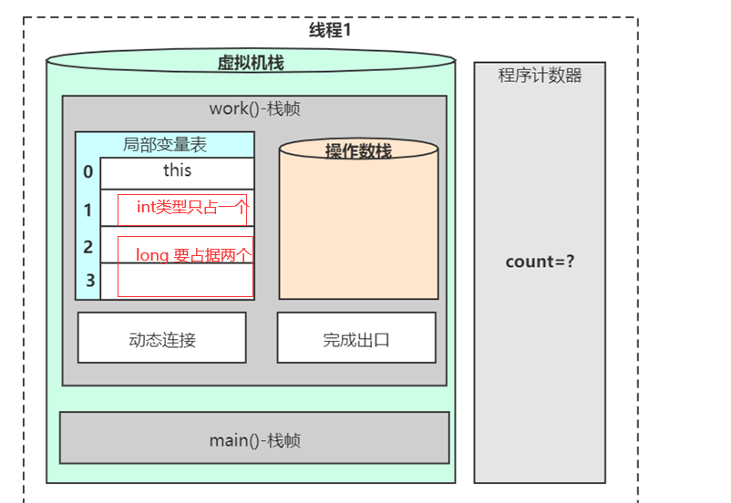

# 源码阅读技巧

- 跑不起来不读
- 解决问题就好 - 带有目的性的去读
- 一条线索到底
- 无关细节略过
- 一般不读静态
- 一般动态读法（debug去读）

读源码很难！

理解别人的思路！

1. 数据结构基础
2. 涉及模式

AQS：

Template Method

Callback funtion

父类默认实现

子类具体实现

**读源码先读骨架**

# AQS源码阅读


## VarHandle（since:9）

普通的属性也能完成原子性线程安全操作

jdk1.9之后才有

```java
import java.lang.invoke.MethodHandles;
import java.lang.invoke.VarHandle;

public class T01_HelloVarHandle {

    int x = 8;

    private static VarHandle handle;

    static {
        try {
            handle = MethodHandles.lookup().findVarHandle(T01_HelloVarHandle.class, "x", int.class);
        } catch (NoSuchFieldException e) {
            e.printStackTrace();
        } catch (IllegalAccessException e) {
            e.printStackTrace();
        }
    }

    public static void main(String[] args) {
        T01_HelloVarHandle t = new T01_HelloVarHandle();

        //plain read / write
        System.out.println((int)handle.get(t));
        handle.set(t,9);
        System.out.println(t.x);

        handle.compareAndSet(t, 9, 10);
        System.out.println(t.x);

        handle.getAndAdd(t, 10);
        System.out.println(t.x);

    }
}
```

## 为什么int x = 100是原子性操作，而long x = 100不是原子性操作？

这个地方涉及到JVM的虚拟机栈的入栈和出栈操作。

在赋值一个基本数据类型的时候，需要进行的就是虚拟机栈入栈。具体的操作就压入栈帧中的局部变量表。



**局部变量表:** 顾名思义就是局部变量的表，用于存放我们的局部变量的。首先它是一个32位的长度，主要存放我们的Java的八大基础数据类型，一般32位就可以存放下，但是如果是64位的比如long 就使用高低位占用两个也可以存放下。

所以综上，如果是int 32位，本身就是一个操作，如果是long的话，要操作两部，就不是原子性