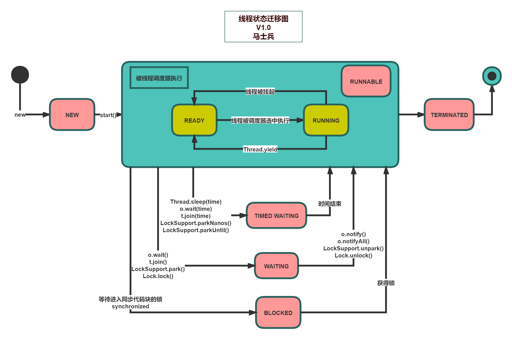

# 线程的基本概念

之前的硬件，只有一个CPU

之前的OS，只有一个进程

随着多核CPU的出现，人们开始追求对<font color='red'>CPU效率的极致压榨</font>

多线程的程序随之诞生，但随之诞生的，也是非常难以应对的各种并发bug

# 线程的历史 - 一部对于CPU性能压榨的历史
- 单进程人工切换
  - 纸带机
- 多线程批处理
  - 多个任务批量执行
- 多线程并行处理
  - 把程序写在不同的内存位置上来回切换
- 多线程
  - 一个程序内部不同任务的来回切换
  - selector - epoll
- 纤程/协成
  - 绿色线程，用户管理的（而不是OS管理的）线程
  - 比线程更小，可以创建几万个

# 面试题
## 什么是进程？
资源分配的基本单位（静态概念）

**从底层角度理解什么是进程？**


> 操作系统（OS）找到我们的可执行文件（比如：QQ.exe），然后将其加载到内存中。一个程序可以在内存中放很多次，每次都称之为一个进程
>
> 操作系统会为每个进程分配相关的资源，如：内存空间、文件描述符、端口
>
> 一个程序可以有多个进程，当然也可以在代码中控制只有一个进程
>
> 放到内存之后，哪个开始执行，就把它放到CPU去执行

## 什么是线程？

资源调度执行的基本单位（动态概念） 通俗说：一个程序中不同的执行路径

**从底层角度理解什么是线程？**

还是看上面那个计算机的组成图

> 真正开始执行的时候，是以线程的形式去执行的。
>
> 操作系统会找到主线程（main），扔给CPU去执行。主线程中如果开启的新的线程，就会在线程之间进行切换执行。
>
> 多个线程共享进程资源

### 什么是线程的切换

同一进程中的两个线程之间的切换

从底层角度来理解？


> 如图所以，比如我们要运行T1线程，就会把T1线程的数据放到CPU中，如果要运行T2线程，就把T1的数据放到cache中，然后把T2的线程放到CPU中。再运行T1线程，就把T1的数据从缓存中放到CPU中，然后将T2的数据从CPU放到缓存中
> 线程上下文切换会消耗资源

### 单核CPU设置多线程是否有意义？

有意义

> 线程在执行一段程序的时候，如果没有计算，而是等待（sleep）、等待网络的输入、或者是用IO，此时是不消耗CPU的，就可以把CPU让给其它线程去执行
> 线程分为：
> 1. CPU密集型（再做大量的计算）
> 2. IO密集型
> 
> 大多数线程即有CPU密集型也有IO密集型
> 
> 对于io密集型应用可以充分利用cpu

### 工作线程数是不是设置的越大越好？

并不是

因为线程上下文切换会消耗资源，当线程很多的时候，切换耗费的时间可能就会很长

### 工作线程（线程池中线程数量）设置多少合适？


### 为什么要写多线程程序？
为了压榨CPU，提高资源利用率

## 什么是纤程/协程？

## 什么是程序？

# 线程的创建方式
## 1. 继承Thread类
   ```java
   public class MyThread extends Thread{
      @Override
      public void run() {
          System.out.println("继承Thread类创建线程");
      }

      public static void main(String[] args) {
          new MyThread().start();
      }
  }
   ```
## 2. 实现Runnable接口
  ```java
  public class MyRunnable implements Runnable{
      @Override
      public void run() {
          System.out.println("实现Runnable接口");
      }

      public static void main(String[] args) {
          new Thread(new MyRunnable()).start();

          // 或者
          new Thread(() -> {
              System.out.println("是用lamda表达式，实现Runnable接口");
          }).start();
      }
  }
  ```
## 3. 实现Callable接口
  ```java
  public class MyCallable implements Callable<String> {
      @Override
      public String call() throws Exception {
          System.out.println("实现Callable创建线程，带返回值，可以抛出异常");
          return "Callable";
      }

      public static void main(String[] args) throws ExecutionException, InterruptedException {
          MyCallable myCallable = new MyCallable();
          FutureTask future = new FutureTask(myCallable);
          new Thread(future).start();

          // 获取返回值。这里会有 异常。获取返回值，是阻塞的过程，会等待线程执行结束，返回对应的值
          String result = (String) future.get();
          System.out.println(result);
      }
  }
  ```
## 4. 使用线程池
   ```java
  public class ThreadPoolTest {
    public static void main(String[] args) {
        ExecutorService threadPool = Executors.newCachedThreadPool();

        threadPool.execute(() -> {
            System.out.println("使用线程池");
        });
    }
  }
   ```
## 5. 定时任务创建线程
  ```java
  public class TimerTest {
      public static void main(String[] args) {
          Timer timer = new Timer();
          // 三个参数
          // 第一个是TimerTask
          // 第二个是 delay，线程开始执行的延迟时间
          // 第三个是 period。连续任务执行之间的时间（以毫秒为单位）。
          timer.schedule(new TimerTask() {
              @Override
              public void run() {
                  long begin = System.currentTimeMillis();
                  System.out.println("创建定时执行线程，执行时间：" + begin);
              }
          }, 0, 1000);
      }
  }
  ```
## jdk8的CompletableFuture

# 常见线程的几个方法
## sleep()
Sleep,意思就是睡眠，当前线程暂停一段时间让给别的线程去运行。

Sleep是怎么复活的？
> 由你的睡眠时间而定，等睡眠到规定的时间自动复活

## yield()
Yield,就是当前线程正在执行的时候停止下来进入等待队列（就绪状态，CPU依然有可能把这个线程拿出来运行），回到等待队列里在系统的调度算法里头呢还是依然有可能把你刚回去的这个线程拿回来继续执行，当然，更大的可能性是把原来等待的那些拿出一个来执行，所以yield的意思是**我让出一下CPU**，后面你们能不能抢到那我不管

```java
public class ThreadYield {

    public static void main(String[] args) {
        Thread t1 = new Thread(() -> {
            for (int i = 0; i < 100; i++) {
                System.out.println("A -> " + i);
                if (i % 10 == 0) {
                    Thread.yield();
                }
            }
        }, "线程A");

        Thread t2 = new Thread(() -> {
            for (int i = 0; i < 100; i++) {
                System.out.println("---------- B -> " + i);
                if (i % 10 == 0) {
                    Thread.yield();
                }
            }
        }, "线程B");

        t1.start();
        t2.start();
    }
}
```

## join()
join， 意思就是在自己当前线程加入你调用Join的线程（），本线程等待。等调用的线程运行完了，自己再去执行。t1和t2两个线程，在t1的某个点上调用了t2.join,它会跑到t2去运行，t1等待t2运行完毕继续t1运行（自己join自己没有意义）

```java
public class ThreadJoin {

    private static void sleep(long millis) {
        try {
            Thread.sleep(millis);
        } catch (InterruptedException e) {
            e.printStackTrace();
        }
    }

    public static void main(String[] args) {
        Thread t1 = new Thread(() -> {
            for (int i = 0; i < 100; i++) {
                System.out.println("A" + i);
            }
        });

        Thread t2 = new Thread(() -> {
            for (int i = 0; i < 100; i++) {
                System.out.println("B" + i);
                if (i == 10) {
                    try {
                        t1.join();
                    } catch (InterruptedException e) {
                        e.printStackTrace();
                    }
                }
            }
        });

        t1.start();
        t2.start();
    }
}
```
上面结果是，t2线程输出到10的时候，t1线程加入，直到t1线程执行结束，t2才开始执行

```java
public static void main(String[] args) {
      
        Thread t3 = new Thread(() -> {
          // 这里如果自己join()自己，会陷入死循环，调用 t3.interrupt(); 可以将其打破
            // try {
            //     Thread.currentThread().join();
            // } catch (InterruptedException e) {
            //     e.printStackTrace();
            // }
            sleep(500);
            System.out.println("T3线程");
        });

        t3.start();
        // 如果这里不掉用t3.join()方法，则打印"main线程"，加上了，就会等待t3线程执行结束，才会打印"main线程"
        try {
            t3.join();
        } catch (InterruptedException e) {
            e.printStackTrace();
        }
        System.out.println("main线程");
    }
```

# 线程的状态

**小节说明：**

- 本节重要程度：中 （帮助理解线程问题，保障知识完整性，面试很少考）
- 本节难度：低



## JAVA的6种线程状态:

1. New：线程创建，还没有启动

2. RUNNABLE：可运行状态，由线程调度器可以安排执行。

   > 包括READY和RUNNING两种细分状态

3. WAITING：等待被唤醒
4. TIME WAITING：隔一段时间后自动唤醒
5. BLOCKED：被阻塞，正在等待锁（只有是同步代码快的锁，才是BLOCKED状态）
6. TERMINTED：线程结束


## 代码测试：

### NEW_RUNNABLE_TERMINTED

```java
public class T04_ThreadState {

    static class MyThread extends Thread {
        @Override
        public void run() {
            System.out.println(this.getState());
            System.out.println("Thread run method");
        }
    }

    public static void main(String[] args) {
        Thread t = new MyThread();

        System.out.println(t.getState());

        t.start();

        try {
            t.join();
        } catch (InterruptedException e) {
            e.printStackTrace();
        }

        System.out.println(t.getState());

    }
}
```

### WAITING_TIMEWAITING
```java
Thread t2 = new Thread(() -> {
try {
    LockSupport.park(); // 等待，需要被唤醒，否则会一直等待
    System.out.println("t2 go on");
    TimeUnit.SECONDS.sleep(5);
} catch (InterruptedException e) {
    e.printStackTrace();
}
});

t2.start();
TimeUnit.SECONDS.sleep(1);
System.out.println("4: " + t2.getState()); // WAITING

// 唤醒
LockSupport.unpark(t2);
TimeUnit.SECONDS.sleep(1);
System.out.println("5: " + t2.getState());  // TIMED_WAITING。因为t2休眠 5s，此时t2在休眠中
```

### BLOCKED
```java
final Object o = new Object();

Thread t3 = new Thread(() -> {
    synchronized (o) {
        System.out.println("t3得到了锁 o");
    }
});

new Thread(() -> {
    synchronized (o) {
        try {
            TimeUnit.SECONDS.sleep(5);
        } catch (InterruptedException e) {
            e.printStackTrace();
        }
    }
}).start();

TimeUnit.SECONDS.sleep(1); // 这里的异常我抛出去了

t3.start();

TimeUnit.SECONDS.sleep(1); // 这里的异常我抛出去了

System.out.println("6: " + t3.getState()); // 状态是 BLOCKED
```

只有synchronized才会有BLOCKED状态。LOCK是juc下的包，通常是用CAS实现的。是一种忙等待。所以lock锁lock的时候，线程的状态是WAITING

```java
final ReentrantLock lock = new ReentrantLock();

Thread t4= new Thread(() -> {
    try {
        lock.lock();
        System.out.println("t4得到了lock锁");
    } finally {
        lock.unlock();
    }
});

new Thread(() -> {
    try {
        lock.lock();
        TimeUnit.SECONDS.sleep(5);
    } catch (InterruptedException e) {
        e.printStackTrace();
    } finally {
        lock.unlock();
    }
}).start();

TimeUnit.SECONDS.sleep(1); // 这里的异常我抛出去了

t4.start();
TimeUnit.SECONDS.sleep(1); // 这里的异常我抛出去了

System.out.println("7: " + t4.getState()); // 状态是 WAITING
```

### park之后线程的状态是WAITING

```java
Thread t5 = new Thread(() -> {
    LockSupport.park();
});


t5.start();
TimeUnit.SECONDS.sleep(1); // 这里的异常我抛出去了

System.out.println("8: " + t5.getState()); // 状态是 WAITING
```

# 线程的打断(interrupt)

**小节说明：**

重要程度：中（面试不多）

小节难度：低

## interrupt相关的三个方法

```java
//Thread.java  
public void interrupt()            //t.interrupt() 打断t线程（设置t线程某给标志位f=true，并不是打断线程的运行）
public boolean isInterrupted()     //t.isInterrupted() 查询打断标志位是否被设置（是不是曾经被打断过）
public static boolean interrupted()//Thread.interrupted() 查看“当前”线程是否被打断，如果被打断，恢复标志位
```

1. interrupt() ：实例方法，设置线程中断标志（打扰一下，你该处理一下中断）
2. isInterrupted()：实例方法，有没有人打扰我？
3. interrupted()：静态方法，有没有人打扰我（当前线程）？复位！

## interrupt和sleep() wait() join()

sleep()方法在睡眠的时候，不到时间是没有办法叫醒的，这个时候可以用interrupt设置标志位，然后呢必须得catch InterruptedException来进行处理，决定继续睡或者是别的逻辑，（自动进行中断标志复位）

**这三个方法是用的时候，都需要处理下 InterruptedException 异常**

## interrupt是否能中断正在竞争锁的线程

不能。

看下Synchrionized

```java
import java.util.concurrent.TimeUnit;
public class Interrupt_and_sync {

    private static Object o = new Object();

    private static void sleepSeconds(long sec) {
        try {
            TimeUnit.SECONDS.sleep(sec);
        } catch (InterruptedException e) {
            e.printStackTrace();
        }
    }

    public static void main(String[] args) {
        Thread t1 = new Thread(() -> {
            synchronized (o) {
                sleepSeconds(5);
            }
        });

        t1.start();

        sleepSeconds(1);

        Thread t2 = new Thread(() -> {
            synchronized (o) {

            }
            System.out.println("t2 end!"); // 可以正常输出。
        });

        t2.start();

        t2.interrupt();
    }
}
```

**interrupt()不能打断正在竞争锁的线程synchronized()**

```java
import java.util.concurrent.TimeUnit;
import java.util.concurrent.locks.ReentrantLock;

public class Interrupt_and_lock {

    private static ReentrantLock lock = new ReentrantLock();

    private static void sleepSeconds(long sec) {
        try {
            TimeUnit.SECONDS.sleep(sec);
        } catch (InterruptedException e) {
            e.printStackTrace();
        }
    }

    public static void main(String[] args) {
        Thread t1 = new Thread(() -> {
            lock.lock();
            try {
                sleepSeconds(5);
            } finally {
                lock.unlock();
            }
            System.out.println("t1 end!");
        });

        t1.start();

        sleepSeconds(1);

        Thread t2 = new Thread(() -> {
            System.out.println("t2 start!");
            lock.lock();
            try {
            } finally {
                lock.unlock();
            }
            System.out.println("t2 end!");
        });

        t2.start();

        sleepSeconds(1);

        t2.interrupt();

    }
}
```

**interrupt()也不能打断正在竞争锁的线程lock()**

## 如果想打断正在竞争锁的线程，使用ReentrantLock的lockInterruptibly()

```java
import java.util.concurrent.TimeUnit;
import java.util.concurrent.locks.ReentrantLock;

public class Interrupt_and_lockInterruptibly {

    private static ReentrantLock lock = new ReentrantLock();

    private static void sleepSeconds(long sec) {
        try {
            TimeUnit.SECONDS.sleep(sec);
        } catch (InterruptedException e) {
            e.printStackTrace();
        }
    }

    public static void main(String[] args) {
        Thread t1 = new Thread(() -> {
            lock.lock();
            try {
                sleepSeconds(5);
            } finally {
                lock.unlock();
            }
            System.out.println("t1 end!");
        });

        t1.start();

        sleepSeconds(1);

        Thread t2 = new Thread(() -> {
            System.out.println("t2 start!");
            try {
                lock.lockInterruptibly();  // 这里用 lockInterruptibly
            } catch (InterruptedException e) {
                e.printStackTrace();
            } finally {
                lock.unlock();
            }
            System.out.println("t2 end!");
        });

        t2.start();

        sleepSeconds(1);

        t2.interrupt();

    }
}
```

# 优雅的结束线程

**小节说明：**

本节内容的重要程度：中（面试有可能被问）

小节难度：低

结束线程的方法：

1. 自然结束（能自然结束就尽量自然结束）
2. stop() suspend() resume()  - 已经废弃了，太粗暴了。会破坏锁，可能会引起数据不一致等问题
3. volatile标志
   1. 不适合某些场景（比如还没有同步的时候，线程做了阻塞操作，没有办法循环回去）
   2. 打断时间也不是特别精确，比如一个阻塞容器，容量为5的时候结束生产者， 但是，由于volatile同步线程标志位的时间控制不是很精确，有可能生产者还继续生产一段儿时间
   ```java
    public class ThreadEnd {
   
    private static volatile boolean running = true;
   
    public static void main(String[] args) throws InterruptedException {
        Thread t = new Thread(() -> {
            long i = 0;
            while (running) {
                i++;
            }
            System.out.println("end and i = " + i); // 4561835521 4515803691
        });
   
        t.start();
   
        Thread.sleep(1000);
   
        running = false;
    }
    }
   ```
4. interrupt() and isInterrupted（比较优雅）
```java
public class ThreadEnd2 {

    public static void main(String[] args) throws InterruptedException {
        Thread t = new Thread(() -> {
            long i = 0;
            while (!Thread.interrupted()) {
                i++;
            }
            System.out.println("end and i = " + i); // 4561835521 4515803691
        });

        t.start();

        Thread.sleep(1000);

        t.interrupt();

    }
}
```

**不论是volatile 还是 interrupt 和 isInterrupted 都不是特别精确，要想特别精确需要使用到锁**
