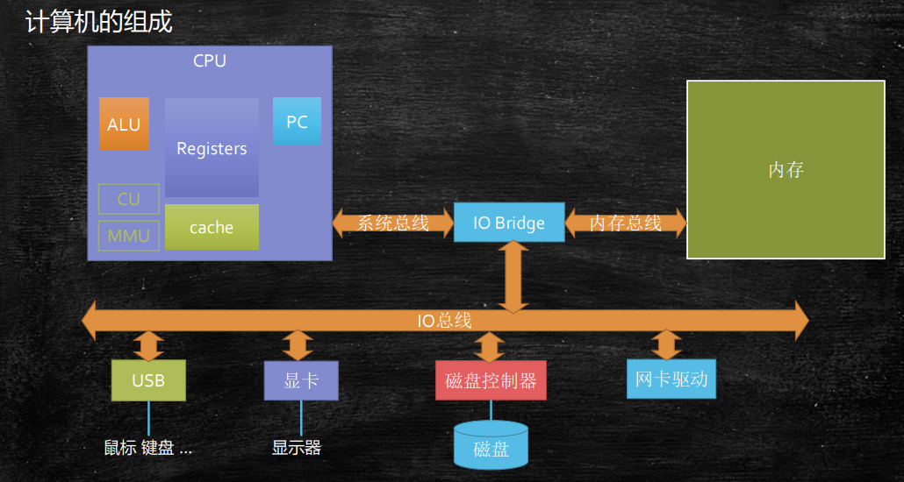
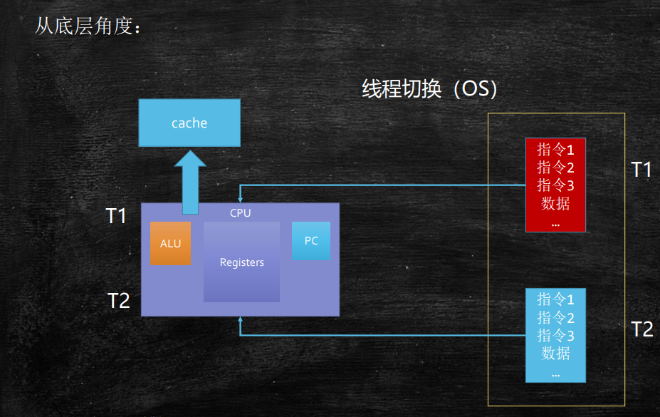
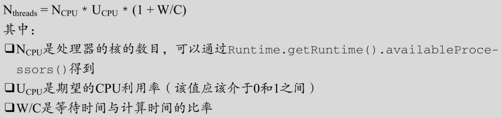

# 线程的基本概念

之前的硬件，只有一个CPU

之前的OS，只有一个进程

随着多核CPU的出现，人们开始追求对CPU效率的极致压榨

多线程的程序随之诞生，但随之诞生的，也是非常难以应对的各种并发bug

# 线程的历史 - 一部对于CPU性能压榨的历史
- 单进程人工切换
  - 纸带机
- 多线程批处理
  - 多个任务批量执行
- 多线程并行处理
  - 把程序写在不同的内存位置上来回切换
- 多线程
  - 一个程序内部不同任务的来回切换
  - selector - epoll
- 纤程/协成
  - 绿色线程，用户管理的（而不是OS管理的）线程
  - 比线程更小，可以创建几万个

# 面试题
## 什么是进程？
资源分配的基本单位（静态概念）

**从底层角度理解什么是进程？**

> 操作系统（OS）找到我们的可执行文件（比如：QQ.exe），然后将其加载到内存中。一个程序可以在内存中放很多次，每次都称之为一个进程
>
> 操作系统会为每个进程分配相关的资源，如：内存空间、文件描述符、端口
>
> 一个程序可以有多个进程，当然也可以在代码中控制只有一个进程
>
> 放到内存之后，哪个开始执行，就把它放到CPU去执行

## 什么是线程？

资源调度执行的基本单位（动态概念） 通俗说：一个程序中不同的执行路径

**从底层角度理解什么是线程？**

还是看上面那个计算机的组成图

> 真正开始执行的时候，是以线程的形式去执行的。
>
> 操作系统会找到主线程（main），扔给CPU去执行。主线程中如果开启的新的线程，就会在线程之间进行切换执行。
>
> 多个线程共享进程资源

### 什么是线程的切换

同一进程中的两个线程之间的切换

从底层角度来理解？

> 如图所以，比如我们要运行T1线程，就会把T1线程的数据放到CPU中，如果要运行T2线程，就把T1的数据放到cache中，然后把T2的线程放到CPU中。再运行T1线程，就把T1的数据从缓存中放到CPU中，然后将T2的数据从CPU放到缓存中
> 线程上下文切换会消耗资源

### 单核CPU设置多线程是否有意义？

有意义

> 线程在执行一段程序的时候，如果没有计算，而是等待（sleep）、等待网络的输入、或者是用IO，此时是不消耗CPU的，就可以把CPU让给其它线程去执行
> 线程分为：
> 1. CPU密集型（再做大量的计算）
> 2. IO密集型
> 
> 大多数线程即有CPU密集型也有IO密集型
> 
> 对于io密集型应用可以充分利用cpu

### 工作线程数是不是设置的越大越好？

并不是

因为线程上下文切换会消耗资源，当线程很多的时候，切换耗费的时间可能就会很长

### 工作线程（线程池中线程数量）设置多少合适？

## 什么是纤程/协程？

## 什么是程序？