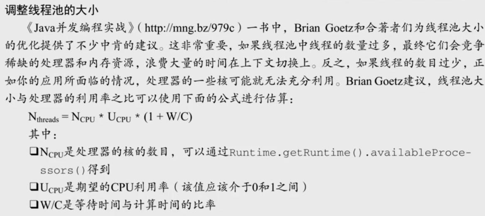
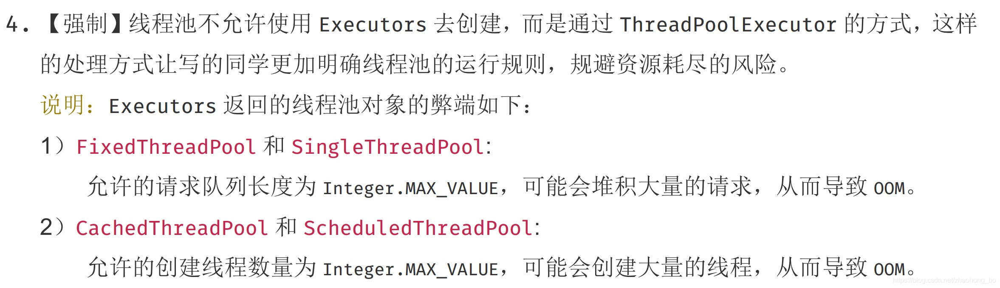
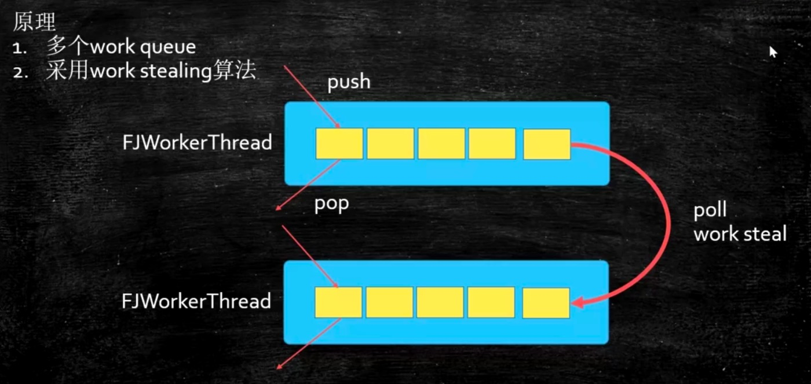
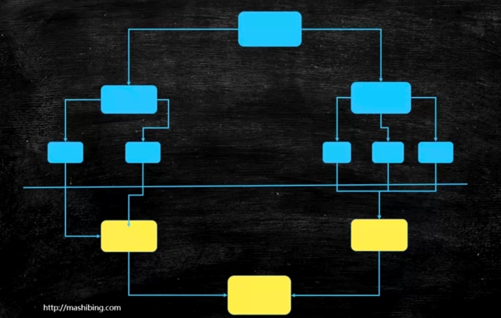

## 线程池的基础知识

看线程池这一章之前，建议看下容器那一章，了解下容器都有哪些

线程池首先有几个接口先了解下，第一个是`Executor`，第二个是`ExecutorService`，在后面才是线程池的一个使用`ThreadPoolExecutor`。

- Executor看它的名字也能理解，执行者，所以他有一个方法叫执行，那么执行的东西是Runnable，所以这个Executor有了之后呢由于它是一个接口，他可以有好多实现，因此我们说，有了Executor之后呢，我们现场就是一个任务的定义，比如Runnable起了一个命令的意思，他的定义和运行就可以分开了，不像我们以前定义一个Thread，new一个Thread然后去重写它的Run方法.start才可以运行，或者以前就是你写了一个Runnable你也必须得new一个Thread出来，以前的这种定义和运行是固定的，是写死的就是你new一个Thread让他出来运行。有的同学他还是new一个Thread但是他有了各种各样新的玩法，不用你亲自去指定每一个Thread，他的运行的方式你可以自己去定义了，所以至于是怎么去定义的就看你怎么实现Executor的接口了，这里是定义和运行分开这么一个含义，所以这个接口体现的是这个意思，所以这个接口就比较简单，至于你是直接调用run还是new一个Thread那是你自己的事儿。
```java
/* 
 * The {@code Executor} implementations provided in this package
 * implement {@link ExecutorService}, which is a more extensive
 * interface.  The {@link ThreadPoolExecutor} class provides an
 * extensible thread pool implementation. The {@link Executors} class
 * provides convenient factory methods for these Executors.
 *
 * <p>Memory consistency effects: Actions in a thread prior to
 * submitting a {@code Runnable} object to an {@code Executor}
 * <a href="package-summary.html#MemoryVisibility"><i>happen-before</i></a>
 * its execution begins, perhaps in another thread.
 *
 * @since 1.5
 * @author Doug Lea
 */
public interface Executor {

    /**
     * Executes the given command at some time in the future.  The command
     * may execute in a new thread, in a pooled thread, or in the calling
     * thread, at the discretion of the {@code Executor} implementation.
     *
     * @param command the runnable task
     * @throws RejectedExecutionException if this task cannot be
     * accepted for execution
     * @throws NullPointerException if command is null
     */
    void execute(Runnable command);
}
```
- ExecutorService又是什么意思呢，他是从Executor继承，另外，他除了去实现Executor可以去执行一个任务之外，他还完善了整个任务执行器的一个生命周期，就拿线程池来举例子，一个线程池里面一堆的线程就是一堆的工人，执行完一个任务之后我这个线程怎么结束啊，线程池定义了这样一些个方法:
```java
void shutdown();//结束
List<Runnable> shutdownNow();//马上结束
boolean isShutdown();//是否结束了
boolean isTerminated();//是不是整体都执行完了
boolean awaitTermination(long timeout, TimeUnit unit)
        throws InterruptedException;//等着结束，等多长时间，时间到了还不结束的话他就返回false
```
等等，所以这里面呢，他是实现了一些个线程的线程池的生命周期的东西，扩展了Executor的接口，真正的线程池的现实是在ExecutorService的这个基础上来实现的。当我们看到这个ExecutorService的时候你会发现他除了Executor执行任务之外还有submit提交任务，执行任务是直接拿过来马上运行，而submit是扔给这个线程池，什么时候运行由这个线程池来决定，相当于是异步的，我只要往里面一扔就不管了。那好，如果不管的话什么时候他有结果啊，这里面就涉及了比较新的类：比如说Future、RunnableFuture、FutureTask所以在这个里面我要给大家拓展一些线程的基础的概念，大家以前学线程的时候定义一个线程的任务只能去实现Runnable接口，那在1.5之后他就增加了Callable这个接口。
```java
package java.util.concurrent;
/**
 * A task that returns a result and may throw an exception.
 * Implementors define a single method with no arguments called
 * {@code call}.
 *
 * <p>The {@code Callable} interface is similar to {@link
 * java.lang.Runnable}, in that both are designed for classes whose
 * instances are potentially executed by another thread.  A
 * {@code Runnable}, however, does not return a result and cannot
 * throw a checked exception.
 *
 * <p>The {@link Executors} class contains utility methods to
 * convert from other common forms to {@code Callable} classes.
 *
 * @see Executor
 * @since 1.5
 * @author Doug Lea
 * @param <V> the result type of method {@code call}
 */
@FunctionalInterface
public interface Callable<V> {
    /**
     * Computes a result, or throws an exception if unable to do so.
     *
     * @return computed result
     * @throws Exception if unable to compute a result
     */
    V call() throws Exception;
}
```
有了这个Callable之后呢，我们在来看一个接口：Future，这个Future代表的是什么呢，这个Future代表的是那个Callable被执行完了之后我怎么才能拿到那个结果啊，它会封装到一个Future里面。Future将来，未来。未来你执行完之后可以把这个结果放到这个未来有可能执行完的结果里头，所以Future代表的是未来执行完的一个结果。

由于Callable基本上就是为了线程池而设计的，所以你要是不用线程池的接口想去写Callable的一些个小程序还是比较麻烦，所以这里面是要用到一些线程池的直接的用法，比较简单，我们先用，用完后再给大家解释什么意思。

我们来看Future是怎么用的，在我们读这个ExecutorService的时候你会发现他里面有submit方法，这个submit是异步的提交任务，提交完了任务之后原线程该怎么运行怎么运行，运行完了之后他会出一个结果，这个结果出在哪儿 ，他的返回值是一个Future，所以你只能去提交一个Callable，必须有返回值，把Callable的任务扔给线程池，线程池执行完了，异步的，就是把任务交给线程池之后我主线程该干嘛干嘛，调用get方法直到有结果之后get会返回。

**Callable一般是配合线程池和Future来用的。**

其实更灵活的一个用法是FutureTask，即是一个Future同时又是一个Task，原来这Callable只能一个Task只能是一个任务但是他不能作为一个Future来用。这个FutureTask相当于是我自己可以作为一个任务来用，同时这个任务完成之后的结果也存在于这个对象里，为什么他能做到这一点，因为FutureTask他实现了RunnableFuture，而RunnableFuture即实现了Runnable又实现了Future，所以他即是一个任务又是一个Future。所以这个FutureTask是更好用的一个类。大家记住这个类，后面还会有WorkStealingPool、ForkJoinPool这些个基本上是会用到FutureTask类的。

```java
import java.util.concurrent.ExecutionException;
import java.util.concurrent.FutureTask;

public class FutureTaskTest {

    public static void main(String[] args) throws ExecutionException, InterruptedException {

        FutureTask<Integer> futureTask = new FutureTask<>(() -> {
            Thread.sleep(1000);
            return 100;
        });

        new Thread(futureTask).start();

        System.out.println(futureTask.get()); // 阻塞方法
    }

}
```

我们拓展了几个类，大家把这几个小类理解一下
- Callable 类似与 Runnable，但是有返回值。
- 了解了Future，是用来存储执行的将来才会产生的结果。
- FutureTask，他是Future加上Runnable，既可以执行又可以存结果。
- CompletableFuture，管理多个Future的结果。
- Callable里面可以抛异常，Runnable里面不行

### CompletableFuture

那么有了这些之后那，我们可以介绍一个CompletableFuture。他底层特别复杂，但是用法特别灵活，如果你们感兴趣可以去拓展的了解一下，用一下。CompletableFuture他的底层用的是ForkJoinPool。

```java
import java.util.concurrent.CompletableFuture;
import java.util.concurrent.ExecutionException;
import java.util.concurrent.TimeUnit;

/**
 * @author liufei
 * @version 1.0.0
 * @description 假设你能够提供一个服务
 * 这个服务查询各大电商网站同一类产品的价格并汇总展示
 * @date 2022/11/10
 */
public class T06_01_CompletableFuture {

    public static void main(String[] args) throws ExecutionException, InterruptedException {
        long start, end;

        start = System.currentTimeMillis();
        double tm = priceOfTM();
        double jd = priceOfJD();
        double tb = priceOfTB();
        end = System.currentTimeMillis();

        double total1 = tm + jd + tb;
        System.out.println("use serial method call! " + (end - start) + ", 结果是 " + total1);

        start = System.currentTimeMillis();

        CompletableFuture<Double> futureTM = CompletableFuture.supplyAsync(() -> priceOfTM());
        CompletableFuture<Double> futureJD = CompletableFuture.supplyAsync(() -> priceOfJD());
        CompletableFuture<Double> futureTB = CompletableFuture.supplyAsync(() -> priceOfTB());

        // allOf是全部完成，anyOf是只要一个完成即可
        CompletableFuture.allOf(futureTM, futureTB, futureJD).join();

        end = System.currentTimeMillis();
        double total2 = futureTM.get() + futureJD.get() + futureTB.get();
        System.out.println("use completable future! " + (end - start) + ", 结果是 " + total2);
    }


    private static double priceOfTM() {
        delay();
        return 1.00;
    }

    private static double priceOfTB() {
        delay();
        return 2.00;
    }

    private static double priceOfJD() {
        delay();
        return 3.00;
    }


    private static void delay() {
        int time = 1000;
        try {
            TimeUnit.MILLISECONDS.sleep(time);
        } catch (InterruptedException e) {
            e.printStackTrace();
        }
        System.out.printf("After %s sleep!\n", time);
    }
}
```
运行结果：

```shell
After 1000 sleep!
After 1000 sleep!
After 1000 sleep!
use serial method call! 3031, 结果是 6.0
After 1000 sleep!
After 1000 sleep!
After 1000 sleep!
use completable future! 1014, 结果是 6.0
```

线程池的分类：
- 普通的线程池**ThreadPoolExecutor**
- ForkJoinPool 是分叉，分叉再汇总

这是两种不同类型的线程池，我们说线程池的时候一般是说的第一种线程池。

ThreadPoolExecutor他的父类是从AbstractExecutorService，而AbstractExecutorService的父类是ExecutorService，再ExecutorService的父类是Executo，所以ThreadPoolExecutor就相当于线程池的执行器，就是大家伙儿可以向这个池子里面扔任务，让这个线程池去运行。

另外在阿里巴巴的手册里面要求线程池是要自定义的，还有不少同学会被问这个线程池是怎么自定义。

```java
import java.io.IOException;
import java.util.concurrent.ArrayBlockingQueue;
import java.util.concurrent.Executors;
import java.util.concurrent.ThreadPoolExecutor;
import java.util.concurrent.TimeUnit;

/**
 * @author liufei
 * @version 1.0.0
 * @description
 * @date 2022/11/10
 */
public class T05_00_HelloThreadPool {

    static class Task implements Runnable {

        private int i;

        public Task(int i) {
            this.i = i;
        }

        @Override
        public void run() {
            System.out.println(Thread.currentThread().getName() + " Task " + i);
            try {
                System.in.read();  // 阻塞住
            } catch (IOException e) {
                e.printStackTrace();
            }
        }

        @Override
        public String toString() {
            return "Task{" +
                    "i=" + i +
                    '}';
        }
    }


    public static void main(String[] args) {
        ThreadPoolExecutor tpe = new ThreadPoolExecutor(2, 4, 60L, TimeUnit.SECONDS,
                new ArrayBlockingQueue<>(4),
                Executors.defaultThreadFactory(),
                new ThreadPoolExecutor.AbortPolicy());

        for (int i = 0; i < 8; i++) {
            tpe.execute(new Task(i));
        }

        System.out.println(tpe.getQueue());

        tpe.execute(new Task(100));

        System.out.println(tpe.getQueue());

        tpe.shutdown();
    }
}
```
运行结果
```shell
[Task{i=2}, Task{i=3}, Task{i=4}, Task{i=5}]
pool-1-thread-4 Task 7
pool-1-thread-2 Task 1
pool-1-thread-1 Task 0
pool-1-thread-3 Task 6
Exception in thread "main" java.util.concurrent.RejectedExecutionException: Task Task{i=100} rejected from java.util.concurrent.ThreadPoolExecutor@d7b1517[Running, pool size = 4, active threads = 4, queued tasks = 4, completed tasks = 0]
	at java.base/java.util.concurrent.ThreadPoolExecutor$AbortPolicy.rejectedExecution(ThreadPoolExecutor.java:2055)
	at java.base/java.util.concurrent.ThreadPoolExecutor.reject(ThreadPoolExecutor.java:825)
	at java.base/java.util.concurrent.ThreadPoolExecutor.execute(ThreadPoolExecutor.java:1355)
	at com.liufei.c_026_threadpool.T05_00_HelloThreadPool.main(T05_00_HelloThreadPool.java:56)
```

由于我们使用的是AbortPolicy测试，会直接抛异常

定义线程池的7个参数
- corePoolSoze 核心线程数
- maximumPoolSize 最大线程数，线程数不够了，能扩展到最大线程是多少
- keepAliveTime 生存时间，意思是这个线程有很长时间没干活的时候请把它归还给操作系统
- unit 是生存时间的单位
- 任务队列：各种各样的BlockingQueue你都可以往里面扔，我们这用的是ArrayBlockingQueue，参数最多可以装四个任务；
- 线程工厂defaultThreadFactory，他返回的是一个new DefaultThreadFactory,它要去你去实现ThreadFactory的接口，这个接口只有一个方法叫newThread，所以就是产生线程的，可以通过这种方式产生自定义的线程，默认产生的是defaultThreadFactory，而defaultThreadFactory产生线程的时候有几个特点：new出来的时候指定了group指定了线程名字，然后指定的这个线程绝对不是守护线程，设定好你线程的优先级。自己可以定义产生的到底是什么样的线程，指定线程名叫什么（为什么要指定线程名称，有什么意义，就是可以方便出错是回溯）；
- 拒绝策略，指的是线程池忙，而且任务队列满的情况相爱我们就要执行各种各样的拒绝策略。

JDK默认的拒绝策略有4中，当然我们也可以自己定义
- AbortPolicy: 直接抛异常
- DiscardPolicy: 扔掉，不抛异常
- DiscardOldestPolicy：扔掉队列中时间最久的任务
- CallRunsPolicy：调用者处理服务

一般情况这四种我们会自定义策略，去实现这个拒绝策略的接口，处理的方式是一般我们的消息需要保存下来，要是订单的话那就更需要保存了，保存到kafka，保存到redis或者是存到数据库随便你然后做好日志。

## 常见线程池

### 1. newSingleThreadExecutor 单个线程池
看名字就知道这个线程池里面只有一个线程，这个线程池可以保证我们扔进去的任务是**顺序执行**的。
肯定会有人问这样一个问题，为什么会有单线程的线程池？
> 第一个线程池是有任务队列的；
> 
> 生命周期管理线程池是能帮你提供的；

```java

// 源码：核心线程数和最大线程数都是 1
public static ExecutorService newSingleThreadExecutor() {
    return new FinalizableDelegatedExecutorService
        (new ThreadPoolExecutor(1, 1,
                                0L, TimeUnit.MILLISECONDS,
                                new LinkedBlockingQueue<Runnable>()));
}


import java.util.concurrent.ExecutorService;
import java.util.concurrent.Executors;

public class T07_SingleThreadPool {

    public static void main(String[] args) {
        ExecutorService service = Executors.newSingleThreadExecutor();
        for (int i = 0; i < 5; i++) {
            final int j = i;
            service.execute(() -> {
                System.out.println(j + " " + Thread.currentThread().getName());
            });
        }
    }
}
```
运行结果：
```shell
0 pool-1-thread-1
1 pool-1-thread-1
2 pool-1-thread-1
3 pool-1-thread-1
4 pool-1-thread-1
```

### 2. newFixedThreadExecutor(n)  固定长度线程池

fixed是固定的含义，就是固定的一个线程数，因为他的最大线程和核心线程都是固定的就没有回收之说所以把他指定成0L,这里用的是LinkedBlockingQueue（如果在阿里工作看到LinkedBlockingQueue一定要小心，他是不建议用的）

我们来看一下这个FixedThreadPool的小例子，用一个固定的线程池有一个好处是什么呢?


```java
// 源码
public static ExecutorService newFixedThreadPool(int nThreads) {
    return new ThreadPoolExecutor(nThreads, nThreads,
                                    0L, TimeUnit.MILLISECONDS,
                                    new LinkedBlockingQueue<Runnable>());
}


import java.util.ArrayList;
import java.util.List;
import java.util.concurrent.Callable;
import java.util.concurrent.ExecutionException;
import java.util.concurrent.ExecutorService;
import java.util.concurrent.Executors;
import java.util.concurrent.Future;

public class T09_FixedThreadPool {
    public static void main(String[] args) throws InterruptedException, ExecutionException {
        long start = System.currentTimeMillis();
        getPrime(1, 200000);
        long end = System.currentTimeMillis();
        System.out.println(end - start);

        final int cpuCoreNum = 4;

        ExecutorService service = Executors.newFixedThreadPool(cpuCoreNum);

        MyTask t1 = new MyTask(1, 80000); //1-5 5-10 10-15 15-20
        MyTask t2 = new MyTask(80001, 130000);
        MyTask t3 = new MyTask(130001, 170000);
        MyTask t4 = new MyTask(170001, 200000);

        Future<List<Integer>> f1 = service.submit(t1);
        Future<List<Integer>> f2 = service.submit(t2);
        Future<List<Integer>> f3 = service.submit(t3);
        Future<List<Integer>> f4 = service.submit(t4);

        start = System.currentTimeMillis();
        f1.get();
        f2.get();
        f3.get();
        f4.get();
        end = System.currentTimeMillis();
        System.out.println(end - start);
    }

    static class MyTask implements Callable<List<Integer>> {
        int startPos, endPos;

        MyTask(int s, int e) {
            this.startPos = s;
            this.endPos = e;
        }

        @Override
        public List<Integer> call() throws Exception {
            List<Integer> r = getPrime(startPos, endPos);
            return r;
        }

    }

    static boolean isPrime(int num) {
        for (int i = 2; i <= num / 2; i++) {
            if (num % i == 0) return false;
        }
        return true;
    }

    static List<Integer> getPrime(int start, int end) {
        List<Integer> results = new ArrayList<>();
        for (int i = start; i <= end; i++) {
            if (isPrime(i)) results.add(i);
        }

        return results;
    }
}
```

### 3. newCacheThreadExecutor (可缓存的线程池)

可缓存线程池，当线程池大小超过了处理任务所需的线程，那么就会回收部分空闲（一般是60秒无执行）的线程，当有任务来时，又智能的添加新线程来执行。

```java
// 源码
public static ExecutorService newCachedThreadPool() {
    return new ThreadPoolExecutor(0, Integer.MAX_VALUE,
                                    60L, TimeUnit.SECONDS,
                                    new SynchronousQueue<Runnable>());
}

import java.util.concurrent.ExecutorService;
import java.util.concurrent.Executors;
import java.util.concurrent.TimeUnit;

public class T08_CachedPool {
    public static void main(String[] args) throws InterruptedException {
        ExecutorService service = Executors.newCachedThreadPool();
        System.out.println(service);
        for (int i = 0; i < 2; i++) {
            service.execute(() -> {
                try {
                    TimeUnit.MILLISECONDS.sleep(500);
                } catch (InterruptedException e) {
                    e.printStackTrace();
                }
                System.out.println(Thread.currentThread().getName());
            });
        }
        System.out.println(service);

        TimeUnit.SECONDS.sleep(80);

        System.out.println(service);
    }
}
```

用的是 SynchronousQueue 队列，这个队列容量是0，就是说明，我们往里面添加一个任务，就会有人取走并执行。

**Cache vs Fixed**

什么时候用Cache什么时候用Fixed，你得精确的控制你有多少个线程数，控制数量问题多数情况下你得预估并发量。

如果线程池中的数量过多，最终他们会竞争稀缺的处理器和内存资源，浪费大量的时间在上下文切换上，反之，如果线程的数目过少，正如你的应用所面临的情况，处理器的一些核可能就无法充分利用。

Brian Goetz建议，线程池大小与处理器的利用率之比可以使用公式来进行计算估算：线程池=你有多少个cpu 乘以 cpu期望利用率 乘以 （1+ W/C）。W除以C是等待时间与计算时间的比率。



假如你这个任务并不确定他的量平稳与否，就像是任务来的时候他可能忽高忽低，但是我要保证这个任务来时有人做这个事儿，那么我们可以用Cache，当然你要保证这个任务不会堆积。那Fixed的话就是这个任务来的比较平稳，我们大概的估算了一个值，就是这个值完全可以处理他，我就直接new这个值的线程来扔在这就ok了。**（阿里是都不用，自己估算，进行精确定义）**

### 4. newScheduleThreadExecutor 定时周期线程池

大小无限制的线程池，支持定时和周期性的执行线程

```java
// 源码
public static ScheduledExecutorService newScheduledThreadPool(int corePoolSize) {
    return new ScheduledThreadPoolExecutor(corePoolSize);
}
public ScheduledThreadPoolExecutor(int corePoolSize) {
    super(corePoolSize, Integer.MAX_VALUE, 0, NANOSECONDS,
            new DelayedWorkQueue());
}

import java.util.Random;
import java.util.concurrent.Executors;
import java.util.concurrent.ScheduledExecutorService;
import java.util.concurrent.TimeUnit;

public class T10_ScheduledPool {
    public static void main(String[] args) {
        ScheduledExecutorService service = Executors.newScheduledThreadPool(4);
		// 第一个参数是Runnable
		// 第二个是线程池延迟多少启动
		// 第三个是线程池执行频率
		// 第四个是时间单位
        service.scheduleAtFixedRate(() -> {
            try {
                TimeUnit.MILLISECONDS.sleep(new Random().nextInt(1000));
            } catch (InterruptedException e) {
                e.printStackTrace();
            }
            System.out.println(Thread.currentThread().getName());
        }, 0, 500, TimeUnit.MILLISECONDS);

    }
}
```

### 为什么不建议使用 Executors静态工厂构建线程池？

阿里巴巴Java开发手册，明确指出不允许使用Executors静态工厂构建线程池
原因如下：
线程池不允许使用Executors去创建，而是通过ThreadPoolExecutor的方式，这样的处理方式让写的同学更加明确线程池的运行规则，规避资源耗尽的风险

说明：Executors返回的线程池对象的弊端如下：



创建线程池的正确姿势

避免使用Executors创建线程池，主要是避免使用其中的默认实现，那么我们可以自己直接调用ThreadPoolExecutor的构造函数来自己创建线程池。在创建的同时，给BlockQueue指定容量就可以了。

```java
private static ExecutorService executor = new ThreadPoolExecutor(10, 10,
        60L, TimeUnit.SECONDS,
        new ArrayBlockingQueue(10));
```

或者是使用开源类库：开源类库，如apache和guava等。

给大家分享一道阿里的面试题：
假如提供一个闹钟服务，订阅这个服务的人特别多，10亿人，就意味着在每天早上七点钟的时候会有10亿的并发量涌向你这的服务器，问你怎么优化？

> 思想是把这个定时的任务分发到很多很多的边缘的服务器上去，一台服务器不够啊，在一台服务器上有一个队列存着这些任务，然后线程去消费，也是要用到线程池的，大的结构上用分而> 治之的思想，主服务器把这些同步到边缘服务器，在每台服务器上用线程池加任务队列。


到现在我们学习了四种线程池了，我们来稍微回顾一下：


1：SingleThreadPool只有一个线程的线程池；

2：FixedThreadPool固定多少个线程的线程池；

3：CachedPool有弹性的线程池，来一个启动一个，只要没闲着就启动新的来执行；

4：ScheduledPool定时任务来执行线程池；

这几个线程池底层全都是用的ThreadPoolExecutor。

### 自定义拒绝策略

```java
import java.util.concurrent.ArrayBlockingQueue;
import java.util.concurrent.Executors;
import java.util.concurrent.RejectedExecutionHandler;
import java.util.concurrent.ThreadPoolExecutor;
import java.util.concurrent.TimeUnit;

/**
 * @author liufei
 * @version 1.0.0
 * @description
 * @date 2022/11/13
 */
public class T14_MyRejectedHandler {


    static class MyHandle implements RejectedExecutionHandler {

        @Override
        public void rejectedExecution(Runnable r, ThreadPoolExecutor executor) {
            //log("r rejected")
            //save r kafka mysql redis
            //try 3 times
            if (executor.getQueue().size() < 10000) {
                //try put again();
            }
            System.out.println("自定义绝绝策略");
        }
    }


    public static void main(String[] args) {
        ThreadPoolExecutor threadPoolExecutor = new ThreadPoolExecutor(
                1,
                1,
                0L,
                TimeUnit.SECONDS,
                new ArrayBlockingQueue<>(2),
                Executors.defaultThreadFactory(),
                new MyHandle());

        for (int i = 0; i < 3; i++) {
            threadPoolExecutor.execute(() -> {
                System.out.println("线程名称 ：" + Thread.currentThread().getName());
                try {
                    Thread.sleep(1000);
                } catch (InterruptedException e) {
                    e.printStackTrace();
                }
            });
        }

        threadPoolExecutor.execute(() -> {
            System.out.println("第5个线程名称 ：" + Thread.currentThread().getName());
        });
    }
}
```

运行结果：

```shell
自定义拒绝策略
线程名称 ：pool-1-thread-1
线程名称 ：pool-1-thread-1
线程名称 ：pool-1-thread-1
```

## ThreadPoolExecutor源码解析

### 1、常用变量的解释

这里面有一些常用变量的解释，第一个叫control (ctl)，ctl代表两个意思，AtomicInteger是int类型，int类型是32位，高的三位代表线程池状态，低的29位代表目前线程池里有多少个线程数量。那他干嘛不用两个值，这里面肯定是自己进行了一些优化的，如果让我们自己写一定是两个值，我们线程池目前是什么状态，然后在这里面到底目前有多少个线程在运行，记录下来，只不过他把这两个值合二为一了，执行效率是会更高一些，因为这两个值都需要线程同步，所以他放在一个值里面，只要对一个线程进行线程同步就可以了，所以这里AtomicInteger在线程数量非常多，执行时间非常短的时候相对于synchronized效率会更高一些，在下面2、3是对ctl的一个计算。

4是线程池的一些5种状态
- RUNNING：正常运行的
- SHUTDOWN： 调用shutdown方法进入shutdown状态
- STOP：调用shutdownnow马上让它停止
- TIDYING：调用shutdown然后这个线程也执行完了，现在正在整理的这个过程叫TIDYNING
- TERMINATED：整个线程全部结束

在下面就是对ctl的一些操作了runStateOf取他的状态，workerCountOf计算有多少个线程正在工作，还有第8和第9个runStateLessThan、runStateAtLeast是帮助写代码的一些东西。

```java
// 1. `ctl`，可以看做一个int类型的数字，高3位表示线程池状态，低29位表示worker数量
private final AtomicInteger ctl = new AtomicInteger(ctlOf(RUNNING, 0));
// 2. `COUNT_BITS`，`Integer.SIZE`为32，所以`COUNT_BITS`为29
private static final int COUNT_BITS = Integer.SIZE - 3;
// 3. `CAPACITY`，线程池允许的最大线程数。1左移29位，然后减1，即为 2^29 - 1
private static final int CAPACITY   = (1 << COUNT_BITS) - 1;

// runState is stored in the high-order bits
// 4. 线程池有5种状态，按大小排序如下：RUNNING < SHUTDOWN < STOP < TIDYING < TERMINATED
private static final int RUNNING    = -1 << COUNT_BITS;
private static final int SHUTDOWN   =  0 << COUNT_BITS;
private static final int STOP       =  1 << COUNT_BITS;
private static final int TIDYING    =  2 << COUNT_BITS;
private static final int TERMINATED =  3 << COUNT_BITS;

// Packing and unpacking ctl
// 5. `runStateOf()`，获取线程池状态，通过按位与操作，低29位将全部变成0
private static int runStateOf(int c)     { return c & ~CAPACITY; }
// 6. `workerCountOf()`，获取线程池worker数量，通过按位与操作，高3位将全部变成0
private static int workerCountOf(int c)  { return c & CAPACITY; }
// 7. `ctlOf()`，根据线程池状态和线程池worker数量，生成ctl值
private static int ctlOf(int rs, int wc) { return rs | wc; }

/*
 * Bit field accessors that don't require unpacking ctl.
 * These depend on the bit layout and on workerCount being never negative.
 */
// 8. `runStateLessThan()`，线程池状态小于xx
private static boolean runStateLessThan(int c, int s) {
    return c < s;
}
// 9. `runStateAtLeast()`，线程池状态大于等于xx
private static boolean runStateAtLeast(int c, int s) {
    return c >= s;
}
```

### 2、构造方法

```java
public ThreadPoolExecutor(int corePoolSize,
                          int maximumPoolSize,
                          long keepAliveTime,
                          TimeUnit unit,
                          BlockingQueue<Runnable> workQueue,
                          ThreadFactory threadFactory,
                          RejectedExecutionHandler handler) {
    // 基本类型参数校验
    if (corePoolSize < 0 ||
        maximumPoolSize <= 0 ||
        maximumPoolSize < corePoolSize ||
        keepAliveTime < 0)
        throw new IllegalArgumentException();
    // 空指针校验
    if (workQueue == null || threadFactory == null || handler == null)
        throw new NullPointerException();
    this.corePoolSize = corePoolSize;
    this.maximumPoolSize = maximumPoolSize;
    this.workQueue = workQueue;
    // 根据传入参数`unit`和`keepAliveTime`，将存活时间转换为纳秒存到变量`keepAliveTime `中
    this.keepAliveTime = unit.toNanos(keepAliveTime);
    this.threadFactory = threadFactory;
    this.handler = handler;
}
```
### 3、提交执行task的过程

这个execute方法还算是相对简单一些，我们来简单解释大概读一下，execute执行任务的时候判断任务等于空抛异常，这个很简单，接下来就是拿状态值，拿到值之后计算这个值里面的线程数，活着的那些线程数是不是小于核心线程数，如果小于addWorker添加一个线程，addWorker是比较难的一个方法，他的第二个参数指的是，是不是核心线程，所有上来之后如果核心数不够先添加核心线程，再次检查这个值。我们原来讲过这个线程里面上来之后刚开始为0，来一个任务启动一个核心线程，第二个就是核心线程数满了之后，放到队列里。最后核心线程满了，队列也满了，启动非核心线程。
小于线程数就直接加，后面执行的逻辑就是不小于了，不小于就是超过核心线程数了直接往里扔，workQueue.offer就是把他扔进去队列里，再检查状态。在这中间可能会被改变状态值，因此需要双重检查，这个跟我们之前聊过的单例模式里面的DC是一样的逻辑。isRunning，重新又拿这个状态，拿到这个状态之后这里是要进行一个状态切换的，如果不是Running状态说明执行过shutdown命令，才会把这个Running转换成别的状态，其他情况下workerCountOf如果等于0说明里面没有线程了，没有线程我线程池正常运行就添加非核心线程。这些步骤都是通过源码可以看出来的。如果添加work本身都不行就reject把他给拒绝掉。

```java
public void execute(Runnable command) {
    if (command == null)
        throw new NullPointerException();
    /*
     * Proceed in 3 steps:
     *
     * 1. If fewer than corePoolSize threads are running, try to
     * start a new thread with the given command as its first
     * task.  The call to addWorker atomically checks runState and
     * workerCount, and so prevents false alarms that would add
     * threads when it shouldn't, by returning false.
     *
     * 2. If a task can be successfully queued, then we still need
     * to double-check whether we should have added a thread
     * (because existing ones died since last checking) or that
     * the pool shut down since entry into this method. So we
     * recheck state and if necessary roll back the enqueuing if
     * stopped, or start a new thread if there are none.
     *
     * 3. If we cannot queue task, then we try to add a new
     * thread.  If it fails, we know we are shut down or saturated
     * and so reject the task.
     */
    int c = ctl.get();
    // worker数量比核心线程数小，直接创建worker执行任务
    if (workerCountOf(c) < corePoolSize) {
        if (addWorker(command, true))
            return;
        c = ctl.get();
    }
    // worker数量超过核心线程数，任务直接进入队列
    if (isRunning(c) && workQueue.offer(command)) {
        int recheck = ctl.get();
        // 线程池状态不是RUNNING状态，说明执行过shutdown命令，需要对新加入的任务执行reject()操作。
        // 这儿为什么需要recheck，是因为任务入队列前后，线程池的状态可能会发生变化。
        if (! isRunning(recheck) && remove(command))
            reject(command);
        // 这儿为什么需要判断0值，主要是在线程池构造方法中，核心线程数允许为0
        else if (workerCountOf(recheck) == 0)
            addWorker(null, false);
    }
    // 如果线程池不是运行状态，或者任务进入队列失败，则尝试创建worker执行任务。
    // 这儿有3点需要注意：
    // 1. 线程池不是运行状态时，addWorker内部会判断线程池状态
    // 2. addWorker第2个参数表示是否创建核心线程
    // 3. addWorker返回false，则说明任务执行失败，需要执行reject操作
    else if (!addWorker(command, false))
        reject(command);
}
```

### 4、addWorker源码解析

```java
private boolean addWorker(Runnable firstTask, boolean core) {
    retry:
    // 外层自旋
    for (;;) {
        int c = ctl.get();
        int rs = runStateOf(c);

        // 这个条件写得比较难懂，我对其进行了调整，和下面的条件等价
        // (rs > SHUTDOWN) || 
        // (rs == SHUTDOWN && firstTask != null) || 
        // (rs == SHUTDOWN && workQueue.isEmpty())
        // 1. 线程池状态大于SHUTDOWN时，直接返回false
        // 2. 线程池状态等于SHUTDOWN，且firstTask不为null，直接返回false
        // 3. 线程池状态等于SHUTDOWN，且队列为空，直接返回false
        // Check if queue empty only if necessary.
        if (rs >= SHUTDOWN &&
            ! (rs == SHUTDOWN &&
               firstTask == null &&
               ! workQueue.isEmpty()))
            return false;

        // 内层自旋
        for (;;) {
            int wc = workerCountOf(c);
            // worker数量超过容量，直接返回false
            if (wc >= CAPACITY ||
                wc >= (core ? corePoolSize : maximumPoolSize))
                return false;
            // 使用CAS的方式增加worker数量。
            // 若增加成功，则直接跳出外层循环进入到第二部分
            if (compareAndIncrementWorkerCount(c))
                break retry;
            c = ctl.get();  // Re-read ctl
            // 线程池状态发生变化，对外层循环进行自旋
            if (runStateOf(c) != rs)
                continue retry;
            // 其他情况，直接内层循环进行自旋即可
            // else CAS failed due to workerCount change; retry inner loop
        } 
    }
    boolean workerStarted = false;
    boolean workerAdded = false;
    Worker w = null;
    try {
        w = new Worker(firstTask);
        final Thread t = w.thread;
        if (t != null) {
            final ReentrantLock mainLock = this.mainLock;
            // worker的添加必须是串行的，因此需要加锁
            mainLock.lock();
            try {
                // Recheck while holding lock.
                // Back out on ThreadFactory failure or if
                // shut down before lock acquired.
                // 这儿需要重新检查线程池状态
                int rs = runStateOf(ctl.get());

                if (rs < SHUTDOWN ||
                    (rs == SHUTDOWN && firstTask == null)) {
                    // worker已经调用过了start()方法，则不再创建worker
                    if (t.isAlive()) // precheck that t is startable
                        throw new IllegalThreadStateException();
                    // worker创建并添加到workers成功
                    workers.add(w);
                    // 更新`largestPoolSize`变量
                    int s = workers.size();
                    if (s > largestPoolSize)
                        largestPoolSize = s;
                    workerAdded = true;
                }
            } finally {
                mainLock.unlock();
            }
            // 启动worker线程
            if (workerAdded) {
                t.start();
                workerStarted = true;
            }
        }
    } finally {
        // worker线程启动失败，说明线程池状态发生了变化（关闭操作被执行），需要进行shutdown相关操作
        if (! workerStarted)
            addWorkerFailed(w);
    }
    return workerStarted;
}
```

addWorker这里面涉及到了他的一些非常细节的小心思，你要读通每一个小心思完全没有必要，只要大概能理解就行了，addWorker就是添加线程，线程是要存到容器里，往里头添加线程的时候务必要知道可能有好多个线程都要往里头扔，所以一定要做同步，然后呢，由于它要追求效率不会用synchronized，他会用lock或者是自旋也就增加了你代码更复杂的一个程度。

下面我们大致读一下，他这个里面做了两步，整个addWorker源码做了两部，上面两个for循环只是做了第一步，这个就干了一件事儿，把worker的数量加1，添加一个worker。数量在32位的那个29位里面，而且是在多线程的情况下加1，所以他进行了两个死循环干这个事儿外层死循环套内层死循环，上来先拿状态值，然后进行了一堆的判断，如果状态值不符合的话就return false，这个状态值加不进去，什么时候这个状态值不符合啊，就是大于shutdown，说明你已经shutdown了，或者去除上面这些状态之外，所有的状态都可以往里加线程。加线程又是一个死循环，首先计算当前的wc线程数是不是超过容量了，超过容量就别加了，否则用cas的方式加，如果加成功了说明第一步完成了，就retry把整个全都break掉，外层循环内层循环一下全都跳出来了，如果没加成功就get，get完了之后呢重新处理，continue retry，相当于前面在不断的试，一直试到我们把这个数加到1为止。  然后，后面才是真真正正的启动这个work，new一个work，这个work被new出来之后启动线程，这个work代表一个线程，其实这个work类里面有一个线程，加锁，是在一个容器里面，多线程的状态是一定要加锁的，锁定后检查线程池的状态，为什么要检查，因为中间可能被其他线程干掉过，看这个状态是不是shutdown了等等，如果满足往里加的条件，加进去，加完这个线程后启动开始运行，这是addWorker的一个大体逻辑。

### 5、线程池worker任务单元

这后面是work类的一个简单的解释，他的里面包了一个线程，包了一个任务，然后记录着我这个work干过多少个任务了等等。

```java
private final class Worker
    extends AbstractQueuedSynchronizer
    implements Runnable
{
    /**
     * This class will never be serialized, but we provide a
     * serialVersionUID to suppress a javac warning.
     */
    private static final long serialVersionUID = 6138294804551838833L;

    /** Thread this worker is running in.  Null if factory fails. */
    final Thread thread;
    /** Initial task to run.  Possibly null. */
    Runnable firstTask;
    /** Per-thread task counter */
    volatile long completedTasks;

    /**
     * Creates with given first task and thread from ThreadFactory.
     * @param firstTask the first task (null if none)
     */
    Worker(Runnable firstTask) {
        setState(-1); // inhibit interrupts until runWorker
        this.firstTask = firstTask;
        // 这儿是Worker的关键所在，使用了线程工厂创建了一个线程。传入的参数为当前worker
        this.thread = getThreadFactory().newThread(this);
    }

    /** Delegates main run loop to outer runWorker  */
    public void run() {
        runWorker(this);
    }

    // 省略代码...
}
```

### 6、核心线程执行逻辑-runworker

```java
final void runWorker(Worker w) {
    Thread wt = Thread.currentThread();
    Runnable task = w.firstTask;
    w.firstTask = null;
    // 调用unlock()是为了让外部可以中断
    w.unlock(); // allow interrupts
    // 这个变量用于判断是否进入过自旋（while循环）
    boolean completedAbruptly = true;
    try {
        // 这儿是自旋
        // 1. 如果firstTask不为null，则执行firstTask；
        // 2. 如果firstTask为null，则调用getTask()从队列获取任务。
        // 3. 阻塞队列的特性就是：当队列为空时，当前线程会被阻塞等待
        while (task != null || (task = getTask()) != null) {
            // 这儿对worker进行加锁，是为了达到下面的目的
            // 1. 降低锁范围，提升性能
            // 2. 保证每个worker执行的任务是串行的
            w.lock();
            // If pool is stopping, ensure thread is interrupted;
            // if not, ensure thread is not interrupted.  This
            // requires a recheck in second case to deal with
            // shutdownNow race while clearing interrupt
            // 如果线程池正在停止，则对当前线程进行中断操作
            if ((runStateAtLeast(ctl.get(), STOP) ||
                 (Thread.interrupted() &&
                  runStateAtLeast(ctl.get(), STOP))) &&
                !wt.isInterrupted())
                wt.interrupt();
            // 执行任务，且在执行前后通过`beforeExecute()`和`afterExecute()`来扩展其功能。
            // 这两个方法在当前类里面为空实现。
            try {
                beforeExecute(wt, task);
                Throwable thrown = null;
                try {
                    task.run();
                } catch (RuntimeException x) {
                    thrown = x; throw x;
                } catch (Error x) {
                    thrown = x; throw x;
                } catch (Throwable x) {
                    thrown = x; throw new Error(x);
                } finally {
                    afterExecute(task, thrown);
                }
            } finally {
                // 帮助gc
                task = null;
                // 已完成任务数加一 
                w.completedTasks++;
                w.unlock();
            }
        }
        completedAbruptly = false;
    } finally {
        // 自旋操作被退出，说明线程池正在结束
        processWorkerExit(w, completedAbruptly);
    }
}
```
runwork是真真正正启动线程之后是怎么样去执行这个任务的，同样的，加锁。这个比较好玩的是这个work是从AbstractQueuedSynchronizer继承出来的同时实现了Runnable，说明work可以放在线程里运行，与此同时他本身就是一把锁，就可以做同步，另外，他是可以被线程执行的一个任务 ，为什么它本身就是一把锁啊，这个work可以认为是等着执行的一个工人，是好多个任务都可以往里面去扔内容的，也就是说会有多线程去访问这个对象的，多线程访问这个对象的时候他干脆就给自己做成了一把锁，就不要自己去定义一个lock了，所以你需要往这个work里面扔任务的时候，指定我这个线程就是你执行的这个线程的时候，好，通过work自己去lock就可以了，完全没必要再去new别的lock，所以运行work的时候就先lock住，你要run他就得lock住才能执行，不然别的线程有可能把这个work给占了,	下面又是一堆的执行，执行完了之后unlock出来，执行完了之后++ 。

- work类

  这个work他本身是Runnable同时又是AQS，关于AQS这块儿你可以先忽略无所谓，因为用别的方式也能实现。本身是一个Runnable你进来的任务他又用这个Runnable给你包装了一下，为什么又要包装呢，因为它里面有好多的状态需要记录，你原来这个任务里是没有的，另外这个东西必须得在线程里运行，所以呢他用Runnable又给你包装了一次。然后这个work类里面会记录着一个成员变量，这个成员变量是thread。是哪个thread正在执行我这个对象呢，很多个线程会抢，所以这个就是为什么要用AQS的原因。另外呢，在你整个执行的过程之中你也需要加锁，不然的话你别的线程进来，要求你这个work执行其他的任务也是很有可能的 ，这个时候也需要加锁，因此AQS是需要的。这是这个work类，简单的你就可以把它当成线程类，然后这个线程类执行的是你自己的任务就行了。

- submit方法

- execute

  后面是execute方法，三步

  第一步：核心线程数不够，启动核心的；

  第二步：核心线程够了加队列；

  第三部：核心线程和队列这两个都满了，非核心线程；

- addWorker做两件事儿

  第一：count先加1；

  第二：才是真正的加进任务去并且start；


## WorkStealingPool

这个WorkStealingPool是另外一种线程池，核心非常简单，原来我们讲的线程池，一个线程的集合然后去另外一个任务的队列里头取任务，取了执行。WorkStealing指的是和原来线程池的区别每一个线程都有自己单独队列，所以任务不断往里扔的时候它会在每一个线程的队列上不断的累积，让某一个线程执行完自己的任务之后就会去另外一个线程上面偷（多个线程取偷需要加锁），你给我一个拿来我用，所以这个叫WorkStealing。



那到底这种这种线程池的方式和我们原来讲的共享同一个任务队列，他们之间有什么好的地方和不好的地方呢？

就原来这种方式呢如果有某一个线程被占了好长好长时间，然后这个任务特别重，一个特别大的任务，其他线程只能空着，他没有办法帮到任务特别重的线程。但是这种就更加灵活一些，我要是任务特别重的时候，有另外一个任务要清的，没关系，我可以分一点儿任务给你，所以呢这个就是 WorkStealing这种Pool。

看这个源码，他实际上new了一个ForkJoinPool，所以本质上他是一个ForkJoinPool，所以我们只要说清楚这个ForkJoinPool之后这个WorkStealing就大概知道什么意思了，往下看。

```java
//源码
public static ExecutorService newWorkStealingPool() {
  return new ForkJoinPool
    (Runtime.getRuntime().availableProcessors(),
     ForkJoinPool.defaultForkJoinWorkerThreadFactory,
     null, true);
}
```

```java
import java.io.IOException;
import java.util.concurrent.ExecutorService;
import java.util.concurrent.Executors;
import java.util.concurrent.TimeUnit;

public class T11_WorkStealingPool {
    public static void main(String[] args) throws IOException {
        ExecutorService service = Executors.newWorkStealingPool();
        System.out.println(Runtime.getRuntime().availableProcessors());

        service.execute(new R(1000));
        service.execute(new R(2000));
        service.execute(new R(2000));
        service.execute(new R(2000)); //daemon
        service.execute(new R(2000));

        //由于产生的是精灵线程（守护线程、后台线程），主线程不阻塞的话，看不到输出
        System.in.read();
    }

    static class R implements Runnable {

        int time;

        R(int t) {
            this.time = t;
        }

        @Override
        public void run() {

            try {
                TimeUnit.MILLISECONDS.sleep(time);
            } catch (InterruptedException e) {
                e.printStackTrace();
            }

            System.out.println(time + " " + Thread.currentThread().getName());

        }
    }
}
```

## ForkJoinPool

我们来看第下面这个小程序，ForkJoinPool是这样一种线程池，它适合把大任务切分成一个一个的小任务去运行，小任务还是觉得比较大，再切，不一定是两个，也可以切成三个四个。切完这个任务执行完了要进行一个汇总，如下图所示，当然也有一些打印输出的任务不需要返回值的，只不过我们很多情况是需要进行一个结果的汇总，子任务汇总到父任务，父任务最终汇总到根任务，最后我们就得到了所有的结果，这个过程叫join，因此这个线程池就叫做ForkJoinPool。




**那我们怎么样定义这个任务呢？**

我们原来定义任务的时候是从Runnable来继承，在这里我们一般实现ForkJoinPool的时候需要定义成为特定的他的类型 ，这个类型呢是必须得能进行分叉的任务，所以他定义成是一种特殊类型的任务，这个叫ForkJoinTask，但是实际当中这个ForkJoinTask比较原始，我们可以用这个RecursiveAction，这里面有两种，第一种叫RecursiveAction递归，为什么叫递归，是因为我们大任务可以切成小任务，小任务还可以切成小任务，一直可以切到满足我的条件为止，这其中隐含了一个递归的过程，因此叫RecursiveAction，是不带返回值的任务。

来看不带返回值的任务这个小程序，我new了一个数组，这个数组长度为100万，这个数组里面装了很多数，这些数都是通过Random来new出来的，下面我要对一堆数进行总和的计算，如果我用单线程来计算可以这样来计算：Arrays.stream(nums).sum() 搞定，这是单线程，这个时间会比较长，我们可以进行多线程的计算，就像之前我们写过的FixedThreadPool，现在我们可以用ForkJoinPool来做计算，在计算的时候我要去最小的任务片这个数是不超过5万个数，你就不用在分了。	RecursiveAction是我们的任务，是用来做总和的，由于这里面是把数组进行了分片，所以定义了一个起始的位置和一个结束的位置，然后来进行compute。如果说我们这个数组里面的分片数量要比那个我们定义最小数量少了就是5万个数少了就直接进行计算就行，否则的话中间在砍掉一半，砍完了之后把当前任务在分成两个子任务，然后在让两个子任务进行分叉进行fork。这些任务有自己的一些特点，就是背后的后台线程 ，所以我需要通过一个阻塞操作让当前的main函数不退出，不然的话他一退出所有线程全退出了，ok，这个是叫做没有返回值的任务。

有返回值的任务你可以从RecursiveTask继承，看下面的AddTaskRet方法。

```java
import java.io.IOException;
import java.util.Arrays;
import java.util.Random;
import java.util.concurrent.ForkJoinPool;
import java.util.concurrent.RecursiveAction;
import java.util.concurrent.RecursiveTask;

public class T12_ForkJoinPool {
    static int[] nums = new int[1000000];
    static final int MAX_NUM = 50000;
    static Random r = new Random();

    static {
        for (int i = 0; i < nums.length; i++) {
            nums[i] = r.nextInt(100);
        }

        System.out.println("---" + Arrays.stream(nums).sum()); //stream api
    }


    static class AddTask extends RecursiveAction {

        int start, end;

        AddTask(int s, int e) {
            start = s;
            end = e;
        }

        @Override
        protected void compute() {
            if (end - start <= MAX_NUM) {
                long sum = 0L;
                for (int i = start; i < end; i++) sum += nums[i];
                System.out.println("from:" + start + " to:" + end + " = " + sum);
            } else {

                int middle = start + (end - start) / 2;

                AddTask subTask1 = new AddTask(start, middle);
                AddTask subTask2 = new AddTask(middle, end);
                subTask1.fork();
                subTask2.fork();
            }
        }
    }


    static class AddTaskRet extends RecursiveTask<Long> {

        private static final long serialVersionUID = 1L;
        int start, end;

        AddTaskRet(int s, int e) {
            start = s;
            end = e;
        }

        @Override
        protected Long compute() {

            if (end - start <= MAX_NUM) {
                long sum = 0L;
                for (int i = start; i < end; i++) sum += nums[i];
                return sum;
            }

            int middle = start + (end - start) / 2;

            AddTaskRet subTask1 = new AddTaskRet(start, middle);
            AddTaskRet subTask2 = new AddTaskRet(middle, end);
            subTask1.fork();
            subTask2.fork();

            return subTask1.join() + subTask2.join();
        }

    }

    public static void main(String[] args) throws IOException {
      /*ForkJoinPool fjp = new ForkJoinPool();
      AddTask task = new AddTask(0, nums.length);
      fjp.execute(task);*/

        T12_ForkJoinPool temp = new T12_ForkJoinPool();

        ForkJoinPool fjp = new ForkJoinPool();
        AddTaskRet task = new AddTaskRet(0, nums.length);
        fjp.execute(task);
        long result = task.join();
        System.out.println(result);

        //System.in.read();

    }
}
```

## ThreadPoolExecutor 和 ForkJoinPool 线程池的区别？

线程池，我们回顾一下有两种

- ThreadPoolExecutor
- ForkJoinPool

他们两个的区别，前面这个ThreadPoolExecutor多个线程共享同一个任务队列；下面这个ForkJoinPool每个线程有自己的任务队列。

Ok，到现在为止线程池我们讲完了。

## JMH

### JMH


