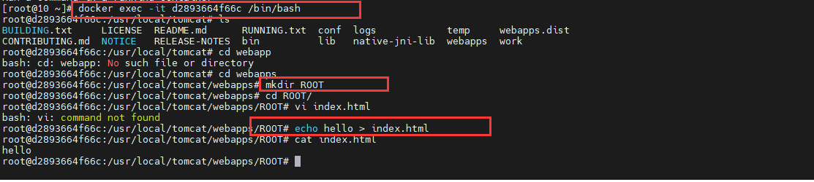

# 1.Docker的介绍和安装


## 1.1 什么是Docker

Docker是基于**Go**语言实现的云开源项目。

Docker的主要目标是Build，Ship and Run Any App,Anywhere，也就是通过对应用组件的封装、分发、部署、运行等生命周期的管理，使用户的APP（可以是一个WEB应用或数据库应用等等）及其运行环境**能够做到一次封装，到处运行。**


 Linux 容器技术的出现就解决了这样一个问题，而 Docker 就是在它的基础上发展过来的。将应用运行在 Docker 容器上面，而 Docker 容器在任何操作系统上都是一致的，这就实现了跨平台、跨服务器。只需要一次配置好环境，换到别的机子上就可以一键部署好，大大简化了操作

> 解决了运行环境和配置问题软件容器，方便做持续集成并有助于整体发布的容器虚拟化技术

## 1.2 Docker能干什么？

### 1.2.1 以前的虚拟化技术

  虚拟机（virtual machine）就是带环境安装的一种解决方案。

  它可以在一种操作系统里面运行另一种操作系统，比如在Windows 系统里面运行Linux 系统。应用程序对此毫无感知，因为虚拟机看上去跟真实系统一模一样，而对于底层系统来说，虚拟机就是一个普通文件，不需要了就删掉，对其他部分毫无影响。这类虚拟机完美的运行了另一套系统，能够使应用程序，操作系统和硬件三者之间的逻辑不变。


虚拟机的缺点：

1. 资源占用多
2. 冗余步骤多
3. 启动慢

### 1.2.2 容器虚拟化技术

由于前面虚拟机存在这些缺点，Linux 发展出了另一种虚拟化技术：**Linux 容器（Linux Containers，缩写为 LXC）。**
  
Linux 容器不是模拟一个完整的操作系统，而是对进程进行隔离。有了容器，就可以将软件运行所需的所有资源打包到一个隔离的容器中。容器与虚拟机不同，不需要捆绑一整套操作系统，只需要软件工作所需的库资源和设置。系统因此而变得高效轻量并保证部署在任何环境中的软件都能始终如一地运行。


**比较了 Docker 和传统虚拟化方式的不同之处：**

1. 传统虚拟机技术是虚拟出一套硬件后，在其上运行一个完整操作系统，在该系统上再运行所需应用进程；
2. 而容器内的应用进程直接运行于宿主的内核，容器内没有自己的内核，而且也没有进行硬件虚拟。因此容器要比传统虚拟机更为轻便。
3. 每个容器之间互相隔离，每个容器有自己的文件系统 ，容器之间进程不会相互影响，能区分计算资源。

### 1.2.3 实际的运行

Docker作为开发人员需要掌握，作为`运维人员`必须掌握。
一次构建，随处运行

1. 更快速的应用交付和部署
2. 更便捷的升级和扩缩容
3. 更简单的系统运维
4. 更高效的计算资源利用

## 1.3 相关资源

官网: http://www.docker.com

仓库: https://hub.docker.com

## 1.4 Docker安装

### 1.4.1 Docker安装的前提环境

CentOS Docker 安装
Docker支持以下的CentOS版本：
CentOS 7 (64-bit) 8
CentOS 6.5 (64-bit) 或更高的版本

前提条件
目前，CentOS 仅发行版本中的内核支持 Docker。
Docker 运行在 CentOS 7 上，要求系统为64位、系统内核版本为 3.10 以上。
Docker 运行在 CentOS-6.5 或更高的版本的 CentOS 上，要求系统为64位、系统内核版本为 2.6.32-431 或者更高版本。
查看自己的内核
uname命令用于打印当前系统相关信息（内核版本号、硬件架构、主机名称和操作系统类型等）。

### 1.4.2 Vagrant虚拟机环境

Docker安装在虚拟机上，我们可以通过VMWare来安装，但是通过VMWare安装大家经常会碰到网络ip连接问题，为了减少额外的环境因素影响，Docker内容的讲解我们会通过VirtualBox结合Vagrant来安装虚拟机

VirtualBox官网：https://www.virtualbox.org/

Vagrant官网：https://www.vagrantup.com/

Vagrant镜像仓库：https://app.vagrantup.com/boxes/search

安装VirtualBox和Vagrant，傻瓜式安装。安装完成后需要重启计算机。

在cmd命令窗口输入`vagrant` 命令弹出如下内容表示 `vagrant` 安装成功


**通过Vagrant安装虚拟机：**

* 创建一个空的目录（最好不要有中文），cmd切换到该目录中，然后执行`vagrant init centos/7` 会创建Vagrantfile文件
* 执行`vagrant up` 第一次执行的时候会远程下相关的镜像文件，并启动虚拟机。
* 连接虚拟机通过`vagrant ssh` 连接，默认的账号密码是： vagrant vagrant


执行init命令之后，会在当前目录下生成一个 Vagrantfile 文件，这个相当于执行vagrant up的配置文件

执行vagrant up之后，当前目录下回生成一个`.vagrant`的目录


**报错问题： 由于吊销服务器已脱机，吊销功能无法检查吊销**

执行vagrant up 之后，报了下面错误？


解决办法：修改 Vagrantfile 文件

在第15行 `config.vm.box = "centos/7"` 下面加上下面配置
```properties
config.vm.box_download_insecure=true
```

然后重新执行 vagrant up 命令即可


**网络配置**：

找到对应的 Vagrantfile 文件


查看当前主机给虚拟机分配的网关的网段：


**所以修改后的ip为：192.168.56.10**

**注意：修改配置之后需要重启，重新执行vagrant up 命令**

### 1.4.3 使用xshell连接


私钥地址：


### 1.4.4 Docker安装

参考官方文档安装：https://docs.docker.com/engine/install/centos/

卸载原有的环境：

```shell
 sudo yum remove docker \
                  docker-client \
                  docker-client-latest \
                  docker-common \
                  docker-latest \
                  docker-latest-logrotate \
                  docker-logrotate \
                  docker-engine
```

安装对应的依赖环境和镜像地址

```shell
 sudo yum install -y yum-utils
 sudo yum-config-manager \
    --add-repo \
    https://download.docker.com/linux/centos/docker-ce.repo
```

安装过慢设置镜像

```shell
sudo yum-config-manager \
    --add-repo \
    http://mirrors.aliyun.com/docker-ce/linux/centos/docker-ce.repo

```

直接安装docker CE

```shenll
sudo yum install docker-ce docker-ce-cli containerd.io docker-compose-plugin
```


表示安装成功

启动docker服务

启动docker服务

```shell
sudo systemctl start docker
```

查看docker的版本

```shell
[root@10 ~]# sudo docker version
Client: Docker Engine - Community
 Version:           20.10.21
 API version:       1.41
 Go version:        go1.18.7
 Git commit:        baeda1f
 Built:             Tue Oct 25 18:04:24 2022
 OS/Arch:           linux/amd64
 Context:           default
 Experimental:      true

Server: Docker Engine - Community
 Engine:
  Version:          20.10.21
  API version:      1.41 (minimum version 1.12)
  Go version:       go1.18.7
  Git commit:       3056208
  Built:            Tue Oct 25 18:02:38 2022
  OS/Arch:          linux/amd64
  Experimental:     false
 containerd:
  Version:          1.6.12
  GitCommit:        a05d175400b1145e5e6a735a6710579d181e7fb0
 runc:
  Version:          1.1.4
  GitCommit:        v1.1.4-0-g5fd4c4d
 docker-init:
  Version:          0.19.0
  GitCommit:        de40ad0
```

**补充：通过官方的镜像地址下载docker会比较慢，**

配置阿里云的镜像地址：

```shell
yum-config-manager --add-repo http://mirrors.aliyun.com/docker-ce/linux/centos/docker-ce.repo
```

yum更新下即可：

```shell
yum makecache fast
```

开机启动docker

```shell
sudo systemctl enable docker
```

## 1.5 Docker的基本组成

官方介绍：https://docs.docker.com/get-started/overview/


### 1.5.1 镜像(image)

Docker 镜像（Image）就是一个只读的模板。镜像可以用来创建 Docker 容器，一个镜像可以创建很多容器。

| docker | 面向对象 |
| :----- | :------- |
| 容器   | 对象     |
| 镜像   | 类       |

### 1.5.2 容器(container)

Docker 利用容器（Container）独立运行的一个或一组应用。容器是用镜像创建的运行实例。它可以被启动、开始、停止、删除。每个容器都是相互隔离的、保证安全的平台。可以把容器看做是一个简易版的 Linux 环境（包括root用户权限、进程空间、用户空间和网络空间等）和运行在其中的应用程序。容器的定义和镜像几乎一模一样，也是一堆层的统一视角，唯一区别在于容器的最上面那一层是可读可写的。

### 1.5.3 仓库(repository)

仓库（Repository）是集中存放镜像文件的场所。

仓库(Repository)和仓库注册服务器（Registry）是有区别的。仓库注册服务器上往往存放着多个仓库，每个仓库中又包含了多个镜像，每个镜像有不同的标签（tag）。

仓库分为公开仓库（Public）和私有仓库（Private）两种形式。

最大的公开仓库是 Docker Hub(https://hub.docker.com/)，存放了数量庞大的镜像供用户下载。国内的公开仓库包括阿里云 、网易云 等

### 1.5.4 总结

image 文件生成的容器实例，本身也是一个文件，称为镜像文件。

一个容器运行一种服务，当我们需要的时候，就可以通过docker客户端创建一个对应的运行实例，也就是我们的容器

至于仓储，就是放了一堆镜像的地方，我们可以把镜像发布到仓储中，需要的时候从仓储中拉下来就可以了。

**hello-world案例演示：**


## 1.6 阿里云镜像加速

默认访问的仓库是在国外所以访问速度是没法保证的。为了更好的体验，我们可以配置阿里云的镜像加速

https://cr.console.aliyun.com/cn-hangzhou/instances/mirrors

按照官方的提示，执行下面操作即可

```shell
sudo mkdir -p /etc/docker
sudo tee /etc/docker/daemon.json <<-'EOF'
{
  "registry-mirrors": ["https://9fgss2yh.mirror.aliyuncs.com"]
}
EOF
sudo systemctl daemon-reload
sudo systemctl restart docker
```

## 1.7 Docker卸载

```shell
systemctl stop docker
yum -y remov docker-ce
rm -rf /var/lib/docker
# 重启服务
sudo systemctl restart docker
```

# 2. Docker的常用命令

## 2.1 帮助命令


| 命令           | 说明                                       |
| -------------- | ------------------------------------------ |
| docker version | 查看docker的版本信息                       |
| docker info    | 查看docker详细的信息                       |
| docker --help  | docker的帮助命令，可以查看到相关的其他命令   |

## 2.2 镜像命令

| 镜像命令               | 说明                     |
| ---------------------- | ------------------------ |
| docker images          | 列出本地主机上的镜像     |
| docker search 镜像名称 | 从 docker hub 上搜索镜像 |
| docker pull 镜像名称   | 从docker hub 上下载镜像  |
| docker rmi 镜像名称    | 删除本地镜像             |

### 2.2.1 docker images

```shell
[root@10 ~]# docker images
REPOSITORY    TAG       IMAGE ID       CREATED         SIZE
hello-world   latest    feb5d9fea6a5   14 months ago   13.3kB
```
镜像表格信息说明

| 选项       | 说明             |
| ---------- | ---------------- |
| REPOSITORY | 表示镜像的仓库源 |
| TAG        | 镜像的标签       |
| IMAGE ID   | 镜像ID           |
| CREATED    | 镜像创建时间     |
| SIZE       | 镜像大小         |

| 参数       | 说明               |
| ---------- | ------------------ |
| -a         | 列出本地所有的镜像 |
| -q         | 只显示镜像ID       |
| --digests  | 显示镜像的摘要信息 |
| --no-trunc | 显示完整的镜像信息 |


```shell
[root@10 ~]# docker images -a
REPOSITORY    TAG       IMAGE ID       CREATED         SIZE
hello-world   latest    feb5d9fea6a5   14 months ago   13.3kB
[root@10 ~]# docker images -q
feb5d9fea6a5
[root@10 ~]# docker images -qa
feb5d9fea6a5
[root@10 ~]# docker images --digests
REPOSITORY    TAG       DIGEST                                                                                                                                                                                                      IMAGE ID       CREATED         SIZE
hello-world   latest    sha256:faa03e786c97f07ef34423fccceeec2398ec8a5759259f94d                                                                                                                                  99078f264e9d7af   feb5d9fea6a5   14 months ago   13.3kB
[root@10 ~]# docker images --no-trunc
REPOSITORY    TAG       IMAGE ID                                                                                                                                                                                                    CREATED         SIZE
hello-world   latest    sha256:feb5d9fea6a5e9606aa995e879d862b825965ba48de054caa                                                                                                                                  b5ef356dc6b3412   14 months ago   13.3kB
```

### 2.2.2 docker search

docker hub是Docker的在线仓库，我们可以通过docker search 在上面搜索我们需要的镜像


```shell
[root@10 ~]# docker search tomcat
NAME                                  DESCRIPTION                                     STARS     OFFICIAL   AUTOMATED
tomcat                                Apache Tomcat is an open source implementati…   3450      [OK]
tomee                                 Apache TomEE is an all-Apache Java EE certif…   100       [OK]
bitnami/tomcat                        Bitnami Tomcat Docker Image                     47                   [OK]
arm32v7/tomcat                        Apache Tomcat is an open source implementati…   12
arm64v8/tomcat                        Apache Tomcat is an open source implementati…   8
rightctrl/tomcat                      CentOS , Oracle Java, tomcat application ssl…   7                    [OK]
amd64/tomcat                          Apache Tomcat is an open source implementati…   6
eclipse/rdf4j-workbench               Dockerfile for Eclipse RDF4J Server and Work…   6
jelastic/tomcat                       An image of the Tomcat Java application serv…   4
oobsri/tomcat8                        Testing CI Jobs with different names.           2
cfje/tomcat-resource                  Tomcat Concourse Resource                       2
chenyufeng/tomcat-centos              tomcat基于centos6的镜像                              1                    [OK]
appsvc/tomcat                                                                         1
ppc64le/tomcat                        Apache Tomcat is an open source implementati…   1
eclipse/alpine_jdk8                   Based on Alpine 3.3. JDK 1.8, Maven 3.3.9, T…   1                    [OK]
semoss/docker-tomcat                  Tomcat, Java, Maven, and Git on top of debian   0                    [OK]
tomcatengineering/pg_backup_rotated   Clone of martianrock/pg_backup_rotated but w…   0
softwareplant/tomcat                  Tomcat images for jira-cloud testing            0                    [OK]
tomcat2111/papercut-mf                PaperCut MF Application Server                  0
tomcat0823/auto1                                                                      0
secoresearch/tomcat-varnish           Tomcat and Varnish 5.0                          0                    [OK]
misolims/miso-base                    MySQL 5.7 Database and Tomcat 8 Server neede…   0
s390x/tomcat                          Apache Tomcat is an open source implementati…   0
eclipse/hadoop-dev                    Ubuntu 14.04, Maven 3.3.9, JDK8, Tomcat 8       0                    [OK]
```


| 参数名称   | 描述                                      |
| ---------- | ----------------------------------------- |
| --no-trunc | 显示完整的描述信息                        |
| --limit    | 分页显示                                  |
| -f         | 过滤条件  docker search -f STARS=5 tomcat |


### 2.2.3 Docker pull

从Docker hub 上下载镜像文件

```shell
[root@10 ~]# docker pull tomcat
Using default tag: latest
latest: Pulling from library/tomcat
0e29546d541c: Pull complete
9b829c73b52b: Pull complete
cb5b7ae36172: Pull complete
6494e4811622: Pull complete
668f6fcc5fa5: Pull complete
dc120c3e0290: Pull complete
8f7c0eebb7b1: Pull complete
77b694f83996: Pull complete
0f611256ec3a: Pull complete
4f25def12f23: Pull complete
Digest: sha256:9dee185c3b161cdfede1f5e35e8b56ebc9de88ed3a79526939701f3537a52324
Status: Downloaded newer image for tomcat:latest
docker.io/library/tomcat:latest
```

### 2.2.4 docker rmi

| 删除方式 | 命令                               |
| -------- | ---------------------------------- |
| 删除单个 | docker rmi -f 镜像ID               |
| 删除多个 | docker rmi -f 镜像1:TAG 镜像2:TAG  |
| 删除全部 | docker rmi -f $(docker images -qa) |

-f 表示强制删除

### 2.2.5 docker save 

```shell
# 存出
# 支持参数: -o, -output string，导出镜像到指定的文件中。
docker [image] save

[root@192 dokcer]# docker save -o ubuntu_18.04.tar ubuntu:18.04
```

### 2.2.6 docker load

```shell
[root@192 dokcer]# docker load -i ubuntu_18.04.tar
或者
[root@192 dokcer]# docker load < ubuntu_18.04.tar
```

> 这将导入镜像及其相关的元数据信息（包括标签等）。导入成功后，可以使用 docker images 命令进行查看，与原镜像一致。

## 2.3 容器命令

有镜像才能创建容器。

### 2.3.1 创建并启动容器

创建并启动一个容器的命令

```shell
docker run [OPTIONS] IMAGE [COMMAND]
```

OPTIONS中的一些参数

| options | 说明                                                         |
| ------- | :----------------------------------------------------------- |
| -\-name | "容器新名字": 为容器指定一个名称                             |
| -d      | 后台运行容器，并返回容器ID，也即启动守护式容器               |
| `-i`    | `以交互模式运行容器，通常与 -t 同时使用`                     |
| `-t`    | `为容器重新分配一个伪输入终端，通常与 -i 同时使用`           |
| -P:     | 随机端口映射                                                 |
| -p      | 指定端口映射，有以下四种格式 ip:hostPort:containerPort<br>ip::containerPort<br>`hostPort:containerPort`<br>containerPort<br> |

交互式的容器

```shell
[root@10 ~]# docker run -it centos:centos7 /bin/bash
[root@a08a8f38151a /]#
```

### 2.3.2 列举运行的容器

我们要查看当前正在运行的容器有哪些，可以通过ps 命令来查看

```shell
docker ps [OPTIONS]
```

OPTONS可用的参数

| OPTIONS    | 说明                                      |
| ---------- | ----------------------------------------- |
| -a         | 列出当前所有正在运行的容器+历史上运行过的 |
| -l         | 显示最近创建的容器。                      |
| -n         | 显示最近n个创建的容器。                   |
| -q         | 静默模式，只显示容器编号。                |
| --no-trunc | 不截断输出。                              |


### 2.3.3 退出容器命令

我们启动了一个容器后，如何退出容器

| 退出方式 | 说明           |
| -------- | -------------- |
| exit     | 容器停止退出   |
| ctrl+p+q | 容器不停止退出 |

### 2.3.4 启动容器

```shell
docker start 容器ID或者容器名称
```

### 2.3.5 重启容器

```shell
docker restart 容器id或者名称
```

### 2.3.6 停止容器

```shell
docker stop 容器ID或者名称
```

还可以通过强制停止方式处理

```shell
docker kill 容器ID或者名称
```

### 2.3.7 删除容器

有时候容器使用完成就没有作用了，我们想要删除掉容器，这时可以通过rm命令

```shell
docker rm 容器ID
docker rm -f $(docker ps -qa)
docker ps -a -q | xargs docker rm
```

## 2.4 其他命令

### 2.4.1 守护式容器

```shell
docker run -d 容器名称
```

我们通过 docker ps -a 可以看到刚刚启动的容器已经退出了

为了让守护式容器能够一直执行，我们可以在启动容器后在后台运行一个循环的脚本

```shell
[root@10 ~]# docker run -d centos:centos7 /bin/bash -c 'while true;do echo hello docker;sleep 2;done'
49a059e01eec3ef8dfe4530773449f54bd1b771b7e6b80656801171c8ea7066e
[root@10 ~]#
[root@10 ~]#
[root@10 ~]# docker ps
CONTAINER ID   IMAGE            COMMAND                  CREATED         STATUS         PORTS     NAMES
49a059e01eec   centos:centos7   "/bin/bash -c 'while…"   4 seconds ago   Up 3 seconds             quirky_perlman
```

查看我们运行的日志

```shell
docker logs -t -f --tail 3 容器ID
```
- -t 是显示时间


查看容器中运行的进程

```shell
[root@10 ~]# docker top 49a059e01eec
UID                 PID                 PPID                C                   STIME               TTY                 TIME                CMD
root                3090                3072                0                   05:38               ?                   00:00:00            /bin/bash -c while true;do echo hello docker;sleep 2;done
root                3251                3090                0                   05:42               ?                   00:00:00            sleep 2
```

### 2.4.2 查看容器细节

我们想要查看容器的细节可以通过inspect命令

```shell
docker inspect 容器ID
```

### 2.4.3 进入运行的容器

| 进入方式 | 说明                                         |
| -------- | -------------------------------------------- |
| exec     | 在容器中打开新的终端,并且可以启动新的进程    |
| attach   | 直接进入容器启动命令的终端，不会启动新的进程 |

```shell
[root@10 ~]# docker exec -it 49a059e01eec /bin/bash
[root@49a059e01eec /]#

[root@10 ~]# docker attach 49a059e01eec
hello docker
hello docker
hello docker
hello docker
hello docker
...

# 退出attach界面，使用ctrl + s
```

### 2.4.4 文件复制

我们有时需要从容器中拷贝内容到宿主机中

```shell
docker cp 容器ID:容器内路径  目的地路径
```

# 3.Docker镜像文件介绍

## 3.1 镜像是什么

首先我们来看看镜像到底是什么？虽然前面有介绍过`镜像`和`容器`,但也不是特别的深入。

> 镜像是一种轻量级、可执行的独立软件包，用来打包软件运行环境和基于运行环境开发的软件，它包含运行某个软件所需的所有内容，包括代码、运行时、库、环境变量和配置文件。

### 3.1.1 UnionFS

UnionFS（联合文件系统）: Union文件系统（UnionFS）是一种分层、轻量级并且高性能的文件系统，它支持对文件系统的修改作为一次提交来一层层的叠加，同时可以将不同目录挂载到同一个虚拟文件系统下(unite several directories into a single virtual filesystem)。

Union 文件系统是 Docker 镜像的基础。镜像可以通过分层来进行继承，基于基础镜像（没有父镜像），可以制作各种具体的应用镜像。


`特性`：一次同时加载多个文件系统，但从外面看起来，只能看到一个文件系统，联合加载会把各层文件系统叠加起来，这样最终的文件系统会包含所有底层的文件和目录

### 3.1.2 镜像加载原理

Docker镜像加载原理：

Docker的镜像实际上由一层一层的文件系统组成，这种层级的文件系统UnionFS。

Bootfs(boot file system)主要包含Bootloader和Kernel, Bootloader主要是引导加载Kernel, Linux刚启动时会加载Bootfs文件系统，在Docker镜像的最底层是bootfs。这一层与我们典型的Linux/Unix系统是一样的，包含Boot加载器和内核。当boot加载完成之后整个内核就都在内存中了，此时内存的使用权已由bootfs转交给内核，此时系统也会卸载bootfs。

Rootfs (root file system) ，在Bootfs之上。包含的就是典型 Linux 系统中的 /dev, /proc, /bin, /etc 等标准目录和文件。Rootfs就是各种不同的操作系统发行版，比如Ubuntu，Centos等等。

### 3.1.3 分层的镜像

其实我们前面在 pull 文件的时候比如 Tomcat，在pull界面我们就可以看到下载的文件是一层层的。


### 3.1.4 分层结构的特点

其实我们也会考虑docker为什么会才用这种分层的结果，它有什么好处呢？最大的一个好处就是**共享资源**

比如：有多个镜像都从相同的 base 镜像构建而来，那么宿主机只需在磁盘上保存一份base镜像，同时内存中也只需加载一份 base 镜像，就可以为所有容器服务了。而且镜像的每一层都可以被共享。

## 3.2 镜像的特点

大家需要注意，Docker镜像都是只读的，当容器启动时，一个新的可写层被加载到镜像的顶部，这一层通常被称为容器层,容器层之下的都叫镜像层。

## 3.3 镜像操作

我们现在已经掌握了从docker hub上获取相关镜像，然后运行容器，并作出我们自己的处理，但有时候我们需要将我们自己的容器制作为对应的镜像，以便后面继续使用，这时我们就需要用到docker commit ...命令了，这节我们就通过案例来介绍下 docker commit ...命令的使用

```shell
docker commit -m="要提交的描述信息" -a="作者" 容器ID 要创建的目标镜像名:[标签名]
```

**操作案例**
  
我们通过tomcat镜像来创建容器后操作处理,然后将容器制作为新的镜像然后我们通过新的镜像来制作容器来演示这个效果，有点绕，我们直接通过案例来说。

### 3.3.1 下载tomcat镜像

```shell
[root@10 ~]# docker pull tomcat
```

### 3.3.2 创建容器并启动

```shell
[root@10 ~]# docker run -it -p 8888:8080 tomcat
```

参数

| 参数 | 说明                    |
| ---- | ----------------------- |
| -p   | 主机端口:docker容器端口 |
| -P   | 随机分配端口            |
| -i   | 交互                    |
| -t   | 终端                    |

打开浏览器，访问，发现是404


### 3.3.3 修改容器

我们发现启动的容器中没有要访问的资源，那么我们自己创建对应的资源即可

```shell
docker exec -it 容器ID /bin/bash
```



再次访问


### 3.3.4 创建镜像

我们现在的容器和下载的有区别了，我们可以在这个基础上来创建新的镜像

```shell
# docker commit -a='liufei' -m='add index.html' 容器ID liufei/tomcat:1.0
[root@10 ~]# docker commit -a 'liufei' -m 'add index.html' d2893664f66c liufei/tomcat:1.0
sha256:48c64e19b43e3aab8f69aeb60e7254361c9a38064d74f8eca47cb9ab370e2863
[root@10 ~]# docker images
REPOSITORY      TAG       IMAGE ID       CREATED         SIZE
liufei/tomcat   1.0       48c64e19b43e   4 seconds ago   680MB
tomcat          latest    fb5657adc892   11 months ago   680MB
hello-world     latest    feb5d9fea6a5   14 months ago   13.3kB
centos          centos7   eeb6ee3f44bd   15 months ago   204MB
```

### 3.3.5 启动新的镜像

现在我们可以通过我们自己新创建的镜像文件来创建并启动容器了。需要先关闭之前的镜像，不然重新启动会报端口被占用

```shell
docker run -it -p 8888:8080 liufei/tomcat:1.0
```

访问 http://192.168.56.10:8888/

页面直接显示 hello， 而不是404页面

# 4.Docker数据卷

## 4.1 数据卷

前面我们介绍了镜像和容器，通过镜像我们可以启动多个容器，但是我们发现当我们的容器停止获取删除后，我们在容器中的应用的一些数据也丢失了，这时为了解决容器的数据持久化，我们需要通过容器数据卷来解决这个问题

### 4.1.1 数据卷是什么

Docker容器产生的数据，如果不通过docker commit生成新的镜像，使得数据做为镜像的一部分保存下来，那么当容器删除后，数据自然也就没有了。

**为了能保存数据在docker中我们使用卷。简单来说，容器卷就相当于Redis中持久化方式的RDB和AOF。**

### 4.1.2 解决了什么问题

卷就是目录或文件，存在于一个或多个容器中，由docker挂载到容器，但不属于联合文件系统，因此能够绕过Union File System提供一些用于持续存储或共享数据的特性：
  
卷的设计目的就是数据的持久化，完全独立于容器的生存周期，因此Docker不会在容器删除时删除其挂载的数据卷

特点：

1. 数据卷可在容器之间共享或重用数据

2. 卷中的更改可以直接生效

3. 数据卷中的更改不会包含在镜像的更新中

4. 数据卷的生命周期一直持续到没有容器使用它为止

**总结：持久化，容器间继承和共享数据**

### 4.1.3 数据卷使用

#### 4.1.3.1 直接添加

运行一个centos容器

```shell
# docker run -it -v /宿主机绝对路径:/容器内目录 镜像名

docker run -it -v /root/dockerfile1:/root/dockerfile1 centos


# 在宿主机的根目录下会多出对应的文件夹
[root@10 ~]# pwd
/root
[root@10 ~]# ll
total 16
-rw-------. 1 root root 5570 Apr 30  2020 anaconda-ks.cfg
drwxr-xr-x. 2 root root   19 Dec 19 15:18 dockerfile1
-rw-------. 1 root root 5300 Apr 30  2020 original-ks.cfg


# 在容器的根目录下也会出现对应的文件夹
[root@528c9f7e69a9 ~]# pwd
/root
[root@528c9f7e69a9 ~]# ls
anaconda-ks.cfg  anaconda-post.log  dockerfile1  original-ks.cfg
[root@528c9f7e69a9 ~]#

# 通过inspect命令可以查询容器的详情
[root@10 ~]# docker inspect 528c9f7e69a9
{
  ....
  "HostConfig": {
            "Binds": [
                "/root/dockerfile1:/root/dockerfile1"
            ],
            "ContainerIDFile": "",
            "LogConfig": {
                "Type": "json-file",
                "Config": {}
            },
            "NetworkMode": "default",
            "PortBindings": {},
            "RestartPolicy": {
                "Name": "no",
                "MaximumRetryCount": 0
            },
            "AutoRemove": false,
            "VolumeDriver": 
            ...
  }
  ...
}
```

数据共享的操作

```shell
# 宿主机添加对应的文件
[root@10 dockerfile1]# vi a.txt
[root@10 dockerfile1]#
[root@10 dockerfile1]# cat a.txt
hello docker

# 容器中查看
[root@528c9f7e69a9 dockerfile1]# cat a.txt
hello docker
```

容器中可以同步看到，然后在容器中修改数据，数据同样会更新

停止掉容器后，数据依然存在

**权限控制：不允许在容器中修改**

修改权限

```shell
# ro表示只读，rw是读写，可以通过inspect查看到
docker run -it -v /宿主机绝对路径:/容器目录:ro 镜像名
```

#### 4.1.3.2 DockerFiler添加

宿主机跟目录下创建一个mydocker，并在该目录下创建一个文件dockerfile，内容如下

```shell
# volume test

FROM centos

VOLUME ["/root/dataVolumeContainer1","/root/dataVolumeContainer2"]

CMD echo "finished,--------success1"

CMD /bin/bash
```

根据这个DockerFile构建我们的镜像文件

```shell
# -f 制定dockerfile文件，如果文件名是dockefile则无需制定
docker build -f dockerFile1 -t liufei/centos .
```

- -f DockerFile文件的路径

- -t 标签  

- . 当前路径


根据新创建的镜像文件创建一个容器，启动后我们可以看到在容器中创建的有对应的目录

```shell
# 查看刚才创建的镜像
[root@10 mydocker]# docker images
REPOSITORY      TAG       IMAGE ID       CREATED         SIZE
liufei/centos   latest    bd78571da2ad   3 minutes ago   231MB

# 启动一个容器，可以看到/root目录下有两个文件夹 dataVolumeContainer1 和 dataVolumeContainer2
[root@10 mydocker]# docker run -it liufei/centos
[root@a92927abb23e /]# ls
bin  dev  etc  home  lib  lib64  lost+found  media  mnt  opt  proc  root  run  sbin  srv  sys  tmp  usr  var
[root@a92927abb23e /]# cd /root/
[root@a92927abb23e ~]# ls
anaconda-ks.cfg  anaconda-post.log  dataVolumeContainer1  dataVolumeContainer2  original-ks.cfg
[root@a92927abb23e ~]#
```

这两个目录和宿主机的映射目录在哪呢？这时我们可以通过 inspect命令查看


验证就只需要在宿主机中创建文件，然后再到容器对应的文件夹中查看即可

## 4.2 数据卷容器

命名的容器挂载数据卷，其他容器通过挂载这个容器实现数据共享，挂载数据的容器，称之为数据卷容器。


### 4.2.1 启动一个父容器

```shell
[root@10 mydocker]# docker run -it --name dc01 liufei/centos
[root@d9047807b437 /]# cd /root/dataVolumeContainer1/
[root@d9047807b437 dataVolumeContainer1]# echo hello >> a.txt
[root@d9047807b437 dataVolumeContainer1]# cat a.txt
hello
```

### 4.2.2 创建两个子容器

```shell
docker run -it --name dc02 --volumes-from dc01 liufei/centos
docker run -it --name dc03 --volumes-from dc01 liufei/centos
```

创建了两个子容器后，首先都可以看到dc01中的共享资源。第二个在dc01中修改了共享资源文件后，在两个容器中也是可见的。

**注意：删除dc01后，dc02和dc03之间数据还是共享的**

**注意：容器之间配置信息的传递，数据卷的生命周期一直持续到没有容器使用它为止。**	

# 5. Dockerfile

DockerFile是用来构建Docker镜像的`构建文件`，是由一系列`命令`和`参数`构成的`脚本`。


```shell
FROM scratch
ADD centos-7-x86_64-docker.tar.xz /

LABEL \
    org.label-schema.schema-version="1.0" \
    org.label-schema.name="CentOS Base Image" \
    org.label-schema.vendor="CentOS" \
    org.label-schema.license="GPLv2" \
    org.label-schema.build-date="20201113" \
    org.opencontainers.image.title="CentOS Base Image" \
    org.opencontainers.image.vendor="CentOS" \
    org.opencontainers.image.licenses="GPL-2.0-only" \
    org.opencontainers.image.created="2020-11-13 00:00:00+00:00"

CMD ["/bin/bash"]
```

## 5.1 DockerFile介绍

### 5.1.1. 构建过程

Dockerfile中的指令需要满足如下的规则


### 5.1.2 执行流程

docker执行一个Dockerfile脚本的流程大致如下：
1. docker从基础镜像运行一个容器
2. 执行一条指令并对容器作出修改
3. 执行类似docker commit的操作提交一个新的镜像层
4. docker再基于刚提交的镜像运行一个新的容器
5. 执行dockerfile中的下一条指令直到所有指令都执行完成

从应用软件的角度来看，Dockerfile、Docker镜像与Docker容器分别代表软件的三个不同阶段，
- Dockerfile是软件的原材料
- Docker镜像是软件的交付品
- Docker容器则可以认为是软件的运行态。
  

Dockerfile面向开发，Docker镜像成为交付标准，Docker容器则涉及部署与运维，三者缺一不可，合力充当Docker体系的基石。


1. Dockerfile，需要定义一个Dockerfile，Dockerfile定义了进程需要的一切东西。Dockerfile涉及的
内容包括执行代码或者是文件、环境变量、依赖包、运行时环境、动态链接库、操作系统的发行
版、服务进程和内核进程(当应用进程需要和系统服务和内核进程打交道，这时需要考虑如何设计
namespace的权限控制)等等;
2. Docker镜像，在用Dockerfile定义一个文件之后，docker build时会产生一个Docker镜像，当运行
Docker镜像时，会真正开始提供服务;
3. Docker容器，容器是直接提供服务的

| 指令       | 说明                                                         |
| ---------- | :----------------------------------------------------------- |
| FROM       | 基础镜像，当前新镜像是基于哪个镜像的,有继承的意味            |
| MAINTAINER | 镜像维护者的姓名和邮箱地址                                   |
| RUN        | 容器构建时需要运行的命令                                     |
| EXPOSE     | 当前容器对外暴露的端口                                       |
| WORKDIR    | 指定在创建容器后，终端默认登录的进来工作目录，一个落脚点     |
| ENV        | 用来在构建镜像过程中设置环境变量                             |
| ADD        | 将宿主机目录下的文件拷贝进镜像且ADD命令会自动处理URL和解压tar压缩包 |
| COPY       | 类似ADD，拷贝文件和目录到镜像中。<br>将从构建上下文目录中<源路径>的文件/目录复制到新的一层的镜像内的<目标路径>位置 <br> COPY src dest <br>COPY ["src","dest"] |
| VOLUME     | 容器数据卷，用于数据保存和持久化工作                         |
| CMD        | 指定一个容器启动时要运行的命令<br>Dockerfile中可以有多个CMD指令，但只有最后一个生效，CMD会被docker run之后的参数替换 |
| ENTRYPOINT | 指定一个容器启动时要运行的命令<br>ENTRYPOINT的目的和CMD一样，都是在指定容器启动程序及参数 |
| ONBUILD    | 当构建一个被继承的Dockerfile时运行命令,父镜像在被子继承后父镜像的onbuild被触发 |

```shell
RUN set -eux; \
	nativeLines="$(catalina.sh configtest 2>&1)"; \
	nativeLines="$(echo "$nativeLines" | grep 'Apache Tomcat Native')"; \
	nativeLines="$(echo "$nativeLines" | sort -u)"; \
	if ! echo "$nativeLines" | grep -E 'INFO: Loaded( APR based)? Apache Tomcat Native library' >&2; then \
		echo >&2 "$nativeLines"; \
		exit 1; \
	fi

EXPOSE 8080
CMD ["catalina.sh", "run"]

docker run -it -p 7777:8080 tomcat  ls -l

RUN set -eux; \
	nativeLines="$(catalina.sh configtest 2>&1)"; \
	nativeLines="$(echo "$nativeLines" | grep 'Apache Tomcat Native')"; \
	nativeLines="$(echo "$nativeLines" | sort -u)"; \
	if ! echo "$nativeLines" | grep -E 'INFO: Loaded( APR based)? Apache Tomcat Native library' >&2; then \
		echo >&2 "$nativeLines"; \
		exit 1; \
	fi

EXPOSE 8080
CMD ["catalina.sh", "run"]
CMD ls -l
```

DockerFile命令

| BUILD         | BOTH    | RUN        |
| ------------- | ------- | ---------- |
| FROM          | WORKDIR | CMD        |
| MAINTAINER    | USER    | ENV        |
| COPY          |         | EXPOSE     |
| ADD           |         | VOLUME     |
| RUN           |         | ENTRYPOINT |
| ONBUILD       |         |            |
| .dockerignore |         |            |

## 5.2 DockerFile案例

### 5.2.1 Base镜像

Docker Hub中99%的镜像都是通过在base镜像中安装和配置需要的软件构建出来的，如下


`scratch`相对于java中的`Object`

### 5.2.2 自定义镜像mycentos

我们从官方pull下来的 centos 镜像是mini版的，所以不带有 vim 这些基础命令，那我们就来自定义
一个镜像，功能比官方下载的强大点，同时运用下各个指令。

#### 5.2.2.1 编写

首先我们来编写对应的Dockerfile文件。内容如下

```bash
FROM centos:centos7
MAINTAINER liufei<18855993840@163.com>

ENV MYPATH /usr/local
WORKDIR $MYPATH

RUN yum -y install vim

EXPOSE 80

CMD echo $MYPATH
CMD echo "success--------------ok"
CMD /bin/bash
```

#### 5.2.2.2 构建

然后将脚本构建成对应的镜像文件。

```bash
docker build -f dockerfile名称 -t 新建的镜像名:TAG .
```

构建

```bash
[root@10 mydocker]# docker build -f dockerfile_mycentos -t liufei_centos:1.0 .

## 查看镜像
[root@10 mydocker]# docker images
REPOSITORY      TAG       IMAGE ID       CREATED              SIZE
liufei_centos   1.0       79d6f58a72e1   About a minute ago   453MB
```

#### 5.2.2.3 运行

运行镜像文件。

```bash
# docker run -it 新镜像名称:TAG
[root@10 mydocker]# docker run -it liufei_centos:1.0
[root@b2b88eea28ff local]# pwd
/usr/local
[root@b2b88eea28ff local]#
```

运行容器后，落脚点是 `/usr/local` 因为我们配置了`WORKDIR`

#### 5.2.2.4 镜像历史

查看一个镜像文件的变更历史可以使用如下命令:

```bash
docker history 镜像名
```

```shell
[root@10 mydocker]# docker history liufei_centos:1.0
IMAGE          CREATED         CREATED BY                                      SIZE      COMMENT
79d6f58a72e1   4 minutes ago   /bin/sh -c #(nop)  CMD ["/bin/sh" "-c" "/bin…   0B
0c82052f2d3d   4 minutes ago   /bin/sh -c #(nop)  CMD ["/bin/sh" "-c" "echo…   0B
838f1e1407b2   4 minutes ago   /bin/sh -c #(nop)  CMD ["/bin/sh" "-c" "echo…   0B
a6fafb95932f   4 minutes ago   /bin/sh -c #(nop)  EXPOSE 80                    0B
50867e2b288d   4 minutes ago   /bin/sh -c yum -y install vim                   249MB
b0335796c4fa   4 minutes ago   /bin/sh -c #(nop) WORKDIR /usr/local            0B
19f4232257a4   4 minutes ago   /bin/sh -c #(nop)  ENV MYPATH=/usr/local        0B
18c8c5d45831   4 minutes ago   /bin/sh -c #(nop)  MAINTAINER liufei<1885599…   0B
eeb6ee3f44bd   15 months ago   /bin/sh -c #(nop)  CMD ["/bin/bash"]            0B
<missing>      15 months ago   /bin/sh -c #(nop)  LABEL org.label-schema.sc…   0B
<missing>      15 months ago   /bin/sh -c #(nop) ADD file:b3ebbe8bd304723d4…   204MB
```

在本例中我们用到了 `FROM` `MAINTAINER` `RUN` `EXPOSE` `ENV` `WORKDIR` 命令

### 5.2.3.CMD/ENTRYPOINT案例

接下来我们通过案例来看看`CMD`和`ENTRYPOINT`两个命令的区别，这两个命令的作用都是`指定一个容器启动时要运行的命令`

#### 5.2.3.1 CMD

Dockerfile中可以有多个CMD指令，但只有最后一个生效，CMD会被docker run之后的参数替换掉，我们通过tomcat的案例来介绍。

正常情况如下

```bash
docker run -it -p 8888:8080 tomcat
```


但是当我们在 执行命令后添加参数的话，如下

```shell
[root@10 mydocker]# docker run -it -p 8888:8080 tomcat ls -l
total 132
-rw-r--r--. 1 root root 18994 Dec  2  2021 BUILDING.txt
-rw-r--r--. 1 root root  6210 Dec  2  2021 CONTRIBUTING.md
-rw-r--r--. 1 root root 60269 Dec  2  2021 LICENSE
-rw-r--r--. 1 root root  2333 Dec  2  2021 NOTICE
-rw-r--r--. 1 root root  3378 Dec  2  2021 README.md
-rw-r--r--. 1 root root  6905 Dec  2  2021 RELEASE-NOTES
-rw-r--r--. 1 root root 16517 Dec  2  2021 RUNNING.txt
drwxr-xr-x. 2 root root  4096 Dec 22  2021 bin
drwxr-xr-x. 2 root root   238 Dec  2  2021 conf
drwxr-xr-x. 2 root root  4096 Dec 22  2021 lib
drwxrwxrwx. 2 root root     6 Dec  2  2021 logs
drwxr-xr-x. 2 root root   159 Dec 22  2021 native-jni-lib
drwxrwxrwx. 2 root root    30 Dec 22  2021 temp
drwxr-xr-x. 2 root root     6 Dec 22  2021 webapps
drwxr-xr-x. 7 root root    81 Dec  2  2021 webapps.dist
drwxrwxrwx. 2 root root     6 Dec  2  2021 work
```

原因是我们先看Tomact对应的 Dockerfile文件


然而我们的run命令 把Dockerfile中的最后的CMD命令覆盖了~~

#### 5.2.3.2 ENTRYPOINT

有别于`CMD`命令，`ENTRYPOINT`命令是在 `docker run` 之后的参数会被当做参数传递给 ENTRYPOINT，之后形成新的组合命令。我们通过`curl`指令来介绍这个案例。

```dockerfile
FROM centos:centos7

RUN yum install -y curl

ENTRYPOINT [ "curl", "-s", "http://www.baidu.com" ]
```

```shell
# 构建
[root@10 mydocker]# docker build -f dockerfile2 -t myapp .

# 运行

[root@10 mydocker]# docker run -it myapp

# 加 -i 参数 查看响应报文头
[root@10 mydocker]# docker run -it myapp -i
```

通过这个例子 可以看到 ENTRYPOINT 不会覆盖，而是组合成了一个新的命令。

### 5.2.4.自定义Tomcat

最后我们通过自定义一个`tomcat`镜像来介绍下`ADD`和`COPY`这两个命令的区别。

#### 5.2.4.1 创建个tomcat目录

```shell
[root@10 ~]# cd mydocker/
[root@10 mydocker]# mkdir tomcat
[root@10 mydocker]# cd tomcat/
[root@10 tomcat]# pwd
/mydocker/tomcat
```

#### 5.2.4.2 添加一个文件

在当前目录下创建一个 `hello.txt`文件，作用是`COPY`到容器中

```shell
[root@10 tomcat]# vim hello.txt
[root@10 tomcat]#
[root@10 tomcat]# cat hello.txt
hello tomcat
[root@10 tomcat]#
```
#### 5.2.4.3 拷贝相关软件

准备对应的`jdk`和`tomcat`的压缩文件。

```shell
[root@10 tomcat]# ll
total 191520
-rw-r--r--. 1 vagrant vagrant  10595340 Dec 29 12:30 apache-tomcat-8.5.81.tar.gz
-rw-r--r--. 1 vagrant root           13 Dec 29 12:23 hello.txt
-rw-r--r--. 1 vagrant vagrant 185515842 Dec 29 12:30 jdk-8u144-linux-x64.tar.gz
```

#### 5.2.4.4 创建Dockerfile文件

创建对应的Dockerfile文件，如下：

```dockerfile
FROM         centos:centos7
MAINTAINER   liufei<18855993840@qq.com>
# 把宿主机当前上下文的hello.txt拷贝到容器/usr/local/路径下
COPY hello.txt /usr/local/hello.txt
# 把 java与tomcat添加到容器中
ADD jdk-8u144-linux-x64.tar.gz /usr/local
ADD apache-tomcat-8.5.81.tar.gz /usr/local
#安装vim编辑器
RUN yum -y install vim
#设置工作访问时候的WORKDIR路径，登录落脚点
ENV MYPATH /usr/local
WORKDIR $MYPATH
#配置java与tomcat环境变量
ENV JAVA_HOME /usr/local/jdk1.8.0_144
ENV CLASSPATH $JAVA_HOME/lib/dt.jar:$JAVA_HOME/lib/tools.jar
ENV CATALINA_HOME /usr/local/apache-tomcat-8.5.81
ENV CATALINA_BASE /usr/local/apache-tomcat-8.5.81
ENV PATH $PATH:$JAVA_HOME/bin:$CATALINA_HOME/lib:$CATALINA_HOME/bin
#容器运行时监听的端口
EXPOSE  8080
#启动时运行tomcat
# ENTRYPOINT ["/usr/local/apache-tomcat-8.0.47/bin/startup.sh" ]
# CMD ["/usr/local/apache-tomcat-8.0.47/bin/catalina.sh","run"]
CMD /usr/local/apache-tomcat-8.5.81/bin/startup.sh && tail -F /usr/local/apache-tomcat-8.5.81/logs/catalina.out
```

#### 5.2.4.5 构建

```shell
docker build -f dockerfile -t mytomcat8.5 .
```

#### 5.2.4.6 run

构建成功后，我们就可以运行了，命令如下:

```shell
docker run -it -p 9080:8080 --name mytomcat8.5 -v /root/dockerfile/tomcat/test:/usr/local/apache-tomcat-8.5.81/webapps/test -v /root/dockerfile/tomcat/tomcatlogs/:/usr/local/apache-tomcat-8.5.81/logs --privileged=true mytomcat8.5
```

注意：我们在启动的时候指定了相关的 `数据卷`


#### 5.2.4.7 验证


#### 5.2.4.8 部署web项目

既然我们已经部署好了我们自己的tomcat容器，而且也设置了对应的数据卷，那么我们来实际部署一个web案例来看看

**web.xml文件**

我们在test目录下创建`WEB-INF`目录，然后创建`web.xml`文件，

```shell
[root@10 test]# pwd
/root/dockerfile/tomcat/test
[root@10 test]# mkdir WEB-INF
[root@10 test]# cd WEB-INF/
[root@10 WEB-INF]# vim web.xml
[root@10 WEB-INF]# cat web.xml

<?xml version="1.0" encoding="UTF-8"?>

<web-app xmlns:xsi="http://www.w3.org/2001/XMLSchema-instance"

  xmlns="http://java.sun.com/xml/ns/javaee"

  xsi:schemaLocation="http://java.sun.com/xml/ns/javaee http://java.sun.com/xml/ns/javaee/web-app_2_5.xsd"

  id="WebApp_ID" version="2.5">


  <display-name>test</display-name>


</web-app>

[root@10 WEB-INF]#
```

**index.jsp文件**

然后再WEB-INF目录同级下创建一个index.jsp文件

```xml
<%@ page language="java" contentType="text/html; charset=UTF-8" pageEncoding="UTF-8"%>

<!DOCTYPE html PUBLIC "-//W3C//DTD HTML 4.01 Transitional//EN" "http://www.w3.org/TR/html4/loose.dtd">

<html>

  <head>

    <meta http-equiv="Content-Type" content="text/html; charset=UTF-8">

    <title>Insert title here</title>

  </head>

  <body>

    -----------welcome------------

    <%="i am in docker tomcat self "%>

    <br>

    <br>

    <% System.out.println("=============docker tomcat self");%>

  </body>

</html>
```

重启容器访问即可


# 6.Docker常用软件安装

## 6.1 MySQL的安装

search命令查询

```shell
[root@10 ~]# docker search mysql
NAME                            DESCRIPTION                                     STARS     OFFICIAL   AUTOMATED
mysql                           MySQL is a widely used, open-source relation…   13631     [OK]
mariadb                         MariaDB Server is a high performing open sou…   5204      [OK]
phpmyadmin                      phpMyAdmin - A web interface for MySQL and M…   714       [OK]
percona                         Percona Server is a fork of the MySQL relati…   598       [OK]
bitnami/mysql                   Bitnami MySQL Docker Image                      80                   [OK]
```

然后下载对应的mysql镜像

```shell
[root@10 ~]# docker pull mysql:5.7
```

构建容器

```shell
docker run -p 12345:3306 --name mysql -v /root/mysql/conf:/etc/mysql/conf.d -v /root/mysql/logs:/logs -v /root/mysql/data:/var/lib/mysql -e MYSQL_ROOT_PASSWORD=123456 -d mysql:5.7
```

直接docker直接连接制定MYSQL

```shell
[root@10 ~]# docker exec -it afbc18abb0f8 mysql -h localhost -uroot -p
Enter password:
Welcome to the MySQL monitor.  Commands end with ; or \g.
Your MySQL connection id is 4
Server version: 5.7.36 MySQL Community Server (GPL)

Copyright (c) 2000, 2021, Oracle and/or its affiliates.

Oracle is a registered trademark of Oracle Corporation and/or its
affiliates. Other names may be trademarks of their respective
owners.

Type 'help;' or '\h' for help. Type '\c' to clear the current input statement.

mysql> SHOW DATABASES;
+--------------------+
| Database           |
+--------------------+
| information_schema |
| mysql              |
| performance_schema |
| sys                |
+--------------------+
4 rows in set (0.00 sec)
```

我们也可以在Windows平台中通过MySQL数据库客户端来连接容器中的数据库


## 6.2 安装redis

搜索Redis

```shell
[root@10 ~]# docker search redis
NAME                                DESCRIPTION                                     STARS     OFFICIAL   AUTOMATED
redis                               Redis is an open source key-value store that…   11685     [OK]
bitnami/redis                       Bitnami Redis Docker Image                      236                  [OK]
redislabs/redisinsight              RedisInsight - The GUI for Redis                76
redislabs/redisearch                Redis With the RedisSearch module pre-loaded…   56
redislabs/rejson                    RedisJSON - Enhanced JSON data type processi…   51
```

下载对应镜像文件

```shell
[root@10 ~]# docker pull redis:6.0
```

创建并启动容器

```shell
docker run -p 6379:6379 -v /root/myredis/data:/data -v /root/myredis/conf/redis.conf:/usr/local/etc/redis/redis.conf -d redis:6.0 redis-server /usr/local/etc/redis/redis.conf --appendonly yes
```

连接命令

```shell
[root@10 ~]# docker exec -it 9aaa6b36d122 redis-cli
127.0.0.1:6379> keys *
(empty array)
127.0.0.1:6379> set name zs
OK
127.0.0.1:6379> get name
"zs"
127.0.0.1:6379>
```

redis的配置文件

```xml
port 6379
tcp-backlog 511
timeout 0
tcp-keepalive 300
supervised no
pidfile /var/run/redis_6379.pid


loglevel notice
logfile ""

databases 16

save 120 1
save 300 10
save 60 10000

stop-writes-on-bgsave-error yes
rdbcompression yes

rdbchecksum yes
dbfilename dump.rdb

dir ./
slave-serve-stale-data yes

slave-read-only yes
repl-diskless-sync no
repl-diskless-sync-delay 5
repl-disable-tcp-nodelay no

slave-priority 100


appendonly no
appendfilename "appendonly.aof"

appendfsync everysec
no-appendfsync-on-rewrite no
 
auto-aof-rewrite-percentage 100
auto-aof-rewrite-min-size 64mb


lua-time-limit 5000
slowlog-log-slower-than 10000
slowlog-max-len 128

notify-keyspace-events ""

hash-max-ziplist-entries 512
hash-max-ziplist-value 64

list-max-ziplist-size -2
list-compress-depth 0

set-max-intset-entries 512

zset-max-ziplist-entries 128
zset-max-ziplist-value 64

hll-sparse-max-bytes 3000
activerehashing yes

client-output-buffer-limit normal 0 0 0
client-output-buffer-limit slave 256mb 64mb 60
client-output-buffer-limit pubsub 32mb 8mb 60

hz 10
aof-rewrite-incremental-fsync yes
```