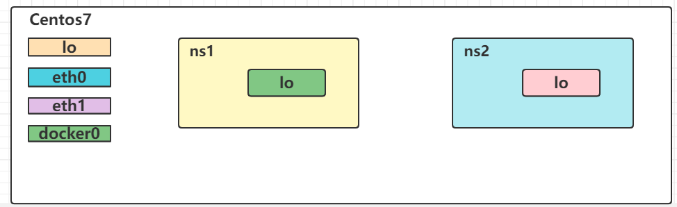
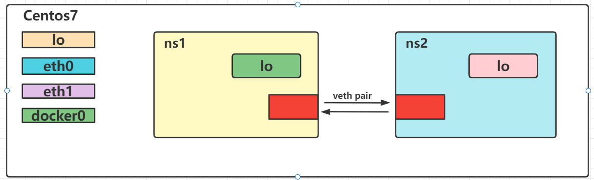
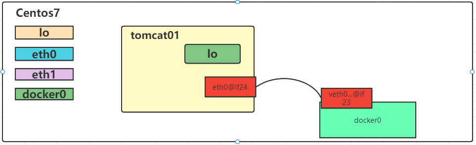

# 1. Docker网络介绍

Docker是基于Linux Kernel的namespace，CGroups,UnionFileSystem等技术封装成的一种自定义容器格式，从而提供了一套虚拟运行环境。

> namespace: 用来做隔离的，比如 pid[进程]、net【网络】、mnt【挂载点】
> 
> CGroups：Controller Groups 用来做资源限制，比如内存和CPU等
> 
> Union File Systems：用来做Image和Container分层

## 1.1 计算机网络模型

Docker网络官网：https://docs.docker.com/network/

**OSI**：开放系统互联参考模型(Open System Interconnect)

**TCP/IP**: 传输控制协议/网际协议(Transmission Control/Internet Protocol),是指能够在多个不同网络间实现信息传输的协议簇。TCP/IP协议不仅仅指的是TCP 和IP两个协议，而是指一个由FTP、SMTP、TCP、UDP、IP等协议构成的协议簇， 只是因为在TCP/IP协议中TCP协议和IP协议最具代表性，所以被称为TCP/IP协议。

分层思想：分层的基本想法是每一层都在它的下层提供的服务基础上提供更高级的增值服务，而最高层提供能运行分布式应用程序的服务


客户端发送请求：


服务端接受请求：


## 1.2 Liunx中网卡

### 1.2.1 查看网卡信息

查看网卡的命令:ip a

```shell
[root@10 ~]# ip a
1: lo: <LOOPBACK,UP,LOWER_UP> mtu 65536 qdisc noqueue state UNKNOWN group default qlen 1000
    link/loopback 00:00:00:00:00:00 brd 00:00:00:00:00:00
    inet 127.0.0.1/8 scope host lo
       valid_lft forever preferred_lft forever
    inet6 ::1/128 scope host
       valid_lft forever preferred_lft forever
2: eth0: <BROADCAST,MULTICAST,UP,LOWER_UP> mtu 1500 qdisc pfifo_fast state UP group default qlen 1000
    link/ether 52:54:00:4d:77:d3 brd ff:ff:ff:ff:ff:ff
    inet 10.0.2.15/24 brd 10.0.2.255 scope global noprefixroute dynamic eth0
       valid_lft 81352sec preferred_lft 81352sec
    inet6 fe80::5054:ff:fe4d:77d3/64 scope link
       valid_lft forever preferred_lft forever
3: eth1: <BROADCAST,MULTICAST,UP,LOWER_UP> mtu 1500 qdisc pfifo_fast state UP group default qlen 1000
    link/ether 08:00:27:7d:f2:59 brd ff:ff:ff:ff:ff:ff
    inet 192.168.56.10/24 brd 192.168.56.255 scope global noprefixroute eth1
       valid_lft forever preferred_lft forever
    inet6 fe80::a00:27ff:fe7d:f259/64 scope link
       valid_lft forever preferred_lft forever
4: docker0: <BROADCAST,MULTICAST,UP,LOWER_UP> mtu 1500 qdisc noqueue state UP group default
    link/ether 02:42:be:46:84:21 brd ff:ff:ff:ff:ff:ff
    inet 172.17.0.1/16 brd 172.17.255.255 scope global docker0
       valid_lft forever preferred_lft forever
    inet6 fe80::42:beff:fe46:8421/64 scope link
       valid_lft forever preferred_lft forever
```

通过ip a 可以看到当前的centos中有的4个网卡信息作用分别是

| 名称      | 作用                                                          |
| ------- | ----------------------------------------------------------- |
| lo      | 本地网卡【lo 是 loopback 的缩写，也就是环回的意思，linux系统默认会有一块名为 lo 的环回网络接口】 |
| eth0    | 连接网络的网卡                                                     |
| eth1    | 和宿主机通信的网卡                                                   |
| docker0 | docker的网卡                                                   |

ip link show:

```shell
[root@10 ~]# ip link show
1: lo: <LOOPBACK,UP,LOWER_UP> mtu 65536 qdisc noqueue state UNKNOWN mode DEFAULT group default qlen 1000
    link/loopback 00:00:00:00:00:00 brd 00:00:00:00:00:00
2: eth0: <BROADCAST,MULTICAST,UP,LOWER_UP> mtu 1500 qdisc pfifo_fast state UP mode DEFAULT group default qlen 1000
    link/ether 52:54:00:4d:77:d3 brd ff:ff:ff:ff:ff:ff
3: eth1: <BROADCAST,MULTICAST,UP,LOWER_UP> mtu 1500 qdisc pfifo_fast state UP mode DEFAULT group default qlen 1000
    link/ether 08:00:27:7d:f2:59 brd ff:ff:ff:ff:ff:ff
4: docker0: <BROADCAST,MULTICAST,UP,LOWER_UP> mtu 1500 qdisc noqueue state UP mode DEFAULT group default
    link/ether 02:42:be:46:84:21 brd ff:ff:ff:ff:ff:ff
```

以文件的形式查看网卡：ls /sys/class/net

```shell
[root@10 ~]# ls /sys/class/net
docker0  eth0  eth1  lo  
```

### 1.2.2 配置文件

在Linux中网卡对应的其实就是文件，所以找到对应的网卡文件即可，存放的路径

```shell
[root@10 ~]# cd /etc/sysconfig/network-scripts/
[root@10 network-scripts]# ls
ifcfg-eth0  ifdown-bnep  ifdown-isdn    ifdown-sit       ifup          ifup-ippp  ifup-plusb   ifup-sit       ifup-wireless
ifcfg-eth1  ifdown-eth   ifdown-post    ifdown-Team      ifup-aliases  ifup-ipv6  ifup-post    ifup-Team      init.ipv6-global
ifcfg-lo    ifdown-ippp  ifdown-ppp     ifdown-TeamPort  ifup-bnep     ifup-isdn  ifup-ppp     ifup-TeamPort  network-functions
ifdown      ifdown-ipv6  ifdown-routes  ifdown-tunnel    ifup-eth      ifup-plip  ifup-routes  ifup-tunnel    network-functions-ipv6
```

### 1.2.3 网卡操作

网卡中增加ip地址

```shell
[root@10 /]# ip addr add 192.168.100.120/24 dev eth0
[root@10 /]# ip a
1: lo: <LOOPBACK,UP,LOWER_UP> mtu 65536 qdisc noqueue state UNKNOWN group default qlen 1000
    link/loopback 00:00:00:00:00:00 brd 00:00:00:00:00:00
    inet 127.0.0.1/8 scope host lo
       valid_lft forever preferred_lft forever
    inet6 ::1/128 scope host
       valid_lft forever preferred_lft forever
2: eth0: <BROADCAST,MULTICAST,UP,LOWER_UP> mtu 1500 qdisc pfifo_fast state UP group default qlen 1000
    link/ether 52:54:00:4d:77:d3 brd ff:ff:ff:ff:ff:ff
    inet 10.0.2.15/24 brd 10.0.2.255 scope global noprefixroute dynamic eth0
       valid_lft 79944sec preferred_lft 79944sec
    inet 192.168.100.120/24 scope global eth0
       valid_lft forever preferred_lft forever
    inet6 fe80::5054:ff:fe4d:77d3/64 scope link
       valid_lft forever preferred_lft forever
3: eth1: <BROADCAST,MULTICAST,UP,LOWER_UP> mtu 1500 qdisc pfifo_fast state UP group default qlen 1000
    link/ether 08:00:27:7d:f2:59 brd ff:ff:ff:ff:ff:ff
    inet 192.168.56.10/24 brd 192.168.56.255 scope global noprefixroute eth1
       valid_lft forever preferred_lft forever
    inet6 fe80::a00:27ff:fe7d:f259/64 scope link
       valid_lft forever preferred_lft forever
4: docker0: <BROADCAST,MULTICAST,UP,LOWER_UP> mtu 1500 qdisc noqueue state UP group default
    link/ether 02:42:be:46:84:21 brd ff:ff:ff:ff:ff:ff
    inet 172.17.0.1/16 brd 172.17.255.255 scope global docker0
       valid_lft forever preferred_lft forever
    inet6 fe80::42:beff:fe46:8421/64 scope link
       valid_lft forever preferred_lft forever
```

删除IP地址: ip addr delete 192.168.100.120/24 dev eth0

```shell
[root@10 /]# ip addr delete 192.168.100.120/24 dev eth0
[root@10 /]# ip a
1: lo: <LOOPBACK,UP,LOWER_UP> mtu 65536 qdisc noqueue state UNKNOWN group default qlen 1000
    link/loopback 00:00:00:00:00:00 brd 00:00:00:00:00:00
    inet 127.0.0.1/8 scope host lo
       valid_lft forever preferred_lft forever
    inet6 ::1/128 scope host
       valid_lft forever preferred_lft forever
2: eth0: <BROADCAST,MULTICAST,UP,LOWER_UP> mtu 1500 qdisc pfifo_fast state UP group default qlen 1000
    link/ether 52:54:00:4d:77:d3 brd ff:ff:ff:ff:ff:ff
    inet 10.0.2.15/24 brd 10.0.2.255 scope global noprefixroute dynamic eth0
       valid_lft 79893sec preferred_lft 79893sec
    inet6 fe80::5054:ff:fe4d:77d3/64 scope link
       valid_lft forever preferred_lft forever
3: eth1: <BROADCAST,MULTICAST,UP,LOWER_UP> mtu 1500 qdisc pfifo_fast state UP group default qlen 1000
    link/ether 08:00:27:7d:f2:59 brd ff:ff:ff:ff:ff:ff
    inet 192.168.56.10/24 brd 192.168.56.255 scope global noprefixroute eth1
       valid_lft forever preferred_lft forever
    inet6 fe80::a00:27ff:fe7d:f259/64 scope link
       valid_lft forever preferred_lft forever
4: docker0: <BROADCAST,MULTICAST,UP,LOWER_UP> mtu 1500 qdisc noqueue state UP group default
    link/ether 02:42:be:46:84:21 brd ff:ff:ff:ff:ff:ff
    inet 172.17.0.1/16 brd 172.17.255.255 scope global docker0
       valid_lft forever preferred_lft forever
    inet6 fe80::42:beff:fe46:8421/64 scope link
       valid_lft forever preferred_lft forever
```

### 1.2.4 网卡信息解析

状态：UP/DOWN/UNKOWN等

link/ether：MAC地址

inet：绑定的IP地址

## 1.3 Network Namespace

Network Namespace 是实现网络虚拟化的重要功能，它能创建多个隔离的网络空间，它们有独自的网络栈信息。不管是虚拟机还是容器，运行的时候仿佛自己就在独立的网络中。

### 1.3.1 Network Namespce 实战

添加一个namespace

```shell
ip netns add ns1
```

查看当前具有的namespace

```shell
ip netns list
```

```shell
[root@localhost ~]# ip netns add ns1
[root@localhost ~]# ip netns list
ns1
```

删除namespace

```shell
ip netns delete ns1
```

```shell
[root@localhost ~]# ip netns delete ns1
[root@localhost ~]# ip netns list
[root@localhost ~]# 
```

查看namespace【ns1】的网卡情况

```shell
[root@10 ~]# ip netns exec ns1 ip a
1: lo: <LOOPBACK> mtu 65536 qdisc noop state DOWN group default qlen 1000
    link/loopback 00:00:00:00:00:00 brd 00:00:00:00:00:00
```


启动网络状态

```shell
ip netns exec ns1 ifup lo
```

```shell
[root@10 ~]# ip netns exec ns1 ifup lo
[root@10 ~]# ip netns exec ns1 ip a
1: lo: <LOOPBACK,UP,LOWER_UP> mtu 65536 qdisc noqueue state UNKNOWN group default qlen 1000
    link/loopback 00:00:00:00:00:00 brd 00:00:00:00:00:00
    inet 127.0.0.1/8 scope host lo
       valid_lft forever preferred_lft forever
    inet6 ::1/128 scope host
       valid_lft forever preferred_lft forever
```

关掉网络状态

```shell
[root@10 ~]# ip netns exec ns1 ifdown lo
[root@10 ~]# ip netns exec ns1 ip a
1: lo: <LOOPBACK> mtu 65536 qdisc noqueue state DOWN group default qlen 1000
    link/loopback 00:00:00:00:00:00 brd 00:00:00:00:00:00
```

还可以通过 link 来设置状态

```shell
[root@10 ~]# ip netns exec ns1 ip link set lo up
[root@10 ~]#
[root@10 ~]# ip netns exec ns1 ip a
1: lo: <LOOPBACK,UP,LOWER_UP> mtu 65536 qdisc noqueue state UNKNOWN group default qlen 1000
    link/loopback 00:00:00:00:00:00 brd 00:00:00:00:00:00
    inet 127.0.0.1/8 scope host lo
       valid_lft forever preferred_lft forever
    inet6 ::1/128 scope host
       valid_lft forever preferred_lft forever
[root@10 ~]# ip netns exec ns1 ip link set lo down
[root@10 ~]# ip netns exec ns1 ip a
1: lo: <LOOPBACK> mtu 65536 qdisc noqueue state DOWN group default qlen 1000
    link/loopback 00:00:00:00:00:00 brd 00:00:00:00:00:00
    inet 127.0.0.1/8 scope host lo
       valid_lft forever preferred_lft forever
```

再次添加一个namespace【ns2】

```shell
[root@localhost ~]# ip netns add ns2
[root@localhost ~]# ip netns list 
ns2
ns1
```

现在要实现两个namespace的通信



要实现两个network namespace的通信，我们需要实现到的技术是：

veth pair：Virtual Ethernet Pair，是一个成对的端口，可以实现上述功能



创建一对link，也就是接下来要通过veth pair连接的link

```shell
ip link add veth-ns1 type veth peer name veth-ns2
```

然后在宿主机中就会多出一对网卡信息


然后将创建好的 veth-ns1交给namespace1，把veth-ns2交给namespace2

```shell
[root@10 ~]# ip link set veth-ns1 netns ns1
[root@10 ~]# ip link set veth-ns2 netns ns2
```

再查看ns1和ns2中的link情况

```shell
[root@10 ~]# ip netns exec ns1 ip link
1: lo: <LOOPBACK> mtu 65536 qdisc noop state DOWN mode DEFAULT group default qlen 1000
    link/loopback 00:00:00:00:00:00 brd 00:00:00:00:00:00
6: veth-ns1@if5: <BROADCAST,MULTICAST> mtu 1500 qdisc noop state DOWN mode DEFAULT group default qlen 1000
    link/ether a6:02:8c:27:9a:e0 brd ff:ff:ff:ff:ff:ff link-netnsid 1
[root@10 ~]# ip netns exec ns2 ip link
1: lo: <LOOPBACK> mtu 65536 qdisc noop state DOWN mode DEFAULT group default qlen 1000
    link/loopback 00:00:00:00:00:00 brd 00:00:00:00:00:00
5: veth-ns2@if6: <BROADCAST,MULTICAST> mtu 1500 qdisc noop state DOWN mode DEFAULT group default qlen 1000
    link/ether ea:c8:ee:6f:cd:a4 brd ff:ff:ff:ff:ff:ff link-netnsid 0
```

此时veth-ns1和veth-ns2还没有ip地址，显然通信还缺少点条件

```shell
[root@10 ~]# ip netns exec ns1 ip addr add 192.168.0.11/24 dev veth-ns1
[root@10 ~]# ip netns exec ns2 ip addr add 192.168.0.12/24 dev veth-ns2
[root@10 ~]# ip netns exec ns1 ip a
1: lo: <LOOPBACK> mtu 65536 qdisc noop state DOWN group default qlen 1000
    link/loopback 00:00:00:00:00:00 brd 00:00:00:00:00:00
6: veth-ns1@if5: <BROADCAST,MULTICAST> mtu 1500 qdisc noop state DOWN group default qlen 1000
    link/ether a6:02:8c:27:9a:e0 brd ff:ff:ff:ff:ff:ff link-netnsid 1
    inet 192.168.0.11/24 scope global veth-ns1
       valid_lft forever preferred_lft forever
[root@10 ~]# ip netns exec ns2 ip a
1: lo: <LOOPBACK> mtu 65536 qdisc noop state DOWN group default qlen 1000
    link/loopback 00:00:00:00:00:00 brd 00:00:00:00:00:00
5: veth-ns2@if6: <BROADCAST,MULTICAST> mtu 1500 qdisc noop state DOWN group default qlen 1000
    link/ether ea:c8:ee:6f:cd:a4 brd ff:ff:ff:ff:ff:ff link-netnsid 0
    inet 192.168.0.12/24 scope global veth-ns2
       valid_lft forever preferred_lft forever
```

再次查看，发现state是DOWN.所以我们需要启用对应的网卡

```shell
[root@10 ~]# ip netns exec ns1 ip link set veth-ns1 up
[root@10 ~]# ip netns exec ns2 ip link set veth-ns2 up
```

然后查看状态

```shell
[root@10 ~]# ip netns exec ns1 ip a
1: lo: <LOOPBACK> mtu 65536 qdisc noop state DOWN group default qlen 1000
    link/loopback 00:00:00:00:00:00 brd 00:00:00:00:00:00
6: veth-ns1@if5: <BROADCAST,MULTICAST,UP,LOWER_UP> mtu 1500 qdisc noqueue state UP group default qlen 1000
    link/ether a6:02:8c:27:9a:e0 brd ff:ff:ff:ff:ff:ff link-netnsid 1
    inet 192.168.0.11/24 scope global veth-ns1
       valid_lft forever preferred_lft forever
    inet6 fe80::a402:8cff:fe27:9ae0/64 scope link
       valid_lft forever preferred_lft forever
[root@10 ~]# ip netns exec ns2 ip a
1: lo: <LOOPBACK> mtu 65536 qdisc noop state DOWN group default qlen 1000
    link/loopback 00:00:00:00:00:00 brd 00:00:00:00:00:00
5: veth-ns2@if6: <BROADCAST,MULTICAST,UP,LOWER_UP> mtu 1500 qdisc noqueue state UP group default qlen 1000
    link/ether ea:c8:ee:6f:cd:a4 brd ff:ff:ff:ff:ff:ff link-netnsid 0
    inet 192.168.0.12/24 scope global veth-ns2
       valid_lft forever preferred_lft forever
    inet6 fe80::e8c8:eeff:fe6f:cda4/64 scope link
       valid_lft forever preferred_lft forever
```

然后就可以相互之间ping通了

```shell
[root@10 ~]# ip netns exec ns1 ping 192.168.0.12
PING 192.168.0.12 (192.168.0.12) 56(84) bytes of data.
64 bytes from 192.168.0.12: icmp_seq=1 ttl=64 time=0.053 ms
64 bytes from 192.168.0.12: icmp_seq=2 ttl=64 time=0.028 ms

[root@10 ~]# ip netns exec ns2 ping 192.168.0.11
PING 192.168.0.11 (192.168.0.11) 56(84) bytes of data.
64 bytes from 192.168.0.11: icmp_seq=1 ttl=64 time=0.028 ms
64 bytes from 192.168.0.11: icmp_seq=2 ttl=64 time=0.028 ms
```

### 1.3.2 Container的NameSpace

按照上面的描述，实际上每个container，都会有自己的network namespace，并且是独立的，我们
可以进入到容器中进行验证

tomcat需要安装下ip命令，修改下dockerfile文件，加上下面这句

```dockerfile
# 安装ip命令
RUN yum -y install initscripts
```

创建两个Tomcat容器

```shell
[root@10 tomcat]# docker run -d --name tomcat01 -p 8081:8080 tomcat-ip:1.0
[root@10 tomcat]# docker run -d --name tomcat02 -p 8082:8080 tomcat-ip:1.0
```

进入到两个容器中，查看ip

```shell
[root@10 tomcat]# docker exec -it tomcat01 ip a
1: lo: <LOOPBACK,UP,LOWER_UP> mtu 65536 qdisc noqueue state UNKNOWN group default qlen 1000
    link/loopback 00:00:00:00:00:00 brd 00:00:00:00:00:00
    inet 127.0.0.1/8 scope host lo
       valid_lft forever preferred_lft forever
7: eth0@if8: <BROADCAST,MULTICAST,UP,LOWER_UP> mtu 1500 qdisc noqueue state UP group default
    link/ether 02:42:ac:11:00:02 brd ff:ff:ff:ff:ff:ff link-netnsid 0
    inet 172.17.0.2/16 brd 172.17.255.255 scope global eth0
       valid_lft forever preferred_lft forever
[root@10 tomcat]# docker exec -it tomcat02 ip a
1: lo: <LOOPBACK,UP,LOWER_UP> mtu 65536 qdisc noqueue state UNKNOWN group default qlen 1000
    link/loopback 00:00:00:00:00:00 brd 00:00:00:00:00:00
    inet 127.0.0.1/8 scope host lo
       valid_lft forever preferred_lft forever
11: eth0@if12: <BROADCAST,MULTICAST,UP,LOWER_UP> mtu 1500 qdisc noqueue state UP group default
    link/ether 02:42:ac:11:00:03 brd ff:ff:ff:ff:ff:ff link-netnsid 0
    inet 172.17.0.3/16 brd 172.17.255.255 scope global eth0
       valid_lft forever preferred_lft forever
```

相互ping是可以ping通的

```shell
[root@10 tomcat]# docker exec -it tomcat01 ping 172.17.0.3
PING 172.17.0.3 (172.17.0.3) 56(84) bytes of data.
64 bytes from 172.17.0.3: icmp_seq=1 ttl=64 time=0.053 ms
64 bytes from 172.17.0.3: icmp_seq=2 ttl=64 time=0.036 ms
64 bytes from 172.17.0.3: icmp_seq=3 ttl=64 time=0.035 ms
64 bytes from 172.17.0.3: icmp_seq=4 ttl=64 time=0.037 ms
```

问题：此时tomcat01和tomcat02属于两个network namespace，是如何能够ping通的？ 

有些小伙伴可能会想，不就跟上面的namespace实战一样吗？

注意这里并没有veth-pair技术

## 1.4 深入分析container网络-Bridge

### 1.4.1 Docker默认Bridge

首先我们通过 ip a 可以查看当前宿主机的网络情况

```shell
[root@10 tomcat]# ip a
1: lo: <LOOPBACK,UP,LOWER_UP> mtu 65536 qdisc noqueue state UNKNOWN group default qlen 1000
    link/loopback 00:00:00:00:00:00 brd 00:00:00:00:00:00
    inet 127.0.0.1/8 scope host lo
       valid_lft forever preferred_lft forever
    inet6 ::1/128 scope host
       valid_lft forever preferred_lft forever
2: eth0: <BROADCAST,MULTICAST,UP,LOWER_UP> mtu 1500 qdisc pfifo_fast state UP group default qlen 1000
    link/ether 52:54:00:4d:77:d3 brd ff:ff:ff:ff:ff:ff
    inet 10.0.2.15/24 brd 10.0.2.255 scope global noprefixroute dynamic eth0
       valid_lft 85970sec preferred_lft 85970sec
    inet6 fe80::5054:ff:fe4d:77d3/64 scope link
       valid_lft forever preferred_lft forever
3: eth1: <BROADCAST,MULTICAST,UP,LOWER_UP> mtu 1500 qdisc pfifo_fast state UP group default qlen 1000
    link/ether 08:00:27:7d:f2:59 brd ff:ff:ff:ff:ff:ff
    inet 192.168.56.10/24 brd 192.168.56.255 scope global noprefixroute eth1
       valid_lft forever preferred_lft forever
    inet6 fe80::a00:27ff:fe7d:f259/64 scope link
       valid_lft forever preferred_lft forever
4: docker0: <BROADCAST,MULTICAST,UP,LOWER_UP> mtu 1500 qdisc noqueue state UP group default
    link/ether 02:42:34:18:ed:7d brd ff:ff:ff:ff:ff:ff
    inet 172.17.0.1/16 brd 172.17.255.255 scope global docker0
       valid_lft forever preferred_lft forever
    inet6 fe80::42:34ff:fe18:ed7d/64 scope link
       valid_lft forever preferred_lft forever
8: veth52c7dcc@if7: <BROADCAST,MULTICAST,UP,LOWER_UP> mtu 1500 qdisc noqueue master docker0 state UP group default
    link/ether 12:31:50:2e:87:71 brd ff:ff:ff:ff:ff:ff link-netnsid 0
    inet6 fe80::1031:50ff:fe2e:8771/64 scope link
       valid_lft forever preferred_lft forever
12: veth3486625@if11: <BROADCAST,MULTICAST,UP,LOWER_UP> mtu 1500 qdisc noqueue master docker0 state UP group default
    link/ether 22:17:13:a5:19:db brd ff:ff:ff:ff:ff:ff link-netnsid 1
    inet6 fe80::2017:13ff:fea5:19db/64 scope link
       valid_lft forever preferred_lft forever
```

然后查看 tomcat01中的网络： docker exec -it tomcat01 ip a可以发现

```shell
[root@10 tomcat]# docker exec -it tomcat01 ip a
1: lo: <LOOPBACK,UP,LOWER_UP> mtu 65536 qdisc noqueue state UNKNOWN group default qlen 1000
    link/loopback 00:00:00:00:00:00 brd 00:00:00:00:00:00
    inet 127.0.0.1/8 scope host lo
       valid_lft forever preferred_lft forever
7: eth0@if8: <BROADCAST,MULTICAST,UP,LOWER_UP> mtu 1500 qdisc noqueue state UP group default
    link/ether 02:42:ac:11:00:02 brd ff:ff:ff:ff:ff:ff link-netnsid 0
    inet 172.17.0.2/16 brd 172.17.255.255 scope global eth0
       valid_lft forever preferred_lft forever
```

我们发现在宿主机中是可以ping通Tomcat01的网络的。

```shell
[root@10 tomcat]# ping 172.17.0.2
PING 172.17.0.2 (172.17.0.2) 56(84) bytes of data.
64 bytes from 172.17.0.2: icmp_seq=1 ttl=64 time=0.032 ms
64 bytes from 172.17.0.2: icmp_seq=2 ttl=64 time=0.029 ms
64 bytes from 172.17.0.2: icmp_seq=3 ttl=64 time=0.039 ms
64 bytes from 172.17.0.2: icmp_seq=4 ttl=64 time=0.028 ms
```

既然可以ping通，而且centos和tomcat01又属于两个不同的NetWork NameSpace，他们是怎么连接
的？看图



其实在tomcat01中有一个eth0和centos的docker0中有一个veth是成对的，类似于之前实战中的vethns1和veth-ns2,要确认也很简单

```shell
yum install bridge-utils
brctl show
```

执行

```shell
[root@10 tomcat]# brctl show
bridge name     bridge id               STP enabled     interfaces
docker0         8000.02423418ed7d       no              veth3486625
                                                        veth52c7dcc
```

对比 ip a 情况


那么画图说明：


这种网络连接方法我们称之为Bridge，其实也可以通过命令查看docker中的网络模式：docker network ls , bridge也是docker中默认的网络模式

```shell
[root@10 tomcat]# docker network ls
NETWORK ID     NAME      DRIVER    SCOPE
1e08394cc68f   bridge    bridge    local
9c649cafde9f   host      host      local
da3f7dde41cb   none      null      local
```

不妨检查一下bridge：docker network inspect bridge

```shell
[root@10 tomcat]# docker network inspect bridge
[
    {
        "Name": "bridge",
        "Id": "1e08394cc68f8a27ae7a74a30582fa9f0caff0fdd31882fb3facdafac1ca4458",
        "Created": "2023-01-01T14:29:08.568531723Z",
        "Scope": "local",
        "Driver": "bridge",
        "EnableIPv6": false,
        "IPAM": {
            "Driver": "default",
            "Options": null,
            "Config": [
                {
                    "Subnet": "172.17.0.0/16",
                    "Gateway": "172.17.0.1"
                }
            ]
        },
        "Internal": false,
        "Attachable": false,
        "Ingress": false,
        "ConfigFrom": {
            "Network": ""
        },
        "ConfigOnly": false,
        "Containers": {
            "87d7fa4497bdf35a4137d0b57f2e1883a553ec21b82200135bd3f502f14fb90a": {
                "Name": "tomcat02",
                "EndpointID": "75432c96ea7282481970f7fa5bf1be0c1977fb5f5930d748aab8d092f0ab2ec9",
                "MacAddress": "02:42:ac:11:00:03",
                "IPv4Address": "172.17.0.3/16",
                "IPv6Address": ""
            },
            "c76d031c8f416d38a7e04df5a158c733d49fed062f78571c779398c48aec9822": {
                "Name": "tomcat01",
                "EndpointID": "e8903a4c45c9a827973d99991c892a6970eeb2b2fab15d216e1e87554b4ae0ba",
                "MacAddress": "02:42:ac:11:00:02",
                "IPv4Address": "172.17.0.2/16",
                "IPv6Address": ""
            }
        },
        "Options": {
            "com.docker.network.bridge.default_bridge": "true",
            "com.docker.network.bridge.enable_icc": "true",
            "com.docker.network.bridge.enable_ip_masquerade": "true",
            "com.docker.network.bridge.host_binding_ipv4": "0.0.0.0",
            "com.docker.network.bridge.name": "docker0",
            "com.docker.network.driver.mtu": "1500"
        },
        "Labels": {}
    }
]
```

在tomcat01容器中是可以访问互联网的，顺便把这张图画一下咯，NAT是通过iptables实现的


### 1.4.2 自定义NetWork

创建一个network，类型为 Bridge

```shell
docker network create tomcat-net
或者
docker network create --subnet=172.18.0.0/24 tomcat-net

## 删除
docker network rm tomcat-net
```

查看已有的NetWork: docker network ls

```shell
[root@10 ~]# docker network ls
NETWORK ID     NAME         DRIVER    SCOPE
8f411bde2954   bridge       bridge    local
9c649cafde9f   host         host      local
da3f7dde41cb   none         null      local
b717d4cd882e   tomcat-net   bridge    local
```

查看tomcat-net详情信息：docker network inspect tomcat-net

```shell
[root@10 ~]# docker network inspect tomcat-net
[
    {
        "Name": "tomcat-net",
        "Id": "b717d4cd882e8ac0587a65dda5fe6b41cdb91129059d5629178d0d6f05af19e8",
        "Created": "2023-01-08T12:22:59.457391771Z",
        "Scope": "local",
        "Driver": "bridge",
        "EnableIPv6": false,
        "IPAM": {
            "Driver": "default",
            "Options": {},
            "Config": [
                {
                    "Subnet": "127.18.0.0/24"
                }
            ]
        },
        "Internal": false,
        "Attachable": false,
        "Ingress": false,
        "ConfigFrom": {
            "Network": ""
        },
        "ConfigOnly": false,
        "Containers": {},
        "Options": {},
        "Labels": {}
    }
]
```

创建tomcat容器，并指定使用tomcat-net

```shell
docker run -d --name custom-net-tomcat --network tomcat-net tomcat-ip:1.0
```

查看custom-net-tomcat的网络信息:截取了关键信息

```shell
12: br-70bdd126285a: <BROADCAST,MULTICAST,UP,LOWER_UP> mtu 1500 qdisc noqueue state UP group default
    link/ether 02:42:98:e7:bd:ab brd ff:ff:ff:ff:ff:ff
    inet 172.18.0.1/16 brd 172.18.255.255 scope global br-70bdd126285a
       valid_lft forever preferred_lft forever
    inet6 fe80::42:98ff:fee7:bdab/64 scope link
       valid_lft forever preferred_lft forever
14: veth0af93ef@if13: <BROADCAST,MULTICAST,UP,LOWER_UP> mtu 1500 qdisc noqueue master br-70bdd126285a state UP group default
    link/ether 02:b3:d1:f0:52:95 brd ff:ff:ff:ff:ff:ff link-netnsid 0
    inet6 fe80::b3:d1ff:fef0:5295/64 scope link
       valid_lft forever preferred_lft forever
```

查看网卡接口信息

```shell
[root@10 ~]# brctl show
bridge name     bridge id               STP enabled     interfaces
br-70bdd126285a         8000.024298e7bdab       no              veth0af93ef
docker0         8000.024293194f08       no
```

此时在custom-net-tomcat容器中ping一些tomcat01发现是ping不通的

```shell
[root@10 ~]# docker exec -it custom-net-tomcat ping 172.17.0.2
PING 172.17.0.2 (172.17.0.2) 56(84) bytes of data.
^C
--- 172.17.0.2 ping statistics ---
3 packets transmitted, 0 received, 100% packet loss, time 1999ms
```

此时如果tomcat01容器能够连接上tomcat-net上应该就可以了

```shell
# 如果取消连接，使用 disconnect
[root@10 ~]# docker network connect tomcat-net tomcat01
```

```shell
# 可以直接通过名称进行连接
[root@10 ~]# docker exec -it tomcat01 ping custom-net-tomcat
PING custom-net-tomcat (172.18.0.2) 56(84) bytes of data.
64 bytes from custom-net-tomcat.tomcat-net (172.18.0.2): icmp_seq=1 ttl=64 time=0.054 ms
64 bytes from custom-net-tomcat.tomcat-net (172.18.0.2): icmp_seq=2 ttl=64 time=0.044 ms
64 bytes from custom-net-tomcat.tomcat-net (172.18.0.2): icmp_seq=3 ttl=64 time=0.043 ms
64 bytes from custom-net-tomcat.tomcat-net (172.18.0.2): icmp_seq=4 ttl=64 time=0.042 ms
^C
--- custom-net-tomcat ping statistics ---
4 packets transmitted, 4 received, 0% packet loss, time 2999ms
rtt min/avg/max/mdev = 0.042/0.045/0.054/0.009 ms
```

再看下custom-net网卡的信息

```shell
[root@10 ~]# docker network inspect tomcat-net
[
    {
        "Name": "tomcat-net",
        "Id": "70bdd126285a0a195812457285b154f3a402a48eb7f72436fb03ac82ee86cde8",
        "Created": "2023-01-08T12:37:55.976159869Z",
        "Scope": "local",
        "Driver": "bridge",
        "EnableIPv6": false,
        "IPAM": {
            "Driver": "default",
            "Options": {},
            "Config": [
                {
                    "Subnet": "172.18.0.0/16"
                }
            ]
        },
        "Internal": false,
        "Attachable": false,
        "Ingress": false,
        "ConfigFrom": {
            "Network": ""

        },
        "ConfigOnly": false,
        "Containers": {
            "c76d031c8f416d38a7e04df5a158c733d49fed062f78571c779398c48aec9822": {
                "Name": "tomcat01",
                "EndpointID": "ebbb3344dc7c8481c9702fb0860764a9de47c8a0ca20bf307cb1d61aa57ea2bd",
                "MacAddress": "02:42:ac:12:00:03",
                "IPv4Address": "172.18.0.3/16",
                "IPv6Address": ""
            },
            "f804b933a9c26fb80493fcbbf8e7cd8bc410b4ebd2fdb48a6bed324caf88ea11": {
                "Name": "custom-net-tomcat",
                "EndpointID": "1a5cc9909cd80a4bea25acaeea39f66ff37cb485a68a29b40bee5cd0a957beb9",
                "MacAddress": "02:42:ac:12:00:02",
                "IPv4Address": "172.18.0.2/16",
                "IPv6Address": ""
            }
        },
        "Options": {},
        "Labels": {}
    }
]
```

> 其 Containers 有两个

## 1.5 深入分析 Container网络-Host&None

### 1.5.1 Host

Host模式下,容器将共享主机的网络堆栈,并且主机的所有接口都可供容器使用.容器的主机名将与主机系统上的主机名匹配

创建一个容器，并指定网络为host

```shell
[root@10 ~]# docker run -d --name my-tomcat-host --network host tomcat-ip:1.0
```

查看ip地址

```shell
[root@10 ~]# docker exec -it my-tomcat-host ip a
1: lo: <LOOPBACK,UP,LOWER_UP> mtu 65536 qdisc noqueue state UNKNOWN group default qlen 1000
    link/loopback 00:00:00:00:00:00 brd 00:00:00:00:00:00
    inet 127.0.0.1/8 scope host lo
       valid_lft forever preferred_lft forever
    inet6 ::1/128 scope host
       valid_lft forever preferred_lft forever
2: eth0: <BROADCAST,MULTICAST,UP,LOWER_UP> mtu 1500 qdisc pfifo_fast state UP group default qlen 1000
    link/ether 52:54:00:4d:77:d3 brd ff:ff:ff:ff:ff:ff
    inet 10.0.2.15/24 brd 10.0.2.255 scope global noprefixroute dynamic eth0
       valid_lft 82778sec preferred_lft 82778sec
    inet6 fe80::5054:ff:fe4d:77d3/64 scope link
       valid_lft forever preferred_lft forever
3: eth1: <BROADCAST,MULTICAST,UP,LOWER_UP> mtu 1500 qdisc pfifo_fast state UP group default qlen 1000
    link/ether 08:00:27:7d:f2:59 brd ff:ff:ff:ff:ff:ff
    inet 192.168.56.10/24 brd 192.168.56.255 scope global noprefixroute eth1
       valid_lft forever preferred_lft forever
    inet6 fe80::a00:27ff:fe7d:f259/64 scope link
       valid_lft forever preferred_lft forever
4: docker0: <BROADCAST,MULTICAST,UP,LOWER_UP> mtu 1500 qdisc noqueue state UP group default
    link/ether 02:42:93:19:4f:08 brd ff:ff:ff:ff:ff:ff
    inet 172.17.0.1/16 brd 172.17.255.255 scope global docker0
       valid_lft forever preferred_lft forever
    inet6 fe80::42:93ff:fe19:4f08/64 scope link
       valid_lft forever preferred_lft forever
12: br-70bdd126285a: <BROADCAST,MULTICAST,UP,LOWER_UP> mtu 1500 qdisc noqueue state UP group default
    link/ether 02:42:98:e7:bd:ab brd ff:ff:ff:ff:ff:ff
    inet 172.18.0.1/16 brd 172.18.255.255 scope global br-70bdd126285a
       valid_lft forever preferred_lft forever
    inet6 fe80::42:98ff:fee7:bdab/64 scope link
       valid_lft forever preferred_lft forever
14: veth0af93ef@if13: <BROADCAST,MULTICAST,UP,LOWER_UP> mtu 1500 qdisc noqueue master br-70bdd126285a state UP group default
    link/ether 02:b3:d1:f0:52:95 brd ff:ff:ff:ff:ff:ff link-netnsid 0
    inet6 fe80::b3:d1ff:fef0:5295/64 scope link
       valid_lft forever preferred_lft forever
16: veth4d71396@if15: <BROADCAST,MULTICAST,UP,LOWER_UP> mtu 1500 qdisc noqueue master docker0 state UP group default
    link/ether 96:c8:b0:f4:ff:25 brd ff:ff:ff:ff:ff:ff link-netnsid 1
    inet6 fe80::94c8:b0ff:fef4:ff25/64 scope link
       valid_lft forever preferred_lft forever
18: veth8cc0dde@if17: <BROADCAST,MULTICAST,UP,LOWER_UP> mtu 1500 qdisc noqueue master br-70bdd126285a state UP group default
    link/ether 3e:a9:70:0e:22:d9 brd ff:ff:ff:ff:ff:ff link-netnsid 1
    inet6 fe80::3ca9:70ff:fe0e:22d9/64 scope link
       valid_lft forever preferred_lft forever
```

**可以看到其网卡信息，跟主机的网卡信息是一样的。这种网卡一般不用，正常我们使用docker就是为了隔离的。如果使用Host，网卡信息就不独立了**

检查host网络

```shell
[root@10 ~]# docker network inspect host
# 截图部分内容
...
 "Containers": {
            "1cbcb772f06d885aaed6900f0af90f65421979c87e096103c1bc28695f2a0e2d": {
                "Name": "my-tomcat-host",
                "EndpointID": "d365ced6d98bf08cd552439a5b1545b0f67b122fa64c15e85fc7083ab80b2bb0",
                "MacAddress": "",
                "IPv4Address": "",
                "IPv6Address": ""
            }
        },

...
```

**可以看到其 MacAddress 和  IPv4Address 都是空**

### 1.5.2 None

None模式不会为容器配置任何IP,也不能访问外部网络以及其他容器.它具有环回地址,可用于运行批处理作业.

创建一个tomcat容器，并指定网络为none

```shell
[root@10 ~]# docker run -d --name my-tomcat-none --network none tomcat-ip:1.0
```

查看ip地址

```shell
[root@10 ~]# docker exec -it my-tomcat-none ip a
1: lo: <LOOPBACK,UP,LOWER_UP> mtu 65536 qdisc noqueue state UNKNOWN group default qlen 1000
    link/loopback 00:00:00:00:00:00 brd 00:00:00:00:00:00
    inet 127.0.0.1/8 scope host lo
       valid_lft forever preferred_lft forever
```

检查none网络

docker network inspect none

截图部分内容

```json
 "Containers": {
        "6926c07e495c95f568de09c8031295e515161df1b273772cd6ee55c30631bd7d": {
            "Name": "my-tomcat-none",
            "EndpointID": "a150480c0e45bf868d15b4059bcefacd4947b6709357a19e38e34c090b0fa1c1",
            "MacAddress": "",
            "IPv4Address": "",
            "IPv6Address": ""
        }
    },
```

## 1.6 端口映射

创建一个tomcat容器，名称为port-tomcat

```shell
docker run -d --name port-tomcat tomcat-ip:1.0
```

思考如何访问tomcat的服务

```shell
# 进入容器内进行访问
docker exec -it port-tomcat bash
curl localhost:8080
```

如果要在centos7上访问呢

```shell
[root@10 ~]# docker exec -it port-tomcat ip a
1: lo: <LOOPBACK,UP,LOWER_UP> mtu 65536 qdisc noqueue state UNKNOWN group default qlen 1000
    link/loopback 00:00:00:00:00:00 brd 00:00:00:00:00:00
    inet 127.0.0.1/8 scope host lo
       valid_lft forever preferred_lft forever
19: eth0@if20: <BROADCAST,MULTICAST,UP,LOWER_UP> mtu 1500 qdisc noqueue state UP group default
    link/ether 02:42:ac:11:00:02 brd ff:ff:ff:ff:ff:ff link-netnsid 0
    inet 172.17.0.2/16 brd 172.17.255.255 scope global eth0
       valid_lft forever preferred_lft forever
[root@10 ~]# curl 172.17.0.2:8080
```

如果我们需要在centos中通过localhost来访问呢?这时我们就需要将port-tomcat中的8080端口映射到centos上了

```shell
# 使用 -p 增加端口映射
docker rm -f port-tomcat
docker run -d --name port-tomcat -p 8090:8080 tomcat-ip:1.0
curl localhost:8090
```

centos7是运行在win10上的虚拟机，如果想要在win10上通过ip:port方式访问呢？

```shell
#此时需要centos和win网络在同一个网段，所以在Vagrantfile文件中

#这种方式等同于桥接网络。也可以给该网络指定使用物理机哪一块网卡，比如
#config.vm.network"public_network",:bridge=>'en1: Wi-Fi (AirPort)' 
config.vm.network"public_network"

centos7: ip a    --->192.168.8.118 
win10:浏览器访问        192.168.8.118:9080
```


## 1.7 多机之间通信

具体深入介绍会在 Docker Swarm 中详聊，本节简单介绍。

在同一台centos7机器上，发现无论怎么折腾，我们一定有办法让两个container通信。 那如果是在两台centos7机器上呢？画个图


VXLAN技术实现：Virtual Extensible LAN(虚拟可扩展局域网)。


# 2. Docker实战

## 2.1 Mysql集群搭建

### 2.1.1 拉取镜像

```shell
docker pull percona/percona-xtradb-cluster:5.7.21
```

### 2.1.2 复制pxc镜像【重命名】

```shell
# 名字太长了，重命名下
docker tag percona/percona-xtradb-cluster:5.7.21 pxc
```

### 2.1.3 删除原来的镜像

```shell
docker rmi percona/percona-xtradb-cluster:5.7.21
```

### 2.1.4 创建网段

```shell
# 创建单独的网段，给MySQL数据库集群使用
docker network create --subnet=172.20.0.0/24 pxc-net
docker network inspect pxc-net # 查看详情
docker network rm pxc-net # 删除网段
```

### 2.1.5 创建和删除volume

```shell
docker volume create --name v1 # 创建 volume
docker volume rm v1 # 删除volume
docker volume inspect v1 # 查看详情
```

### 2.1.6 搭建pxc集群

准备三个数据卷

```shell
docker volume create --name v1
docker volume create --name v2
docker volume create --name v3
```

运行3个PXC容器

 [CLUSTER_NAME PXC集群名字]

 [EXTRABACKUP_PASSWORD 数据库同步需要用到的密码] 

 [--privileged 为了让容器中的用户与宿主机一样拥有特权，类似于root用户的权限] 

创建第一个节点

```shell
docker run -d -p 3301:3306 -v v1:/var/lib/mysql -e MYSQL_ROOT_PASSWORD=123456 -e CLUSTER_NAME=PXC -e EXTRABACKUP_PASSWORD=123456 --privileged --name=mysql_node1 --net=pxc-net --ip 172.20.0.2 pxc
```

创建第二个和第三个节点: 注意  `-e CLUSTER_JOIN=mysql_node1`

```shell
docker run -d -p 3302:3306 -v v2:/var/lib/mysql -e MYSQL_ROOT_PASSWORD=123456 -e CLUSTER_NAME=PXC -e EXTRABACKUP_PASSWORD=123456 -e CLUSTER_JOIN=mysql_node1 --privileged --name=mysql_node2 --net=pxc-net --ip 172.20.0.3 pxc
```

```shell
docker run -d -p 3303:3306 -v v3:/var/lib/mysql -e MYSQL_ROOT_PASSWORD=123456 -e CLUSTER_NAME=PXC -e EXTRABACKUP_PASSWORD=123456 -e CLUSTER_JOIN=mysql_node1 --privileged --name=mysql_node3 --net=pxc-net --ip 172.20.0.4 pxc
```

### 2.1.7 验证

自己测试下，连接三个数据库，随便在其中一个修改，其他两个都会同步

### 2.1.8 Mysql集群和主从的区别

集群最大的优点就是数据实时同步，高可用，每个节点的数据都是同步一致的，不像主从，有时会出现数据不一致，而高可用，任何一个节点宕机都不会影响业务。

但是缺点就是性能，写的性能，每次写操作，都会在所有节点之间进行同步，有失有得，损失了一点性能，保证了高可用和数据一致。

参考文章：[mysql集群和主从的区别-mysql教程-PHP中文网](https://www.php.cn/mysql-tutorials-418480.html#:~:text=mysql集群和主从的区别. mysql中集群和主从的区别：主从之间是通过mysql的replication来保证数据的一致性；相对mysql集群的数据同步方式来讲是异步的。. 因为异步，所以主从之间复制数据可能会有一点微小的延时，就会出现不一致。. 推荐课程：,MySQL教程 。. 主从之间是通过mysql的replication来保证数据的一致性。. 相对mysql cluster的数据同步方式来讲是异步的。.)

## 2.2 负载均衡服务器搭建（HaProxy）

上面搭建了MySQL集群，现在我们再搭建下负载均衡，来访问MySQL集群


### 2.2.1 拉取镜像

```shell
docker pull haproxy
```

### 2.2.2  创建haproxy的配置文件

```shell
touch /tmp/haproxy/haproxy.cfg
```

配置文件中的内容

```shell
global
	#工作目录，这边要和创建容器指定的目录对应
	# chroot /usr/local/etc/haproxy
	#日志文件
	log 127.0.0.1 local5 info
	#守护进程运行
	daemon

defaults
	log	global
	mode	http
	#日志格式
	option	httplog
	#日志中不记录负载均衡的心跳检测记录
	option	dontlognull
 	#连接超时（毫秒）
	timeout connect 5000
 	#客户端超时（毫秒）
	timeout client  50000
	#服务器超时（毫秒）
 	timeout server  50000

    #监控界面	
    listen  admin_stats
	#监控界面的访问的IP和端口
	bind  0.0.0.0:8888
	#访问协议
 	mode        http
	#URI相对地址
 	stats uri   /dbs_monitor
	#统计报告格式
 	stats realm     Global\ statistics
	#登陆帐户信息
 	stats auth  admin:admin
	#数据库负载均衡
	listen  proxy-mysql
	#访问的IP和端口，haproxy开发的端口为3306
 	#假如有人访问haproxy的3306端口，则将请求转发给下面的数据库实例
	bind  0.0.0.0:3306  
 	#网络协议
	mode  tcp
	#负载均衡算法（轮询算法）
	#轮询算法：roundrobin
	#权重算法：static-rr
	#最少连接算法：leastconn
	#请求源IP算法：source 
 	balance  roundrobin
	#日志格式
 	option  tcplog
	#在MySQL中创建一个没有权限的haproxy用户，密码为空。
	#Haproxy使用这个账户对MySQL数据库心跳检测
 	option  mysql-check user haproxy
	server  MySQL_1 172.20.0.2:3306 check weight 1 maxconn 2000  
 	server  MySQL_2 172.20.0.3:3306 check weight 1 maxconn 2000  
	server  MySQL_3 172.20.0.4:3306 check weight 1 maxconn 2000 
	#使用keepalive检测死链
 	option  tcpka
```

### 2.2.3 创建haproxy容器

```shell
docker run -d -p 8888:8888 -p 3306:3306 -v /tmp/haproxy:/usr/local/etc/haproxy --name haproxy01 --privileged --net=pxc-net haproxy
```

### 2.2.4 访问

http://192.168.56.10:8888/dbs_monitor


此时访问，状态都是DOWN

这是因为haproxy有个心跳检查，mysql需要给haproxy的账号授权

**在MySQL数据库上创建用户，用于心跳检测**

```mysql
# 在一个集群节点执行下就行了，其他节点会自动同步生效的
CREATE USER 'haproxy'@'%' IDENTIFIED BY '';
```

### 2.4.5 客户端连接下

```
ip:centos_ip
port:3306
user:root
password:123456
```

此时我们再这个地址连接的数据库上操作，haproxy会通过负载均衡策略到达三个集群节点的其中一个去执行，然后其他节点通过mysql集群的同步方式去同步数据。

## 2.3 Spring项目部署

实际的项目部署情况应该是这样的。


接下来我们就在MySQL集群环境的基础上来完成一个SpringBoot项目的集群部署操作。网络地址分配 为：


### 2.3.1 创建对应的网络

```shell
docker network create --subnet=172.24.0.0/24 sbm-net
```

### 2.3.2 创建SpringBoot项目

项目地址：[spring-boot-docker-demo: 简单的一个springBoot程序，访问数据库，是学习docker，搭建个demo项目 - Gitee.com](https://gitee.com/fy99/spring-boot-docker-demo/tree/20230115-learning-docker-deploy/)

通过SpringBoot项目整合MyBatis实现CRUD操作， 

属性文件中配置的jdbc信息为

```properties
server.port=8080
server.tomcat.uri-encoding=UTF-8

spring.jackson.date-format=yyyy-MM-dd HH:mm:ss
spring.jackson.time-zone=GMT+8

# 自从SpringBoot2.6.0开始，Spring默认路径匹配策略从ANT_PATH_MATCHER改成PATH_PATTERN_PARSER
spring.mvc.pathmatch.matching-strategy=ANT_PATH_MATCHER

spring.datasource.driver-class-name=com.mysql.jdbc.Driver
spring.datasource.url=jdbc:mysql://192.168.56.10:3306/haproxy_test?useSSL=false&useUnicode=true&characterEncoding=utf-8&serverTimezone=Asia/Shanghai
spring.datasource.username=root
spring.datasource.password=123456
```

### 2.3.3 打成jar包

对应的项目打成jar包，并上传到centos7中目录放在 /tmp/springboot/ 下 然后创建Dockerfile文件

```shell
# 如果使用的是xshell，可以直接将jar包拖到屏幕输入命令的窗口，安装下面命令就行
yum install -y lrzsz
```

在/tmp/springboot/目录下创建dockerfiler文件

```dockerfile
FROM openjdk:8
MAINTAINER liufei
LABEL name="springboot-mybatis" version="1.0" author="liufei"
COPY spring-boot-docker-demo-1.0.jar springboot-mybatis.jar
CMD ["java","-jar","springboot-mybatis.jar"]
```

### 2.3.4 基于Dockerfile构建镜像

```shell
# 在/tmp/springboot/目录下执行
docker build -t sbm-image .
```

### 2.3.5 基于image创建container

```shell
docker run -d --name sb01 -p 8081:8080 --net=sbm-net --ip 172.24.0.11 sbm-image
```

### 2.3.6 查看启动日志

```shell
docker logs sb01
```

### 2.3.7 浏览器访问测试

http://192.168.56.10:8081/user/query

### 2.3.8 创建多个容器

```shell
docker run -d --name sb01 -p 8081:8080 --net=sbm-net --ip 172.24.0.11 sbm-image
docker run -d --name sb02 -p 8082:8080 --net=sbm-net --ip 172.24.0.12 sbm-image
docker run -d --name sb03 -p 8083:8080 --net=sbm-net --ip 172.24.0.13 sbm-image
```

### 2.4.9 Nginx安装

我们通过Nginx来实现负载均衡服务 

在centos的/tmp/nginx下新建nginx.conf文件，并进行相应的配置

```shell
user nginx;
worker_processes  1;
events {
    worker_connections  1024;
}
http {
    include       /etc/nginx/mime.types;
    default_type  application/octet-stream;
    sendfile        on;
    keepalive_timeout  65; 

   
    server {
        listen 80;
        location / {
         proxy_pass http://balance;
        }
    }
    
    upstream balance{  
        server 172.24.0.11:8080;
        server 172.24.0.12:8080;
        server 172.24.0.13:8080;
    }
    include /etc/nginx/conf.d/*.conf;
}
```

创建容器

```shell
docker run -d --name my-nginx -p 80:80 -v /tmp/nginx/nginx.conf:/etc/nginx/nginx.conf --network=sbm-net --ip 172.24.0.20 nginx
```

搞定，此时可以通过nginx访问springBoot服务

http://192.168.56.10/user/query

# 3. DockerCompose

## 3.1 DockerCompose介绍

Compose 是用于定义和运行多容器 Docker 应用程序的工具。通过 Compose，您可以使用 YML 文 件来配置应用程序需要的所有服务。然后，使用一个命令，就可以从 YML 文件配置中创建并启动所有服务。

一键启动所有服务

**DockerCompose的使用步骤：**

- 创建对应的DockerFile文件
- 创建yml文件，在yml文件中编排我们的服务
- 通过 `docker-compose up` 命令 一键运行我们的容器

## 3.2 Compose安装

官网地址：https://docs.docker.com/compose

安装地址：https://docs.docker.com/compose/install/linux/

```shell
sudo curl -L "https://github.com/docker/compose/releases/download/1.29.2/docker-compose-$(uname -s)-$(uname -m)" -o /usr/local/bin/docker-compose
```

速度比较慢的话使用下面的地址：

```shell
curl -L https://get.daocloud.io/docker/compose/releases/download/1.25.0/docker-compose-`uname -s`-`uname -m` > /usr/local/bin/docker-compose
```

修改文件夹权限

```shell
chmod +x /usr/local/bin/docker-compose
```

建立软连接

```shell
ln -s /usr/local/bin/docker-compose /usr/bin/docker-compose
```

校验是否安装成功

```shell
docker-compose --version
```

## 3.3 Compose初体验

通过官方案例来演示：https://docs.docker.com/compose/gettingstarted/

创建对应的目录

```shell
 mkdir /tmp/composetest
 cd composetest
```

**创建Python文件 app.py**

```python
import time

import redis
from flask import Flask

app = Flask(__name__)
cache = redis.Redis(host='redis', port=6379)

def get_hit_count():
    retries = 5
    while True:
        try:
            return cache.incr('hits')
        except redis.exceptions.ConnectionError as exc:
            if retries == 0:
                raise exc
            retries -= 1
            time.sleep(0.5)

@app.route('/')
def hello():
    count = get_hit_count()
    return 'Hello World! I have been seen {} times.\n'.format(count)
```

在同级目录下创建`requirements.txt`文件

```txt
flask
redis
```

然后创建对应的Dockerfile文件

```dockerfile
# syntax=docker/dockerfile:1
FROM python:3.7-alpine
WORKDIR /code
ENV FLASK_APP=app.py
ENV FLASK_RUN_HOST=0.0.0.0
RUN apk add --no-cache gcc musl-dev linux-headers
COPY requirements.txt requirements.txt
RUN pip install -r requirements.txt
EXPOSE 5000
COPY . .
CMD ["flask", "run"]
```

然后创建核心的 yml文件`docker-compose.yml`

```yml
version: "3.3"
services:
  web:
    build: .
    ports:
      - "5000:5000"
  redis:
    image: "redis:alpine"
```

最终通过`docker-compose up`命令来启动容器


启动时间比较久，耐心等待即可 

测试访问：


如果要退出服务 `Ctrl+c` 或者 `docker-compose down`

## 3.4 Compose配置规则

docker-compse.yml核心 

官网地址：https://docs.docker.com/compose/compose-file/compose-file-v3/

```yml
version: '' # 版本
servers:  # 服务
  服务1: web
     # 服务的配置
     build
     network
     images
  服务2: redis
  服务3:
  服务4:
  ...
# 其他配置 网络，全局的规则 数据卷
volumes:
configs:
networks:
```

## 3.5 Compose一键部署实战

### 3.5.1 一键部署WP博客

官方文档：https://docs.docker.com/compose/samples-for-compose/

https://github.com/docker/awesome-compose/tree/master/official-documentation-samples/wordpress/README.md

1> 创建my_wordpress目录

```shell
mkdir /tmp/my_wordpress
```

2>创建yml文件docker-compose.yml

```yml
version: "3.3"
    
services:
  db:
    image: mysql:5.7
    volumes:
      - db_data:/var/lib/mysql
    restart: always
    environment:
      MYSQL_ROOT_PASSWORD: somewordpress
      MYSQL_DATABASE: wordpress
      MYSQL_USER: wordpress
      MYSQL_PASSWORD: wordpress
    
  wordpress:
    depends_on:
      - db
    image: wordpress:latest
    volumes:
      - wordpress_data:/var/www/html
    ports:
      - "8000:80"
    restart: always
    environment:
      WORDPRESS_DB_HOST: db:3306
      WORDPRESS_DB_USER: wordpress
      WORDPRESS_DB_PASSWORD: wordpress
      WORDPRESS_DB_NAME: wordpress
volumes:
  db_data: {}
  wordpress_data: {}
```

3>通过up命令启动

```shell
docker-compose up -d
```

4>测试地址

http://192.168.56.10:8000/wp-admin/index.php


### 3.5.2 部署一个SpringBoot项目


## 3.6 Compose常见操作

(1)  查看版本

```shell
docker-compose version
```

(2) 根据yml创建service

```shell
docker-compose up
指定yaml：docker-compose up -f xxx.yaml
后台运行：docker-compose up -d
```

(3) 查看启动成功的service

```shell
# 需要指定docker-compose.yaml
docker-compose ps
也可以使用docker ps

# eg
[root@10 composetest]# ll
total 16
-rw-r--r--. 1 root root 515 Jan 17 14:29 app.py
-rw-r--r--. 1 root root 112 Jan 17 14:33 docker-compose.yml
-rw-r--r--. 1 root root 281 Jan 17 14:30 Dockerfile
-rw-r--r--. 1 root root  12 Jan 17 14:30 requirements.txt
[root@10 composetest]# docker-compose ps
       Name                      Command                State                      Ports
----------------------------------------------------------------------------------------------------------
composetest_redis_1   docker-entrypoint.sh redis ...   Exit 255   6379/tcp
composetest_web_1     flask run                        Exit 255   0.0.0.0:5000->5000/tcp,:::5000->5000/tcp
```

(4) 查看images

```shell
# 查看images
docker-compose images
```

(5) 停止/启动service

```
docker-compose stop/start
```

(6) 删除service【**同时会删除掉network和volume**】

```shell
docker-compose down
```

(7) 进入到某个service

```shell
docker-compose exec redis sh
```

## 3.7 scale扩缩容

```shell
# 启动的时候指定副本数量
docker-compose up --scale web=5 -d
```

小结：docker-compose 

工程-->服务-->容器

```yaml
version:
services:
  服务1:
  服务2:
  服务3:
```

# 4.Harbor

镜像私服仓库

## 4.1 Docker hub

官网地址：hub.docker.com

(1) 在docker机器上登录

docker login

(2) 输入用户名和密码


(3) docker push liufei96/tomcat-ip

【注意镜像名称要和docker id一致，不然push不成功】

(4) 给image重命名，并删除掉原来的

```shell
docker tag tomcat-ip:1.0 liufei96/tomcat-ip:1.0
# 删不删都行
docker rmi -f tomcat-ip
```

(5) 再次推送，刷新hub.docker.com后台，发现成功


(6) 别人下载，并且运行 

```shell
docker pull liufei96/tomcat-ip:1.0 
docker run -d --name user01 -p 6661:8080 liufei96/tomcat-ip:1.0
```


服务上传和下载比较耗时

## 4.2 阿里云Docker Registry

仓库地址：https://cr.console.aliyun.com/cn-hangzhou/instances/repositories

登录阿里云，进入到镜像服务，创建命名空间


创建镜像仓库（创建本地仓库）


将镜像推送到阿里云镜像仓库

阿里云官方文档：https://cr.console.aliyun.com/repository/cn-hangzhou/liufei96/liufei/details

```shell
# 如果之前有登录，先使用logout 推出登录
$ docker logout
Removing login credentials for https://index.docker.io/v1/


$ docker login --username=18855993840 registry.cn-hangzhou.aliyuncs.com
$ docker tag [ImageId] registry.cn-hangzhou.aliyuncs.com/liufei96/liufei:[镜像版本号]
$ docker push registry.cn-hangzhou.aliyuncs.com/liufei96/liufei:[镜像版本号]
```


**注意：这个镜像密码，不是阿里云账号密码。需要单独取访问凭证里面设置镜像仓库密码**


**push成功之后，可在这个页面查看**


**我们pull镜像的步骤**

```shell
$ docker pull registry.cn-hangzhou.aliyuncs.com/liufei96/tomcat-ip:1.0
```

## 4.3 私服Harbor

### 4.3.1 Harbor简介

Docker容器应用的开发和运行离不开可靠的镜像管理，虽然Docker官方也提供了公共的镜像仓库， 但是从安全和效率等方面考虑，部署我们私有环境内的Registry也是非常必要的。

Harbor是由VMware 公司开源的企业级的Docker Registry管理项目，它包括权限管理(RBAC)、LDAP、日志审核、管理界 面、自我注册、镜像复制和中文支持等功能。

### 4.3.2 功能介绍

| 组件               | 功能                                      |
| ------------------ | ----------------------------------------- |
| harbor-adminserver | 配置管理中心                              |
| harbor-db          | Mysql数据库                               |
| harbor-jobservice  | 负责镜像复制                              |
| harbor-log         | 记录操作日志                              |
| harbor-ui          | Web管理页面和API                          |
| nginx              | 前端代理，负责前端页面和镜像上传/下载转发 |
| redis              | 会话                                      |
| registry           | 镜像存储                                  |

### 4.3.3 Harbor安装

官网安装教程：https://goharbor.io/docs/2.3.0/install-config/ 

首先需要下载对于的安装文件：https://github.com/goharbor/harbor/releases 

因为比较大，从官网下载很慢，所以会在附件中直接给大家提供，使用2.3.3版本

**1> 上传解压安装文件**

```shell
cd /usr/local/

## 解压
tar -xvf harbor-offline-installer-v2.3.3.tgz
```


**2 > 修改配置文件**

把 harbor.yml.tmpl 修改为 harbor.yml 文件

```shell
[root@10 local]# cd harbor/
[root@10 harbor]# ll
total 610344
-rw-r--r--. 1 root root      3361 Sep 24  2021 common.sh
-rw-r--r--. 1 root root 624956679 Sep 24  2021 harbor.v2.3.3.tar.gz
-rw-r--r--. 1 root root      7840 Sep 24  2021 harbor.yml.tmpl
-rwxr-xr-x. 1 root root      2500 Sep 24  2021 install.sh
-rw-r--r--. 1 root root     11347 Sep 24  2021 LICENSE
-rwxr-xr-x. 1 root root      1881 Sep 24  2021 prepare
[root@10 harbor]# mv harbor.yml.tmpl harbor.yml
```

```yaml

# Configuration file of Harbor

# The IP address or hostname to access admin UI and registry service.
# DO NOT use localhost or 127.0.0.1, because Harbor needs to be accessed by external clients.
hostname: 192.168.56.10

# http related config
http:
  # port for http, default is 80. If https enabled, this port will redirect to https port
  port: 80

# https related config
https:
  # https port for harbor, default is 443
  port: 443
  # The path of cert and key files for nginx
  certificate: /data/cert/192.168.56.10.crt
  private_key: /data/cert/192.168.56.10.key

# # Uncomment following will enable tls communication between all harbor components
# internal_tls:
#   # set enabled to true means internal tls is enabled
#   enabled: true
#   # put your cert and key files on dir
#   dir: /etc/harbor/tls/internal

# Uncomment external_url if you want to enable external proxy
# And when it enabled the hostname will no longer used
external_url: https://192.168.56.10

# The initial password of Harbor admin
# It only works in first time to install harbor
# Remember Change the admin password from UI after launching Harbor.
harbor_admin_password: Harbor12345

# Harbor DB configuration
database:
  # The password for the root user of Harbor DB. Change this before any production use.
  password: root123
  # The maximum number of connections in the idle connection pool. If it <=0, no idle connections are retained.
  max_idle_conns: 100
  # The maximum number of open connections to the database. If it <= 0, then there is no limit on the number of open connections.
  # Note: the default number of connections is 1024 for postgres of harbor.
  max_open_conns: 900

# The default data volume
data_volume: /data/harbor
clair:
  updaters_interval: 12

# Harbor Storage settings by default is using /data dir on local filesystem
# Uncomment storage_service setting If you want to using external storage
# storage_service:
#   # ca_bundle is the path to the custom root ca certificate, which will be injected into the truststore
#   # of registry's and chart repository's containers.  This is usually needed when the user hosts a internal storage with self signed certificate.
#   ca_bundle:

#   # storage backend, default is filesystem, options include filesystem, azure, gcs, s3, swift and oss
#   # for more info about this configuration please refer https://docs.docker.com/registry/configuration/
#   filesystem:
#     maxthreads: 100
#   # set disable to true when you want to disable registry redirect
#   redirect:
#     disabled: false

# Trivy configuration
#
# Trivy DB contains vulnerability information from NVD, Red Hat, and many other upstream vulnerability databases.
# It is downloaded by Trivy from the GitHub release page https://github.com/aquasecurity/trivy-db/releases and cached
# in the local file system. In addition, the database contains the update timestamp so Trivy can detect whether it
# should download a newer version from the Internet or use the cached one. Currently, the database is updated every
# 12 hours and published as a new release to GitHub.
trivy:
  # ignoreUnfixed The flag to display only fixed vulnerabilities
  ignore_unfixed: false
  # skipUpdate The flag to enable or disable Trivy DB downloads from GitHub
  #
  # You might want to enable this flag in test or CI/CD environments to avoid GitHub rate limiting issues.
  # If the flag is enabled you have to download the `trivy-offline.tar.gz` archive manually, extract `trivy.db` and
  # `metadata.json` files and mount them in the `/home/scanner/.cache/trivy/db` path.
  skip_update: false
  #
  # insecure The flag to skip verifying registry certificate
  insecure: false
  # github_token The GitHub access token to download Trivy DB
  #
  # Anonymous downloads from GitHub are subject to the limit of 60 requests per hour. Normally such rate limit is enough
  # for production operations. If, for any reason, it's not enough, you could increase the rate limit to 5000
  # requests per hour by specifying the GitHub access token. For more details on GitHub rate limiting please consult
  # https://developer.github.com/v3/#rate-limiting
  #
  # You can create a GitHub token by following the instructions in
  # https://help.github.com/en/github/authenticating-to-github/creating-a-personal-access-token-for-the-command-line
  #
  # github_token: xxx

jobservice:
  # Maximum number of job workers in job service
  max_job_workers: 10

notification:
  # Maximum retry count for webhook job
  webhook_job_max_retry: 10

chart:
  # Change the value of absolute_url to enabled can enable absolute url in chart
  absolute_url: disabled

# Log configurations
log:
  # options are debug, info, warning, error, fatal
  level: info
  # configs for logs in local storage
  local:
    # Log files are rotated log_rotate_count times before being removed. If count is 0, old versions are removed rather than rotated.
    rotate_count: 50
    # Log files are rotated only if they grow bigger than log_rotate_size bytes. If size is followed by k, the size is assumed to be in kilobytes.
    # If the M is used, the size is in megabytes, and if G is used, the size is in gigabytes. So size 100, size 100k, size 100M and size 100G
    # are all valid.
    rotate_size: 200M
    # The directory on your host that store log
    location: /data/harbor/logs

  # Uncomment following lines to enable external syslog endpoint.
  # external_endpoint:
  #   # protocol used to transmit log to external endpoint, options is tcp or udp
  #   protocol: tcp
  #   # The host of external endpoint
  #   host: localhost
  #   # Port of external endpoint
  #   port: 5140

#This attribute is for migrator to detect the version of the .cfg file, DO NOT MODIFY!
_version: 2.3.0

# Uncomment external_database if using external database.
# external_database:
#   harbor:
#     host: harbor_db_host
#     port: harbor_db_port
#     db_name: harbor_db_name
#     username: harbor_db_username
#     password: harbor_db_password
#     ssl_mode: disable
#     max_idle_conns: 2
#     max_open_conns: 0
#   notary_signer:
#     host: notary_signer_db_host
#     port: notary_signer_db_port
#     db_name: notary_signer_db_name
#     username: notary_signer_db_username
#     password: notary_signer_db_password
#     ssl_mode: disable
#   notary_server:
#     host: notary_server_db_host
#     port: notary_server_db_port
#     db_name: notary_server_db_name
#     username: notary_server_db_username
#     password: notary_server_db_password
#     ssl_mode: disable

# Uncomment external_redis if using external Redis server
# external_redis:
#   # support redis, redis+sentinel
#   # host for redis: <host_redis>:<port_redis>
#   # host for redis+sentinel:
#   #  <host_sentinel1>:<port_sentinel1>,<host_sentinel2>:<port_sentinel2>,<host_sentinel3>:<port_sentinel3>
#   host: redis:6379
#   password:
#   # sentinel_master_set must be set to support redis+sentinel
#   #sentinel_master_set:
#   # db_index 0 is for core, it's unchangeable
#   registry_db_index: 1
#   jobservice_db_index: 2
#   chartmuseum_db_index: 3
#   trivy_db_index: 5
#   idle_timeout_seconds: 30

# Uncomment uaa for trusting the certificate of uaa instance that is hosted via self-signed cert.
# uaa:
#   ca_file: /path/to/ca

# Global proxy
# Config http proxy for components, e.g. http://my.proxy.com:3128
# Components doesn't need to connect to each others via http proxy.
# Remove component from `components` array if want disable proxy
# for it. If you want use proxy for replication, MUST enable proxy
# for core and jobservice, and set `http_proxy` and `https_proxy`.
# Add domain to the `no_proxy` field, when you want disable proxy
# for some special registry.
proxy:
  http_proxy:
  https_proxy:
  no_proxy:
  components:
    - core
    - jobservice
    - trivy

# metric:
#   enabled: false
#   port: 9090
#   path: /metrics
```

**3 > harbor配置 https 访问**

参考文档：

https://goharbor.io/docs/1.10/install-config/configure-https/ 

https://goharbor.io/docs/1.10/install-config/troubleshoot-installation/#https

默认情况下，Harbor不附带证书。可以在没有安全性的情况下部署Harbor，以便您可以通过HTTP 连接到它。但是，只有在没有外部网络连接的空白测试或开发环境中，才可以使用HTTP。

在没有空隙的 环境中使用HTTP会使您遭受中间人攻击。在生产环境中，请始终使用HTTPS。如果启用Content Trust with Notary来正确签名所有图像，则必须使用HTTPS。

要配置HTTPS，必须创建SSL证书。您可以使用由受信任的第三方CA签名的证书，也可以使用自签名证 书 生成证书颁发机构证

**生成证书颁发机构证书**

在生产环境中，您应该从CA获得证书。在测试或开发环境中，您可以生成自己的CA。要生成CA证书， 请运行以下命令。

**生成CA证书私钥。**

```shell
openssl genrsa -out ca.key 4096
```

生成CA证书

调整`-subj`选项中的值以反映您的组织。如果使用FQDN连接Harbor主机，则必须将其指定为通用名称（`CN`）属性。

```shell
openssl req -x509 -new -nodes -sha512 -days 3650 \
 -subj "/C=CN/ST=Beijing/L=Beijing/O=example/OU=Personal/CN=harbor.od.com" \
 -key ca.key \
 -out ca.crt
```

如果是ip访问， 将 `harbor.od.com` 改成 ip地址

**生成服务器证书**

证书通常包含一个`.crt`文件和一个`.key`文件

**生成私钥**

```shell
# 把 harbor.od.com 换成IP地址
openssl genrsa -out harbor.od.com.key 4096
```

**生成证书签名请求（CSR）**

```shell
openssl req -sha512 -new \
    -subj "/C=CN/ST=Beijing/L=Beijing/O=example/OU=Personal/CN=harbor.od.com" \
    -key harbor.od.com.key \
    -out harbor.od.com.csr
```

如果是ip访问， 将 `harbor.od.com` 改成 ip地址

**生成一个x509 v3扩展文件**

无论您使用FQDN还是IP地址连接到Harbor主机，都必须创建此文件，以便可以为您的Harbor主机生成 符合主题备用名称（SAN）和x509 v3的证书扩展要求。替换 DNS 条目以反映您的域

```shell
cat > v3.ext <<-EOF
authorityKeyIdentifier=keyid,issuer
basicConstraints=CA:FALSE
keyUsage = digitalSignature, nonRepudiation, keyEncipherment, dataEncipherment
extendedKeyUsage = serverAuth
subjectAltName = @alt_names

[alt_names]
DNS.1=yourdomain.com
DNS.2=yourdomain
DNS.3=hostname
EOF
```

- 如果是ip访问

  ```shell
  cat > v3.ext <<-EOF
  authorityKeyIdentifier=keyid,issuer
  basicConstraints=CA:FALSE
  keyUsage = digitalSignature, nonRepudiation, keyEncipherment, dataEncipherment
  extendedKeyUsage = serverAuth
  subjectAltName = IP:192.168.56.10
  EOF
  ```

**使用该 v3.ext 文件为您的Harbor主机生成证书**

```shell
openssl x509 -req -sha512 -days 3650 \
    -extfile v3.ext \
    -CA ca.crt -CAkey ca.key -CAcreateserial \
    -in harbor.od.com.csr \
    -out harbor.od.com.crt
```

如果是ip访问， 将 `harbor.od.com` 改成 ip地址

**提供证书给Harbor和Docker**

生成后`ca.crt`，`harbor.od.com.crt`和`harbor.od.com.key`文件，必须将它们提供给`Harbor`和`docker`，重新配置它们

将服务器证书和密钥复制到Harbor主机上的`/data/cert/`文件夹中

```shell
mkdir -p /data/cert/

# cp 192.168.56.10.crt /data/cert/
# cp 192.168.56.10.key /data/cert/

cp harbor.od.com.crt /data/cert/
cp harbor.od.com.key /data/cert/
```

转换`harbor.od.com.crt`为`harbor.od.com.cert`，供Docker使用

```shell
# openssl x509 -inform PEM -in 192.168.56.10.crt -out 192.168.56.10.cert
openssl x509 -inform PEM -in harbor.od.com.crt -out harbor.od.com.cert
```

将服务器证书，密钥和CA文件复制到Harbor主机上的Docker证书文件夹中。您必须首先创建适当的文 件夹

```shell
# mkdir -p /etc/docker/certs.d/192.168.56.10/
# cp 192.168.56.10.cert /etc/docker/certs.d/192.168.56.10/
# cp 192.168.56.10.key /etc/docker/certs.d/192.168.56.10/
# cp ca.crt /etc/docker/certs.d/192.168.56.10/

mkdir -p /etc/docker/certs.d/harbor.od.com/
cp harbor.od.com.cert /etc/docker/certs.d/harbor.od.com/
cp harbor.od.com.key /etc/docker/certs.d/harbor.od.com/
cp ca.crt /etc/docker/certs.d/harbor.od.com/
```

如果是ip访问， 将 `harbor.od.com` 改成 ip地址

如果将默认`nginx`端口443 映射到其他端口，请创建文件夹`/etc/docker/certs.d/yourdomain.com:port`或`/etc/docker/certs.d/harbor_IP:port`

重新启动Docker Engine

```shell
systemctl restart docker
```

证书目录结构

```txt
/etc/docker/certs.d/
└── harbor.od.com
    ├── ca.crt
    ├── harbor.od.com.cert
    └── harbor.od.com.key
```

```shell
# 如果没有tree命令，安装下 yum install -y tree
[root@10 docker]# tree /etc/docker/certs.d/
/etc/docker/certs.d/
└── 192.168.56.10
    ├── 192.168.56.10.cert
    ├── 192.168.56.10.key
    └── ca.crt

1 directory, 3 files
[root@10 docker]#
```

Harbor将 nginx 实例用作所有服务的反向代理。您可以使用 prepare 脚本来配置 nginx 为使用HTTPS

```shell
./prepare
```

初始化服务

```shell
sh install.sh
```


访问：https://192.168.56.10/


```shell
登录账号：admin
密码：Harbor12345
```

**停止并删除服务**

```shell
docker-compose down -v
```

**重启服务**

```shell
docker-compose up -d
```

**查看容器**

```shell
docker-compose ps
```

**docker登录**


> 账号：admin   密码：Harbor12345

### 4.3.4 Harbor部署应用

上传镜像到Harbor服务中 

在Web服务中创建项目和用户


**创建用户**


**然后项目分配用户**


**推送镜像到Harbor仓库中**

```shell
docker tag redis:6.0 192.168.56.10/liufei/redis-liufei:1.0
docker push 192.168.56.10/liufei/redis-liufei:1.0
```


在Web项目中可以看到上传的镜像


**从Harbor镜像仓库拉取镜像**


> 可以先将之前的镜像的删掉，然后再拉取

搞定~

# 5. Swarm

 解决集群问题 k8s

官网地址：https://docs.docker.com/engine/swarm/

官方介绍：https://docs.docker.com/engine/swarm/how-swarm-mode-works/nodes/

## 5.1 Swarm介绍

Swarm是**Docker官方提供**的一款集群管理工具，其主要作用是把若干台Docker主机抽象为一个整 体，并且通过一个入口统一管理这些Docker主机上的各种Docker资源。Swarm和Kubernetes比较类 似，但是更加轻，**具有的功能也较kubernetes更少一些**


### **管理节点**

处理集群管理任务：

- 维护集群状态
- 调度服务
- 服务群模式[HTTP API 端点](https://docs.docker.com/engine/api/)


使用`Raft`实现，管理器维护整个 swarm 及其上运行的所有服务的一致内部状态。出于测试目的，可以使用单个管理器运行 swarm。如果单管理器群中的管理器出现故障，您的服务会继续运行，但您需要创建一个新集群来恢复。

为了利用 swarm 模式的容错特性，Docker 建议您根据组织的高可用性要求实现**奇数**个节点。当您有多个管理器时，您可以在不停机的情况下从管理器节点的故障中恢复。

- 三个管理器的群体最多可以容忍一个管理器的损失。
- 一个五管理器群可以容忍最大同时丢失两个管理器节点。
- 一个`N`管理器集群最多可以容忍管理器的丢失 `(N-1)/2`。
- Docker 建议一个群最多有七个管理器节点。

### **工作节点**

工作节点也是 Docker 引擎的实例，其唯一目的是执行容器。Worker 节点不参与 Raft 分布式状态，不做出调度决策，也不为 swarm 模式 HTTP API 提供服务。

您可以创建一个由一个管理器节点组成的群，但是如果没有至少一个管理器节点，您就不能拥有一个工作节点。默认情况下，所有经理也是工人。在单个管理器节点集群中，您可以运行类似命令`docker service create`，调度程序将所有任务放在本地引擎上。

为防止调度程序将任务放置在多节点群中的管理器节点上，请将管理器节点的可用性设置为`Drain`。调度器在`Drain`mode 中优雅地停止节点上的任务并调度`Active`节点上的任务 。调度程序不会将新任务分配给具有`Drain` 可用性的节点。

## 5.2 Swarm集群搭建

### 环境准备


准备3个节点，通过vagrant新增加两个节点 

需要单独指定hostname

```txt
config.vm.hostname="work-node1"
```

还有就是每个节点需要具备Docker环境

### 集群环境搭建

**1> 创建manager节点**

进入manager节点，manager node也可以作为worker node提供服务

```shell
[root@10 ~]# docker swarm init --advertise-addr 192.168.56.10
Swarm initialized: current node (bl87wyanf7jol03n22hw0zwi8) is now a manager.

To add a worker to this swarm, run the following command:

    docker swarm join --token SWMTKN-1-4p60bdphe3prn2iahnuiwy21m1sui568ldsufzu5r965kb40on-320fif8er8hehdokgiysjohwl 192.168.56.10:2377

To add a manager to this swarm, run 'docker swarm join-token manager' and follow the instructions.
```

`注意观察日志，拿到worker node加入manager node的信息`

```shell
docker swarm join --token SWMTKN-1-4p60bdphe3prn2iahnuiwy21m1sui568ldsufzu5r965kb40on-320fif8er8hehdokgiysjohwl 192.168.56.10:2377
```

**2> 进入两个Worker**

```shell
docker swarm join --token SWMTKN-1-4p60bdphe3prn2iahnuiwy21m1sui568ldsufzu5r965kb40on-320fif8er8hehdokgiysjohwl 192.168.56.10:2377

# 移除命令。可以使用docker swarm --help 查看命令参数
docker swarm leave -f
```

**3> 进入manager node 查看集群情况**

```shell
# 在work节点执行不行
[root@manager-node ~]# docker node ls
ID                            HOSTNAME       STATUS    AVAILABILITY   MANAGER STATUS   ENGINE VERSION
bl87wyanf7jol03n22hw0zwi8 *   manager-node   Ready     Active         Leader           20.10.21
5hounko9xyg6n6foeo0gsl83u     work-node1     Ready     Active                          20.10.23
vlgkz3ds1wr1huhaw2bo7pi3b     work-node2     Ready     Active                          20.10.23             
```

**4> node类型转换**

可以将worker提升成manager，从而保证manager的高可用

```shell
# 查看docker node 命令的参数
[root@manager-node ~]# docker node --help

Usage:  docker node COMMAND

Manage Swarm nodes

Commands:
  demote      Demote one or more nodes from manager in the swarm
  inspect     Display detailed information on one or more nodes
  ls          List nodes in the swarm
  promote     Promote one or more nodes to manager in the swarm
  ps          List tasks running on one or more nodes, defaults to current node
  rm          Remove one or more nodes from the swarm
  update      Update a node

Run 'docker node COMMAND --help' for more information on a command.
```

```shell
# 升级 使用 promote，升级之后，就可以在这个几点上执行docker node的相关命令了
[root@manager-node ~]# docker node ls
ID                            HOSTNAME       STATUS    AVAILABILITY   MANAGER STATUS   ENGINE VERSION
bl87wyanf7jol03n22hw0zwi8 *   manager-node   Ready     Active         Leader           20.10.21
5hounko9xyg6n6foeo0gsl83u     work-node1     Ready     Active                          20.10.23
vlgkz3ds1wr1huhaw2bo7pi3b     work-node2     Ready     Active                          20.10.23
[root@manager-node ~]# docker node promote work-node1
Node work-node1 promoted to a manager in the swarm.
[root@manager-node ~]# docker node ls
ID                            HOSTNAME       STATUS    AVAILABILITY   MANAGER STATUS   ENGINE VERSION
bl87wyanf7jol03n22hw0zwi8 *   manager-node   Ready     Active         Leader           20.10.21
5hounko9xyg6n6foeo0gsl83u     work-node1     Ready     Active         Reachable        20.10.23
vlgkz3ds1wr1huhaw2bo7pi3b     work-node2     Ready     Active                          20.10.23
```

> 升级之后，其状态变成了 Reachable

```shell
# 降低使用 demote ，降低完成之后，其状态又变成了空
[root@manager-node ~]# docker node demote work-node1
Manager work-node1 demoted in the swarm.
[root@manager-node ~]# docker node ls
ID                            HOSTNAME       STATUS    AVAILABILITY   MANAGER STATUS   ENGINE VERSION
bl87wyanf7jol03n22hw0zwi8 *   manager-node   Ready     Active         Leader           20.10.21
5hounko9xyg6n6foeo0gsl83u     work-node1     Ready     Active                          20.10.23
vlgkz3ds1wr1huhaw2bo7pi3b     work-node2     Ready     Active                          20.10.23
```

在线Swarm演示：http://labs.play-with-docker.com 通过Dock Hub 的账号密码登录即可，有效会话4 个小时

## 5.3 Raft一致性协议

Raft一致性协议：保证manager节点超过**半数**存活集群环境可用

> 如：有两个manager，挂掉一个，则集群不可以
>
> 有三个manager节点，挂掉一个，集群可用

### 一主两从

还是参考上面的案例直接操作


我们停掉manager节点，那么整个集群环境是不可用的


我们将一个work节点提升等级


### 二主一从

除了上面的 `promote` 提升到 主的案例以外

我们还可用从新来搭集群处理 我们可以在init后直接在 manager节点执行如下命令

```shell
[root@manager-node ~]# docker swarm init --advertise-addr 192.168.56.10
Swarm initialized: current node (rltl96qe5xt9td1aine8or6pi) is now a manager.

To add a worker to this swarm, run the following command:

    docker swarm join --token SWMTKN-1-3ca50ibo4lbv445f3fxss9zfohly66rmcp1gtgg857jfkczaq3-25967tmajw42v7d8im1vtcsw4 192.168.56.10:2377

To add a manager to this swarm, run 'docker swarm join-token manager' and follow the instructions.

# 执行 docker swarm join-token manager，生成的命令，在需要加入manager节点的机器上执行下
[root@manager-node ~]# docker swarm join-token manager
To add a manager to this swarm, run the following command:

    docker swarm join --token SWMTKN-1-3ca50ibo4lbv445f3fxss9zfohly66rmcp1gtgg857jfkczaq3-246bj5opw1ff31sc27vi04b8z 192.168.56.10:2377

[root@manager-node ~]#
[root@manager-node ~]#
[root@manager-node ~]# docker node ls
ID                            HOSTNAME       STATUS    AVAILABILITY   MANAGER STATUS   ENGINE VERSION
rltl96qe5xt9td1aine8or6pi *   manager-node   Ready     Active         Leader           20.10.21
snmzuho8oiyz3sb1veo9ngr7k     work-node1     Ready     Active         Reachable        20.10.23
60hp1y7136pcdse6x6yus7f94     work-node2     Ready     Active                          20.10.23
```

后面的参数，跟上面的一样

### 三主0从

**manager节点本身也是当work节点使用**


停止其中一个整个集群还是可用


但是停止掉两个后就不可用使用了（**不可用节点超过半数了**）

## 5.4 Service

**(1) 创建一个tomcat的service**

```shell
docker service create --name my-tomcat tomcat
```

**(2) 查看当前swarm的service**

```shell
docker service ls
```

**(3) 查看service的启动日志**

```shell
docker service logs my-tomcat
```

**(4) 查看service的详情**

```shell
docker service inspect my-tomcat
```

**(5) 查看my-tomcat运行在哪个node上**

```shell
# docker service ps my-tomcat
[root@manager-node ~]# docker service ps my-tomcat
ID             NAME               IMAGE           NODE           DESIRED STATE   CURRENT STATE            ERROR     PORTS
g8i0dty26fmf   tomcat-service.1   tomcat:latest   manager-node   Running         Running 36 seconds ago
```

**(6) 水平扩展service**

```shell
# 3个节点，也可以又5个容器，那么会有机器启动多个实例
# 如果我们一开始启动3个实例，后面不想要这么多了，可以再次执行下面扩容命令，指定副本数小于3。scale是扩缩容，可以扩也可以缩
docker service scale my-tomcat=3
docker service ls
docker service ps my-tomcat
```

`日志`：可以发现，其他node上都运行了一个my-tomcat的service

```shell
[root@manager-node ~]# docker service ps my-tomcat
ID             NAME               IMAGE           NODE           DESIRED STATE   CURRENT STATE                    ERROR     PORTS
g8i0dty26fmf   tomcat-service.1       tomcat:latest   manager-node   Running         Running 13 minutes ago
djfv6p8ngb5s   tomcat-service.2       tomcat:latest   work-node1     Running         Running 2 minutes ago
wuh88d0boknn   tomcat-service.3       tomcat:latest   work-node2     Running         Running 4 minutes ago
```

此时到worker01-node上：docker ps，可以发现container的name和service名称不一样，这点要知道

```shell
[root@work-node1 ~]# docker ps
CONTAINER ID   IMAGE           COMMAND             CREATED         STATUS         PORTS      NAMES
d9cc132ae75b   tomcat:latest   "catalina.sh run"   3 minutes ago   Up 3 minutes   8080/tcp   tomcat-service.2.djfv6p8ngb5sb3kk8moetplx5
```

>  **注意：三个节点上每个节点都需要又tomcat，这样tomcat容器才能启动正常**

**(7)  如果某个node上的my-tomcat挂掉了，这时候会自动扩展**

```shell
# 删完之后，会自动重启
[root@work-node1 ~]# docker rm -f d9cc132ae75b
d9cc132ae75b
[root@work-node1 ~]# docker ps
CONTAINER ID   IMAGE           COMMAND             CREATED         STATUS                  PORTS      NAMES
9caabe35aa2a   tomcat:latest   "catalina.sh run"   6 seconds ago   Up Less than a second   8080/tcp   tomcat-service.2.nrkzm9sehkqguc4o5tfk7su54

[manager-node]
docker service ls
docker service ps my-tomcat
```

**(8) 删除service**

```shell
docker service rm my-tomcat
```

## 5.5 overlay

Overlay 在网络技术领域，指的是一种网络架构上叠加的虚拟化技术模式，其大体框架是对基础网 络不进行大规模修改的条件下，实现应用在网络上的承载，并能与其它网络业务分离，并且以基于IP的 基础网络技术为主 

VXLAN（Virtual eXtensible LAN）技术是当前最为主流的Overlay标准


当我们部署了tomcat之后，三个节点，访问任何一个ip，都可以访问到tomcat

```shell
# 创建tomcat service
[root@manager-node ~]# docker service create --name my-tomcat -p 8088:8080 tomcat
```

> 此时三个IP地址，都可以访问到tomcat。http://192.168.56.20:8088/   http://192.168.56.10:8088/   http://192.168.56.15:8088/


可以发现多了一个名称为ingree，类型为overlay的网段

我们也可以手动创建一个overlay的网段

```shell
# -d 是 -driver的缩写，指定类型，可以使用 docker network create --help 查看其它参数
docker network create -d overlay my-overlay-net
```

## 5.5 WordPress实战

**1> 创建MySQL service**

```shell
docker service create --name mysql --mount type=volume,source=v1,destination=/var/lib/mysql --env MYSQL_ROOT_PASSWORD=examplepass --env MYSQL_DATABASE=db_wordpress --network my-overlay-net mysql:5.6
```

**2> 创建WordPress的Service**

```shell
docker service create --name wordpress --env WORDPRESS_DB_USER=root --env WORDPRESS_DB_PASSWORD=examplepass --env WORDPRESS_DB_HOST=mysql:3306 --env WORDPRESS_DB_NAME=db_wordpress -p 8080:80 --network my-overlay-net wordpress
```

**3> 访问测试**


