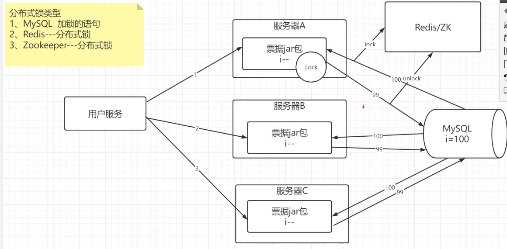

# 为什么要加锁？

在多线程中，如果对共享资源进行操作的话，是不安全的，需要加锁，否则可能会导致数据不一致。

如：卖票系统，会导致票超卖等现象。

# 单机锁的类型？

使用lock锁或synchronized或CAS锁

# 分布式场景中该如何解决？

需要加分布式锁

## 分布式锁的类型

- Mysql 加锁语句
- Redis
- Zookeeper



## 1. MySQL中实现分布式锁

**利用Mysql的排他锁**

```sql
select * from table where id = xxx for update
```

