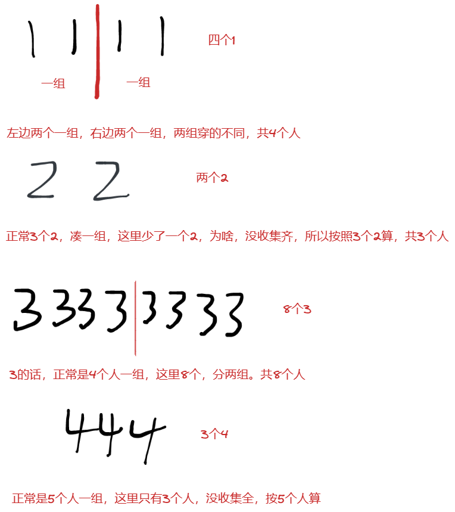

# 微信面试题

## 题目一：

```shell
股民小 A 有一天穿越回到了 n 天前，他能记住某只股票连续 n 天的价格；他手上有足够多的启动资金，他可以在这 n 天内多次交易，但是有个限制
如果已经购买了一个股票，在卖出它之前就不能再继续购买股票了。
到 n 天之后，小 A 不能再持有股票。
求问 这 n 天内，小 A 能够获得的利润的最大值
如果不需要手续费的话，求最大的利润
function(number) {
return number
}
输入: prices = [3, 1, 2, 8, 5, 9]
输出: 11
```

题目一，股票系列专题，大厂刷题班15节

## 题目二：

```shell
企鹅厂每年都会发文化衫，文化衫有很多种，厂庆的时候，企鹅们都需要穿文化衫来拍照
一次采访中，记者随机遇到的企鹅，企鹅会告诉记者还有多少企鹅跟他穿一种文化衫
我们将这些回答放在 answers 数组里，返回鹅厂中企鹅的最少数量。
输入: answers = [1]    输出：2
输入: answers = [1, 1, 2]    输出：5
```

Leetcode题目：https://leetcode.com/problems/rabbits-in-forest/

分析

> 如果a人说除了我之外还有7个人跟我穿一样的，b说除了我之外，还有9个人跟我穿一样的
> 那么a和b穿的一定不一样。如果一样，那么a和b的值应该一样
> 所以先排序。




找规律：

> 如果当前数字是x，有c个x。x + 1 是一组    那么有多少组：c / (x + 1) 向上取
>
> a/b 向上取整 => (a + b - 1) / b
>
> 所以： c / (x + 1) 向上取整  => (c + x ) / (x + 1)
>
> 所以最少人数：(c + x ) / (x + 1) * (x + 1)    这里不能约掉

```java
 public static int numRabbits(int[] arr) {
     if (arr == null || arr.length == 0) {
         return 0;
     }
     Arrays.sort(arr);
     int x = arr[0];
     // x的数量
     int c = 1;
     // 最终结果
     int ans = 0;
     for (int i = 1; i < arr.length; i++) {
         if (x != arr[i]) {
             // 开始计算
             ans += (c + x) / (x + 1) * (x + 1);
             c = 1;
             x = arr[i];
         } else {
             c++;
         }
     }
     // 这里最后的需要再计算下
     return ans + (c + x) / (x + 1) * (x + 1);
 }
```

## 题目三：

```shell
WXG 的秘书有一堆的文件袋，现在秘书需要把文件袋嵌套收纳起来。请你帮他计算下，最大嵌套数量。
给你一个二维整数数组 folders ，其中 folders[i] = [wi, hi] ，表示第 i 个文件袋的宽度和长度
当某一个文件袋的宽度和长度都比这个另外一个文件袋大的时候，前者就能把后者装起来，称之为一组文件袋。
请计算，最大的一组文件袋的数量是多少。
实例
输入：[[6,10],[11,14],[6,1],[16,14],[13,2]]
输出： 3
```

题目三，最长递增子序列专题，大厂刷题班第9节

# 整数反转

[7. 整数反转 - 力扣（LeetCode）](https://leetcode.cn/problems/reverse-integer/)

```shell
给你一个 32 位的有符号整数 x ，返回将 x 中的数字部分反转后的结果。

如果反转后整数超过 32 位的有符号整数的范围 [−231,  231 − 1] ，就返回 0。

假设环境不允许存储 64 位整数（有符号或无符号）。

示例 1：

输入：x = 123
输出：321
示例 2：

输入：x = -123
输出：-321
示例 3：

输入：x = 120
输出：21
示例 4：

输入：x = 0
输出：0
 

提示：

-231 <= x <= 231 - 1
```

**注意：超过int范围返回0**

> 分析
>
> 方法一：你可以会想，我先把int x转成string 类型，然后调用String的reverse方法进行反转，反转之后，在转换成long类型，然后在跟int的最大值和最小值比较，超过返回则返回0，否则则将long类型的结果转成int返回
>
> **这种方法也行，但是没有亮点**
>
> 我们尽量使用
>
> - 不要使用string
> - 不要使用更大的类型，如long
>
> **一般遇到这种整数反转的。我们可以先将正数转换成负数来进行计算。我们之后再Java中负数的范围会比正数大**

```java
 public static int reverse(int x) {
     // 判断是不是负数
     boolean neg = ((x >>> 31) & 1) == 1;
     x = neg ? x : -x; // 不是负数，转换位为数
     int m = Integer.MIN_VALUE / 10;
     int o = Integer.MIN_VALUE % 10;
     int res = 0;
     while (x != 0) {
         // 超出范围判断，两种情况
         if (res < m || (res == m && x % 10 < o)) {
             return 0;
         }
         res = x % 10 + res * 10;
         x /= 10;
     }
     return neg ? res : Math.abs(res);
 }
```

