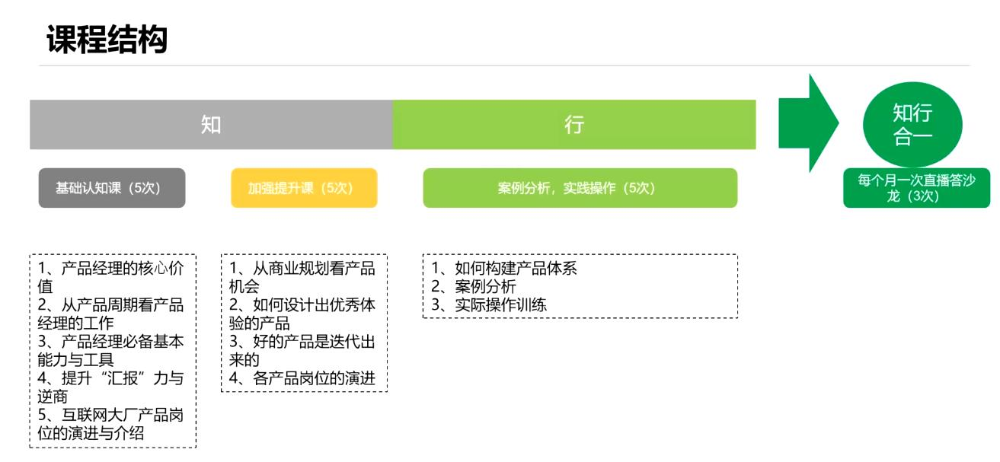
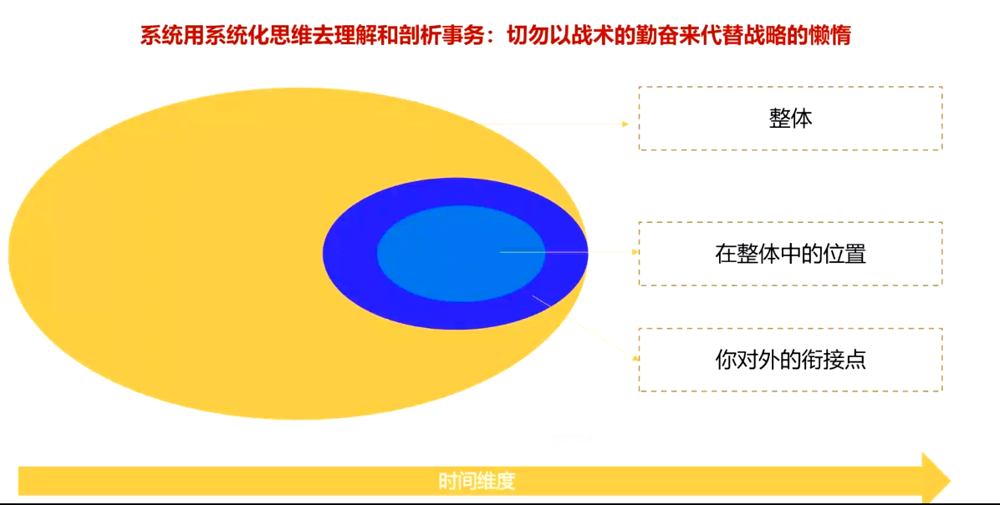
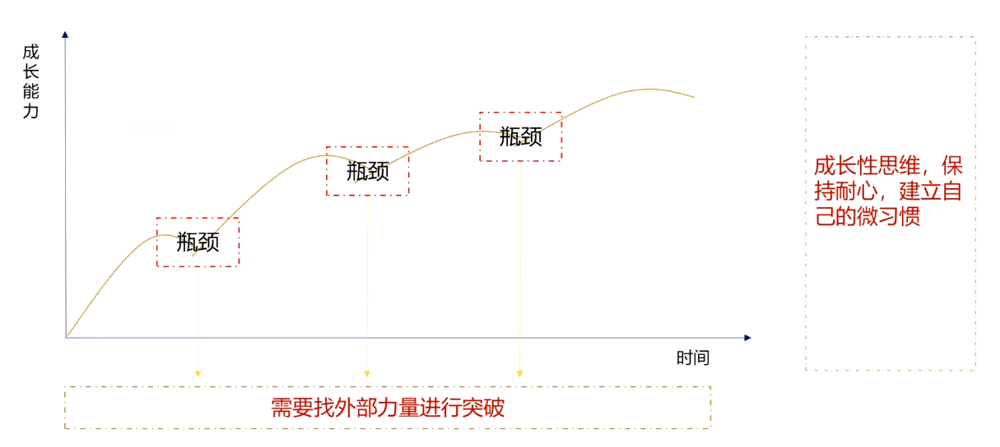
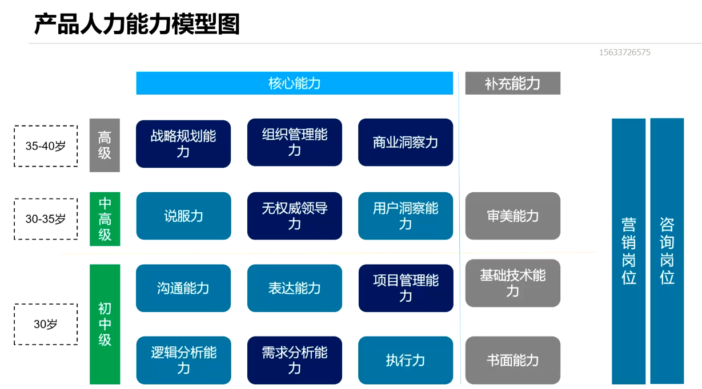

# 课程结构

# 课程学习说明

## 为什么

学习切记“我要学知识”

我想提升我的思维深度？

所有公司人员岗位定级的底层逻辑, 或者各层级人员之前的最本质差异？

- 能力差异
- 知识差异
- 解决问题的量级的差异（√）

## 学习要求

无人区时代：思考框架，在不确定性中找到分析依据

成长性思维

思考，发问

需要跟大家沟通的内容，多问问题，深入思考，重点看我的思考框架

实话实说，百度百科都能查到，我不太想多讲

## 过程

亲身感知——自己自身活动获得的直接经验

他人与之——从外部获得的间接经验

**逻辑推之——通过建立对事物底层认知能力，能够对未知事物进行逻辑推理**

知识接纳过程：知识（学习）—— 技能（温故而知新）—— 专有能力（持续训练）；光学不用基本白学

## 能力与心态变化

## 课程学习的目标及学习方法

**授人以鱼，不如授人以渔**

给予想做产品的及与产品有关工作的人员思维提升

**能力模型：认知模型-阿里P7（系统性思维），实践模型-P6**

希望大家多提问，我更愿意去结合大家实际问题进行内容讲授

希望创造苏格拉底式的课堂氛围！

所有公司的人员岗位定级的底层逻辑，或者各层级人员之前的最本质差异？

# 产品人力能力模型图

**看你的年龄，看你这个年龄能达到的认知程度（两个方面考虑）**

# 基础认知课

## 1.1 产品经理的核心价值

# 推荐书籍

《福格行为模型》
