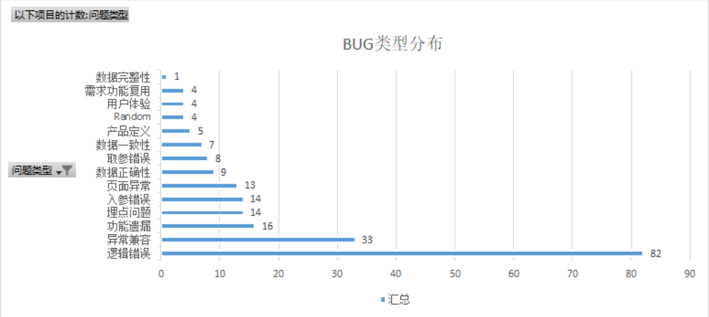

# 1. 生产故障分级规范概要

## 1.1 开篇 

计算机是当今世界的命脉，你能看到的任何地方，计算机都在改变着世界，不论是传统的制造生产，医 疗通讯。还是新兴的虚拟现实，无人驾驶汽车 等领域。过去的几十年，计算机硬件飞速发展，软件领域 也是不断刷新着人们的想象。可以说，计算机学科复杂而且庞大，甚至有人说，不亚于物理学。 

今天我们讨论的话题，线上事故分析，只是其中的一部分，一小部分，为了说清楚这一点，我们简单了 解一下软件工程学科。 玛格丽特·希菲尔德·汉密尔顿（英语：Margaret Heafield Hamilton，1936年8月17日－[ 1]）被认为 发明了软件工程一词。

她帮助了NASA在阿波罗计划中避免了严重问题。她曾这样说：“有点像牙根管治疗：你总是拖到最后 才做，但有些事可以预先做好，有点像预防性体验，只不过是预防软件出错”。 

我们不妨简单总结如何开发一个大型的软件项目下： 

1-基于面向对象的编程语言 

2-容易使用的集成开发环境 

3-文档和注释（程序员最讨厌的两件事，写注释给别人读，阅读别人没有写注释的代码😃） 

4-构建管理和版本控制 

5-质量保证测试(QUALITY ASSURANCE-QA

每个软件从业者从写下第一行代码开始，就一刻不停地 和软件中的错误做斗争 开发和维护（修复缺 陷、确保资源充 足等保障软件运行的活动）是一对伴随软件运行而产生的双 热爱从零到一开发软件是 开发者的天性 看着自己编写的 软件完美运行，为其他 提供服务，一直是驱动开发者前进的动力。

为了 更快更好地开发软件，我们不断改进开发方法和软件架构，但是开发者在使用新的方法和更复杂的架构 时，往往也会低估潜在的风险。 

本课程话题，主要讨论质量测试上线后，运营环节期间的一些问题，当然，我们暂时并不界定事故的产生到底是因为测试覆盖不全还是操作不当等，这某种程度体现着管理的方式问题。

## 1.2 事故等级定义

业务和产品的线上质量、是研发团队的生命线，也是支撑业务快速是错，小步跑的前置条件。

### 1.2.1 故障等级定义

故障等级定义，不同的业务形态，不同的公司团队，有不一样的划分标准，下表列举了一般常见的维度和标准

| 线上故障等级         | 标准                                                         | 是否回滚 |
| -------------------- | ------------------------------------------------------------ | -------- |
| 【P0】  致命问题 | 安全：影响线上生产核心数据安全【1】核心数据定义(丢失、泄漏）；  功能：造成系统崩溃、死机，主要功能或重要功能完全不能正常使用；  资损：造成资损超过>5W；  体验：（1）有效客诉超过>30人或客诉>50人；（2）由于系统问题导致、 不能开展业务的核心企业，超过3家  影响范围：针对P0/P1/P2/P3系统[【2】系统级别定义] 影响范围与故障等 级，见下表：【3】影响范围与故障等级 | 是       |
| 【P1】  严重问题 | 安全：影响线上生产部分数据安全（丢失、泄露）；  功能：主要功能部分丧失或次要功能大部分丧失，或严重误导的提示信息；  资损：造成资损超过>1W  体验：（1）有效客诉>5人；（2）由于系统问题导致、不能正常开展业务 的核心企业，超过1家。  影响范围：针对P0/P1/P2/P3系统[【2】系统级别定义] 影响范围与故障等 级，见下表：【3】影响范围与故障等级 | 是       |
| 【P2】  一般问题 | 功能：次要功能丧失、边界校验不全等；  体验：用户界面交互差或操作等待时间长；  资损：造成资损超过>1K  影响范围：针对P0/P1/P2/P3系统[【2】系统级别定义] 影响范围与故障等 级，见下表：【3】影响范围与故障等级 | 否       |
| 【P3】  轻微问题 | 功能：界面提示描述错别字、排版问题等用户提示性问题，但不影响执行工 作功能或重要功能 | 否       |
| **线上故障 分类**    | 说明                                                         |          |
| 外部依赖类           | 是由所依赖的上下游系统的缺陷或不稳定直接导致业务流程受阻，用户体验客诉类事故 |          |
| 运营质量类           | 由运营或业务人员在进行营销活动创建或线上策略配置错误等导致的一些问题 |          |
| 需求质量类           | 由于产品方案设计存在逻辑或流程上缺陷直接导致的线上问题       |          |
| 系统质量类           | 系统存在逻辑或流程缺陷直接导致线上问题，同时还包括性能、稳定性引发 的问题 |          |

【1】核心数据定义

**个人敏感信息**：姓名、出生日期、身份证件号码、个人生物识别信息、住址、通信通讯联系方式、通信 记录和内容、账号密码、财产信息、征信信息、行踪轨迹、住宿信息、健康生理信息、交易信息等。 

**用户画像**：职业、经济、健康、教育、个人喜好、信用、行为等。

【2】系统级别定义

**零级系统(P0)**：为公司核心业务服务的核心系统，一旦发生不可用会直接影响公司核心业务的业务连续 性，对所有系统用户造成影响。

 **一级系统(P1)**：重点的业务系统，一旦发生不可用，影响核心业务的连续型，并造成大部分内部用户或 外部用户不可使用此系统。

**二级系统(P2)**：重要的业务系统，一旦发生不可用存在一定的业务可用性问题，但不会影响核心业务的 业务连续性。 

**三级系统(P3)：**非核心的支撑系统，一旦发生故障不直接产生业务影响，但会影响少部分内部用户使用 此系统。

# 2. 生产故障原因和分类

## 2.1 故障分类

- 代码bug：上线代码逻辑有问题，遇到特殊情况下，导致故障的情况 
- 操作不当：线上配置或资源配置错误，操作不当，比如启动顺序不合理，初始化脚本不对，语法生 产数据隔离混用等 
- 系统级别软件bug：技术架构中使用到的任何OS，第三方类库，软件在特殊场景下，bug被处罚导致故障的情况。 
- 突发流量：热点或突发事件，引发的瞬时流量超过日常峰值或成倍增长，造成性能下降或功能不可用问题 
- 资源使用不均：整体产品线利用率不达标，但有些业务冗余度不足，导致资源不能正确合理使用 
- 容量预估不足：对个别业务核心池预估不足 
- 网络类：公网拥堵、丢包、专线、网络设备故障、ip被攻击（包括DNS被攻击）、IP被封、域名被 封、网络软件BUG、业务部门使用不当、未及时扩容等 
- 安全类：被攻击，漏洞被利用等问题，均归为此类 局方故障：ISP，根域名服务，电力，空调，光缆等外部单位故障导致的问题。
- 硬件故障：任何硬件非人为原因损坏导致的故障均归为此类。
- 第三方合作公司或接口故障：项目依赖的第三方公司或接口故障

个人统计（未必准确），实际生产中，遇见的故障所占比例

| 故障分类                                                     | 比例 （%） | 示例                                                         |
| ------------------------------------------------------------ | ---------- | ------------------------------------------------------------ |
| 配置不当，操作不当                                           | 30         | 数据库新加字段，线上忘记添加；配置文件更改未同 步，操作不当（设计本身也可能不合理） |
| 代码bug                                                      | 50         | 业务考虑不周全，未覆盖所有场景，测试不到位；代 码质量或设计问题，各种异常等，包括异常处理； |
| 突发流量+资源问题(包括使 用不当，也包括软件特性原 理不够深入理解) | 10         | 跟场景有很大关系；电商等领域的促销流量；内容网 站的突发流量等；依赖的存储，网络，等自身波动异 常等；慢sql，各种主从不一致等； |
| 第三方合作公司或接口故障                                     | 8          | 依赖的接口有故障；微信认证失败等等                           |
| 其他                                                         | 2          | 硬件故障等                                                   |

## 2.2 bug是可以完全避免的么？-了解

日常项目里中，站在开发者的角度： 

- 大多数程序员会花费70%-80%时间调试，而不是在写代码，虽然现在有很好的工具能极大帮助程 序员防止和解决错误 
- 另一个重要部分 给代码写文档 由于现在的需求越来越复杂，依赖的外部条件，技术组件也是越来越多，很多bug在所难免。但也 有一些bug是不能被原谅的，所以养成良好的开发习惯，很重要。

【bug起源】：1945年9月9日，格蕾丝·赫柏（Grace Murray Hopper） 使用的Mark Ⅱ出现故障，导 致工作无法进行。经过了近一天的检查，格蕾丝找到了故障的原因：继电器中有一只死掉的蛾子。蛾子 被夹了出来。后来，”bug” (小虫) 和”debug” (除虫) 这两个本来普普通通的词汇成了计算机领域 中特指莫明其妙的“错误”和“排除错误”的专用词汇而流传至今，而格蕾丝·赫柏也因此成了第一个发现“bug”的人

另一方面，大名鼎鼎的 "千年虫"bug，也是由她带来的。当然，这也不全完全算作bug。

## 2.3 经典故障示例-了解

[由软件Bug引发的18次重大事故 | 程序师 - 程序员、编程语言、软件开发、编程技术 (techug.com)](https://www.techug.com/post/12-biggest-software-failures-of-all-time/)

近年的CSDN600万用户信息泄露事件：[CSDN网站六百万用户信息外泄-月光博客 (williamlong.info)](https://www.williamlong.info/archives/2933.html)

2018年github服务中断24小时11分钟事件：[GitHub服务中断24小时11分钟事故分析报告 (qq.com)](https://mp.weixin.qq.com/s/fFv1ASElHsVNEPPkP53qAQ)