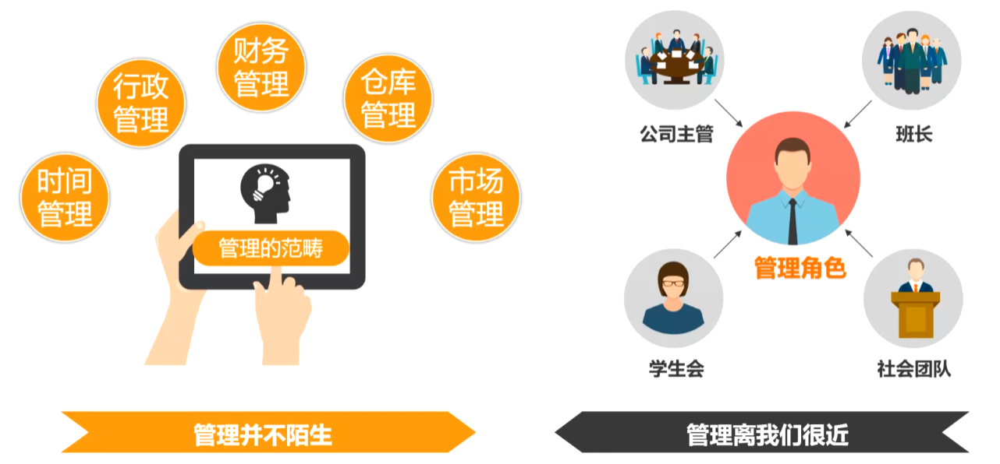
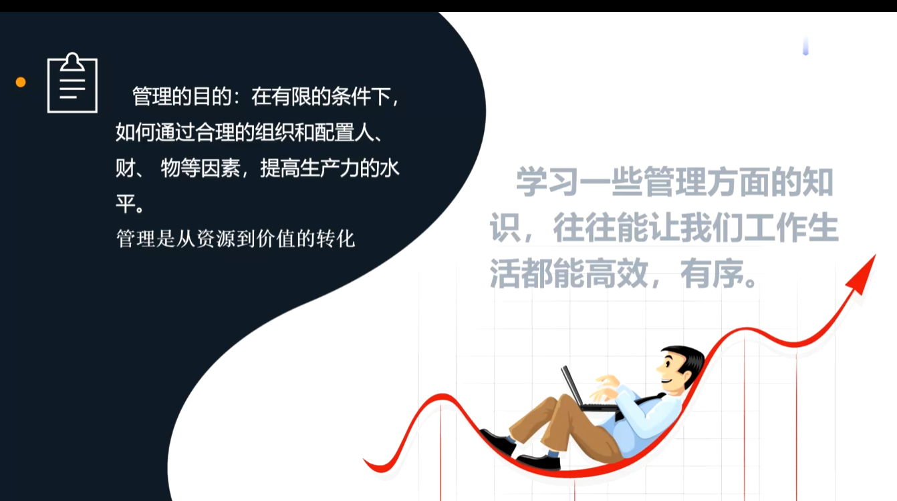
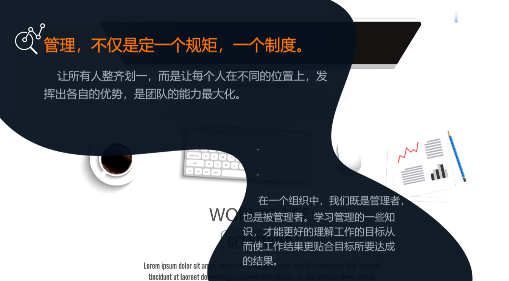
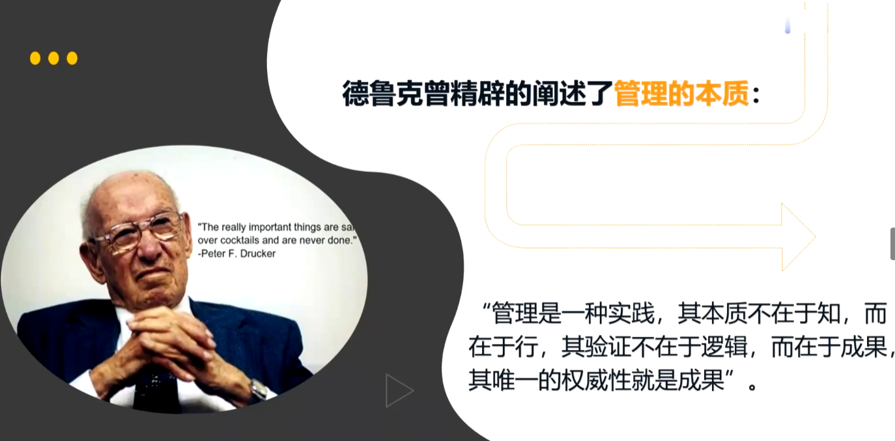
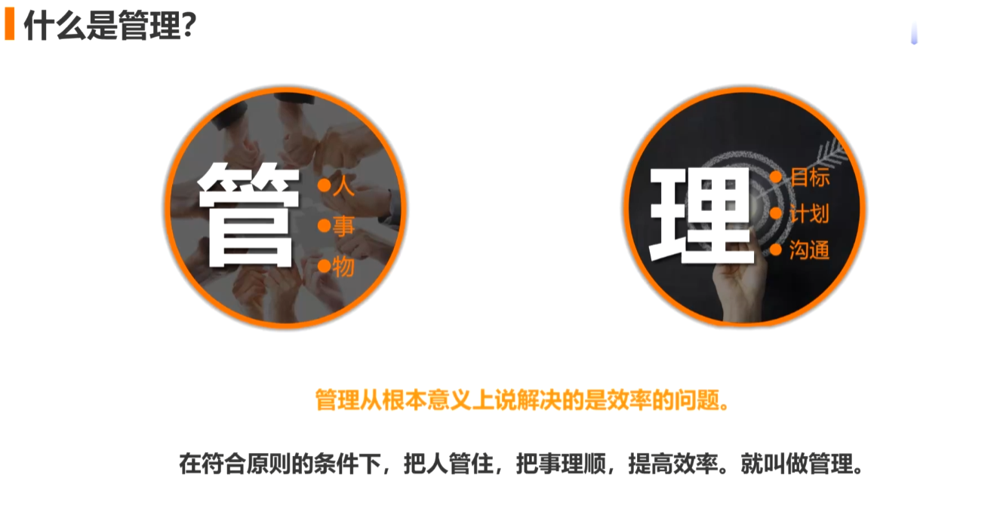
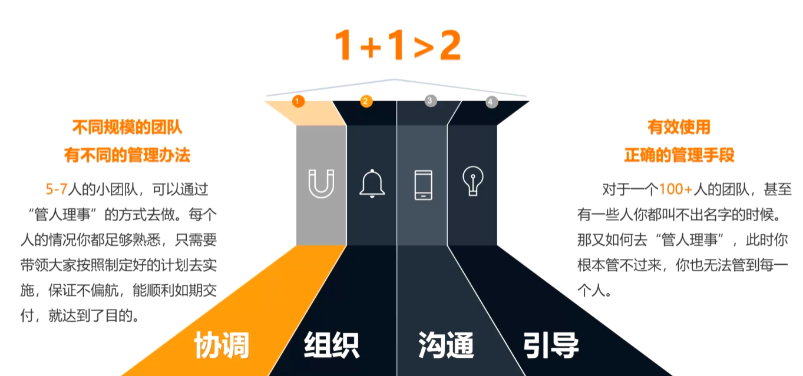
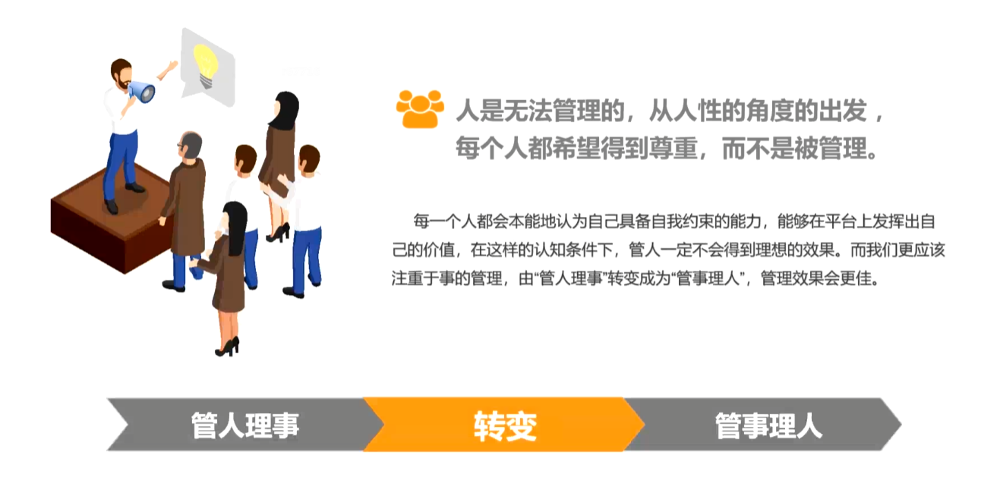
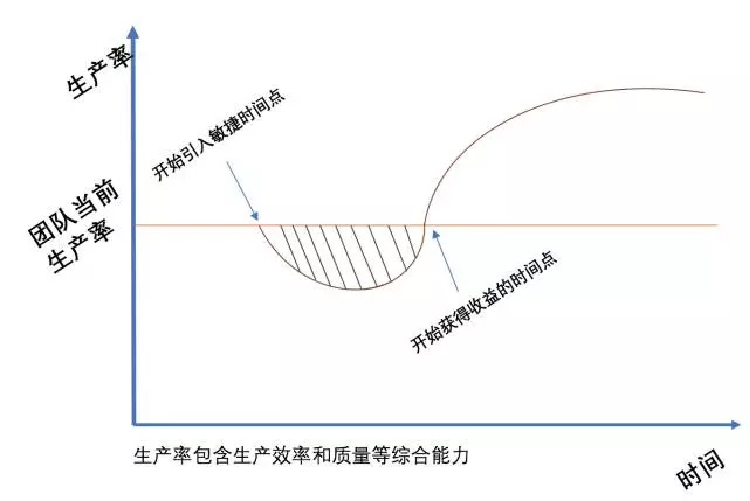

# 1. 为什么需要学管理

## 管理的目的

在有限的条件下，如何通过合理的组织和配置人、财、物等因素，提高生产力的水平。

**管理是从资源到价值的转化**

大家都在工作岗位上，工作和会工作是两个不同的概念，大多数人都是完成作业式的工作

**举个例子：**

如果你第一天上班，刚刚入职一家新的公司，刚刚领完电脑，环境还没有装，业务还不熟悉，领导说现在有个bug，需要解决下，你该怎么做？

大多数人都会觉得，我第一天上班，该怎么解决，环境啥的都没有，这是你再谈客观条件

领导是不是为难我，我刚入职，什么都不会，我该怎么做

注意：领导最终要的是这个bug能解决。

你刚来，不懂业务，你可以求助下同事，如果同事比较忙，你可以说你现在有什么活我可以帮你做，然后你帮忙看下这个bug。

**老板要的是结果。**

《高效人士的七个习惯》第二个习惯就是以终为始

就是眼睛要盯着目标，要把事情解决

# 2. 什么是管理

**管理，不仅是定一个规矩，一个制度。**   

让所有人整齐划一，而是让每个人在不同的位置上，发挥出各自的优势，是团队的能力最大化。

因为每个人的性格不一样，气质也不一样。

在一个组织中，我们既是管理者，也是被管理者。学习管理的一些知识，才能更好的理解工作的目标从而使工作结果更贴合目标所要达成的结果。

> 多巴胺：喜欢冒险，有创造力，耐心不足。
>
> 血清素：有耐心，自控能力强，社交能力差一些。
>
> 睾丸素：比较有侵略性，空间感和数字感较强，不太在乎别人的感受。
>
> 催产素：同理心强，表达能力好，善于社交，但是害怕冲突。

**中国人一直在讲情和理，于情于理，合情合理，在清理之间等**

## 管理的本质

**管理是一种实践，其本质不在于知，而在于行，其验证不在于逻辑，而在于成果，其唯一的权威性就是成果**

## 管和理

**管理从根本意义上说解决的是效率的问题。**

在符合原则的条件下，把人管住，把事理顺，提高效率。就叫做管理。

## 管人理事转换管事理人

管人理事   **转换**  管事理人

**人是无法管理的，从人性的角度的出发 ，每个人都希望得到尊重，而不是被管理。**

推荐书籍《不拘一格》

# 3. 我适不适合走向管理岗

**1、公司决定要开发一个电商系统，这个任务交给你来负责，作为负责人，你首先要做的是？**

A、立即开始组建团队，配齐各个岗位的人员

B、开始做前期外部调研，熟悉电商业务

C、与老板确认项目目标以及战略方向

D、立即实施，尽快交付项目

>  **CABD，这四个是顺序的问题**
>
> 考察是否具有抓住工作重点的能力，是否有明确的工作思路

**2、一个项目，时间很紧，成本有限的情况下，该如何保证项目质量？**

A、如实跟老板说明情况，请求资源协助。

B、梳理目标，以目标为导向，将目标结果最大化

C、以当前可用资源，将项目做到最好

D、多方协调资源，如期完成要求

> **考察是否具有强烈的目标导向意识**

**3、产品经理A和程序员B因为需求多次变更，导致项目开发不得不多次返工重构，因此而发生冲突，应该如何解决？**

A、产品需求变更很正常，要求程序员按照产品需求来做

B、项目已经开始实施，就不能在频繁的变更需求，这会延误工期。要求需求变更延缓至下一期。

C、开会共同民主决定，要不要接受需求变更，以及分析变动后影响的范围。

D、该模块暂停开发，与产品经理共同梳理业务逻辑和目标

> **考察是否具有快速发现规律和预测结果的能力（应变能力）**
>
> 尽可能不要让这种事情发生，如果发生，需要看是什么导致业务变更，是需求方一直再变，还是产品经理对需求的把控不好，
>
> 还是市场变动的原因

**4、随着项目迭代次数越来越多，人员越来越多，之前的项目管理方式使的效率越来越慢，现在需要引入敏捷开发模式，但是引入敏捷之后，为了适应敏捷，会使团队短期内效率更低，目前迫于需求方的压力，最近几个版本必须快速上线。你该如何选择？**

A、用现有的方式先把这几个版本开发完再引入敏捷。

B、坚持引入敏捷开发模式

C、把利害关系说清楚，如实跟老板汇报，让老板来决定

D、与需求方沟通，看是否可以把时间放宽一些

> **考察是否具有大局观**

# 4. 如何完成角色转变

# 5. 角色变化带来哪些挑战

# 6. 深耕技术还是应该涉猎管理

# 7. 管理者的综合能力体现

# 8. 职场中的必备沟通技能

# 9. 管理中的制度和规范

# 10. 管理中的流程如何制定

# 11. 应该如何向上汇报工作

# 12. 管理者需要具备的领导力

# 13. 管理实操工具

