说明

讲解的mysql是5.7

https://dev.mysql.com/doc/refman/5.7/en/

# Mysql的体系结构是什么样子的（查询语句怎么进行执行的）

mysql的架构：单进程多线程的架构模式     Client  ----->  Server架构

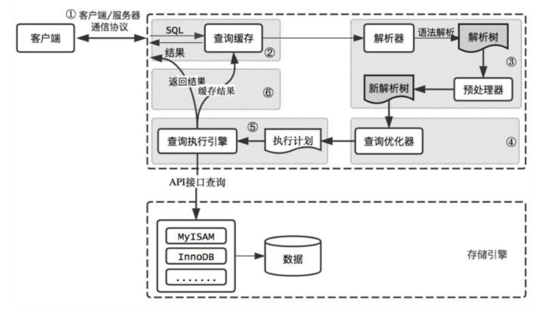

Mysql的连接方式有没有性能优化的点           2个点

```sql
# 查看线程
show global status like '%Thread%';

# 后台分配线程，消耗服务资源 客户端连接太多了

# 下面两个默认时间都是 28800s (8小时)
# 1. 非交互式超时时间，如JDBC程序
show global variables like 'wait_timeout';
# 2. 交互式超时时间，如数据库工具
show global variables like 'interactive_timeout';

# 一般生产的时候，怎么调整参数？？
# 可以这样说，通过用户行为分析  用户在xx界面停留了多久  停留界面 如30分钟，出个漏斗图。OA CRM ERP的项目一般不会做用户的行为分析，电商类的会做
```

MySQL的最大连接数怎么设置？

```sql
# 默认值是151
SHOW VARIABLES LIKE 'max_connections';

# 那怎么调整呢？？合理的跟面试官聊出来 我设置了多少

linux一个栈内存大约占8M内存    单个进程  4C8G   用到mysql上6G 减去buffer pool的大小3G   3G / 8M 约等于 350

350 * 线程数（连接池中的最大连接数）
```

设置Globle级别的参数之后，重启之后，这个参数还生不生效？

https://dev.mysql.com/doc/refman/5.7/en/server-system-variables.html

```sql
# serssion是会话级别
# global是全局级别
# 两个重启之后都不会生效
# 需要写入/etc/mysql.conf配置文件中(linux)，window的是my.ini，这样重启之后才会生效
```

## 2. 查询缓存(Query Cache)

MySQL 内部自带了一个缓存模块。默认是关闭的。主要是因为 MySQL 自带的缓存的应用场景有限，第一个是它要求 SQL 语句必须一模一样。第二个是表里面任何一条数据发生变化的时候，这张表所有缓存都会失效。

在 MySQL 5.8 中，查询缓存已经被移除了。5.7版本默认是关闭的

```sql
# 5.7版本默认是关闭的。
SHOW VARIABLES LIKE 'query_cache_type';
# 启用查询缓存
SET GLOBAL query_cache_type=1;
# 禁用查询缓存
SET GLOBAL query_cache_type=0;
```

为什么会移除缓存？？

> 因为查询缓存存在诸多问题：
>
> 1. 查询缓存锁定：
>
> 在高并发环境下，查询缓存的锁定会使并发下降，导致结果不佳。
>
> 2. 查找缓存缓存的包括查询：
>
> 在对于一个查询请求时，MySQL需要对所有查询缓存进行逐一查找，如果查询缓存的数量太大，就会使CPU负载过高。
>
> 3. 写入过于频繁：
>
> MySQL的查询缓存常常会面临频繁的数据写入，这会使缓存效果失踪。
>
> 因此，MySQL从版本5.7.20移除了查询缓存功能。尽管在过去，查询缓存可以提高MySQL的性能，但在现代的高并发和写入负载下，查询缓存的性能并没有得到保证，相反，还可能会导致性能问题和稳定性问题。因此，MySQL官方建议使用其他更加有效的缓存技术，如Memcached或Redis。

## 3. 语法解析和预处理(Parser & Preprocessor)

下一步我们要做什么呢？

假如随便执行一个字符串 fkdljasklf ，服务器报了一个 1064 的错：

```sql
[Err] 1064 - You have an error in your SQL syntax; check the manual that corresponds to your MySQL server version for the right syntax to use near 'fkdljasklf' at line 1
```

服务器是怎么知道我输入的内容是错误的？

或者，当我输入了一个语法完全正确的 SQL，但是表名不存在，它是怎么发现的？

这个就是 MySQL 的 Parser 解析器和 Preprocessor 预处理模块。

这一步主要做的事情是对 SQL 语句进行词法和语法分析和语义的解析。

### **词法解析**

词法分析就是把一个完整的 SQL 语句打碎成一个个的单词。

比如一个简单的 SQL 语句：

select name from user where id = 1;

它会打碎成 8 个符号，记录每个符号是什么类型，从哪里开始到哪里结束。

### **语法解析**

第二步就是语法分析，语法分析会对 SQL 做一些语法检查，比如单引号有没有闭合，然后根据 MySQL

定义的语法规则，根据 SQL 语句生成一个数据结构。这个数据结构我们把它叫做解析树。

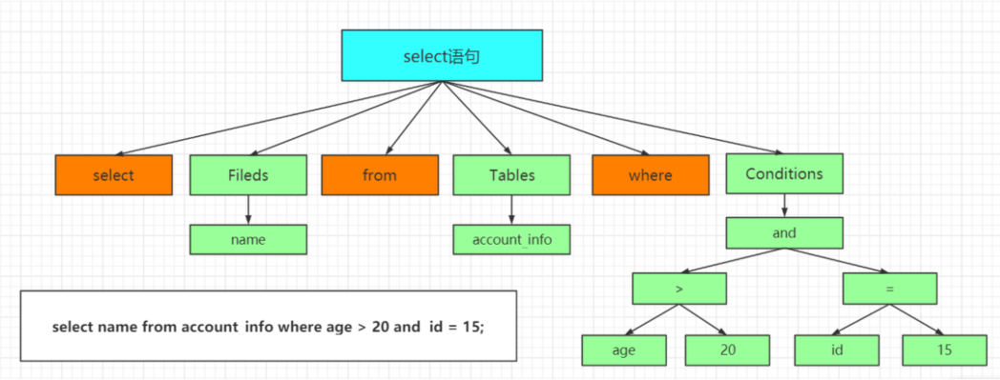

### **预处理器（Preprocessor）**

**语义解析**

如果表名错误，会在预处理器处理时报错。

它会检查生成的解析树，解决解析器无法解析的语义。比如，它会检查表和列名是否存在，检查名字和别名，保证没有歧义。

## 4、查询优化（Query Optimizer）与查询执行计划

### **什么优化器？**

问题：一条 SQL 语句是不是只有一种执行方式？或者说数据库最终执行的 SQL 是不是就是我们发送 的 SQL？

这个答案是否定的。一条 SQL 语句是可以有很多种执行方式的。但是如果有这么多种执行方式，这些执行方式怎么得到的？最终选择哪一种去执行？根据什么判断标准去选择？

这个就是 MySQL 的查询优化器的模块（Optimizer）。

查询优化器的目的就是根据解析树生成不同的**执行计划**，然后选择一种最优的执行计划，MySQL 里面使用的是基于开销（cost）的优化器，那种执行计划开销最小，就用哪种。

```sql
使用如下命令查看查询的开销：
    show status like 'Last_query_cost'; 
    --代表需要随机读取几个 4K 的数据页才能完成查找。 
```

如果我们想知道优化器是怎么工作的，它生成了几种执行计划，每种执行计划的 cost 是多少，应该怎么做？

## **优化器是怎么得到执行计划的？**

[https://dev.mysql.com/doc/internals/en/optimizer-tracing.html](https://dev.mysql.com/doc/internals/en/optimizer-tracing.html)

首先我们要启用优化器的追踪（默认是关闭的）：

```sql
SHOW VARIABLES LIKE 'optimizer_trace'; 

set optimizer_trace="enabled=on"; 
```

注意开启这开关是会消耗性能的，因为它要把优化分析的结果写到表里面，所以不要轻易开启，或者查看完之后关闭它（改成 off）。

接着我们执行一个 SQL 语句，优化器会生成执行计划：

```sql
select t.tcid from teacher t,teacher_contact tc where t.tcid = tc.tcid; 
```

这个时候优化器分析的过程已经记录到系统表里面了，我们可以查询：

```sql
select * from information_schema.optimizer_trace\G 
```

expanded_query 是优化后的 SQL 语句。

```sql
# 里面列出了所有的执行计划。 
considered_execution_plans 
```

记得关掉它：

```sql
set optimizer_trace="enabled=off"; 

SHOW VARIABLES LIKE 'optimizer_trace'; 
```

### **优化器可以做什么？**

MySQL 的优化器能处理哪些优化类型呢？

比如：

```txt
1、当我们对多张表进行关联查询的时候，以哪个表的数据作为基准表。 

2、select * from user where a=1 and b=2 and c=3，如果 c=3 的结果有 100 条，b=2 的结果有 200 条，		a=1 的结果有 300 条，你觉得会先执行哪个过滤？ 

3、如果条件里面存在一些恒等或者恒不等的等式，是不是可以移除。 

4、查询数据，是不是能直接从索引里面取到值。 

5、count()、min()、max()，比如是不是能从索引里面直接取到值。 

6、其他。
```

### **优化器得到的结果**

优化器最终会把解析树变成一个查询执行计划，查询执行计划是一个数据结构。

当然，这个执行计划是不是一定是最优的执行计划呢？不一定，因为 MySQL 也有可能覆盖不到所有的执行计划。

MySQL 提供了一个执行计划的工具。我们在 SQL 语句前面加上 EXPLAIN，就可以看到执行计划的信息。

```sql
EXPLAIN select name from user where id=1; 
```

## 5. 存储引擎处理查询

MySQL服务器使用存储引擎处理查询，存储引擎是负责存储数据和查询数据的组件。

如果查询涉及到多张表，MySQL需要在处理查询之前进行连接(joins)、排序和筛选。

> 具体来说，多张表查询涉及到在查询时将两个或多个表连接(join)起来，以获取所需的数据。MySQL会通过连接算法将多个表中符合条件的数据组合在一起，生成一个临时表，然后进行后续的处理。
>
> 而排序和筛选则是在连接操作之后，生成的临时表上进行的。根据查询语句中的条件，MySQL会对临时表进行排序、筛选、统计等操作，以返回目标数据。在这个阶段，MySQL会根据SQL语句中的条件，对数据进行排序、筛选，然后返回给客户端。如果排序和筛选的条件比较多或者复杂，那么查询的性能可能会受到影响，因此需要注意优化查询语句，提高执行效率。

存储引擎返回查询的结果集给MySQL服务器，服务器再将结果集转发给客户端。

# **MySQL 体系结构总结（知其然，知其所以然）**

**架构分层**

**总体上，我们可以把 MySQL 分成三层。**

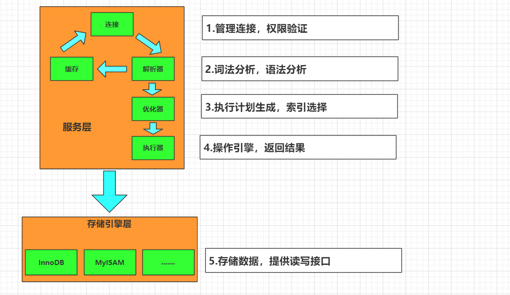

**模块详解**

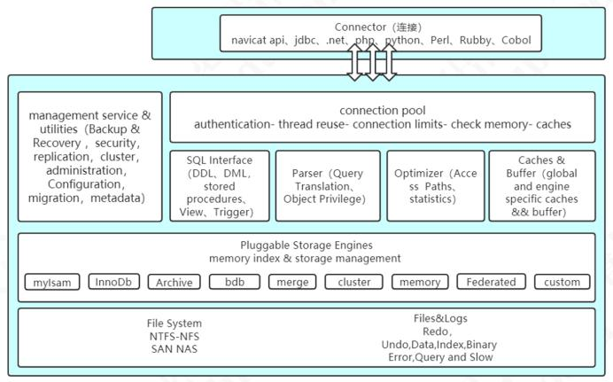

**1.Connector：用来支持各种语言和 SQL 的交互，比如 PHP，Python，Java 的 JDBC**

**2.Management  Serveices & Utilities：系统管理和控制工具，包括备份恢复、MySQL 复制、集群等等 **

**3.Connection Pool：连接池，管理需要缓冲的资源，包括用户密码权限线程等等 **

**4.SQL Interface：用来接收用户的 SQL 命令，返回用户需要的查询结果 **

**5.Parser：用来解析 SQL 语句 **

**6.Optimizer：查询优化器 **

**7.Cache and Buffer：查询缓存，除了行记录的缓存之外，还有表缓存，Key 缓存，权限缓存等等。 **

**8.Pluggable Storage Engines：插件式存储引擎，它提供 API 给服务层使用，跟具体的文件打交道。 **

# Bin log

1.bin Log:     数据恢复   主从复制

MySQL Server 层也有一个日志文件，叫做 binlog，它可以被所有的存储引擎使用。

```tex
bin log 以事件的形式记录了所有的 DDL 和 DML 语句（因为它记录的是操作而不是数据值，属于逻辑日志），可以用来做主从复制和数据恢复。
```

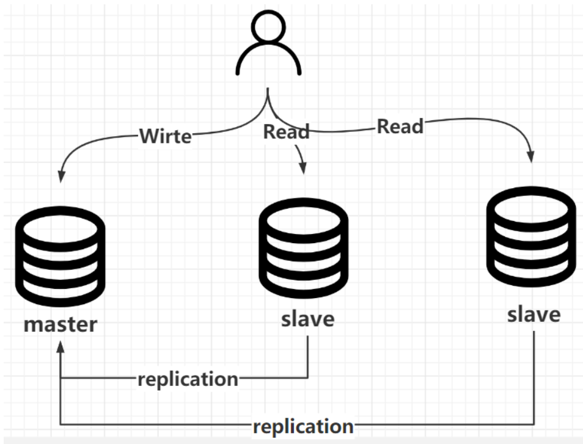、

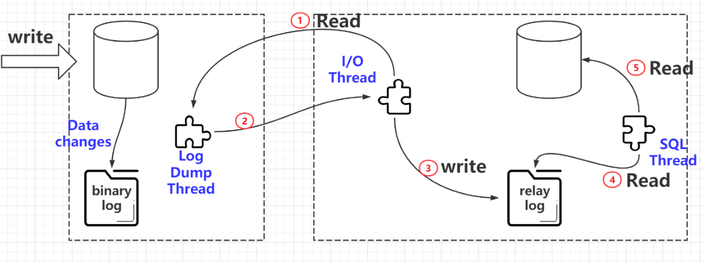

数据恢复：区别于Redo Log的崩溃恢复，数据恢复是基于业务数据的，比如删库跑路，而崩溃恢复是断电重启的

# **什么是预读？**

磁盘读写，并不是按需读取，而是按页读取，一次至少读一页数据（一般是4K）但是Mysql的数据页是16K，如果未来要读取的数据就在页中，就能够省去后续的磁盘IO，提高效率。

也可以调整，一般不会调整

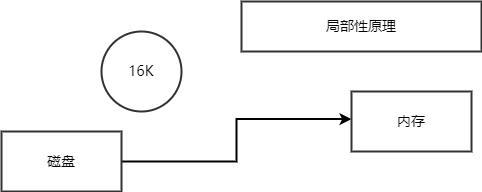

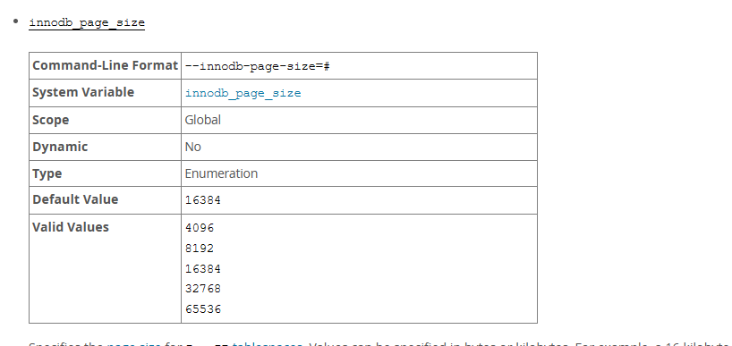

https://dev.mysql.com/doc/refman/5.7/en/innodb-parameters.html#sysvar_innodb_page_size

# 什么是Buffer  Pool？

内存缓冲区         CPU高速缓冲区

缓存表数据与索引数据，把磁盘上的数据加载到缓冲池，避免每次访问都进行磁盘IO，**起到加速访问的作用**。
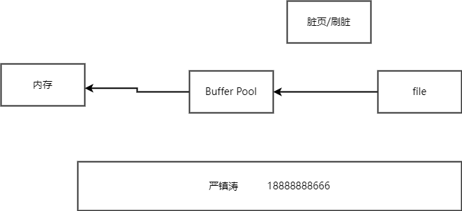

```sql
# 查看buffer_pool的实例数量，默认1
show variables like 'innodb_buffer_pool_instances';

# 查看buffer_pool的实例大小，默认 134217728 （128M）linux默认是128M，window默认8M
show variables like 'innodb_buffer_pool_size';
```

https://dev.mysql.com/doc/refman/5.7/en/innodb-parameters.html#sysvar_innodb_buffer_pool_size

**它的大小对你的性能优化的提升非常大**

> Buffer Pool大小可以在MySQL的配置文件my.cnf中设置，但需要根据实际情况进行调整。如果设置过小，可能会导致频繁的磁盘读写操作，从而降低数据库性能；如果设置过大，可能会占用过多的系统内存资源，影响其他应用的运行。一般建议将Buffer Pool设置到总内存的70%~80%左右。
>
> 除了调整Buffer Pool大小，还可以通过一些优化技巧来提高MySQL的性能。例如，使用合适的索引、避免过多使用JOIN操作、合理设置连接数限制、使用数据库连接池等。

# Buffer Pool的内存淘汰策略

**buffer pool的内存总有满的时候，那么满了之后该怎么处理？？？**

冷热分区的LRU策略

LRU链表会被拆分成为两部分，一部分为热数据，一部分为冷数据。冷数据占比 3/8，热数据5/8。

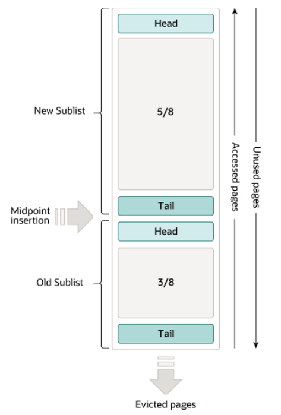

```sql
# 默认是开启的, NO 
show variables like 'innodb_buffer_pool_load_at_startup';

# 查看跟 innodb_buffer_pool 有关的所有配置
show variables like '%innodb_buffer_pool%';

# 默认是 1000 ms， 冷数据区域的缓存页什么时候放入热数据区域的时间
show variables like 'innodb_old_blocks_time';
```

https://dev.mysql.com/doc/refman/5.7/en/innodb-buffer-pool.html

**数据页第一次加载进来，放在LRU链表的什么地方？**

放在冷数据区域的头部

**冷数据区域的缓存页什么时候放入热数据区域？**

MySQL设定了一个规则，在 innodb_old_blocks_time 参数中，默认值为1000，也就是1000毫秒。

意味着，只有把数据页加载进缓存里，在经过1s之后再次对此缓存页进行访问才会将缓存页放到LRU链表热数据区域的头部。

**为什么是1秒？**

因为通过预读机制和全表扫描加载进来的数据页通常是1秒内就加载了很多然后对他们访问一下，这些都是1秒内完成，他们会存放在冷数据区域等待刷盘清空，基本上不太会有机会放入到热数据区域，除非在1秒后还有人访问，说明后续可能还会有人访问，才会放入热数据区域的头部。

> **chatGPT回答:**
>
> MySQL的Buffer Pool使用了LRU（Least Recently Used，最近最少使用）算法进行内存淘汰。当需要为新的数据分配内存并且Buffer Pool已经满了，就需要淘汰部分老数据来腾出空间。此时，就会使用LRU算法对Buffer Pool中的数据进行排序，然后淘汰掉最近最久未使用的数据。
>
> 在MySQL 5.7之前，Buffer Pool使用的是InnoDB的标准LRU算法。在MySQL 5.7之后，Buffer Pool原生支持两种LRU淘汰策略：
>
> 1. 传统LRU：它像标准LRU算法一样工作。最近使用的页面在链表的末尾，最久未使用的页面在链表的头部。
> 2. LRU_K算法：这种算法是MySQL 5.7中引入的，与传统的LRU算法不同，LRU_K算法会避免在某些情况下一个页面在一段时间内频繁被访问，占据了大量的空间。它在LRU的基础上增加了一个“热度”变量，用来记录每个页最近被访问的次数。通过这种方式，可以淘汰最近虽然访问较少，但长期来看热度较低的页面，同时保留那些虽然访问不算频繁，但长期来看热度较高的页面。
>
> 需要注意的是，虽然InnoDB使用LRU算法来管理Buffer Pool中的内存，但也存在一些缓存管理和磁盘I/O优化等方面的问题。因此，在高负载场景下，需要根据实际情况进行调整和优化。

# Redo Log跟Buffer Pool的关系

崩溃恢复（如断电）  基本保障   系统自动做的

> InnoDB 引入了一个日志文件，叫做 redo log（重做日志），我们把所有对内存数据的修改操作写入日志文件，如果服务器出问题了，我们就从这个日志文件里面读取数据，恢复数据——用它来实现事务的持久性。
>
> redo log 有什么特点？
>
> 1.记录修改后的值，属于物理日志
>
> 2.redo log 的大小是固定的，前面的内容会被覆盖，所以不能用于数据回滚/数据恢复。
>
> 3.redo log 是 InnoDB 存储引擎实现的，并不是所有存储引擎都有。
>
> 4.redo log有分组，数据存储在磁盘上，一般设置为500M

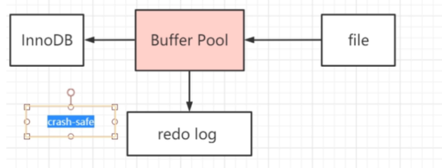


https://dev.mysql.com/doc/refman/5.7/en/innodb-architecture.html

# Mysql的数据恢复怎么做

数据恢复：删库跑路了  我能够去将你的数据进行恢复

备份每天2点   备份今天的所有数据库的数据 防止丢失   bin Log 二进制的日志文件   DDL  dmL

解析Bin  Log  专门的工具

9点    删库跑路      drop  table        首先  应该做得就是   把数据备份恢复出来      2点之前的

2点 - 9点之间的数据  bin Log    重新执行一遍      10分钟

## **查看存储引擎**

```
查看数据库表的存储引擎：
```

```sql
# 如 查询数据库 user_info的状态，目前下面只有一个user表
show table status from `user_info`;
```

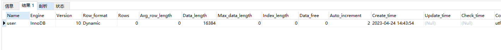

在 MySQL 里面，我们创建的每一张表都可以指定它的存储引擎，它不是一个数据库只能使用一个存储引擎。而且，创建表之后还可以修改存储引擎。

```sql
# 数据库存放数据的路径：
show variables like 'datadir'; 
```

```
每个数据库有一个自己文件夹，以 user_info 数据库为例。
```

```
任何一个存储引擎都有一个 frm 文件，这个是表结构定义文件。
```


# 一条更新语句的执行流程

跟 redo log 不一样，它的文件内容是可以追加的，没有固定大小限制。

有了这两个日志之后，我们来看一下一条更新语句是怎么执行的：

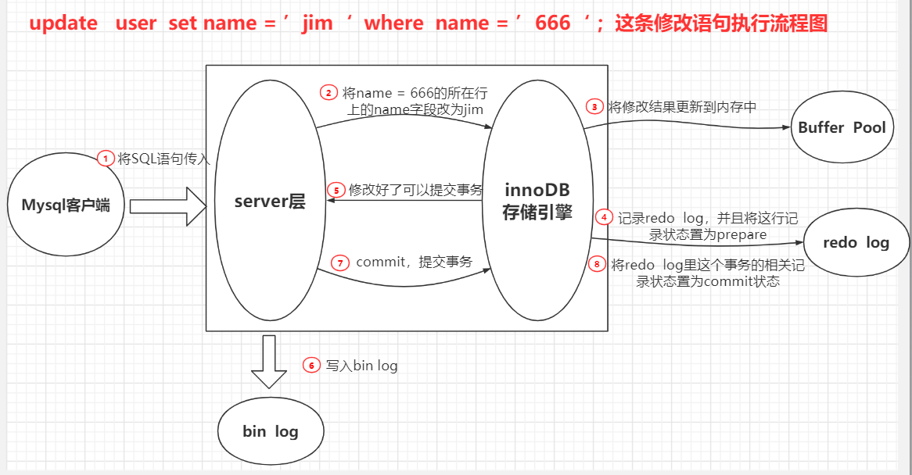

例如一条语句：update teacher set name='老严' where name =‘666’

1、先查询到这条数据，如果有缓存，也会用到缓存。

2、把 name 改成老严，然后调用引擎的 API 接口，写入这一行数据到内存，同时记录 redo log。这时 redo log 进入 prepare 状态，然后告诉执行器，执行完成了，可以随时提交。

3、执行器收到通知后记录 binlog，然后调用存储引擎接口，设置 redo log 为 commit 状态。

4、更新完成。

问题：为什么redo Log要用两阶段提交（XA）呢？

举例：

如果我们执行的是把 name 改成老严，如果写完 redo log，还没有写 bin log 的时候，MySQL 重启了。

因为 redo log 可以恢复数据，所以写入磁盘的是老严。但是 bin log 里面没有记录这个逻辑日志，所以这时候用 binlog 去恢复数据或者同步到从库，就会出现数据不一致的情况。

所以在写两个日志的情况下，binlog 就充当了一个事务的协调者。通知 InnoDB 来执行 prepare 或commit 或者 rollback。

简单地来说，这里有两个写日志的操作，类似于分布式事务，不用两阶段提交，就不能保证都成功或者都失败。 