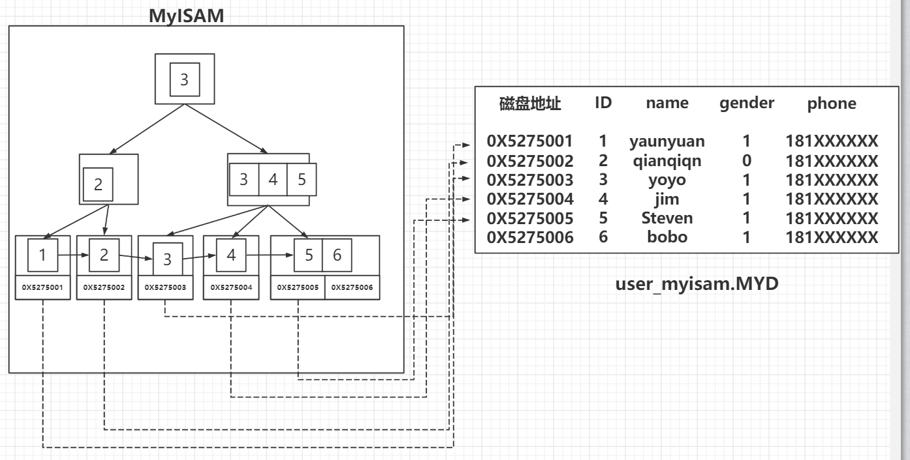
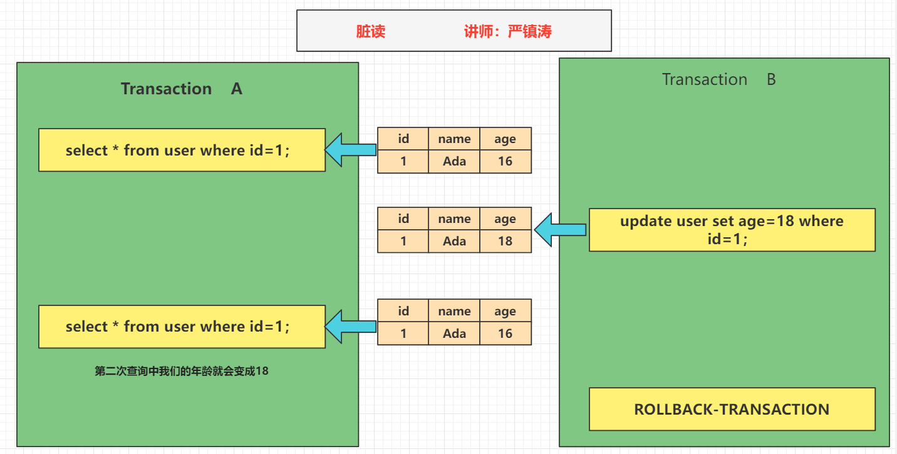
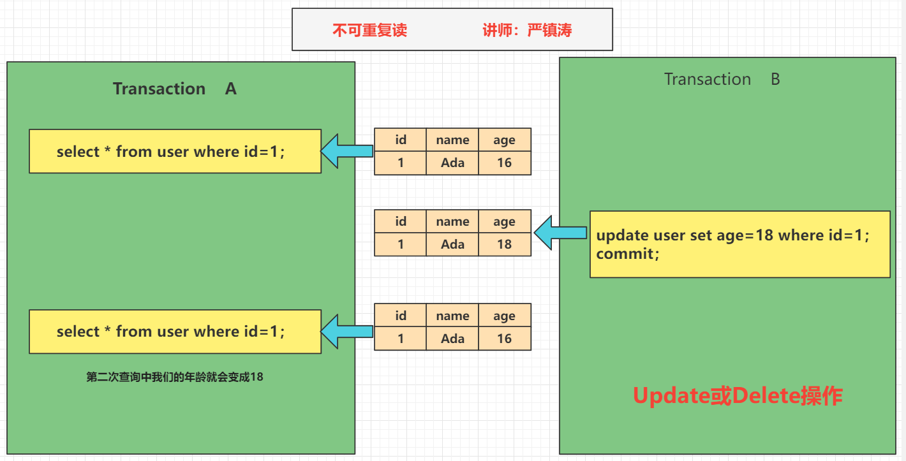
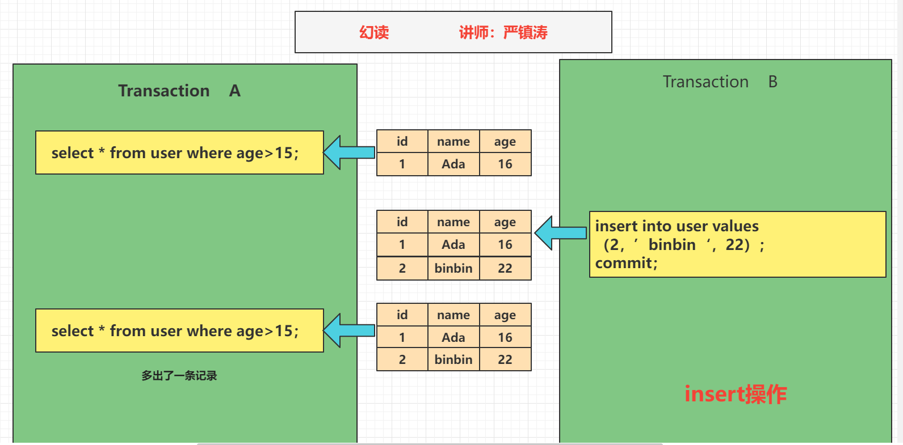
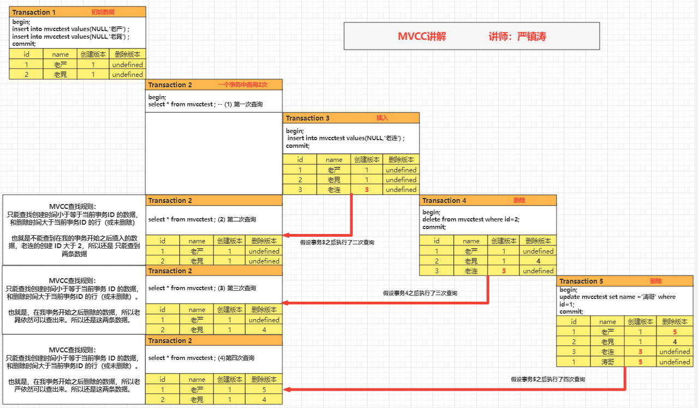

# 1.为什么Mysql要使用B+树做为索引而不用B树

1. B+树能显著减少IO次数，提高效率
2. B+树的查询效率更加稳定，因为数据放在叶子节点
3. B+树能提高范围查询的效率，因为叶子节点指向下一个叶子节点
4. B+树采取顺序读

# 2.磁盘的顺序读以及随机读有什么区别？（这个在面大厂的时候有可能会让你聊，问法有很多种）


盘片+磁头 +主轴 + 控制电路集成板

磁盘是如何完成单次IO的

寻道时间+旋转延迟+数据传送
数据的顺序读跟随机读有什么区别

顺序IO  跟并发IO       一块磁盘一次只能处理一个IO指令      磁盘组  一次 能够并发IO

# 3.什么是Hash索引


hash索引查询比B+树快，B+树需要找三层，hash索引只需要一层就行，但是因为hash值是散列分布的，对于范围查找不友好，所以一般索引都是使用B+树。

# 4.**索引使用原则（索引怎么使用才合理）**

我们容易有一个误区，就是在经常使用的查询条件上都建立索引，索引越多越好，那到底是不是这样呢？ 

## **列的离散（sàn）度**

第一个叫做列的离散度，我们先来看一下列的离散度的公式：

不同值得数量：总行数 越接近1 那么离散度越高，越接近0，离散度越低

```sql
count(distinct(column_name)) : count(*)，列的全部不同值和所有数据行的比例。数据行数相同的情况下，分子越大，列的离散度就越高。
```

> 假设有个user 表， 有三个字段：id（自增） ，name， sex（性别），数据量500w
>
> 如果id创建索引，其离散度就是 500w/500w = 1
>
> 如果sex创建索引，一般性别就男和女，2/500w 接近0，此时使用sex查询比不创建索引前效率还低

## **联合索引最左匹配**

前面我们说的都是针对单列创建的索引，但有的时候我们的多条件查询的时候，也会建立联合索引，举例：查询成绩的时候必须同时输入身份证和考号。

联合索引在 B+Tree 中是复合的数据结构，它是按照从左到右的顺序来建立搜索树的（name 在左边，phone 在右边）。

从这张图可以看出来，name 是有序的，phone 是无序的。当 name 相等的时候，phone 才是有序的。

这个时候我们使用 where name= 'jim' and phone = '136xx '去查询数据的时候，B+Tree 会优先比较 name 来确定下一步应该搜索的方向，往左还是往右。如果 name相同的时候再比较 phone。但是如果查询条件没有 name，就不知道第一步应该查哪个节点，因为建立搜索树的时候 name 是第一个比较因子，所以用不到索引。

## **如何创建联合索引**

有一天我们的 DBA 找到我，说我们的项目里面有两个查询很慢，按照我们的想法，一个查询创建一个索引，所以我们针对这两条 SQL 创建了两个索引，这种做法觉得正确吗？

```sql
CREATE INDEX idx_name on user_innodb(name); 
CREATE INDEX idx_name_phone on user_innodb(name,phone);
```

当我们创建一个联合索引的时候，按照最左匹配原则，用左边的字段 name 去查询的时候，也能用到索引，所以第一个索引完全没必要。

相当于建立了两个联合索引(name),(name,phone)。

```sql
如果我们创建三个字段的索引 index(a,b,c)，相当于创建三个索引：

index(a) 

index(a,b) 

index(a,b,c) 

用 where b=? 和 where b=? and c=? 是不能使用到索引的。

这里就是 MySQL 里面联合索引的最左匹配原则。 
```

## **覆盖索引与回表**

什么叫回表：   不需要回表  叫覆盖索引

聚集索引 ：id

二级索引  ：name


非主键索引，我们先通过索引找到主键索引的键值，再通过主键值查出索引里面没

有的数据，它比基于主键索引的查询多扫描了一棵索引树，这个过程就叫回表。

在辅助索引里面，不管是单列索引还是联合索引，如果 select 的数据列只用从索引中就能够取得，不必从数据区中读取，这时候使用的索引就叫做覆盖索引，这样就避免了回表。

Extra 里面值为“Using index”代表使用了覆盖索引。

# **5.** **索引的创建与使用**

因为索引对于改善查询性能的作用是巨大的，所以我们的目标是尽量使用索引。

## **在什么字段上索引？**

1、在用于 where 判断 order 排序和 join 的（on）字段上创建索引

2、索引的个数不要过多。

——浪费空间，更新变慢。

3、区分度低的字段，例如性别，不要建索引。

——离散度太低，导致扫描行数过多。

4、频繁更新的值，不要作为主键或者索引。

——页分裂

5、随机无序的值，不建议作为主键索引，例如身份证、UUID。

——无序，分裂

6、创建复合索引，而不是修改单列索引

## **什么时候索引失效？      索引值不确定的情况**

1、索引列上使用函数（replace\SUBSTR\CONCAT\sum count avg）、表达式

2、字符串不加引号，出现隐式转换

3、like 条件中前面带%

4、负向查询   NOT LIKE 不能

## MyiSAM与Innodb

myi     index

myd     data




我们表内的数据是按照聚集索引的顺序排列的

# 6.什么是数据库的事务？

内存      -----    buffer   pool    -----  磁盘

重启      Redo  Log    物理日志

下单   订单表   资金表    物流    库存表          insert   update

A   10000    -11000   互不干扰的

B    10000     +500        银行会计科目不平衡    原子性    Undo  Log   事务发生前的状态

**事务的定义**

维基百科的定义：事务是数据库管理系统（DBMS）执行过程中的一个逻辑单位，由一个有限的数据库操作序列构成。

这里面有两个关键点，第一个，它是数据库最小的工作单元，是不可以再分的。第二个一系列的 D，它可能包含了一个或者ML 语句，包括 insert delete update

# 7.哪些存储引擎支持事务

InnoDB 支持事务，这个也是它成为默认的存储引擎的一个重要原因：

https://dev.mysql.com/doc/refman/5.7/en/storage-engines.html

另一个是 NDB

# 8.事务的四大特性

**原子性（Atomicity）**

也就是我们刚才说的不可再分，也就意味着我们对数据库的一系列的操作，要么都是成功，要么都是失败，不可能出现部分成功或者部分失败的情况，以刚才提到的转账的场景为例，一个账户的余额减少，对应一个账户的增加，这两个一定是同时成功或者同时失败的。全部成功比较简单，问题是如果前面一个操作已经成功了，后面的操作失败了，怎么让它全部失败呢？这个时候我们必须要回滚。

原子性，在 InnoDB 里面是通过 undo log 来实现的，它记录了数据修改之前的值（逻辑日志），一旦发生异常，就可以用 undo log 来实现回滚操作。

**一致性（consistent）**

指的是数据库的完整性约束没有被破坏，事务执行的前后都是合法的数据状态。比如主键必须是唯一的，字段长度符合要求。

除了数据库自身的完整性约束，还有一个是用户自定义的完整性。

**举例：**

1.比如说转账的这个场景，A 账户余额减少 1000，B 账户余额只增加了 500，这个时候因为两个操作都成功了，按照我们对原子性的定义，它是满足原子性的， 但是它没有满足一致性，因为它导致了会计科目的不平衡。

2.还有一种情况，A 账户余额为 0，如果这个时候转账成功了，A 账户的余额会变成-1000，虽然它满足了原子性的，但是我们知道，借记卡的余额是不能够小于 0 的，所以也违反了一致性。用户自定义的完整性通常要在代码中控制。

**隔离性（isolation）**

有了事务的定义以后，在数据库里面会有很多的事务同时去操作我们的同一张表或者同一行数据，必然会产生一些并发或者干扰的操作，对隔离性就是这些很多个的事务，对表或者 行的并发操作，应该是透明的，互相不干扰的。通过这种方式，我们最终也是保证业务数据的一致性。

**持久性（Durable）**

我们对数据库的任意的操作，增删改，只要事务提交成功，那么结果就是永久性的，不可能因为我们重启了数据库的服务器，它又恢复到原来的状态了。

持久性怎么实现呢？数据库崩溃恢复（crash-safe）是通过什么实现的？持久性是通过 redo log 来实现的，我们操作数据的时候，会先写到内存的 buffer pool 里面，同时记录 redo log，如果在刷盘之前出现异常，在重启后就可以读取 redo log的内容，写入到磁盘，保证数据的持久性。

总结：原子性，隔离性，持久性，最后都是为了实现一致性

# 9.那么数据库什么时候会出现事务呢？

**举例：**

当我执行这样一条更新语句的时候，它有事务吗？

`update user_innodb set name = '张三' where id=1;`

实际上，它自动开启了一个事务，并且提交了，所以最终写入了磁盘。这个是开启事务的第一种方式，自动开启和自动提交。

InnoDB 里面有一个 autocommit 的参数（分成两个级别， session 级别和 global级别）。它的默认值是 ON

```sql
show variables like 'autocommit';
```

autocommit 这个参数是什么意思呢？是否自动提交。如果它的值是 true/on 的话，我们在操作数据的时候，会自动开启一个事务，和自动提交事务。

否则的话，如果我们把 autocommit 设置成 false/off，那么数据库的事务就需要我们手动地去开启和手动地去结束。

手动开启事务也有几种方式，一种是用 begin；一种是用 start transaction。

那么怎么结束一个事务呢？我们结束也有两种方式，第一种就是提交一个事务，commit；还有一种就是 rollback，回滚的时候，事务也会结束。

# 10.事务并发会带来什么问题？

当很多事务并发地去操作数据库的表或者行的时候，如果没有我们刚才讲的事务的Isolation 隔离性的时候，会带来哪些问题呢？

**脏读**



大家看一下，我们有两个事务，一个是 Transaction A，一个是 Transaction B，在第一个事务里面，它首先通过一个 where id=1 的条件查询一条数据，返回 name=Ada，age=16 的这条数据。然后第二个事务呢，它同样地是去操作 id=1 的这行数据，它通过一个 update 的语句，把这行 id=1 的数据的 age 改成了 18，但是大家注意，它没有提交。

这个时候，在第一个事务里面，它再次去执行相同的查询操作，发现数据发生了变化，获取到的数据 age 变成了 18。那么，这种在一个事务里面，由于其他的时候修改了数据并且没有提交，而导致了前后两次读取数据不一致的情况，这种事务并发的问题，我们把它定义成脏读。

**不可重复读**



同样是两个事务，第一个事务通过 id=1 查询到了一条数据。然后在第二个事务里面执行了一个 update 操作，这里大家注意一下，执行了 update 以后它通过一个 commit提交了修改。然后第一个事务读取到了其他事务已提交的数据导致前后两次读取数据不一致的情况，就像这里，age 到底是等于 16 还是 18，那么这种事务并发带来的问题，我们把它叫做不可重复读。

**幻读**

在第一个事务里面我们执行了一个范围查询，这个时候满足条件的数据只有一条。在第二个事务里面，它插入了一行数据，并且提交了。重点：插入了一行数据。在第一个事务里面再去查询的时候，它发现多了一行数据。



一个事务前后两次读取数据数据不一致，是由于其他事务插入数据造成的，这种情况我们把它叫做幻读。

**总结：**

不可重复读是修改或者删除，幻读是插入。

无论是脏读，还是不可重复读，还是幻读，它们都是数据库的读一致性的问题，都是在一个事务里面前后两次读取出现了不一致的情况。

# 11.SQL92标准

读一致性的问题，必须要由数据库提供一定的事务隔离机制来解决。就像我们去饭店吃饭，基本的设施和卫生保证都是饭店提供的。那么我们使用数据库，隔离性的问题也必须由数据库帮助我们来解决。

我们来看一下 SQL92 标准的官网。(个人吐槽一下，这个官网是真的丑)

http://www.contrib.andrew.cmu.edu/~shadow/sql/sql1992.txt

这里面有一张表格（搜索_iso），里面定义了四个隔离级别，右边的 P1 P2 P3 就是代表事务并发的 3 个问题，脏读，不可重复读，幻读。Possible 代表在这个隔离级别下，这个问题有可能发生，换句话说，没有解决这个问题。Not Possible 就是解决了这个问题。

**Read Uncommitted（未提交读）**

一个事务可以读取到其他事务未提交的数据，会出现脏读，所以叫做 RU，它没有解决任何的问题。

**Read Committed（已提交读）**

一个事务只能读取到其他事务已提交的数据，不能读取到其他事务未提交的数据，它解决了脏读的问题，但是会出现不可重复读的问题。

**Repeatable Read（可重复读）**

它解决了不可重复读的问题，也就是在同一个事务里面多次读取同样的数据结果是一样的，但是在这个级别下，没有定义解决幻读的问题。

**Serializable（串行化）**

在这个隔离级别里面，所有的事务都是串行执行的，也就是对数据的操作需要排队，已经不存在事务的并发操作了，所以它解决了所有的问题。

总结：这个是 SQL92 的标准，但是不同的数据库厂商或者存储引擎的实现有一定的差异。

# 12.Mysql的innoDB存储引擎对于隔离级别的支持

在 MySQL InnoDB 里面，不需要使用串行化的隔离级别去解决所有问题。那我们来看一下 MySQL InnoDB 里面对数据库事务隔离级别的支持程度是什么样的。


InnoDB 支持的四个隔离级别和 SQL92 定义的基本一致，隔离级别越高，事务的并发度就越低。唯一的区别就在于，InnoDB 在 RR 的级别就解决了幻读的问题。这个也是InnoDB 默认使用 RR 作为事务隔离级别的原因，既保证了数据的一致性，又支持较高的并发度。

```sql
# 查看mysql事务的级别
SELECT @@transaction_isolation;

# 修改事务的级别
SET SESSION TRANSACTION ISOLATION LEVEL READ COMMITTED;
```

# 13.如何解决数据的读一致性问题（Mysql中解决数据读一致性的方案）

两大方案:

**LBCC**

第一种，既然要保证前后两次读取数据一致，那么读取数据的时候，锁定我要操作的数据，不允许其他的事务修改就行了。这种方案叫做基于锁的并发控制 Lock Based  Concurrency Control（LBCC）。

如果仅仅是基于锁来实现事务隔离，一个事务读取的时候不允许其他事务修改，那就意味着不支持并发的读写操作，而我们的大多数应用都是读多写少的，这样会极大地影响操作数据的效率。

**MVCC**

https://dev.mysql.com/doc/refman/5.7/en/innodb-multi-versioning.html

另一种解决方案，如果要让一个事务前后两次读取的数据保持一致，那么我们可以在修改数据的时候给它建立一个备份或者叫快照，后面再来读取这个快照就行了。这种方案我们叫做多版本的并发控制 Multi Version Concurrency Control（MVCC）

MVCC 的核心思想是： 我可以查到在我这个事务开始之前已经存在的数据，即使它在后面被修改或者删除了。在我这个事务之后新增的数据，我是查不到的。



通过以上演示我们能看到，通过版本号的控制，无论其他事务是插入、修改、删除，第一个事务查询到的数据都没有变化。

在 InnoDB 中，MVCC 是通过 Undo log 实现的。

Oracle、Postgres 等等其他数据库都有 MVCC 的实现。

需要注意，在 InnoDB 中，MVCC 和锁是协同使用的来实现隔离性的，这两种方案并不是互斥的。

# 14.MySQL InnoDB 锁的基本类型

https://dev.mysql.com/doc/refman/5.7/en/innodb-locking.html

**锁的基本模式——共享锁**

第一个行级别的锁就是我们在官网看到的 Shared Locks （共享锁），我们获取了一行数据的读锁以后，可以用来读取数据，所以它也叫做读锁。而且多个事务可以共享一把读锁。那怎么给一行数据加上读锁呢？

我们可以用 select lock in share mode;的方式手工加上一把读锁。

释放锁有两种方式，只要事务结束，锁就会自动执行事务，包括提交事务和结束事务。

**锁的基本模式——排它锁**

第二个行级别的锁叫做 Exclusive Locks（排它锁），它是用来操作数据的，所以又叫做写锁。只要一个事务获取了一行数据的排它锁，其他的事务就不能再获取这一行数据的共享锁和排它锁。

排它锁的加锁方式有两种，第一种是自动加排他锁，可能是同学们没有注意到的：

我们在操作数据的时候，包括增删改，都会默认加上一个排它锁。

还有一种是手工加锁，我们用一个 FOR UPDATE 给一行数据加上一个排它锁，这个无论是在我们的代码里面还是操作数据的工具里面，都比较常用。

释放锁的方式跟前面是一样的。


**锁的基本模式——意向锁**

意向锁是由数据库自己维护的。

也就是说，当我们给一行数据加上共享锁之前，会自动在这张表上面加一个意向共享锁。

当我们给一行数据加上排他锁之前，会自动在这张表上面加一个意向排他锁。

反过来说：

如果一张表上面至少有一个意向共享锁，说明有其他的事务给其中的某些数据行加上了共享锁。

行锁：没有索引的表  


mysql数据库  innoDB存储引擎  锁的是索引


**锁的算法**


t2 这张表 id 有一个主键索引。我们插入了 4 行数据，主键 id 分别是 1、4、7、10。

我们这里的划分标准是主键 id。

这些数据库里面存在的主键值，我们把它叫做 Record，记录，那么这里我们就有 4 个 Record。

根据主键，这些存在的 Record 隔开的数据不存在的区间，我们把它叫做 Gap，间隙，它是一个左开右开的区间。

假设我们有 N 个 Record，那么所有的数据会被划分成多少个 Gap 区间？答案是 N+1，就像我们把一条绳子砍 N 刀，它最后肯定是变成 N+1 段。

最后一个，间隙（Gap）连同它左边的记录（Record），我们把它叫做临键的区间，它是一个左开右闭的区间。

如果主键索引不是整型，是字符怎么办呢？字符可以排序吗？ 基于 ASCII 码

**记录锁**

第一种情况，当我们对于唯一性的索引（包括唯一索引和主键索引）使用等值查询，精准匹配到一

条记录的时候，这个时候使用的就是记录锁。

比如 where id = 1 4 7 10 。

**间隙锁**

第二种情况，当我们查询的记录不存在，无论是用等值查询还是范围查询的时候，它使用的都是间隙锁。

**临键锁**

第三种情况，当我们使用了范围查询，不仅仅命中了 Record 记录，还包含了 Gap 间隙，在这种情况下我们使用的就是临键锁，它是 MySQL 里面默认的行锁算法，相当于记录锁加上间隙锁。

比如我们使用>5 &#x3c;9 ， 它包含了不存在的区间，也包含了一个 Record 7。

锁住最后一个 key 的下一个左开右闭的区间。

select * from t2 where id >5 and id &#x3c;=7 for update; 锁住(4,7]和(7,10]

select * from t2 where id >8 and id &#x3c;=10 for update; 锁住 (7,10]，(10,+∞)**

总结：为什么要锁住下一个左开右闭的区间？——就是为了解决幻读的问题。