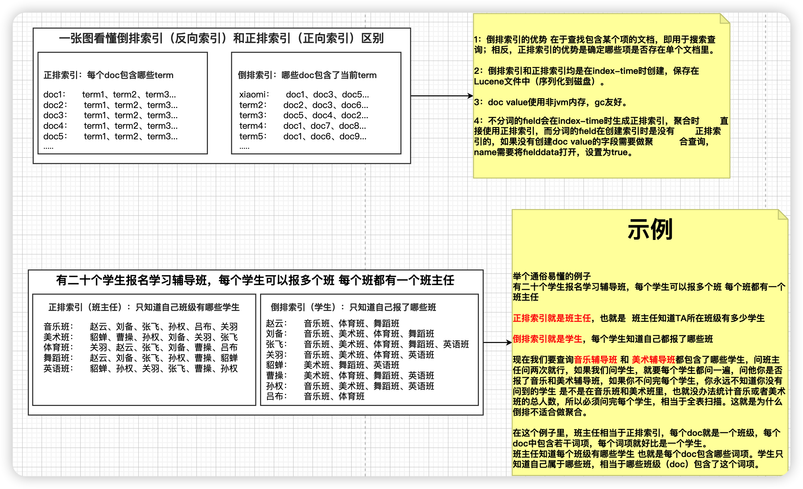

# 前言

## 1、面试突击正确的学习姿势

- 老师在给你讲面试突击的时候，是有课件的，而且是有准备的。
- 你在面试的时候，是没有笔记课件的，而且问题是由面试官提问的，具有一定的随机性
- 面试突击课程的目标不是听懂，而是自己能讲出来，用自己的方式讲出来。
- 要善于将类似的问题，或者同一个问题的不同提问方式整合起来
- 要答案模块化，关联起来，在问一个问题的时候，方便串联其他知识点，从而把节奏带到自己擅长的模块上面去

## 2、要在脑中建立自己的模型

- 要对有共性的问题创建自己回答问题的固有方式
- 知识点不要死记硬背，要有模型的概念。或者回答问题的大纲

## 3、面试突击课程务必精简提要

- 针对面试问题按照频率划分优先级并提炼大纲
- 针对面试问题难度分配学习时间和侧重点
- 针对知识点内容精简知识脉络

## 4、当下 ES 已经不在是一项锦上添花的技能了

- fat kun锦上添花已经变成了刚需

# 一、硬核技能

## 1、查询和检索

### 1.1、ES查询文档的过程是怎样的

答题要点：

- 查询和检索的概念
- 提一提倒排索引
- 分词器分词的过程和发生时期
- 全文检索的概念

### 1.2、精准匹配和全文检索匹配检索的不同

## 2、写入过程和原理

### 2.1、数据的写入过程

ES中的数据写入均发生在Primary Shard，当数据在Primary写入完成之后会同步到相应的Replica Shard。下图演示了单条数据写入ES的流程：¡


以下为数据写入的步骤：

1. 客户端发起写入请求至 node 4
2. node 4 通过文档 id 在路由表中的映射信息确定当前数据的位置为分片 0，分片0的主分片位于 node 5，并将数据转发至 node 5。
3. 数据在node 5写入，写入成功之后将数据的同步请求转发至其副本所在的 node 4 和 node 6 上面，等待所有副本数据写入成功之后 node 5 将结果报告 node 4，并由 node 4 将结果返回给客户端，报告数据写入成功。

在这个过程中，接收用户请求的节点是不固定的，上述例子中，node 4 发挥了协调节点和客户端节点的作用，将数据转发至对应节点和接收以及返回用户请求。

数据在由 node4 转发至 node5的时候，是通过以下公式来计算，指定的文档具体在那个分片的

```
shard_num = hash(_routing) % num_primary_shards
```

其中，_routing 的默认值是文档的 id。

### 2.2、ES 的协议执行如何保障

ES 5.x 之后，一致性策略由 `wait_for_active_shards` 参数控制：

即确定客户端返回数据之前必须处于active 的分片分片数（包括主分片和副本），默认为 wait_for_active_shards = 1，即只需要主分片写入成功，设置为 `all`或任何正整数，最大值为索引中的分片总数 ( `number_of_replicas + 1` )。如果当前 active 状态的副本没有达到设定阈值，写操作必须等待并且重试，默认等待时间30秒，直到 active 状态的副本数量超过设定的阈值或者超时返回失败为止。

执行索引操作时，分配给执行索引操作的主分片可能不可用。造成这种情况的原因可能是主分片当前正在从网关恢复或正在进行重定位。默认情况下，索引操作将在主分片上等待最多 1 分钟，然后才会失败并返回错误。

### 2.3、ES 的写入原理


## 3、性能调优

- 没有任何一种通用的优化策略是适用于所有场景的
- 任何优化手段都是针对特定场景的优化
- 任何技术都会有牺牲 a 来换取 b 这类操作
- 参考阅读：[https://blog.csdn.net/wlei0618/article/details/124104738](https://blog.csdn.net/wlei0618/article/details/124104738)

### 3.1、查询性能调优

参考：https://es-cn.blog.csdn.net/article/details/124104738

### 3.2、写入性能优化

- 高频低量
- 低频高量

### 3.3、通用优化策略

### 3.4、索引数量太多了怎么办，如何优化

- 这里提的是索引数量太多，意思是业务上需要夸大量索引查询，这是关键。

### 3.5、索引中体积太大了，如何优化

- 文档数量大是最常见的问题，但往往不是问题的关键。
- 可以从硬件、集群规模、架构设计、角色分配、索引结构设计、es 资源分配和调度、mapping 的设计优化、字段属性优化、慢查询等维度考虑优化问题
- 索引文档数量级过大英优先从不改变集群架构和索引结构的维度出发、除非其原本设计极不合理导致其是最主要的影响性能的因素

## 4、集群和分布式

### 4.1、分片的理解

### 4.2、高可用策略

## 5、概念性知识

### 5.1、介绍一下 Elasticsearch

#### 相同问题

* **Elasticsearch 是什么**
* **说一下你对 Elasticsearch 的理解**

#### **答题要点**

- 不要从网上拷贝那些答案，一句话就完事儿了。
- 如果能提一提 ES 的历史，发展等，也能从侧面你的经验很丰富。
- 在基本概念基础之上，可以从自己什么时候接触 ES、用了多少年，主要用来解决什么业务、遇到什么问题，你对 ES 应用场景、作用、相关常识等角度来聊，面试官感觉你对 ES 是有深刻认识的，就不会在同一个问题上继续问下去了。如果你说到了自己不熟悉的地方，及时打住即可。
- 官方定义作为一个最近的回答：`Elasticsearch`（后称为 ES ）是一个天生支持分布式的搜索、聚合分析和存储引擎。

#### 相关概念

- 搜索引擎
- 全文检索引擎
- 分部署文档系统
- 分布式数据库
- OLAP系统
- **擅长与不擅长**：ES 最擅长从海量数据中检索少量相关数据，但不擅长单次查询大量数据（大单页）
- **写入实时性**：ES是OLAP系统，侧重于海量数据的检索，而写入实时性并不是很高，默认1秒，也就是ES缓冲区Buffer的刷新间隔时间，不了解Elasticsearch写入原理的同学可以暂时忽略。ES并非忽略了对写入性能的优化，而是“有意为之”，其原因就在于基于 ES 的写入机制，其写入实时性和大数据检索性能是一个二选一的行为。实际上生产环境中我们经常通过“**牺牲写入实时性**”的操作来换取更高更快的“数据检索”性能。
- **不支持事务**：正因为ES的写入实时性并不高，如果我们需要快速响应用户请求，我们常采取的手段就是使用缓存，但是在很多高并发的场景下，我们需要数据保持强一致性（如银行系统），因此需要使用具有ACID特性的数据库来支持，而MySQL就是一个比较好的选择。
- **极限性能**：PB（1PB = 1024TB = 1024²GB）级数据秒内响应。
  PS：有同学问题，老师我们公司集群几百万条数据，ES查询很慢，是不是达到瓶颈了。我只能告诉你，以“亿”为单位的数据量对 ES 来说都只是起点，远远谈不上瓶颈。
- **应用场景**：搜索引擎、垂直搜索、BI、GIthub、

### 5.2、ES支持哪些类型的查询

此题目答案不唯一，按照不同的分类方式，答案也不一样

#### 2.1 按语言划分

- Query DSL：Domain Specific Language
- Script：脚本查询
- Aggregations：聚合查询
- SQL查询
- EQL查询

#### 2.2 按场景划分

##### 2.2.1 Query String

* **查询所有：**
  GET /product/_search
* **带参数：**
  GET /product/_search?q=name:xiaomi
* **分页：**
  GET /product/_search?from=0&size=2&sort=price:asc
* **精准匹配 exact value**
  GET /product/_search?q=date:2021-06-01
* **_all搜索 相当于在所有有索引的字段中检索**
  GET /product/_search?q=2021-06-01
  ```json
  # 验证_all搜索
   PUT product
   {
     "mappings": {
       "properties": {
         "desc": {
           "type": "text", 
           "index": false
         }
       }
     }
   }
   # 先初始化数据
   POST /product/_update/5
   {
     "doc": {
       "desc": "erji zhong de kendeji 2021-06-01"
     }
   }
  ```

##### 2.2.2 全文检索-Fulltext query

```
GET index/_search
 {
   "query": {
     ***
   }
 }
```

* #### match：匹配包含某个term的子句
* #### match_all：匹配所有结果的子句
* #### multi_match：多字段条件
* #### match_phrase：短语查询，

##### 2.2.3 精准查询-Term query

* #### term：匹配和搜索词项完全相等的结果

  * term 和 match_phrase 区别:
    match_phrase 会将检索关键词分词, match_phrase的分词结果必须在被检索字段的分词中都包含，而且顺序必须相同，而且默认必须都是连续的
    term搜索不会将搜索词分词
  * term 和 keyword 区别
    term是对于搜索词不分词,
    keyword是字段类型,是对于source data中的字段值不分词
* #### terms：匹配和搜索词项列表中任意项匹配的结果
* #### range：范围查找

##### 2.2.4 过滤器-Filter

```json
GET _search
 {
   "query": {
     "constant_score": {
       "filter": {
         "term": {
           "status": "active"
         }
       }
     }
   }
 }
```

* filter：query和filter的主要区别在： filter是结果导向的而query是过程导向。query倾向于“当前文档和查询的语句的相关度”而filter倾向于“当前文档和查询的条件是不是相符”。即在查询过程中，query是要对查询的每个结果计算相关性得分的，而filter不会。另外filter有相应的缓存机制，可以提高查询效率。

##### 2.2.5 组合查询-Bool query

**bool**：可以组合多个查询条件，bool查询也是采用more_matches_is_better的机制，因此满足must和should子句的文档将会合并起来计算分值

* **must**：必须满足子句（查询）必须出现在匹配的文档中，并将有助于得分。
* **filter**：过滤器 不计算相关度分数，cache☆子句（查询）必须出现在匹配的文档中。但是不像 must查询的分数将被忽略。Filter子句在[filter上下文](https://www.elastic.co/guide/en/elasticsearch/reference/current/query-filter-context.html)中执行，这意味着计分被忽略，并且子句被考虑用于缓存。
* **should**：可能满足 or子句（查询）应出现在匹配的文档中。
* **must_not**：必须不满足 不计算相关度分数  not子句（查询）不得出现在匹配的文档中。子句在[过滤器上下文](https://www.elastic.co/guide/en/elasticsearch/reference/current/query-filter-context.html)中执行，这意味着计分被忽略，并且子句被视为用于缓存。由于忽略计分，0因此将返回所有文档的分数。

**minimum_should_match**：参数指定should返回的文档必须匹配的子句的数量或百分比。如果bool查询包含至少一个should子句，而没有must或 filter子句，则默认值为1。否则，默认值为0

##### 2.2.6 地理位置搜索

- Geo_point
- Geo_shape

##### 2.2.7 复杂类型查询

- Object
- Nested
- Join

#### 2.3 按数据类型（准确度）划分

- 全文检索：match、match_phrase
- 精确查找：term、terms
- 模糊查询：suggester、模糊查询、通配符、正则查找

### 5.3、简述 ES 分词器的处理过程

#### 9.1 考察要点

- 分词器的组成
- 分词的过程和发生时期
- 全文检索的基本概念 ☆
- 常见的分词器
- 中文分词器

### 5.4、全文检索是什么

### 5.5、索引的理解

### 5.6、角色的理解

### 5.7、ES 支持哪些数据类型

### 5.8、Mapping 是什么

## 6、高频和难点

### 6.1、倒排索引

参考：https://es-cn.blog.csdn.net/article/details/125846561

#### 相关问题

- 全文检索是什么
- ES 是如何检索数据的
- ES 的检索流程是什么

#### 答题技巧

- 基本原理
- 数据结构
- 数据存储和两种压缩算法
- FST 构建的理论模型
- FST 在源码中实现的大致步骤

FST 模型


### 6.2、Master选举

#### 和选举相关的角色

- **主节点（active master）**：一般指的是活跃的主节点
- **候选节点（master node）**：具备 `master`角色的节点默认都有“被选举权”，即是一个候选节点。候选节点可以参与Master选举过程
- **投票节点（master node）**：每个候选节点默认都有投票权，即每个候选节点默认都是一个投票节点，但如果配置了“voting_only ”的候选节点将只有选举权而没有被选举权，即仅投票节点。
- **专用主节点**：即 node.roles: [master]，一般指的是只保留master角色的候选节点。
- **仅投票节点**：即 node.roles: [master, voting_only] 指仅具备选举权，而被严格了被选举权的master节点。

#### 节点失效监测机制

在源码的描述文件中有这样一段描述：

```
There are two fault detection processes running. The first is by the
master, to ping all the other nodes in the cluster and verify that they
are alive. 	And on the other end, each node pings to master to verify if
its still alive or an election process needs to be initiated
```

- NodesFaultDetection：即 NodesFD，用于定期检查集群中的节点是否存活。
- MasterFaultDetection：即 MasterFD，作用是定期检查 Master 节点是否存活。

  

#### 何时触发选举

- 活跃master节点数量小于法定票数
- active master挂掉

#### 选举流程


#### 脑裂问题

- 何为脑裂：无主或多主
- 解决办法：discovery.zen.minimum_master_nodes=N/2+1，N为有效投票节点数。

### 6.3、评分算法

参考：https://es-cn.blog.csdn.net/article/details/124811138

#### 评分基本原则

#### 三个基本维度

- 词频（TF：term frequency ）
- 反词频或文档频率（ IDF：inverse doc frequency）
- 文档长度规约（field-length norm）

#### 两种评分算法

- TF-IDF：空间向量模型
- Okapi BM25：相关度概率模型

#### 答题要点

- 不比把函数公司记下来
- 要知道两种算法的相同点和主要区别在于什么
- 要知道使用 _explain API
- 要知道两种算法的建模模型

### 6.4、脑裂问题及解决

### 6.5、MySQL为什么不适合做全文检索

#### 6.5.1 同类问题

- 海量数据的技术选型
- ES 和 XX 数据库的区别
- 你们为什么不用 XX 而选用 ES

#### 6.5.2 回答要点

- 问题的核心在于对 ES 的应用场景的理解
- 可以从业务和技术两个角度来回答
  - **业务上**：介绍一下 ES 在哪些业务场景下使用，引出全文检索的概念，对比检索和查询概念上的区别，讲述 ES 为什么适合全文检索。可以引出一系列自己的理解
  - **技术上**：讲一下主流数据库底层数据结构的理解和对比，如果面试官没有明确指出和哪个对比，就说自己擅长的。比如 MySQL、Mongo、Solr 等。

### 6.6、**什么是深度分页？如何解决深度分页问题**

- 问题原理解释
- 深分页的危害
- max_result_window 参数
- 解决手段
  - 避免深度分页
  - A 端业务使用 Scroll Search
  - C 段业务采用 Search After

参考阅读：[(34条消息) ES 深度分页问题及针对不同需求下的解决方案（Deep paging）_es深度分页_Elastic开源社区的博客-CSDN博客](https://blog.csdn.net/wlei0618/article/details/120800632)

### 6.7、正向索引是什么，和倒排索引（反向索引）有何区别

#### 6.7.1 一张图解释原理



#### 6.7.2 答题要点

- 正向索引：文档到词项的映射
- 反向索引：词项到文档的映射
- 正向索引的两种数据结构：fielddata、doc_values

#### 6.7.3 扩展理解


## 7、开放性问题

- 你们公司的技术架构是如何的
- 让你构建一个满足 XX 要求的搜索服务，你如何实现

# 二、软实力

## 1、简历

### 简历要简洁美观、突出重点，HR是你的第一关。

简历模板：[https://www.100chui.com/moban/](https://www.100chui.com/moban/)

### 适当包装 ≠ 欺骗

- 工作年限
- 技能水平
- 履历
- 项目经历

## 2、心态

有不懂的很正常，面试官问的，也许只是他擅长的。

### 自信、大胆、勇敢！

1. 面试当成是聊天，不要当做考试。
2. 要薪资不要怂，给自己加价保底30%，切忌自降身价。举一个真实的例子，8-10-12
3. 有问题答不上来也不要紧张，有的同学面试一有问题答不上来就否定自己，甚至脸涨的通红，想找个地缝钻进去，觉得自己好丢人，大可不必这么想，你不是彭于晏也不是吴彦祖，你来面试没人认识你，面试的再不好，结束之后你离开公司用不了十分钟就没人会再记得你。你想，试官一天要面试的人可能有好多，每个月要面试几十上百人，他怎么可能把你记得那么清楚。所以不管你面试的过程中出现任何问题，完全没必要胆怯，此处不留爷自有留爷处，这家不行，咱们 Next one，公司千干万，是金子总会发光，不是金子总有眼瞎的。

### 尽可能往自己会的方向引导

## 3、形象

注意自己的形象和言语谈吐

你和面试官是初次见面，言语要稳重些，不要过于轻浮，能不开玩笑就不要开玩笑。面试面的不仅仅是你的技术夹力，还有你的领导力、人品、和颜值（我们尽量不要以貌取人，但是不排除别人会以貌取人），因此发型要干净得体，不要穿的过于正式或随便，不要发型搞的太夸张，比如男生扎小辫、披肩发，就算你技术非常牛逼，技术面试官非常青睐你，你有可能栽在HR手里。我这里没有对弄这些发型的同志们有成见的意思，就是一个提醒，如果是真的喜欢，可以入职以后，想怎么搞怎么搞。

## 4、沟通

### 如何看待加班问题

如果面试官问到，你如何看待加班问题，千万别把话说的过于绝对，比如有加班费就行，或者直说拒绝加班，说法律上说的怎样怎样，首先如果你还想在一家公司待下去。国家在面对一些问题的态度上仍尽量采取和平手段，你觉得你会比国家更加明智吗？凡是寻求稳妥。

当然我也不是说让你无底线的接受加班，说我可以随时加班，加班到随时，加班使我快乐，我爱加班。如果面试官问你何为高强度，以自身感觉是否会熬坏身体为理由，别回答的太绝对，比比如回答 996就是高强度或者—天超过 x小时就是高强度，记住一点，任何问题，除了期望薪资，都别回答那么绝对，别给面试官一种过了这条线就不行那种感觉，相亲的时候，如果你想找个肤白貌美的，170的。100斤的，月入2W的，本科学历的，独生子的，假如身高165矮了S厘米，或者体重105重了五斤，但是美的不可方物，你就
坚决不要么？所以不要给面试官这种感觉，低于170的坚决不要，就是不要给他一个明确的界限，只要不在某一方面过于偏科就行），但是接受高强度的紧急加班。那些说只要工作效率低的人才会加班，效率高的都会在8小时工时之内完成任务的人话说的可能也有些片面了。首先除了部分国企或外企之外互联网公司多多少少都是存在加班现象的，这是你没得选择的，合理的加班也是可以理解的，公司养一个员工确实成本也挺大的，要为你缴纳高额的社保还有企业所得税等，作为决策者他不得不为成本去考虑，为人者知谦卑、懂感恩、有胸怀。说心里话，我们之中相当一部分人得到其实是大于其为公司带来的价值的，所以其实有时候不仅人与人之间要学会换位思考，人与企业之间也要学会换位思考，你事事为公司着想，老板不会看不到的。所以面对加班，正确的答案应该是，对手平日里的一定量加班，我们也应与理解，不要老是死磕那一二十块钱的加班费，不仅显得你格局小，而且有那个时间，不如去提升一下自己的硬实力，提高自己的价值。其次面对如项目上线、突发状况的加班，即便是可能是需要通宵，比较辛苦，也是可以接受的，不要除了抱怨还是抱怨。

最后就是面对高强度的日常加班,「我说过，员工和企业要学会换位思考，既要有为公司奉献的觉悟，也不能被公司过分压榨。因为我们作为员工如果事实为公司考虑，比如牺牲了自己爱人、子女的时间换来的是无休止的压榨，如007（—天12小时，一周工作七天成为了日常），那可能最终熬坏了身体还不落好，这种情况不用想，绝不接受，身体是革命的本钱。赚再多的钱，也需要得有命花。

总结一下加班的正确答复：原则上是拒绝无休止的高强度日常加班（何为被问高强度我刚才己经教你怎么说了），但是如果公司有突发状况如项目上线，需要高强度加班是完全可以理解的，这也是我觉得一个合格的开发应该有的觉悟吧（这里注意说话的语气和言辞以及方式）。

PS：不针对面试，就说说咱们自己应该如何看待加班。不要把加班看成一种吃亏，对于没对象的同学，仔细想想，你下班回去可能无非就是处理一些杂事儿、或者玩游戏、追剧。如果你是想追求更高目标的，可能公司也许有更好的学习环境和氛围，即便你完成了领导要求的任务，不如多思考一下哪些东西可以做的更好或者哪些东西是将来有可能需要的，即便现在可能用不到，你也可以借此来尝试一些自己想要学习的技术，比如之前的方案采用的是基于MySql的方案，思考一下是否采用ES效果更好，有了想法就是学，就去做。一般来说公司也都会愿意为你提供一些资源，比如你的测试机应该完全够你部署一些你学习过程中需要的服务。就算没有也可以
想方设法的搞一些环境，比如阿里云有提供学习用的低配ECS，每年只需要100块钱。是在不行在你的PC上也可以搞，搞几台虚拟机搭个集群自己随便搞有啥不好，只要你想学，什么都拦不住你，等你的实验项自落实了，完全可以做个测试拿出个方案出来，比如你测试了使用MySal和ES两种的搜索方案的性能对比出来，如果有理有据，并且愿意分享成果，相信你的领导也愿意支持你，即便这东西现在用不上，但是如果哪天突然领导提出了这样的需求，你高速领导，这事儿我已经做好了，你看。你觉得公司会不喜欢这样处处为公司着想的是工么。你不但学到了东西，而且还把握住了机会，如果将来有晋升的名额，你你也许就有机会。但是要记住一点就是有任何功劳都要记得与别人分享，尤其是你的直系领导，这是在某领导的英明决策和指挥以及全力支持下，有你去落实的。不然就算你的能力是货真价实的，可能也会被埋没，其实看起来是你的功劳被别人占了便宜，其实是你占便宜了。因为你只有把利益和别人扯上关系，别人才会主动帮你推这件事儿。并且你懂得分享功劳，领导如果升迁，难道它的位置第一个想举荐的不肯定就是你吗？这其实也是良性循环，你想得到的得到了，你为公司带来了价值，公司给你了更大的施展空间。即便事情没有这么理想，你在公司没有遇到这样的机会，你至少也是学到了东西，你做的东西在以后的面试中、工作中可能都用得到。换个角度，你会发现一大片天空。

### 为什么从上一家公司离开

可行理由

- 公司黄了，但如果你是从大公司离职的，就不要用了，尤其是大家都知道的大公司。
- 公司地址变变更了离家太远
- 由于不得已的原因，公司调任你去其他城市组件团队，但是考虑再三还是没办法答应。

可行

- 可以称赞上家公司

禁忌

- 指责和抱怨上一家公司或者领导
- 不要说自己是被裁了，如果离职证明上有，可以去仲裁

### 如何面对不会的问题

- 有不懂的很正常，面试官问的，也许只是他擅长的。
- 不是明确知道答案的问题，避免正面回答，这时聊一些相关性的知识点，劲儿把话题51导到自己会的知识上去，但是不要天马行空，说话完全不着边际
- 学会如何绕开话题，把话题带到自己会的知识上来。
- 遇到真的完全没遇到过的问题，先别着急说不知道，面试官有时候只是想听听你是如何思考和解决问题的，不一定要你现场就得解决问题，如果确实完全无从下手，大大方方的承认，任何人不可能面面俱到，有没接触过的东西很正常，但是说话要注意方式，不要直接说这个我不会。当然这是在前面几点没办法解决的前提下，如果问什么都是无从下手，那还是得从提升自身技能着
  手了。

### 真正的智者，知进退，懂隐忍。

面试是一个展示自身技能的过程，但是对于目前岗位够用就行，不要过于发挥，着急的表现自己的技术，你比面试官强的那部分能力是要留着给老板或者更高的领导看的，可以等入职之后再去展示。凡事留三分余地，做人留一面，来日好相见。你现在生杀大权在面试官手里，如果你表现的压他一头，好像要多她饭碗似的，他岂能留你？不可能每个面试官都是胸襟宽广的，害人之心不可有，防人之心不可无。想想曹冲怎么死的。莫让英雄无用武之地，凉了你的赤胆雄心，负了你满腔抱负，惜了一身的才华，英雄无用武之地。

## 夯实基础，修炼内功，把功夫用在平时。

是金子总会发光，我们不能总是指望遇到膳子。面试就像相亲，即是老板选你，也是你选老板。都是双发对彼此有个初步的认识。试用期就是在谈恋爱，都是在彼此发现问题以及解决问题的过程， 谈得来就淡，谈不来就散，能不能转正，基本还是要看你自己。但是如果谈不来，损失更大的是你自己，因为公司可以在招一个，而你的经历就会被写在履历里，想改也改不掉。

## 其他

### 遇到特别想去的公司

如果有特别想去的公司，很多同学就因为他别想去，而过于担心如果进不去怎么办，反而自乱阵脚。
首先如果有目标特别明确的，特别想进的公司，首先根据提供的)D，做足准备，可以先去其他公司找找多试试，如果成了，那就是给
自己多留了几个后手，最后再去想去的公司，第一是短时间内的多次面试已经给自己发现了很多问题，也为自己补充了很多面试经
验。第二是自己在自己手里已经有offer的时候，再去面试日标公司，那心里就会更加有底，就算进不去也不至于没有公司去，当然后
手准备的越多越好，手里offer越多，面试就越不慌，心态就越平和，越容易正常发挥不会被紧张左右情绪

### 最好有大厂履历，大厂经历是一张不错的名片。

### 勿频繁跳槽。

## 考一个Elastic认证工程师证书

## 职场法则

# 三、面试技巧

## 1、语言表达能力

世界上最难的两件事

- 把别人钱装进自己的口袋：老板
- 把自己的思想装进别人的脑袋：老师

多读一些名人典籍

- 出口成章，用典故来佐证你的观点更有说服力

太阳底下前没有新鲜事

- 你今天经历过的所有事情，在历史上都曾经发生过
- 很多老话能流传至今，必有其深刻的道理而广为流传，你不赞同说明你没有真正读懂

## 2、把控面试的节奏

## 3、注重思路而不是答案本身

## 4、避免正面回答

除非是有特别明确答案的问题，否则不要给出有明确边界条件的答案，人性总是容易放大你的错误，爱因斯坦曾经在给一群小学生讲课的时候，做了十道很简单数学题，做对了 9 道，最后一道题做错了马上就被很多人指正，因为在别人看来，作对是利索应当的，而做错一道，就会对你整体产生不利影响，作对了 9 道你不算厉害，你做错一道就是有问题。

## 5、除了常识性问题之外，回答问题要有思考时间

除了常识性问题之外，回答问题要有思考时间。在 B 有很多自称 10 年架构师伪装小白面试，问的问题不到一秒中就能说出 1234567 条回答，而且逻辑清晰，只能是提前准备了台本，背的答案。

即便是天天在用的东西，也需要时间来整理逻辑。所以凡是回答问题，就算你是背的，也要伪装成经过了思考而得出的答案。不要上来就背八股文。

## 6、同一个问题可能有多重不同的表达形式

# 四、职业生涯规划和分析

## 1、行业现状和自我状况分析：知己知彼


### 行情是由市场供需关系决定的

### 蓝海和红海

## 2、什么样的人不容易被优化

**导师招学生：**

- 当官有钱的：解决的是社会关系问题
- 商人企业家：解决买单问题
- 年轻漂亮的：解决的是问题
- 真正做学位的：衣钵香火问题

**老板找员工：**

- 能解决问题的替领导分忧的
- 能给公司赚钱的
- 有资源的或渠道的
- 老板的小舅子

**自己的发展方向**

## 3、自身应该朝那个方向努力

**误区**

- 努力不是拼加班时间
- 努力不是拼谁干的活儿多

**方向**

- 专业素养：更强的专业技术能力
- 硬实力：各类高含金量证书、
- 如何发展副业。