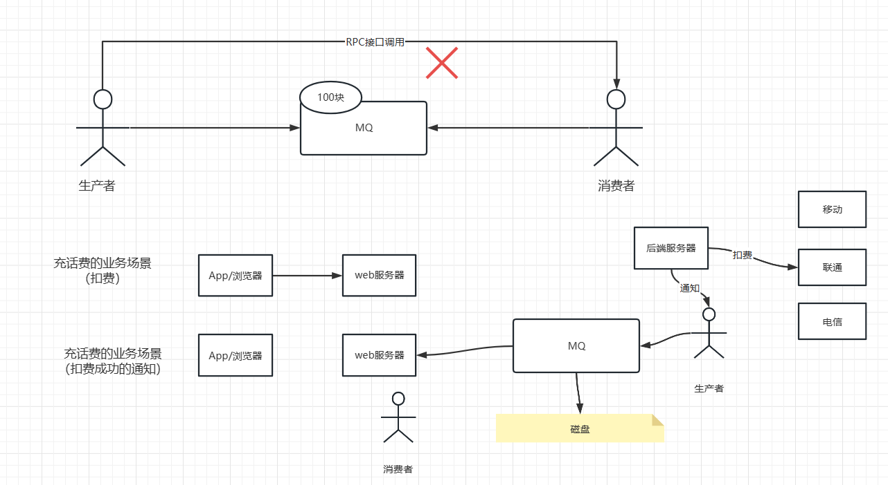

# MQ面试知识体系


# 1、什么是消息队列？为什么要使用消息队列

MQ：Message Queue 消息队列/消息中间件

异步的通信方式。

Why？

异步 + 解耦 + 削峰填谷（流量削峰）



> 直接通过RPC远程调用，但是这样会有依赖，一旦消费者挂了，可能会导致消息丢失等问题
>
> 加入队列

# 2、常见的消息队列有哪些？它们之间的对比

ActiveMQ（被淘汰）\ RabbitMQ \ RocketMQ \ Kafka \ Pulsar

RabbitMQ\RocketMQ\Kafka进行对比

**都是分布式消息系统，都支持消息发布-订阅模型，具有高吞吐量，可靠性、可伸缩性。**

|                        | RabbitMQ                                         | RocketMQ               | Kafka                            |
| ---------------------- | ------------------------------------------------ | ---------------------- | -------------------------------- |
| 协议                   | AMQP                                             | 自定义                 | 自定义                           |
| 性能（单台标准服务器） | 1.2w/s                                           | 十万级别               | 百万级别                         |
| 开发语言               | Erlang                                           | java                   | scala+Java                       |
| 多语言支持             | 支持多种编程语言，包括Java，Python，Ruby，等等。 | 只有java               | 非常多\C                         |
| 持久化支持             | 支持（性能会下降比较多）                         | 几乎没有影响           | 几乎没有影响                     |
| 消息顺序               | 不保证顺序                                       | 严格的消息传递顺序     | 不保证全局排序，同一个分区下有序 |
| 消息保存               | 默认使用磁盘存储                                 | 可配置持久存储活不持久 | 消息保存在磁盘上                 |
| 可伸缩性               | 通过集群来扩展，支持水平扩展                     | 通过增加代理来扩展     | 通过分区实现扩展性               |
| 社区支持               | 有庞大的社区                                     | 社区支持相对较小       | 有庞大的社区                     |

综合评估：

RabbitMQ 管理后端 最好，稳定，缺点：Erlang语言，并发不是那么高！！！、扩展性能（集群并不能提高性能）

RocketMQ：电商系统（阿里开发）、Java开发 看源码

Kafka：流式处理 + Spark， Flink, 缺点：配置、运维要求比较高

**总而言之，选择合适的消息系统取决于具体的业务需求和对系统的期望，需要考虑有关性能，顺序性，可伸缩性和持久性等方面的因素。**

# 3、使用消息队列有什么优点？有什么缺点？

优点：

1）异步 + 解耦 + 流量削峰

2）异步可提高性能

3）提高稳定性

缺点：

系统复杂性：MQ 配置， 调优。

网络 最好在局域网中

一致性问题

> **chatGPT答案（比较全）：**
>
> 优点：
>
> 1. 异步处理：消息队列可以使系统从同步处理转变为异步处理，从而提高系统的并发性和吞吐量。
> 2. 解耦合：由于不直接依赖其他组件，消息队列可以将系统内的各个组件解耦，提高系统的灵活性和可维护性。
> 3. 削峰填谷：消息队列可以在流量高峰时缓存数据，避免对底层系统造成过大的压力，同时可以在低流量时逐步处理数据。
> 4. 提高可靠性：消息队列可以提高系统的可靠性，一旦某个组件发生故障，消息队列还可以保证消息不会丢失，从而确保系统的稳定性。
>
> 缺点：
>
> 1. 复杂性：消息队列需要建立端到端的流程，从发送消息到消费消息，需要考虑到各个步骤中可能发生的各种意外情况。
> 2. 维护成本：由于需要维护消息队列，包括配置，消息传输记录，重试机制等，增加了系统的维护成本。
> 3. 实现复杂性：由于不同的消息队列实现有不同的特性和组件，开发人员需要了解这些特性，才能选择最适合自己业务的消息队列，从而增加了实现的复杂性。
> 4. 数据一致性：如果使用消息队列进行消息传递，且处理消息的过程非常复杂，则需要特别小心，以确保数据在所有组件中保持一致。


# 4、RabbitMQ中的AMQP是什么？

AMQP代表高级消息队列协议。它是一种用于消息传递的二进制协议，用于在分布式应用程序之间传递消息。 RabbitMQ是一个使用AMQP的开源消息代理，它充当了消息传递的中间件，允许应用程序之间进行异步通信。 AMQP定义了如何将消息传递到代理和从代理中检索消息，以及如何处理这些消息。 RabbitMQ使用AMQP来确保消息可以安全地传递并按预期进行处理。


# 5. Kafka的核心组件？工作流程是怎样？

**Kafka 的核心组件包括：**

1. Producer（生产者）：负责向 Kafka 指定的 topic 发送消息。
2. Consumer（消费者）：从 Kafka 指定的 topic 上获取消息，并进行相应的处理。
3. Broker（代理）：消息队列的服务器，负责接收和分发消息。
4. Topic（主题）：消息被发布到主题，消费者订阅主题以接收消息。
5. Partition（分区）：每个 topic 可以被分为多个 partition，每个 partition 对应一个文件。
6. Offset（偏移量）：每个 partition 中的每条记录都有一个唯一的偏移量，用来表示该记录在 partition 中的位置。

**Kafka 的工作流程如下：**

1. 生产者将消息发送到 Kafka 集群中的一个 Broker 节点。
2. 主题根据一定的规则将消息分发到多个 Partition 中。
3. 消费者通过指定消费的主题以及特定的 Partition 来订阅主题，并从中获取消息。
4. 消费者从 Kafka 获取消息时，会不断地向 Broker 发送请求，询问是否有新的消息可供消费。
5. Broker 将消息返回给消费者，消费者处理完消息后通知 Broker 可以将 offset 向下移动，并获取下一条消息。
6. 如果有新的消费者加入，Broker 会再次重新分配 Partition，以保证数据的负载均衡。

# 6、RocketMQ的核心组件？工作流程是怎样？

RocketMQ的核心组件包括Producer（消息生产者）、Broker（消息中介，也是消息存储和路由的节点）、Consumer（消息消费者）和Name Server（命名服务）。

RocketMQ的工作流程如下：

1. Producer将消息发送到Broker，包括消息主题、标签、消息内容等信息。
2. Broker将消息存储在内存或磁盘中，并返回消息存储的结果给Producer。
3. Name Server负责维护Broker的名称、地址信息和主题的路由策略信息。
4. Consumer通过与Name Server交互获取各个Broker的地址信息以及主题的路由策略信息。
5. Consumer向Broker发送消息拉取请求，并获取消息。
6. Broker收到消费者请求后，返回消息给Consumer。
7. Consumer拿到消息后进行消费处理，消费处理完成后向Broker确认消息消费完成。
8. 同时，RocketMQ利用commit log和consume queue等机制确保消息的顺序性和可靠性。

# MQ解决方案面试题

# 1、RabbitMQ如何做到消息不丢失？


① 确保消息到MQ

② 确保消息留有到正确的队列

③ 确保消息在队列正确的存储

④ 确保消息从队列中正确的投递至消费者

**1、分析第一个，生产到MQ  怎么确保不丢失消息。**

原因：网络的波动

解决方案：加一个发送确认的回调通知

**2、路由失败导致的消息丢失**

原因：路由的键值不匹配

解决方案：

1) 路由交换失败的通知
2) 备用交换器（不怎么常用）

**3、持久化**

1) 交换器要持久化
2) 队列自身也要持久化
3) 消息自己也要持久化

**4、 默认的消费者，自动提交（除了发生一些异常之外）**

希望消费者要自己来控制

处理方式：手动确认

# 2、Kafka如何做到消息不丢失？

Kafka 通过将消息持久化到磁盘上来确保消息不会丢失。具体来说，Kafka 的消息存储设计为多个概念上的分区，每个分区都有多个副本。

当消息被写入到 Kafka 集群中的某个分区时，它会被写入所有的副本中，这些副本会分布在不同的 Kafka 节点上。如果某个节点故障，消息仍然可以从其他节点的副本中读取并保证不会丢失。

同时，Kafka 还通过追加写入的方式来避免消息被覆盖或删除，保证了消息的完整性和可恢复性。

# 3、RocketMQ如何做到消息不丢失？

1、生产发送的时候 — 要用有返回值\回调的方法 —— 进行ACK 确认 + 发送重试

2、消息的持久化 —— kafka、RocketMQ 都有持久化

3、通过主从、集群的方式确保 发生了单点故障（其中一台宕机了），消息不会丢失，因为有备份

4、消费—— 手动确认。—— kafka、RocketMQ 对比RabbitMQ不同

kafka和Rocket 消费了，提交消费的偏移量（消息一般不会删除 --- 消息删除  一般交给后台的一个单独的线程 执行定时清理策略）

kafka Rocket 就算消息漏掉了，回溯 --- 指定一个消费者  ---- 指定对应的偏移量

producer1 -> topicA  100条。-> consumer 消费  群组消费。 --- 后台系统发现有个消息丢了。（Rocket、Kafka 还有这条消息）

key ----> 代表唯一性ID  ---- order_id = 13

创建一个独立消费者   配置：topicA 指定key=13 单独拉出来，再来消费

始终消费不了 --- 100次，死信消息（Rocket 16次失败， RabbitMQ 配置策略 --- 死信）单独手动处理

# 4、RabbitMQ、Kafka和RocketMQ如何确保消息不重复消费？

MQ自身是没有办法去确保消息不重复。

MQ收到两条一模一样的消息（order_id=13、、、）(order_id=13、、、)

--- 遇到这种情况，做幂等性处理

**1、MVCC方案（对业务有侵入，一般不推荐）**

多版本并发控制

(order_id = 13 goods_id = 1 version_id = 1,,,,,) ,  (order_id = 13 goods_id = 1 version_id = 1,,,,,)

模拟MySQL的操作（消费端） -- 扣减库存

```sql
update goods set count = count - 1, version_id = version_id + 1 where goods_id = 1 and version_id = 1
```

**2、去重表的方案（优先）**

MySQL定义一张表 goods_unique（id  唯一性索引）

insert goods_unique (order_id = 13)

如果插入成功，则执行下面sql

update goods set count = count - 1 where goods_id = 1

2.1 使用Redis 中的Set集合 代替唯一性的表。 --- 如果Redis的压力不大，就可以不用设置失效时间。压力大的话就定期清理

> ChatGPT答案：
>
> 1. RabbitMQ:
>
> RabbitMQ使用消息确认机制实现消息不重复消费。消费者从队列中获取消息后，必须在处理完消息后发送确认来告诉RabbitMQ已经处理完毕，RabbitMQ接收到确认后便会将该消息从队列中删除。
>
> 如果消费者在处理消息时出现了异常，可以通过设置消息的重新投递次数和重试时间来避免重复消费。
>
> 2. Kafka:
>
> Kafka使用位移（offset）来确保消息不重复消费。消费者从特定的分区（partition）中获取消息后，会将位移记录下来。当消费者重新连接时，会从位移位置开始获取消息，确保不会重复消费之前已经处理过的消息。
>
> 如果消息消费失败，Kafka支持手动提交位移，消费者可以根据需要决定是重试消费还是放弃该消息。
>
> 3. RocketMQ:
>
> RocketMQ使用消息消费进度记录（Consumer Offset）来确保消息不重复消费。消费者从队列中获取消息后，会将消费进度记录下来。当消费者重新连接时，会从记录的消费进度开始获取消息，确保不会重复消费之前已经处理过的消息。
>
> 如果消息消费失败，RocketMQ支持手动提交消费进度，消费者可以根据需要决定是重试消费还是放弃该消息。

# 5、RabbitMQ、Kafka和RocketMQ如何确保消息顺序？

RabbitMQ、Kafka和RocketMQ都是主流的消息中间件，可以支持消息顺序传递，具体如下：

1. **RabbitMQ:**

RabbitMQ 默认支持消息顺序传递。如果将多个消息发送到相同的队列中，则RabbitMQ会按照发送的顺序将这些消息依次发送到消费端。

2. **Kafka:**

Kafka 通过分区（partition）来分布式存储消息，并为每个分区维护一个本地顺序。在同一个分区中，消息的顺序是有序的。如果需要保证不同分区的消息顺序，需要将它们分发到同一个消费者或者消费者组。

3. **RocketMQ:**

RocketMQ通过发送消息时的顺序标记（顺序消息或者无序消息）来保证消息的顺序。如果消息标记为顺序消息，则RocketMQ会将其按照消息发送的顺序依次发送到消费端。同时，RocketMQ也支持为队列设置顺序消息消费失败重试和定时重试机制，来确保顺序消息的可靠性。

# 6、延时消息在各种MQ的实现？延时消息的运用场景

**延迟消息**

**他不是消息堆积 导致的。正常 生产和消费的速度能够匹配上。**

买电影票。 ----- 美团  ---》 电影1  --》 选座（锁定座位之后......）  ---》15分钟之内付款

1、超过了15分钟，座位取消

后端处理：轮询数据sql 查询 -->  MySQL (order 订单表 status 是未支付状态, time 超过15分钟。把锁定的座位释放出来，修改订单状态！！！)

sql ---》 表  10万。定时器：10s执行一次。执行频次高，MySQL压力大。如果频次低，那就不及时了！！

2、用到延迟消息\定时消息

----- 美团  ---》 电影1  --》 选座（锁定座位之后......） 推送一条延迟消息到MQ，15分钟消费者才能拿到

消费者（专门处理未支付需要释放座位的业务）---》判断订单是否支付

1) 已经支付，提交

2) 未支付，取消订单。取消座位锁定。

自身支持，RabbitMQ、Rocket都支持。Kafka不支持

可以使用Java自带的延迟队列（DelayQueue）

# 答疑：

## 1. redis做幂等简单问题

Q：redis做幂等性检查时，往Set集合里面插入的时候，设置失效；这个失效时间是整个set的还是单个元素的

A：Redis中的key ttl 只针对整个key，不能针对set中的一个元素。Redis 内部不足

key -- 带上日期。set 集合就不会很大

## 2. 大批量消息堆积怎么处理？

分析原因：

秒杀 高并发，，提前预案。突发 ---- 管理系统 -- api --- 监控   消费偏移量  对比生产  偏差很大。堆积

分析 --- 消费者  -- 卡死  导致消费堆积。消费者上不去 --- 动态扩容。

topic --- 4queue ---> 消费者 + 生产者  ---> newTopic  16 queue 同时支持16个消费者运行。

Topic  -- add queue的主题。

## 3. 扩容后会分区在均衡吧？会导致顺序问题吗？

**MQ中不可能兼顾顺序和性能**

MQ扩容后，如果分区设计合理，是可以实现分区均衡的。在消息队列系统中，分区均衡的核心是使得不同分区中的消息数量尽量相等，从而确保消息的高效处理。

在分区均衡的过程中，可能会发生一些顺序问题。例如，如果某个消息在分区A中被生产出并发送到分区B中处理，那么它的处理顺序可能会受到影响，无法保证消息在发送的先后顺序与接收的先后顺序完全一致。为了解决这个问题，我们可以采取一些特定的措施，例如消息队列中的消息序列化，这可以帮助我们确保消息在发送和接收时的顺序完全一致。

# 4. MQ扩容要暂停业务吗？

MQ扩容需要在系统运行期间进行，可能会对系统的性能和稳定性造成影响，因此建议在低峰期进行扩容。一般情况下，可以通过分批次逐步扩容的方式，避免暂停业务。但具体情况需要根据系统架构和业务量来确认，如果必须暂停业务进行扩容，应提前通知相关用户和客户，并尽可能缩短暂停时间，减少影响。

