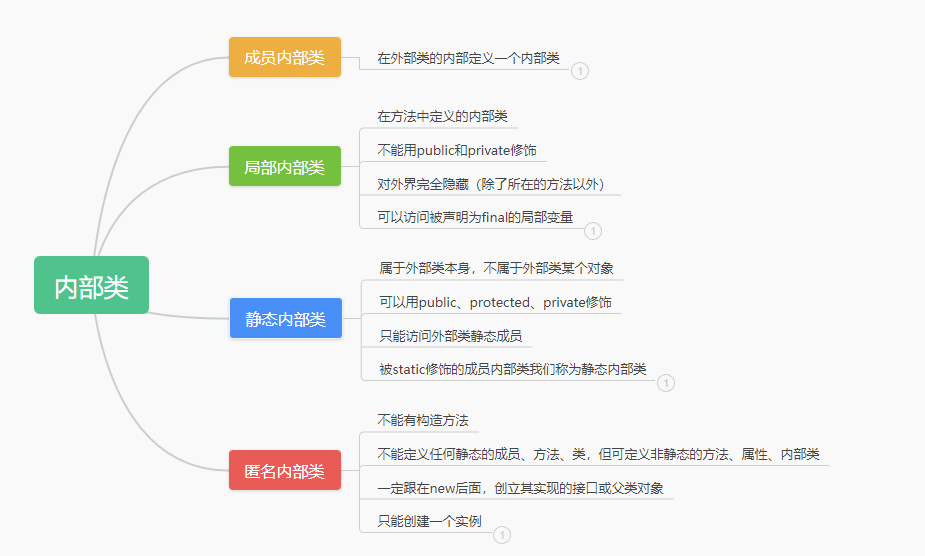
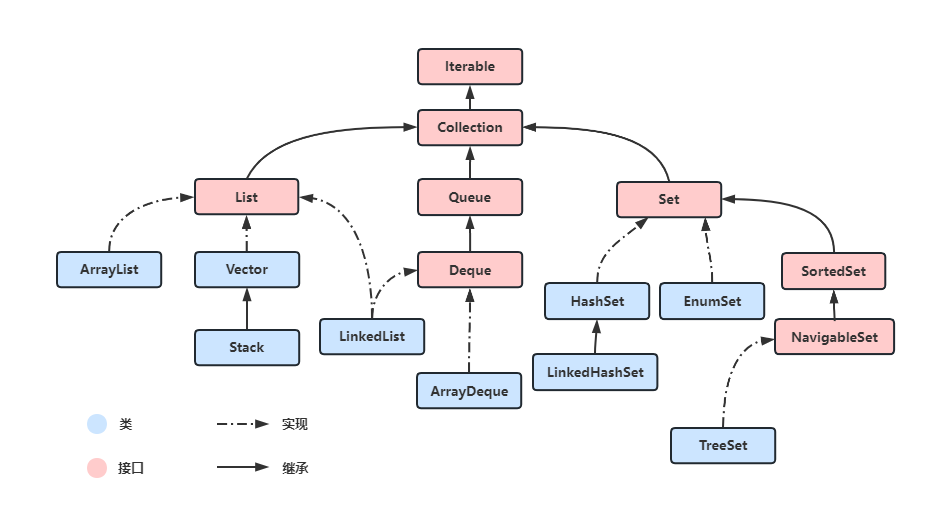
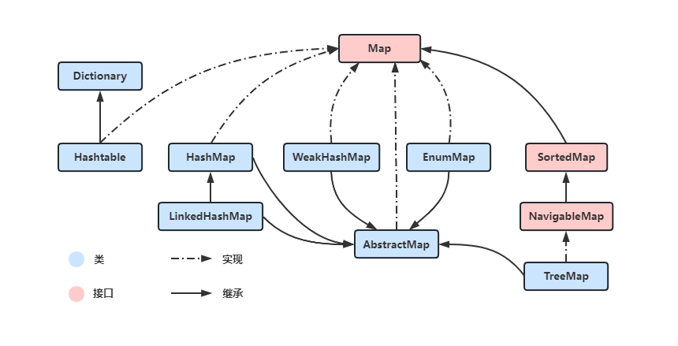
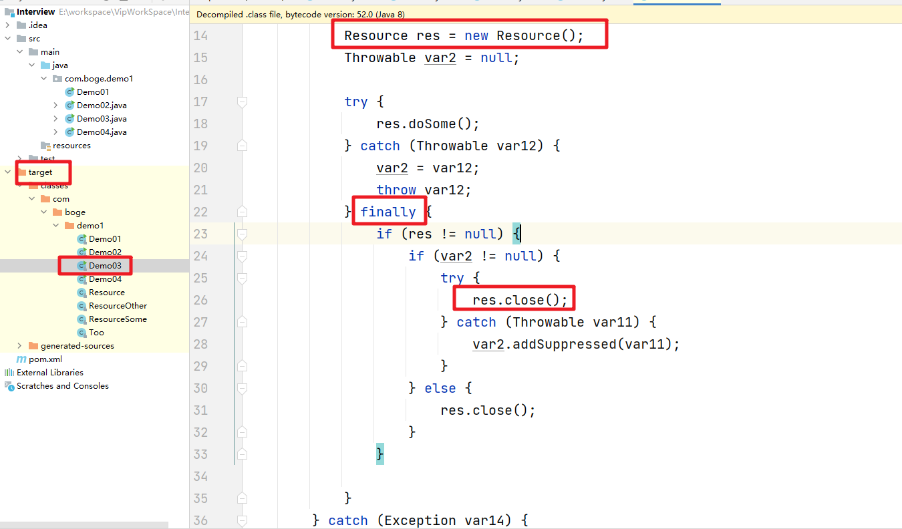
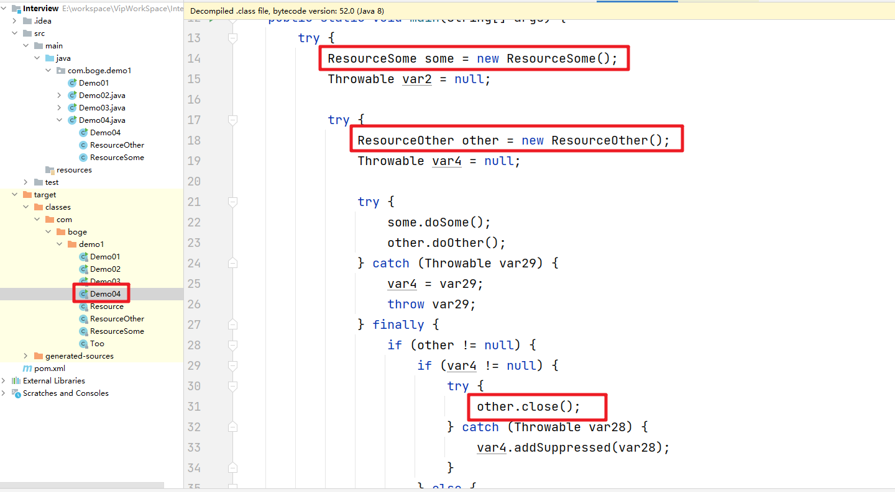

# Java基础面试题

https://cloud.fynote.com/share/d/qPGzAVr5

# 一、面向对象和集合专题

## 1. 面向对象和面向过程的区别

**面向过程**：是分析解决问题的步骤，然后用函数把这些步骤一步一步地实现，然后在使用的时候一一调用则可。性能较高，所以单片机、嵌入式开发等一般采用面向过程开发

**面向对象**：是把构成问题的事务分解成各个对象，而建立对象的目的也不是为了完成一个个步骤，而是为了描述某个事物在解决整个问题的过程中所发生的行为。面向对象有封装、继承、多态的特性，所以易维护、易复用、易扩展。可以设计出低耦合的系统。 但是性能上来说，比面向过程要低。

OOP和AOP

## 2. 介绍下Java中的基本数据类型

| 基本类型 | 大小(字节) | 默认值       | 封装类    |
| -------- | ---------- | ------------ | --------- |
| byte     | 1          | (byte)0      | Byte      |
| short    | 2          | (short)0     | Short     |
| int      | 4          | 0            | Integer   |
| long     | 8          | 0l           | Long      |
| float    | 4          | 0.0f         | Float     |
| double   | 8          | 0.0d         | Double    |
| boolean  | -          | false        | Boolean   |
| char     | 2          | \u0000(null) | Character |

boolean: int 4个字节

需要注意：

1. int是基本数据类型，Integer是int的封装类，是引用类型。int默认值是0，而Integer默认值是null，所以Integer能区分出0和null的情况。一旦java看到null，就知道这个引用还没有指向某个对象，再任何引用使用前，必须为其指定一个对象，否则会报错。
2. 基本数据类型在声明时系统会自动给它分配空间，而引用类型声明时只是分配了引用空间，必须通过实例化开辟数据空间之后才可以赋值。数组对象也是一个引用对象，将一个数组赋值给另一个数组时只是复制了一个引用，所以通过某一个数组所做的修改在另一个数组中也看的见。虽然定义了boolean这种数据类型，但是只对它提供了非常有限的支持。在Java虚拟机中没有任何供boolean值专用的字节码指令，Java语言表达式所操作的boolean值，在编译之后都使用Java虚拟机中的int数据类型来代替，而boolean数组将会被编码成Java虚拟机的byte数组，每个元素boolean元素占8位。这样我们可以得出boolean类型占了单独使用是4个字节，在数组中又是1个字节。使用int的原因是，对于当下32位的处理器（CPU）来说，一次处理数是32位（这里不是指的是32/64位系统，而是指CPU硬件层面），具有高效存取的特点。

## 3. 标识符的命名规则

**标识符的含义**： 是指在程序中，我们自己定义的内容，譬如，类的名字，方法名称以及变量名称等等，都是标识符。

**命名规则**：（硬性要求） 标识符可以包含**英文字母**，**0-9的数字**，**$**以及**_** 标识符不能以数字开头，标识符不是关键字
**命名规范**：（非硬性要求） 类名规范：首字符大写，后面每个单词首字母大写（大驼峰式）。 变量名规范：首字母小写，后面每个单词首字母大写（小驼峰式）。 方法名规范：同变量名。

## 4. instanceof关键字的作用

instanceof 严格来说是Java中的一个双目运算符，用来测试一个对象是否为一个类的实例，用法
为：

```java
boolean result = obj instanceof Class
```

其中 obj 为一个对象，Class 表示一个类或者一个接口，当 obj 为 Class 的对象，或者是其直接或间接子类，或者是其接口的实现类，结果result 都返回 true，否则返回false。
**注意**：编译器会检查 obj 是否能转换成右边的class类型，如果不能转换则直接报错，如果不能确定类型，则通过编译，具体看运行时定。

```
int i = 0;
System.out.println(i instanceof Integer);//编译不通过 i必须是引用类型，不能是基本类型
System.out.println(i instanceof Object);//编译不通过

Integer integer = new Integer(1);
System.out.println(integer instanceof Integer);//true

//false ,在 JavaSE规范 中对 instanceof 运算符的规定就是：如果 obj 为 null，那么将返回 false。
System.out.println(null instanceof Object);
```

## 5.重载和重写的区别

**重写(Override)**
&emsp;&emsp;从字面上看，重写就是 重新写一遍的意思。其实就是在子类中把父类本身有的方法重新写一遍。子类继承了父类原有的方法，但有时子类并不想原封不动的继承父类中的某个方法，所以在方法名，参数列表，返回类型(除过子类中方法的返回值是父类中方法返回值的子类时)都相同的情况下， 对方法体进行修改或重写，这就是重写。但要注意子类函数的访问修饰权限不能少于父类的。

```java
public class Father {
 public static void main(String[] args) {
 // TODO Auto-generated method stub
 Son s = new Son();
 s.sayHello();
 }
 public void sayHello() {
 System.out.println("Hello");
 }
}
class Son extends Father{
 @Override
 public void sayHello() {
 // TODO Auto-generated method stub
 System.out.println("hello by ");
 }
}
```

重写 总结：

1. 发生在父类与子类之间
2. 方法名，参数列表，返回类型（除过子类中方法的返回类型是父类中返回类型的子类）必须相同
3. 访问修饰符的限制一定要大于被重写方法的访问修饰符（public>protected>default>private)
4. 重写方法一定不能抛出新的检查异常或者比被重写方法申明更加宽泛的检查型异常

**重载（Overload）**

&emsp;&emsp;在一个类中，同名的方法如果有不同的参数列表（参数类型不同、参数个数不同甚至是参数顺序不同）则视为重载。同时，重载对返回类型没有要求，可以相同也可以不同，但不能通过返回类型是否相同来判断重载。

```java
public class Father {
 public static void main(String[] args) {
 // TODO Auto-generated method stub
 Father s = new Father();
 s.sayHello();
 s.sayHello("wintershii");
 }
 public void sayHello() {
 System.out.println("Hello");
 }
 public void sayHello(String name) {
 System.out.println("Hello" + " " + name);
 }
}

```

重载 总结：

1. 重载Overload是一个类中多态性的一种表现
2. 重载要求同名方法的参数列表不同(参数类型，参数个数甚至是参数顺序)
3. 重载的时候，返回值类型可以相同也可以不相同。无法以返回型别作为重载函数的区分标准

## 6.介绍下内部类

目的：提高安全性

在Java中，可以将一个类定义在另一个类里面或者一个方法里面，这样的类称为内部类。广泛意义上的内部类一般来说包括这三种：成员内部类、局部内部类、匿名内部类，如下图所示：



## 7.介绍下Java中的四种引用

**强引用**
&emsp;&emsp;强引用是平常中使用最多的引用，强引用在程序内存不足（OOM）的时候也不会被回收，使用
方式：

```java
String str = new String("str");
System.out.println(str);
```

**软引用**
&emsp;&emsp;软引用在程序内存不足时，会被回收，使用方式：

```java
// 注意：wrf这个引用也是强引用，它是指向SoftReference这个对象的，
// 这里的软引用指的是指向new String("str")的引用，也就是SoftReference类中T
SoftReference<String> wrf = new SoftReference<String>(new String("str"));
```

&emsp;&emsp;可用场景： 创建缓存的时候，创建的对象放进缓存中，当内存不足时，JVM就会回收早先创建的对象。
**弱引用**
&emsp;&emsp;弱引用就是只要JVM垃圾回收器发现了它，就会将之回收，使用方式：

```java
WeakReference<String> wrf = new WeakReference<String>(str);
```

&emsp;&emsp;可用场景： Java源码中的 java.util.WeakHashMap 中的 key 就是使用弱引用，我的理解就是，一旦我不需要某个引用，JVM会自动帮我处理它，这样我就不需要做其它操作。
**虚引用**
&emsp;&emsp;虚引用的回收机制跟弱引用差不多，但是它被回收之前，会被放入 ReferenceQueue 中。注意哦，其它引用是被JVM回收后才被传入 ReferenceQueue 中的。由于这个机制，所以虚引用大多被用于引用销毁前的处理工作。还有就是，虚引用创建的时候，必须带有 ReferenceQueue ，使用例子：

```java
PhantomReference<String> prf = new PhantomReference<String>(new String("str"),
new ReferenceQueue<>());
```

&emsp;&emsp;可用场景： 对象销毁前的一些操作，比如说资源释放等。 Object.finalize() 虽然也可以做这类动作，但是这个方式即不安全又低效
&emsp;&emsp;上诉所说的几类引用，都是指对象本身的引用，而不是指Reference的四个子类的引用(SoftReference等)。

## 8.HashCode的作用

&emsp;&emsp;java的集合有两类，一类是List，还有一类是Set。前者有序可重复，后者无序不重复。当我们在set中插入的时候怎么判断是否已经存在该元素呢，可以通过equals方法。但是如果元素太多，用这样的方法就会比较满。于是有人发明了哈希算法来提高集合中查找元素的效率。 这种方式将集合分成若干个存储区域，每个对象可以计算出一个哈希码，可以将哈希码分组，每组分别对应某个存储区域，根据一个对象的哈希码就可以确定该对象应该存储的那个区域。hashCode方法可以这样理解：它返回的就是根据对象的内存地址换算出的一个值。这样一来，当集合要添加新的元素时，先调用这个元素的hashCode方法，就一下子能定位到它应该放置的物理位置上。如果这个位置上没有元素，它就可以直接存储在这个位置上，不用再进行任何比较了；如果这个位置上已经有元素了，就调用它的equals方法与新元素进行比较，相同的话就不存了，不相同就散列其它的地址。这样一来实际调用equals方法的次数就大大降低了，几乎只需要一两次。

## 9.有没有可能两个不相等的对象有相同的hashcode

能.在产生hash冲突时,两个不相等的对象就会有相同的 hashcode 值.当hash冲突产生时,一般
有以下几种方式来处理:

* 拉链法:每个哈希表节点都有一个next指针,多个哈希表节点可以用next指针构成一个单向链
  表，被分配到同一个索引上的多个节点可以用这个单向链表进行存储.
* 开放定址法:一旦发生了冲突,就去寻找下一个空的散列地址,只要散列表足够大,空的散列地址总
  能找到,并将记录存入
* 再哈希:又叫双哈希法,有多个不同的Hash函数.当发生冲突时,使用第二个,第三个….等哈希函数
  计算地址,直到无冲突

## 10.深拷贝和浅拷贝的区别是什么?

原型模式：设计模式 --> Spring bean的Scope

**浅拷贝**:被复制对象的所有变量都含有与原来的对象相同的值,而所有的对其他对象的引用仍然指
向原来的对象.换言之,浅拷贝仅仅复制所考虑的对象,而不复制它所引用的对象.


**深拷贝**:被复制对象的所有变量都含有与原来的对象相同的值.而那些引用其他对象的变量将指向
被复制过的新对象.而不再是原有的那些被引用的对象.换言之.深拷贝把要复制的对象所引用的
对象都复制了一遍.


## 11.static都有哪些用法?

&emsp;&emsp;所有的人都知道static关键字这两个基本的用法:静态变量和静态方法.也就是被static所修饰的变量/
方法都属于类的静态资源,类实例所共享.
&emsp;&emsp;除了静态变量和静态方法之外,static也用于静态块,多用于初始化操作:

```java
public calss PreCache{
 static{
 //执行相关操作
 }
}
```

&emsp;&emsp;此外static也多用于修饰内部类,此时称之为静态内部类.
&emsp;&emsp;最后一种用法就是静态导包,即 import static .import static是在JDK 1.5之后引入的新特性,可以用
来指定导入某个类中的静态资源,并且不需要使用类名,可以直接使用资源名,比如:

```java
import static java.lang.Math.*;
public class Test{
 public static void main(String[] args){
 //System.out.println(Math.sin(20));传统做法
 System.out.println(sin(20));
 }
}
```

## 12. 介绍下Object中的常用方法


**clone 方法**
&emsp;&emsp;保护方法，实现对象的浅复制，只有实现了 Cloneable 接口才可以调用该方法，否则抛出
CloneNotSupportedException 异常，深拷贝也需要实现 Cloneable，同时其成员变量为引用类型
的也需要实现 Cloneable，然后重写 clone 方法。

**finalize 方法**

&emsp;&emsp;该方法和垃圾收集器有关系，判断一个对象是否可以被回收的最后一步就是判断是否重写了此方
法。

**equals 方法**
&emsp;&emsp;该方法使用频率非常高。一般 equals 和 == 是不一样的，但是在 Object 中两者是一样的。子类一
般都要重写这个方法。

**hashCode 方法**
&emsp;&emsp;该方法用于哈希查找，重写了 equals 方法一般都要重写 hashCode 方法，这个方法在一些具有哈
希功能的 Collection 中用到。
&emsp;&emsp;一般必须满足 obj1.equals(obj2)==true 。可以推出 obj1.hashCode()==obj2.hashCode() ，但是
hashCode 相等不一定就满足 equals。不过为了提高效率，应该尽量使上面两个条件接近等价。

* JDK 1.6、1.7 默认是返回随机数；
* JDK 1.8 默认是通过和当前线程有关的一个随机数 + 三个确定值，运用 Marsaglia’s xorshift
  scheme 随机数算法得到的一个随机数。

**wait 方法**

&emsp;&emsp;配合 synchronized 使用，wait 方法就是使当前线程等待该对象的锁，当前线程必须是该对象的拥有者，也就是具有该对象的锁。wait() 方法一直等待，直到获得锁或者被中断。wait(long timeout)设定一个超时间隔，如果在规定时间内没有获得锁就返回。
调用该方法后当前线程进入睡眠状态，直到以下事件发生。

1. 其他线程调用了该对象的 notify 方法；
2. 其他线程调用了该对象的 notifyAll 方法；
3. 其他线程调用了 interrupt 中断该线程；
4. 时间间隔到了。
   此时该线程就可以被调度了，如果是被中断的话就抛出一个 InterruptedException 异常。

**notify 方法**
&emsp;&emsp;配合 synchronized 使用，该方法唤醒在该对象上等待队列中的某个线程（同步队列中的线程是给抢占 CPU 的线程，等待队列中的线程指的是等待唤醒的线程）。
**notifyAll 方法**
&emsp;&emsp;配合 synchronized 使用，该方法唤醒在该对象上等待队列中的所有线程。
**总结**
&emsp;&emsp;只要把上面几个方法熟悉就可以了，toString 和 getClass 方法可以不用去讨论它们。该题目考察的是对 Object 的熟悉程度，平时用的很多方法并没看其定义但是也在用，比如说：wait() 方法，equals() 方法等。

```txt
Class Object is the root of the class hierarchy.Every class has Object as a
superclass. All objects, including arrays, implement the methods of this class.
```

大致意思：Object 是所有类的根，是所有类的父类，所有对象包括数组都实现了 Object 的方法。

## 13.Java 创建对象有几种方式？

**new 关键字**

&emsp;&emsp;平时使用的最多的创建对象方式

```java
User user=new User();
```

**反射方式**

&emsp;&emsp;使用 newInstance()，但是得处理两个异常 InstantiationException、IllegalAccessException：

```java
User user=User.class.newInstance();
Object object=(Object)Class.forName("java.lang.Object").newInstance()
```

**clone方法**

&emsp;&emsp;Object对象中的clone方法来完成这个操作

**反序列化操作**

&emsp;&emsp;调用 ObjectInputStream 类的 readObject() 方法。我们反序列化一个对象，JVM 会给我们创建一个单独的对象。JVM 创建对象并不会调用任何构造函数。一个对象实现了 Serializable 接口，就可以把对象写入到文中，并通过读取文件来创建对象。

**总结**
&emsp;&emsp;创建对象的方式关键字：new、反射、clone 拷贝、反序列化。

## 14.有了数组为什么还要再搞一个ArrayList呢？

&emsp;&emsp;通常我们在使用的时候，如果在不明确要插入多少数据的情况下，普通数组就很尴尬了，因为你不知道需要初始化数组大小为多少，而 ArrayList 可以使用默认的大小，当元素个数到达一定程度后，会自动扩容。
&emsp;&emsp;可以这么来理解：我们常说的数组是定死的数组，ArrayList 却是动态数组。

## 15. 说说什么是 fail-fast？

**&emsp;&emsp;fail-fast** 机制是 Java 集合（Collection）中的一种错误机制。当多个线程对同一个集合的内容进行操作时，就可能会产生 fail-fast 事件。
&emsp;&emsp;例如：当某一个线程 A 通过 iterator 去遍历某集合的过程中，若该集合的内容被其他线程所改变了，那么线程 A 访问集合时，就会抛出 ConcurrentModificationException 异常，产生 fail-fast 事件。这里的操作主要是指 add、remove 和 clear，对集合元素个数进行修改。
**&emsp;&emsp;解决办法**：建议使用“java.util.concurrent 包下的类”去取代“java.util 包下的类”。可以这么理解：在遍历之前，把 modCount 记下来 expectModCount，后面 expectModCount 去和 modCount 进行比较，如果不相等了，证明已并发了，被修改了，于是抛出ConcurrentModificationException 异常。

## 16.介绍下你对Java集合的理解

&emsp;&emsp;集合是我们在工作中使用频率非常高的组件了。下面的两张图是集合框架的类图结构。





TreeSet的本质是TreeMap

HashSet的本质是HashMap

## 17.介绍下你对红黑树的理解

红黑树的特点：


红黑色的本质：2-3-4树

红黑树保证黑节点平衡的方式:左旋/右旋+变色 来保证

## 18. try-finally中的return关键字

return语句的本质：

1. return语句获取到变量的地址
2. return将获取的地址返回，也就是return本质是传地址

测试案例代码：

```java
public class Demo02 {
    public static void main(String[] args) {
        Too too=new Too();
        StringBuilder t1=test(too);
        System.out.println("return语句返回的:"+t1+"\t返回值的hashCode:"+t1.hashCode());
        System.out.println("finaly里面修改的:"+too.num+"\tfinaly的hashCode:"+too.num.hashCode());

    }
    public static StringBuilder test(Too too) {
        try {
            too.num=new StringBuilder("try");
            System.out.println("try字符串的hashcode:"+("try").hashCode());
            System.out.println("StringBuilder里的try的hashCode:"+too.num.hashCode());//--语句1
            return too.num; //语句2
        } finally {
            too.num=new StringBuilder("finaly");//语句3
            System.out.println("finaly的hashCode:"+too.num.hashCode());//语句4
        }}}

class Too{
    StringBuilder num=new StringBuilder("你好");
}
```

输出结果：

```txt
try字符串的hashcode:115131
StringBuilder里的try的hashCode:460141958
finaly的hashCode:1163157884
return语句返回的:try	返回值的hashCode:460141958
finaly里面修改的:finaly	finaly的hashCode:1163157884
```

## 19.异常处理影响性能吗

&emsp;&emsp;异常处理的性能成本非常高，每个 Java 程序员在开发时都应牢记这句话。创建一个异常非常慢，抛出一个异常又会消耗1~5ms，当一个异常在应用的多个层级之间传递时，会拖累整个应用的性能。
&emsp;&emsp;仅在异常情况下使用异常；在可恢复的异常情况下使用异常；尽管使用异常有利于 Java 开发，但是在应用中最好不要捕获太多的调用栈，因为在很多情况下都不需要打印调用栈就知道哪里出错了。因此，异常消息应该提供恰到好处的信息。

## 20.介绍下try-with-resource语法

&emsp;&emsp;try-with-resources 是 JDK 7 中一个新的异常处理机制，它能够很容易地关闭在 try-catch 语句块中使用的资源。所谓的资源（resource）是指在程序完成后，必须关闭的对象。try-with-resources 语句确保了每个资源在语句结束时关闭。所有实现了 java.lang.AutoCloseable 接口（其中，它包括实现了 java.io.Closeable 的所有对象），可以使用作为资源。

**关闭单个资源**：

```java
public class Demo03 {
    public static void main(String[] args) {
        try(Resource res = new Resource()) {
            res.doSome();
        } catch(Exception ex) {
            ex.printStackTrace();
        }
    }
}

class Resource implements AutoCloseable {
    void doSome() {
        System.out.println("do something");
    }
    @Override
    public void close() throws Exception {
        System.out.println("resource is closed");
    }
}

```

查看编译后的代码



**关闭多个资源**

```java
public class Demo04 {
    public static void main(String[] args) {
        try(ResourceSome some = new ResourceSome();
            ResourceOther other = new ResourceOther()) {
            some.doSome();
            other.doOther();
        } catch(Exception ex) {
            ex.printStackTrace();
        }
    }
}

class ResourceSome implements AutoCloseable {
    void doSome() {
        System.out.println("do something");
    }
    @Override
    public void close() throws Exception {
        System.out.println("some resource is closed");
    }
}

class ResourceOther implements AutoCloseable {
    void doOther() {
        System.out.println("do other things");
    }
    @Override
    public void close() throws Exception {
        System.out.println("other resource is closed");
    }
}
```

编译后的代码



处理规则

1. 凡是实现了AutoCloseable接口的类，在try()里声明该类实例的时候，在try结束后，close方法都会被调用
2. try结束后自动调用的close方法，这个动作会早于finally里调用的方法。
3. 不管是否出现异常（int i=1/0会抛出异常），try()里的实例都会被调用close方法
4. 越晚声明的对象，会越早被close掉。

**JDK9中的改进**

&emsp;&emsp;在 JDK 9 已得到改进。如果你已经有一个资源是 final 或等效于 final 变量,您可以在 try-with-resources 语句中直接使用该变量，而无需在 try-with-resources 语句中声明一个新变量。

```java
// A final resource
final Resource resource1 = new Resource("resource1");
// An effectively final resource
Resource resource2 = new Resource("resource2");
try (resource1;
     resource2) {
    // 直接使用 resource1 and resource 2.
}
```
