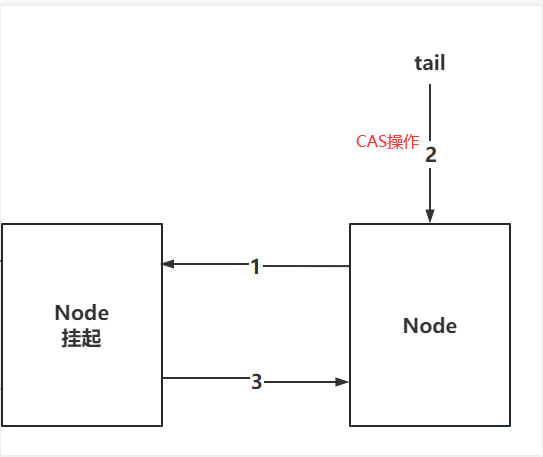
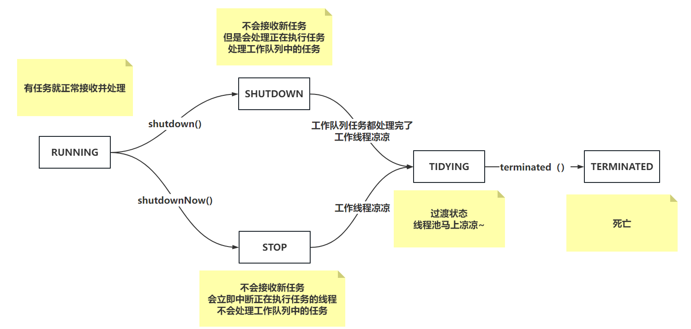
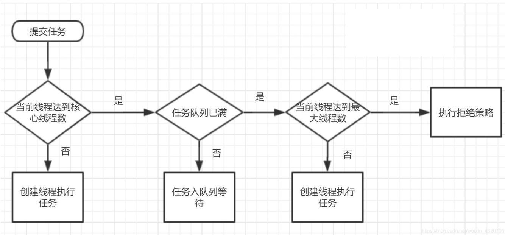

# 一、AQS高频问题

## 1.1 AQS是什么？

AQS是一个抽象队列同步器，abstract queued sychronizer，本质上就是一个抽象类。

AQS中有一个核心属性state，其次还有一个双向链表以及一个单向链表。

首先state是基于volatile修饰，再基于CAS修改，同时可以保证三大特性（原子、有序、可见）

其次还提供一个双向链表，有Node对象组成的双向链表。

最后在Condition内部类中，还提供了一个由Node对象组成的单向链表。

AQS是JUC下大量工具的基础类，很多工具都基于AQS实现的，比如lock锁，CountDownLatch，Semaphore，线程池等等都用到了AQS。

---

state是啥：state就是一个int类型的数值，同步状态，至于到底是什么状态，看子类的视线。

condition和单向链表是啥：都知道sync内部提供了wait方法和notify方法的使用，lock锁也需要实现这种机制。lock锁就基于AQS内部的Conditon实现了await和signal方法。（对标sync的wait和notify）

---

sync在线程持有锁时，执行wait方法，会将线程扔到WaitSet等待池队列中排队，等待唤醒

lock在线程持有锁时，执行await方法，会将线程封装为Node对象，扔到Condition单向链表中，等待唤醒。

---

Condition在做什么：将持有锁的线程封装为Node扔到Condition单向链表，同时挂起线程。如果线程唤醒了，就将Condition中的Node扔到AQS的双向链表等待获取锁。

## 1.2 唤醒线程时，AQS为什么从后往前遍历？

如果线程没有获取到资源，就需要将线程封装为Node对象，安排到AQS的双向链表中排队，并且可能会挂起线程。

如果在唤醒线程时，head节点的nexy是第一个要被唤醒的，如果head的next节点取消了，AQS的逻辑是从tail节点往前遍历，找到离head最近的有效节点？

想解释清楚这个问题，需要先了解，一个Node对象，是如何添加到双向链表中的

基于addWait方法中，是将当前Node的prev指向tail的节点，再将tail指向我自己，再让prev节点指向我。

如下图，如果只执行到了2步骤，此时Node加入到了AQS队列中，但是从prev节点往后，会找不到当前节点。




## 1.3 AQS为什么用双向链表，（为啥不用单向链表）？

因为在AQS中，存在取消节点的操作，节点被取消后，需要从AQS的双向链表中断开操作。

还需要保证双向链表的完整性：

- 需要将prev节点的next指针，执行next节点
- 需要将next节点的prev指针，指向prev节点

如果正常的双向链表，直接操作就可以了。

但是如果使用单向链表，需要遍历整个单向链表才能完成上述的操作，比较浪费资源。

## 1.4 AQS为什么要有一个虚拟的head节点

有一个哨兵节点，更方便操作。（再刷算法的时候，可以减少不必要得我空判断）

另一个是因为AQS内部，每个Node都会有一些状态，这个状态不单单针对自己，还针对后续节点

- 1：当前节点取消了
- 0：默认状态，啥事没有
- -1：当前节点的后续节点，挂起了
- -2：代表当前节点在Condition队列中（await将线程挂起了）
- -3：代表当前是共享锁，唤醒时，后续节点依然需要被唤醒

Node节点的ws（waitStatus），表示很多信息，除了当前节点的状态，还会维护后续节点的状态。

如果取消虚拟的head节点，一个节点无法同时保存当前节点状态和后续节点状态。

同时，在释放锁资源时，就是基于head节点的状态是否是-1。来决定是否唤醒后续节点。

如果是-1，正常唤醒

如果不是-1，不需要唤醒，减少了一次可能发生的遍历操作，提升性能。

## 1.5 ReentrantLock的底层实现原理

ReentrantLock是基于AQS实现的。

在线程基于ReentrantLock加锁时，需要基于CAS去修改state属性，如果能从0改为1，代表获取锁资源成功

如果CAS失败了，添加到AQS的双向链表中排队（可能会挂起线程），等待获取锁。

持有锁的线程，如果执行了condition的await方法，线程会封装为Node添加到Condition的单向链表中，等待被唤醒并且重新竞争锁资源

Java中除了一会降到的线程池中worker的锁之外，都是可重入锁。

**在基础面试题中，说到了：Synchronizer和ReentrantLock的区别**

## 1.6 ReentrantLock 的公平锁和非公平锁的区别？

注意，想回答的准确些，就别举生活中的列子，用源码的角度去说。

如果用生活中的例子，你就要用有些人没素质，但是又有素质。

**源码：**

- 公平锁和非公平锁中的lock方法和tryAcquire方法的实现有一内内不同，其他都一样
  - 非公平锁lock：直接尝试将state从0改为1，如果成功，拿锁直接走，如果失败了，执行tryAcuqire
  - 公平锁的lock：直接执行tryAcquire
  - 非公平锁的tryAcquire：如果当前没有现成持有锁资源，直接再次尝试将state从0改为1，如果成功，拿锁直接走
  - 公平锁的tryAcquire：如果当前没有线程持有锁，先看一下，有排队的吗。
    - 如果没有排队的，直接尝试将state从0改为1
    - 如果有排队的，第一名不是我，不抢，继续等待
    - 如果有排队的，我是第一名，直接尝试将state从0改为1
  - 如果都没有拿到锁，公平锁和非公平锁的后续逻辑都是一样的。排队后，就不存在所谓的插队。

生活中的例子：非公平锁会有机会尝试强行获取锁资源**两次**，成功开开心心走人，失败，消消停停去排队。

* 有个人前来做核酸
  * 公平锁：先看眼，有排队的么，有就去排队
  * 非公平锁：不管什么情况，先尝试做凳子上。如果坐上了，直接被扣，扣完走人，如果没做到凳子上
    * 有人正在扣嗓子眼么？
      * 没人正在被扣，上去尝试做凳子上！成功了，扣完走人。
      * 如果有人正在扣，消停去排队。

Q：为什么是两次？

A：非公平锁在获取锁的资源时，只会进行一次强行获取，如果获取失败则会通过一次重试再次尝试获取锁。所以非公平锁只有一个强行获取的机会和一次重试的机会，一共有两次机会。

如果再次尝试失败，就会按顺序加入到等待队列中等待其他线程释放锁资源，等待队列中的线程会逐个尝试获取锁资源。那些排在队列前面的线程会有更多的机会获得锁资源，但对于越往后排队的线程来说，获得锁资源的机会就越小。

## 1.7 ReentrantReadWriteLock 如何实现的读写锁

如果一个操作写少读多，还用互斥锁的话，性能太低，因为读读不存在并发问题。

怎么解决啊，有读写锁的出现。

ReentrantReadWriteLock也是基于AQS实现的一个读写锁，但是锁资源用state标识。

如何基于一个int来表示两个锁信息，有写锁，有读锁，怎么做的？

一个int，占32个bit位。

在写锁获取锁时，基于CAS修改state的低16位的值。

在读锁获取锁时，基于CAS修改state的高16位的值。

写锁的重入，基于state低16位去标识，因为读锁是共享的，可以多个线程同时持有。所以读锁的重入用的是ThreadLocal来表示，同时也会对state的高16位进行追加。

# 二、阻塞队列高频问题

## 2.1 说下熟悉的阻塞队列

ArrayBlockingQueue，LinkedBlockingQueue，PriorityBlockingQueue

ArrayBlockingQueue：底层是基于数组实现的，记得new的时候设置好边界。

LinkedBlockingQueue：底层是基于链表实现的，可以认为是无界队列，但是可以设置长度。

PriorityBlockingQueue：底层是基于数组实现的二叉堆，可以认为是无界队列，因为数组会扩容。

PriorityBlockingQueue：是ScheduleThreadPoolExecutor定时任务线程池用的阻塞队列跟PriorityBlockingQueue的底层实现是一样的。（其实本质用的是DelayedWorkerQueue）

## 2.2 虚假唤醒是什么？

虚假唤醒在阻塞队列的源码中是有体现的。

比如消费者1在消费数据时，会优先判断队列是否有元素，如果元素个数是0，消费者1会挂起。

此处判断元素为0的位置，如果用if循环会导致出现一个问题。

如果生产者添加了一个数据，会唤醒消费者1.

但是如果消费者1没拿到锁资源，消费者2拿到了锁资源并带走了数据的话。

消费者1再次拿到锁资源时，无法从队列获取到任何元素。导致出现逻辑问题。

解决方案，将判断元素个数的位置，设置成while判断。

```java
// ArrayBlockingQueue中的take方法
public E take() throws InterruptedException {
    final ReentrantLock lock = this.lock;
    lock.lockInterruptibly();
    try {
        while (count == 0)
            notEmpty.await();
        return dequeue();
    } finally {
        lock.unlock();
    }
}
```

# 三、线程池高频问题：（最重要的点）

## 3.1 线程池的7个参数（不会就回家等通知）

corePoolSize：核心线程数

maxinumPoolSize：最大线程数

keepAliveTime：最大空闲时间

unit：最大空闲时间的单位

workerQueue：阻塞队列

threadFactory：线程工厂

handler：拒绝策略

## 3.2 线程池的状态有什么，如何记录的？

线程池不是什么时候都接活的！

线程池有5个状态。



线程池的状态是在ctl属性中记录的。本质就是int类型

```shell
private final AtomicInteger ctl = new AtomicInteger(*ctlOf*(*RUNNING*, 0));
```

ctl的高三位记录线程池状态

低29位，记录工作线程个数。即便你指定的线程最大数量是Integer.MAX_VALUE它也到不了

**所以如果有人问线程池的个数最大是多少，就是2的29次方**

## 3.3 线程池常见的拒绝策略（不会就回家等通知）

- AbortPolicy：抛异常（默认）

```java
    /**
     * A handler for rejected tasks that throws a
     * {@code RejectedExecutionException}.
     */
    public static class AbortPolicy implements RejectedExecutionHandler {
        /**
         * Creates an {@code AbortPolicy}.
         */
        public AbortPolicy() { }

        /**
         * Always throws RejectedExecutionException.
         *
         * @param r the runnable task requested to be executed
         * @param e the executor attempting to execute this task
         * @throws RejectedExecutionException always
         */
        public void rejectedExecution(Runnable r, ThreadPoolExecutor e) {
            throw new RejectedExecutionException("Task " + r.toString() +
                                                 " rejected from " +
                                                 e.toString());
        }
    }
```

- CallerRunsPolicy：谁提交的任务，谁执行。异步变同步

```java
    /**
     * A handler for rejected tasks that runs the rejected task
     * directly in the calling thread of the {@code execute} method,
     * unless the executor has been shut down, in which case the task
     * is discarded.
     */
    public static class CallerRunsPolicy implements RejectedExecutionHandler {
        /**
         * Creates a {@code CallerRunsPolicy}.
         */
        public CallerRunsPolicy() { }

        /**
         * Executes task r in the caller's thread, unless the executor
         * has been shut down, in which case the task is discarded.
         *
         * @param r the runnable task requested to be executed
         * @param e the executor attempting to execute this task
         */
        public void rejectedExecution(Runnable r, ThreadPoolExecutor e) {
            if (!e.isShutdown()) {
                r.run();
            }
        }
    }
```

- DiscardPolicy：任务直接不要

```java
    /**
     * A handler for rejected tasks that silently discards the
     * rejected task.
     */
    public static class DiscardPolicy implements RejectedExecutionHandler {
        /**
         * Creates a {@code DiscardPolicy}.
         */
        public DiscardPolicy() { }

        /**
         * Does nothing, which has the effect of discarding task r.
         *
         * @param r the runnable task requested to be executed
         * @param e the executor attempting to execute this task
         */
        public void rejectedExecution(Runnable r, ThreadPoolExecutor e) {
        }
    }
```

- DiscardOldestPolicy：把最早放进去的任务丢失，再次尝试将当前任务交给线程池处理

```java
/**
     * A handler for rejected tasks that discards the oldest unhandled
     * request and then retries {@code execute}, unless the executor
     * is shut down, in which case the task is discarded.
     */
    public static class DiscardOldestPolicy implements RejectedExecutionHandler {
        /**
         * Creates a {@code DiscardOldestPolicy} for the given executor.
         */
        public DiscardOldestPolicy() { }

        /**
         * Obtains and ignores the next task that the executor
         * would otherwise execute, if one is immediately available,
         * and then retries execution of task r, unless the executor
         * is shut down, in which case task r is instead discarded.
         *
         * @param r the runnable task requested to be executed
         * @param e the executor attempting to execute this task
         */
        public void rejectedExecution(Runnable r, ThreadPoolExecutor e) {
            if (!e.isShutdown()) {
                e.getQueue().poll();
                e.execute(r);
            }
        }
    }
```

一般情况下，线程池自带的无法满足业务时，需要自定义一个线程池的拒绝策略。

实现下面的接口即可。

```java
package java.util.concurrent;

/**
 * A handler for tasks that cannot be executed by a {@link ThreadPoolExecutor}.
 *
 * @since 1.5
 * @author Doug Lea
 */
public interface RejectedExecutionHandler {

    /**
     * Method that may be invoked by a {@link ThreadPoolExecutor} when
     * {@link ThreadPoolExecutor#execute execute} cannot accept a
     * task.  This may occur when no more threads or queue slots are
     * available because their bounds would be exceeded, or upon
     * shutdown of the Executor.
     *
     * <p>In the absence of other alternatives, the method may throw
     * an unchecked {@link RejectedExecutionException}, which will be
     * propagated to the caller of {@code execute}.
     *
     * @param r the runnable task requested to be executed
     * @param executor the executor attempting to execute this task
     * @throws RejectedExecutionException if there is no remedy
     */
    void rejectedExecution(Runnable r, ThreadPoolExecutor executor);
}
```

## 3.4 线程池执行流程（不会就回家等通知）

核心线程不是new完就构建的，是懒加载的机制，添加任务才会构建核心线程



> 假设线程成设置的参数是：2个核心线程 5个最大线程 阻塞队列长度为2
>
> 来一个线程A，创建一个核心线程
>
> 再来一个线程B，再创建一个核心线程
>
> 再来一个线程C，此时线程达到核心线程数，C 放入到队列中
>
> 再来一个线程D，此时线程达到核心线程数，D 放入到队列中
>
> 再来一个线程E，此时线程达到核心线程数，队列已经满了，创建一个非核心线程数执行E
>
> 再来一个线程F，此时线程达到核心线程数，队列已经满了，创建一个非核心线程数执行F
>
> 再来一个线程G，此时线程达到核心线程数，队列已经满了，创建一个非核心线程数执行G
>
> 如果此时再来一个，则执行拒绝策略

## 3.5 线程池为什么添加空任务的非核心线程

```java
/**
     * Executes the given task sometime in the future.  The task
     * may execute in a new thread or in an existing pooled thread.
     *
     * If the task cannot be submitted for execution, either because this
     * executor has been shutdown or because its capacity has been reached,
     * the task is handled by the current {@code RejectedExecutionHandler}.
     *
     * @param command the task to execute
     * @throws RejectedExecutionException at discretion of
     *         {@code RejectedExecutionHandler}, if the task
     *         cannot be accepted for execution
     * @throws NullPointerException if {@code command} is null
     */
    public void execute(Runnable command) {
        if (command == null)
            throw new NullPointerException();
        /*
         * Proceed in 3 steps:
         *
         * 1. If fewer than corePoolSize threads are running, try to
         * start a new thread with the given command as its first
         * task.  The call to addWorker atomically checks runState and
         * workerCount, and so prevents false alarms that would add
         * threads when it shouldn't, by returning false.
         *
         * 2. If a task can be successfully queued, then we still need
         * to double-check whether we should have added a thread
         * (because existing ones died since last checking) or that
         * the pool shut down since entry into this method. So we
         * recheck state and if necessary roll back the enqueuing if
         * stopped, or start a new thread if there are none.
         *
         * 3. If we cannot queue task, then we try to add a new
         * thread.  If it fails, we know we are shut down or saturated
         * and so reject the task.
         */
        int c = ctl.get();
        if (workerCountOf(c) < corePoolSize) {
            if (addWorker(command, true))
                return;
            c = ctl.get();
        }
        if (isRunning(c) && workQueue.offer(command)) {
            int recheck = ctl.get();
            if (! isRunning(recheck) && remove(command))
                reject(command);
            else if (workerCountOf(recheck) == 0)
                // 添加一个空任务的非核心线程数
                addWorker(null, false);
        }
        else if (!addWorker(command, false))
            reject(command);
    }
```

// 添加一个空任务的非核心线程数
 `addWorker(null, false);`

**避免线程池出现工作队列有任务，但是没有工作线程处理。**

线程池可以设置核心线程数是0个。这样，任务扔到阻塞队列，但是没有工作线程，这不凉凉了么~~

```java
import java.util.concurrent.LinkedBlockingDeque;
import java.util.concurrent.ThreadPoolExecutor;
import java.util.concurrent.TimeUnit;

public class ThreadPoolTest {

    public static void main(String[] args) {

        ThreadPoolExecutor threadPoolExecutor = new ThreadPoolExecutor(0, 2, 10, TimeUnit.SECONDS, new LinkedBlockingDeque<>(2));

        threadPoolExecutor.execute(new Thread(() -> {
            System.out.printf("test");
        }));

        threadPoolExecutor.shutdown();

    }
}
```

> 上面的任务会执行吗？肯定会执行的。
>
> 根据线程池的执行流程，如果核心线程数是0（相当于满了），就会放入到队列中，我队列设置的是2，此时队列是没有满的，直接会将任务放入到队列中等待。如果此时没有工作线程，那么上面是不会执行的。
>
> 所以就添加了一个空任务的非核心线程

线程池中的核心线程不是一定不会被回收，线程池中有一个属性，如果设置为true，核心线程也会被干掉

```java
/**
     * If false (default), core threads stay alive even when idle.
     * If true, core threads use keepAliveTime to time out waiting
     * for work.
     */
private volatile boolean allowCoreThreadTimeOut;
```

## 3.6 在没任务时，线程池中的工作线程在干嘛？

线程会挂起，默认核心线程是WAITING状态，非核心是TIMED_WAITING

如果是核心线程，默认情况下，会在阻塞队列的位置执行take方法，直到拿到任务为止。

如果是非核心线程，默认情况下，会在阻塞队列的位置执行poll方法，等待最大空闲时间，如果没任务，直接拉走咔嚓掉，如果有活，那就正常干。

```java
public E take() throws InterruptedException {
        final ReentrantLock lock = this.lock;
        lock.lockInterruptibly();
        try {
            while (count == 0)
                notEmpty.await();
            return dequeue();
        } finally {
            lock.unlock();
        }
    }

    public E poll(long timeout, TimeUnit unit) throws InterruptedException {
        long nanos = unit.toNanos(timeout);
        final ReentrantLock lock = this.lock;
        lock.lockInterruptibly();
        try {
            while (count == 0) {
                if (nanos <= 0)
                    return null;
                nanos = notEmpty.awaitNanos(nanos);
            }
            return dequeue();
        } finally {
            lock.unlock();
        }
    }
```

> 上面是ArrayBlockingQueue队列中的两个方法

## 3.7 工作线程出现异常会导致什么问题？

**是否抛出异常、影响其他线程吗、工作线程会嘎嘛？**

如果任务是execute方法执行的，工作线程会将异常抛出。

如果任务是submit方法执行的futureTask，工作线程会将异常捕获并保存到FutureTask里，可以基于futureTask的get得到异常信息

出现异常的工作线程不会影响到其他的工作线程。

runWorker中的异常会被抛到run方法中，run方法会异常结束，run方法结束，线程就嘎了！

如果是submit，异常没抛出来，那就不嘎~

## 3.8 工作线程继承AQS的目的是什么？

工作线程的本质，就是Worker对象

继承AQS跟shutdown和shutdownNow有关系。

如果是shutdown，会中断空闲的工作线程，基于Worker实现的AQS中的state的值来判断能否中断工作线程。

如果工作线程的state是0，代表空闲，可以中断，如果是1，代表正在干活。

如果是shutdownNow，直接强制中断所有工作线程

## 3.9 核心参数怎么设置？

**如果面试问到，你项目中的线程池参数设置的是多少，你先给个准确的数字和配置。别上来就说怎么设置！！**

线程池的目的是为了充分发挥CPU的资源。提升整个系统的性能。

系统内部不同业务的线程池参考的方式也不一样。

如果是CPU密集的任务，一般也就是CPU内核数 + 1的核心线程数。这样足以充分发挥CPU性能。

如果是IO密集的任务，因为IO的程度不一样的啊，有的是1s，有的是1ms，有的是1分钟，所以IO密集的任务在用线程池处理时，一定要通过压测的方式，观察CPU资源的占用情况，来决定核心线程数。一般发挥CPU性能到70~80足矣。所以线程池的参数设置需要通过压测以及多次调整才能得出具体的。

比如一个业务要查询三个服务